# Реалізація RBAC у NestJS

## Короткий зміст

У цій лекції детально вивчається практична реалізація рольового контролю доступу (Role-Based Access Control) у NestJS:

- **Концепція ролей** — визначення enum для ролей (admin, editor, user, guest), присвоєння ролей користувачам через поле `role` у Entity
- **Ієрархія ролей** — успадкування прав (admin має всі права editor + додаткові), порядок перевірки ролей
- **Декоратор @Roles()** — створення кастомного декоратора для позначення необхідних ролей на рівні контролера або маршруту, використання `SetMetadata()` для збереження метаданих
- **RolesGuard** — реалізація Guard для перевірки ролей, використання `Reflector` для читання метаданих з `@Roles()`, доступ до `request.user` для отримання ролі поточного користувача
- **Захист маршрутів** — застосування `@UseGuards(JwtAuthGuard, RolesGuard)` для захисту ендпоінтів, порядок виконання Guards (спочатку автентифікація, потім авторизація)
- **Множинні ролі** — підтримка кількох ролей для одного маршруту `@Roles('admin', 'editor')`, логіка OR vs AND для перевірки

Розглядаються практичні приклади захисту адміністративних панелей, CRUD операцій з різними правами для різних ролей, обробка 403 Forbidden при відсутності потрібної ролі.

---

::card-group

::card{title="🎯 Мета лекції" icon="i-lucide-target"}

- Реалізувати повноцінну систему рольового контролю доступу у NestJS застосунку.
- Створити кастомні декоратори та Guards для декларативного захисту маршрутів.
- Опанувати механізм Reflector API для роботи з метаданими у NestJS.
- Навчитися проєктувати ієрархію ролей із успадкуванням дозволів.
- Інтегрувати RBAC з JWT-автентифікацією та TypeORM для персистентності ролей.

::

::card{title="🔑 Ключові терміни" icon="i-lucide-key"}

- **Role (Роль):** іменована сукупність дозволів, що відповідає функції у системі.
- **Guard:** клас у NestJS, що реалізує інтерфейс `CanActivate` для контролю доступу до маршрутів.
- **Reflector:** сервіс NestJS для читання метаданих, прикріплених до класів та методів через декоратори.
- **Metadata:** додаткова інформація, що зберігається разом із визначенням класу/методу та доступна під час виконання.
- **Role Hierarchy (Ієрархія ролей):** механізм, де вищі ролі автоматично успадковують дозволи нижчих.

::

::

---

## Архітектурний контекст: RBAC у конвеєрі обробки запитів

У попередній лекції ми розглянули теоретичні засади чотирьох моделей контролю доступу: DAC, MAC, RBAC та ABAC. Тепер перейдемо до практичної реалізації найпоширенішої з них — **рольового контролю доступу** (*Role-Based Access Control, RBAC*) у фреймворку NestJS.

RBAC є оптимальним вибором для більшості бізнес-застосунків завдяки балансу між гнучкістю та складністю. На відміну від DAC, де кожен користувач індивідуально налаштовує доступ до власних ресурсів, RBAC централізує управління через ролі, що відображають організаційну структуру компанії.

### Місце RBAC у конвеєрі безпеки NestJS

Фреймворк NestJS будує конвеєр обробки HTTP-запитів через послідовність компонентів, кожен із яких виконує специфічну функцію. **Guards** (*охоронці*) є четвертим етапом цього конвеєра і відповідають за авторизацію:

::mermaid

```mermaid
graph LR
    A[HTTP Request] --> B[Middleware]
    B --> C[Global Guards]
    C --> D[Controller Guards]
    D --> E[Route Guards]
    E --> F[Interceptors<br/>Before]
    F --> G[Pipes]
    G --> H[Route Handler]
    H --> I[Interceptors<br/>After]
    I --> J[Exception Filters]
    J --> K[HTTP Response]
    
    style A fill:#3b82f6,stroke:#1d4ed8,color:#ffffff
    style C fill:#f59e0b,stroke:#b45309,color:#ffffff
    style D fill:#f59e0b,stroke:#b45309,color:#ffffff
    style E fill:#f59e0b,stroke:#b45309,color:#ffffff
    style H fill:#10b981,stroke:#047857,color:#ffffff
    style K fill:#3b82f6,stroke:#1d4ed8,color:#ffffff
```



::

**Пояснення етапів конвеєра:**

1. **Middleware:** глобальні функції обробки, що виконуються для всіх запитів (логування, CORS, парсинг тіла запиту).
2. **Guards:** перевірка автентифікації та авторизації. Можуть бути застосовані на трьох рівнях: глобально, на рівні контролера, на рівні окремого маршруту.
3. **Interceptors (Before):** трансформація вхідних даних, логування часу виконання, кешування.
4. **Pipes:** валідація та трансформація параметрів запиту (DTO validation).
5. **Route Handler:** виконання бізнес-логіки контролера.
6. **Interceptors (After):** трансформація відповіді, додавання заголовків.
7. **Exception Filters:** обробка помилок та формування HTTP відповідей з відповідними статус-кодами.

::note
У цій лекції ми зосередимося на етапі **Guards**, де відбувається перевірка ролей користувача після того, як його ідентичність підтверджена через JWT-токен (*JwtAuthGuard*). Наш **RolesGuard** буде виконуватися **після** автентифікації, оскільки для перевірки ролі нам потрібен об'єкт `request.user`, встановлений попереднім Guard.
::

---

## Визначення enum для ролей

Перший крок у реалізації RBAC — визначення переліку ролей, що існують у системі. У TypeScript найкращою практикою є використання `enum` (*enumeration* — перелік), що забезпечує типобезпеку та автодоповнення у редакторі коду.

### Створення базового enum ролей

```typescript
// src/common/enums/role.enum.ts

/**
 * Перелік ролей користувачів у системі.
 * Ролі визначають набір дозволів для доступу до ресурсів.
 */
export enum Role {
  /**
   * Адміністратор — повний доступ до всіх ресурсів та адміністративних функцій.
   * Може керувати користувачами, ролями, налаштуваннями системи.
   */
  ADMIN = 'admin',

  /**
   * Редактор — може створювати, редагувати та видаляти контент.
   * Не має доступу до адміністративних функцій та управління користувачами.
   */
  EDITOR = 'editor',

  /**
   * Користувач — базова роль для автентифікованих користувачів.
   * Може переглядати контент, редагувати власний профіль, створювати коментарі.
   */
  USER = 'user',

  /**
   * Гість — обмежений доступ для неавтентифікованих користувачів.
   * Може лише переглядати публічний контент без можливості взаємодії.
   */
  GUEST = 'guest',
}
```

**Чому використовувати string enum замість numeric enum:**

У TypeScript існує два типи enum: числові (*numeric enum*) та рядкові (*string enum*). Для ролей завжди використовуйте **string enum** з таких причин:

- **Читабельність у логах та базі даних:** коли ви побачите `"admin"` у записі бази даних або логах, одразу зрозумієте, про яку роль йдеться. Числове значення `0` або `1` вимагає пошуку у коді для розшифрування.
- **Стабільність при рефакторингу:** якщо ви додаєте нову роль між існуючими у numeric enum, всі числові значення зміщуються, що призводить до несумісності з існуючими даними у базі. String enum позбавлений цієї проблеми.
- **Інтероперабельність з API:** JSON-відповіді API виглядають зрозуміліше з `"role": "admin"` замість `"role": 0`.

::tip
**Іменування констант enum:** використовуйте UPPERCASE для ключів enum (`ADMIN`, `EDITOR`), але lowercase для значень (`'admin'`, `'editor'`). Це дозволяє зручно використовувати enum у коді (`Role.ADMIN`), але зберігати читабельні значення у базі даних.
::

### Розширений enum із категоризацією ролей

Для складніших систем можна визначити додаткові ролі для різних функціональних областей:

```typescript
// src/common/enums/role.enum.ts

export enum Role {
  // === Системні ролі ===
  SUPER_ADMIN = 'super_admin', // Повний контроль, включаючи зміну конфігурації системи
  ADMIN = 'admin',             // Управління користувачами та контентом

  // === Контентні ролі ===
  EDITOR = 'editor',           // Створення та редагування контенту
  AUTHOR = 'author',           // Створення власного контенту без прав на редагування чужого
  MODERATOR = 'moderator',     // Модерація коментарів та користувацького контенту

  // === Бізнес-ролі ===
  BILLING_ADMIN = 'billing_admin',     // Управління підписками та платежами
  SUPPORT_AGENT = 'support_agent',     // Доступ до тікетів підтримки
  ANALYTICS_VIEWER = 'analytics_viewer', // Перегляд аналітики та звітів

  // === Базові ролі ===
  USER = 'user',               // Звичайний автентифікований користувач
  GUEST = 'guest',             // Неавтентифікований відвідувач
}
```

::warning
**Проблема вибуху ролей (Role Explosion):** чим більше ролей ви створюєте, тим складніше стає адміністрування системи. Якщо ви виявите, що кількість ролей перевищує 15–20, розгляньте можливість міграції до моделі **RBAC з дозволами** (*permission-based RBAC*), де ролі складаються з дрібніших дозволів, або до **ABAC** для динамічних правил. У наступній лекції ми розглянемо саме такий підхід.
::

---

## Додавання поля `role` до Entity користувача

Після визначення enum ролей необхідно додати поле для збереження ролі у сутності користувача (*User entity*). Використовуємо TypeORM для персистентності даних.

### Розширення User Entity

```typescript
// src/users/entities/user.entity.ts
import { Entity, Column, PrimaryGeneratedColumn, CreateDateColumn, UpdateDateColumn } from 'typeorm';
import { Role } from '../../common/enums/role.enum';

@Entity('users')
export class User {
  @PrimaryGeneratedColumn('uuid')
  id: string;

  @Column({ unique: true })
  email: string;

  @Column()
  password: string; // Хеш пароля через bcrypt

  @Column({ nullable: true })
  firstName: string;

  @Column({ nullable: true })
  lastName: string;

  @Column({
    type: 'enum',
    enum: Role,
    default: Role.USER,
  })
  role: Role;

  @Column({ default: true })
  isActive: boolean;

  @CreateDateColumn()
  createdAt: Date;

  @UpdateDateColumn()
  updatedAt: Date;
}
```

**Пояснення конфігурації поля `role`:**

- **`type: 'enum'`** — вказує TypeORM, що у базі даних має створюватися стовпець типу `ENUM` (підтримується PostgreSQL, MySQL). Для SQLite автоматично використовується `TEXT` з валідацією на рівні застосунку.
- **`enum: Role`** — передає об'єкт enum, що містить дозволені значення.
- **`default: Role.USER`** — кожен новостворений користувач автоматично отримує роль `user`. Це забезпечує принцип **найменших привілеїв** (*principle of least privilege*) — користувач починає з мінімальних прав, які можуть бути підвищені адміністратором.

### Міграція бази даних для додавання поля `role`

Після зміни Entity необхідно створити міграцію для оновлення схеми бази даних:

```bash
# Генерація міграції на основі змін у Entity
npm run typeorm migration:generate -- -n AddRoleToUser

# Застосування міграції до бази даних
npm run typeorm migration:run
```

**Згенерована міграція (приклад для PostgreSQL):**

```typescript
// src/migrations/1693564800000-AddRoleToUser.ts
import { MigrationInterface, QueryRunner } from 'typeorm';

export class AddRoleToUser1693564800000 implements MigrationInterface {
  public async up(queryRunner: QueryRunner): Promise<void> {
    await queryRunner.query(`
      CREATE TYPE "role_enum" AS ENUM ('super_admin', 'admin', 'editor', 'author', 'moderator', 'billing_admin', 'support_agent', 'analytics_viewer', 'user', 'guest');
    `);

    await queryRunner.query(`
      ALTER TABLE "users" 
      ADD COLUMN "role" "role_enum" NOT NULL DEFAULT 'user';
    `);
  }

  public async down(queryRunner: QueryRunner): Promise<void> {
    await queryRunner.query(`
      ALTER TABLE "users" DROP COLUMN "role";
    `);

    await queryRunner.query(`
      DROP TYPE "role_enum";
    `);
  }
}
```

::note
**Підтримка множинних ролей:** у базовій реалізації RBAC кожен користувач має **одну** роль. Якщо потрібна підтримка множинних ролей (наприклад, користувач одночасно є `editor` та `billing_admin`), змініть поле `role` на масив: `@Column('enum', { enum: Role, array: true, default: [Role.USER] })`. Це створить стовпець типу `role_enum[]` у PostgreSQL. Для інших СУБД може знадобитися зв'язокMany-to-Many через проміжну таблицю `user_roles`.
::


---

## Включення ролі у JWT payload

Після автентифікації користувача система видає JWT токен, що містить інформацію про користувача (*payload*). Щоб уникнути додаткових запитів до бази даних при кожній перевірці ролі, включаємо роль безпосередньо у токен.

### Модифікація сервісу автентифікації

```typescript
// src/auth/auth.service.ts
import { Injectable, UnauthorizedException } from '@nestjs/common';
import { JwtService } from '@nestjs/jwt';
import { UsersService } from '../users/users.service';
import * as bcrypt from 'bcrypt';

@Injectable()
export class AuthService {
  constructor(
    private usersService: UsersService,
    private jwtService: JwtService,
  ) {}

  async signIn(email: string, password: string) {
    // Знаходимо користувача за email
    const user = await this.usersService.findByEmail(email);

    if (!user) {
      throw new UnauthorizedException('Invalid credentials');
    }

    // Перевіряємо пароль
    const isPasswordValid = await bcrypt.compare(password, user.password);

    if (!isPasswordValid) {
      throw new UnauthorizedException('Invalid credentials');
    }

    // Перевіряємо, чи активний обліковий запис
    if (!user.isActive) {
      throw new UnauthorizedException('Account is deactivated');
    }

    // Формуємо payload токена з включенням ролі
    const payload = {
      sub: user.id,
      email: user.email,
      role: user.role,  // <-- Роль включається у токен
    };

    const accessToken = await this.jwtService.signAsync(payload);

    return {
      access_token: accessToken,
      user: {
        id: user.id,
        email: user.email,
        firstName: user.firstName,
        lastName: user.lastName,
        role: user.role,
      },
    };
  }

  async register(createUserDto: CreateUserDto) {
    // Хешуємо пароль
    const hashedPassword = await bcrypt.hash(createUserDto.password, 10);

    // Створюємо користувача з роллю USER за замовчуванням
    const user = await this.usersService.create({
      ...createUserDto,
      password: hashedPassword,
      role: Role.USER, // Явне встановлення ролі (хоча вона і так є default у Entity)
    });

    // Генеруємо токен для автоматичного входу після реєстрації
    const payload = {
      sub: user.id,
      email: user.email,
      role: user.role,
    };

    const accessToken = await this.jwtService.signAsync(payload);

    return {
      access_token: accessToken,
      user: {
        id: user.id,
        email: user.email,
        role: user.role,
      },
    };
  }
}
```

### Оновлення JwtAuthGuard для витягування ролі

Після того, як токен декодується у `JwtAuthGuard`, об'єкт `request.user` містить payload токена, включаючи роль:

```typescript
// src/auth/guards/jwt-auth.guard.ts
import { Injectable, ExecutionContext, UnauthorizedException } from '@nestjs/common';
import { AuthGuard } from '@nestjs/passport';
import { Reflector } from '@nestjs/core';
import { IS_PUBLIC_KEY } from '../decorators/public.decorator';

@Injectable()
export class JwtAuthGuard extends AuthGuard('jwt') {
  constructor(private reflector: Reflector) {
    super();
  }

  canActivate(context: ExecutionContext) {
    // Перевірка, чи маршрут позначений декоратором @Public()
    const isPublic = this.reflector.getAllAndOverride<boolean>(IS_PUBLIC_KEY, [
      context.getHandler(),
      context.getClass(),
    ]);

    if (isPublic) {
      return true;
    }

    // Виконуємо стандартну перевірку JWT токена
    return super.canActivate(context);
  }

  handleRequest(err, user, info) {
    if (err || !user) {
      throw err || new UnauthorizedException('Invalid or expired token');
    }

    // user тут — це декодований JWT payload з полями: sub, email, role
    return user;
  }
}
```

**Структура `request.user` після автентифікації:**

```typescript
// Після виконання JwtAuthGuard
request.user = {
  sub: '550e8400-e29b-41d4-a716-446655440000', // UUID користувача
  email: 'ivan.petrenko@example.com',
  role: 'editor', // Роль з enum
  iat: 1693564800, // Issued At (час видачі токена)
  exp: 1693568400, // Expiration Time (час закінчення терміну дії)
};
```

::warning
**Зміна ролі та недійсність старих токенів:** JWT токени є **самодостатніми** (*self-contained*) — вони містять всю інформацію всередині себе і не вимагають перевірки у базі даних. Це означає, що якщо адміністратор змінить роль користувача у базі даних з `user` на `admin`, ця зміна **не вплине** на вже видані токени до моменту їхнього застарівання. Рішення: використовуйте короткий термін життя access token (15–30 хвилин) та refresh token для оновлення, або впровадьте blacklist токенів через Redis.
::

---

## Створення декоратора @Roles()

Декоратори у TypeScript — це спеціальні функції, що додають метадані до класів, методів або властивостей. NestJS активно використовує декоратори для декларативного визначення поведінки застосунку. Створимо кастомний декоратор `@Roles()` для позначення необхідних ролей на маршрутах.

### Реалізація декоратора

```typescript
// src/auth/decorators/roles.decorator.ts
import { SetMetadata } from '@nestjs/common';
import { Role } from '../../common/enums/role.enum';

/**
 * Ключ для збереження метаданих про необхідні ролі
 */
export const ROLES_KEY = 'roles';

/**
 * Декоратор для позначення необхідних ролей на маршруті або контролері.
 * Може приймати одну або кілька ролей.
 * 
 * @example
 * // Доступ лише для адміністраторів
 * @Roles(Role.ADMIN)
 * deleteUser() { ... }
 * 
 * @example
 * // Доступ для адміністраторів або редакторів
 * @Roles(Role.ADMIN, Role.EDITOR)
 * editPost() { ... }
 */
export const Roles = (...roles: Role[]) => SetMetadata(ROLES_KEY, roles);
```

**Пояснення реалізації:**

- **`SetMetadata(key, value)`** — функція NestJS, що прикріплює метадані до класу або методу. Ці метадані можна прочитати пізніше через сервіс `Reflector`.
- **`ROLES_KEY`** — рядкова константа, що використовується як ключ для збереження та читання метаданих. Винесена у окрему константу для уникнення магічних рядків (*magic strings*) та помилок друку.
- **`...roles: Role[]`** — rest-параметр, що дозволяє передавати будь-яку кількість ролей: `@Roles(Role.ADMIN)` або `@Roles(Role.ADMIN, Role.EDITOR, Role.MODERATOR)`.

### Альтернативний варіант з валідацією типів

Для додаткової типобезпеки можна обмежити декоратор прийняттям лише валідних ролей з enum:

```typescript
// src/auth/decorators/roles.decorator.ts
import { SetMetadata } from '@nestjs/common';
import { Role } from '../../common/enums/role.enum';

export const ROLES_KEY = 'roles';

/**
 * Типізований декоратор для ролей з автодоповненням
 */
export const Roles = (...roles: Role[]): MethodDecorator & ClassDecorator => {
  // Валідація: перевіряємо, що передано хоча б одну роль
  if (roles.length === 0) {
    throw new Error('@Roles decorator requires at least one role');
  }

  // Валідація: перевіряємо, що всі значення є валідними ролями
  const validRoles = Object.values(Role);
  roles.forEach(role => {
    if (!validRoles.includes(role)) {
      throw new Error(`Invalid role: ${role}. Must be one of: ${validRoles.join(', ')}`);
    }
  });

  return SetMetadata(ROLES_KEY, roles);
};
```

::tip
**Застосування декоратора на рівні контролера:** декоратор `@Roles()` можна застосовувати як до окремих методів маршрутів, так і до цілого контролера. Якщо застосувати до контролера, всі маршрути у ньому успадкують вимогу до ролей (якщо тільки окремий маршрут не перевизначить це через власний декоратор).

```typescript
@Controller('admin')
@Roles(Role.ADMIN) // Всі маршрути у цьому контролері доступні лише адміністраторам
export class AdminController {
  @Get('users')
  getAllUsers() { ... } // Автоматично вимагає роль ADMIN

  @Delete('users/:id')
  deleteUser() { ... } // Автоматично вимагає роль ADMIN
}
```
::

---

## Реалізація RolesGuard

Guard — це клас, що реалізує інтерфейс `CanActivate` з єдиним методом `canActivate()`, який повертає булеве значення або Promise булевого значення. Якщо метод повертає `true`, запит пропускається далі у конвеєр; якщо `false` або викидається виключення — запит відхиляється з відповідним HTTP-кодом.

### Базова реалізація RolesGuard

```typescript
// src/auth/guards/roles.guard.ts
import { Injectable, CanActivate, ExecutionContext, ForbiddenException } from '@nestjs/common';
import { Reflector } from '@nestjs/core';
import { ROLES_KEY } from '../decorators/roles.decorator';
import { Role } from '../../common/enums/role.enum';

@Injectable()
export class RolesGuard implements CanActivate {
  constructor(private reflector: Reflector) {}

  canActivate(context: ExecutionContext): boolean {
    // Крок 1: Читаємо необхідні ролі з метаданих маршруту або контролера
    const requiredRoles = this.reflector.getAllAndOverride<Role[]>(ROLES_KEY, [
      context.getHandler(), // Метод контролера (вищий пріоритет)
      context.getClass(),   // Клас контролера (нижчий пріоритет)
    ]);

    // Крок 2: Якщо ролі не вказані, дозволяємо доступ
    if (!requiredRoles || requiredRoles.length === 0) {
      return true;
    }

    // Крок 3: Витягуємо користувача з request (встановлений JwtAuthGuard)
    const request = context.switchToHttp().getRequest();
    const user = request.user;

    // Крок 4: Якщо користувач не автентифікований, відхиляємо
    if (!user || !user.role) {
      throw new ForbiddenException('User is not authenticated or role is missing');
    }

    // Крок 5: Перевіряємо, чи має користувач одну з необхідних ролей
    const hasRole = requiredRoles.includes(user.role);

    if (!hasRole) {
      throw new ForbiddenException(
        `Access denied: required roles are [${requiredRoles.join(', ')}], but user has role '${user.role}'`
      );
    }

    return true;
  }
}
```

**Покрокове пояснення логіки Guard:**

**Крок 1: Читання метаданих через Reflector**

`Reflector` — це сервіс NestJS, що надає API для читання метаданих, прикріплених до класів та методів через декоратори. Метод `getAllAndOverride()` читає метадані з кількох джерел та повертає значення з найвищим пріоритетом:

```typescript
const requiredRoles = this.reflector.getAllAndOverride<Role[]>(ROLES_KEY, [
  context.getHandler(), // Вищий пріоритет: метод контролера
  context.getClass(),   // Нижчий пріоритет: клас контролера
]);
```

Це означає, що якщо декоратор `@Roles()` застосовано і до класу, і до методу, використовується значення з **методу** (override). Приклад:

```typescript
@Controller('posts')
@Roles(Role.USER) // Базова вимога для всього контролера
export class PostsController {
  @Get()
  getAllPosts() {
    // Успадковує вимогу Role.USER з контролера
  }

  @Delete(':id')
  @Roles(Role.ADMIN) // Перевизначає вимогу лише для цього маршруту
  deletePost() {
    // Вимагає Role.ADMIN (ігнорує Role.USER з контролера)
  }
}
```

**Крок 2: Пропуск маршрутів без вимог до ролей**

Якщо декоратор `@Roles()` не застосовано до маршруту, Guard повертає `true` — доступ дозволяється всім автентифікованим користувачам (за умови, що `JwtAuthGuard` успішно виконався).

**Крок 3: Витягування користувача з request**

Об'єкт `request.user` встановлюється попереднім Guard (`JwtAuthGuard`) після успішної валідації JWT токена. Якщо токен був відсутній або недійсний, `JwtAuthGuard` вже відхилив запит, і до `RolesGuard` виконання не дійде.

**Крок 4: Перевірка наявності ролі**

Додаткова перевірка на випадок, якщо payload токена не містить поле `role` (наприклад, токен був виданий старою версією системи до впровадження ролей).

**Крок 5: Перевірка належності до необхідних ролей**

Метод `includes()` перевіряє, чи міститься роль користувача у масиві необхідних ролей. Це реалізує логіку **OR** (*логічне АБО*) — якщо маршрут вимагає `[Role.ADMIN, Role.EDITOR]`, користувач з роллю `EDITOR` отримає доступ.

::note
**Логіка OR vs AND для ролей:** базова реалізація використовує логіку **OR** — достатньо мати **одну** з вказаних ролей. Якщо потрібна логіка **AND** (користувач повинен мати **всі** вказані ролі одночасно), використовуйте масив ролей у `request.user` та метод `every()`:

```typescript
// Для підтримки множинних ролей (user.roles: Role[])
const hasAllRoles = requiredRoles.every(role => user.roles.includes(role));
```

Проте для більшості застосунків логіка OR є природною — користувач або `ADMIN`, або `EDITOR`, але рідко обидва одночасно.
::


---

## Реєстрація Guard у модулі

Після створення `RolesGuard` його необхідно зареєструвати як провайдер у модулі, щоб він був доступний для dependency injection:

```typescript
// src/auth/auth.module.ts
import { Module } from '@nestjs/common';
import { JwtModule } from '@nestjs/jwt';
import { PassportModule } from '@nestjs/passport';
import { UsersModule } from '../users/users.module';
import { AuthService } from './auth.service';
import { AuthController } from './auth.controller';
import { JwtStrategy } from './strategies/jwt.strategy';
import { JwtAuthGuard } from './guards/jwt-auth.guard';
import { RolesGuard } from './guards/roles.guard';

@Module({
  imports: [
    UsersModule,
    PassportModule,
    JwtModule.register({
      secret: process.env.JWT_SECRET,
      signOptions: { expiresIn: '1h' },
    }),
  ],
  controllers: [AuthController],
  providers: [
    AuthService,
    JwtStrategy,
    JwtAuthGuard,
    RolesGuard, // <-- Реєстрація RolesGuard
  ],
  exports: [
    AuthService,
    JwtAuthGuard,
    RolesGuard, // <-- Експорт для використання в інших модулях
  ],
})
export class AuthModule {}
```

::tip
**Глобальна реєстрація Guard:** якщо ви хочете, щоб `RolesGuard` автоматично застосовувався до всіх маршрутів у застосунку, зареєструйте його глобально у `main.ts`:

```typescript
// src/main.ts
import { NestFactory, Reflector } from '@nestjs/core';
import { AppModule } from './app.module';
import { JwtAuthGuard } from './auth/guards/jwt-auth.guard';
import { RolesGuard } from './auth/guards/roles.guard';

async function bootstrap() {
  const app = await NestFactory.create(AppModule);

  const reflector = app.get(Reflector);

  // Глобальна автентифікація для всіх маршрутів
  app.useGlobalGuards(new JwtAuthGuard(reflector));

  // Глобальна авторизація за ролями
  app.useGlobalGuards(new RolesGuard(reflector));

  await app.listen(3000);
}
bootstrap();
```

При глобальній реєстрації для публічних маршрутів (наприклад, реєстрація, вхід) використовуйте декоратор `@Public()` для обходу `JwtAuthGuard`.
::

---

## Застосування Guards до маршрутів

Тепер, коли всі компоненти готові, застосуємо їх для захисту маршрутів контролера. Розглянемо практичний приклад контролера для управління користувачами:

### Приклад: Контролер адміністрування користувачів

```typescript
// src/users/users.controller.ts
import {
  Controller,
  Get,
  Post,
  Put,
  Delete,
  Body,
  Param,
  UseGuards,
  Request,
} from '@nestjs/common';
import { JwtAuthGuard } from '../auth/guards/jwt-auth.guard';
import { RolesGuard } from '../auth/guards/roles.guard';
import { Roles } from '../auth/decorators/roles.decorator';
import { Role } from '../common/enums/role.enum';
import { UsersService } from './users.service';
import { UpdateUserDto } from './dto/update-user.dto';

@Controller('users')
@UseGuards(JwtAuthGuard, RolesGuard) // Застосовуємо Guards до всього контролера
export class UsersController {
  constructor(private usersService: UsersService) {}

  /**
   * Отримання профілю поточного користувача
   * Доступ: всі автентифіковані користувачі
   */
  @Get('me')
  getProfile(@Request() req) {
    return this.usersService.findById(req.user.sub);
  }

  /**
   * Оновлення власного профілю
   * Доступ: всі автентифіковані користувачі
   */
  @Put('me')
  updateProfile(@Request() req, @Body() updateDto: UpdateUserDto) {
    return this.usersService.update(req.user.sub, updateDto);
  }

  /**
   * Отримання списку всіх користувачів
   * Доступ: лише адміністратори
   */
  @Get()
  @Roles(Role.ADMIN)
  getAllUsers() {
    return this.usersService.findAll();
  }

  /**
   * Отримання користувача за ID
   * Доступ: адміністратори та модератори
   */
  @Get(':id')
  @Roles(Role.ADMIN, Role.MODERATOR)
  getUserById(@Param('id') id: string) {
    return this.usersService.findById(id);
  }

  /**
   * Оновлення користувача адміністратором
   * Доступ: лише адміністратори
   */
  @Put(':id')
  @Roles(Role.ADMIN)
  updateUser(@Param('id') id: string, @Body() updateDto: UpdateUserDto) {
    return this.usersService.update(id, updateDto);
  }

  /**
   * Зміна ролі користувача
   * Доступ: лише адміністратори
   */
  @Put(':id/role')
  @Roles(Role.ADMIN)
  changeUserRole(@Param('id') id: string, @Body('role') newRole: Role) {
    return this.usersService.updateRole(id, newRole);
  }

  /**
   * Деактивація користувача
   * Доступ: лише адміністратори
   */
  @Delete(':id')
  @Roles(Role.ADMIN)
  deactivateUser(@Param('id') id: string) {
    return this.usersService.deactivate(id);
  }
}
```

**Аналіз захисту маршрутів:**

- **`/users/me` (GET, PUT):** не має декоратора `@Roles()`, тому доступний всім користувачам, що пройшли автентифікацію через `JwtAuthGuard`. Користувач може переглядати та редагувати лише власний профіль.

- **`/users` (GET):** вимагає роль `ADMIN`. Тільки адміністратори можуть переглядати список всіх користувачів у системі.

- **`/users/:id` (GET):** вимагає роль `ADMIN` або `MODERATOR`. Обидві ролі мають доступ до перегляду профілів інших користувачів (логіка OR).

- **`/users/:id` (PUT):** вимагає роль `ADMIN`. Лише адміністратори можуть змінювати дані інших користувачів.

- **`/users/:id/role` (PUT):** вимагає роль `ADMIN`. Надзвичайно чутлива операція — зміна ролі може надати або відібрати адміністративні права.

- **`/users/:id` (DELETE):** вимагає роль `ADMIN`. Видалення (деактивація) користувачів — адміністративна функція.

### Порядок виконання Guards

**Критично важливо:** Guards виконуються у порядку їхнього оголошення у декораторі `@UseGuards()`:

```typescript
@UseGuards(JwtAuthGuard, RolesGuard)
//         ↑ виконується першим
//                      ↑ виконується другим
```

**Чому цей порядок є обов'язковим:**

1. **JwtAuthGuard** виконується першим і встановлює `request.user` після декодування JWT токена.
2. **RolesGuard** виконується другим і читає `request.user.role` для перевірки дозволів.

Якщо поміняти їх місцями, `RolesGuard` спробує прочитати `request.user` до того, як він буде встановлений, що призведе до помилки.

::warning
**Помилка порядку Guards:**

```typescript
@UseGuards(RolesGuard, JwtAuthGuard) // ❌ НЕПРАВИЛЬНИЙ ПОРЯДОК!
```

У цьому випадку `RolesGuard` виконається першим і отримає `request.user === undefined`, що призведе до відхилення запиту з помилкою `ForbiddenException: User is not authenticated`.
::

---

## Ієрархія ролей: Успадкування дозволів

У попередніх прикладах ми використовували «плоску» модель ролей, де кожна роль є незалежною. Проте у реальних системах часто існує **ієрархія** — вищі ролі автоматично успадковують всі дозволи нижчих ролей плюс додають власні.

### Визначення ієрархії ролей

Розглянемо типову ієрархію:

```
SUPER_ADMIN (найвищий рівень)
    ↓ успадковує всі права ADMIN
ADMIN
    ↓ успадковує всі права EDITOR
EDITOR
    ↓ успадковує всі права USER
USER
    ↓ успадковує всі права GUEST
GUEST (базовий рівень)
```

**Приклад дозволів:**

- **GUEST:** може переглядати публічний контент.
- **USER:** може переглядати публічний контент + створювати коментарі + редагувати власний профіль.
- **EDITOR:** має всі права USER + може створювати пости + редагувати чужі пости.
- **ADMIN:** має всі права EDITOR + може керувати користувачами + налаштовувати систему.
- **SUPER_ADMIN:** має всі права ADMIN + може призначати інших адміністраторів + змінювати критичні налаштування безпеки.

### Реалізація ієрархії у RolesGuard

Створимо допоміжний сервіс для визначення ієрархії:

```typescript
// src/common/services/role-hierarchy.service.ts
import { Injectable } from '@nestjs/common';
import { Role } from '../enums/role.enum';

@Injectable()
export class RoleHierarchyService {
  /**
   * Мапа ієрархії: кожна роль містить масив ролей, що вона успадковує
   */
  private readonly hierarchy: Map<Role, Role[]> = new Map([
    [Role.GUEST, []],
    [Role.USER, [Role.GUEST]],
    [Role.AUTHOR, [Role.USER, Role.GUEST]],
    [Role.EDITOR, [Role.AUTHOR, Role.USER, Role.GUEST]],
    [Role.MODERATOR, [Role.EDITOR, Role.AUTHOR, Role.USER, Role.GUEST]],
    [Role.ADMIN, [Role.MODERATOR, Role.EDITOR, Role.AUTHOR, Role.USER, Role.GUEST]],
    [Role.SUPER_ADMIN, [Role.ADMIN, Role.MODERATOR, Role.EDITOR, Role.AUTHOR, Role.USER, Role.GUEST]],
    
    // Спеціалізовані ролі без ієрархії (паралельні гілки)
    [Role.BILLING_ADMIN, [Role.USER, Role.GUEST]],
    [Role.SUPPORT_AGENT, [Role.USER, Role.GUEST]],
    [Role.ANALYTICS_VIEWER, [Role.USER, Role.GUEST]],
  ]);

  /**
   * Перевіряє, чи має користувач з певною роллю доступ до ресурсу,
   * що вимагає одну з вказаних ролей (з урахуванням ієрархії)
   */
  hasAccess(userRole: Role, requiredRoles: Role[]): boolean {
    // Перевірка 1: Пряме співпадіння
    if (requiredRoles.includes(userRole)) {
      return true;
    }

    // Перевірка 2: Перевірка через ієрархію
    const inheritedRoles = this.hierarchy.get(userRole) || [];
    
    return requiredRoles.some(requiredRole => inheritedRoles.includes(requiredRole));
  }

  /**
   * Отримує всі ролі, які має користувач через ієрархію
   */
  getAllInheritedRoles(userRole: Role): Role[] {
    const inherited = this.hierarchy.get(userRole) || [];
    return [userRole, ...inherited];
  }
}
```

### Оновлення RolesGuard для підтримки ієрархії

```typescript
// src/auth/guards/roles.guard.ts
import { Injectable, CanActivate, ExecutionContext, ForbiddenException } from '@nestjs/common';
import { Reflector } from '@nestjs/core';
import { ROLES_KEY } from '../decorators/roles.decorator';
import { Role } from '../../common/enums/role.enum';
import { RoleHierarchyService } from '../../common/services/role-hierarchy.service';

@Injectable()
export class RolesGuard implements CanActivate {
  constructor(
    private reflector: Reflector,
    private roleHierarchy: RoleHierarchyService, // Інжектимо сервіс ієрархії
  ) {}

  canActivate(context: ExecutionContext): boolean {
    const requiredRoles = this.reflector.getAllAndOverride<Role[]>(ROLES_KEY, [
      context.getHandler(),
      context.getClass(),
    ]);

    if (!requiredRoles || requiredRoles.length === 0) {
      return true;
    }

    const request = context.switchToHttp().getRequest();
    const user = request.user;

    if (!user || !user.role) {
      throw new ForbiddenException('User is not authenticated or role is missing');
    }

    // Використовуємо сервіс ієрархії для перевірки доступу
    const hasAccess = this.roleHierarchy.hasAccess(user.role, requiredRoles);

    if (!hasAccess) {
      // Отримуємо повний список ролей користувача для інформативного повідомлення
      const userRoles = this.roleHierarchy.getAllInheritedRoles(user.role);

      throw new ForbiddenException(
        `Access denied: route requires one of [${requiredRoles.join(', ')}], ` +
        `but user has [${userRoles.join(', ')}]`
      );
    }

    return true;
  }
}
```

**Приклад роботи ієрархії:**

```typescript
// Маршрут вимагає роль USER
@Get('profile')
@Roles(Role.USER)
getProfile() { ... }
```

- Користувач з роллю `USER` — ✅ доступ дозволено (пряме співпадіння).
- Користувач з роллю `EDITOR` — ✅ доступ дозволено (успадковує USER).
- Користувач з роллю `ADMIN` — ✅ доступ дозволено (успадковує USER через EDITOR).
- Користувач з роллю `GUEST` — ❌ доступ заборонено (не успадковує USER).

::note
**Перевага ієрархії:** при додаванні нового маршруту з вимогою `@Roles(Role.USER)` автоматично всі вищі ролі (`EDITOR`, `ADMIN`, `SUPER_ADMIN`) отримують доступ без необхідності явно перераховувати їх. Це зменшує дублювання коду та ризик помилок.
::

---

## Обробка помилок авторизації

Коли користувач намагається отримати доступ до ресурсу без необхідної ролі, `RolesGuard` викидає `ForbiddenException`, що автоматично перетворюється NestJS у HTTP відповідь `403 Forbidden`. Розглянемо способи покращення користувацького досвіду через кастомізацію повідомлень про помилки.

### Стандартна відповідь NestJS

```json
{
  "statusCode": 403,
  "message": "Access denied: required roles are [admin], but user has role 'user'",
  "error": "Forbidden"
}
```

### Кастомний Exception Filter для авторизаційних помилок

Створимо спеціалізований фільтр для обробки помилок авторизації:

```typescript
// src/common/filters/authorization-exception.filter.ts
import {
  ExceptionFilter,
  Catch,
  ArgumentsHost,
  ForbiddenException,
  HttpStatus,
} from '@nestjs/common';
import { Response } from 'express';

@Catch(ForbiddenException)
export class AuthorizationExceptionFilter implements ExceptionFilter {
  catch(exception: ForbiddenException, host: ArgumentsHost) {
    const ctx = host.switchToHttp();
    const response = ctx.getResponse<Response>();
    const request = ctx.getRequest();

    const status = exception.getStatus();
    const exceptionResponse = exception.getResponse();

    // Формуємо детальну відповідь
    response.status(status).json({
      statusCode: status,
      timestamp: new Date().toISOString(),
      path: request.url,
      method: request.method,
      message: typeof exceptionResponse === 'string'
        ? exceptionResponse
        : (exceptionResponse as any).message || 'Forbidden',
      error: 'Authorization Failed',
      hint: 'Please contact your administrator if you believe you should have access to this resource',
    });
  }
}
```

**Застосування фільтра глобально:**

```typescript
// src/main.ts
import { NestFactory } from '@nestjs/core';
import { AppModule } from './app.module';
import { AuthorizationExceptionFilter } from './common/filters/authorization-exception.filter';

async function bootstrap() {
  const app = await NestFactory.create(AppModule);

  app.useGlobalFilters(new AuthorizationExceptionFilter());

  await app.listen(3000);
}
bootstrap();
```

**Покращена відповідь:**

```json
{
  "statusCode": 403,
  "timestamp": "2026-09-07T14:30:00.000Z",
  "path": "/users/42",
  "method": "DELETE",
  "message": "Access denied: required roles are [admin], but user has role 'editor'",
  "error": "Authorization Failed",
  "hint": "Please contact your administrator if you believe you should have access to this resource"
}
```


---

## Практичний приклад: Система управління блогом

Розглянемо повний приклад RBAC системи для блог-платформи з різними рівнями доступу:

### Визначення ролей та їхніх дозволів

| Роль | Дозволи |
|------|---------|
| **GUEST** | Перегляд опублікованих постів |
| **USER** | Все що GUEST + створення коментарів + редагування власного профілю |
| **AUTHOR** | Все що USER + створення власних постів + редагування власних постів |
| **EDITOR** | Все що AUTHOR + редагування будь-яких постів + публікація постів |
| **MODERATOR** | Все що EDITOR + видалення коментарів + блокування користувачів |
| **ADMIN** | Все що MODERATOR + управління користувачами + зміна ролей |

### Контролер постів з RBAC

```typescript
// src/posts/posts.controller.ts
import {
  Controller,
  Get,
  Post,
  Put,
  Delete,
  Body,
  Param,
  UseGuards,
  Request,
  Query,
} from '@nestjs/common';
import { JwtAuthGuard } from '../auth/guards/jwt-auth.guard';
import { RolesGuard } from '../auth/guards/roles.guard';
import { Roles } from '../auth/decorators/roles.decorator';
import { Public } from '../auth/decorators/public.decorator';
import { Role } from '../common/enums/role.enum';
import { PostsService } from './posts.service';
import { CreatePostDto, UpdatePostDto } from './dto';

@Controller('posts')
@UseGuards(JwtAuthGuard, RolesGuard)
export class PostsController {
  constructor(private postsService: PostsService) {}

  /**
   * Отримання списку опублікованих постів
   * Доступ: публічний (включаючи гостей)
   */
  @Get()
  @Public() // Обходить JwtAuthGuard
  async getAllPosts(@Query('page') page: number = 1) {
    return this.postsService.findPublished({ page, limit: 10 });
  }

  /**
   * Отримання окремого поста за ID
   * Доступ: публічний
   */
  @Get(':id')
  @Public()
  async getPostById(@Param('id') id: string) {
    return this.postsService.findById(id);
  }

  /**
   * Отримання чернеток поточного автора
   * Доступ: автори та вище
   */
  @Get('drafts/my')
  @Roles(Role.AUTHOR)
  async getMyDrafts(@Request() req) {
    return this.postsService.findDraftsByAuthor(req.user.sub);
  }

  /**
   * Створення нового поста
   * Доступ: автори та вище
   */
  @Post()
  @Roles(Role.AUTHOR)
  async createPost(@Request() req, @Body() createDto: CreatePostDto) {
    return this.postsService.create({
      ...createDto,
      authorId: req.user.sub,
      status: 'draft', // Новий пост створюється як чернетка
    });
  }

  /**
   * Оновлення власного поста
   * Доступ: автори можуть редагувати лише свої пости
   * Додаткова перевірка власності у сервісі
   */
  @Put(':id')
  @Roles(Role.AUTHOR)
  async updatePost(
    @Param('id') id: string,
    @Body() updateDto: UpdatePostDto,
    @Request() req,
  ) {
    // Перевірка власності відбувається у сервісі
    return this.postsService.updateByAuthor(id, updateDto, req.user.sub);
  }

  /**
   * Публікація поста
   * Доступ: редактори та вище
   */
  @Put(':id/publish')
  @Roles(Role.EDITOR)
  async publishPost(@Param('id') id: string) {
    return this.postsService.publish(id);
  }

  /**
   * Зняття поста з публікації
   * Доступ: редактори та вище
   */
  @Put(':id/unpublish')
  @Roles(Role.EDITOR)
  async unpublishPost(@Param('id') id: string) {
    return this.postsService.unpublish(id);
  }

  /**
   * Примусове редагування будь-якого поста (для редакторів)
   * Доступ: лише редактори та вище
   */
  @Put(':id/force-edit')
  @Roles(Role.EDITOR)
  async forceUpdatePost(
    @Param('id') id: string,
    @Body() updateDto: UpdatePostDto,
  ) {
    return this.postsService.update(id, updateDto);
  }

  /**
   * Видалення поста
   * Доступ: модератори та вище
   */
  @Delete(':id')
  @Roles(Role.MODERATOR)
  async deletePost(@Param('id') id: string) {
    return this.postsService.delete(id);
  }
}
```

### Сервіс постів з перевіркою власності

```typescript
// src/posts/posts.service.ts
import { Injectable, NotFoundException, ForbiddenException } from '@nestjs/common';
import { InjectRepository } from '@nestjs/typeorm';
import { Repository } from 'typeorm';
import { Post } from './entities/post.entity';
import { CreatePostDto, UpdatePostDto } from './dto';

@Injectable()
export class PostsService {
  constructor(
    @InjectRepository(Post)
    private postsRepository: Repository<Post>,
  ) {}

  async findPublished(options: { page: number; limit: number }) {
    return this.postsRepository.find({
      where: { status: 'published' },
      take: options.limit,
      skip: (options.page - 1) * options.limit,
      order: { publishedAt: 'DESC' },
    });
  }

  async findById(id: string): Promise<Post> {
    const post = await this.postsRepository.findOne({
      where: { id },
      relations: ['author'],
    });

    if (!post) {
      throw new NotFoundException(`Post with ID ${id} not found`);
    }

    return post;
  }

  async findDraftsByAuthor(authorId: string): Promise<Post[]> {
    return this.postsRepository.find({
      where: { authorId, status: 'draft' },
      order: { updatedAt: 'DESC' },
    });
  }

  async create(data: Partial<Post>): Promise<Post> {
    const post = this.postsRepository.create(data);
    return this.postsRepository.save(post);
  }

  /**
   * Оновлення поста автором — з перевіркою власності
   */
  async updateByAuthor(
    id: string,
    updateDto: UpdatePostDto,
    authorId: string,
  ): Promise<Post> {
    const post = await this.findById(id);

    // Перевірка: чи є користувач автором цього поста
    if (post.authorId !== authorId) {
      throw new ForbiddenException('You can only edit your own posts');
    }

    // Автор не може змінити статус публікації самостійно
    if (updateDto.status && updateDto.status !== post.status) {
      throw new ForbiddenException(
        'You cannot change publication status. Contact an editor.',
      );
    }

    Object.assign(post, updateDto);
    return this.postsRepository.save(post);
  }

  /**
   * Оновлення поста редактором — без перевірки власності
   */
  async update(id: string, updateDto: UpdatePostDto): Promise<Post> {
    const post = await this.findById(id);
    Object.assign(post, updateDto);
    return this.postsRepository.save(post);
  }

  async publish(id: string): Promise<Post> {
    const post = await this.findById(id);
    post.status = 'published';
    post.publishedAt = new Date();
    return this.postsRepository.save(post);
  }

  async unpublish(id: string): Promise<Post> {
    const post = await this.findById(id);
    post.status = 'draft';
    return this.postsRepository.save(post);
  }

  async delete(id: string): Promise<void> {
    const result = await this.postsRepository.delete(id);

    if (result.affected === 0) {
      throw new NotFoundException(`Post with ID ${id} not found`);
    }
  }
}
```

**Аналіз архітектури:**

- **Двошарова перевірка:** `RolesGuard` перевіряє базову роль на рівні контролера, а сервіс виконує додаткову перевірку власності ресурсу (`updateByAuthor`).
- **Розділення відповідальностей:** редактори можуть змінювати будь-який пост через окремий ендпоінт (`force-edit`), тоді як автори працюють через обмежений ендпоінт із перевіркою власності.
- **Принцип найменших привілеїв:** автори створюють пости як чернетки (*drafts*) і не можуть самостійно публікувати їх — це вимагає участі редактора.

---

## Тестування RBAC Guard

Написання тестів для `RolesGuard` є критично важливим для гарантії безпеки системи. Розглянемо приклади unit та e2e тестів.

### Unit тестування RolesGuard

```typescript
// src/auth/guards/roles.guard.spec.ts
import { Reflector } from '@nestjs/core';
import { ExecutionContext, ForbiddenException } from '@nestjs/common';
import { RolesGuard } from './roles.guard';
import { Role } from '../../common/enums/role.enum';
import { RoleHierarchyService } from '../../common/services/role-hierarchy.service';

describe('RolesGuard', () => {
  let guard: RolesGuard;
  let reflector: Reflector;
  let roleHierarchy: RoleHierarchyService;

  beforeEach(() => {
    reflector = new Reflector();
    roleHierarchy = new RoleHierarchyService();
    guard = new RolesGuard(reflector, roleHierarchy);
  });

  it('should allow access when no roles are required', () => {
    const context = createMockExecutionContext({
      requiredRoles: undefined,
      userRole: Role.USER,
    });

    expect(guard.canActivate(context)).toBe(true);
  });

  it('should allow access when user has the required role', () => {
    const context = createMockExecutionContext({
      requiredRoles: [Role.ADMIN],
      userRole: Role.ADMIN,
    });

    expect(guard.canActivate(context)).toBe(true);
  });

  it('should allow access when user has a higher role in hierarchy', () => {
    const context = createMockExecutionContext({
      requiredRoles: [Role.USER],
      userRole: Role.ADMIN, // ADMIN успадковує USER
    });

    expect(guard.canActivate(context)).toBe(true);
  });

  it('should deny access when user does not have the required role', () => {
    const context = createMockExecutionContext({
      requiredRoles: [Role.ADMIN],
      userRole: Role.USER,
    });

    expect(() => guard.canActivate(context)).toThrow(ForbiddenException);
  });

  it('should deny access when user is not authenticated', () => {
    const context = createMockExecutionContext({
      requiredRoles: [Role.USER],
      userRole: undefined, // Користувач не автентифікований
    });

    expect(() => guard.canActivate(context)).toThrow(ForbiddenException);
  });

  // Допоміжна функція для створення mock ExecutionContext
  function createMockExecutionContext(config: {
    requiredRoles?: Role[];
    userRole?: Role;
  }): ExecutionContext {
    const mockContext = {
      switchToHttp: () => ({
        getRequest: () => ({
          user: config.userRole ? { role: config.userRole } : undefined,
        }),
      }),
      getHandler: jest.fn(),
      getClass: jest.fn(),
    } as any;

    // Mock Reflector для повернення необхідних ролей
    jest.spyOn(reflector, 'getAllAndOverride').mockReturnValue(config.requiredRoles);

    return mockContext;
  }
});
```

### E2E тестування з різними ролями

```typescript
// test/posts.e2e-spec.ts
import { Test } from '@nestjs/testing';
import { INestApplication } from '@nestjs/common';
import * as request from 'supertest';
import { AppModule } from '../src/app.module';
import { Role } from '../src/common/enums/role.enum';

describe('Posts (e2e)', () => {
  let app: INestApplication;
  let adminToken: string;
  let editorToken: string;
  let authorToken: string;
  let userToken: string;

  beforeAll(async () => {
    const moduleFixture = await Test.createTestingModule({
      imports: [AppModule],
    }).compile();

    app = moduleFixture.createNestApplication();
    await app.init();

    // Отримуємо токени для різних ролей
    adminToken = await getTokenForRole(Role.ADMIN);
    editorToken = await getTokenForRole(Role.EDITOR);
    authorToken = await getTokenForRole(Role.AUTHOR);
    userToken = await getTokenForRole(Role.USER);
  });

  afterAll(async () => {
    await app.close();
  });

  describe('GET /posts (public)', () => {
    it('should allow access without authentication', () => {
      return request(app.getHttpServer())
        .get('/posts')
        .expect(200);
    });
  });

  describe('POST /posts', () => {
    it('should allow AUTHOR to create post', () => {
      return request(app.getHttpServer())
        .post('/posts')
        .set('Authorization', `Bearer ${authorToken}`)
        .send({ title: 'Test Post', content: 'Content' })
        .expect(201);
    });

    it('should deny USER from creating post', () => {
      return request(app.getHttpServer())
        .post('/posts')
        .set('Authorization', `Bearer ${userToken}`)
        .send({ title: 'Test Post', content: 'Content' })
        .expect(403);
    });

    it('should deny unauthenticated request', () => {
      return request(app.getHttpServer())
        .post('/posts')
        .send({ title: 'Test Post', content: 'Content' })
        .expect(401);
    });
  });

  describe('PUT /posts/:id/publish', () => {
    let postId: string;

    beforeEach(async () => {
      // Створюємо тестовий пост як автор
      const response = await request(app.getHttpServer())
        .post('/posts')
        .set('Authorization', `Bearer ${authorToken}`)
        .send({ title: 'Test Post', content: 'Content' })
        .expect(201);

      postId = response.body.id;
    });

    it('should allow EDITOR to publish post', () => {
      return request(app.getHttpServer())
        .put(`/posts/${postId}/publish`)
        .set('Authorization', `Bearer ${editorToken}`)
        .expect(200);
    });

    it('should deny AUTHOR from publishing own post', () => {
      return request(app.getHttpServer())
        .put(`/posts/${postId}/publish`)
        .set('Authorization', `Bearer ${authorToken}`)
        .expect(403);
    });
  });

  describe('DELETE /posts/:id', () => {
    let postId: string;

    beforeEach(async () => {
      const response = await request(app.getHttpServer())
        .post('/posts')
        .set('Authorization', `Bearer ${authorToken}`)
        .send({ title: 'Test Post', content: 'Content' })
        .expect(201);

      postId = response.body.id;
    });

    it('should allow ADMIN to delete post', () => {
      return request(app.getHttpServer())
        .delete(`/posts/${postId}`)
        .set('Authorization', `Bearer ${adminToken}`)
        .expect(200);
    });

    it('should deny EDITOR from deleting post', () => {
      return request(app.getHttpServer())
        .delete(`/posts/${postId}`)
        .set('Authorization', `Bearer ${editorToken}`)
        .expect(403);
    });

    it('should deny AUTHOR from deleting own post', () => {
      return request(app.getHttpServer())
        .delete(`/posts/${postId}`)
        .set('Authorization', `Bearer ${authorToken}`)
        .expect(403);
    });
  });

  // Допоміжна функція для отримання токена
  async function getTokenForRole(role: Role): Promise<string> {
    // Створюємо тестового користувача з певною роллю
    const email = `test-${role}@example.com`;
    const password = 'Test123!';

    await request(app.getHttpServer())
      .post('/auth/register')
      .send({ email, password, role });

    const response = await request(app.getHttpServer())
      .post('/auth/login')
      .send({ email, password })
      .expect(200);

    return response.body.access_token;
  }
});
```

::tip
**Важливість E2E тестів для безпеки:** unit тести перевіряють логіку окремих компонентів, але лише E2E тести гарантують, що вся система безпеки працює коректно в інтеграції. Завжди включайте E2E тести для критичних маршрутів, особливо тих, що працюють з фінансами, персональними даними або адміністративними функціями.
::

---

## Інтерактивні запитання для самоперевірки

::accordion

::accordion-item{label="❓ Що станеться, якщо адміністратор змінить роль користувача у базі даних, але JWT токен користувача ще дійсний?" icon="i-lucide-help-circle"}

JWT токени є **самодостатніми** — вони містять роль всередині payload і не перевіряють базу даних при кожному запиті. Зміна ролі у базі даних **не вплине** на вже видані токени до моменту їхнього застарівання. Рішення:

- **Короткий термін життя access token** (15–30 хвилин) — користувач автоматично отримає новий токен з оновленою роллю при refresh.
- **Blacklist токенів через Redis** — при зміні ролі старі токени додаються до чорного списку.
- **Версіонування токенів** — додайте поле `tokenVersion` у таблицю користувачів; при зміні ролі інкрементуйте версію і перевіряйте її у Guard.

::

::accordion-item{label="❓ Чому RolesGuard має виконуватися після JwtAuthGuard, а не до?" icon="i-lucide-help-circle"}

`RolesGuard` потребує доступу до `request.user`, що встановлюється `JwtAuthGuard` після декодування JWT токена. Якщо `RolesGuard` виконається першим, `request.user` буде `undefined`, і Guard не зможе прочитати роль користувача. Порядок Guards у `@UseGuards(JwtAuthGuard, RolesGuard)` є критично важливим — вони виконуються зліва направо.

::

::accordion-item{label="❓ Як реалізувати логіку AND замість OR для множинних ролей?" icon="i-lucide-help-circle"}

Базова реалізація використовує логіку **OR** — достатньо мати одну з вказаних ролей. Для логіки **AND** (користувач повинен мати **всі** вказані ролі одночасно):

```typescript
// Варіант 1: Підтримка масиву ролей у користувача (user.roles: Role[])
const hasAllRoles = requiredRoles.every(role => user.roles.includes(role));

// Варіант 2: Створення окремого декоратора @RequireAllRoles()
export const RequireAllRoles = (...roles: Role[]) => SetMetadata('require_all_roles', roles);
```

Для підтримки обох логік створіть два декоратори: `@Roles()` (OR) та `@RequireAllRoles()` (AND).

::

::accordion-item{label="❓ Чи можна комбінувати RBAC з перевіркою власності ресурсу?" icon="i-lucide-help-circle"}

Так, і це найкраща практика. `RolesGuard` виконує **першу лінію захисту** на рівні контролера, а **друга лінія** — перевірка власності — відбувається у сервісному шарі:

```typescript
// Контролер: перевіряє базову роль
@Put(':id')
@Roles(Role.AUTHOR)
updatePost(@Param('id') id, @Body() dto, @Request() req) {
  return this.postsService.updateByAuthor(id, dto, req.user.sub);
}

// Сервіс: перевіряє власність
async updateByAuthor(id, dto, authorId) {
  const post = await this.findById(id);
  if (post.authorId !== authorId) {
    throw new ForbiddenException('You can only edit your own posts');
  }
  // ...
}
```

Це називається **RBAC + Resource-Based Authorization** і поєднує переваги обох підходів.

::

::

---

## Підсумок

::card-group

::card{title="🏗️ Архітектура RBAC" icon="i-lucide-layers"}

**Компоненти:**
- `Role` enum для типобезпеки
- Поле `role` у User Entity
- Декоратор `@Roles()` для метаданих
- `RolesGuard` для перевірки дозволів
- `RoleHierarchyService` для успадкування

**Конвеєр:** JwtAuthGuard → RolesGuard → Route Handler

::

::card{title="🔐 Переваги реалізації" icon="i-lucide-shield-check"}

- **Типобезпека:** TypeScript enum запобігає помилкам друку
- **Декларативність:** `@Roles()` робить код читабельним
- **Багаторівнева перевірка:** Guard + сервісний шар
- **Ієрархія:** Вищі ролі успадковують дозволи нижчих
- **Тестованість:** Легко покривається unit та E2E тестами

::

::card{title="⚠️ Обмеження та застереження" icon="i-lucide-alert-triangle"}

- JWT токени не оновлюються автоматично при зміні ролі
- Вибух кількості ролей при складній бізнес-логіці
- Неможливість виразити динамічні правила (час, місце, контекст)
- Для складних сценаріїв потрібна міграція до permission-based RBAC або ABAC

::

::card{title="🚀 Наступні кроки" icon="i-lucide-arrow-right"}

**У наступній лекції:**
- Permission-based RBAC (дозволи замість ролей)
- Гранулярний контроль доступу
- Динамічне призначення дозволів
- Інтеграція з базою даних через Many-to-Many зв'язки

::

::

---

У цій лекції ми реалізували повноцінну систему рольового контролю доступу у NestJS з підтримкою ієрархії ролей, кастомними декораторами та Guards. Ця реалізація покриває більшість потреб типових веб-застосунків. Проте для систем з високими вимогами до гранулярності дозволів (наприклад, «користувач може редагувати лише власні пости, створені менше 24 годин тому, і лише з офісної IP-адреси») потрібні більш складні підходи, які ми розглянемо у наступних лекціях про permission-based RBAC та ABAC.
