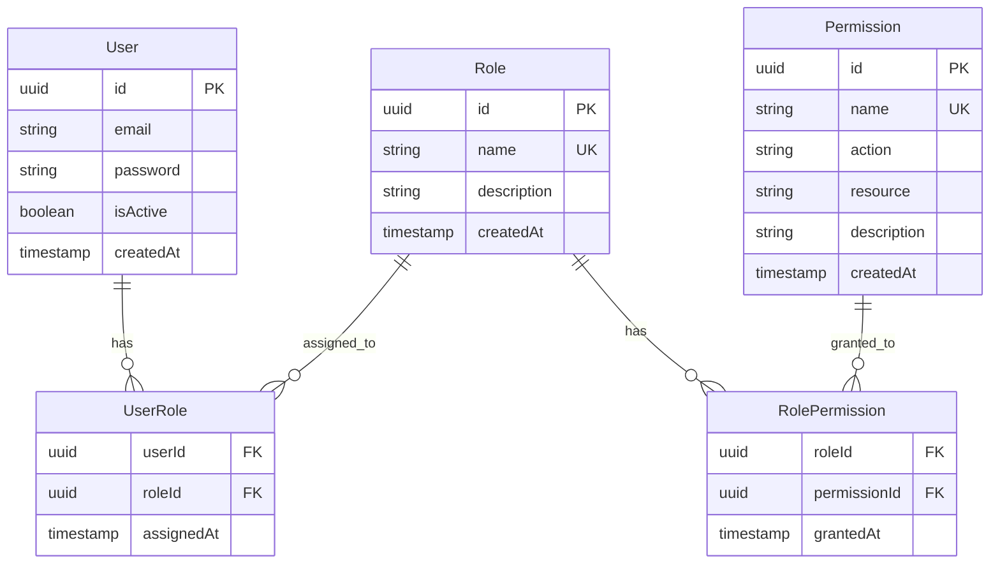

# Permission-Based Access Control

## Короткий зміст

У цій лекції вивчається більш гранулярний контроль доступу через дозволи (permissions):

- **Концепція permissions** — детальні дозволи на конкретні дії (create:post, read:post, update:post, delete:post), перевага над ролями для складних систем
- **Зв'язок ролей та дозволів** — mapping ролей на набори дозволів (admin має всі дозволи, editor має create/read/update, user має лише read), зберігання у конфігурації або БД
- **Декоратор @Permissions()** — створення кастомного декоратора для позначення необхідних дозволів на маршруті, аналогічно до `@Roles()`
- **PermissionsGuard** — реалізація Guard для перевірки дозволів, завантаження дозволів користувача з БД або кешу, перевірка наявності потрібного дозволу
- **CRUD permissions** — стандартні патерни для CRUD операцій (create:resource, read:resource, update:resource, delete:resource), wildcard permissions (admin:*)
- **Комбінація з RBAC** — використання ролей для групування дозволів, але перевірка доступу на рівні permissions для максимальної гнучкості

Розглядаються приклади систем з багатьма ролями та складною матрицею дозволів, динамічне оновлення дозволів без зміни коду, аудит логи для відстеження використання дозволів.

---

::card-group

::card{title="🎯 Мета лекції" icon="i-lucide-target"}

- Опанувати концепцію гранулярного контролю доступу через дозволи (*permissions*).
- Реалізувати гібридну систему RBAC + Permissions для максимальної гнучкості.
- Створити масштабовану архітектуру зберігання дозволів через Many-to-Many зв'язки у TypeORM.
- Навчитися проєктувати іменування дозволів за стандартом `action:resource`.
- Впровадити кешування дозволів для оптимізації продуктивності.

::

::card{title="🔑 Ключові терміни" icon="i-lucide-key"}

- **Permission (Дозвіл):** атомарне право на виконання конкретної дії над конкретним ресурсом.
- **Action (Дія):** операція, що виконується над ресурсом (`create`, `read`, `update`, `delete`, `publish`).
- **Resource (Ресурс):** об'єкт системи, над яким виконуються дії (`posts`, `users`, `comments`, `settings`).
- **Permission String:** текстове представлення дозволу у форматі `action:resource` (наприклад, `create:posts`).
- **Wildcard Permission:** дозвіл з символом `*`, що охоплює кілька ресурсів або дій (`admin:*`, `*:posts`).

::

::

---

## Еволюція від ролей до дозволів

У попередній лекції ми реалізували повноцінну систему рольового контролю доступу (RBAC), де користувачі отримують ролі (`admin`, `editor`, `user`), а маршрути захищаються декоратором `@Roles()`. Ця модель чудово працює для систем із невеликою кількістю ролей та відносно статичними правами доступу.

Проте у міру зростання складності застосунку виникають проблеми, що не вирішуються чистим RBAC:

### Проблема 1: Вибух кількості ролей (Role Explosion)

Уявіть корпоративну систему управління документами, де різні департаменти мають різні права доступу:

- `marketing_editor` — може редагувати маркетингові документи
- `marketing_viewer` — може лише переглядати маркетингові документи
- `engineering_editor` — може редагувати технічні документи
- `engineering_viewer` — може лише переглядати технічні документи
- `hr_admin` — може керувати документами відділу кадрів
- `finance_admin` — може керувати фінансовими документами
- `legal_reviewer` — може переглядати та коментувати юридичні документи

При наявності 10 департаментів та 5 рівнів доступу отримуємо **50 ролей**. Кожен новий департамент або рівень доступу множить це число далі. Управління такою системою стає кошмаром для адміністраторів.

### Проблема 2: Жорсткість та необхідність змін коду

При чистому RBAC додавання нового типу дії вимагає зміни коду:

```typescript
// Додали нову можливість "експорт звітів" — потрібно змінити код
@Delete('reports/:id')
@Roles(Role.ADMIN, Role.FINANCE_ADMIN) // Хто ще повинен мати доступ?
deleteReport() { ... }

@Post('reports/:id/export') // ❓ Які ролі потрібні для експорту?
@Roles(Role.ADMIN, Role.FINANCE_ADMIN, Role.ANALYTICS_VIEWER) // Довелося змінити код
exportReport() { ... }
```

Кожна нова функція вимагає аналізу всіх існуючих ролей та оновлення декораторів у коді.

### Проблема 3: Неможливість гранулярного налаштування

Що робити, якщо один конкретний користувач з роллю `editor` повинен мати право видаляти коментарі (зазвичай доступне лише `moderator`), але без інших прав модератора? У чистому RBAC доводиться або створювати нову роль `editor_with_delete_comments`, або надавати користувачеві роль `moderator` з надмірними правами.

### Рішення: Permission-Based Access Control

**Permission-Based Access Control** вирішує ці проблеми через введення проміжного шару **дозволів** (*permissions*) — атомарних прав на виконання конкретних дій. Ролі стають **контейнерами для групування дозволів**, а не джерелом істини про права доступу.

**Архітектурна трансформація:**

```
RBAC (старий підхід):
User → Role → Allowed Actions (захардкоджено у коді)

Permission-Based (новий підхід):
User → Role → Permissions → Allowed Actions (зберігаються у БД)
```

**Переваги підходу:**

- **Гранулярність:** кожна дія є окремим дозволом, що можна призначити незалежно.
- **Гнучкість:** дозволи можна додавати, видаляти та комбінувати без зміни коду.
- **Динамічність:** адміністратор може створити нову роль або змінити дозволи існуючої через інтерфейс адміністрування без релізу коду.
- **Аудит:** легко відповісти на питання «Які користувачі мають доступ до видалення фінансових звітів?» через пошук за дозволом `delete:financial_reports`.

::note
**Термінологія:** у різних джерелах цей підхід називається **Permission-Based RBAC**, **Fine-Grained RBAC**, або просто **RBAC with Permissions**. Це все ще є різновидом RBAC, але з додатковим шаром абстракції через дозволи. Не плутайте з повноцінним ABAC (*Attribute-Based Access Control*), де рішення приймаються динамічно на основі атрибутів контексту.
::

---

## Проєктування структури дозволів

Перший та найважливіший крок — визначення стандартного формату іменування дозволів. Консистентність іменування є критичною для підтримуваності системи.

### Стандарт іменування: action:resource

Найпоширеніший та найзрозуміліший формат — `action:resource`, де:

- **action** — дія, що виконується (`create`, `read`, `update`, `delete`, `publish`, `export`, `approve`)
- **resource** — ресурс, над яким виконується дія (`posts`, `users`, `comments`, `reports`, `settings`)

**Приклади дозволів:**

```typescript
// Базові CRUD операції
'create:posts'   // Створення постів
'read:posts'     // Читання постів
'update:posts'   // Оновлення постів
'delete:posts'   // Видалення постів

// Специфічні дії
'publish:posts'  // Публікація постів
'unpublish:posts' // Зняття з публікації
'approve:comments' // Затвердження коментарів
'export:reports' // Експорт звітів

// Адміністративні дії
'manage:users'   // Повне управління користувачами
'view:analytics' // Перегляд аналітики
'edit:settings'  // Редагування налаштувань системи
```

### Іменування для вкладених ресурсів

Для складних систем з вкладеними ресурсами використовуйте двокрапку як розділювач:

```typescript
'read:users:profile'      // Читання профілю користувача
'update:users:password'   // Зміна пароля користувача
'read:posts:comments'     // Читання коментарів до постів
'delete:posts:comments'   // Видалення коментарів до постів
'manage:settings:security' // Управління налаштуваннями безпеки
```

### Wildcard дозволи для адміністраторів

Для ролей з широкими правами використовуйте символ підстановки `*`:

```typescript
'*:*'           // Повний доступ до всього (super admin)
'*:posts'       // Всі дії над постами
'*:users'       // Всі дії над користувачами
'read:*'        // Читання всіх ресурсів
'admin:*'       // Всі адміністративні функції
```

::warning
**Обережність з wildcard дозволами:** символ `*` є потужним, але небезпечним інструментом. Надавайте дозвіл `*:*` лише обліковим записам суперадміністраторів, що проходять додаткову автентифікацію (наприклад, MFA). Ніколи не включайте wildcard дозволи у токени API, що надаються третім особам.
::

### Створення enum для типізації дозволів

Для типобезпеки у TypeScript створимо enum з усіма дозволами системи:

```typescript
// src/common/enums/permission.enum.ts

/**
 * Перелік всіх дозволів у системі.
 * Формат: action:resource
 */
export enum Permission {
  // === Posts (Пости) ===
  CREATE_POSTS = 'create:posts',
  READ_POSTS = 'read:posts',
  UPDATE_POSTS = 'update:posts',
  DELETE_POSTS = 'delete:posts',
  PUBLISH_POSTS = 'publish:posts',
  UNPUBLISH_POSTS = 'unpublish:posts',

  // === Comments (Коментарі) ===
  CREATE_COMMENTS = 'create:comments',
  READ_COMMENTS = 'read:comments',
  UPDATE_COMMENTS = 'update:comments',
  DELETE_COMMENTS = 'delete:comments',
  APPROVE_COMMENTS = 'approve:comments',

  // === Users (Користувачі) ===
  READ_USERS = 'read:users',
  UPDATE_USERS = 'update:users',
  DELETE_USERS = 'delete:users',
  MANAGE_USERS = 'manage:users', // Включає всі операції з користувачами
  CHANGE_USER_ROLES = 'change:users:roles',

  // === Reports (Звіти) ===
  VIEW_ANALYTICS = 'view:analytics',
  EXPORT_REPORTS = 'export:reports',
  CREATE_REPORTS = 'create:reports',

  // === Settings (Налаштування) ===
  VIEW_SETTINGS = 'view:settings',
  EDIT_SETTINGS = 'edit:settings',
  EDIT_SECURITY_SETTINGS = 'edit:settings:security',

  // === Wildcard для адміністраторів ===
  ADMIN_ALL = '*:*',
}
```

**Переваги використання enum:**

- **Автодоповнення:** IDE підказує доступні дозволи при наборі `Permission.`
- **Рефакторинг:** зміна назви дозволу автоматично оновлюється у всіх місцях використання.
- **Запобігання помилок друку:** неможливо випадково написати `create:post` замість `create:posts`.
- **Централізована документація:** всі дозволи системи зібрані в одному місці.

---

## Моделювання бази даних: Many-to-Many зв'язки

Для зберігання дозволів у базі даних необхідно створити кілька сутностей та встановити зв'язки між ними. Використовуємо TypeORM для визначення Entity.

### Архітектура таблиць

::mermaid



::

**Пояснення зв'язків:**

- **User ↔ Role** (Many-to-Many): користувач може мати кілька ролей, роль може бути призначена кільком користувачам.
- **Role ↔ Permission** (Many-to-Many): роль може містити кілька дозволів, дозвіл може входити до кількох ролей.

### Entity: Permission

```typescript
// src/permissions/entities/permission.entity.ts
import {
  Entity,
  Column,
  PrimaryGeneratedColumn,
  CreateDateColumn,
  ManyToMany,
  Index,
} from 'typeorm';
import { Role } from '../../roles/entities/role.entity';

@Entity('permissions')
export class Permission {
  @PrimaryGeneratedColumn('uuid')
  id: string;

  @Column({ unique: true })
  @Index()
  name: string; // Повна назва дозволу, наприклад 'create:posts'

  @Column()
  action: string; // Дія: create, read, update, delete, publish

  @Column()
  resource: string; // Ресурс: posts, users, comments, settings

  @Column({ nullable: true })
  description: string; // Опис для адміністраторів

  @ManyToMany(() => Role, role => role.permissions)
  roles: Role[];

  @CreateDateColumn()
  createdAt: Date;
}
```

**Деталі реалізації:**

- **`@Index()`** на полі `name` — прискорює пошук дозволів за назвою при перевірці доступу.
- **Розділення на `action` та `resource`** — дозволяє робити запити виду «Знайти всі дозволи для ресурсу `posts`» або «Знайти всі дозволи з дією `delete`».

### Entity: Role

```typescript
// src/roles/entities/role.entity.ts
import {
  Entity,
  Column,
  PrimaryGeneratedColumn,
  CreateDateColumn,
  ManyToMany,
  JoinTable,
} from 'typeorm';
import { Permission } from '../../permissions/entities/permission.entity';
import { User } from '../../users/entities/user.entity';

@Entity('roles')
export class Role {
  @PrimaryGeneratedColumn('uuid')
  id: string;

  @Column({ unique: true })
  name: string; // admin, editor, user, moderator

  @Column({ nullable: true })
  description: string;

  @ManyToMany(() => Permission, permission => permission.roles, {
    eager: false, // Не завантажуємо дозволи автоматично (зробимо через окремий запит)
  })
  @JoinTable({
    name: 'role_permissions',
    joinColumn: { name: 'roleId', referencedColumnName: 'id' },
    inverseJoinColumn: { name: 'permissionId', referencedColumnName: 'id' },
  })
  permissions: Permission[];

  @ManyToMany(() => User, user => user.roles)
  users: User[];

  @CreateDateColumn()
  createdAt: Date;
}
```

**Деталі реалізації:**

- **`@JoinTable()`** створює проміжну таблицю `role_permissions` для зв'язку Many-to-Many.
- **`eager: false`** — дозволи завантажуються лише при явному запиті через `relations: ['permissions']`. Це запобігає надмірному завантаженню даних при кожному запиті ролі.

### Entity: User (оновлена)

```typescript
// src/users/entities/user.entity.ts
import {
  Entity,
  Column,
  PrimaryGeneratedColumn,
  CreateDateColumn,
  UpdateDateColumn,
  ManyToMany,
  JoinTable,
} from 'typeorm';
import { Role } from '../../roles/entities/role.entity';

@Entity('users')
export class User {
  @PrimaryGeneratedColumn('uuid')
  id: string;

  @Column({ unique: true })
  email: string;

  @Column()
  password: string;

  @Column({ nullable: true })
  firstName: string;

  @Column({ nullable: true })
  lastName: string;

  @ManyToMany(() => Role, role => role.users, {
    eager: false,
  })
  @JoinTable({
    name: 'user_roles',
    joinColumn: { name: 'userId', referencedColumnName: 'id' },
    inverseJoinColumn: { name: 'roleId', referencedColumnName: 'id' },
  })
  roles: Role[];

  @Column({ default: true })
  isActive: boolean;

  @CreateDateColumn()
  createdAt: Date;

  @UpdateDateColumn()
  updatedAt: Date;
}
```

**Важлива зміна:** замість одного поля `role: Role` тепер маємо `roles: Role[]` — користувач може мати **кілька ролей одночасно**.


---

## Міграції бази даних

Створимо міграції для додавання нових таблиць:

```bash
# Генерація міграції на основі змін у Entity
npm run typeorm migration:generate -- -n CreatePermissionsAndRoles

# Застосування міграції
npm run typeorm migration:run
```

**Згенерована міграція (спрощений приклад для PostgreSQL):**

```typescript
// src/migrations/1693564800000-CreatePermissionsAndRoles.ts
import { MigrationInterface, QueryRunner } from 'typeorm';

export class CreatePermissionsAndRoles1693564800000 implements MigrationInterface {
  public async up(queryRunner: QueryRunner): Promise<void> {
    // Створення таблиці permissions
    await queryRunner.query(`
      CREATE TABLE "permissions" (
        "id" uuid PRIMARY KEY DEFAULT uuid_generate_v4(),
        "name" varchar NOT NULL UNIQUE,
        "action" varchar NOT NULL,
        "resource" varchar NOT NULL,
        "description" varchar,
        "createdAt" timestamp NOT NULL DEFAULT now()
      );
      CREATE INDEX "IDX_permissions_name" ON "permissions" ("name");
    `);

    // Створення таблиці roles
    await queryRunner.query(`
      CREATE TABLE "roles" (
        "id" uuid PRIMARY KEY DEFAULT uuid_generate_v4(),
        "name" varchar NOT NULL UNIQUE,
        "description" varchar,
        "createdAt" timestamp NOT NULL DEFAULT now()
      );
    `);

    // Створення проміжної таблиці role_permissions
    await queryRunner.query(`
      CREATE TABLE "role_permissions" (
        "roleId" uuid NOT NULL,
        "permissionId" uuid NOT NULL,
        "grantedAt" timestamp NOT NULL DEFAULT now(),
        PRIMARY KEY ("roleId", "permissionId"),
        FOREIGN KEY ("roleId") REFERENCES "roles"("id") ON DELETE CASCADE,
        FOREIGN KEY ("permissionId") REFERENCES "permissions"("id") ON DELETE CASCADE
      );
    `);

    // Створення проміжної таблиці user_roles
    await queryRunner.query(`
      CREATE TABLE "user_roles" (
        "userId" uuid NOT NULL,
        "roleId" uuid NOT NULL,
        "assignedAt" timestamp NOT NULL DEFAULT now(),
        PRIMARY KEY ("userId", "roleId"),
        FOREIGN KEY ("userId") REFERENCES "users"("id") ON DELETE CASCADE,
        FOREIGN KEY ("roleId") REFERENCES "roles"("id") ON DELETE CASCADE
      );
    `);

    // Видаляємо старе поле role з таблиці users (якщо воно існувало)
    await queryRunner.query(`
      ALTER TABLE "users" DROP COLUMN IF EXISTS "role";
    `);
  }

  public async down(queryRunner: QueryRunner): Promise<void> {
    await queryRunner.query(`DROP TABLE "user_roles";`);
    await queryRunner.query(`DROP TABLE "role_permissions";`);
    await queryRunner.query(`DROP TABLE "roles";`);
    await queryRunner.query(`DROP INDEX "IDX_permissions_name";`);
    await queryRunner.query(`DROP TABLE "permissions";`);
  }
}
```

---

## Seed даних: Початкові ролі та дозволи

Після створення структури бази даних необхідно заповнити її початковими даними — створити базові дозволи та ролі. Це зазвичай робиться через **seeder** скрипти.

### Створення PermissionsSeeder

```typescript
// src/database/seeds/permissions.seeder.ts
import { DataSource } from 'typeorm';
import { Permission } from '../../permissions/entities/permission.entity';
import { Permission as PermissionEnum } from '../../common/enums/permission.enum';

export async function seedPermissions(dataSource: DataSource): Promise<Permission[]> {
  const permissionRepository = dataSource.getRepository(Permission);

  // Парсимо enum дозволів у структуровані об'єкти
  const permissionsData = Object.values(PermissionEnum).map(permissionString => {
    // Розділяємо 'create:posts' на action='create' та resource='posts'
    const [action, ...resourceParts] = permissionString.split(':');
    const resource = resourceParts.join(':'); // Підтримка вкладених ресурсів

    return {
      name: permissionString,
      action: action,
      resource: resource,
      description: generateDescription(action, resource),
    };
  });

  // Зберігаємо дозволи (або оновлюємо, якщо вже існують)
  const permissions: Permission[] = [];
  for (const data of permissionsData) {
    let permission = await permissionRepository.findOne({
      where: { name: data.name },
    });

    if (!permission) {
      permission = permissionRepository.create(data);
      await permissionRepository.save(permission);
      console.log(`✅ Created permission: ${data.name}`);
    } else {
      console.log(`ℹ️  Permission already exists: ${data.name}`);
    }

    permissions.push(permission);
  }

  return permissions;
}

// Допоміжна функція для генерації описів
function generateDescription(action: string, resource: string): string {
  const actionMap: Record<string, string> = {
    create: 'Створення',
    read: 'Перегляд',
    update: 'Редагування',
    delete: 'Видалення',
    publish: 'Публікація',
    unpublish: 'Зняття з публікації',
    approve: 'Затвердження',
    export: 'Експорт',
    manage: 'Повне управління',
    view: 'Перегляд',
    edit: 'Редагування',
    change: 'Зміна',
    '*': 'Всі дії',
  };

  const actionText = actionMap[action] || action;
  
  if (resource === '*') {
    return `${actionText} всіх ресурсів`;
  }

  return `${actionText} ${resource}`;
}
```

### Створення RolesSeeder

```typescript
// src/database/seeds/roles.seeder.ts
import { DataSource } from 'typeorm';
import { Role } from '../../roles/entities/role.entity';
import { Permission } from '../../permissions/entities/permission.entity';
import { Permission as PermissionEnum } from '../../common/enums/permission.enum';

interface RoleDefinition {
  name: string;
  description: string;
  permissions: PermissionEnum[];
}

export async function seedRoles(
  dataSource: DataSource,
  permissions: Permission[],
): Promise<void> {
  const roleRepository = dataSource.getRepository(Role);

  // Визначення ролей та їхніх дозволів
  const rolesData: RoleDefinition[] = [
    {
      name: 'super_admin',
      description: 'Повний доступ до всіх функцій системи',
      permissions: [PermissionEnum.ADMIN_ALL], // Wildcard дозвіл
    },
    {
      name: 'admin',
      description: 'Адміністратор з широкими правами',
      permissions: [
        PermissionEnum.MANAGE_USERS,
        PermissionEnum.CHANGE_USER_ROLES,
        PermissionEnum.READ_USERS,
        PermissionEnum.UPDATE_USERS,
        PermissionEnum.DELETE_USERS,
        PermissionEnum.CREATE_POSTS,
        PermissionEnum.READ_POSTS,
        PermissionEnum.UPDATE_POSTS,
        PermissionEnum.DELETE_POSTS,
        PermissionEnum.PUBLISH_POSTS,
        PermissionEnum.UNPUBLISH_POSTS,
        PermissionEnum.DELETE_COMMENTS,
        PermissionEnum.APPROVE_COMMENTS,
        PermissionEnum.VIEW_ANALYTICS,
        PermissionEnum.EXPORT_REPORTS,
        PermissionEnum.VIEW_SETTINGS,
        PermissionEnum.EDIT_SETTINGS,
      ],
    },
    {
      name: 'editor',
      description: 'Редактор контенту',
      permissions: [
        PermissionEnum.CREATE_POSTS,
        PermissionEnum.READ_POSTS,
        PermissionEnum.UPDATE_POSTS,
        PermissionEnum.PUBLISH_POSTS,
        PermissionEnum.UNPUBLISH_POSTS,
        PermissionEnum.READ_COMMENTS,
        PermissionEnum.APPROVE_COMMENTS,
      ],
    },
    {
      name: 'author',
      description: 'Автор постів',
      permissions: [
        PermissionEnum.CREATE_POSTS,
        PermissionEnum.READ_POSTS,
        PermissionEnum.UPDATE_POSTS, // Лише власні пости (перевіряється у сервісі)
        PermissionEnum.CREATE_COMMENTS,
        PermissionEnum.READ_COMMENTS,
      ],
    },
    {
      name: 'moderator',
      description: 'Модератор коментарів та користувачів',
      permissions: [
        PermissionEnum.READ_POSTS,
        PermissionEnum.READ_COMMENTS,
        PermissionEnum.UPDATE_COMMENTS,
        PermissionEnum.DELETE_COMMENTS,
        PermissionEnum.APPROVE_COMMENTS,
        PermissionEnum.READ_USERS,
      ],
    },
    {
      name: 'user',
      description: 'Звичайний користувач',
      permissions: [
        PermissionEnum.READ_POSTS,
        PermissionEnum.CREATE_COMMENTS,
        PermissionEnum.READ_COMMENTS,
        PermissionEnum.UPDATE_COMMENTS, // Лише власні коментарі
      ],
    },
  ];

  for (const roleData of rolesData) {
    let role = await roleRepository.findOne({
      where: { name: roleData.name },
      relations: ['permissions'],
    });

    if (!role) {
      role = roleRepository.create({
        name: roleData.name,
        description: roleData.description,
      });
    } else {
      role.description = roleData.description;
    }

    // Знаходимо Permission Entity за назвами з enum
    role.permissions = permissions.filter(p =>
      roleData.permissions.includes(p.name as PermissionEnum),
    );

    await roleRepository.save(role);
    console.log(`✅ Created/Updated role: ${roleData.name} with ${role.permissions.length} permissions`);
  }
}
```

### Головний Seeder скрипт

```typescript
// src/database/seeds/run-seeds.ts
import { DataSource } from 'typeorm';
import { dataSourceOptions } from '../data-source'; // Конфігурація TypeORM
import { seedPermissions } from './permissions.seeder';
import { seedRoles } from './roles.seeder';

async function runSeeds() {
  const dataSource = new DataSource(dataSourceOptions);
  await dataSource.initialize();

  console.log('🌱 Running database seeds...\n');

  try {
    // Крок 1: Створюємо дозволи
    console.log('📝 Seeding permissions...');
    const permissions = await seedPermissions(dataSource);
    console.log(`✅ Seeded ${permissions.length} permissions\n`);

    // Крок 2: Створюємо ролі та прив'язуємо до них дозволи
    console.log('👥 Seeding roles...');
    await seedRoles(dataSource, permissions);
    console.log('✅ Seeded roles\n');

    console.log('🎉 All seeds completed successfully!');
  } catch (error) {
    console.error('❌ Error running seeds:', error);
    process.exit(1);
  } finally {
    await dataSource.destroy();
  }
}

runSeeds();
```

**Запуск seeder:**

```bash
# Додайте у package.json scripts секцію
"scripts": {
  "seed": "ts-node src/database/seeds/run-seeds.ts"
}

# Виконання
npm run seed
```

::tip
**Ідемпотентність seeder:** наведений вище код перевіряє існування дозволів та ролей перед створенням. Це дозволяє безпечно запускати seeder кілька разів — він створить дані лише якщо їх ще немає, або оновить опис існуючих ролей. Це називається **ідемпотентністю** (*idempotency*) — операція дає той самий результат незалежно від кількості виконань.
::

---

## Сервіс для завантаження дозволів користувача

Перед реалізацією Guard необхідно створити сервіс, що завантажує дозволи користувача з бази даних. Цей сервіс має бути оптимізованим, оскільки буде викликатися при кожному запиті.

### AuthorizationService з кешуванням

```typescript
// src/auth/authorization.service.ts
import { Injectable } from '@nestjs/common';
import { InjectRepository } from '@nestjs/typeorm';
import { Repository } from 'typeorm';
import { User } from '../users/entities/user.entity';
import { Permission } from '../permissions/entities/permission.entity';
import { Permission as PermissionEnum } from '../common/enums/permission.enum';

@Injectable()
export class AuthorizationService {
  private permissionsCache = new Map<string, Set<string>>(); // userId → Set<permissionName>
  private readonly CACHE_TTL = 5 * 60 * 1000; // 5 хвилин у мілісекундах

  constructor(
    @InjectRepository(User)
    private userRepository: Repository<User>,
  ) {}

  /**
   * Отримує всі дозволи користувача через його ролі
   * Використовує кешування для оптимізації
   */
  async getUserPermissions(userId: string): Promise<Set<string>> {
    // Перевірка кешу
    const cached = this.permissionsCache.get(userId);
    if (cached) {
      return cached;
    }

    // Завантаження з БД
    const user = await this.userRepository.findOne({
      where: { id: userId },
      relations: ['roles', 'roles.permissions'],
    });

    if (!user) {
      return new Set<string>();
    }

    // Збираємо всі дозволи з усіх ролей користувача
    const permissionsSet = new Set<string>();

    for (const role of user.roles) {
      for (const permission of role.permissions) {
        permissionsSet.add(permission.name);
      }
    }

    // Зберігаємо у кеш
    this.permissionsCache.set(userId, permissionsSet);

    // Автоматичне видалення з кешу через TTL
    setTimeout(() => {
      this.permissionsCache.delete(userId);
    }, this.CACHE_TTL);

    return permissionsSet;
  }

  /**
   * Перевіряє, чи має користувач конкретний дозвіл
   */
  async userHasPermission(userId: string, permission: PermissionEnum | string): Promise<boolean> {
    const userPermissions = await this.getUserPermissions(userId);

    // Пряма перевірка наявності дозволу
    if (userPermissions.has(permission)) {
      return true;
    }

    // Перевірка wildcard дозволів
    if (userPermissions.has(PermissionEnum.ADMIN_ALL)) {
      return true; // *:* дозволяє все
    }

    // Перевірка часткових wildcard (наприклад, *:posts для create:posts)
    const [action, resource] = permission.split(':');
    const wildcardResource = `*:${resource}`; // *:posts
    const wildcardAction = `${action}:*`;     // create:*

    if (userPermissions.has(wildcardResource) || userPermissions.has(wildcardAction)) {
      return true;
    }

    return false;
  }

  /**
   * Перевіряє, чи має користувач хоча б один із вказаних дозволів
   */
  async userHasAnyPermission(userId: string, permissions: string[]): Promise<boolean> {
    const checks = await Promise.all(
      permissions.map(p => this.userHasPermission(userId, p)),
    );

    return checks.some(result => result === true);
  }

  /**
   * Перевіряє, чи має користувач всі вказані дозволи
   */
  async userHasAllPermissions(userId: string, permissions: string[]): Promise<boolean> {
    const checks = await Promise.all(
      permissions.map(p => this.userHasPermission(userId, p)),
    );

    return checks.every(result => result === true);
  }

  /**
   * Примусово скидає кеш дозволів користувача
   * Викликається після зміни ролей користувача
   */
  invalidateUserPermissionsCache(userId: string): void {
    this.permissionsCache.delete(userId);
  }

  /**
   * Повністю очищує кеш дозволів
   * Викликається після зміни дозволів у ролях
   */
  clearPermissionsCache(): void {
    this.permissionsCache.clear();
  }
}
```

**Деталі реалізації:**

- **In-Memory кешування:** для малих та середніх застосунків достатньо кешування у пам'яті процесу. Для high-traffic систем використовуйте Redis.
- **TTL (Time To Live):** кеш автоматично видаляється через 5 хвилин. Це балансує між продуктивністю та актуальністю даних.
- **Wildcard підтримка:** метод `userHasPermission()` перевіряє не лише точну відповідність, а й wildcard дозволи (`*:*`, `*:posts`, `create:*`).

::warning
**Проблема розподілених систем:** якщо ваш застосунок працює у кількох екземплярах (наприклад, за load balancer), in-memory кеш буде окремим для кожного процесу. Зміна ролей користувача на одному сервері не оновить кеш на інших. Рішення:

- **Redis для кешування:** спільний кеш для всіх інстансів.
- **Pub/Sub для інвалідації:** при зміні ролей/дозволів публікуйте повідомлення, що інвалідує кеш на всіх серверах.
- **Короткий TTL:** зменшіть TTL до 1–2 хвилин для швидшого оновлення.
::


---

## Створення декоратора @RequirePermissions()

Аналогічно до декоратора `@Roles()` з попередньої лекції, створимо декоратор для позначення необхідних дозволів на маршрутах.

```typescript
// src/auth/decorators/require-permissions.decorator.ts
import { SetMetadata } from '@nestjs/common';
import { Permission } from '../../common/enums/permission.enum';

/**
 * Ключ для збереження метаданих про необхідні дозволи
 */
export const PERMISSIONS_KEY = 'permissions';

/**
 * Декоратор для позначення необхідних дозволів на маршруті.
 * Підтримує як enum Permission, так і string значення для гнучкості.
 * 
 * @example
 * // Використання з enum (рекомендовано)
 * @RequirePermissions(Permission.CREATE_POSTS, Permission.PUBLISH_POSTS)
 * createAndPublish() { ... }
 * 
 * @example
 * // Використання з string (для динамічних дозволів)
 * @RequirePermissions('create:custom_resource')
 * customAction() { ... }
 */
export const RequirePermissions = (...permissions: (Permission | string)[]) =>
  SetMetadata(PERMISSIONS_KEY, permissions);
```

---

## Реалізація PermissionsGuard

Створимо Guard, що перевіряє наявність необхідних дозволів у користувача:

```typescript
// src/auth/guards/permissions.guard.ts
import {
  Injectable,
  CanActivate,
  ExecutionContext,
  ForbiddenException,
  Logger,
} from '@nestjs/common';
import { Reflector } from '@nestjs/core';
import { PERMISSIONS_KEY } from '../decorators/require-permissions.decorator';
import { AuthorizationService } from '../authorization.service';

@Injectable()
export class PermissionsGuard implements CanActivate {
  private readonly logger = new Logger(PermissionsGuard.name);

  constructor(
    private reflector: Reflector,
    private authorizationService: AuthorizationService,
  ) {}

  async canActivate(context: ExecutionContext): Promise<boolean> {
    // Крок 1: Читаємо необхідні дозволи з метаданих
    const requiredPermissions = this.reflector.getAllAndOverride<string[]>(
      PERMISSIONS_KEY,
      [context.getHandler(), context.getClass()],
    );

    // Крок 2: Якщо дозволи не вказані, пропускаємо перевірку
    if (!requiredPermissions || requiredPermissions.length === 0) {
      return true;
    }

    // Крок 3: Витягуємо користувача з request
    const request = context.switchToHttp().getRequest();
    const user = request.user;

    if (!user || !user.sub) {
      this.logger.warn('PermissionsGuard: User is not authenticated');
      throw new ForbiddenException('User is not authenticated');
    }

    // Крок 4: Перевіряємо наявність дозволів
    try {
      const hasPermission = await this.authorizationService.userHasAnyPermission(
        user.sub,
        requiredPermissions,
      );

      if (!hasPermission) {
        // Отримуємо всі дозволи користувача для логування
        const userPermissions = await this.authorizationService.getUserPermissions(user.sub);

        this.logger.warn(
          `PermissionsGuard: Access denied for user ${user.sub}. ` +
          `Required: [${requiredPermissions.join(', ')}], ` +
          `Has: [${Array.from(userPermissions).join(', ')}]`,
        );

        throw new ForbiddenException(
          `Access denied: required permissions are [${requiredPermissions.join(', ')}]`,
        );
      }

      this.logger.debug(`PermissionsGuard: Access granted for user ${user.sub}`);
      return true;
    } catch (error) {
      if (error instanceof ForbiddenException) {
        throw error;
      }

      this.logger.error('PermissionsGuard: Error checking permissions', error);
      throw new ForbiddenException('Error verifying permissions');
    }
  }
}
```

**Деталі реалізації:**

- **Логування:** Guard логує всі спроби доступу та відмови для аудиту безпеки.
- **Обробка помилок:** якщо виникає помилка при завантаженні дозволів з БД, користувач отримує `403 Forbidden` замість `500 Internal Server Error` для запобігання витоку інформації про внутрішню структуру.
- **Логіка OR:** метод `userHasAnyPermission()` реалізує логіку **OR** — достатньо мати один із вказаних дозволів.

---

## Порядок застосування Guards: JWT → Permissions

Критично важливо застосовувати Guards у правильному порядку:

```typescript
// src/posts/posts.controller.ts
import { Controller, Get, Post, UseGuards } from '@nestjs/common';
import { JwtAuthGuard } from '../auth/guards/jwt-auth.guard';
import { PermissionsGuard } from '../auth/guards/permissions.guard';
import { RequirePermissions } from '../auth/decorators/require-permissions.decorator';
import { Permission } from '../common/enums/permission.enum';

@Controller('posts')
@UseGuards(JwtAuthGuard, PermissionsGuard) // Порядок: спочатку автентифікація, потім авторизація
export class PostsController {
  constructor(private postsService: PostsService) {}

  @Get()
  @RequirePermissions(Permission.READ_POSTS)
  getAllPosts() {
    return this.postsService.findAll();
  }

  @Post()
  @RequirePermissions(Permission.CREATE_POSTS)
  createPost(@Body() createDto: CreatePostDto) {
    return this.postsService.create(createDto);
  }
}
```

**Чому цей порядок є обов'язковим:**

1. **JwtAuthGuard** виконується першим, декодує JWT токен, встановлює `request.user`.
2. **PermissionsGuard** виконується другим, читає `request.user.sub` для завантаження дозволів.

::warning
**Помилка порядку Guards:**

```typescript
@UseGuards(PermissionsGuard, JwtAuthGuard) // ❌ НЕПРАВИЛЬНИЙ ПОРЯДОК!
```

У цьому випадку `PermissionsGuard` виконається першим і не знайде `request.user`, що призведе до `ForbiddenException: User is not authenticated` навіть для користувачів з валідним токеном.
::

---

## Практичний приклад: Система управління блогом

Розглянемо повний приклад контролера постів із використанням permission-based авторизації:

```typescript
// src/posts/posts.controller.ts
import {
  Controller,
  Get,
  Post,
  Put,
  Delete,
  Body,
  Param,
  UseGuards,
  Request,
  Query,
} from '@nestjs/common';
import { JwtAuthGuard } from '../auth/guards/jwt-auth.guard';
import { PermissionsGuard } from '../auth/guards/permissions.guard';
import { RequirePermissions } from '../auth/decorators/require-permissions.decorator';
import { Public } from '../auth/decorators/public.decorator';
import { Permission } from '../common/enums/permission.enum';
import { PostsService } from './posts.service';
import { CreatePostDto, UpdatePostDto } from './dto';

@Controller('posts')
@UseGuards(JwtAuthGuard, PermissionsGuard)
export class PostsController {
  constructor(private postsService: PostsService) {}

  /**
   * Отримання списку опублікованих постів
   * Доступ: публічний
   */
  @Get()
  @Public()
  async getAllPosts(@Query('page') page: number = 1) {
    return this.postsService.findPublished({ page, limit: 10 });
  }

  /**
   * Отримання окремого поста
   * Доступ: потребує дозволу read:posts
   */
  @Get(':id')
  @RequirePermissions(Permission.READ_POSTS)
  async getPost(@Param('id') id: string) {
    return this.postsService.findById(id);
  }

  /**
   * Створення нового поста
   * Доступ: потребує дозволу create:posts
   */
  @Post()
  @RequirePermissions(Permission.CREATE_POSTS)
  async createPost(@Request() req, @Body() createDto: CreatePostDto) {
    return this.postsService.create({
      ...createDto,
      authorId: req.user.sub,
      status: 'draft',
    });
  }

  /**
   * Оновлення поста
   * Доступ: потребує дозволу update:posts
   * Додаткова перевірка власності у сервісі
   */
  @Put(':id')
  @RequirePermissions(Permission.UPDATE_POSTS)
  async updatePost(
    @Param('id') id: string,
    @Body() updateDto: UpdatePostDto,
    @Request() req,
  ) {
    // Сервіс перевірить, чи є користувач автором або має достатні права
    return this.postsService.update(id, updateDto, req.user.sub);
  }

  /**
   * Видалення поста
   * Доступ: потребує дозволу delete:posts
   */
  @Delete(':id')
  @RequirePermissions(Permission.DELETE_POSTS)
  async deletePost(@Param('id') id: string) {
    return this.postsService.delete(id);
  }

  /**
   * Публікація поста
   * Доступ: потребує дозволу publish:posts (зазвичай лише редактори)
   */
  @Put(':id/publish')
  @RequirePermissions(Permission.PUBLISH_POSTS)
  async publishPost(@Param('id') id: string) {
    return this.postsService.publish(id);
  }

  /**
   * Зняття з публікації
   * Доступ: потребує дозволу unpublish:posts
   */
  @Put(':id/unpublish')
  @RequirePermissions(Permission.UNPUBLISH_POSTS)
  async unpublishPost(@Param('id') id: string) {
    return this.postsService.unpublish(id);
  }
}
```

### Сервіс постів з перевіркою власності

```typescript
// src/posts/posts.service.ts
import {
  Injectable,
  NotFoundException,
  ForbiddenException,
} from '@nestjs/common';
import { InjectRepository } from '@nestjs/typeorm';
import { Repository } from 'typeorm';
import { Post } from './entities/post.entity';
import { CreatePostDto, UpdatePostDto } from './dto';
import { AuthorizationService } from '../auth/authorization.service';
import { Permission } from '../common/enums/permission.enum';

@Injectable()
export class PostsService {
  constructor(
    @InjectRepository(Post)
    private postsRepository: Repository<Post>,
    private authorizationService: AuthorizationService,
  ) {}

  async findPublished(options: { page: number; limit: number }) {
    return this.postsRepository.find({
      where: { status: 'published' },
      take: options.limit,
      skip: (options.page - 1) * options.limit,
      order: { publishedAt: 'DESC' },
    });
  }

  async findById(id: string): Promise<Post> {
    const post = await this.postsRepository.findOne({
      where: { id },
      relations: ['author'],
    });

    if (!post) {
      throw new NotFoundException(`Post with ID ${id} not found`);
    }

    return post;
  }

  async create(data: Partial<Post>): Promise<Post> {
    const post = this.postsRepository.create(data);
    return this.postsRepository.save(post);
  }

  /**
   * Оновлення поста з перевіркою прав
   */
  async update(
    id: string,
    updateDto: UpdatePostDto,
    currentUserId: string,
  ): Promise<Post> {
    const post = await this.findById(id);

    // Перевірка 1: Чи є користувач автором цього поста
    const isAuthor = post.authorId === currentUserId;

    // Перевірка 2: Чи має користувач дозвіл на редагування будь-яких постів
    const canEditAnyPost = await this.authorizationService.userHasPermission(
      currentUserId,
      Permission.UPDATE_POSTS,
    );

    if (!isAuthor && !canEditAnyPost) {
      throw new ForbiddenException('You can only edit your own posts');
    }

    // Додаткова логіка: автори не можуть змінювати статус публікації
    if (updateDto.status && updateDto.status !== post.status) {
      const canPublish = await this.authorizationService.userHasPermission(
        currentUserId,
        Permission.PUBLISH_POSTS,
      );

      if (!canPublish) {
        throw new ForbiddenException(
          'You do not have permission to change publication status',
        );
      }
    }

    Object.assign(post, updateDto);
    return this.postsRepository.save(post);
  }

  async delete(id: string): Promise<void> {
    const result = await this.postsRepository.delete(id);

    if (result.affected === 0) {
      throw new NotFoundException(`Post with ID ${id} not found`);
    }
  }

  async publish(id: string): Promise<Post> {
    const post = await this.findById(id);
    post.status = 'published';
    post.publishedAt = new Date();
    return this.postsRepository.save(post);
  }

  async unpublish(id: string): Promise<Post> {
    const post = await this.findById(id);
    post.status = 'draft';
    return this.postsRepository.save(post);
  }
}
```

**Аналіз багаторівневої перевірки:**

1. **Перший рівень (Guard):** `PermissionsGuard` перевіряє базовий дозвіл `update:posts`.
2. **Другий рівень (Сервіс):** метод `update()` додатково перевіряє власність ресурсу — автори можуть редагувати лише свої пости.
3. **Третій рівень (Сервіс):** при спробі зміни статусу публікації виконується додаткова перевірка дозволу `publish:posts`.

Це називається **Defense in Depth** (*глибинний захист*) — кілька шарів перевірок підвищують безпеку системи.

---

## Адміністративний інтерфейс управління дозволами

Для повноцінної permission-based системи необхідний інтерфейс адміністрування, що дозволяє:

- Переглядати всі ролі та їхні дозволи
- Додавати/видаляти дозволи до ролей
- Призначати/відкликати ролі у користувачів
- Створювати нові ролі та дозволи

### Контролер адміністрування ролей

```typescript
// src/admin/roles.controller.ts
import {
  Controller,
  Get,
  Post,
  Put,
  Delete,
  Body,
  Param,
  UseGuards,
} from '@nestjs/common';
import { JwtAuthGuard } from '../auth/guards/jwt-auth.guard';
import { PermissionsGuard } from '../auth/guards/permissions.guard';
import { RequirePermissions } from '../auth/decorators/require-permissions.decorator';
import { Permission } from '../common/enums/permission.enum';
import { RolesService } from './roles.service';
import { CreateRoleDto, UpdateRoleDto, AssignPermissionsDto } from './dto';

@Controller('admin/roles')
@UseGuards(JwtAuthGuard, PermissionsGuard)
@RequirePermissions(Permission.MANAGE_USERS) // Базовий дозвіл для всього контролера
export class AdminRolesController {
  constructor(private rolesService: RolesService) {}

  /**
   * Отримання списку всіх ролей
   */
  @Get()
  async getAllRoles() {
    return this.rolesService.findAll();
  }

  /**
   * Отримання ролі з її дозволами
   */
  @Get(':id')
  async getRole(@Param('id') id: string) {
    return this.rolesService.findByIdWithPermissions(id);
  }

  /**
   * Створення нової ролі
   */
  @Post()
  async createRole(@Body() createDto: CreateRoleDto) {
    return this.rolesService.create(createDto);
  }

  /**
   * Оновлення ролі
   */
  @Put(':id')
  async updateRole(@Param('id') id: string, @Body() updateDto: UpdateRoleDto) {
    return this.rolesService.update(id, updateDto);
  }

  /**
   * Видалення ролі
   */
  @Delete(':id')
  async deleteRole(@Param('id') id: string) {
    return this.rolesService.delete(id);
  }

  /**
   * Призначення дозволів ролі
   */
  @Post(':id/permissions')
  async assignPermissions(
    @Param('id') roleId: string,
    @Body() dto: AssignPermissionsDto,
  ) {
    return this.rolesService.assignPermissions(roleId, dto.permissionIds);
  }

  /**
   * Видалення дозволу з ролі
   */
  @Delete(':roleId/permissions/:permissionId')
  async removePermission(
    @Param('roleId') roleId: string,
    @Param('permissionId') permissionId: string,
  ) {
    return this.rolesService.removePermission(roleId, permissionId);
  }
}
```

### Сервіс управління ролями

```typescript
// src/admin/roles.service.ts
import { Injectable, NotFoundException } from '@nestjs/common';
import { InjectRepository } from '@nestjs/typeorm';
import { Repository, In } from 'typeorm';
import { Role } from '../roles/entities/role.entity';
import { Permission } from '../permissions/entities/permission.entity';
import { CreateRoleDto, UpdateRoleDto } from './dto';
import { AuthorizationService } from '../auth/authorization.service';

@Injectable()
export class RolesService {
  constructor(
    @InjectRepository(Role)
    private roleRepository: Repository<Role>,
    @InjectRepository(Permission)
    private permissionRepository: Repository<Permission>,
    private authorizationService: AuthorizationService,
  ) {}

  async findAll(): Promise<Role[]> {
    return this.roleRepository.find({
      relations: ['permissions'],
      order: { createdAt: 'DESC' },
    });
  }

  async findByIdWithPermissions(id: string): Promise<Role> {
    const role = await this.roleRepository.findOne({
      where: { id },
      relations: ['permissions'],
    });

    if (!role) {
      throw new NotFoundException(`Role with ID ${id} not found`);
    }

    return role;
  }

  async create(createDto: CreateRoleDto): Promise<Role> {
    const role = this.roleRepository.create(createDto);
    return this.roleRepository.save(role);
  }

  async update(id: string, updateDto: UpdateRoleDto): Promise<Role> {
    const role = await this.findByIdWithPermissions(id);
    Object.assign(role, updateDto);
    
    const updated = await this.roleRepository.save(role);

    // Інвалідуємо кеш дозволів для всіх користувачів з цією роллю
    this.authorizationService.clearPermissionsCache();

    return updated;
  }

  async delete(id: string): Promise<void> {
    const result = await this.roleRepository.delete(id);

    if (result.affected === 0) {
      throw new NotFoundException(`Role with ID ${id} not found`);
    }

    // Інвалідуємо кеш після видалення ролі
    this.authorizationService.clearPermissionsCache();
  }

  async assignPermissions(roleId: string, permissionIds: string[]): Promise<Role> {
    const role = await this.findByIdWithPermissions(roleId);

    const permissions = await this.permissionRepository.find({
      where: { id: In(permissionIds) },
    });

    if (permissions.length !== permissionIds.length) {
      throw new NotFoundException('Some permissions were not found');
    }

    // Додаємо нові дозволи до існуючих
    role.permissions = [...role.permissions, ...permissions];

    const updated = await this.roleRepository.save(role);

    // Інвалідуємо кеш дозволів
    this.authorizationService.clearPermissionsCache();

    return updated;
  }

  async removePermission(roleId: string, permissionId: string): Promise<Role> {
    const role = await this.findByIdWithPermissions(roleId);

    role.permissions = role.permissions.filter(p => p.id !== permissionId);

    const updated = await this.roleRepository.save(role);

    // Інвалідуємо кеш дозволів
    this.authorizationService.clearPermissionsCache();

    return updated;
  }
}
```

::tip
**Інвалідація кешу після змін:** кожна операція, що змінює дозволи ролей (додавання, видалення дозволів, оновлення ролі), викликає `clearPermissionsCache()` для скидання кешу. Це гарантує, що користувачі отримають оновлені дозволи при наступному запиті.
::


---

## Контролер призначення ролей користувачам

```typescript
// src/admin/user-roles.controller.ts
import {
  Controller,
  Post,
  Delete,
  Param,
  Body,
  UseGuards,
} from '@nestjs/common';
import { JwtAuthGuard } from '../auth/guards/jwt-auth.guard';
import { PermissionsGuard } from '../auth/guards/permissions.guard';
import { RequirePermissions } from '../auth/decorators/require-permissions.decorator';
import { Permission } from '../common/enums/permission.enum';
import { UserRolesService } from './user-roles.service';
import { AssignRolesDto } from './dto';

@Controller('admin/users/:userId/roles')
@UseGuards(JwtAuthGuard, PermissionsGuard)
@RequirePermissions(Permission.CHANGE_USER_ROLES)
export class UserRolesController {
  constructor(private userRolesService: UserRolesService) {}

  /**
   * Призначення ролей користувачеві
   */
  @Post()
  async assignRoles(
    @Param('userId') userId: string,
    @Body() dto: AssignRolesDto,
  ) {
    return this.userRolesService.assignRoles(userId, dto.roleIds);
  }

  /**
   * Видалення ролі у користувача
   */
  @Delete(':roleId')
  async removeRole(
    @Param('userId') userId: string,
    @Param('roleId') roleId: string,
  ) {
    return this.userRolesService.removeRole(userId, roleId);
  }
}
```

### Сервіс управління ролями користувачів

```typescript
// src/admin/user-roles.service.ts
import { Injectable, NotFoundException } from '@nestjs/common';
import { InjectRepository } from '@nestjs/typeorm';
import { Repository, In } from 'typeorm';
import { User } from '../users/entities/user.entity';
import { Role } from '../roles/entities/role.entity';
import { AuthorizationService } from '../auth/authorization.service';

@Injectable()
export class UserRolesService {
  constructor(
    @InjectRepository(User)
    private userRepository: Repository<User>,
    @InjectRepository(Role)
    private roleRepository: Repository<Role>,
    private authorizationService: AuthorizationService,
  ) {}

  async assignRoles(userId: string, roleIds: string[]): Promise<User> {
    const user = await this.userRepository.findOne({
      where: { id: userId },
      relations: ['roles'],
    });

    if (!user) {
      throw new NotFoundException(`User with ID ${userId} not found`);
    }

    const roles = await this.roleRepository.find({
      where: { id: In(roleIds) },
    });

    if (roles.length !== roleIds.length) {
      throw new NotFoundException('Some roles were not found');
    }

    // Замінюємо ролі користувача на нові
    user.roles = roles;

    const updated = await this.userRepository.save(user);

    // Інвалідуємо кеш дозволів цього користувача
    this.authorizationService.invalidateUserPermissionsCache(userId);

    return updated;
  }

  async removeRole(userId: string, roleId: string): Promise<User> {
    const user = await this.userRepository.findOne({
      where: { id: userId },
      relations: ['roles'],
    });

    if (!user) {
      throw new NotFoundException(`User with ID ${userId} not found`);
    }

    user.roles = user.roles.filter(role => role.id !== roleId);

    const updated = await this.userRepository.save(user);

    // Інвалідуємо кеш дозволів цього користувача
    this.authorizationService.invalidateUserPermissionsCache(userId);

    return updated;
  }
}
```

---

## Аудит та логування використання дозволів

Для систем з високими вимогами до безпеки необхідно вести детальний аудит усіх спроб доступу до ресурсів.

### Створення AuditLog Entity

```typescript
// src/audit/entities/audit-log.entity.ts
import {
  Entity,
  Column,
  PrimaryGeneratedColumn,
  CreateDateColumn,
  Index,
} from 'typeorm';

@Entity('audit_logs')
export class AuditLog {
  @PrimaryGeneratedColumn('uuid')
  id: string;

  @Column()
  @Index()
  userId: string;

  @Column()
  @Index()
  action: string; // 'permission_check', 'access_granted', 'access_denied'

  @Column()
  resource: string; // Endpoint, наприклад '/posts/42'

  @Column()
  method: string; // HTTP метод: GET, POST, PUT, DELETE

  @Column({ nullable: true })
  requiredPermission: string; // Дозвіл, що перевірявся

  @Column({ default: false })
  @Index()
  wasGranted: boolean; // Чи був доступ наданий

  @Column({ type: 'text', nullable: true })
  reason: string; // Причина відхилення або додаткова інформація

  @Column({ type: 'json', nullable: true })
  metadata: Record<string, any>; // Додаткові дані (IP, User-Agent, тощо)

  @CreateDateColumn()
  @Index()
  createdAt: Date;
}
```

### Interceptor для автоматичного логування

```typescript
// src/audit/interceptors/audit.interceptor.ts
import {
  Injectable,
  NestInterceptor,
  ExecutionContext,
  CallHandler,
} from '@nestjs/common';
import { Observable, throwError } from 'rxjs';
import { tap, catchError } from 'rxjs/operators';
import { InjectRepository } from '@nestjs/typeorm';
import { Repository } from 'typeorm';
import { AuditLog } from '../entities/audit-log.entity';
import { Reflector } from '@nestjs/core';
import { PERMISSIONS_KEY } from '../../auth/decorators/require-permissions.decorator';

@Injectable()
export class AuditInterceptor implements NestInterceptor {
  constructor(
    @InjectRepository(AuditLog)
    private auditLogRepository: Repository<AuditLog>,
    private reflector: Reflector,
  ) {}

  intercept(context: ExecutionContext, next: CallHandler): Observable<any> {
    const request = context.switchToHttp().getRequest();
    const user = request.user;

    // Пропускаємо логування для неавтентифікованих запитів
    if (!user) {
      return next.handle();
    }

    // Читаємо необхідні дозволи з метаданих
    const requiredPermissions = this.reflector.getAllAndOverride<string[]>(
      PERMISSIONS_KEY,
      [context.getHandler(), context.getClass()],
    );

    const auditData = {
      userId: user.sub,
      action: 'permission_check',
      resource: request.url,
      method: request.method,
      requiredPermission: requiredPermissions?.join(', ') || null,
      metadata: {
        ip: request.ip,
        userAgent: request.headers['user-agent'],
      },
    };

    return next.handle().pipe(
      tap(() => {
        // Успішне виконання — доступ було надано
        this.logAudit({
          ...auditData,
          wasGranted: true,
          action: 'access_granted',
        });
      }),
      catchError((error) => {
        // Помилка — доступ було відхилено
        this.logAudit({
          ...auditData,
          wasGranted: false,
          action: 'access_denied',
          reason: error.message,
        });

        return throwError(() => error);
      }),
    );
  }

  private async logAudit(data: Partial<AuditLog>): Promise<void> {
    try {
      const log = this.auditLogRepository.create(data);
      await this.auditLogRepository.save(log);
    } catch (error) {
      // Логуємо помилку, але не кидаємо виняток, щоб не зламати основний запит
      console.error('Failed to save audit log:', error);
    }
  }
}
```

**Застосування Interceptor глобально:**

```typescript
// src/main.ts
import { NestFactory } from '@nestjs/core';
import { AppModule } from './app.module';
import { AuditInterceptor } from './audit/interceptors/audit.interceptor';

async function bootstrap() {
  const app = await NestFactory.create(AppModule);

  // Глобальний Interceptor для аудиту
  app.useGlobalInterceptors(app.get(AuditInterceptor));

  await app.listen(3000);
}
bootstrap();
```

::note
**Продуктивність аудиту:** запис кожного запиту у базу даних може створювати додаткове навантаження. Для high-traffic систем розгляньте:

- **Асинхронний запис через чергу** (RabbitMQ, Bull) — Interceptor додає логи у чергу, окремий worker записує їх у БД.
- **Батчинг** — накопичуйте логи у пам'яті та записуйте групами кожні N секунд.
- **Селективний аудит** — логуйте лише чутливі операції (зміна дозволів, видалення даних, доступ до конфіденційних ресурсів).
::

---

## Порівняння RBAC vs Permission-Based

| Характеристика | RBAC (Role-Based) | Permission-Based |
|----------------|-------------------|------------------|
| **Гранулярність** | Середня (на рівні ролей) | Висока (на рівні окремих дій) |
| **Гнучкість** | Обмежена | Дуже висока |
| **Складність реалізації** | Низька | Середня |
| **Адміністрування** | Просте (кілька ролей) | Складніше (десятки/сотні дозволів) |
| **Зміна прав без коду** | Ні (ролі захардкоджені) | Так (дозволи у БД) |
| **Підходить для** | Малі/середні системи | Великі корпоративні системи |
| **Продуктивність** | Відмінна (перевірка enum) | Хороша (запит до БД з кешуванням) |

**Рекомендація:** для більшості проєктів оптимальним є **гібридний підхід** — ролі для групування дозволів, але перевірка доступу на рівні дозволів:

- **Спрощене адміністрування:** замість призначення 50 дозволів кожному користувачеві, призначаєте роль `editor`, що містить ці дозволи.
- **Гнучкість налаштування:** можна додати індивідуальний дозвіл конкретному користувачеві без створення нової ролі.
- **Динамічність:** зміна дозволів ролі миттєво впливає на всіх користувачів з цією роллю (після інвалідації кешу).

---

## Інтерактивні запитання для самоперевірки

::accordion

::accordion-item{label="❓ Яка різниця між роллю та дозволом?" icon="i-lucide-help-circle"}

**Роль** — це іменований контейнер для групування дозволів, що відповідає функції у організації (наприклад, `editor`, `moderator`, `billing_admin`). Роль сама по собі не надає прав доступу — вона лише агрегує дозволи.

**Дозвіл** — це атомарне право на виконання конкретної дії над конкретним ресурсом (наприклад, `create:posts`, `delete:comments`, `export:reports`). Дозволи є найменшими неподільними одиницями контролю доступу.

**Зв'язок:** користувач отримує ролі → ролі містять дозволи → система перевіряє дозволи при доступі до ресурсів. Це дозволяє спростити адміністрування (призначаємо ролі замість десятків дозволів), зберігаючи гранулярність контролю.

::

::accordion-item{label="❓ Чому необхідно інвалідувати кеш дозволів після зміни ролей?" icon="i-lucide-help-circle"}

`AuthorizationService` кешує дозволи користувачів у пам'яті для оптимізації продуктивності — без кешу кожен запит вимагав би звернення до бази даних для завантаження ролей та дозволів. Проте коли адміністратор змінює дозволи ролі або призначає нову роль користувачеві, закешовані дані стають застарілими.

Якщо не інвалідувати кеш:
- Користувач, якому видалили роль `admin`, продовжить мати адміністративні дозволи до закінчення TTL кешу (5 хвилин у нашій реалізації).
- Користувач, якому додали роль `editor`, не отримає нові дозволи до оновлення кешу.

Виклик `invalidateUserPermissionsCache(userId)` або `clearPermissionsCache()` примусово скидає кеш, гарантуючи що наступний запит завантажить актуальні дані з БД.

::

::accordion-item{label="❓ Як працюють wildcard дозволи (*:*, *:posts, create:*)?" icon="i-lucide-help-circle"}

Wildcard дозволи використовують символ `*` для охоплення кількох дій або ресурсів:

- **`*:*`** (суперадміністратор) — дозволяє всі дії над всіма ресурсами. Найпотужніший та найнебезпечніший дозвіл.
- **`*:posts`** — дозволяє всі дії над ресурсом `posts` (create, read, update, delete, publish).
- **`create:*`** — дозволяє створення будь-яких ресурсів (posts, comments, reports).

У нашій реалізації метод `userHasPermission()` перевіряє wildcard дозволи:

```typescript
// Якщо потрібен дозвіл 'delete:posts'
// Перевіряємо:
// 1. Чи є точний дозвіл 'delete:posts'
// 2. Чи є wildcard '*:*'
// 3. Чи є wildcard '*:posts' (всі дії над posts)
// 4. Чи є wildcard 'delete:*' (видалення будь-чого)
```

Надавайте wildcard дозволи лише обліковим записам з максимальним рівнем довіри та додатковою автентифікацією (MFA).

::

::accordion-item{label="❓ Що робити, якщо один користувач потребує індивідуального дозволу без створення нової ролі?" icon="i-lucide-help-circle"}

У базовій реалізації дозволи призначаються лише через ролі. Для підтримки індивідуальних дозволів є два підходи:

**Підхід 1: Створення персональної ролі**
Створіть роль з унікальною назвою (наприклад, `user_42_custom`) та призначте їй потрібні дозволи. Це просто, але призводить до зростання кількості ролей.

**Підхід 2: Пряме призначення дозволів користувачам (розширена архітектура)**
Додайте Many-to-Many зв'язок між `User` та `Permission`:

```typescript
// У User Entity
@ManyToMany(() => Permission)
@JoinTable({ name: 'user_permissions' })
directPermissions: Permission[];
```

Оновіть `AuthorizationService.getUserPermissions()` для об'єднання дозволів з ролей та прямих дозволів:

```typescript
const rolePermissions = user.roles.flatMap(r => r.permissions);
const allPermissions = [...rolePermissions, ...user.directPermissions];
```

Цей підхід надає максимальну гнучкість, але ускладнює адміністрування.

::

::

---

## Підсумок

::card-group

::card{title="🔐 Permission-Based архітектура" icon="i-lucide-shield"}

**Ключові компоненти:**
- `Permission` Entity для зберігання дозволів
- `Role` Entity як контейнер для дозволів
- Many-to-Many зв'язки через проміжні таблиці
- `AuthorizationService` з кешуванням
- `PermissionsGuard` для перевірки доступу
- Декоратор `@RequirePermissions()`

**Результат:** гранулярний, гнучкий та динамічний контроль доступу

::

::card{title="✅ Переваги підходу" icon="i-lucide-check-circle"}

- **Гранулярність:** дозволи на рівні окремих дій
- **Динамічність:** зміна прав без релізу коду
- **Масштабованість:** легко додавати нові дозволи
- **Аудит:** детальне логування використання дозволів
- **Гнучкість:** комбінування ролей та індивідуальних дозволів

::

::card{title="⚠️ Виклики та рішення" icon="i-lucide-alert-triangle"}

- **Продуктивність:** вирішується кешуванням (in-memory або Redis)
- **Складність адміністрування:** UI для управління ролями та дозволами
- **Консистентність кешу:** інвалідація після кожної зміни
- **Аудит:** асинхронний запис через черги для зменшення навантаження

::

::card{title="🚀 Наступні кроки" icon="i-lucide-arrow-right"}

**У наступній лекції:**
- ABAC (Attribute-Based Access Control)
- Бібліотека CASL для декларативної авторизації
- Динамічні правила на основі атрибутів контексту
- Перевірка власності ресурсів через `can()` метод

::

::

---

У цій лекції ми реалізували повноцінну систему permission-based контролю доступу, що поєднує гнучкість гранулярних дозволів із простотою адміністрування через ролі. Ця архітектура підходить для середніх та великих застосунків з складними вимогами до безпеки.

Проте навіть permission-based підхід має обмеження: він погано справляється з **контекстними правилами** виду «Дозволити доступ лише з офісної IP між 9:00 та 18:00» або «Користувач може редагувати документ, якщо він створений менше 24 годин тому та належить до того самого департаменту». Для таких сценаріїв потрібна модель **ABAC** (*Attribute-Based Access Control*), яку ми розглянемо у наступній лекції з практичною реалізацією через бібліотеку **CASL**.
