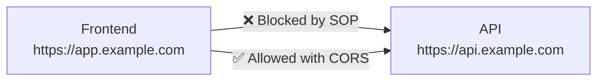

# Конфігурація CORS

## Короткий зміст

У цій лекції детально розглядається налаштування Cross-Origin Resource Sharing для безпечної взаємодії frontend та backend:

- **Same-Origin Policy** — браузерна політика безпеки, яка забороняє запити між різними origin (protocol + domain + port), необхідність CORS для обходу цієї політики
- **Базова конфігурація** — `app.enableCors()` у `main.ts` для дозволу cross-origin запитів, налаштування для розробки vs продакшену
- **Параметр origin** — обмеження дозволених джерел: string, array of strings, RegExp, або функція для динамічної перевірки, whitelist підхід для продакшену
- **Methods та headers** — дозволені HTTP методи (GET, POST, PUT, DELETE, PATCH), дозволені заголовки (Authorization, Content-Type, custom headers)
- **Credentials** — параметр `credentials: true` для дозволу cookies/authorization headers, вимога точного origin (не wildcard) при використанні credentials
- **Preflight requests** — OPTIONS запити для "складних" запитів (PUT, DELETE, custom headers), maxAge для кешування preflight відповідей
- **CORS у розробці** — дозвіл всіх origin `origin: true` для локальної розробки, використання proxy для обходу CORS в dev режимі
- **CORS у продакшені** — строгі обмеження origin, логування заблокованих запитів, моніторинг спроб несанкціонованого доступу

Розглядаються типові помилки CORS (blocked by CORS policy), налагодження через DevTools, конфігурація для різних сценаріїв (SPA, mobile apps, multiple frontends).

---

::card-group

::card{title="🎯 Мета лекції" icon="i-lucide-target"}

- Зрозуміти Same-Origin Policy та причини існування CORS як механізму безпеки браузерів.
- Навчитися налаштовувати CORS у NestJS застосунках для різних сценаріїв (розробка, продакшен, мобільні додатки).
- Опанувати конфігурацію параметрів origin, methods, headers, credentials для точного контролю доступу.
- Розібратися з preflight requests та оптимізацією через кешування OPTIONS запитів.
- Навчитися діагностувати та вирішувати типові проблеми CORS через DevTools.

::

::card{title="🔑 Ключові терміни" icon="i-lucide-key"}

- **Origin (Походження):** комбінація protocol + domain + port (наприклад, `https://example.com:443`).
- **Same-Origin Policy (SOP):** браузерна політика, що забороняє JavaScript коду з одного origin читати дані з іншого origin.
- **CORS (Cross-Origin Resource Sharing):** механізм, що дозволяє серверу явно вказати, які origins можуть отримувати доступ до його ресурсів.
- **Preflight Request:** OPTIONS запит, який браузер відправляє перед "складним" запитом для перевірки дозволів CORS.
- **Simple Request:** запит, що не вимагає preflight (GET/POST з базовими заголовками).

::

::

---

## Same-Origin Policy: Основи браузерної безпеки

**Same-Origin Policy (SOP)** — це фундаментальний механізм безпеки веб-браузерів, що запобігає витоку даних між різними веб-сайтами.

### Визначення Origin

**Origin** складається з трьох компонентів:

```
Origin = Protocol + Domain + Port
```

**Приклади same-origin перевірки:**

| URL 1 | URL 2 | Same Origin? | Причина |
|-------|-------|--------------|---------|
| `https://example.com/api` | `https://example.com/users` | ✅ Так | Повний збіг |
| `https://example.com:443/api` | `https://example.com/api` | ✅ Так | 443 — порт за замовчуванням для HTTPS |
| `http://example.com/api` | `https://example.com/api` | ❌ Ні | Різні протоколи (http vs https) |
| `https://example.com/api` | `https://api.example.com/api` | ❌ Ні | Різні домени (піддомен відрізняється) |
| `https://example.com:443/api` | `https://example.com:8080/api` | ❌ Ні | Різні порти (443 vs 8080) |
| `https://example.com/api` | `https://example.org/api` | ❌ Ні | Різні домени (com vs org) |

### Що блокується Same-Origin Policy?

SOP блокує:

- **Читання відповідей від cross-origin fetch/XMLHttpRequest запитів**
- **Доступ до DOM іншого origin через iframe** (`iframe.contentWindow.document`)
- **Читання cookies, localStorage, indexedDB іншого origin**

SOP **НЕ** блокує:

- **Відправлення запитів** (запит дійде до сервера, але браузер заблокує читання відповіді)
- **Завантаження ресурсів через теги:** `<script src="...">`, ``, `<link href="...">`
- **Форми** (`<form action="...">`)

### Чому потрібен CORS?

У сучасних веб-додатках frontend та backend часто знаходяться на різних доменах:



**Типові сценарії:**

- **SPA (Single Page Application):** React на `https://app.example.com` викликає API на `https://api.example.com`
- **Мобільні додатки:** iOS/Android застосунки використовують WebView для OAuth flows
- **Microservices:** Frontend звертається до кількох незалежних backend сервісів
- **CDN:** Статичні файли на CDN (`https://cdn.example.com`), API на основному домені

**CORS дозволяє серверу явно вказати:** "Я дозволяю запити від `https://app.example.com`".

---

## Базова конфігурація CORS у NestJS

NestJS надає зручний API для налаштування CORS через метод `enableCors()`.

### Простий дозвіл всіх origins (тільки для розробки!)

```typescript
// src/main.ts
import { NestFactory } from '@nestjs/core';
import { AppModule } from './app.module';

async function bootstrap() {
  const app = await NestFactory.create(AppModule);

  // ❌ НЕБЕЗПЕЧНО ДЛЯ ПРОДАКШЕНУ: дозволяє всі origins
  app.enableCors();

  await app.listen(3000);
}
bootstrap();
```

**Що робить `enableCors()` без параметрів:**

- Дозволяє **всі origins** (`Access-Control-Allow-Origin: *`)
- Дозволяє стандартні HTTP методи: GET, POST, PUT, DELETE, PATCH, OPTIONS
- **НЕ** дозволяє credentials (cookies, authorization headers)

::warning
**Увага:** `app.enableCors()` без параметрів дозволяє доступ з будь-якого сайту! Використовуйте це лише під час локальної розробки.
::

### Конфігурація для розробки

```typescript
// src/main.ts
async function bootstrap() {
  const app = await NestFactory.create(AppModule);

  // Конфігурація для локальної розробки
  if (process.env.NODE_ENV === 'development') {
    app.enableCors({
      origin: [
        'http://localhost:3000',      // React/Next.js dev server
        'http://localhost:5173',      // Vite dev server
        'http://localhost:4200',      // Angular dev server
        'http://127.0.0.1:3000',      // Альтернативний localhost
      ],
      credentials: true, // Дозвіл cookies та Authorization headers
    });
  }

  await app.listen(3000);
}
```

### Конфігурація для продакшену

```typescript
// src/main.ts
import { ConfigService } from '@nestjs/config';

async function bootstrap() {
  const app = await NestFactory.create(AppModule);
  const configService = app.get(ConfigService);

  // Строга конфігурація для продакшену
  app.enableCors({
    origin: configService.get<string>('CORS_ORIGIN'), // З .env файлу
    methods: ['GET', 'POST', 'PUT', 'DELETE', 'PATCH'],
    allowedHeaders: ['Content-Type', 'Authorization'],
    credentials: true,
    maxAge: 3600, // Кешування preflight на 1 годину
  });

  await app.listen(3000);
}
```

**Файл `.env` для продакшену:**

```env
# Продакшен
CORS_ORIGIN=https://app.example.com

# Або кілька origins через кому
CORS_ORIGIN=https://app.example.com,https://admin.example.com
```

---

## Параметри CORS: Детальний розбір

### 1. Origin: Контроль дозволених джерел

Параметр `origin` визначає, які домени можуть отримувати доступ до API.

#### Дозвіл одного origin

```typescript
app.enableCors({
  origin: 'https://app.example.com',
});
```

#### Дозвіл кількох origins (whitelist)

```typescript
app.enableCors({
  origin: [
    'https://app.example.com',
    'https://admin.example.com',
    'https://mobile.example.com',
  ],
});
```

#### Використання RegExp для піддоменів

```typescript
app.enableCors({
  // Дозволити всі піддомени example.com
  origin: /\.example\.com$/,
});

// Приклади:
// ✅ https://app.example.com
// ✅ https://admin.example.com
// ✅ https://api.example.com
// ❌ https://example.com (основний домен без піддомену)
// ❌ https://evil.com
```

#### Динамічна перевірка через функцію

```typescript
app.enableCors({
  origin: (origin, callback) => {
    const allowedOrigins = [
      'https://app.example.com',
      'https://admin.example.com',
    ];

    // Дозвіл для відсутності origin (наприклад, Postman, curl)
    if (!origin) {
      return callback(null, true);
    }

    // Перевірка whitelist
    if (allowedOrigins.includes(origin)) {
      callback(null, true);
    } else {
      console.warn(`CORS blocked request from origin: ${origin}`);
      callback(new Error('Not allowed by CORS'));
    }
  },
});
```

**Приклад динамічної перевірки з логуванням:**

```typescript
// src/config/cors.config.ts
import { CorsOptions } from '@nestjs/common/interfaces/external/cors-options.interface';

export const corsConfig: CorsOptions = {
  origin: (origin, callback) => {
    const allowedOrigins = process.env.CORS_ORIGIN?.split(',') || [];
    const isDevelopment = process.env.NODE_ENV === 'development';

    // У розробці дозволяємо localhost origins
    if (isDevelopment && origin?.includes('localhost')) {
      return callback(null, true);
    }

    // Дозвіл запитів без origin (Postman, server-to-server)
    if (!origin) {
      return callback(null, true);
    }

    // Перевірка whitelist
    if (allowedOrigins.includes(origin)) {
      callback(null, true);
    } else {
      console.error(`[CORS] Blocked request from unauthorized origin: ${origin}`);
      callback(new Error('Not allowed by CORS'));
    }
  },
  credentials: true,
};
```

**Використання у `main.ts`:**

```typescript
import { corsConfig } from './config/cors.config';

async function bootstrap() {
  const app = await NestFactory.create(AppModule);
  app.enableCors(corsConfig);
  await app.listen(3000);
}
```

### 2. Methods: Дозволені HTTP методи

```typescript
app.enableCors({
  origin: 'https://app.example.com',
  methods: ['GET', 'POST', 'PUT', 'DELETE', 'PATCH'], // Типовий набір для REST API
});
```

**Обмеження лише читання (read-only API):**

```typescript
app.enableCors({
  origin: 'https://public.example.com',
  methods: ['GET', 'HEAD'], // Лише читання
});
```

### 3. AllowedHeaders: Дозволені заголовки

```typescript
app.enableCors({
  origin: 'https://app.example.com',
  allowedHeaders: [
    'Content-Type',
    'Authorization',
    'X-Requested-With',
    'X-API-Key', // Кастомний заголовок
  ],
});
```

**Дозвіл будь-яких заголовків (не рекомендується для продакшену):**

```typescript
app.enableCors({
  origin: 'https://app.example.com',
  allowedHeaders: '*', // Будь-які заголовки
});
```

### 4. ExposedHeaders: Заголовки доступні клієнту

За замовчуванням браузер дозволяє JavaScript коду читати лише безпечні заголовки відповіді:

- `Cache-Control`
- `Content-Language`
- `Content-Type`
- `Expires`
- `Last-Modified`
- `Pragma`

Щоб дозволити читання кастомних заголовків, використовуйте `exposedHeaders`:

```typescript
app.enableCors({
  origin: 'https://app.example.com',
  exposedHeaders: [
    'X-Total-Count',      // Загальна кількість записів для пагінації
    'X-RateLimit-Limit',  // Ліміт запитів
    'X-RateLimit-Remaining', // Залишилось запитів
  ],
});
```

**Використання у клієнтському коді:**

```typescript
// Frontend (React/Vue/Angular)
const response = await fetch('https://api.example.com/posts');

// Без exposedHeaders — undefined
const totalCount = response.headers.get('X-Total-Count');

// З exposedHeaders — "150"
console.log(totalCount); // "150"
```

### 5. Credentials: Cookies та Authorization

Параметр `credentials: true` дозволяє браузеру відправляти cookies та Authorization headers у cross-origin запитах.

```typescript
app.enableCors({
  origin: 'https://app.example.com', // ❗ НЕ можна використовувати '*' з credentials
  credentials: true,
});
```

**Важливе обмеження:** при `credentials: true` параметр `origin` **НЕ може бути `'*'`**. Потрібно вказати точний origin або використовувати функцію.

**Використання у клієнтському коді:**

```typescript
// Frontend: відправлення cookies разом з запитом
fetch('https://api.example.com/profile', {
  method: 'GET',
  credentials: 'include', // ❗ Важливо: дозволяє відправлення cookies
  headers: {
    'Authorization': `Bearer ${token}`,
  },
});
```

### 6. MaxAge: Кешування preflight відповідей

```typescript
app.enableCors({
  origin: 'https://app.example.com',
  maxAge: 86400, // 24 години (у секундах)
});
```

Браузер кешує результат OPTIONS запиту на вказаний час, зменшуючи кількість preflight запитів.

---

## Preflight Requests: OPTIONS запити

**Preflight request** — це OPTIONS запит, який браузер автоматично відправляє перед "складним" запитом для перевірки дозволів CORS.

### Коли потрібен preflight?

Браузер відправляє preflight для **складних запитів**, які:

- Використовують методи крім GET, POST, HEAD
- Містять кастомні заголовки (наприклад, `Authorization`, `X-API-Key`)
- Використовують `Content-Type` крім `application/x-www-form-urlencoded`, `multipart/form-data`, `text/plain`

**Приклади складних запитів:**

```typescript
// ❌ Складний запит (потрібен preflight)
fetch('https://api.example.com/users/123', {
  method: 'DELETE', // Метод крім GET/POST
  headers: {
    'Authorization': 'Bearer token', // Кастомний заголовок
  },
});

// ❌ Складний запит (потрібен preflight)
fetch('https://api.example.com/posts', {
  method: 'POST',
  headers: {
    'Content-Type': 'application/json', // НЕ один із дозволених Content-Type
  },
  body: JSON.stringify({ title: 'Post' }),
});

// ✅ Простий запит (без preflight)
fetch('https://api.example.com/posts', {
  method: 'GET',
});
```

### Анатомія preflight запиту

**1. Браузер відправляє OPTIONS запит:**

```http
OPTIONS /users/123 HTTP/1.1
Host: api.example.com
Origin: https://app.example.com
Access-Control-Request-Method: DELETE
Access-Control-Request-Headers: Authorization
```

**2. Сервер відповідає дозволами:**

```http
HTTP/1.1 204 No Content
Access-Control-Allow-Origin: https://app.example.com
Access-Control-Allow-Methods: DELETE, GET, POST, PUT
Access-Control-Allow-Headers: Authorization, Content-Type
Access-Control-Max-Age: 86400
```

**3. Браузер відправляє фактичний запит:**

```http
DELETE /users/123 HTTP/1.1
Host: api.example.com
Origin: https://app.example.com
Authorization: Bearer token123
```

### Оптимізація preflight запитів

**Проблема:** кожен складний запит потребує 2 HTTP запити (OPTIONS + фактичний запит).

**Рішення:** використовуйте `maxAge` для кешування preflight відповідей:

```typescript
app.enableCors({
  origin: 'https://app.example.com',
  maxAge: 86400, // Браузер кешує дозволи на 24 години
});
```

**Результат:** після першого preflight запиту браузер не відправлятиме OPTIONS наступні 24 години для того самого endpoint.

::tip
**Рекомендація:** у продакшені встановлюйте `maxAge` на 1-24 години для зменшення навантаження на сервер.
::


---

## Налагодження CORS проблем

### Типові помилки CORS

#### 1. "Access to fetch blocked by CORS policy: No 'Access-Control-Allow-Origin' header"

**Причина:** сервер не надсилає заголовок `Access-Control-Allow-Origin`.

**Рішення:**

```typescript
// Увімкніть CORS у main.ts
app.enableCors({
  origin: 'https://app.example.com',
});
```

#### 2. "Access to fetch blocked by CORS policy: The 'Access-Control-Allow-Origin' header contains multiple values"

**Причина:** сервер надсилає кілька заголовків `Access-Control-Allow-Origin` (наприклад, через подвійну конфігурацію у NestJS та nginx).

**Рішення:** налаштуйте CORS лише в одному місці (або NestJS, або nginx, але не обидва).

**Nginx конфігурація (якщо не використовуєте `app.enableCors()`):**

```nginx
location /api {
    add_header 'Access-Control-Allow-Origin' 'https://app.example.com' always;
    add_header 'Access-Control-Allow-Methods' 'GET, POST, PUT, DELETE' always;
    add_header 'Access-Control-Allow-Headers' 'Authorization, Content-Type' always;
    add_header 'Access-Control-Allow-Credentials' 'true' always;

    if ($request_method = 'OPTIONS') {
        return 204;
    }

    proxy_pass http://localhost:3000;
}
```

#### 3. "Access to fetch blocked by CORS policy: Credentials flag is 'true', but 'Access-Control-Allow-Origin' is '*'"

**Причина:** при `credentials: true` не можна використовувати wildcard `*` для origin.

**Неправильно:**

```typescript
app.enableCors({
  origin: '*', // ❌ НЕ працює з credentials
  credentials: true,
});
```

**Правильно:**

```typescript
app.enableCors({
  origin: 'https://app.example.com', // ✅ Точний origin
  credentials: true,
});
```

#### 4. "Access to fetch blocked by CORS policy: Request header field 'authorization' is not allowed"

**Причина:** заголовок `Authorization` не вказано у `allowedHeaders`.

**Рішення:**

```typescript
app.enableCors({
  origin: 'https://app.example.com',
  allowedHeaders: ['Content-Type', 'Authorization'], // ✅ Додано Authorization
});
```

### Діагностика через DevTools

**Крок 1:** Відкрийте Chrome DevTools → Network tab

**Крок 2:** Знайдіть заблокований запит (червоний колір)

**Крок 3:** Перегляньте вкладку "Headers":

```
General:
  Request URL: https://api.example.com/users
  Request Method: DELETE
  Status Code: (failed) net::ERR_FAILED

Response Headers:
  (порожньо або відсутній Access-Control-Allow-Origin)

Request Headers:
  Origin: https://app.example.com
  Access-Control-Request-Method: DELETE
```

**Крок 4:** Перевірте Console для деталей помилки:

```
Access to fetch at 'https://api.example.com/users' from origin 'https://app.example.com' 
has been blocked by CORS policy: No 'Access-Control-Allow-Origin' header is present 
on the requested resource.
```

**Крок 5:** Перевірте OPTIONS запит (якщо є):

```
Request Method: OPTIONS
Status Code: 204 No Content

Response Headers:
  Access-Control-Allow-Origin: https://app.example.com
  Access-Control-Allow-Methods: GET, POST ❌ (DELETE відсутній!)
  Access-Control-Allow-Headers: Content-Type
```

---

## Конфігурація для різних сценаріїв

### Сценарій 1: SPA (Single Page Application)

**Завдання:** React/Vue/Angular frontend на окремому домені.

```typescript
// src/main.ts
app.enableCors({
  origin: process.env.FRONTEND_URL || 'https://app.example.com',
  credentials: true, // Для JWT у cookies
  methods: ['GET', 'POST', 'PUT', 'DELETE', 'PATCH'],
  allowedHeaders: ['Content-Type', 'Authorization'],
  exposedHeaders: ['X-Total-Count'], // Для пагінації
  maxAge: 3600,
});
```

**Frontend конфігурація (axios):**

```typescript
// src/api/client.ts
import axios from 'axios';

const apiClient = axios.create({
  baseURL: 'https://api.example.com',
  withCredentials: true, // ❗ Важливо для cookies
  headers: {
    'Content-Type': 'application/json',
  },
});

apiClient.interceptors.request.use((config) => {
  const token = localStorage.getItem('access_token');
  if (token) {
    config.headers.Authorization = `Bearer ${token}`;
  }
  return config;
});

export default apiClient;
```

### Сценарій 2: Кілька frontend додатків

**Завдання:** Admin panel, User app, Mobile web app на різних доменах.

```typescript
// src/config/cors.config.ts
export const corsConfig = {
  origin: [
    'https://app.example.com',      // User-facing SPA
    'https://admin.example.com',    // Admin panel
    'https://m.example.com',        // Mobile web app
  ],
  credentials: true,
  methods: ['GET', 'POST', 'PUT', 'DELETE', 'PATCH'],
  allowedHeaders: ['Content-Type', 'Authorization', 'X-Device-ID'],
  maxAge: 7200,
};
```

### Сценарій 3: Локальна розробка з HMR

**Завдання:** Підтримка Hot Module Replacement у Vite/Webpack dev server.

```typescript
// src/main.ts
async function bootstrap() {
  const app = await NestFactory.create(AppModule);

  const isDevelopment = process.env.NODE_ENV === 'development';

  app.enableCors({
    origin: isDevelopment
      ? [
          'http://localhost:3000',
          'http://localhost:5173', // Vite
          'http://127.0.0.1:3000',
          'http://127.0.0.1:5173',
        ]
      : process.env.FRONTEND_URL,
    credentials: true,
  });

  await app.listen(3001);
}
```

### Сценарій 4: Публічний API без автентифікації

**Завдання:** Відкритий REST API для зовнішніх розробників.

```typescript
app.enableCors({
  origin: '*', // Дозволити всі origins
  methods: ['GET', 'POST'],
  allowedHeaders: ['Content-Type', 'X-API-Key'], // API key замість JWT
  credentials: false, // Відключено
  maxAge: 86400,
});
```

### Сценарій 5: Мобільні додатки (iOS, Android)

**Завдання:** Підтримка WebView у мобільних застосунках.

```typescript
app.enableCors({
  origin: (origin, callback) => {
    // Мобільні додатки часто не відправляють Origin заголовок
    if (!origin) {
      return callback(null, true);
    }

    // Дозвіл для web frontend
    const allowedOrigins = ['https://app.example.com'];
    
    // Дозвіл для мобільних WebView (використовують file:// або custom scheme)
    if (origin.startsWith('file://') || origin.startsWith('capacitor://')) {
      return callback(null, true);
    }

    if (allowedOrigins.includes(origin)) {
      callback(null, true);
    } else {
      callback(new Error('Not allowed by CORS'));
    }
  },
  credentials: true,
  methods: ['GET', 'POST', 'PUT', 'DELETE'],
  allowedHeaders: ['Content-Type', 'Authorization', 'X-Device-ID'],
});
```

---

## CORS у розробці vs продакшені

### Розробка: Гнучкість для швидкого прототипування

```typescript
// src/main.ts (Development)
if (process.env.NODE_ENV === 'development') {
  app.enableCors({
    origin: true, // Дозволити будь-який origin
    credentials: true,
  });
}
```

**Альтернатива: Proxy у frontend dev server**

Замість налаштування CORS у розробці, використовуйте proxy у Vite/Webpack:

```typescript
// vite.config.ts (Frontend)
export default defineConfig({
  server: {
    proxy: {
      '/api': {
        target: 'http://localhost:3001',
        changeOrigin: true,
        rewrite: (path) => path.replace(/^\/api/, ''),
      },
    },
  },
});
```

**Переваги proxy підходу:**

- Frontend та backend здаються браузеру як один origin → немає CORS проблем
- Не потрібно налаштовувати CORS у backend для розробки
- Ближче до production setup (якщо у продакшені використовується nginx proxy)

### Продакшен: Строгі обмеження для безпеки

```typescript
// src/main.ts (Production)
import { ConfigService } from '@nestjs/config';
import { Logger } from '@nestjs/common';

async function bootstrap() {
  const app = await NestFactory.create(AppModule);
  const configService = app.get(ConfigService);
  const logger = new Logger('CORS');

  app.enableCors({
    origin: (origin, callback) => {
      const allowedOrigins = configService
        .get<string>('CORS_ALLOWED_ORIGINS')
        ?.split(',') || [];

      if (!origin) {
        // Дозвіл для server-to-server запитів (без Origin header)
        return callback(null, true);
      }

      if (allowedOrigins.includes(origin)) {
        callback(null, true);
      } else {
        // Логування спроб несанкціонованого доступу
        logger.warn(`CORS blocked unauthorized origin: ${origin}`);
        callback(new Error('Not allowed by CORS'));
      }
    },
    credentials: true,
    methods: ['GET', 'POST', 'PUT', 'DELETE', 'PATCH'],
    allowedHeaders: ['Content-Type', 'Authorization'],
    exposedHeaders: ['X-Total-Count', 'X-RateLimit-Remaining'],
    maxAge: 7200, // 2 години
  });

  await app.listen(3000);
}
```

**Production `.env`:**

```env
CORS_ALLOWED_ORIGINS=https://app.example.com,https://admin.example.com
NODE_ENV=production
```

---

## Безпека CORS: Best Practices

### 1. Ніколи не використовуйте wildcard у продакшені

```typescript
// ❌ НЕБЕЗПЕЧНО
app.enableCors({
  origin: '*', // Дозволяє будь-якому сайту отримувати дані
  credentials: true,
});

// ✅ БЕЗПЕЧНО
app.enableCors({
  origin: ['https://app.example.com'],
  credentials: true,
});
```

**Чому небезпечно:** зловмисний сайт може викликати ваш API від імені користувача, якщо користувач автентифікований (session/cookie based auth).

### 2. Обмежуйте дозволені методи

```typescript
// ❌ Надмірні дозволи
app.enableCors({
  methods: '*', // Дозволяє всі методи, включаючи TRACE, CONNECT
});

// ✅ Мінімальні необхідні дозволи
app.enableCors({
  methods: ['GET', 'POST', 'PUT', 'DELETE'], // Лише необхідні для REST API
});
```

### 3. Явно вказуйте allowedHeaders

```typescript
// ❌ Дозвіл будь-яких заголовків
app.enableCors({
  allowedHeaders: '*',
});

// ✅ Whitelist необхідних заголовків
app.enableCors({
  allowedHeaders: ['Content-Type', 'Authorization', 'X-API-Key'],
});
```

### 4. Логуйте заблоковані запити

```typescript
// src/middleware/cors-logger.middleware.ts
import { Injectable, NestMiddleware, Logger } from '@nestjs/common';
import { Request, Response, NextFunction } from 'express';

@Injectable()
export class CorsLoggerMiddleware implements NestMiddleware {
  private logger = new Logger('CORS');

  use(req: Request, res: Response, next: NextFunction) {
    const origin = req.get('origin');
    
    if (origin && !this.isAllowedOrigin(origin)) {
      this.logger.warn(`Blocked CORS request from: ${origin} to ${req.path}`);
    }

    next();
  }

  private isAllowedOrigin(origin: string): boolean {
    const allowedOrigins = process.env.CORS_ALLOWED_ORIGINS?.split(',') || [];
    return allowedOrigins.includes(origin);
  }
}
```

### 5. Моніторинг аномалій CORS

**Інтеграція з системою моніторингу:**

```typescript
// src/filters/cors-exception.filter.ts
import { ExceptionFilter, Catch, ArgumentsHost, HttpException } from '@nestjs/common';
import { Request, Response } from 'express';

@Catch()
export class CorsExceptionFilter implements ExceptionFilter {
  catch(exception: any, host: ArgumentsHost) {
    const ctx = host.switchToHttp();
    const request = ctx.getRequest<Request>();
    const response = ctx.getResponse<Response>();

    // Перевірка CORS помилок
    if (exception.message === 'Not allowed by CORS') {
      // Надіслати метрику до системи моніторингу (Datadog, Sentry)
      this.logSecurityEvent({
        type: 'CORS_VIOLATION',
        origin: request.get('origin'),
        path: request.path,
        method: request.method,
        timestamp: new Date().toISOString(),
      });

      response.status(403).json({
        statusCode: 403,
        message: 'CORS policy violation',
      });
    }
  }

  private logSecurityEvent(event: any) {
    // Інтеграція з Sentry, Datadog, CloudWatch
    console.error('[SECURITY] CORS violation detected:', event);
  }
}
```

---

## Інтерактивні запитання для самоперевірки

::accordion

::accordion-item{label="❓ Чому Same-Origin Policy не блокує теги  та <script>, але блокує fetch?" icon="i-lucide-help-circle"}

**Same-Origin Policy (SOP)** розроблена для захисту **даних**, а не ресурсів.

**Теги `` та `<script>`** завантажують ресурси, але **НЕ дають JavaScript коду доступ до їхнього вмісту**:

```javascript
// ✅ Дозволено: завантажити зображення


// ❌ Заборонено: прочитати піксели зображення з іншого origin
const img = new Image();
img.src = 'https://evil.com/image.jpg';
const canvas = document.createElement('canvas');
canvas.getContext('2d').drawImage(img, 0, 0);
canvas.toDataURL(); // ❌ SecurityError: tainted canvas
```

**Fetch/XMLHttpRequest** надають JavaScript коду **повний доступ до відповіді** (headers, body, cookies), тому SOP блокує їх для захисту конфіденційних даних.

**Висновок:** SOP блокує **читання відповідей**, а не **завантаження ресурсів**.

::

::accordion-item{label="❓ Чи можна обійти CORS через backend proxy?" icon="i-lucide-help-circle"}

Так, але це змінює архітектуру запиту:

**Без proxy (CORS проблема):**

```
Frontend (https://app.com) 
  → ❌ Браузер блокує → 
API (https://api.other.com)
```

**З proxy (без CORS проблеми):**

```
Frontend (https://app.com) 
  → ✅ Same-origin запит → 
Your Backend (https://app.com/api) 
  → Server-to-server запит (без CORS) → 
API (https://api.other.com)
```

**Приклад proxy у NestJS:**

```typescript
// src/proxy/proxy.controller.ts
@Controller('external-api')
export class ProxyController {
  @Get('*')
  async proxyGet(@Req() req: Request, @Res() res: Response) {
    const externalUrl = `https://api.other.com${req.path}`;
    const response = await fetch(externalUrl);
    const data = await response.json();
    res.json(data);
  }
}
```

**Плюси:** обходить CORS, дозволяє приховати API ключі, додає додатковий контроль.

**Мінуси:** додаткове навантаження на ваш backend, складніша архітектура.

::

::accordion-item{label="❓ Чому preflight запити можуть уповільнити додаток?" icon="i-lucide-help-circle"}

Кожен **складний запит** вимагає **2 HTTP запити**:

1. **OPTIONS запит (preflight)** — перевірка дозволів CORS
2. **Фактичний запит** — отримання даних

**Приклад:**

```typescript
// Один DELETE запит = 2 HTTP запити
await fetch('https://api.example.com/users/123', {
  method: 'DELETE',
  headers: { 'Authorization': 'Bearer token' },
});

// 1. OPTIONS /users/123 (preflight)
// 2. DELETE /users/123 (фактичний)
```

**Оптимізація через `maxAge`:**

```typescript
app.enableCors({
  maxAge: 86400, // Кешувати preflight на 24 години
});
```

**Результат:** після першого preflight браузер **не відправлятиме OPTIONS** наступні 24 години для того самого endpoint.

**Рекомендація:** встановлюйте `maxAge` на 1-24 години у продакшені для зменшення кількості зайвих запитів.

::

::

---

## Підсумок

::card-group

::card{title="🔐 Same-Origin Policy" icon="i-lucide-shield"}

**Основи браузерної безпеки:**
- Origin = Protocol + Domain + Port
- Блокує читання відповідей між різними origins
- Захищає від витоку даних між сайтами

**CORS дозволяє серверу явно вказати дозволені origins**

::

::card{title="⚙️ Конфігурація NestJS" icon="i-lucide-settings"}

**Ключові параметри:**
- `origin` — whitelist дозволених доменів
- `credentials: true` — дозвіл cookies/auth headers
- `allowedHeaders` — дозволені заголовки запиту
- `exposedHeaders` — заголовки доступні клієнту
- `maxAge` — кешування preflight (оптимізація)

**Використання:** `app.enableCors({ ... })` у `main.ts`

::

::card{title="🚀 Preflight оптимізація" icon="i-lucide-zap"}

**Проблема:** складні запити вимагають 2 HTTP запити

**Рішення:** 
- `maxAge: 86400` — кешувати preflight на 24 год
- Зменшує кількість OPTIONS запитів
- Покращує продуктивність

::

::card{title="🔒 Безпека у продакшені" icon="i-lucide-lock"}

**Best practices:**
- ❌ Ніколи не використовуйте `origin: '*'`
- ✅ Whitelist точних origins
- ✅ Логуйте заблоковані запити
- ✅ Моніторинг аномалій CORS
- ✅ Обмежуйте методи та заголовки

::

::

---

У цій лекції ми детально розглянули налаштування CORS у NestJS застосунках для безпечної взаємодії між frontend та backend. CORS є критично важливим механізмом для захисту користувацьких даних у cross-origin сценаріях.

**Ключові висновки:**

- **Same-Origin Policy** захищає від витоку даних між сайтами, але блокує легітимні cross-origin запити.
- **CORS** дозволяє серверу явно вказати, які origins, методи та заголовки дозволені.
- **Preflight requests** можна оптимізувати через `maxAge` для зменшення навантаження.
- У **продакшені** завжди використовуйте строгий whitelist origins та логуйте спроби несанкціонованого доступу.

У наступній лекції розглянемо **Helmet** — бібліотеку для налаштування HTTP security headers, що захищають від XSS, clickjacking та інших атак.
