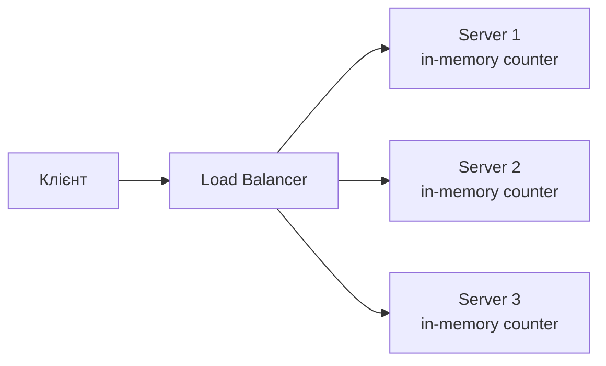
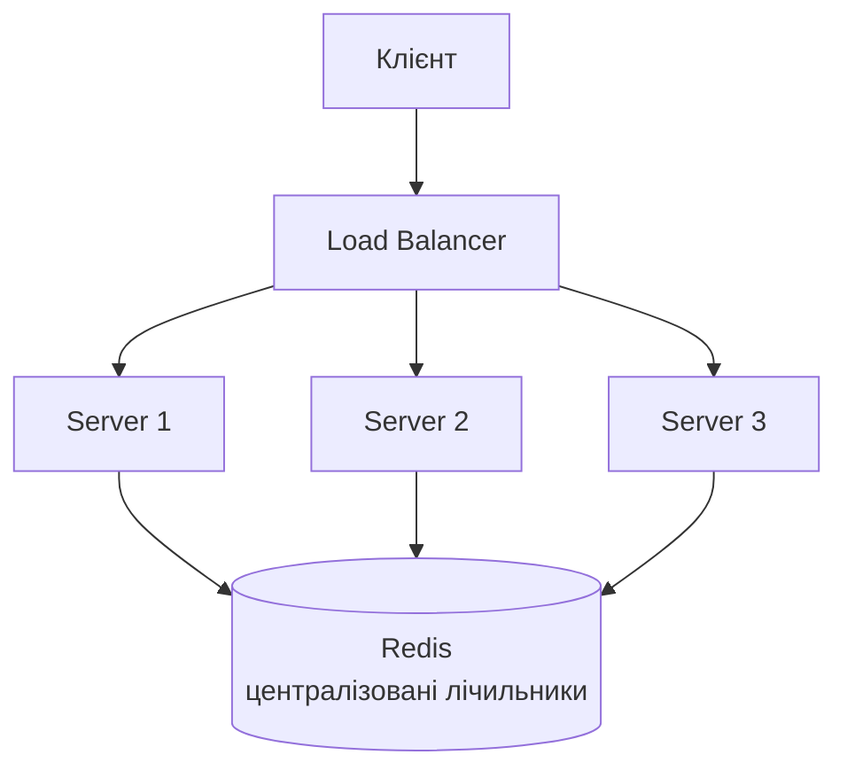

# Rate Limiting та Throttling

## Короткий зміст

У цій лекції розглядається захист API від зловживань через обмеження частоти запитів:

- **Rate Limiting** — обмеження кількості запитів від одного клієнта за проміжок часу, захист від brute force атак (підбір паролів), DDoS атак, зловживання API
- **Бібліотека @nestjs/throttler** — офіційний модуль для rate limiting у NestJS, інтеграція через `ThrottlerModule.forRoot()`, налаштування TTL (time to live) та limit (максимум запитів)
- **ThrottlerGuard** — глобальний Guard для застосування rate limiting до всіх маршрутів, автоматичне відстеження запитів по IP адресі, відповідь 429 Too Many Requests при перевищенні ліміту
- **Декоратор @Throttle()** — route-specific налаштування ліміту, override глобальних налаштувань для окремих ендпоінтів (наприклад, жорсткіший ліміт для `/auth/login`)
- **Декоратор @SkipThrottle()** — виключення маршрутів з rate limiting (наприклад, health checks, webhooks від trusted провайдерів)
- **Сховища для rate limiting** — in-memory storage (за замовчуванням) для single-instance застосунків, Redis storage для horizontal scaling та distributed rate limiting
- **Кастомні стратегії** — власна логіка throttling на основі userId замість IP, різні ліміти для різних ролей (admin має більший ліміт)
- **Response headers** — заголовки X-RateLimit-Limit, X-RateLimit-Remaining, X-RateLimit-Reset для інформування клієнта про стан ліміту

Розглядаються практичні сценарії: захист логіну від brute force (5 спроб за 15 хвилин), обмеження API endpoints (100 запитів на годину), sliding window vs fixed window алгоритми.

---

::card-group

::card{title="🎯 Мета лекції" icon="i-lucide-target"}

- Опанувати концепції Rate Limiting та Throttling для захисту API від зловживань.
- Навчитися інтегрувати `@nestjs/throttler` у NestJS застосунки для автоматичного обмеження запитів.
- Налаштувати різні ліміти для різних типів ендпоінтів (публічні, автентифіковані, адміністративні).
- Впровадити distributed rate limiting через Redis для масштабованих систем.
- Створити кастомні стратегії throttling на основі userId та ролей користувача.

::

::card{title="🔑 Ключові терміни" icon="i-lucide-key"}

- **Rate Limiting:** обмеження кількості запитів від одного клієнта за певний проміжок часу.
- **Throttling:** уповільнення або обмеження частоти запитів (часто використовується як синонім rate limiting).
- **Fixed Window:** алгоритм підрахунку запитів у фіксованих часових вікнах (наприклад, 00:00-01:00).
- **Sliding Window:** алгоритм підрахунку запитів у ковзному часовому вікні (останні N секунд).
- **Token Bucket:** алгоритм з "відрами токенів", що поповнюються з фіксованою швидкістю.
- **Leaky Bucket:** алгоритм з "дірявим відром", що обробляє запити з постійною швидкістю.

::

::

---

## Rate Limiting: Необхідність та основи

У попередній лекції ми розглянули захист застосунку через HTTP Security Headers, що інструктують браузер про правила безпеки при відображенні контенту. Ці заголовки захищають від атак на стороні клієнта (XSS, clickjacking), але не вирішують проблему **зловживання API** з боку зловмисників або некоректно налаштованих клієнтів.

**Rate Limiting** — це механізм обмеження кількості запитів, які один клієнт може виконати за певний проміжок часу. Це критично важлива складова безпеки та стабільності веб-застосунків.

### Проблеми, які вирішує Rate Limiting

#### 1. Brute Force атаки на автентифікацію

Зловмисник намагається підібрати пароль користувача, відправляючи тисячі запитів на `/auth/login`:

```typescript
// ❌ Без Rate Limiting: зловмисник може спробувати 10,000 паролів за хвилину
POST /auth/login
{ "email": "victim@example.com", "password": "password123" }

POST /auth/login
{ "email": "victim@example.com", "password": "123456" }

POST /auth/login
{ "email": "victim@example.com", "password": "qwerty" }
// ... і так 10,000 разів
```

**З Rate Limiting:** після 5 невдалих спроб за 15 хвилин клієнт отримує блокування на 15 хвилин.

#### 2. DDoS атаки (Distributed Denial of Service)

Зловмисник відправляє величезну кількість запитів з метою перевантаження серверу та зробити його недоступним для легітимних користувачів:

```bash
# Атакуючий відправляє 100,000 запитів за секунду
for i in {1..100000}; do
  curl https://api.example.com/expensive-query &
done
```

**З Rate Limiting:** кожен IP обмежений, наприклад, 100 запитами на хвилину. Надлишкові запити отримують відповідь `429 Too Many Requests`.

#### 3. Зловживання API безкоштовними користувачами

У SaaS моделях з різними тарифами потрібно обмежувати API calls залежно від плану користувача:

```
Free Plan:    100 API requests / day
Starter Plan: 1,000 API requests / day
Pro Plan:     10,000 API requests / day
Enterprise:   Unlimited
```

#### 4. Захист від помилкових клієнтів

Некоректно налаштований клієнт (баг у мобільному додатку, нескінченний loop у frontend) може ненавмисно перевантажити ваш API:

```javascript
// ❌ Баг у frontend: нескінченний polling без затримки
while (true) {
  await fetch('/api/notifications'); // Кожні 0ms!
}
```

**З Rate Limiting:** після 60 запитів за хвилину клієнт отримає блокування, що дасть час розробникам виявити та виправити баг.

### Різниця між Rate Limiting та Throttling

Хоча терміни часто використовуються як синоніми, існує тонка відмінність:

| Аспект | Rate Limiting | Throttling |
|--------|---------------|------------|
| **Мета** | Жорстко обмежити кількість запитів | Уповільнити швидкість обробки |
| **Поведінка при перевищенні** | Відхилити запит (429 error) | Поставити запит у чергу або затримати |
| **Приклад** | "Максимум 100 запитів на годину" | "Обробляти не більше 10 запитів одночасно" |

**У цій лекції ми фокусуємося на Rate Limiting** — жорсткому обмеженні з відхиленням надлишкових запитів.

::note
У NestJS бібліотека `@nestjs/throttler` реалізує саме **Rate Limiting** (попри назву "throttler"). При перевищенні ліміту запит відхиляється з кодом 429, а не ставиться у чергу.
::

---

## Алгоритми Rate Limiting

Існує кілька підходів до реалізації rate limiting, кожен з яких має свої переваги та компроміси.

### Fixed Window (Фіксоване вікно)

**Принцип:** час розбивається на фіксовані інтервали (наприклад, по 1 годині). У кожному інтервалі клієнт може виконати N запитів.

**Приклад:** "100 запитів на годину"

```
Час:     00:00 ─────────────── 01:00 ─────────────── 02:00
Вікна:   [  Вікно 1 (0 req)  ] [  Вікно 2 (0 req)  ]
```

**Поведінка:**

```
00:00 → Клієнт відправляє 100 запитів → OK (100/100)
00:59 → Клієнт відправляє 1 запит → 429 (перевищення ліміту)
01:00 → Лічильник обнуляється → 0/100
01:00 → Клієнт відправляє 100 запитів → OK
```

**Недолік: Burst проблема**

Клієнт може відправити 100 запитів у 00:59 та ще 100 у 01:00 — загалом **200 запитів за 1 хвилину**:

```
00:59:00 → 100 requests (OK)
01:00:00 → Лічильник обнулився
01:00:01 → 100 requests (OK)
───────────────────────────────
За 1 хвилину: 200 запитів!
```

### Sliding Window (Ковзне вікно)

**Принцип:** лічильник враховує запити за **останні N секунд** від поточного моменту, незалежно від меж годин.

**Приклад:** "100 запитів за останню годину"

```
Поточний час: 01:30
Вікно: від 00:30 до 01:30 (останні 60 хвилин)
```

**Перевага:** немає burst проблеми. У будь-який момент клієнт не може перевищити ліміт.

**Недолік:** потребує зберігання часових міток усіх запитів (більше пам'яті).

### Token Bucket (Відро токенів)

**Принцип:** клієнт має "відро" з токенами. Кожен запит витрачає 1 токен. Токени поповнюються з фіксованою швидкістю (наприклад, 10 токенів/сек).

**Приклад:**

```
Початок: 100 токенів у відрі
00:00:00 → Клієнт робить 50 запитів → Залишилось 50 токенів
00:00:01 → +10 токенів (refill) → 60 токенів
00:00:02 → +10 токенів → 70 токенів
00:00:10 → Відро повне (100 токенів)
```

**Перевага:** дозволяє короткочасні сплески (*bursts*) у межах capacity відра, але обмежує середню швидкість.

### Leaky Bucket (Дірявий відро)

**Принцип:** запити потрапляють у чергу (відро), що "витікає" з постійною швидкістю. Якщо відро переповнюється, нові запити відхиляються.

**Приклад:**

```
Швидкість обробки: 10 req/sec
Розмір черги: 50 requests

Клієнт відправляє 100 req/sec → 50 req йдуть у чергу, решта відхиляються
```

**Перевага:** гарантує рівномірне навантаження на backend (згладжує сплески).

**Недолік:** додає затримку для запитів у черзі.

::tip
**Рекомендація для більшості застосунків:** використовуйте **Sliding Window** або **Token Bucket**. Fixed Window простіший у реалізації, але має burst проблему. `@nestjs/throttler` за замовчуванням використовує **Fixed Window**.
::

---

## Інтеграція @nestjs/throttler

`@nestjs/throttler` — це офіційний модуль NestJS для реалізації rate limiting через Guards.

### Встановлення

::tabs
::tabs-item{label="npm"}
```bash
npm install --save @nestjs/throttler
```
::
::tabs-item{label="pnpm"}
```bash
pnpm add @nestjs/throttler
```
::
::tabs-item{label="yarn"}
```bash
yarn add @nestjs/throttler
```
::
::

### Базова конфігурація

```typescript
// src/app.module.ts
import { Module } from '@nestjs/common';
import { ThrottlerModule, ThrottlerGuard } from '@nestjs/throttler';
import { APP_GUARD } from '@nestjs/core';

@Module({
  imports: [
    ThrottlerModule.forRoot([
      {
        ttl: 60000,  // Time to live: 60 секунд (1 хвилина)
        limit: 10,   // Максимум 10 запитів за TTL
      },
    ]),
  ],
  providers: [
    {
      provide: APP_GUARD,
      useClass: ThrottlerGuard, // Глобальний Guard для всіх маршрутів
    },
  ],
})
export class AppModule {}
```

**Що це означає:**

- **TTL (Time To Live):** часове вікно у мілісекундах (60000 ms = 1 хвилина).
- **Limit:** максимальна кількість запитів у межах TTL.
- **ThrottlerGuard:** автоматично застосовується до всіх контролерів та маршрутів.

**Результат:** кожен IP може виконати максимум 10 запитів за хвилину. При перевищенні:

```http
HTTP/1.1 429 Too Many Requests
Content-Type: application/json

{
  "statusCode": 429,
  "message": "ThrottlerException: Too Many Requests"
}
```

### Response Headers

`@nestjs/throttler` автоматично додає інформаційні заголовки до відповідей:

```http
X-RateLimit-Limit: 10              # Загальний ліміт
X-RateLimit-Remaining: 7           # Залишилось запитів
X-RateLimit-Reset: 1694095200      # Unix timestamp скидання лічильника
Retry-After: 45                    # Секунд до можливості повторного запиту
```

**Використання у клієнтському коді:**

```typescript
// Frontend (React/Vue/Angular)
const response = await fetch('/api/users');

if (response.status === 429) {
  const retryAfter = response.headers.get('Retry-After');
  console.warn(`Rate limit exceeded. Retry after ${retryAfter} seconds.`);
  
  // Показати користувачеві повідомлення або автоматично повторити запит
  setTimeout(() => {
    // Повторити запит
  }, parseInt(retryAfter) * 1000);
}
```

---

## Route-Specific конфігурація

### Декоратор @Throttle()

Для окремих маршрутів можна override глобальні налаштування:

```typescript
// src/auth/auth.controller.ts
import { Controller, Post, Body } from '@nestjs/common';
import { Throttle } from '@nestjs/throttler';

@Controller('auth')
export class AuthController {
  // Жорсткіший ліміт для логіну: 5 спроб за 15 хвилин
  @Post('login')
  @Throttle({ default: { limit: 5, ttl: 900000 } }) // 15 хвилин = 900,000 ms
  async login(@Body() loginDto: LoginDto) {
    return this.authService.login(loginDto);
  }

  // Реєстрація: 3 спроби за годину
  @Post('register')
  @Throttle({ default: { limit: 3, ttl: 3600000 } })
  async register(@Body() registerDto: RegisterDto) {
    return this.authService.register(registerDto);
  }

  // Інші маршрути використовують глобальні налаштування (10 req/min)
}
```

**Ієрархія пріоритетів:**

1. **Декоратор на методі** (`@Throttle()` на конкретному маршруті)
2. **Декоратор на класі** (`@Throttle()` на контролері)
3. **Глобальна конфігурація** (у `ThrottlerModule.forRoot()`)

### Декоратор @SkipThrottle()

Деякі маршрути не повинні обмежуватися (наприклад, health checks, webhooks від довірених провайдерів):

```typescript
// src/health/health.controller.ts
import { Controller, Get } from '@nestjs/common';
import { SkipThrottle } from '@nestjs/throttler';

@Controller('health')
export class HealthController {
  @Get()
  @SkipThrottle() // Виключити з rate limiting
  check() {
    return { status: 'ok', timestamp: Date.now() };
  }
}
```

**Вимкнення throttling для всього контролера:**

```typescript
@Controller('webhooks')
@SkipThrottle() // Всі маршрути у цьому контролері виключені
export class WebhooksController {
  @Post('stripe')
  handleStripeWebhook(@Body() payload: any) {
    // Обробка webhook від Stripe
  }

  @Post('github')
  handleGitHubWebhook(@Body() payload: any) {
    // Обробка webhook від GitHub
  }
}
```

**Вимкнення для одного маршруту у контролері з throttling:**

```typescript
@Controller('api')
export class ApiController {
  @Get('users')
  getUsers() {
    // Підпадає під глобальний throttling
  }

  @Get('public-stats')
  @SkipThrottle() // Виключення для цього маршруту
  getPublicStats() {
    return { users: 1000, posts: 5000 };
  }
}
```

---

## Кілька Rate Limit профілів

У версії 5.0+ `@nestjs/throttler` підтримує **кілька профілів throttling** одночасно:

```typescript
// src/app.module.ts
ThrottlerModule.forRoot([
  {
    name: 'short',
    ttl: 1000,    // 1 секунда
    limit: 3,     // Максимум 3 запити за секунду
  },
  {
    name: 'medium',
    ttl: 10000,   // 10 секунд
    limit: 20,    // Максимум 20 запитів за 10 секунд
  },
  {
    name: 'long',
    ttl: 60000,   // 1 хвилина
    limit: 100,   // Максимум 100 запитів за хвилину
  },
])
```

**Що це означає:** всі три ліміти перевіряються **одночасно**. Запит блокується, якщо порушено хоча б один з них.

**Приклад поведінки:**

```
Клієнт відправляє 4 запити за 1 секунду:
❌ Заблоковано (порушено 'short': 3 req/sec)

Клієнт відправляє 3 req/sec, але 25 запитів за 10 секунд:
❌ Заблоковано (порушено 'medium': 20 req/10sec)

Клієнт відправляє 2 req/sec (всього 120 за хвилину):
❌ Заблоковано (порушено 'long': 100 req/min)
```

**Використання конкретного профілю для маршруту:**

```typescript
@Post('upload')
@Throttle({ short: { limit: 1, ttl: 5000 } }) // Override лише 'short' профіль
async uploadFile(@UploadedFile() file: Express.Multer.File) {
  // Дозволити лише 1 завантаження за 5 секунд
}
```

::tip
**Багатопрофільний підхід захищає від різних типів атак:**
- **Short TTL:** захист від burst атак (раптові сплески)
- **Medium TTL:** захист від sustained attacks (тривалі атаки)
- **Long TTL:** квота для fair usage policy
::


---

## Redis Storage для Distributed Rate Limiting

За замовчуванням `@nestjs/throttler` зберігає лічильники запитів **у пам'яті Node.js процесу** (in-memory). Це працює для single-instance застосунків, але створює проблему при horizontal scaling.

### Проблема In-Memory Storage

**Сценарій:** ваш API розгорнутий на 3 серверах за load balancer.



**Проблема:** кожен сервер має **власний лічильник**. Клієнт може відправити:

- 10 запитів на Server 1 (OK)
- 10 запитів на Server 2 (OK)
- 10 запитів на Server 3 (OK)

**Загалом: 30 запитів замість ліміту 10!**

### Рішення: Централізоване сховище у Redis

Redis виступає як **спільний лічильник** для всіх серверів:



**Результат:** всі сервери читають та оновлюють **один лічильник** у Redis. Клієнт обмежений 10 запитами **загалом**, незалежно від того, на який сервер потрапив запит.

### Встановлення Redis Storage

**Крок 1:** Встановити залежності

::tabs
::tabs-item{label="npm"}
```bash
npm install --save @nestjs/throttler-storage-redis ioredis
```
::
::tabs-item{label="pnpm"}
```bash
pnpm add @nestjs/throttler-storage-redis ioredis
```
::
::tabs-item{label="yarn"}
```bash
yarn add @nestjs/throttler-storage-redis ioredis
```
::
::

**Крок 2:** Налаштувати ThrottlerModule

```typescript
// src/app.module.ts
import { Module } from '@nestjs/common';
import { ThrottlerModule } from '@nestjs/throttler';
import { ThrottlerStorageRedisService } from '@nestjs/throttler-storage-redis';
import Redis from 'ioredis';

@Module({
  imports: [
    ThrottlerModule.forRoot({
      throttlers: [
        {
          ttl: 60000,  // 1 хвилина
          limit: 100,  // 100 запитів
        },
      ],
      storage: new ThrottlerStorageRedisService(
        new Redis({
          host: process.env.REDIS_HOST || 'localhost',
          port: parseInt(process.env.REDIS_PORT) || 6379,
          password: process.env.REDIS_PASSWORD,
          db: 0,
        })
      ),
    }),
  ],
})
export class AppModule {}
```

**Крок 3:** Налаштувати Redis через Docker Compose (для локальної розробки)

```yaml
# docker-compose.yml
version: '3.8'

services:
  redis:
    image: redis:7-alpine
    ports:
      - '6379:6379'
    volumes:
      - redis_data:/data
    command: redis-server --appendonly yes

volumes:
  redis_data:
```

**Запуск:**

```bash
docker compose up -d redis
```

### Конфігурація через ConfigService

Для production середовища використовуйте `ConfigModule`:

```typescript
// src/app.module.ts
import { ConfigModule, ConfigService } from '@nestjs/config';

@Module({
  imports: [
    ConfigModule.forRoot(),
    ThrottlerModule.forRootAsync({
      imports: [ConfigModule],
      inject: [ConfigService],
      useFactory: (config: ConfigService) => ({
        throttlers: [
          {
            ttl: config.get<number>('THROTTLE_TTL', 60000),
            limit: config.get<number>('THROTTLE_LIMIT', 100),
          },
        ],
        storage: new ThrottlerStorageRedisService(
          new Redis({
            host: config.get<string>('REDIS_HOST', 'localhost'),
            port: config.get<number>('REDIS_PORT', 6379),
            password: config.get<string>('REDIS_PASSWORD'),
            db: config.get<number>('REDIS_DB', 0),
          })
        ),
      }),
    }),
  ],
})
export class AppModule {}
```

**Файл `.env`:**

```env
# Redis Configuration
REDIS_HOST=redis
REDIS_PORT=6379
REDIS_PASSWORD=your_secure_password
REDIS_DB=0

# Throttle Configuration
THROTTLE_TTL=60000
THROTTLE_LIMIT=100
```

::note
**Redis Cluster для high-availability:** у продакшені використовуйте Redis Cluster або Redis Sentinel для автоматичного failover та реплікації. `ioredis` підтримує підключення до кластера через параметр `new Redis.Cluster([...nodes])`.
::

---

## Кастомні Throttling стратегії

За замовчуванням `@nestjs/throttler` ідентифікує клієнтів за **IP адресою**. Проте це не завжди оптимально:

**Проблеми IP-based throttling:**

- **NAT та корпоративні мережі:** кілька користувачів можуть ділити одну публічну IP.
- **VPN та проксі:** зловмисник може змінювати IP для обходу ліміту.
- **Mobile networks:** IP адреса змінюється при переключенні між Wi-Fi та мобільним інтернетом.

**Рішення:** створити кастомну стратегію на основі **userId** для автентифікованих користувачів.

### Throttling на основі userId

```typescript
// src/common/guards/user-throttler.guard.ts
import { Injectable, ExecutionContext } from '@nestjs/common';
import { ThrottlerGuard } from '@nestjs/throttler';

@Injectable()
export class UserThrottlerGuard extends ThrottlerGuard {
  protected async getTracker(req: Record<string, any>): Promise<string> {
    // Якщо користувач автентифікований — використати userId
    if (req.user && req.user.id) {
      return `user:${req.user.id}`;
    }

    // Якщо ні — fallback на IP адресу
    return req.ip;
  }
}
```

**Використання:**

```typescript
// src/app.module.ts
import { APP_GUARD } from '@nestjs/core';
import { UserThrottlerGuard } from './common/guards/user-throttler.guard';

@Module({
  providers: [
    {
      provide: APP_GUARD,
      useClass: UserThrottlerGuard, // Замість стандартного ThrottlerGuard
    },
  ],
})
export class AppModule {}
```

**Результат:** два користувачі з однієї IP матимуть **окремі ліміти**, а зловмисник не зможе обійти ліміт зміною IP (якщо він автентифікований).

### Різні ліміти для різних ролей

Адміністратори потребують вищих лімітів, ніж звичайні користувачі:

```typescript
// src/common/guards/role-based-throttler.guard.ts
import { Injectable } from '@nestjs/common';
import { ThrottlerGuard, ThrottlerRequest } from '@nestjs/throttler';

@Injectable()
export class RoleBasedThrottlerGuard extends ThrottlerGuard {
  protected async getTracker(req: Record<string, any>): Promise<string> {
    if (req.user) {
      return `user:${req.user.id}`;
    }
    return req.ip;
  }

  protected async getMaxAttempts(
    context: any,
    throttler: any
  ): Promise<number> {
    const request = context.switchToHttp().getRequest();
    const user = request.user;

    // Різні ліміти залежно від ролі
    if (user?.role === 'admin') {
      return throttler.limit * 10; // Адміни: 10x ліміт
    }

    if (user?.role === 'premium') {
      return throttler.limit * 5; // Premium: 5x ліміт
    }

    return throttler.limit; // Звичайні користувачі: базовий ліміт
  }
}
```

**Приклад:**

```typescript
// Глобальна конфігурація: 100 запитів/хвилину
ThrottlerModule.forRoot([
  { ttl: 60000, limit: 100 },
])

// Результат:
// Free user:    100 запитів/хвилину
// Premium user: 500 запитів/хвилину
// Admin:        1000 запитів/хвилину
```

### Throttling на основі API ключів

Для публічних API з ключами доступу:

```typescript
// src/common/guards/api-key-throttler.guard.ts
import { Injectable } from '@nestjs/common';
import { ThrottlerGuard } from '@nestjs/throttler';

@Injectable()
export class ApiKeyThrottlerGuard extends ThrottlerGuard {
  protected async getTracker(req: Record<string, any>): Promise<string> {
    const apiKey = req.headers['x-api-key'] || req.query.api_key;

    if (apiKey) {
      return `apikey:${apiKey}`;
    }

    // Fallback на IP для запитів без ключа
    return req.ip;
  }
}
```

**Використання:**

```http
GET /api/data HTTP/1.1
Host: api.example.com
X-API-Key: sk_live_abc123def456
```

**Результат:** кожен API ключ має **власний ліміт**, незалежно від IP адреси клієнта.

---

## Практичні сценарії Rate Limiting

### Сценарій 1: Захист логіну від Brute Force

**Вимога:** дозволити лише 5 спроб входу за 15 хвилин для кожної email адреси.

```typescript
// src/auth/auth.controller.ts
import { Controller, Post, Body, HttpCode, HttpStatus } from '@nestjs/common';
import { Throttle } from '@nestjs/throttler';

@Controller('auth')
export class AuthController {
  @Post('login')
  @HttpCode(HttpStatus.OK)
  @Throttle({ default: { limit: 5, ttl: 900000 } }) // 5 спроб за 15 хвилин
  async login(@Body() loginDto: LoginDto) {
    return this.authService.login(loginDto);
  }
}
```

**Покращена версія:** throttling на основі email адреси (а не IP):

```typescript
// src/auth/guards/login-throttler.guard.ts
import { Injectable, ExecutionContext } from '@nestjs/common';
import { ThrottlerGuard } from '@nestjs/throttler';

@Injectable()
export class LoginThrottlerGuard extends ThrottlerGuard {
  protected async getTracker(req: Record<string, any>): Promise<string> {
    const email = req.body?.email;

    if (email) {
      return `login:${email.toLowerCase()}`;
    }

    // Fallback на IP якщо email не надано
    return `ip:${req.ip}`;
  }
}
```

**Використання:**

```typescript
@Post('login')
@UseGuards(LoginThrottlerGuard)
@Throttle({ default: { limit: 5, ttl: 900000 } })
async login(@Body() loginDto: LoginDto) {
  return this.authService.login(loginDto);
}
```

**Результат:** зловмисник не може обійти ліміт зміною IP — ліміт прив'язаний до email адреси жертви.

### Сценарій 2: Обмеження дорогих операцій

**Вимога:** обмежити завантаження файлів до 3 на годину.

```typescript
// src/files/files.controller.ts
@Controller('files')
export class FilesController {
  @Post('upload')
  @UseInterceptors(FileInterceptor('file'))
  @Throttle({ default: { limit: 3, ttl: 3600000 } }) // 3 завантаження за годину
  async uploadFile(@UploadedFile() file: Express.Multer.File) {
    return this.filesService.upload(file);
  }
}
```

### Сценарій 3: Публічний API з квотами

**Вимога:** різні ліміти залежно від тарифного плану користувача.

```typescript
// src/common/guards/subscription-throttler.guard.ts
import { Injectable, ExecutionContext } from '@nestjs/common';
import { ThrottlerGuard } from '@nestjs/throttler';
import { Reflector } from '@nestjs/core';

@Injectable()
export class SubscriptionThrottlerGuard extends ThrottlerGuard {
  constructor(
    protected reflector: Reflector,
    private subscriptionService: SubscriptionService,
  ) {
    super();
  }

  protected async getTracker(req: Record<string, any>): Promise<string> {
    return `user:${req.user?.id || req.ip}`;
  }

  protected async getMaxAttempts(
    context: ExecutionContext,
    throttler: any,
  ): Promise<number> {
    const request = context.switchToHttp().getRequest();
    const userId = request.user?.id;

    if (!userId) {
      return 10; // Неавтентифіковані: 10 запитів/годину
    }

    // Отримати тариф користувача з бази даних
    const subscription = await this.subscriptionService.getUserSubscription(userId);

    const limits = {
      free: 100,
      starter: 1000,
      pro: 10000,
      enterprise: 100000,
    };

    return limits[subscription.plan] || limits.free;
  }
}
```

**Використання:**

```typescript
@Module({
  providers: [
    {
      provide: APP_GUARD,
      useClass: SubscriptionThrottlerGuard,
    },
  ],
})
export class AppModule {}
```

### Сценарій 4: Rate Limiting для зовнішніх API

Захист вашого застосунку від перевантаження при виклику зовнішніх API:

```typescript
// src/external/external-api.service.ts
import { Injectable } from '@nestjs/common';
import Bottleneck from 'bottleneck';

@Injectable()
export class ExternalApiService {
  private limiter = new Bottleneck({
    maxConcurrent: 5,   // Максимум 5 одночасних запитів
    minTime: 200,       // Мінімум 200ms між запитами
    reservoir: 100,     // Початковий пул токенів
    reservoirRefreshAmount: 100,
    reservoirRefreshInterval: 60 * 1000, // Поповнювати 100 токенів кожну хвилину
  });

  async fetchData(url: string) {
    return this.limiter.schedule(() => {
      return fetch(url).then(res => res.json());
    });
  }
}
```

**Бібліотека Bottleneck** реалізує Token Bucket алгоритм для outgoing requests.

---

## Моніторинг та логування Rate Limiting

### Логування заблокованих запитів

```typescript
// src/common/interceptors/throttler-logging.interceptor.ts
import {
  Injectable,
  NestInterceptor,
  ExecutionContext,
  CallHandler,
  Logger,
} from '@nestjs/common';
import { Observable, throwError } from 'rxjs';
import { catchError } from 'rxjs/operators';
import { ThrottlerException } from '@nestjs/throttler';

@Injectable()
export class ThrottlerLoggingInterceptor implements NestInterceptor {
  private logger = new Logger('RateLimit');

  intercept(context: ExecutionContext, next: CallHandler): Observable<any> {
    return next.handle().pipe(
      catchError((error) => {
        if (error instanceof ThrottlerException) {
          const request = context.switchToHttp().getRequest();
          
          this.logger.warn(
            `Rate limit exceeded: ${request.method} ${request.url} | ` +
            `IP: ${request.ip} | User: ${request.user?.id || 'anonymous'}`
          );

          // Відправити метрику до системи моніторингу
          // this.metricsService.incrementRateLimitViolations();
        }

        return throwError(() => error);
      })
    );
  }
}
```

**Глобальне підключення:**

```typescript
// src/app.module.ts
import { APP_INTERCEPTOR } from '@nestjs/core';

@Module({
  providers: [
    {
      provide: APP_INTERCEPTOR,
      useClass: ThrottlerLoggingInterceptor,
    },
  ],
})
export class AppModule {}
```

### Метрики у Prometheus

```typescript
// src/monitoring/rate-limit.metrics.ts
import { Injectable } from '@nestjs/common';
import { Counter, Histogram } from 'prom-client';

@Injectable()
export class RateLimitMetrics {
  private blockedRequestsCounter = new Counter({
    name: 'rate_limit_blocked_requests_total',
    help: 'Total number of requests blocked by rate limiting',
    labelNames: ['endpoint', 'user_role'],
  });

  private remainingQuotaGauge = new Histogram({
    name: 'rate_limit_remaining_quota',
    help: 'Remaining quota for users',
    labelNames: ['user_id', 'endpoint'],
    buckets: [0, 10, 25, 50, 75, 90, 100],
  });

  recordBlockedRequest(endpoint: string, userRole: string) {
    this.blockedRequestsCounter.inc({ endpoint, user_role: userRole });
  }

  recordRemainingQuota(userId: string, endpoint: string, remaining: number) {
    this.remainingQuotaGauge.observe({ user_id: userId, endpoint }, remaining);
  }
}
```

**Grafana Dashboard запити:**

```promql
# Кількість заблокованих запитів за останню годину
rate(rate_limit_blocked_requests_total[1h])

# Топ-5 ендпоінтів з найбільшою кількістю блокувань
topk(5, sum by (endpoint) (rate_limit_blocked_requests_total))

# Користувачі з низькою залишковою квотою (< 10%)
rate_limit_remaining_quota < 10
```

### Сповіщення про аномалії

```typescript
// src/monitoring/rate-limit-alerts.service.ts
import { Injectable, Logger } from '@nestjs/common';

@Injectable()
export class RateLimitAlertsService {
  private logger = new Logger('RateLimitAlerts');
  private readonly ALERT_THRESHOLD = 100; // Порогове значення за хвилину

  private blockedRequestsCounter = 0;
  private lastAlertTime = 0;

  recordBlockedRequest() {
    this.blockedRequestsCounter++;

    // Перевірка порогу кожні 60 секунд
    const now = Date.now();
    if (now - this.lastAlertTime > 60000) {
      if (this.blockedRequestsCounter > this.ALERT_THRESHOLD) {
        this.sendAlert(
          `High rate limit violations detected: ${this.blockedRequestsCounter} requests blocked in last minute`
        );
      }

      // Скинути лічильник
      this.blockedRequestsCounter = 0;
      this.lastAlertTime = now;
    }
  }

  private async sendAlert(message: string) {
    this.logger.error(`[ALERT] ${message}`);

    // Інтеграція з системами сповіщення
    // await this.slackService.sendMessage(message);
    // await this.pagerdutyService.createIncident(message);
    // await this.sentryService.captureException(new Error(message));
  }
}
```


---

## Обробка 429 відповідей на клієнті

### Автоматичний retry з exponential backoff

**Клієнтський код (TypeScript):**

```typescript
// src/api/retry-client.ts
interface RetryConfig {
  maxRetries: number;
  initialDelay: number;
  maxDelay: number;
  backoffMultiplier: number;
}

async function fetchWithRetry(
  url: string,
  options: RequestInit,
  config: RetryConfig = {
    maxRetries: 3,
    initialDelay: 1000,
    maxDelay: 10000,
    backoffMultiplier: 2,
  }
): Promise<Response> {
  let delay = config.initialDelay;

  for (let attempt = 0; attempt <= config.maxRetries; attempt++) {
    const response = await fetch(url, options);

    // Успішна відповідь
    if (response.ok) {
      return response;
    }

    // Rate limit exceeded
    if (response.status === 429) {
      // Читаємо Retry-After header
      const retryAfter = response.headers.get('Retry-After');
      const waitTime = retryAfter
        ? parseInt(retryAfter) * 1000
        : Math.min(delay, config.maxDelay);

      console.warn(`Rate limit exceeded. Retrying after ${waitTime}ms...`);

      // Якщо це остання спроба — кинути помилку
      if (attempt === config.maxRetries) {
        throw new Error('Rate limit exceeded after max retries');
      }

      // Чекаємо перед повторною спробою
      await sleep(waitTime);

      // Exponential backoff для наступної спроби
      delay *= config.backoffMultiplier;
      continue;
    }

    // Інші помилки — кинути відразу
    throw new Error(`HTTP ${response.status}: ${response.statusText}`);
  }

  throw new Error('Max retries reached');
}

function sleep(ms: number): Promise<void> {
  return new Promise(resolve => setTimeout(resolve, ms));
}
```

**Використання:**

```typescript
// React Component
async function loadUsers() {
  try {
    const response = await fetchWithRetry('/api/users', {
      headers: { Authorization: `Bearer ${token}` },
    });
    const users = await response.json();
    setUsers(users);
  } catch (error) {
    console.error('Failed to load users:', error);
    showError('Не вдалося завантажити користувачів. Спробуйте пізніше.');
  }
}
```

### Відображення прогрес-бару при очікуванні

```typescript
// React Component з UI feedback
import { useState } from 'react';

function ApiComponent() {
  const [isRateLimited, setIsRateLimited] = useState(false);
  const [retryIn, setRetryIn] = useState(0);

  async function makeRequest() {
    try {
      const response = await fetch('/api/data');

      if (response.status === 429) {
        const retryAfter = parseInt(response.headers.get('Retry-After') || '60');
        setIsRateLimited(true);
        setRetryIn(retryAfter);

        // Countdown timer
        const interval = setInterval(() => {
          setRetryIn((prev) => {
            if (prev <= 1) {
              clearInterval(interval);
              setIsRateLimited(false);
              makeRequest(); // Автоматичний retry
              return 0;
            }
            return prev - 1;
          });
        }, 1000);
      }
    } catch (error) {
      console.error(error);
    }
  }

  return (
    <div>
      {isRateLimited && (
        <div className="alert alert-warning">
          Перевищено ліміт запитів. Повторна спроба через {retryIn} секунд...
        </div>
      )}
      <button onClick={makeRequest} disabled={isRateLimited}>
        Завантажити дані
      </button>
    </div>
  );
}
```

---

## Best Practices для Rate Limiting

### 1. Різні ліміти для різних типів ендпоінтів

```typescript
// src/app.module.ts
ThrottlerModule.forRoot([
  {
    name: 'default',
    ttl: 60000,
    limit: 100, // Загальний ліміт для більшості маршрутів
  },
])

// src/auth/auth.controller.ts
@Post('login')
@Throttle({ default: { limit: 5, ttl: 900000 } }) // Жорсткий ліміт для логіну
async login() {}

// src/files/files.controller.ts
@Post('upload')
@Throttle({ default: { limit: 3, ttl: 3600000 } }) // Обмеження для завантажень
async uploadFile() {}

// src/health/health.controller.ts
@Get()
@SkipThrottle() // Без обмежень для health checks
async check() {}
```

### 2. Інформативні повідомлення про помилки

```typescript
// src/common/filters/throttler-exception.filter.ts
import { ExceptionFilter, Catch, ArgumentsHost } from '@nestjs/common';
import { ThrottlerException } from '@nestjs/throttler';
import { Response } from 'express';

@Catch(ThrottlerException)
export class ThrottlerExceptionFilter implements ExceptionFilter {
  catch(exception: ThrottlerException, host: ArgumentsHost) {
    const ctx = host.switchToHttp();
    const response = ctx.getResponse<Response>();
    const request = ctx.getRequest();

    const retryAfter = response.getHeader('Retry-After');

    response.status(429).json({
      statusCode: 429,
      error: 'Too Many Requests',
      message: 'Ви перевищили ліміт запитів. Спробуйте пізніше.',
      retryAfter: retryAfter ? parseInt(retryAfter as string) : null,
      path: request.url,
      timestamp: new Date().toISOString(),
    });
  }
}
```

**Підключення:**

```typescript
// src/main.ts
import { ThrottlerExceptionFilter } from './common/filters/throttler-exception.filter';

async function bootstrap() {
  const app = await NestFactory.create(AppModule);
  app.useGlobalFilters(new ThrottlerExceptionFilter());
  await app.listen(3000);
}
```

### 3. Whitelist для довірених IP адрес

```typescript
// src/common/guards/whitelist-throttler.guard.ts
import { Injectable, ExecutionContext } from '@nestjs/common';
import { ThrottlerGuard } from '@nestjs/throttler';

@Injectable()
export class WhitelistThrottlerGuard extends ThrottlerGuard {
  private trustedIps = new Set([
    '127.0.0.1',           // Localhost
    '10.0.0.0/8',          // Internal network
    '203.0.113.0',         // Trusted partner IP
  ]);

  async canActivate(context: ExecutionContext): Promise<boolean> {
    const request = context.switchToHttp().getRequest();
    const clientIp = request.ip;

    // Пропустити довірені IP без throttling
    if (this.isTrustedIp(clientIp)) {
      return true;
    }

    // Для решти — стандартна перевірка
    return super.canActivate(context);
  }

  private isTrustedIp(ip: string): boolean {
    return this.trustedIps.has(ip);
  }
}
```

### 4. Градація відповідей залежно від перевищення ліміту

```typescript
// src/common/guards/progressive-throttler.guard.ts
import { Injectable, ExecutionContext } from '@nestjs/common';
import { ThrottlerGuard } from '@nestjs/throttler';

@Injectable()
export class ProgressiveThrottlerGuard extends ThrottlerGuard {
  async canActivate(context: ExecutionContext): Promise<boolean> {
    const request = context.switchToHttp().getRequest();
    const response = context.switchToHttp().getResponse();

    // Отримати поточну кількість запитів
    const tracker = await this.getTracker(request);
    const ttl = 60000;
    const limit = 100;

    const currentCount = await this.getCurrentCount(tracker, ttl);

    // Якщо близько до ліміту — додати warning header
    if (currentCount > limit * 0.8) {
      response.setHeader('X-RateLimit-Warning', 'Approaching rate limit');
    }

    // Стандартна перевірка
    return super.canActivate(context);
  }

  private async getCurrentCount(tracker: string, ttl: number): Promise<number> {
    // Логіка отримання поточного лічильника з Redis/пам'яті
    return 0; // Placeholder
  }
}
```

### 5. Rate Limiting для WebSocket з'єднань

```typescript
// src/events/events.gateway.ts
import { WebSocketGateway, WebSocketServer, OnGatewayConnection } from '@nestjs/websockets';
import { Server, Socket } from 'socket.io';
import { ThrottlerGuard } from '@nestjs/throttler';
import { UseGuards } from '@nestjs/common';

@WebSocketGateway()
@UseGuards(ThrottlerGuard)
export class EventsGateway implements OnGatewayConnection {
  @WebSocketServer()
  server: Server;

  private connectionCounts = new Map<string, number>();

  handleConnection(client: Socket) {
    const ip = client.handshake.address;

    // Обмеження: максимум 5 одночасних з'єднань з одного IP
    const currentCount = this.connectionCounts.get(ip) || 0;
    if (currentCount >= 5) {
      client.emit('error', { message: 'Too many connections from this IP' });
      client.disconnect();
      return;
    }

    this.connectionCounts.set(ip, currentCount + 1);

    client.on('disconnect', () => {
      const count = this.connectionCounts.get(ip) || 1;
      this.connectionCounts.set(ip, count - 1);
    });
  }
}
```

---

## Тестування Rate Limiting

### Unit тести для кастомних Guards

```typescript
// src/common/guards/user-throttler.guard.spec.ts
import { Test } from '@nestjs/testing';
import { UserThrottlerGuard } from './user-throttler.guard';
import { ExecutionContext } from '@nestjs/common';

describe('UserThrottlerGuard', () => {
  let guard: UserThrottlerGuard;

  beforeEach(async () => {
    const module = await Test.createTestingModule({
      providers: [UserThrottlerGuard],
    }).compile();

    guard = module.get<UserThrottlerGuard>(UserThrottlerGuard);
  });

  it('повинен використовувати userId для автентифікованих користувачів', async () => {
    const mockRequest = {
      user: { id: '123', email: 'user@example.com' },
      ip: '192.168.1.1',
    };

    const tracker = await guard['getTracker'](mockRequest);

    expect(tracker).toBe('user:123');
  });

  it('повинен використовувати IP для анонімних користувачів', async () => {
    const mockRequest = {
      user: null,
      ip: '192.168.1.1',
    };

    const tracker = await guard['getTracker'](mockRequest);

    expect(tracker).toBe('192.168.1.1');
  });
});
```

### E2E тести для Rate Limiting

```typescript
// test/rate-limiting.e2e-spec.ts
import { Test, TestingModule } from '@nestjs/testing';
import { INestApplication } from '@nestjs/common';
import * as request from 'supertest';
import { AppModule } from '../src/app.module';

describe('Rate Limiting (e2e)', () => {
  let app: INestApplication;

  beforeAll(async () => {
    const moduleFixture: TestingModule = await Test.createTestingModule({
      imports: [AppModule],
    }).compile();

    app = moduleFixture.createNestApplication();
    await app.init();
  });

  afterAll(async () => {
    await app.close();
  });

  it('повинен заблокувати запити після перевищення ліміту', async () => {
    const endpoint = '/api/test';

    // Відправити 10 запитів (ліміт = 10)
    for (let i = 0; i < 10; i++) {
      const response = await request(app.getHttpServer()).get(endpoint);
      expect(response.status).toBe(200);
    }

    // 11-й запит має бути заблокований
    const response = await request(app.getHttpServer()).get(endpoint);
    expect(response.status).toBe(429);
    expect(response.body.message).toContain('Too Many Requests');
  });

  it('повинен додавати rate limit headers до відповіді', async () => {
    const response = await request(app.getHttpServer()).get('/api/test');

    expect(response.headers['x-ratelimit-limit']).toBeDefined();
    expect(response.headers['x-ratelimit-remaining']).toBeDefined();
    expect(response.headers['x-ratelimit-reset']).toBeDefined();
  });
});
```

### Навантажувальне тестування з Artillery

```yaml
# artillery-load-test.yml
config:
  target: "http://localhost:3000"
  phases:
    - duration: 60  # 1 хвилина
      arrivalRate: 50  # 50 нових користувачів за секунду

scenarios:
  - name: "Rate Limit Test"
    flow:
      - get:
          url: "/api/users"
          headers:
            Authorization: "Bearer test_token"
          expect:
            - statusCode: [200, 429]  # Очікуємо або успіх, або rate limit
```

**Запуск:**

```bash
npm install -g artillery
artillery run artillery-load-test.yml
```

**Аналіз результатів:**

```
Summary report @ 14:30:00(+0000)
  Scenarios launched:  3000
  Scenarios completed: 3000
  Requests completed:  3000
  Response time (msec):
    min: 12
    max: 450
    median: 28
    p95: 89
    p99: 120
  Scenario counts:
    Rate Limit Test: 3000 (100%)
  Codes:
    200: 2100  # Успішні запити
    429: 900   # Заблоковані rate limiting
```

---

## Інтерактивні запитання для самоперевірки

::accordion

::accordion-item{label="❓ Чому Fixed Window алгоритм вразливий до burst атак?" icon="i-lucide-help-circle"}

**Fixed Window** розбиває час на фіксовані інтервали (наприклад, по 1 годині: 00:00-01:00, 01:00-02:00). Лічильник запитів **обнуляється на межі інтервалу**.

**Проблема:** зловмисник може відправити максимум запитів **наприкінці одного вікна** та **на початку наступного**:

```
Ліміт: 100 запитів за годину

00:59:50 → Відправити 100 запитів (OK, 100/100)
01:00:00 → Лічильник обнулився (0/100)
01:00:01 → Відправити 100 запитів (OK, 100/100)
────────────────────────────────────────────────
За 11 секунд: 200 запитів! (2x перевищення)
```

**Рішення:** використовуйте **Sliding Window** або **Token Bucket** алгоритми, що враховують розподіл запитів у часі без прив'язки до меж годин.

**Альтернатива:** використовуйте кілька профілів throttling з різними TTL (короткий + довгий) для захисту від burst та sustained атак одночасно.

::

::accordion-item{label="❓ Чи можна обійти IP-based rate limiting через VPN?" icon="i-lucide-help-circle"}

Так, IP-based throttling можна обійти **зміною IP адреси**:

**Методи обходу:**

1. **VPN** — підключення до VPN змінює публічну IP адресу.
2. **Proxy chains** — ланцюжки проксі-серверів для приховування справжньої IP.
3. **Tor network** — анонімна мережа з постійною зміною IP.
4. **Мобільні мережі** — переключення між Wi-Fi та мобільним інтернетом змінює IP.

**Захист від обходу:**

1. **Throttling на основі userId** для автентифікованих користувачів:
   ```typescript
   protected async getTracker(req): Promise<string> {
     return req.user?.id ? `user:${req.user.id}` : req.ip;
   }
   ```

2. **Fingerprinting браузера** — унікальний ідентифікатор на основі характеристик браузера (canvas, WebGL, fonts).

3. **CAPTCHA після кількох блокувань** — якщо IP заблоковано кілька разів, вимагати CAPTCHA.

4. **Device ID для мобільних додатків** — throttling на основі device fingerprint замість IP.

**Висновок:** IP-based throttling — це **базовий рівень захисту**, але не єдиний. Комбінуйте з userId, fingerprinting та CAPTCHA для надійнішого захисту.

::

::accordion-item{label="❓ Як вибрати оптимальні значення TTL та Limit?" icon="i-lucide-help-circle"}

Вибір залежить від **типу ендпоінта** та **очікуваного використання**:

**Для публічних API (без автентифікації):**

```typescript
// Жорсткі обмеження для запобігання зловживанням
{ ttl: 60000, limit: 60 }  // 60 запитів за хвилину = 1 req/sec
```

**Для автентифікованих користувачів:**

```typescript
// М'якші обмеження для легітимного використання
{ ttl: 60000, limit: 300 }  // 300 запитів за хвилину = 5 req/sec
```

**Для критичних операцій (логін, реєстрація):**

```typescript
// Дуже жорсткі обмеження для захисту від brute force
{ ttl: 900000, limit: 5 }  // 5 спроб за 15 хвилин
```

**Для дорогих операцій (завантаження файлів, генерація звітів):**

```typescript
// Обмеження для захисту ресурсів сервера
{ ttl: 3600000, limit: 10 }  // 10 операцій за годину
```

**Методика підбору:**

1. **Аналіз поточного трафіку:** подивіться логи та визначте 95-й перцентиль кількості запитів від легітимних користувачів.
2. **Додайте запас міцності:** збільшіть ліміт на 50-100% для комфорту користувачів.
3. **Моніторинг у production:** відстежуйте кількість 429 помилок та коригуйте ліміти.
4. **A/B тестування:** поступово зменшуйте ліміти та оцінюйте вплив на UX.

**Рекомендація:** почніть з **більш м'яких лімітів** та поступово зменшуйте їх на основі даних моніторингу.

::

::

---

## Підсумок

::card-group

::card{title="🛡️ Rate Limiting" icon="i-lucide-shield"}

**Обмеження запитів для захисту API:**
- Захист від brute force атак на автентифікацію
- Запобігання DDoS атакам та перевантаженню
- Квотування для SaaS моделей з різними тарифами
- Мінімізація впливу багів у клієнтському коді

**@nestjs/throttler — офіційний модуль для NestJS**

::

::card{title="⚙️ Конфігурація" icon="i-lucide-settings"}

**Ключові параметри:**
- **TTL** — часове вікно (у мілісекундах)
- **Limit** — максимум запитів у межах TTL
- **ThrottlerGuard** — глобальний Guard для всіх маршрутів
- **@Throttle()** — override для окремих маршрутів
- **@SkipThrottle()** — виключення маршрутів

**Redis storage для distributed rate limiting у масштабованих системах**

::

::card{title="🚀 Best Practices" icon="i-lucide-rocket"}

**Рекомендації:**
- Різні ліміти для різних типів ендпоінтів
- Throttling на основі userId для автентифікованих користувачів
- Інформативні 429 відповіді з Retry-After header
- Моніторинг та логування заблокованих запитів
- Whitelist для довірених IP адрес

**Кастомні стратегії на основі ролей та тарифних планів**

::

::

У наступній лекції ми розглянемо **захист від поширених атак** (XSS, CSRF, SQL Injection, Path Traversal) — практичні приклади вразливого та захищеного коду для найкритичніших типів вразливостей веб-застосунків.
