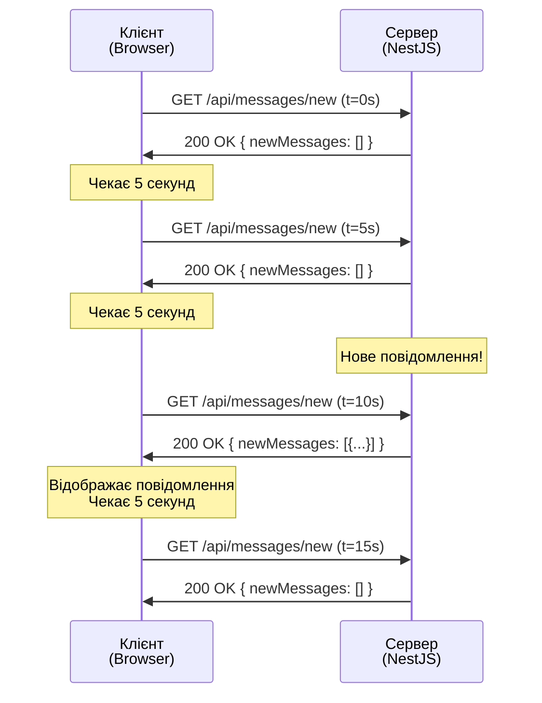
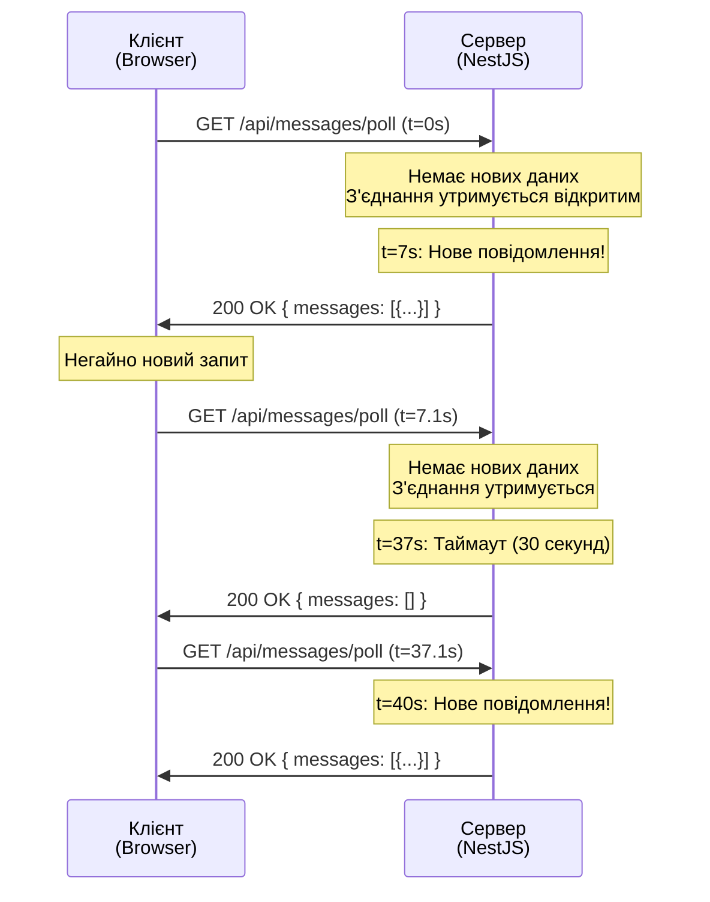
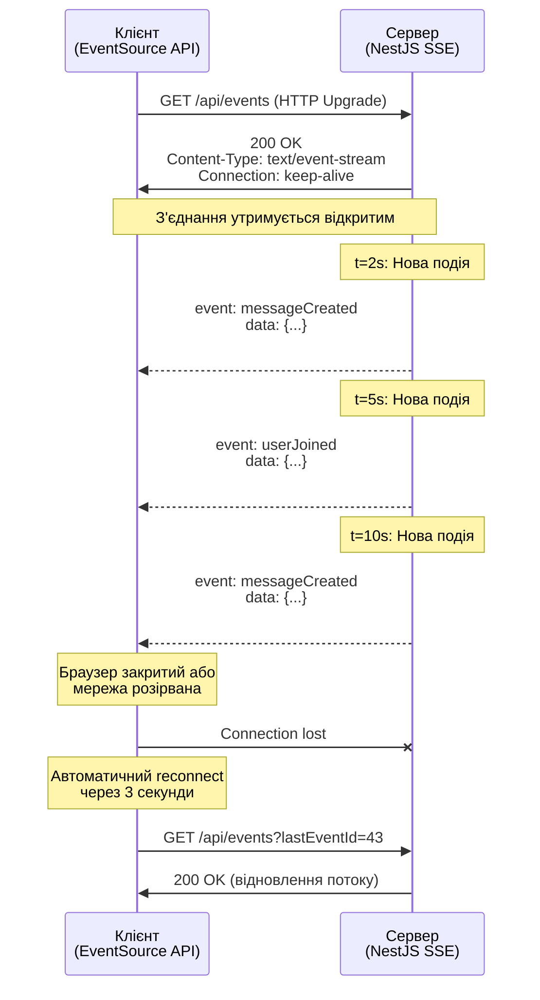
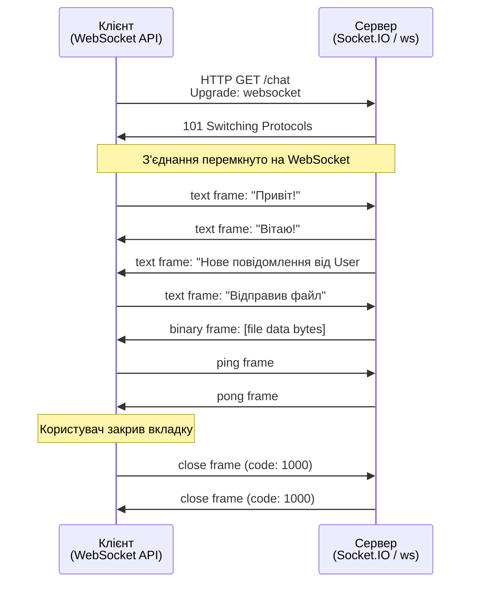

# Методи комунікації у реальному часі

## Короткий зміст

У цій лекції розглядається порівняння різних підходів до організації real-time комунікації між клієнтом та сервером:

- **Polling (Опитування)** — клієнт періодично відправляє HTTP запити до сервера для перевірки нових даних (наприклад, кожні 5 секунд), простота реалізації але високе навантаження та затримки
- **Long-Polling (Довге опитування)** — клієнт відправляє запит, сервер тримає з'єднання відкритим до появи нових даних або таймауту, після отримання відповіді клієнт одразу робить новий запит, менше навантаження ніж polling але складніша реалізація
- **Server-Sent Events (SSE)** — одностороння комунікація server → client через постійне HTTP з'єднання, сервер може push подій у будь-який момент, підтримка reconnect, ідеально для live updates, dashboards, news feeds
- **WebSocket** — повнодуплексний протокол з двостороннім зв'язком (client ↔ server), низька затримка, постійне з'єднання, ідеально для чатів, multiplayer ігор, collaborative editing

Вивчаються сценарії використання кожного методу, порівняння по критеріях: складність реалізації, підтримка браузерами, навантаження на сервер, latency, bi-directional communication. Розглядаються практичні приклади вибору методу залежно від вимог проєкту.

---

::card-group

::card{title="🎯 Мета лекції" icon="i-lucide-target"}

- Опанувати чотири фундаментальні підходи до організації комунікації у реальному часі між клієнтом та сервером.
- Зрозуміти архітектурні відмінності, переваги та обмеження кожного методу: Polling, Long-Polling, SSE та WebSocket.
- Навчитися обирати оптимальний метод комунікації залежно від вимог проєкту: тип даних, частота оновлень, кількість клієнтів.
- Розглянути сценарії масштабування кожного підходу та їхній вплив на навантаження серверної інфраструктури.

::

::card{title="🔑 Ключові терміни" icon="i-lucide-key"}

- **Real-Time Communication:** комунікація із мінімальною затримкою між відправленням події на сервері та її отриманням на клієнті.
- **Polling:** техніка періодичного опитування сервера клієнтом через фіксовані інтервали часу (request-response цикл).
- **Long-Polling:** модифікація polling, де сервер утримує з'єднання відкритим до появи нових даних або таймауту.
- **Server-Sent Events (SSE):** стандарт HTML5 для однонаправленого потокового передавання подій від сервера до клієнта через HTTP.
- **WebSocket:** повнодуплексний протокол комунікації поверх TCP, що дозволяє двосторонній обмін даними через єдине постійне з'єднання.
- **Latency (Затримка):** час між виникненням події на сервері та її доставкою клієнту.

::

::

---

## Контекст: Обмеження класичної HTTP архітектури

У попередніх лекціях ми детально вивчили класичну модель клієнт-серверної взаємодії через HTTP: клієнт відправляє запит (*request*), сервер обробляє його та повертає відповідь (*response*). Цей цикл «запит → відповідь» є фундаментом веб-архітектури, але він має критичне обмеження для сучасних застосунків: **ініціатором комунікації завжди виступає клієнт**.

Розглянемо конкретний приклад. Ви розробляєте веб-застосунок для моніторингу замовлень у ресторані. Коли кухар змінює статус замовлення на «Готово», адміністратор на іншому кінці офісу повинен побачити це оновлення негайно, без ручного оновлення сторінки. У класичній HTTP моделі сервер **не може самостійно відправити** оновлення клієнту — він лише пасивно чекає на запити.

Саме для вирішення цієї архітектурної проблеми виникли різні техніки організації комунікації у реальному часі (*real-time communication*). Кожен із чотирьох методів, що розглядатимуться у цій лекції, пропонує власне рішення фундаментального питання: **як забезпечити миттєву доставку подій від сервера до клієнта без постійного ручного втручання користувача?**

::note
Термін «real-time» у контексті веб-застосунків не означає абсолютну відсутність затримки (як у hard real-time системах). Це швидше концепція **near real-time** — затримка у межах від десятків мілісекунд до кількох секунд, що сприймається користувачем як миттєва реакція системи.
::

### Еволюція підходів до real-time комунікації

Історично веб-розробники еволюціонували від найпростіших рішень до складніших, залежно від технічних можливостей браузерів та протоколів:

1. **2000-ті роки:** Polling та Long-Polling як «хаки» поверх HTTP для імітації push-повідомлень.
2. **2011 рік:** стандартизація Server-Sent Events (SSE) у HTML5 для односпрямованого streaming.
3. **2011 рік:** стандартизація WebSocket протоколу (RFC 6455) для повноцінного двостороннього зв'язку.
4. **Сьогодення:** комбінація різних технік залежно від вимог: SSE для live dashboards, WebSocket для чатів, Long-Polling як fallback для старих браузерів.

Розглянемо кожен підхід детально, починаючи з найпростішого — **Polling**.

---

## Polling: Періодичне опитування сервера

**Polling (опитування)** — це найпростіша техніка імітації real-time комунікації, де клієнт періодично відправляє HTTP запити до сервера через фіксовані інтервали часу (наприклад, кожні 5 секунд), перевіряючи наявність нових даних. Якщо сервер має оновлення — він повертає їх у відповіді, інакше повертає порожню відповідь або HTTP статус `304 Not Modified`.

### Архітектура та принцип роботи

Механізм polling базується на циклічному виконанні HTTP запитів за допомогою JavaScript таймерів (`setInterval` або рекурсивного `setTimeout`). Клієнт самостійно керує частотою опитування, незалежно від того, чи є нові дані на сервері.

::mermaid



::

На діаграмі видно ключову проблему polling: якщо подія виникла на сервері у момент часу `t=7s`, клієнт дізнається про неї лише під час наступного запиту о `t=10s`, що створює **затримку до 5 секунд** (у найгіршому випадку — повний інтервал polling).

### Приклад реалізації: Клієнтська частина (TypeScript + Fetch API)

Розглянемо практичну реалізацію polling для системи відображення нових повідомлень чату. Клієнт кожні 5 секунд запитує сервер про нові повідомлення, які з'явилися після останнього відомого `messageId`.

```typescript
// client/polling-client.ts

interface Message {
  id: number;
  userId: number;
  text: string;
  timestamp: string;
}

interface NewMessagesResponse {
  messages: Message[];
  lastMessageId: number;
}

class PollingClient {
  private lastMessageId: number = 0;
  private pollingInterval: number = 5000; // 5 секунд
  private timerId: number | null = null;

  constructor(
    private apiUrl: string,
    private onNewMessages: (messages: Message[]) => void
  ) {}

  /**
   * Запускає цикл polling
   */
  start(): void {
    console.log(`[Polling] Запуск з інтервалом ${this.pollingInterval}ms`);
    
    // Відразу виконати перший запит
    this.fetchNewMessages();
    
    // Налаштувати періодичне опитування
    this.timerId = window.setInterval(() => {
      this.fetchNewMessages();
    }, this.pollingInterval);
  }

  /**
   * Зупиняє polling
   */
  stop(): void {
    if (this.timerId !== null) {
      clearInterval(this.timerId);
      this.timerId = null;
      console.log('[Polling] Зупинено');
    }
  }

  /**
   * Виконує HTTP запит для отримання нових повідомлень
   */
  private async fetchNewMessages(): Promise<void> {
    try {
      const response = await fetch(
        `${this.apiUrl}/messages/new?since=${this.lastMessageId}`,
        {
          method: 'GET',
          headers: {
            'Authorization': `Bearer ${this.getAuthToken()}`,
            'Content-Type': 'application/json',
          },
        }
      );

      if (!response.ok) {
        console.error(`[Polling] Помилка ${response.status}: ${response.statusText}`);
        return;
      }

      const data: NewMessagesResponse = await response.json();

      if (data.messages.length > 0) {
        console.log(`[Polling] Отримано ${data.messages.length} нових повідомлень`);
        this.lastMessageId = data.lastMessageId;
        this.onNewMessages(data.messages);
      } else {
        console.log('[Polling] Нових повідомлень немає');
      }
    } catch (error) {
      console.error('[Polling] Помилка мережі:', error);
    }
  }

  /**
   * Отримує JWT токен з localStorage (приклад)
   */
  private getAuthToken(): string {
    return localStorage.getItem('authToken') || '';
  }
}

// Використання
const client = new PollingClient(
  'https://api.example.com',
  (messages) => {
    messages.forEach(msg => {
      console.log(`Нове повідомлення від користувача ${msg.userId}: ${msg.text}`);
      // Додати повідомлення до UI
    });
  }
);

client.start();

// Зупинити polling при закритті сторінки
window.addEventListener('beforeunload', () => {
  client.stop();
});
```

**Ключові аспекти реалізації:**

1. **Параметр `since`:** клієнт передає `lastMessageId` у query string, щоб сервер повертав лише нові повідомлення. Це запобігає дублюванню даних та зменшує розмір відповіді.
2. **Автентифікація:** кожен запит містить JWT токен у заголовку `Authorization` (див. попередні лекції про автентифікацію).
3. **Обробка помилок:** при мережевій помилці або HTTP помилці клієнт логує проблему, але **не зупиняє** polling — наступна спроба буде через 5 секунд.
4. **Lifecycle management:** клієнт надає методи `start()` та `stop()` для керування polling циклом.

### Приклад реалізації: Серверна частина (NestJS + TypeORM)


Тепер розглянемо, як сервер обробляє ці polling запити та повертає нові повідомлення.

```typescript
// server/messages.controller.ts
import { Controller, Get, Query, UseGuards, Req } from '@nestjs/common';
import { JwtAuthGuard } from '../auth/jwt-auth.guard';
import { MessagesService } from './messages.service';

interface RequestWithUser extends Request {
  user: { userId: number };
}

@Controller('messages')
@UseGuards(JwtAuthGuard)
export class MessagesController {
  constructor(private readonly messagesService: MessagesService) {}

  /**
   * Ендпоінт для polling: повертає нові повідомлення після вказаного messageId
   */
  @Get('new')
  async getNewMessages(
    @Query('since') since: string,
    @Req() req: RequestWithUser,
  ) {
    const sinceId = parseInt(since, 10) || 0;
    const userId = req.user.userId;

    // Отримати нові повідомлення з БД
    const messages = await this.messagesService.getMessagesSince(
      userId,
      sinceId,
    );

    const lastMessageId =
      messages.length > 0 ? messages[messages.length - 1].id : sinceId;

    return {
      messages,
      lastMessageId,
      timestamp: new Date().toISOString(),
    };
  }
}
```

```typescript
// server/messages.service.ts
import { Injectable } from '@nestjs/common';
import { InjectRepository } from '@nestjs/typeorm';
import { Repository, MoreThan } from 'typeorm';
import { Message } from './message.entity';

@Injectable()
export class MessagesService {
  constructor(
    @InjectRepository(Message)
    private messagesRepository: Repository<Message>,
  ) {}

  /**
   * Отримує повідомлення, створені після вказаного messageId
   * Повертає до 50 останніх повідомлень
   */
  async getMessagesSince(userId: number, sinceId: number): Promise<Message[]> {
    return this.messagesRepository.find({
      where: {
        id: MoreThan(sinceId),
        // Можна додати фільтр по chatRoomId, якщо потрібно
      },
      order: {
        id: 'ASC', // Від старіших до новіших
      },
      take: 50, // Обмеження для запобігання надмірному навантаженню
    });
  }
}
```

**Важливі деталі серверної реалізації:**

1. **Фільтр `MoreThan(sinceId)`:** TypeORM генерує SQL запит `WHERE id > :sinceId`, що дозволяє отримати лише нові записи. Це критично для продуктивності — індекс на колонці `id` забезпечує швидкий пошук.
2. **Обмеження `take: 50`:** захист від ситуації, коли клієнт запитує дані після тривалого відключення (наприклад, `sinceId = 0`), і сервер мав би повернути тисячі записів.
3. **Автентифікація:** `@UseGuards(JwtAuthGuard)` гарантує, що лише автентифіковані користувачі можуть опитувати сервер (див. лекцію про JWT).

### Аналіз навантаження та проблеми масштабування

Polling створює **рівномірне, постійне навантаження** на сервер, незалежно від наявності нових даних. Розрахуємо практичний приклад:

::math-formula
\text{Requests per second} = \frac{\text{Total Users} \times 1}{\text{Polling Interval (seconds)}}
::

**Сценарій:** 10,000 одночасних користувачів, polling інтервал 5 секунд.

::math-formula
\text{RPS} = \frac{10{,}000 \times 1}{5} = 2{,}000 \text{ запитів/секунду}
::

Кожен запит вимагає:
- **Десеріалізація JWT токена** (CPU)
- **Виконання SQL запиту** до бази даних (I/O)
- **Серіалізація JSON відповіді** (CPU)

Якщо 90% цих запитів повертають порожню відповідь (немає нових повідомлень), виходить **величезна кількість марних операцій**. При збільшенні кількості користувачів до 100,000 навантаження зростає до **20,000 RPS** — це потребує кількох серверів та load balancer.

::warning
**Проблема часової затримки:** навіть за ідеальних умов (без мережевих затримок), користувач дізнається про нову подію з затримкою від 0 до 5 секунд (у середньому 2.5 секунди). Для чат-застосунків це неприйнятно.
::

### Коли використовувати Polling

Незважаючи на недоліки, polling залишається актуальним у певних сценаріях:

::card-group

::card{title="✅ Ідеальні сценарії" icon="i-lucide-check-circle"}

- **Низька частота оновлень:** дані оновлюються рідко (раз на хвилину або рідше), наприклад, котирування акцій поза торговими годинами.
- **Невелика кількість клієнтів:** до 100-500 одночасних користувачів, де навантаження керується одним сервером.
- **Не критична затримка:** затримка у 5-10 секунд прийнятна для бізнес-логіки (наприклад, оновлення статусу замовлення у back-office панелі).
- **Максимальна простота:** відсутність потреби у складній інфраструктурі WebSocket або SSE.

::

::card{title="❌ Неприйнятні сценарії" icon="i-lucide-x-circle"}

- **Чати та месенджери:** затримка у кілька секунд руйнує user experience.
- **Collaborative editing:** Google Docs стиль редагування потребує затримки < 200ms.
- **Real-time ігри:** будь-яка затримка створює advantage для гравців з меншим ping.
- **Фінансовий трейдинг:** критична точність до мілісекунд для алгоритмічного трейдингу.

::

::

::tip
**Практична рекомендація:** використовуйте polling для **адміністративних панелей** та **дашбордів**, де оновлення даних відбувається рідко, а користувачів мало. Для публічних чатів, нотифікацій або live feeds переходьте до Long-Polling, SSE або WebSocket.
::

---

## Long-Polling: Утримання з'єднання до появи події

**Long-Polling (довге опитування)** — це еволюційне покращення класичного polling, де сервер **не повертає відповідь одразу**, а утримує HTTP з'єднання відкритим до моменту, коли з'являться нові дані або спрацює таймаут (наприклад, 30 секунд). Після отримання відповіді клієнт **негайно** відправляє новий запит, створюючи «нескінченний цикл» запитів.

### Архітектурна відмінність від класичного Polling

У звичайному polling клієнт **чекає фіксований інтервал** між запитами, незалежно від того, чи були нові дані. У long-polling клієнт **чекає лише на відповідь сервера**, яка може прийти через 1 мілісекунду (якщо дані вже є) або через 30 секунд (якщо спрацював таймаут).

::mermaid



::

**Ключова перевага:** затримка між виникненням події на сервері (`t=7s`) та отриманням її клієнтом (`t=7s`) **майже нульова** — обмежена лише мережевою латентністю. Порівняйте з класичним polling, де затримка могла б сягати до 5 секунд.

### Реалізація: Клієнтська частина з рекурсивними запитами

```typescript
// client/long-polling-client.ts

interface Message {
  id: number;
  userId: number;
  text: string;
  timestamp: string;
}

interface PollResponse {
  messages: Message[];
  lastMessageId: number;
}

class LongPollingClient {
  private lastMessageId: number = 0;
  private isPolling: boolean = false;
  private abortController: AbortController | null = null;

  constructor(
    private apiUrl: string,
    private onNewMessages: (messages: Message[]) => void,
    private onError: (error: Error) => void
  ) {}

  /**
   * Запускає long-polling цикл
   */
  start(): void {
    if (this.isPolling) {
      console.warn('[Long-Polling] Вже запущено');
      return;
    }

    this.isPolling = true;
    console.log('[Long-Polling] Запуск');
    this.poll();
  }

  /**
   * Зупиняє long-polling
   */
  stop(): void {
    this.isPolling = false;

    // Скасувати поточний запит, якщо він виконується
    if (this.abortController) {
      this.abortController.abort();
      this.abortController = null;
    }

    console.log('[Long-Polling] Зупинено');
  }

  /**
   * Рекурсивна функція для виконання long-polling запиту
   */
  private async poll(): Promise<void> {
    if (!this.isPolling) {
      return; // Вихід з рекурсії при зупинці
    }

    this.abortController = new AbortController();

    try {
      const response = await fetch(
        `${this.apiUrl}/messages/poll?since=${this.lastMessageId}`,
        {
          method: 'GET',
          headers: {
            'Authorization': `Bearer ${this.getAuthToken()}`,
            'Content-Type': 'application/json',
          },
          signal: this.abortController.signal,
        }
      );

      if (!response.ok) {
        throw new Error(`HTTP ${response.status}: ${response.statusText}`);
      }

      const data: PollResponse = await response.json();

      if (data.messages.length > 0) {
        console.log(`[Long-Polling] Отримано ${data.messages.length} повідомлень`);
        this.lastMessageId = data.lastMessageId;
        this.onNewMessages(data.messages);
      } else {
        console.log('[Long-Polling] Таймаут, нових даних немає');
      }

      // Негайно запустити наступний long-poll
      this.poll();
    } catch (error) {
      if (error instanceof Error && error.name === 'AbortError') {
        console.log('[Long-Polling] Запит скасовано');
        return;
      }

      console.error('[Long-Polling] Помилка:', error);
      this.onError(error as Error);

      // При помилці чекаємо 5 секунд перед повторною спробою
      if (this.isPolling) {
        setTimeout(() => this.poll(), 5000);
      }
    }
  }

  private getAuthToken(): string {
    return localStorage.getItem('authToken') || '';
  }
}

// Використання
const client = new LongPollingClient(
  'https://api.example.com',
  (messages) => {
    messages.forEach(msg => {
      console.log(`Нове повідомлення: ${msg.text}`);
    });
  },
  (error) => {
    console.error('Критична помилка:', error);
  }
);

client.start();
```

**Важливі відмінності від звичайного polling:**

1. **Рекурсивні виклики:** метод `poll()` викликає сам себе після отримання відповіді, створюючи нескінченний цикл без `setInterval`.
2. **AbortController:** дозволяє коректно скасувати поточний запит при виклику `stop()`, запобігаючи витоку ресурсів.
3. **Експоненційний backoff при помилках:** якщо сервер недоступний, клієнт чекає 5 секунд перед повторною спробою (можна реалізувати прогресивне збільшення затримки: 5s → 10s → 20s).


### Реалізація: Серверна частина з асинхронним очікуванням

Серверна реалізація long-polling є **значно складнішою** за класичний polling, оскільки потребує механізму очікування нових подій без блокування потоків. У Node.js це досягається через event-driven архітектуру з використанням `EventEmitter` або інших pub/sub механізмів.

```typescript
// server/messages-polling.controller.ts
import { Controller, Get, Query, UseGuards, Req, Res } from '@nestjs/common';
import { Response } from 'express';
import { JwtAuthGuard } from '../auth/jwt-auth.guard';
import { MessagesPollingService } from './messages-polling.service';

interface RequestWithUser extends Request {
  user: { userId: number };
}

@Controller('messages')
@UseGuards(JwtAuthGuard)
export class MessagesPollingController {
  constructor(
    private readonly pollingService: MessagesPollingService,
  ) {}

  /**
   * Long-polling ендпоінт: утримує з'єднання до появи нових даних або таймауту
   */
  @Get('poll')
  async longPoll(
    @Query('since') since: string,
    @Req() req: RequestWithUser,
    @Res() res: Response,
  ) {
    const sinceId = parseInt(since, 10) || 0;
    const userId = req.user.userId;
    const timeout = 30000; // 30 секунд

    try {
      // Очікувати нові повідомлення або таймаут
      const result = await this.pollingService.waitForNewMessages(
        userId,
        sinceId,
        timeout,
      );

      res.json(result);
    } catch (error) {
      console.error('[Long-Polling] Помилка:', error);
      res.status(500).json({ error: 'Internal server error' });
    }
  }
}
```

```typescript
// server/messages-polling.service.ts
import { Injectable } from '@nestjs/common';
import { InjectRepository } from '@nestjs/typeorm';
import { Repository, MoreThan } from 'typeorm';
import { EventEmitter2, OnEvent } from '@nestjs/event-emitter';
import { Message } from './message.entity';

interface WaitingClient {
  userId: number;
  sinceId: number;
  resolve: (value: any) => void;
  timeoutId: NodeJS.Timeout;
}

@Injectable()
export class MessagesPollingService {
  private waitingClients: WaitingClient[] = [];

  constructor(
    @InjectRepository(Message)
    private messagesRepository: Repository<Message>,
    private eventEmitter: EventEmitter2,
  ) {}

  /**
   * Асинхронно очікує нові повідомлення або таймаут
   */
  async waitForNewMessages(
    userId: number,
    sinceId: number,
    timeout: number,
  ): Promise<{ messages: Message[]; lastMessageId: number }> {
    // Спочатку перевіряємо, чи є вже нові дані
    const existingMessages = await this.getMessagesSince(userId, sinceId);

    if (existingMessages.length > 0) {
      // Дані вже є — повертаємо одразу
      return {
        messages: existingMessages,
        lastMessageId: existingMessages[existingMessages.length - 1].id,
      };
    }

    // Даних немає — очікуємо нової події або таймауту
    return new Promise((resolve) => {
      const timeoutId = setTimeout(() => {
        // Таймаут спрацював — видаляємо клієнта зі списку очікування
        this.removeWaitingClient(resolve);
        resolve({ messages: [], lastMessageId: sinceId });
      }, timeout);

      // Додаємо клієнта до списку очікування
      this.waitingClients.push({
        userId,
        sinceId,
        resolve,
        timeoutId,
      });
    });
  }

  /**
   * Обробник події нового повідомлення — сповіщає всіх очікуючих клієнтів
   */
  @OnEvent('message.created')
  async handleNewMessage(message: Message): Promise<void> {
    console.log(`[Long-Polling] Нове повідомлення ${message.id}, сповіщення клієнтів`);

    // Знайти всіх клієнтів, які очікують на повідомлення після sinceId < message.id
    const clientsToNotify = this.waitingClients.filter(
      (client) => client.sinceId < message.id,
    );

    for (const client of clientsToNotify) {
      // Отримати всі нові повідомлення для клієнта
      const messages = await this.getMessagesSince(
        client.userId,
        client.sinceId,
      );

      if (messages.length > 0) {
        // Скасувати таймаут
        clearTimeout(client.timeoutId);

        // Відправити відповідь клієнту
        client.resolve({
          messages,
          lastMessageId: messages[messages.length - 1].id,
        });

        // Видалити клієнта зі списку очікування
        this.removeWaitingClient(client.resolve);
      }
    }
  }

  /**
   * Допоміжний метод для видалення клієнта зі списку очікування
   */
  private removeWaitingClient(resolve: (value: any) => void): void {
    const index = this.waitingClients.findIndex((c) => c.resolve === resolve);
    if (index !== -1) {
      this.waitingClients.splice(index, 1);
    }
  }

  /**
   * Отримує повідомлення з БД після вказаного ID
   */
  private async getMessagesSince(
    userId: number,
    sinceId: number,
  ): Promise<Message[]> {
    return this.messagesRepository.find({
      where: { id: MoreThan(sinceId) },
      order: { id: 'ASC' },
      take: 50,
    });
  }
}
```

**Архітектурні компоненти:**

1. **Масив `waitingClients`:** зберігає інформацію про всіх клієнтів, чиї HTTP запити утримуються відкритими у стані очікування. Кожен елемент містить:
   - `userId` та `sinceId`: контекст запиту
   - `resolve`: функція для завершення Promise та відправки відповіді
   - `timeoutId`: NodeJS таймер для скасування очікування через 30 секунд

2. **Event-driven оповіщення:** коли у системі створюється нове повідомлення (наприклад, через POST запит від іншого користувача), сервіс емітує подію `message.created`. Метод `handleNewMessage()` перехоплює цю подію та сповіщає всіх очікуючих клієнтів, чий `sinceId` менший за ID нового повідомлення.

3. **Механізм таймауту:** якщо протягом 30 секунд нова подія не виникла, спрацьовує `setTimeout`, який завершує Promise з порожнім масивом повідомлень. Клієнт одразу ж відправляє новий long-poll запит.

::note
Важливо розуміти, що у момент утримання з'єднання Node.js **не блокує потік**. Завдяки event loop, один потік може обслуговувати тисячі одночасних long-polling запитів без витрат на контекстні перемикання між потоками.
::

### Інтеграція з емітуванням події при створенні повідомлення

Коли користувач відправляє нове повідомлення через POST запит, сервер має емітувати подію `message.created`, щоб сповістити всіх клієнтів у long-polling режимі.

```typescript
// server/messages.service.ts (доповнення)
import { EventEmitter2 } from '@nestjs/event-emitter';

@Injectable()
export class MessagesService {
  constructor(
    @InjectRepository(Message)
    private messagesRepository: Repository<Message>,
    private eventEmitter: EventEmitter2, // Ін'єкція EventEmitter
  ) {}

  /**
   * Створює нове повідомлення та емітує подію для long-polling клієнтів
   */
  async createMessage(
    userId: number,
    text: string,
  ): Promise<Message> {
    const message = this.messagesRepository.create({
      userId,
      text,
      timestamp: new Date(),
    });

    await this.messagesRepository.save(message);

    // Емітувати подію для long-polling сервісу
    this.eventEmitter.emit('message.created', message);

    console.log(`[Messages] Створено повідомлення ${message.id}, подія емітована`);

    return message;
  }
}
```

**Послідовність подій:**

1. Користувач A відправляє POST `/messages` з текстом повідомлення.
2. Сервер зберігає повідомлення у БД та емітує подію `message.created`.
3. `MessagesPollingService.handleNewMessage()` перехоплює подію.
4. Всі користувачі (B, C, D), які очікують на long-poll, одразу отримують відповідь з новим повідомленням.
5. Кожен клієнт негайно відправляє новий long-poll запит.

### Аналіз навантаження та переваги над Polling

**Кількість запитів у long-polling:**

На відміну від класичного polling, де кількість запитів фіксована (наприклад, 2000 RPS для 10,000 користувачів при інтервалі 5 секунд), у long-polling кількість запитів **залежить від частоти подій**.

**Сценарій 1: Низька активність** (1 повідомлення на хвилину)
- Кожні 30 секунд спрацьовує таймаут для 10,000 клієнтів → **~333 RPS** (порівняйте з 2000 RPS у polling).
- Економія: **83% менше запитів**.

**Сценарій 2: Висока активність** (10 повідомлень на секунду)
- Кожна подія викликає новий long-poll для всіх клієнтів → **~100,000 запитів протягом 10 секунд = 10,000 RPS**.
- Навантаження **вище**, ніж у polling, але затримка доставки **майже нульова**.

::tip
Long-polling ефективний для **середньої активності** (1-10 подій на хвилину). Для дуже високої частоти подій (>10/сек) краще використовувати WebSocket, щоб уникнути overhead від постійного встановлення HTTP з'єднань.
::

### Проблеми масштабування Long-Polling

**1. Проблема розподіленого стану:**

Якщо у вас кілька інстансів NestJS за load balancer, користувач може відправити POST запит на сервер A, а його long-poll запит утримується на сервері B. Подія `message.created` емітується лише на сервері A, тому клієнт на сервері B **не отримає** оновлення.

**Рішення:** використовувати зовнішній pub/sub механізм (Redis Pub/Sub, RabbitMQ), щоб події транслювалися між усіма інстансами серверів.

```typescript
// Приклад з Redis Pub/Sub
import { Injectable } from '@nestjs/common';
import { RedisService } from '@liaoliaots/nestjs-redis';
import Redis from 'ioredis';

@Injectable()
export class MessagesPollingService {
  private subscriber: Redis;
  private publisher: Redis;

  constructor(private redisService: RedisService) {
    this.subscriber = this.redisService.getClient('subscriber');
    this.publisher = this.redisService.getClient('publisher');

    // Підписатися на канал нових повідомлень
    this.subscriber.subscribe('messages:new');
    this.subscriber.on('message', (channel, message) => {
      if (channel === 'messages:new') {
        const messageData = JSON.parse(message);
        this.handleNewMessage(messageData);
      }
    });
  }

  async publishNewMessage(message: Message): Promise<void> {
    // Опублікувати подію у Redis — всі інстанси отримають її
    await this.publisher.publish('messages:new', JSON.stringify(message));
  }
}
```

**2. Витік пам'яті через "мертві" клієнти:**

Якщо клієнт закриває браузер або втрачає з'єднання, але сервер не детектує це одразу, запис у масиві `waitingClients` залишається до спрацювання таймауту (30 секунд). При великій кількості відключень це може призвести до витоку пам'яті.

**Рішення:** використовувати механізм `req.on('close')` для детектування розриву з'єднання:

```typescript
@Get('poll')
async longPoll(@Req() req: RequestWithUser, @Res() res: Response) {
  const cleanupId = Math.random(); // Унікальний ідентифікатор для cleanup

  req.on('close', () => {
    console.log('[Long-Polling] Клієнт відключився, cleanup');
    this.pollingService.removeClientByCleanupId(cleanupId);
  });

  const result = await this.pollingService.waitForNewMessages(
    req.user.userId,
    sinceId,
    30000,
    cleanupId,
  );

  res.json(result);
}
```

### Коли використовувати Long-Polling

::card-group

::card{title="✅ Ідеальні сценарії" icon="i-lucide-check-circle"}

- **Помірна частота подій:** оновлення 1-10 разів на хвилину (новини, оновлення статусу замовлення).
- **Середня кількість користувачів:** 1,000 - 50,000 одночасних підключень.
- **Fallback для старих браузерів:** браузери без підтримки WebSocket (IE9, старі мобільні браузери).
- **Простіша інфраструктура:** не потребує окремого WebSocket сервера, працює через звичайний HTTP/HTTPS.

::

::card{title="❌ Неприйнятні сценарії" icon="i-lucide-x-circle"}

- **Дуже висока частота подій:** >10 подій на секунду — overhead від HTTP handshake стає критичним.
- **Мільйони одночасних користувачів:** витрати пам'яті на утримання відкритих з'єднань.
- **Двосторонній зв'язок у реальному часі:** клієнт також часто відправляє дані (чат, спільне редагування).

::

::


---

## Server-Sent Events (SSE): Односпрямований потік подій

**Server-Sent Events (SSE)** — це стандарт HTML5 для організації однонаправленої (*unidirectional*) потокової комунікації від сервера до клієнта через постійне HTTP з'єднання. На відміну від long-polling, де після кожної відповіді з'єднання закривається, SSE **підтримує одне з'єднання відкритим** протягом усього часу роботи застосунку, через яке сервер може відправляти необмежену кількість подій.

### Архітектура та принцип роботи SSE

SSE базується на специфічному HTTP response, де сервер встановлює заголовки `Content-Type: text/event-stream` та `Cache-Control: no-cache`, після чого передає події у текстовому форматі як нескінченний потік (*stream*).

**Формат SSE події:**

```
event: messageCreated
id: 42
data: {"userId": 10, "text": "Привіт, SSE!"}

event: userJoined
id: 43
data: {"userId": 15, "username": "Andriy"}

```

**Ключові характеристики:**

- **Кожна подія** починається з нового рядка та закінчується подвійним переносом рядка `\n\n`.
- **Поле `event`:** назва типу події (опціонально, за замовчуванням `message`).
- **Поле `id`:** унікальний ідентифікатор події, використовується для автоматичного reconnect.
- **Поле `data`:** корисне навантаження події (може бути JSON, plain text, тощо).

::mermaid



::

**Переваги над Long-Polling:**

1. **Одне постійне з'єднання** замість циклу reconnect після кожної події.
2. **Менший HTTP overhead:** не потрібно повторно встановлювати з'єднання, передавати заголовки автентифікації тощо.
3. **Автоматичний reconnect:** браузер автоматично відновлює з'єднання при розриві (наприклад, через втрату мережі).
4. **Підтримка `Last-Event-ID`:** при reconnect браузер автоматично передає заголовок `Last-Event-ID`, що дозволяє серверу відновити пропущені події.

### Реалізація: Клієнтська частина через EventSource API

Браузери надають нативний API `EventSource` для роботи з SSE, що значно спрощує клієнтський код порівняно з Long-Polling.

```typescript
// client/sse-client.ts

interface MessageData {
  id: number;
  userId: number;
  text: string;
  timestamp: string;
}

interface UserJoinedData {
  userId: number;
  username: string;
}

class SSEClient {
  private eventSource: EventSource | null = null;

  constructor(
    private apiUrl: string,
    private authToken: string,
    private onMessage: (data: MessageData) => void,
    private onUserJoined: (data: UserJoinedData) => void,
    private onError: (error: Event) => void
  ) {}

  /**
   * Підключається до SSE потоку
   */
  connect(): void {
    // EventSource не підтримує кастомні заголовки (наприклад, Authorization)
    // Передаємо токен через query parameter
    const url = `${this.apiUrl}/events/stream?token=${this.authToken}`;

    this.eventSource = new EventSource(url);

    // Загальний обробник для події типу 'message' (за замовчуванням)
    this.eventSource.addEventListener('message', (event: MessageEvent) => {
      console.log('[SSE] Отримано загальну подію:', event.data);
    });

    // Обробник для події типу 'messageCreated'
    this.eventSource.addEventListener('messageCreated', (event: MessageEvent) => {
      const data: MessageData = JSON.parse(event.data);
      console.log(`[SSE] Нове повідомлення ${data.id}: ${data.text}`);
      this.onMessage(data);
    });

    // Обробник для події типу 'userJoined'
    this.eventSource.addEventListener('userJoined', (event: MessageEvent) => {
      const data: UserJoinedData = JSON.parse(event.data);
      console.log(`[SSE] Користувач приєднався: ${data.username}`);
      this.onUserJoined(data);
    });

    // Обробник помилок та розривів з'єднання
    this.eventSource.addEventListener('error', (event: Event) => {
      console.error('[SSE] Помилка з\'єднання:', event);

      if (this.eventSource?.readyState === EventSource.CLOSED) {
        console.log('[SSE] З\'єднання закрито сервером');
      } else if (this.eventSource?.readyState === EventSource.CONNECTING) {
        console.log('[SSE] Спроба автоматичного reconnect...');
      }

      this.onError(event);
    });

    // Обробник успішного підключення
    this.eventSource.addEventListener('open', () => {
      console.log('[SSE] З\'єднання встановлено');
    });

    console.log('[SSE] Підключення до:', url);
  }

  /**
   * Закриває SSE з'єднання
   */
  disconnect(): void {
    if (this.eventSource) {
      this.eventSource.close();
      this.eventSource = null;
      console.log('[SSE] З\'єднання закрито клієнтом');
    }
  }

  /**
   * Перевіряє статус з'єднання
   */
  getReadyState(): number | null {
    return this.eventSource?.readyState ?? null;
  }
}

// Використання
const client = new SSEClient(
  'https://api.example.com',
  localStorage.getItem('authToken') || '',
  (message) => {
    // Додати повідомлення до UI
    const messageEl = document.createElement('div');
    messageEl.textContent = `[${message.userId}]: ${message.text}`;
    document.getElementById('messages')?.appendChild(messageEl);
  },
  (user) => {
    // Показати нотифікацію про приєднання користувача
    console.log(`${user.username} приєднався до чату`);
  },
  (error) => {
    // Показати користувачу повідомлення про втрату з'єднання
    console.error('Втрачено з\'єднання з сервером');
  }
);

client.connect();

// Закрити при виході зі сторінки
window.addEventListener('beforeunload', () => {
  client.disconnect();
});
```

**Важливі деталі API EventSource:**

1. **Обмеження автентифікації:** `EventSource` **не підтримує** передачу кастомних HTTP заголовків (наприклад, `Authorization: Bearer <token>`). Тому JWT токен передається через query parameter `?token=...`. Це створює потенційну проблему безпеки, оскільки токен може потрапити у server logs. Альтернатива: використовувати cookie-based автентифікацію для SSE.

2. **Автоматичний reconnect:** якщо з'єднання розривається (мережева помилка, сервер перезапущений), браузер **автоматично** намагається відновити з'єднання через 3 секунди. Розробник не пише код для reconnect вручну.

3. **Заголовок `Last-Event-ID`:** при reconnect браузер автоматично передає заголовок `Last-Event-ID: 42` (якщо остання отримана подія мала `id: 42`), що дозволяє серверу відновити пропущені події.

::warning
**Обмеження браузерів:** деякі браузери (особливо мобільні) мають ліміт на кількість одночасних SSE з'єднань до одного домену (зазвичай 6). Якщо користувач відкриває кілька вкладок з вашим застосунком, деякі з них можуть не отримувати події. Рішення: використовувати Shared Workers або переключитися на WebSocket.
::

### Реалізація: Серверна частина у NestJS

NestJS надає вбудовану підтримку SSE через декоратор `@Sse()` та RxJS Observables.

```typescript
// server/events.controller.ts
import { Controller, Sse, Query, UnauthorizedException } from '@nestjs/common';
import { Observable, interval, map, filter } from 'rxjs';
import { EventsService } from './events.service';
import { JwtService } from '@nestjs/jwt';

interface SseEvent {
  event?: string;
  data: any;
  id?: string;
  retry?: number;
}

@Controller('events')
export class EventsController {
  constructor(
    private readonly eventsService: EventsService,
    private readonly jwtService: JwtService,
  ) {}

  /**
   * SSE ендпоінт: повертає Observable потік подій
   */
  @Sse('stream')
  streamEvents(@Query('token') token: string): Observable<SseEvent> {
    // Валідація JWT токена (передається через query parameter)
    let userId: number;

    try {
      const payload = this.jwtService.verify(token);
      userId = payload.sub;
    } catch (error) {
      throw new UnauthorizedException('Invalid token');
    }

    console.log(`[SSE] Клієнт ${userId} підключився до потоку`);

    // Повертаємо Observable, який емітує події
    return this.eventsService.subscribeToEvents(userId);
  }
}
```

```typescript
// server/events.service.ts
import { Injectable } from '@nestjs/common';
import { Observable, Subject, merge, interval, map } from 'rxjs';

interface SseEvent {
  event?: string;
  data: any;
  id?: string;
}

@Injectable()
export class EventsService {
  // Subject для емітування подій до всіх підписаних клієнтів
  private eventsSubject = new Subject<SseEvent>();
  private eventIdCounter = 0;

  /**
   * Підписує клієнта на потік подій
   */
  subscribeToEvents(userId: number): Observable<SseEvent> {
    console.log(`[SSE] Користувач ${userId} підписаний на події`);

    // Heartbeat: кожні 15 секунд відправляємо коментар для утримання з'єднання
    const heartbeat$ = interval(15000).pipe(
      map(() => ({
        event: 'heartbeat',
        data: { timestamp: new Date().toISOString() },
      })),
    );

    // Об'єднуємо потік реальних подій з heartbeat
    return merge(this.eventsSubject.asObservable(), heartbeat$);
  }

  /**
   * Емітує подію про створення нового повідомлення
   */
  emitMessageCreated(message: any): void {
    this.eventIdCounter++;

    this.eventsSubject.next({
      event: 'messageCreated',
      data: message,
      id: this.eventIdCounter.toString(),
    });

    console.log(`[SSE] Емітовано подію messageCreated (id: ${this.eventIdCounter})`);
  }

  /**
   * Емітує подію про приєднання користувача
   */
  emitUserJoined(user: { userId: number; username: string }): void {
    this.eventIdCounter++;

    this.eventsSubject.next({
      event: 'userJoined',
      data: user,
      id: this.eventIdCounter.toString(),
    });

    console.log(`[SSE] Емітовано подію userJoined (id: ${this.eventIdCounter})`);
  }
}
```

**Інтеграція з бізнес-логікою:**

Коли у системі відбувається подія (наприклад, користувач відправляє повідомлення), відповідний сервіс викликає `eventsService.emitMessageCreated()`, що автоматично розсилає подію всім підключеним SSE клієнтам.

```typescript
// server/messages.service.ts (доповнення)
@Injectable()
export class MessagesService {
  constructor(
    @InjectRepository(Message)
    private messagesRepository: Repository<Message>,
    private eventsService: EventsService, // Ін'єкція SSE сервісу
  ) {}

  async createMessage(userId: number, text: string): Promise<Message> {
    const message = this.messagesRepository.create({
      userId,
      text,
      timestamp: new Date(),
    });

    await this.messagesRepository.save(message);

    // Розіслати SSE подію всім підключеним клієнтам
    this.eventsService.emitMessageCreated({
      id: message.id,
      userId: message.userId,
      text: message.text,
      timestamp: message.timestamp.toISOString(),
    });

    return message;
  }
}
```

### Heartbeat: Утримання з'єднання активним

Деякі проксі-сервери, firewall або мобільні мережі можуть автоматично закривати неактивні HTTP з'єднання через 30-60 секунд. Для запобігання цьому сервер періодично відправляє **heartbeat** — порожню подію або коментар, що сигналізує про активність з'єднання.

**Формат коментаря у SSE:**

```
: heartbeat

: heartbeat

```

Рядки, що починаються з `:`, є коментарями та ігноруються браузером, але утримують з'єднання активним.

У наведеній вище реалізації ми використовували RxJS `interval(15000)` для відправки heartbeat події кожні 15 секунд. Клієнт може ігнорувати ці події або використовувати їх для відображення індикатора з'єднання у UI.

### Відновлення пропущених подій через Last-Event-ID

Коли клієнт reconnect після розриву з'єднання, браузер автоматично передає заголовок:

```
Last-Event-ID: 42
```

Сервер може використовувати це значення для відправки всіх пропущених подій після `id=42`.

```typescript
@Sse('stream')
streamEvents(
  @Query('token') token: string,
  @Headers('last-event-id') lastEventId?: string,
): Observable<SseEvent> {
  const userId = this.validateToken(token);
  const sinceEventId = parseInt(lastEventId || '0', 10);

  console.log(`[SSE] Reconnect від ${userId}, lastEventId: ${sinceEventId}`);

  // Відправити пропущені події з кешу або БД
  return this.eventsService.subscribeToEvents(userId, sinceEventId);
}
```

**Зберігання історії подій:**

Для реалізації відновлення потрібно зберігати останні N подій у пам'яті (in-memory cache) або у Redis. При reconnect сервер відправляє всі події після `lastEventId` та продовжує потік нових подій.

```typescript
@Injectable()
export class EventsService {
  private eventHistory: SseEvent[] = []; // Останні 100 подій
  private readonly MAX_HISTORY = 100;

  emitEvent(event: SseEvent): void {
    this.eventsSubject.next(event);

    // Зберегти у історії
    this.eventHistory.push(event);
    if (this.eventHistory.length > this.MAX_HISTORY) {
      this.eventHistory.shift(); // Видалити найстарішу
    }
  }

  subscribeToEvents(userId: number, sinceEventId: number): Observable<SseEvent> {
    // Відправити пропущені події
    const missedEvents = this.eventHistory.filter(
      (e) => parseInt(e.id || '0', 10) > sinceEventId,
    );

    return concat(
      from(missedEvents), // Спочатку пропущені події
      this.eventsSubject.asObservable(), // Потім live події
    );
  }
}
```

::tip
Для продакшн систем з кількома серверами використовуйте **Redis Streams** або **Redis Sorted Sets** для зберігання історії подій, щоб reconnect працював навіть при переключенні клієнта між різними інстансами сервера.
::


### Коли використовувати SSE

::card-group

::card{title="✅ Ідеальні сценарії" icon="i-lucide-check-circle"}

- **Однонаправлена комунікація:** сервер push оновлень, клієнт лише отримує (dashboards, live feeds, stock tickers).
- **Часті оновлення:** 1-100 подій на секунду, де overhead HTTP handshake у Long-Polling стає критичним.
- **Автоматичний reconnect:** браузер сам відновлює з'єднання без клієнтського коду.
- **Простота реалізації:** не потрібен окремий WebSocket сервер, працює через звичайний HTTP/HTTPS.
- **Сумісність з HTTP/2:** SSE отримує переваги multiplexing у HTTP/2, дозволяючи кілька потоків через одне TCP з'єднання.

::

::card{title="❌ Неприйнятні сценарії" icon="i-lucide-x-circle"}

- **Двосторонній зв'язок:** клієнт також часто відправляє дані серверу (чат, multiplayer ігри).
- **Бінарні дані:** SSE передає лише текст, для відео/аудіо стрімінгу потрібен WebSocket або WebRTC.
- **Старі браузери:** IE11 та старіші не підтримують EventSource (потрібен polyfill або fallback на Long-Polling).
- **Обхід CORS:** SSE підпорядкований CORS політикам, WebSocket має більш гнучке управління cross-origin з'єднаннями.

::

::

---

## WebSocket: Повнодуплексна комунікація

**WebSocket** — це протокол комунікації, стандартизований у RFC 6455, що забезпечує **повнодуплексний (full-duplex)** двосторонній обмін даними між клієнтом та сервером через єдине постійне TCP з'єднання. На відміну від SSE, де комунікація односпрямована (server → client), WebSocket дозволяє **обом сторонам** відправляти повідомлення у будь-який момент без ініціювання нового запиту.

### Відмінність від HTTP: Upgrade до WebSocket протоколу

WebSocket починається як звичайний HTTP запит з спеціальними заголовками, що сигналізують про бажання клієнта «оновити» (*upgrade*) протокол з HTTP до WebSocket. Якщо сервер підтримує WebSocket, він відповідає HTTP статусом `101 Switching Protocols`, після чого з'єднання переключається на WebSocket протокол, і обидві сторони можуть обмінюватися повідомленнями через binary frames.

**HTTP Upgrade Handshake:**

::code-group

```http [Client Request]
GET /chat HTTP/1.1
Host: api.example.com
Upgrade: websocket
Connection: Upgrade
Sec-WebSocket-Key: dGhlIHNhbXBsZSBub25jZQ==
Sec-WebSocket-Version: 13
Origin: https://example.com
```

```http [Server Response]
HTTP/1.1 101 Switching Protocols
Upgrade: websocket
Connection: Upgrade
Sec-WebSocket-Accept: s3pPLMBiTxaQ9kYGzzhZRbK+xOo=
```

::

**Після успішного handshake:**
- З'єднання залишається відкритим необмежений час (поки одна зі сторін не закриє його).
- Обидві сторони можуть відправляти повідомлення без запиту протилежної сторони.
- Дані передаються у вигляді **бінарних фреймів** (binary frames), що значно ефективніше за текстовий HTTP.

::mermaid



::

### Переваги WebSocket над іншими методами

| Критерій | Polling | Long-Polling | SSE | WebSocket |
|----------|---------|--------------|-----|-----------|
| **Двосторонній зв'язок** | ❌ (лише client → server) | ❌ | ❌ | ✅ |
| **Latency** | Висока (2-5 сек) | Середня (100-500 мс) | Низька (~50 мс) | Мінімальна (~10-50 мс) |
| **HTTP overhead** | Високий | Середній | Низький | Мінімальний |
| **Бінарні дані** | ❌ | ❌ | ❌ | ✅ |
| **Автоматичний reconnect** | ❌ (вручну) | ❌ (вручну) | ✅ (браузер) | ❌ (потрібна бібліотека) |
| **Складність реалізації** | Дуже проста | Середня | Проста | Складна |
| **Підтримка браузерами** | Всі | Всі | IE11+ | IE10+ |
| **Масштабування** | Легко | Середньо | Середньо | Складно (stateful) |

**Критичні переваги для real-time застосунків:**

1. **Мінімальна латентність:** відсутність HTTP handshake для кожного повідомлення зменшує затримку до ~10-50 мс (лише мережевий RTT).
2. **Підтримка бінарних даних:** можна передавати зображення, відео, аудіо без base64 encoding (економія 33% розміру).
3. **Двосторонній зв'язок:** ідеально для чатів, де клієнт постійно відправляє повідомлення, а сервер одночасно push оновлень від інших користувачів.

::note
У наступній лекції ми детально розглянемо практичну реалізацію WebSocket Gateway у NestJS з використанням бібліотеки Socket.IO, включаючи автентифікацію, rooms (кімнати), broadcasting та обробку reconnect. Тут ми лише окреслимо загальну концепцію для порівняння з іншими методами.
::

### Концептуальний приклад клієнта (Нативний WebSocket API)

```typescript
// client/websocket-client.ts (базовий приклад без Socket.IO)

class WebSocketClient {
  private ws: WebSocket | null = null;
  private reconnectAttempts = 0;
  private maxReconnectAttempts = 5;

  constructor(
    private url: string,
    private onMessage: (data: any) => void,
    private onError: (error: Event) => void
  ) {}

  connect(): void {
    // Передаємо JWT токен через query parameter
    const token = localStorage.getItem('authToken');
    this.ws = new WebSocket(`${this.url}?token=${token}`);

    this.ws.addEventListener('open', () => {
      console.log('[WebSocket] З\'єднання встановлено');
      this.reconnectAttempts = 0;
    });

    this.ws.addEventListener('message', (event: MessageEvent) => {
      const data = JSON.parse(event.data);
      console.log('[WebSocket] Отримано:', data);
      this.onMessage(data);
    });

    this.ws.addEventListener('close', (event: CloseEvent) => {
      console.log(`[WebSocket] З\'єднання закрито: ${event.code} ${event.reason}`);
      this.attemptReconnect();
    });

    this.ws.addEventListener('error', (error: Event) => {
      console.error('[WebSocket] Помилка:', error);
      this.onError(error);
    });
  }

  send(data: any): void {
    if (this.ws?.readyState === WebSocket.OPEN) {
      this.ws.send(JSON.stringify(data));
    } else {
      console.error('[WebSocket] З\'єднання не відкрито');
    }
  }

  disconnect(): void {
    this.ws?.close(1000, 'Client disconnect');
  }

  private attemptReconnect(): void {
    if (this.reconnectAttempts < this.maxReconnectAttempts) {
      this.reconnectAttempts++;
      const delay = Math.min(1000 * Math.pow(2, this.reconnectAttempts), 30000);
      console.log(`[WebSocket] Reconnect через ${delay}ms (спроба ${this.reconnectAttempts})`);
      setTimeout(() => this.connect(), delay);
    } else {
      console.error('[WebSocket] Перевищено ліміт спроб reconnect');
    }
  }
}
```

**Важливо:** у реальних проєктах рекомендується використовувати бібліотеки Socket.IO (клієнт + сервер), які надають автоматичний reconnect, fallback на Long-Polling, rooms, namespaces та інші корисні функції. Детальну реалізацію ми розглянемо у наступній лекції.

### Коли використовувати WebSocket

::card-group

::card{title="✅ Ідеальні сценарії" icon="i-lucide-check-circle"}

- **Чати та месенджери:** миттєва доставка повідомлень у обидва напрямки (client ↔ server).
- **Collaborative editing:** Google Docs стиль редагування, де зміни одного користувача миттєво відображаються у інших.
- **Multiplayer ігри:** критична латентність < 50 мс для позицій гравців, подій гри.
- **Live trading platforms:** біржові терміналі з оновленням котирувань у реальному часі.
- **IoT dashboards:** пристрої відправляють дані, сервер push команд до пристроїв.
- **Відеочати та screen sharing:** передача метаданих, сигналізація для WebRTC.

::

::card{title="❌ Надмірне використання" icon="i-lucide-alert-circle"}

- **Рідкі оновлення:** якщо події виникають раз на хвилину — SSE або Long-Polling простіші.
- **Лише server → client:** якщо клієнт ніколи не відправляє дані — SSE ефективніший.
- **Статичний контент:** не використовуйте WebSocket для завантаження зображень, CSS, JS — це задача для HTTP/2 або CDN.

::

::

---

## Порівняльна таблиця методів real-time комунікації

Підсумуємо ключові характеристики всіх чотирьох методів для швидкого вибору оптимального рішення.

| Критерій | Polling | Long-Polling | SSE | WebSocket |
|----------|---------|--------------|-----|-----------|
| **Напрямок комунікації** | Client → Server (імітація server push) | Client → Server (імітація server push) | Server → Client | Client ↔ Server |
| **Затримка доставки події** | 2-5 секунд (середня) | 100-500 мс | 50-200 мс | 10-50 мс |
| **HTTP overhead на подію** | Дуже високий | Високий | Низький | Мінімальний |
| **Кількість HTTP запитів** | Фіксована (високa) | Залежить від частоти подій | 1 з'єднання | 1 з'єднання (після upgrade) |
| **Підтримка бінарних даних** | ❌ | ❌ | ❌ | ✅ |
| **Автоматичний reconnect** | ❌ | ❌ | ✅ (нативний у браузері) | ❌ (потрібна бібліотека) |
| **Відновлення пропущених подій** | ❌ | ❌ | ✅ (Last-Event-ID) | ❌ (власна логіка) |
| **Складність клієнта** | Проста | Середня | Дуже проста (EventSource API) | Складна (потрібна бібліотека) |
| **Складність сервера** | Проста | Висока (event loop, cleanup) | Середня (Observables) | Висока (stateful, rooms) |
| **Масштабування** | Легко (stateless) | Середньо (stateful з'єднання) | Середньо (stateful з'єднання) | Складно (sticky sessions, Redis Adapter) |
| **Навантаження на сервер** | Високе (постійні запити) | Середнє (утримання з'єднань) | Середнє (утримання з'єднань) | Низьке (ефективний протокол) |
| **Підтримка браузерами** | Всі (включно з IE6) | Всі | IE11+, всі сучасні | IE10+, всі сучасні |
| **Підтримка через CORS** | ✅ | ✅ | ✅ (з обмеженнями заголовків) | ✅ |
| **Fallback при блокуванні firewall** | ✅ (працює завжди) | ✅ | ✅ | ❌ (може блокуватися корпоративними firewall) |

### Матриця вибору методу залежно від вимог

::tabs

::tabs-item{label="За частотою оновлень"}

**Рідкі оновлення (< 1 раз на хвилину):**
- ✅ **Polling** — найпростіше рішення, мінімальна складність.
- ✅ **Long-Polling** — якщо важлива затримка < 5 секунд.

**Помірні оновлення (1-10 разів на хвилину):**
- ✅ **Long-Polling** — баланс між простотою та ефективністю.
- ✅ **SSE** — якщо лише server → client комунікація.

**Часті оновлення (10-100 разів на секунду):**
- ✅ **SSE** — для однонаправленого потоку (dashboards, feeds).
- ✅ **WebSocket** — для двостороннього зв'язку (чати, ігри).

**Дуже часті оновлення (> 100 разів на секунду):**
- ✅ **WebSocket** — єдиний метод з достатньо низькою латентністю.

::

::tabs-item{label="За напрямком комунікації"}

**Лише Server → Client:**
- ✅ **SSE** — стандартизоване рішення з автоматичним reconnect.
- ✅ **Long-Polling** — fallback для старих браузерів.

**Лише Client → Server:**
- ✅ **Звичайний HTTP** (POST/PUT запити) — не потрібен real-time.

**Двосторонній Client ↔ Server:**
- ✅ **WebSocket** — єдиний метод з нативною підтримкою full-duplex.
- 🔄 **SSE + HTTP** — SSE для server → client, звичайні POST запити для client → server (гібридний підхід).

::

::tabs-item{label="За складністю реалізації"}

**Максимальна простота (MVP, proof of concept):**
- ✅ **Polling** — 10 рядків коду на клієнті та сервері.

**Баланс простоти та функціональності:**
- ✅ **SSE** — нативний EventSource API, мінімальний boilerplate.

**Готовність до складної інфраструктури:**
- ✅ **WebSocket + Socket.IO** — потребує розуміння rooms, namespaces, adapters, але надає максимум можливостей.

::

::tabs-item{label="За кількістю користувачів"}

**< 1,000 одночасних користувачів:**
- ✅ Будь-який метод підійде, обирайте за простотою реалізації.

**1,000 - 50,000 користувачів:**
- ✅ **Long-Polling** або **SSE** — з правильним кешуванням та горизонтальним масштабуванням.
- ✅ **WebSocket** — якщо потрібен двосторонній зв'язок.

**> 50,000 користувачів:**
- ✅ **WebSocket з Redis Adapter** — для синхронізації між кількома інстансами серверів.
- ✅ **SSE з Redis Pub/Sub** — для розподіленого емітування подій.
- ❌ **Polling/Long-Polling** — надмірне навантаження на БД та сервери.

::

::

---

## Практичні рекомендації та best practices

### Гібридний підхід: SSE + HTTP для двостороннього зв'язку

Якщо вам потрібен двосторонній зв'язок, але WebSocket занадто складний для вашого проєкту, можна використовувати **гібридний підхід**:

- **SSE** для server → client подій (нові повідомлення, нотифікації).
- **Звичайні HTTP POST запити** для client → server дій (відправка повідомлення, оновлення профілю).

**Переваги:**
- Простіша реалізація за WebSocket.
- Автоматичний reconnect для SSE.
- Не потрібен окремий WebSocket сервер.

**Недоліки:**
- Вища латентність для client → server дій (HTTP overhead).
- Два окремих з'єднання замість одного.

### Fallback стратегія для старих браузерів

Для максимальної сумісності реалізуйте **progressive enhancement**:

1. **Спроба WebSocket:** якщо браузер підтримує — використовувати WebSocket.
2. **Fallback на SSE:** якщо WebSocket недоступний (блокується firewall) — використовувати SSE.
3. **Fallback на Long-Polling:** якщо SSE не підтримується (IE11 без polyfill).
4. **Fallback на Polling:** останній варіант для дуже старих браузерів.

Бібліотека **Socket.IO** автоматично реалізує цю стратегію:

```typescript
// Socket.IO автоматично обирає найкращий транспорт
const socket = io('https://api.example.com', {
  transports: ['websocket', 'polling'], // Пріоритет: WebSocket → Long-Polling
});
```

### Оптимізація навантаження: Rate Limiting для polling

Якщо ви використовуєте Polling або Long-Polling, **обов'язково** застосовуйте rate limiting для запобігання зловживанням:

```typescript
// server/polling.controller.ts
import { Throttle } from '@nestjs/throttler';

@Controller('messages')
export class MessagesController {
  @Get('new')
  @Throttle({ default: { limit: 20, ttl: 60000 } }) // Максимум 20 запитів за хвилину
  async getNewMessages(@Query('since') since: string) {
    // ...
  }
}
```

::warning
**Захист від DDoS:** без rate limiting зловмисник може створити тисячі запитів на секунду, перевантаживши сервер. Для production застосунків використовуйте Nginx rate limiting або CDN з DDoS protection (Cloudflare, AWS Shield).
::

### Моніторинг та метрики

Для production систем критично важливо моніторити:

- **Кількість активних з'єднань:** WebSocket/SSE клієнтів у реальному часі.
- **Latency:** час від емітування події на сервері до отримання клієнтом.
- **Reconnect rate:** як часто клієнти втрачають з'єднання та reconnect.
- **Message throughput:** кількість повідомлень на секунду.

```typescript
// Приклад метрики для Prometheus
import { Counter, Gauge } from 'prom-client';

const activeConnections = new Gauge({
  name: 'websocket_active_connections',
  help: 'Кількість активних WebSocket з\'єднань',
});

const messagesTotal = new Counter({
  name: 'websocket_messages_total',
  help: 'Загальна кількість відправлених повідомлень',
  labelNames: ['type'],
});

// При підключенні клієнта
activeConnections.inc();

// При відправці повідомлення
messagesTotal.inc({ type: 'messageCreated' });
```

---

## Підсумок

У цій лекції ми розглянули чотири фундаментальні підходи до організації real-time комунікації між клієнтом та сервером:

1. **Polling:** найпростіша техніка з високим overhead та затримкою, підходить лише для рідких оновлень та малої кількості користувачів.

2. **Long-Polling:** еволюційне покращення polling з утриманням з'єднання до появи події, балансує між простотою та ефективністю, ідеально для помірної частоти оновлень.

3. **Server-Sent Events (SSE):** стандартизоване рішення HTML5 для однонаправленого потоку подій з автоматичним reconnect та відновленням пропущених подій, ідеально для dashboards, live feeds, нотифікацій.

4. **WebSocket:** повнодуплексний протокол з мінімальною латентністю та підтримкою бінарних даних, єдиний вибір для чатів, multiplayer ігор, collaborative editing.

Вибір методу залежить від:
- **Напрямку комунікації:** односпрямована (SSE) vs двостороння (WebSocket).
- **Частоти оновлень:** рідкі (Polling) vs часті (SSE/WebSocket).
- **Складності реалізації:** MVP (Polling) vs production-ready (WebSocket).
- **Кількості користувачів:** малі проєкти (будь-який метод) vs enterprise (WebSocket з Redis Adapter).

У наступній лекції ми детально вивчимо практичну реалізацію **WebSocket Gateway у NestJS** з використанням бібліотеки Socket.IO, включаючи автентифікацію, rooms, broadcasting, обробку помилок та масштабування через Redis Adapter.

