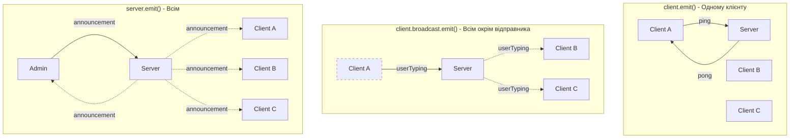
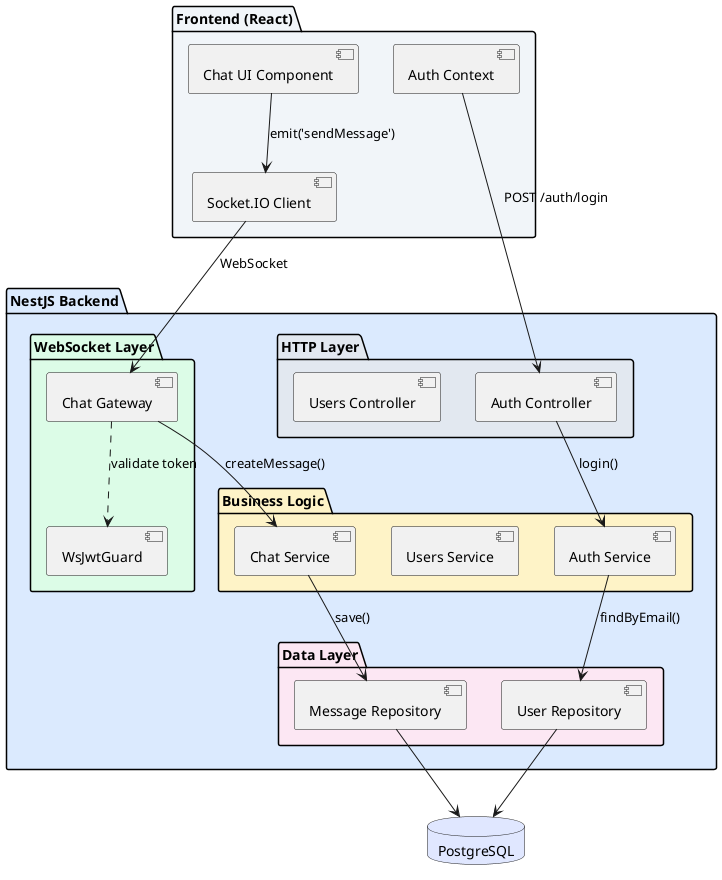

# WebSocket Gateway у NestJS

## Короткий зміст

У цій лекції вивчається практична реалізація WebSocket сервера у NestJS з використанням Socket.IO:

- **Декоратор @WebSocketGateway()** — створення WebSocket gateway класу, конфігурація порту та namespace, опції для Socket.IO (cors, transports, path)
- **Інтеграція Socket.IO** — популярна бібліотека для WebSocket з fallback на long-polling, інсталяція `@nestjs/websockets` та `@nestjs/platform-socket.io`, адаптер для Socket.IO
- **Декоратор @SubscribeMessage()** — обробка подій від клієнта, прив'язка методу до події (наприклад, 'message', 'chat'), отримання payload події
- **Емітування подій** — відправка даних клієнту через `socket.emit()` для одного клієнта, `server.emit()` для всіх підключених, acknowledgments для підтвердження доставки
- **Broadcasting** — розсилка повідомлень: `socket.broadcast.emit()` для всіх окрім відправника, `server.to(room).emit()` для конкретної кімнати
- **Налаштування CORS** — дозвіл WebSocket з'єднань з frontend домену, конфігурація через `cors: { origin: 'http://localhost:3000' }` у gateway options
- **Dependency Injection** — ін'єкція сервісів у Gateway через constructor, використання репозиторіїв для збереження повідомлень

Розглядаються практичні приклади: створення простого чату, відправка повідомлень між користувачами, інтеграція з JWT автентифікацією для WebSocket.

---

::card-group

::card{title="🎯 Мета лекції" icon="i-lucide-target"}

- Опанувати створення WebSocket Gateway у NestJS з використанням бібліотеки Socket.IO для повнодуплексної комунікації.
- Навчитися обробляти події від клієнтів через декоратор `@SubscribeMessage()` та емітувати події назад через `socket.emit()`.
- Впровадити broadcasting для розсилки повідомлень всім підключеним клієнтам або конкретним групам користувачів.
- Налаштувати CORS політику для WebSocket з'єднань з frontend застосунку на іншому домені.
- Інтегрувати JWT автентифікацію для захисту WebSocket з'єднань та ідентифікації користувачів.
- Реалізувати практичний приклад чат-застосунку з збереженням повідомлень у базі даних.

::

::card{title="🔑 Ключові терміни" icon="i-lucide-key"}

- **WebSocket Gateway:** спеціальний клас у NestJS, що обробляє WebSocket з'єднання та події, аналог Controller для HTTP.
- **Socket.IO:** JavaScript бібліотека для real-time комунікації з автоматичним fallback на long-polling, підтримкою rooms та namespaces.
- **Event Emitter:** патерн для асинхронної комунікації через події, де одна частина коду емітує подію, а інша підписується на неї.
- **Broadcasting:** розсилка повідомлення кільком або всім підключеним клієнтам одночасно.
- **Acknowledgment (ACK):** механізм підтвердження доставки повідомлення від отримувача до відправника.
- **Adapter:** компонент Socket.IO для синхронізації подій між кількома інстансами серверів (через Redis, RabbitMQ тощо).

::

::

---

## Контекст: Від теорії до практики

У попередній лекції ми детально розглянули чотири підходи до real-time комунікації та з'ясували, що **WebSocket** є оптимальним рішенням для застосунків, що потребують двостороннього зв'язку з мінімальною латентністю: чатів, collaborative editing, multiplayer ігор, live dashboards.

Проте нативний WebSocket API у браузерах та Node.js має кілька критичних обмежень для продакшн застосунків:

1. **Відсутність автоматичного reconnect:** якщо з'єднання розривається (втрата мережі, перезапуск сервера), розробник повинен вручну реалізувати логіку reconnect з exponential backoff.
2. **Немає fallback механізму:** у деяких корпоративних мережах WebSocket блокується firewall, тому потрібен fallback на long-polling.
3. **Складне управління rooms:** для реалізації групової комунікації (наприклад, кімнати чату) потрібно вручну керувати списками підписників.
4. **Відсутність acknowledgments:** немає вбудованого механізму підтвердження доставки повідомлення.

Саме ці проблеми вирішує бібліотека **Socket.IO** — високорівнева абстракція поверх WebSocket з автоматичним fallback, підтримкою rooms, namespaces, acknowledgments та багатьма іншими функціями. NestJS надає офіційну інтеграцію з Socket.IO через пакет `@nestjs/websockets`, що дозволяє використовувати декларативний підхід з декораторами для обробки WebSocket подій.

::note
Socket.IO складається з двох частин: **серверна бібліотека** (socket.io для Node.js) та **клієнтська бібліотека** (socket.io-client для браузерів або Node.js клієнтів). Обидві частини автоматично узгоджують транспортний протокол: спочатку намагаються встановити WebSocket, а якщо не вдається — використовують long-polling.
::

---

## Встановлення залежностей та початкова конфігурація

Перш ніж створювати Gateway, потрібно встановити необхідні пакети для роботи з WebSocket у NestJS.

### Встановлення Socket.IO пакетів

::code-group

```bash [npm]
npm install --save @nestjs/websockets @nestjs/platform-socket.io
npm install --save socket.io
npm install --save-dev @types/socket.io
```

```bash [yarn]
yarn add @nestjs/websockets @nestjs/platform-socket.io socket.io
yarn add -D @types/socket.io
```

```bash [pnpm]
pnpm add @nestjs/websockets @nestjs/platform-socket.io socket.io
pnpm add -D @types/socket.io
```

::

**Пояснення пакетів:**

- **@nestjs/websockets:** Core модуль NestJS для WebSocket підтримки, надає декоратори `@WebSocketGateway()`, `@SubscribeMessage()` тощо.
- **@nestjs/platform-socket.io:** Адаптер для інтеграції Socket.IO з NestJS (альтернатива — `@nestjs/platform-ws` для нативного WebSocket без Socket.IO).
- **socket.io:** Серверна бібліотека Socket.IO.
- **@types/socket.io:** TypeScript типізація для Socket.IO (опціонально, але рекомендовано).

### Структура модуля для чат-застосунку

Створимо окремий модуль для WebSocket функціональності, щоб дотримуватися принципу модульності NestJS.

::code-tree

```bash [Структура проєкту]
src/
├── app.module.ts
├── main.ts
└── chat/
    ├── chat.module.ts
    ├── chat.gateway.ts          # WebSocket Gateway
    ├── chat.service.ts          # Бізнес-логіка
    ├── entities/
    │   └── message.entity.ts    # TypeORM Entity
    └── dto/
        └── create-message.dto.ts # DTO для валідації
```

::

```bash
# Генерація модуля та gateway через NestJS CLI
nest generate module chat
nest generate gateway chat/chat --no-spec
nest generate service chat/chat --no-spec
```

---

## Створення базового WebSocket Gateway

**Gateway** у NestJS — це клас, анотований декоратором `@WebSocketGateway()`, який відповідає за обробку WebSocket з'єднань та подій. Це концептуальний аналог Controller для HTTP запитів.

### Мінімальний приклад Gateway

```typescript
// src/chat/chat.gateway.ts
import {
  WebSocketGateway,
  WebSocketServer,
  SubscribeMessage,
  MessageBody,
  ConnectedSocket,
} from '@nestjs/websockets';
import { Server, Socket } from 'socket.io';

@WebSocketGateway({
  cors: {
    origin: 'http://localhost:3000', // Дозволити з'єднання з frontend
    credentials: true,
  },
})
export class ChatGateway {
  @WebSocketServer()
  server: Server; // Socket.IO server instance

  /**
   * Обробник події 'message' від клієнта
   */
  @SubscribeMessage('message')
  handleMessage(
    @MessageBody() data: string,
    @ConnectedSocket() client: Socket,
  ): string {
    console.log(`[WebSocket] Отримано повідомлення від ${client.id}: ${data}`);

    // Повертаємо відповідь клієнту
    return `Сервер отримав: ${data}`;
  }

  /**
   * Broadcast: розсилка повідомлення всім підключеним клієнтам
   */
  @SubscribeMessage('broadcast')
  handleBroadcast(@MessageBody() message: string): void {
    console.log(`[WebSocket] Broadcast: ${message}`);

    // Відправити всім клієнтам (включно з відправником)
    this.server.emit('message', {
      text: message,
      timestamp: new Date().toISOString(),
    });
  }
}
```

**Розбір ключових елементів:**

1. **@WebSocketGateway({ cors: {...} }):** декоратор, що позначає клас як WebSocket Gateway. Опція `cors` налаштовує CORS політику для WebSocket з'єднань — критично важливо, якщо frontend та backend на різних доменах.

2. **@WebSocketServer():** декоратор для ін'єкції Socket.IO `Server` instance у властивість класу. Через цей об'єкт ми можемо емітувати події всім клієнтам (`this.server.emit()`).

3. **@SubscribeMessage('message'):** декоратор для прив'язки методу до події з назвою `'message'`. Коли клієнт викликає `socket.emit('message', data)`, спрацює цей метод.

4. **@MessageBody():** декоратор для витягування payload (корисного навантаження) події. Аналог `@Body()` у HTTP контролерах.

5. **@ConnectedSocket():** декоратор для отримання об'єкта `Socket`, що представляє конкретного підключеного клієнта. Через нього можна відправити відповідь лише цьому клієнту (`client.emit()`).

### Реєстрація Gateway у модулі

Gateway має бути зареєстрований у масиві `providers` модуля, як і звичайний Service.

```typescript
// src/chat/chat.module.ts
import { Module } from '@nestjs/common';
import { ChatGateway } from './chat.gateway';
import { ChatService } from './chat.service';

@Module({
  providers: [ChatGateway, ChatService],
  exports: [ChatGateway], // Якщо інші модулі потребують доступу
})
export class ChatModule {}
```

```typescript
// src/app.module.ts
import { Module } from '@nestjs/common';
import { ChatModule } from './chat/chat.module';

@Module({
  imports: [ChatModule],
})
export class AppModule {}
```

---

## Клієнтська частина: Підключення до Gateway

Для взаємодії з Socket.IO Gateway потрібен клієнт на frontend. Розглянемо приклад з використанням vanilla JavaScript (аналогічно працює у React, Vue, Angular).

### Встановлення Socket.IO клієнта

```bash
npm install socket.io-client
```

### Базовий клієнт для чату

```typescript
// client/chat-client.ts
import { io, Socket } from 'socket.io-client';

class ChatClient {
  private socket: Socket;

  constructor(serverUrl: string) {
    // Підключення до WebSocket сервера
    this.socket = io(serverUrl, {
      transports: ['websocket', 'polling'], // Пріоритет: WebSocket → fallback на polling
      reconnectionDelayMax: 10000, // Максимальна затримка між reconnect спробами
      reconnectionAttempts: 5, // Кількість спроб reconnect
    });

    this.setupEventListeners();
  }

  /**
   * Налаштування обробників подій
   */
  private setupEventListeners(): void {
    // Успішне підключення
    this.socket.on('connect', () => {
      console.log('[Socket.IO] Підключено, ID:', this.socket.id);
    });

    // Отримання повідомлення від сервера
    this.socket.on('message', (data: { text: string; timestamp: string }) => {
      console.log(`[Socket.IO] Нове повідомлення: ${data.text}`);
      this.displayMessage(data.text, data.timestamp);
    });

    // Відключення
    this.socket.on('disconnect', (reason: string) => {
      console.log('[Socket.IO] Відключено:', reason);
    });

    // Помилка з'єднання
    this.socket.on('connect_error', (error: Error) => {
      console.error('[Socket.IO] Помилка підключення:', error.message);
    });
  }

  /**
   * Відправка повідомлення серверу
   */
  sendMessage(text: string): void {
    this.socket.emit('message', text, (response: string) => {
      // Callback для отримання acknowledgment від сервера
      console.log('[Socket.IO] ACK від сервера:', response);
    });
  }

  /**
   * Broadcast повідомлення всім
   */
  broadcastMessage(text: string): void {
    this.socket.emit('broadcast', text);
  }

  /**
   * Відображення повідомлення у UI (приклад)
   */
  private displayMessage(text: string, timestamp: string): void {
    const messageEl = document.createElement('div');
    messageEl.className = 'message';
    messageEl.innerHTML = `
      <span class="timestamp">${new Date(timestamp).toLocaleTimeString()}</span>
      <span class="text">${text}</span>
    `;
    document.getElementById('messages')?.appendChild(messageEl);
  }

  /**
   * Закриття з'єднання
   */
  disconnect(): void {
    this.socket.disconnect();
  }
}

// Використання
const client = new ChatClient('http://localhost:3001');

// Відправка повідомлення при натисканні кнопки
document.getElementById('sendBtn')?.addEventListener('click', () => {
  const input = document.getElementById('messageInput') as HTMLInputElement;
  client.sendMessage(input.value);
  input.value = '';
});

// Broadcast при натисканні іншої кнопки
document.getElementById('broadcastBtn')?.addEventListener('click', () => {
  const input = document.getElementById('messageInput') as HTMLInputElement;
  client.broadcastMessage(input.value);
  input.value = '';
});
```

**Ключові моменти клієнтської реалізації:**

1. **Автоматичний reconnect:** Socket.IO клієнт автоматично намагається відновити з'єднання при розриві. Параметри `reconnectionDelayMax` та `reconnectionAttempts` контролюють стратегію reconnect.

2. **Транспорти:** опція `transports: ['websocket', 'polling']` задає пріоритет — спочатку спроба встановити WebSocket, якщо не вдається (firewall блокує) — використовується long-polling.

3. **Acknowledgments (callback):** третій параметр у `socket.emit('message', text, callback)` — це функція, яка викликається, коли сервер обробить подію та поверне відповідь. Це дозволяє реалізувати "request-response" стиль комунікації поверх WebSocket.

4. **Події lifecycle:** Socket.IO клієнт емітує спеціальні події: `connect`, `disconnect`, `connect_error`, `reconnect`, які можна використовувати для відображення статусу з'єднання у UI.


---

## Емітування подій: Різні способи відправки повідомлень

Socket.IO надає кілька методів для відправки повідомлень клієнтам, кожен з яких використовується для різних сценаріїв.

### Таблиця методів емітування

| Метод | Кому відправляється | Сценарій використання |
|-------|---------------------|----------------------|
| `client.emit(event, data)` | Одному конкретному клієнту | Персональна відповідь на запит клієнта |
| `client.broadcast.emit(event, data)` | Всім **окрім** відправника | Сповіщення інших користувачів про дію одного |
| `this.server.emit(event, data)` | **Всім** підключеним клієнтам (включно з відправником) | Глобальні оголошення, broadcast всім |
| `this.server.to(room).emit(event, data)` | Всім у конкретній кімнаті | Повідомлення у груповий чат |
| `client.to(room).emit(event, data)` | Всім у кімнаті **окрім** відправника | Broadcast у кімнаті без відправника |

### Практичні приклади кожного методу

Розглянемо реалістичний сценарій чат-застосунку, де користувач відправляє повідомлення у груповий чат.

```typescript
// src/chat/chat.gateway.ts
import {
  WebSocketGateway,
  WebSocketServer,
  SubscribeMessage,
  MessageBody,
  ConnectedSocket,
} from '@nestjs/websockets';
import { Server, Socket } from 'socket.io';

interface ChatMessage {
  roomId: string;
  userId: number;
  username: string;
  text: string;
  timestamp: Date;
}

@WebSocketGateway({ cors: { origin: '*' } })
export class ChatGateway {
  @WebSocketServer()
  server: Server;

  /**
   * Сценарій 1: Персональна відповідь одному клієнту
   * Використання: client.emit()
   */
  @SubscribeMessage('ping')
  handlePing(@ConnectedSocket() client: Socket): void {
    // Відправити відповідь ЛИШЕ клієнту, який відправив ping
    client.emit('pong', {
      message: 'Сервер онлайн',
      serverTime: new Date().toISOString(),
    });

    console.log(`[WebSocket] Ping від ${client.id}, відповідь надіслана`);
  }

  /**
   * Сценарій 2: Сповіщення інших про дію одного користувача
   * Використання: client.broadcast.emit()
   */
  @SubscribeMessage('userTyping')
  handleUserTyping(
    @MessageBody() data: { roomId: string; username: string },
    @ConnectedSocket() client: Socket,
  ): void {
    // Відправити ВСІМ у кімнаті, ОКРІМ того, хто друкує
    client.broadcast.to(data.roomId).emit('userTyping', {
      username: data.username,
      isTyping: true,
    });

    console.log(`[WebSocket] ${data.username} друкує у кімнаті ${data.roomId}`);
  }

  /**
   * Сценарій 3: Глобальне оголошення для всіх
   * Використання: this.server.emit()
   */
  @SubscribeMessage('serverAnnouncement')
  handleServerAnnouncement(@MessageBody() announcement: string): void {
    // Відправити ВСІМ підключеним клієнтам (включно з відправником)
    this.server.emit('announcement', {
      type: 'info',
      message: announcement,
      timestamp: new Date().toISOString(),
    });

    console.log(`[WebSocket] Broadcast оголошення: ${announcement}`);
  }

  /**
   * Сценарій 4: Повідомлення у груповий чат
   * Використання: this.server.to(room).emit()
   */
  @SubscribeMessage('sendMessage')
  handleSendMessage(
    @MessageBody() message: ChatMessage,
    @ConnectedSocket() client: Socket,
  ): void {
    // Відправити всім у кімнаті (включно з відправником)
    this.server.to(message.roomId).emit('newMessage', {
      id: Math.random().toString(36).substr(2, 9),
      ...message,
      timestamp: new Date().toISOString(),
    });

    console.log(`[WebSocket] Повідомлення у кімнаті ${message.roomId}: ${message.text}`);
  }

  /**
   * Сценарій 5: Сповіщення інших у кімнаті про read receipt
   * Використання: client.to(room).emit()
   */
  @SubscribeMessage('markAsRead')
  handleMarkAsRead(
    @MessageBody() data: { roomId: string; messageId: string; userId: number },
    @ConnectedSocket() client: Socket,
  ): void {
    // Відправити всім у кімнаті ОКРІМ того, хто прочитав
    client.to(data.roomId).emit('messageRead', {
      messageId: data.messageId,
      readBy: data.userId,
      timestamp: new Date().toISOString(),
    });

    console.log(`[WebSocket] Повідомлення ${data.messageId} прочитано користувачем ${data.userId}`);
  }
}
```

### Візуалізація різних методів broadcasting

::mermaid



::

::tip
**Вибір правильного методу:** завжди обирайте найбільш специфічний метод для вашого сценарію. Якщо потрібно сповістити лише одного користувача — використовуйте `client.emit()`, а не `server.emit()` з подальшою фільтрацією на клієнті. Це зменшує мережевий трафік та покращує продуктивність.
::

---

## Acknowledgments: Підтвердження доставки повідомлень

**Acknowledgments (ACK)** — це механізм Socket.IO для реалізації "request-response" стилю комунікації, де клієнт відправляє повідомлення та отримує **підтвердження** від сервера про успішну обробку або помилку.

### Сценарій: Відправка повідомлення з підтвердженням

Уявімо, що користувач відправляє повідомлення у чат. Ми хочемо:
1. Зберегти повідомлення у базі даних.
2. Повернути клієнту `id` створеного повідомлення.
3. У разі помилки (наприклад, валідація не пройшла) — повернути опис помилки.

**Серверна реалізація:**

```typescript
// src/chat/chat.gateway.ts
import { UseGuards } from '@nestjs/common';
import { ChatService } from './chat.service';

interface SendMessageDto {
  roomId: string;
  text: string;
}

interface AckResponse {
  success: boolean;
  messageId?: string;
  error?: string;
}

@WebSocketGateway({ cors: { origin: '*' } })
export class ChatGateway {
  constructor(private readonly chatService: ChatService) {}

  @WebSocketServer()
  server: Server;

  /**
   * Обробка відправки повідомлення з ACK
   * Третій параметр — callback функція для acknowledgment
   */
  @SubscribeMessage('sendMessage')
  async handleSendMessage(
    @MessageBody() data: SendMessageDto,
    @ConnectedSocket() client: Socket,
  ): Promise<AckResponse> {
    try {
      // Валідація
      if (!data.text || data.text.trim().length === 0) {
        return {
          success: false,
          error: 'Повідомлення не може бути порожнім',
        };
      }

      if (data.text.length > 1000) {
        return {
          success: false,
          error: 'Повідомлення занадто довге (макс. 1000 символів)',
        };
      }

      // Витягти userId з client.data (встановлюється при автентифікації)
      const userId = (client as any).userId;

      // Зберегти у БД через service
      const message = await this.chatService.createMessage({
        roomId: data.roomId,
        userId,
        text: data.text,
      });

      // Broadcast повідомлення всім у кімнаті
      this.server.to(data.roomId).emit('newMessage', {
        id: message.id,
        userId: message.userId,
        username: message.user.username,
        text: message.text,
        timestamp: message.createdAt,
      });

      // Повернути успішну відповідь з ID повідомлення
      return {
        success: true,
        messageId: message.id,
      };
    } catch (error) {
      console.error('[WebSocket] Помилка створення повідомлення:', error);

      return {
        success: false,
        error: 'Внутрішня помилка сервера',
      };
    }
  }
}
```

**Клієнтська реалізація з обробкою ACK:**

```typescript
// client/chat-client.ts
interface SendMessageResponse {
  success: boolean;
  messageId?: string;
  error?: string;
}

class ChatClient {
  private socket: Socket;

  /**
   * Відправка повідомлення з очікуванням acknowledgment
   */
  async sendMessage(roomId: string, text: string): Promise<void> {
    // Показати індикатор відправки
    this.showSendingIndicator();

    // Відправити повідомлення та отримати ACK через callback
    this.socket.emit(
      'sendMessage',
      { roomId, text },
      (response: SendMessageResponse) => {
        this.hideSendingIndicator();

        if (response.success) {
          console.log('[Chat] Повідомлення відправлено, ID:', response.messageId);
          this.showSuccessNotification('Повідомлення відправлено');
        } else {
          console.error('[Chat] Помилка відправки:', response.error);
          this.showErrorNotification(response.error || 'Невідома помилка');
        }
      }
    );
  }

  /**
   * Альтернативний підхід: обгортка у Promise для async/await стилю
   */
  sendMessageAsync(roomId: string, text: string): Promise<SendMessageResponse> {
    return new Promise((resolve, reject) => {
      // Timeout для запобігання нескінченного очікування
      const timeout = setTimeout(() => {
        reject(new Error('Timeout: сервер не відповів протягом 10 секунд'));
      }, 10000);

      this.socket.emit(
        'sendMessage',
        { roomId, text },
        (response: SendMessageResponse) => {
          clearTimeout(timeout);
          resolve(response);
        }
      );
    });
  }

  // Використання з async/await
  async handleSendButtonClick(): Promise<void> {
    try {
      const response = await this.sendMessageAsync('room-123', 'Привіт, світ!');

      if (response.success) {
        console.log('Успіх! ID:', response.messageId);
      } else {
        console.error('Помилка:', response.error);
      }
    } catch (error) {
      console.error('Timeout або мережева помилка:', error);
    }
  }
}
```

**Ключові переваги Acknowledgments:**

1. **Гарантована відповідь:** клієнт завжди знає, чи його повідомлення оброблено успішно або відхилено.
2. **Синхронність:** можна реалізувати блокуючий UI (disable кнопки "Відправити") до отримання ACK.
3. **Обробка помилок:** сервер може повернути структуровану помилку (validation error, permission denied) замість мовчазного ігнорування.
4. **Retry логіка:** клієнт може автоматично повторити спробу при timeout або помилці.

::warning
**Timeout для ACK:** Socket.IO **не гарантує**, що callback завжди викличеться (наприклад, якщо сервер упав під час обробки). Завжди додавайте timeout (наприклад, 10 секунд), після якого вважайте операцію невдалою та показуйте користувачу помилку.
::

---

## Інтеграція з бізнес-логікою через Dependency Injection

Gateway, як і Controller, підтримує Dependency Injection (DI), що дозволяє ін'єктувати сервіси, репозиторії, та інші залежності для виконання бізнес-логіки.

### Приклад: Збереження повідомлень у базі даних

Створимо повноцінний приклад з TypeORM Entity, Repository, Service та Gateway.

**Крок 1: Створення Entity**

```typescript
// src/chat/entities/message.entity.ts
import {
  Entity,
  PrimaryGeneratedColumn,
  Column,
  ManyToOne,
  CreateDateColumn,
  JoinColumn,
} from 'typeorm';
import { User } from '../../users/entities/user.entity';

@Entity('messages')
export class Message {
  @PrimaryGeneratedColumn('uuid')
  id: string;

  @Column()
  roomId: string;

  @Column()
  userId: number;

  @ManyToOne(() => User, { eager: true }) // Завантажувати user автоматично
  @JoinColumn({ name: 'userId' })
  user: User;

  @Column({ type: 'text' })
  text: string;

  @CreateDateColumn()
  createdAt: Date;

  @Column({ default: false })
  isEdited: boolean;

  @Column({ type: 'timestamp', nullable: true })
  editedAt?: Date;
}
```

**Крок 2: Створення Service з бізнес-логікою**

```typescript
// src/chat/chat.service.ts
import { Injectable } from '@nestjs/common';
import { InjectRepository } from '@nestjs/typeorm';
import { Repository } from 'typeorm';
import { Message } from './entities/message.entity';

interface CreateMessageDto {
  roomId: string;
  userId: number;
  text: string;
}

@Injectable()
export class ChatService {
  constructor(
    @InjectRepository(Message)
    private messageRepository: Repository<Message>,
  ) {}

  /**
   * Створює нове повідомлення у БД
   */
  async createMessage(dto: CreateMessageDto): Promise<Message> {
    const message = this.messageRepository.create({
      roomId: dto.roomId,
      userId: dto.userId,
      text: dto.text,
    });

    return this.messageRepository.save(message);
  }

  /**
   * Отримує останні N повідомлень з кімнати
   */
  async getRecentMessages(roomId: string, limit: number = 50): Promise<Message[]> {
    return this.messageRepository.find({
      where: { roomId },
      order: { createdAt: 'DESC' },
      take: limit,
    });
  }

  /**
   * Редагування повідомлення
   */
  async editMessage(messageId: string, newText: string): Promise<Message> {
    const message = await this.messageRepository.findOneByOrFail({ id: messageId });

    message.text = newText;
    message.isEdited = true;
    message.editedAt = new Date();

    return this.messageRepository.save(message);
  }

  /**
   * Видалення повідомлення
   */
  async deleteMessage(messageId: string): Promise<void> {
    await this.messageRepository.delete({ id: messageId });
  }
}
```

**Крок 3: Ін'єкція Service у Gateway**

```typescript
// src/chat/chat.gateway.ts (оновлений)
import { UseGuards } from '@nestjs/common';
import { ChatService } from './chat.service';

@WebSocketGateway({ cors: { origin: '*' } })
export class ChatGateway {
  constructor(
    private readonly chatService: ChatService, // DI через constructor
  ) {}

  @WebSocketServer()
  server: Server;

  /**
   * Завантаження історії повідомлень при підключенні до кімнати
   */
  @SubscribeMessage('joinRoom')
  async handleJoinRoom(
    @MessageBody() data: { roomId: string },
    @ConnectedSocket() client: Socket,
  ): Promise<void> {
    // Додати клієнта до Socket.IO room
    client.join(data.roomId);

    console.log(`[WebSocket] Клієнт ${client.id} приєднався до кімнати ${data.roomId}`);

    // Завантажити історію повідомлень з БД
    const recentMessages = await this.chatService.getRecentMessages(data.roomId, 50);

    // Відправити історію клієнту
    client.emit('messageHistory', {
      roomId: data.roomId,
      messages: recentMessages.reverse(), // Від старіших до новіших
    });
  }

  /**
   * Створення повідомлення з збереженням у БД
   */
  @SubscribeMessage('sendMessage')
  async handleSendMessage(
    @MessageBody() data: { roomId: string; text: string },
    @ConnectedSocket() client: Socket,
  ): Promise<{ success: boolean; messageId?: string; error?: string }> {
    try {
      const userId = (client as any).userId; // З автентифікації

      // Зберегти у БД через service
      const message = await this.chatService.createMessage({
        roomId: data.roomId,
        userId,
        text: data.text,
      });

      // Broadcast всім у кімнаті
      this.server.to(data.roomId).emit('newMessage', {
        id: message.id,
        userId: message.userId,
        username: message.user.username,
        text: message.text,
        createdAt: message.createdAt,
        isEdited: false,
      });

      return { success: true, messageId: message.id };
    } catch (error) {
      console.error('[WebSocket] Помилка створення повідомлення:', error);
      return { success: false, error: 'Внутрішня помилка сервера' };
    }
  }

  /**
   * Редагування повідомлення
   */
  @SubscribeMessage('editMessage')
  async handleEditMessage(
    @MessageBody() data: { messageId: string; newText: string },
    @ConnectedSocket() client: Socket,
  ): Promise<{ success: boolean; error?: string }> {
    try {
      const updatedMessage = await this.chatService.editMessage(
        data.messageId,
        data.newText,
      );

      // Broadcast оновлення всім у кімнаті
      this.server.to(updatedMessage.roomId).emit('messageEdited', {
        messageId: updatedMessage.id,
        newText: updatedMessage.text,
        editedAt: updatedMessage.editedAt,
      });

      return { success: true };
    } catch (error) {
      console.error('[WebSocket] Помилка редагування:', error);
      return { success: false, error: 'Повідомлення не знайдено' };
    }
  }
}
```

**Крок 4: Реєстрація у модулі з TypeORM**

```typescript
// src/chat/chat.module.ts
import { Module } from '@nestjs/common';
import { TypeOrmModule } from '@nestjs/typeorm';
import { ChatGateway } from './chat.gateway';
import { ChatService } from './chat.service';
import { Message } from './entities/message.entity';
import { UsersModule } from '../users/users.module';

@Module({
  imports: [
    TypeOrmModule.forFeature([Message]), // Реєстрація Entity
    UsersModule, // Якщо потрібен доступ до User entity
  ],
  providers: [ChatGateway, ChatService],
  exports: [ChatService],
})
export class ChatModule {}
```

::note
Dependency Injection у Gateway працює ідентично до Controller: ін'єкція через constructor, підтримка scoped providers (хоча для WebSocket це рідко потрібно), можливість ін'єктувати будь-які зареєстровані providers з модуля.
::


---

## Автентифікація WebSocket з'єднань через JWT

На відміну від HTTP запитів, де JWT токен передається у заголовку `Authorization: Bearer <token>`, Socket.IO з'єднання потребують **іншого підходу** для автентифікації, оскільки WebSocket handshake не підтримує кастомні HTTP заголовки у всіх браузерах.

### Три підходи до передачі JWT токена

| Підхід | Переваги | Недоліки |
|--------|----------|----------|
| **Query parameter** (`?token=...`) | Просто реалізувати | Токен може потрапити у server logs, URL history |
| **Cookie** (HttpOnly, Secure) | Безпечний, автоматично передається | Потребує налаштування cookie-based auth |
| **Handshake auth** (Socket.IO auth option) | Рекомендований Socket.IO підхід | Трохи складніша конфігурація |

**Рекомендація:** використовуйте **handshake auth** для продакшн застосунків.

### Реалізація JWT автентифікації через Handshake Auth

**Крок 1: Створення Guard для WebSocket**

```typescript
// src/chat/guards/ws-jwt.guard.ts
import { CanActivate, ExecutionContext, Injectable } from '@nestjs/common';
import { JwtService } from '@nestjs/jwt';
import { Socket } from 'socket.io';

@Injectable()
export class WsJwtGuard implements CanActivate {
  constructor(private jwtService: JwtService) {}

  async canActivate(context: ExecutionContext): Promise<boolean> {
    try {
      const client: Socket = context.switchToWs().getClient();

      // Витягти токен з handshake auth
      const token = client.handshake.auth?.token || client.handshake.headers?.authorization?.split(' ')[1];

      if (!token) {
        console.error('[WsJwtGuard] Токен відсутній');
        client.disconnect(); // Примусово відключити клієнта
        return false;
      }

      // Валідувати JWT токен
      const payload = await this.jwtService.verifyAsync(token, {
        secret: process.env.JWT_SECRET,
      });

      // Зберегти userId та інші дані у client.data для подальшого використання
      (client as any).userId = payload.sub;
      (client as any).username = payload.username;
      (client as any).roles = payload.roles || [];

      console.log(`[WsJwtGuard] Автентифіковано користувача ${payload.username} (ID: ${payload.sub})`);

      return true;
    } catch (error) {
      console.error('[WsJwtGuard] Помилка валідації токена:', error.message);
      context.switchToWs().getClient().disconnect();
      return false;
    }
  }
}
```

**Крок 2: Застосування Guard до Gateway**

```typescript
// src/chat/chat.gateway.ts
import { UseGuards } from '@nestjs/common';
import { WsJwtGuard } from './guards/ws-jwt.guard';

@WebSocketGateway({
  cors: {
    origin: 'http://localhost:3000',
    credentials: true,
  },
})
@UseGuards(WsJwtGuard) // Застосувати Guard до всього Gateway
export class ChatGateway {
  constructor(
    private readonly chatService: ChatService,
    private readonly jwtService: JwtService, // Для інших потреб
  ) {}

  @WebSocketServer()
  server: Server;

  /**
   * Використання userId з автентифікації
   */
  @SubscribeMessage('sendMessage')
  async handleSendMessage(
    @MessageBody() data: { roomId: string; text: string },
    @ConnectedSocket() client: Socket,
  ) {
    // Отримати userId, що був встановлений у Guard
    const userId = (client as any).userId;
    const username = (client as any).username;

    const message = await this.chatService.createMessage({
      roomId: data.roomId,
      userId,
      text: data.text,
    });

    this.server.to(data.roomId).emit('newMessage', {
      id: message.id,
      userId,
      username,
      text: message.text,
      createdAt: message.createdAt,
    });

    return { success: true, messageId: message.id };
  }

  /**
   * Альтернативний підхід: Guard на рівні окремого handler
   */
  @SubscribeMessage('adminBroadcast')
  @UseGuards(WsJwtGuard) // Guard лише для цього методу
  handleAdminBroadcast(
    @MessageBody() message: string,
    @ConnectedSocket() client: Socket,
  ) {
    const roles = (client as any).roles;

    if (!roles.includes('admin')) {
      client.emit('error', { message: 'Insufficient permissions' });
      return;
    }

    this.server.emit('announcement', {
      message,
      from: 'Admin',
      timestamp: new Date(),
    });
  }
}
```

**Крок 3: Клієнтська частина з передачею токена**

```typescript
// client/chat-client.ts
import { io, Socket } from 'socket.io-client';

class AuthenticatedChatClient {
  private socket: Socket;

  constructor(serverUrl: string, jwtToken: string) {
    // Передати JWT токен через auth опцію
    this.socket = io(serverUrl, {
      auth: {
        token: jwtToken, // Токен буде доступний у server через client.handshake.auth.token
      },
      transports: ['websocket', 'polling'],
    });

    this.setupEventListeners();
  }

  private setupEventListeners(): void {
    this.socket.on('connect', () => {
      console.log('[Socket.IO] Підключено з автентифікацією');
    });

    this.socket.on('connect_error', (error: Error) => {
      console.error('[Socket.IO] Помилка підключення:', error.message);
      
      // Якщо токен невалідний — запросити повторний логін
      if (error.message.includes('jwt')) {
        alert('Сесія закінчилася, будь ласка, увійдіть знову');
        window.location.href = '/login';
      }
    });

    this.socket.on('error', (data: { message: string }) => {
      console.error('[Socket.IO] Помилка від сервера:', data.message);
    });
  }

  sendMessage(roomId: string, text: string): void {
    this.socket.emit('sendMessage', { roomId, text }, (response: any) => {
      if (response.success) {
        console.log('Повідомлення відправлено:', response.messageId);
      }
    });
  }
}

// Використання
const token = localStorage.getItem('accessToken');
if (!token) {
  window.location.href = '/login';
} else {
  const client = new AuthenticatedChatClient('http://localhost:3001', token);
}
```

### Обробка закінчення токена (Token Expiration)

JWT токени мають термін дії (наприклад, 1 година). Якщо користувач тримає WebSocket з'єднання відкритим довше, ніж термін дії токена, сервер повинен **відключити** клієнта та запросити повторну автентифікацію.

**Реалізація через middleware:**

```typescript
// src/chat/middleware/ws-auth.middleware.ts
import { Injectable, NestMiddleware } from '@nestjs/common';
import { JwtService } from '@nestjs/jwt';
import { Socket } from 'socket.io';

@Injectable()
export class WsAuthMiddleware implements NestMiddleware {
  constructor(private jwtService: JwtService) {}

  use(client: Socket, next: () => void) {
    try {
      const token = client.handshake.auth?.token;

      if (!token) {
        throw new Error('No token provided');
      }

      const payload = this.jwtService.verify(token, {
        secret: process.env.JWT_SECRET,
      });

      // Перевірка закінчення токена
      const currentTime = Math.floor(Date.now() / 1000);
      if (payload.exp < currentTime) {
        throw new Error('Token expired');
      }

      (client as any).userId = payload.sub;
      (client as any).username = payload.username;

      next();
    } catch (error) {
      console.error('[WsAuthMiddleware] Помилка автентифікації:', error.message);
      client.emit('authError', { message: error.message });
      client.disconnect();
    }
  }
}
```

**Альтернативний підхід: Refresh Token через окремий HTTP ендпоінт**

Для тривалих WebSocket сесій рекомендується:
1. Використовувати **short-lived access token** (15 хвилин) для WebSocket.
2. **Long-lived refresh token** (7 днів) зберігати у HttpOnly cookie.
3. За 5 хвилин до закінчення access token клієнт автоматично відправляє HTTP POST `/auth/refresh` для отримання нового access token.
4. Клієнт reconnect до WebSocket з новим токеном.

::warning
**Безпека токенів:** ніколи не передавайте JWT токен через query parameter у production (наприклад, `?token=...`), оскільки він потрапить у server access logs та може бути перехоплений. Використовуйте `auth` опцію Socket.IO або HttpOnly cookies.
::

---

## Налаштування CORS для WebSocket

Cross-Origin Resource Sharing (CORS) політика також застосовується до WebSocket з'єднань. Якщо frontend застосунок працює на `http://localhost:3000`, а backend на `http://localhost:3001`, браузер заблокує WebSocket з'єднання без правильної CORS конфігурації.

### Базова CORS конфігурація

```typescript
// src/chat/chat.gateway.ts
@WebSocketGateway({
  cors: {
    origin: 'http://localhost:3000', // Дозволити з'єднання з frontend
    credentials: true, // Дозволити передачу cookies
  },
})
export class ChatGateway {
  // ...
}
```

### Динамічна CORS конфігурація для кількох доменів

```typescript
@WebSocketGateway({
  cors: {
    origin: (origin, callback) => {
      const allowedOrigins = [
        'http://localhost:3000',
        'https://app.example.com',
        'https://admin.example.com',
      ];

      if (!origin || allowedOrigins.includes(origin)) {
        callback(null, true); // Дозволити
      } else {
        callback(new Error('Not allowed by CORS')); // Заблокувати
      }
    },
    credentials: true,
  },
})
export class ChatGateway {
  // ...
}
```

### CORS конфігурація через змінні оточення

```typescript
// src/chat/chat.gateway.ts
@WebSocketGateway({
  cors: {
    origin: process.env.FRONTEND_URL || 'http://localhost:3000',
    credentials: true,
    methods: ['GET', 'POST'], // Дозволені HTTP методи для handshake
  },
})
export class ChatGateway {
  // ...
}
```

```bash
# .env
FRONTEND_URL=https://app.example.com
```

### Wildcard CORS (небезпечно для production)

```typescript
@WebSocketGateway({
  cors: {
    origin: '*', // Дозволити з будь-якого домену (⚠️ НЕБЕЗПЕЧНО)
    credentials: false, // При * не можна використовувати credentials: true
  },
})
export class ChatGateway {
  // ...
}
```

::caution
**Безпека CORS:** налаштування `origin: '*'` дозволяє з'єднання з будь-якого домену, що створює ризик CSRF атак. Використовуйте лише для development середовища або публічних API без автентифікації. У production завжди явно вказуйте дозволені домени.
::

### Troubleshooting CORS помилок

**Помилка у браузері:**
```
Access to XMLHttpRequest at 'http://localhost:3001/socket.io/?EIO=4&transport=polling'
from origin 'http://localhost:3000' has been blocked by CORS policy
```

**Причини:**

1. **Відсутня CORS конфігурація у Gateway** — додайте `cors: { origin: '...' }`.
2. **Невірний origin** — перевірте, що origin у конфігурації збігається з domain frontend.
3. **Credentials без правильного origin** — при `credentials: true` не можна використовувати `origin: '*'`, потрібен конкретний домен.
4. **Preflight request failure** — Socket.IO спочатку відправляє OPTIONS request для перевірки CORS, переконайтеся, що методи GET/POST дозволені.

**Діагностика через DevTools:**

```bash
# Відкрити Chrome DevTools → Network → фільтр "WS" (WebSocket)
# Переглянути Headers для socket.io запитів:
Request Headers:
  Origin: http://localhost:3000

Response Headers:
  Access-Control-Allow-Origin: http://localhost:3000
  Access-Control-Allow-Credentials: true
```

---

## Конфігурація Gateway: Namespace, Port, Path

Socket.IO підтримує додаткові опції конфігурації Gateway для організації різних каналів комунікації.

### Namespace: Логічне розділення каналів

**Namespace** дозволяє створити кілька ізольованих каналів комунікації на одному сервері. Наприклад:
- `/chat` — для чат-повідомлень
- `/notifications` — для системних нотифікацій
- `/admin` — для адміністративних команд

```typescript
// src/chat/chat.gateway.ts
@WebSocketGateway({
  namespace: '/chat', // Клієнти підключаються до ws://localhost:3001/chat
  cors: { origin: '*' },
})
export class ChatGateway {
  // Обробляє події лише у namespace /chat
}

// src/notifications/notifications.gateway.ts
@WebSocketGateway({
  namespace: '/notifications', // ws://localhost:3001/notifications
  cors: { origin: '*' },
})
export class NotificationsGateway {
  // Незалежний від ChatGateway канал
}
```

**Клієнтське підключення до namespace:**

```typescript
// client/chat-client.ts
const chatSocket = io('http://localhost:3001/chat'); // Підключення до /chat
const notifSocket = io('http://localhost:3001/notifications'); // Підключення до /notifications

chatSocket.emit('sendMessage', { text: 'Привіт' });
notifSocket.on('newNotification', (data) => {
  console.log('Нова нотифікація:', data);
});
```

**Переваги namespace:**

- **Ізоляція:** події у `/chat` не конфліктують з подіями у `/notifications`.
- **Різні Guard:** можна застосувати різну автентифікацію (наприклад, `/admin` потребує admin токен).
- **Масштабування:** можна розгорнути різні namespace на різних серверах.

### Port: Запуск Gateway на іншому порту

За замовчуванням Gateway використовує той самий порт, що й HTTP сервер (зазвичай 3000 або 3001). Можна запустити WebSocket на окремому порту:

```typescript
@WebSocketGateway({
  port: 3002, // WebSocket працює на порту 3002
  cors: { origin: '*' },
})
export class ChatGateway {
  // HTTP сервер: http://localhost:3001
  // WebSocket сервер: ws://localhost:3002
}
```

**Використання:** рідко потрібно у монолітних застосунках, але корисно для мікросервісної архітектури, де WebSocket сервер — окремий сервіс.

### Path: Кастомний URL для Socket.IO

Socket.IO за замовчуванням використовує path `/socket.io/` для handshake. Можна змінити його:

```typescript
@WebSocketGateway({
  path: '/my-custom-path/', // ws://localhost:3001/my-custom-path/
  cors: { origin: '*' },
})
export class ChatGateway {
  // ...
}
```

**Клієнт також має вказати кастомний path:**

```typescript
const socket = io('http://localhost:3001', {
  path: '/my-custom-path/',
});
```

**Використання:** корисно для обходу firewall, що блокує `/socket.io/` endpoint.

---

## Практичний приклад: Повноцінний чат-застосунок

Підсумуємо всі розглянуті концепції у повноцінному прикладі чат-застосунку з автентифікацією, rooms, збереженням повідомлень та broadcasting.

### Архітектура застосунку

::plant-uml{alt="Архітектура чат-застосунку"}



::

### Серверна реалізація (повний код)

::code-tree

```typescript [src/chat/chat.gateway.ts]
import {
  WebSocketGateway,
  WebSocketServer,
  SubscribeMessage,
  MessageBody,
  ConnectedSocket,
  OnGatewayConnection,
  OnGatewayDisconnect,
} from '@nestjs/websockets';
import { UseGuards } from '@nestjs/common';
import { Server, Socket } from 'socket.io';
import { ChatService } from './chat.service';
import { WsJwtGuard } from './guards/ws-jwt.guard';

@WebSocketGateway({
  cors: { origin: process.env.FRONTEND_URL || 'http://localhost:3000' },
})
@UseGuards(WsJwtGuard)
export class ChatGateway implements OnGatewayConnection, OnGatewayDisconnect {
  @WebSocketServer()
  server: Server;

  constructor(private readonly chatService: ChatService) {}

  /**
   * Lifecycle: Підключення клієнта
   */
  handleConnection(client: Socket) {
    const username = (client as any).username;
    console.log(`[WebSocket] ${username} підключився (${client.id})`);
  }

  /**
   * Lifecycle: Відключення клієнта
   */
  handleDisconnect(client: Socket) {
    const username = (client as any).username;
    console.log(`[WebSocket] ${username} відключився (${client.id})`);
  }

  /**
   * Приєднання до кімнати
   */
  @SubscribeMessage('joinRoom')
  async handleJoinRoom(
    @MessageBody() data: { roomId: string },
    @ConnectedSocket() client: Socket,
  ) {
    client.join(data.roomId);

    const username = (client as any).username;
    console.log(`[WebSocket] ${username} приєднався до кімнати ${data.roomId}`);

    // Завантажити історію
    const history = await this.chatService.getRecentMessages(data.roomId, 50);

    client.emit('messageHistory', { roomId: data.roomId, messages: history });

    // Сповістити інших у кімнаті
    client.broadcast.to(data.roomId).emit('userJoined', {
      username,
      timestamp: new Date(),
    });
  }

  /**
   * Відправка повідомлення
   */
  @SubscribeMessage('sendMessage')
  async handleSendMessage(
    @MessageBody() data: { roomId: string; text: string },
    @ConnectedSocket() client: Socket,
  ) {
    const userId = (client as any).userId;
    const username = (client as any).username;

    const message = await this.chatService.createMessage({
      roomId: data.roomId,
      userId,
      text: data.text,
    });

    // Broadcast до кімнати
    this.server.to(data.roomId).emit('newMessage', {
      id: message.id,
      userId,
      username,
      text: message.text,
      createdAt: message.createdAt,
    });

    return { success: true, messageId: message.id };
  }
}
```

```typescript [src/chat/guards/ws-jwt.guard.ts]
import { CanActivate, ExecutionContext, Injectable } from '@nestjs/common';
import { JwtService } from '@nestjs/jwt';
import { Socket } from 'socket.io';

@Injectable()
export class WsJwtGuard implements CanActivate {
  constructor(private jwtService: JwtService) {}

  async canActivate(context: ExecutionContext): Promise<boolean> {
    const client: Socket = context.switchToWs().getClient();

    try {
      const token = client.handshake.auth?.token;

      if (!token) throw new Error('No token');

      const payload = await this.jwtService.verifyAsync(token, {
        secret: process.env.JWT_SECRET,
      });

      (client as any).userId = payload.sub;
      (client as any).username = payload.username;

      return true;
    } catch {
      client.disconnect();
      return false;
    }
  }
}
```

::

### Клієнтська реалізація (React приклад)

```typescript
// client/hooks/useChat.ts
import { useEffect, useState, useCallback } from 'react';
import { io, Socket } from 'socket.io-client';

interface Message {
  id: string;
  userId: number;
  username: string;
  text: string;
  createdAt: string;
}

export const useChat = (roomId: string, jwtToken: string) => {
  const [socket, setSocket] = useState<Socket | null>(null);
  const [messages, setMessages] = useState<Message[]>([]);
  const [isConnected, setIsConnected] = useState(false);

  useEffect(() => {
    const newSocket = io('http://localhost:3001', {
      auth: { token: jwtToken },
    });

    newSocket.on('connect', () => {
      setIsConnected(true);
      newSocket.emit('joinRoom', { roomId });
    });

    newSocket.on('messageHistory', (data: { messages: Message[] }) => {
      setMessages(data.messages);
    });

    newSocket.on('newMessage', (message: Message) => {
      setMessages((prev) => [...prev, message]);
    });

    newSocket.on('disconnect', () => setIsConnected(false));

    setSocket(newSocket);

    return () => {
      newSocket.disconnect();
    };
  }, [roomId, jwtToken]);

  const sendMessage = useCallback(
    (text: string) => {
      if (socket) {
        socket.emit('sendMessage', { roomId, text });
      }
    },
    [socket, roomId]
  );

  return { messages, sendMessage, isConnected };
};
```


---

## Обробка помилок та exception filters

Як і у HTTP контролерах, у WebSocket Gateway потрібна структурована обробка помилок для запобігання падінню застосунку та надання зрозумілих повідомлень клієнтам.

### WebSocket Exception Filter

```typescript
// src/chat/filters/ws-exception.filter.ts
import { Catch, ArgumentsHost } from '@nestjs/common';
import { BaseWsExceptionFilter, WsException } from '@nestjs/websockets';
import { Socket } from 'socket.io';

@Catch(WsException)
export class WsExceptionFilter extends BaseWsExceptionFilter {
  catch(exception: WsException, host: ArgumentsHost) {
    const client: Socket = host.switchToWs().getClient();

    // Отримати деталі помилки
    const error = exception.getError();
    const details = typeof error === 'string' ? { message: error } : error;

    // Відправити структуровану помилку клієнту
    client.emit('exception', {
      status: 'error',
      message: details['message'] || 'Internal server error',
      timestamp: new Date().toISOString(),
    });

    console.error('[WebSocket Exception]:', details);
  }
}
```

### Застосування Filter до Gateway

```typescript
// src/chat/chat.gateway.ts
import { UseFilters } from '@nestjs/common';
import { WsException } from '@nestjs/websockets';
import { WsExceptionFilter } from './filters/ws-exception.filter';

@WebSocketGateway({ cors: { origin: '*' } })
@UseFilters(WsExceptionFilter) // Застосувати до всього Gateway
export class ChatGateway {
  @SubscribeMessage('sendMessage')
  async handleSendMessage(
    @MessageBody() data: { roomId: string; text: string },
    @ConnectedSocket() client: Socket,
  ) {
    // Валідація
    if (!data.text || data.text.trim().length === 0) {
      throw new WsException('Повідомлення не може бути порожнім');
    }

    if (data.text.length > 1000) {
      throw new WsException('Повідомлення занадто довге (макс. 1000 символів)');
    }

    try {
      const userId = (client as any).userId;
      const message = await this.chatService.createMessage({
        roomId: data.roomId,
        userId,
        text: data.text,
      });

      this.server.to(data.roomId).emit('newMessage', message);

      return { success: true, messageId: message.id };
    } catch (error) {
      console.error('[WebSocket] Помилка створення повідомлення:', error);
      throw new WsException('Не вдалося створити повідомлення');
    }
  }
}
```

### Клієнтська обробка помилок

```typescript
// client/chat-client.ts
socket.on('exception', (error: { status: string; message: string }) => {
  console.error('[Socket.IO] Помилка від сервера:', error.message);

  // Показати toast notification користувачу
  showErrorToast(error.message);
});

// Надсилання повідомлення з обробкою помилок
function sendMessage(text: string) {
  socket.emit('sendMessage', { roomId: 'room-123', text }, (response: any) => {
    if (response?.success) {
      console.log('Повідомлення відправлено');
    } else {
      console.error('Помилка:', response?.error || 'Unknown error');
    }
  });

  // Timeout для випадку, коли сервер не відповідає
  setTimeout(() => {
    showErrorToast('Сервер не відповідає, спробуйте пізніше');
  }, 10000);
}
```

---

## Валідація вхідних даних через DTO

Для забезпечення безпеки та цілісності даних рекомендується використовувати DTO (Data Transfer Objects) з валідацією через `class-validator`.

### Встановлення пакетів

```bash
npm install class-validator class-transformer
```

### Створення DTO з валідацією

```typescript
// src/chat/dto/send-message.dto.ts
import { IsString, IsNotEmpty, MaxLength, IsUUID } from 'class-validator';

export class SendMessageDto {
  @IsUUID()
  @IsNotEmpty({ message: 'Room ID є обов\'язковим' })
  roomId: string;

  @IsString({ message: 'Текст повідомлення має бути рядком' })
  @IsNotEmpty({ message: 'Повідомлення не може бути порожнім' })
  @MaxLength(1000, { message: 'Повідомлення занадто довге (макс. 1000 символів)' })
  text: string;
}
```

### Використання DTO у Gateway

```typescript
// src/chat/chat.gateway.ts
import { UsePipes, ValidationPipe } from '@nestjs/common';
import { SendMessageDto } from './dto/send-message.dto';

@WebSocketGateway({ cors: { origin: '*' } })
@UsePipes(new ValidationPipe({ transform: true })) // Глобальна валідація
export class ChatGateway {
  @SubscribeMessage('sendMessage')
  async handleSendMessage(
    @MessageBody() dto: SendMessageDto, // Автоматична валідація
    @ConnectedSocket() client: Socket,
  ) {
    // Якщо валідація не пройшла — автоматично викидається WsException
    const userId = (client as any).userId;

    const message = await this.chatService.createMessage({
      roomId: dto.roomId,
      userId,
      text: dto.text,
    });

    this.server.to(dto.roomId).emit('newMessage', message);

    return { success: true, messageId: message.id };
  }
}
```

**Переваги валідації через DTO:**

1. **Типобезпека:** TypeScript перевіряє типи на етапі компіляції.
2. **Автоматична валідація:** `class-validator` перевіряє дані на runtime.
3. **Структуровані помилки:** клієнт отримує детальні повідомлення про те, які поля невалідні.
4. **Документація:** DTO служить документацією структури даних для інших розробників.

---

## Best Practices та рекомендації

### 1. Використовуйте TypeScript інтерфейси для подій

Визначайте типи для всіх подій, щоб уникнути помилок через опечатки у назвах подій.

```typescript
// src/chat/types/chat-events.interface.ts
export interface ServerToClientEvents {
  newMessage: (message: {
    id: string;
    userId: number;
    username: string;
    text: string;
    createdAt: string;
  }) => void;
  
  userJoined: (data: { username: string; timestamp: Date }) => void;
  
  messageHistory: (data: {
    roomId: string;
    messages: Message[];
  }) => void;
  
  exception: (error: { status: string; message: string }) => void;
}

export interface ClientToServerEvents {
  sendMessage: (
    data: { roomId: string; text: string },
    callback: (response: { success: boolean; messageId?: string; error?: string }) => void
  ) => void;
  
  joinRoom: (data: { roomId: string }) => void;
  
  leaveRoom: (data: { roomId: string }) => void;
}

// Використання у Gateway
@WebSocketGateway({ cors: { origin: '*' } })
export class ChatGateway {
  @WebSocketServer()
  server: Server<ClientToServerEvents, ServerToClientEvents>;
  
  // Тепер TypeScript перевірить назви подій та їх payload
}
```

### 2. Логування всіх WebSocket подій

Створіть interceptor для автоматичного логування всіх вхідних та вихідних подій.

```typescript
// src/chat/interceptors/ws-logging.interceptor.ts
import {
  Injectable,
  NestInterceptor,
  ExecutionContext,
  CallHandler,
} from '@nestjs/common';
import { Observable } from 'rxjs';
import { tap } from 'rxjs/operators';

@Injectable()
export class WsLoggingInterceptor implements NestInterceptor {
  intercept(context: ExecutionContext, next: CallHandler): Observable<any> {
    const client = context.switchToWs().getClient();
    const event = context.switchToWs().getPattern();
    const data = context.switchToWs().getData();

    console.log(`[WebSocket IN] ${client.id} → ${event}:`, JSON.stringify(data));

    return next.handle().pipe(
      tap((response) => {
        console.log(`[WebSocket OUT] ${client.id} ← ${event}:`, JSON.stringify(response));
      }),
    );
  }
}
```

### 3. Rate Limiting для WebSocket

Захист від зловживань (spam повідомлень) через rate limiting.

```typescript
// src/chat/guards/ws-throttler.guard.ts
import { Injectable, CanActivate, ExecutionContext } from '@nestjs/common';
import { Socket } from 'socket.io';

@Injectable()
export class WsThrottlerGuard implements CanActivate {
  private readonly requests = new Map<string, number[]>();
  private readonly maxRequests = 10; // Макс. 10 запитів
  private readonly windowMs = 60000; // За 60 секунд

  canActivate(context: ExecutionContext): boolean {
    const client: Socket = context.switchToWs().getClient();
    const clientId = client.id;

    const now = Date.now();
    const clientRequests = this.requests.get(clientId) || [];

    // Видалити старі запити поза часовим вікном
    const recentRequests = clientRequests.filter((time) => now - time < this.windowMs);

    if (recentRequests.length >= this.maxRequests) {
      client.emit('exception', {
        status: 'error',
        message: 'Занадто багато запитів, спробуйте пізніше',
      });

      console.warn(`[WsThrottler] ${clientId} перевищив rate limit`);
      return false;
    }

    recentRequests.push(now);
    this.requests.set(clientId, recentRequests);

    return true;
  }
}
```

```typescript
// Застосування до конкретного handler
@SubscribeMessage('sendMessage')
@UseGuards(WsThrottlerGuard)
async handleSendMessage(/* ... */) {
  // ...
}
```

### 4. Graceful Shutdown

При зупинці сервера коректно закрити всі WebSocket з'єднання.

```typescript
// src/main.ts
import { NestFactory } from '@nestjs/core';
import { AppModule } from './app.module';

async function bootstrap() {
  const app = await NestFactory.create(AppModule);

  // Увімкнути graceful shutdown
  app.enableShutdownHooks();

  await app.listen(3001);

  // Обробка SIGTERM (наприклад, від Docker stop)
  process.on('SIGTERM', async () => {
    console.log('[Server] SIGTERM отримано, graceful shutdown...');
    await app.close();
    process.exit(0);
  });
}

bootstrap();
```

### 5. Моніторинг активних з'єднань

Відстежуйте кількість активних WebSocket з'єднань для capacity planning.

```typescript
// src/chat/chat.gateway.ts
import { OnGatewayConnection, OnGatewayDisconnect } from '@nestjs/websockets';

@WebSocketGateway({ cors: { origin: '*' } })
export class ChatGateway implements OnGatewayConnection, OnGatewayDisconnect {
  private activeConnections = 0;

  handleConnection(client: Socket) {
    this.activeConnections++;
    console.log(`[WebSocket] Нове з'єднання. Активних: ${this.activeConnections}`);
  }

  handleDisconnect(client: Socket) {
    this.activeConnections--;
    console.log(`[WebSocket] Відключення. Активних: ${this.activeConnections}`);
  }

  /**
   * Метод для моніторингу (можна викликати через HTTP ендпоінт)
   */
  getActiveConnectionsCount(): number {
    return this.activeConnections;
  }
}
```

```typescript
// src/chat/chat.controller.ts (HTTP ендпоінт для метрик)
import { Controller, Get } from '@nestjs/common';
import { ChatGateway } from './chat.gateway';

@Controller('chat')
export class ChatController {
  constructor(private readonly chatGateway: ChatGateway) {}

  @Get('metrics')
  getMetrics() {
    return {
      activeConnections: this.chatGateway.getActiveConnectionsCount(),
      timestamp: new Date(),
    };
  }
}
```

---

## Порівняння Socket.IO з нативним WebSocket

Для повноти розуміння розглянемо, коли варто використовувати Socket.IO, а коли достатньо нативного WebSocket.

| Критерій | Socket.IO | Нативний WebSocket (`ws` пакет) |
|----------|-----------|--------------------------------|
| **Fallback на Long-Polling** | ✅ Автоматично | ❌ Потрібна власна реалізація |
| **Автоматичний reconnect** | ✅ Вбудований | ❌ Потрібна власна реалізація |
| **Rooms та Namespaces** | ✅ Вбудовані | ❌ Потрібна власна реалізація |
| **Acknowledgments** | ✅ Вбудовані | ❌ Потрібна власна реалізація |
| **Розмір бібліотеки** | ~200 KB (client + server) | ~10 KB |
| **Продуктивність** | Трохи нижча (overhead від протоколу) | Вища (мінімальний overhead) |
| **Складність реалізації** | Проста (high-level API) | Середня (low-level API) |
| **Підтримка бінарних даних** | ✅ (ArrayBuffer, Blob) | ✅ (Buffer, ArrayBuffer) |
| **Масштабування** | ✅ (Redis Adapter для multi-server) | ❌ Потрібна власна sync логіка |

**Рекомендації:**

::card-group

::card{title="✅ Використовуйте Socket.IO" icon="i-lucide-check-circle"}

- Потрібен fallback на long-polling для старих браузерів або обходу firewall.
- Потрібні rooms, namespaces, acknowledgments — не хочете реалізовувати вручну.
- Розробляєте чат, collaborative editing, multiplayer гру — складна real-time логіка.
- Плануєте горизонтальне масштабування (кілька інстансів серверів).

::

::card{title="✅ Використовуйте нативний WebSocket" icon="i-lucide-zap"}

- Критична продуктивність та мінімальний overhead (high-frequency trading, multiplayer FPS).
- Простий use case: односпрямований streaming даних без rooms/namespaces.
- Розмір bundle критичний для mobile застосунків.
- Повний контроль над протоколом (custom binary protocol).

::

::

---

## Підсумок

У цій лекції ми детально вивчили практичну реалізацію WebSocket Gateway у NestJS з використанням бібліотеки Socket.IO:

1. **Встановлення та конфігурація:** встановили пакети `@nestjs/websockets`, `@nestjs/platform-socket.io`, налаштували CORS для WebSocket з'єднань.

2. **Створення Gateway:** використали декоратор `@WebSocketGateway()` для створення WebSocket сервера, декоратор `@WebSocketServer()` для доступу до Socket.IO server instance.

3. **Обробка подій:** за допомогою `@SubscribeMessage()` підписалися на події від клієнтів, використали `@MessageBody()` для витягування payload, `@ConnectedSocket()` для роботи з конкретним клієнтом.

4. **Емітування подій:** опанували різні способи відправки повідомлень: `client.emit()` для одного клієнта, `client.broadcast.emit()` для всіх окрім відправника, `this.server.emit()` для глобального broadcast, `this.server.to(room).emit()` для кімнат.

5. **Acknowledgments:** реалізували механізм підтвердження доставки повідомлень через callback функції для guarantee доставки та обробки помилок.

6. **Інтеграція з бізнес-логікою:** через Dependency Injection ін'єктували сервіси у Gateway, зберігали повідомлення у базі даних через TypeORM Repository.

7. **JWT автентифікація:** створили `WsJwtGuard` для валідації JWT токенів при WebSocket з'єднанні, зберігали userId у `client.data` для подальшого використання.

8. **CORS конфігурація:** налаштували CORS політику для дозволу WebSocket з'єднань з frontend на іншому домені, розглянули динамічну конфігурацію для кількох доменів.

9. **Обробка помилок:** створили `WsExceptionFilter` для структурованої обробки помилок, використали DTO з валідацією для перевірки вхідних даних.

10. **Best Practices:** TypeScript інтерфейси для подій, логування, rate limiting, graceful shutdown, моніторинг активних з'єднань.

У наступній лекції ми розглянемо **Lifecycle hooks та Rooms** — детальне управління життєвим циклом з'єднань (`OnGatewayConnection`, `OnGatewayDisconnect`), організацію клієнтів у кімнати для групової комунікації, tracking активних користувачів та приватні повідомлення.

::tip
**Практичне завдання:** створіть власний чат-застосунок з автентифікацією, кімнатами, збереженням повідомлень у PostgreSQL та broadcasting. Додайте функції редагування та видалення повідомлень, typing indicators (індикатор друкування), read receipts (підтвердження прочитання).
::

