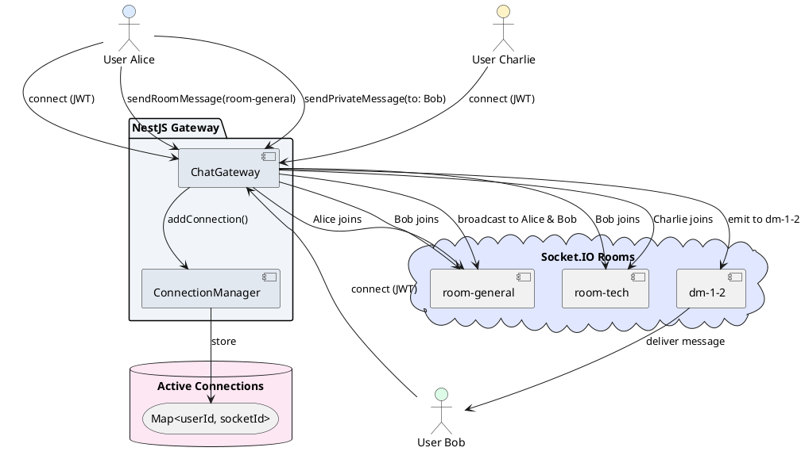

# Lifecycle та Rooms у WebSocket

## Короткий зміст

У цій лекції детально вивчається життєвий цикл WebSocket з'єднань та організація клієнтів у групи:

- **OnGatewayInit** — lifecycle hook для ініціалізації Gateway, виконується один раз при старті застосунку, налаштування server instance
- **OnGatewayConnection** — hook викликається при кожному новому підключенні клієнта, отримання socket object, логування підключень, можливість відхилення з'єднання
- **OnGatewayDisconnect** — hook викликається при відключенні клієнта, cleanup операції, видалення з active connections map
- **Tracking connections** — зберігання активних з'єднань у Map або Set, зіставлення socket.id з userId для ідентифікації користувачів
- **Rooms (кімнати)** — логічне групування клієнтів для targeted broadcasting, `socket.join(roomName)` для входу у кімнату, `socket.leave(roomName)` для виходу, приклад: кімната для кожного чату
- **Namespaces** — логічне розділення Gateway на окремі канали (наприклад, /chat, /notifications), кожен namespace має власні rooms та events
- **Broadcasting у rooms** — `server.to(roomName).emit()` для відправки повідомлення всім у кімнаті, `socket.to(roomName).emit()` для всіх у кімнаті окрім відправника
- **Автентифікація WebSocket** — перевірка JWT токена при з'єднанні, витягування userId з токена, зберігання user-socket mapping

Розглядаються практичні сценарії: чат-кімнати для груп, приватні повідомлення між користувачами, broadcast оновлень у конкретну кімнату, моніторинг активних користувачів.

---

::card-group

::card{title="🎯 Мета лекції" icon="i-lucide-target"}

- Опанувати lifecycle hooks WebSocket Gateway: `OnGatewayInit`, `OnGatewayConnection`, `OnGatewayDisconnect` для управління станом з'єднань.
- Навчитися відстежувати активні з'єднання через Map для зіставлення userId з socket.id та vice versa.
- Впровадити Rooms (кімнати) для логічного групування клієнтів та targeted broadcasting повідомлень.
- Розмежувати функціональність через Namespaces для створення ізольованих каналів комунікації.
- Реалізувати приватні повідомлення між користувачами та групові чати з підтримкою online/offline статусів.
- Створити систему моніторингу активних користувачів у реальному часі з broadcast подій join/leave.

::

::card{title="🔑 Ключові терміни" icon="i-lucide-key"}

- **Lifecycle Hooks:** спеціальні методи Gateway, що автоматично викликаються на певних етапах життєвого циклу (підключення, відключення, ініціалізація).
- **Socket.id:** унікальний ідентифікатор клієнта, згенерований Socket.IO при підключенні (наприклад, `"abc123xyz"`).
- **Room (Кімната):** логічна група клієнтів, яким можна відправити broadcast повідомлення за допомогою `server.to(roomName).emit()`.
- **Namespace:** логічний канал комунікації з власним endpoint (наприклад, `/chat`, `/admin`), ізольований від інших namespace.
- **Connection Tracking:** механізм відстеження активних з'єднань для зіставлення userId з socket.id та навпаки.
- **Presence System:** система визначення онлайн-статусу користувачів у реальному часі.

::

::

---

## Контекст: Управління станом WebSocket з'єднань

У попередній лекції ми створили функціональний WebSocket Gateway з автентифікацією, обробкою подій та збереженням повідомлень у базі даних. Проте для побудови складних real-time застосунків (чати, collaborative editing, multiplayer ігри) необхідно **управляти станом підключених клієнтів**: знати, які користувачі онлайн, до яких кімнат вони приєдналися, як відправити повідомлення конкретній групі користувачів.

Розглянемо типові задачі, які потребують lifecycle та rooms:

1. **Відображення списку онлайн користувачів:** коли користувач підключається до чату, всі інші бачать, що він online. При відключенні — offline.

2. **Групові чати:** користувачі об'єднані у кімнату `room-general` отримують повідомлення лише від інших учасників цієї кімнати, не бачачи повідомлень з `room-tech`.

3. **Приватні повідомлення:** користувач A відправляє повідомлення користувачу B. Сервер повинен знайти `socket.id` користувача B за його `userId` та відправити повідомлення лише йому.

4. **Typing indicators (індикатори друкування):** коли користувач друкує у чаті, інші учасники кімнати бачать "User is typing...", але користувачі з інших кімнат — ні.

5. **Cleanup при відключенні:** користувач закрив вкладку — сервер повинен видалити його з активних з'єднань, сповістити інших про offline статус, видалити з кімнат.

Усі ці задачі вирішуються через **lifecycle hooks** та **rooms**.

---

## Lifecycle Hooks: Керування життєвим циклом з'єднань

NestJS WebSocket Gateway підтримує три інтерфейси для lifecycle hooks:

| Інтерфейс | Метод | Коли викликається |
|-----------|-------|-------------------|
| `OnGatewayInit` | `afterInit(server: Server)` | **Один раз** при ініціалізації Gateway (старт застосунку) |
| `OnGatewayConnection` | `handleConnection(client: Socket, ...args)` | При **кожному новому підключенні** клієнта |
| `OnGatewayDisconnect` | `handleDisconnect(client: Socket)` | При **відключенні** клієнта (закриття вкладки, мережева помилка) |

### OnGatewayInit: Ініціалізація Gateway

Цей hook викликається **один раз** при запуску застосунку, після створення Socket.IO server instance. Використовується для налаштування глобальних параметрів сервера, підключення Redis Adapter (для multi-server), логування старту.

```typescript
// src/chat/chat.gateway.ts
import {
  WebSocketGateway,
  WebSocketServer,
  OnGatewayInit,
} from '@nestjs/websockets';
import { Server } from 'socket.io';
import { Logger } from '@nestjs/common';

@WebSocketGateway({ cors: { origin: '*' } })
export class ChatGateway implements OnGatewayInit {
  @WebSocketServer()
  server: Server;

  private readonly logger = new Logger(ChatGateway.name);

  /**
   * Викликається один раз при старті застосунку
   */
  afterInit(server: Server) {
    this.logger.log('🚀 WebSocket Gateway ініціалізовано');
    this.logger.log(`📡 Socket.IO server працює на namespace: ${server.name}`);

    // Налаштування глобальних middleware (опціонально)
    server.use((socket, next) => {
      const token = socket.handshake.auth?.token;
      this.logger.debug(`[Middleware] З'єднання від ${socket.id}, token: ${token ? 'є' : 'немає'}`);
      next();
    });

    // Підключення Redis Adapter для масштабування (розглянемо пізніше)
    // const redisAdapter = createAdapter(redisClient, redisClient.duplicate());
    // server.adapter(redisAdapter);
  }
}
```

**Сценарії використання:**

- **Логування старту:** підтвердження, що WebSocket сервер запущений.
- **Конфігурація middleware:** додавання глобальних middleware для логування, rate limiting.
- **Підключення Adapter:** Redis Adapter для синхронізації між кількома інстансами сервера.
- **Warmup:** попереднє завантаження даних у кеш перед прийомом клієнтів.

::note
Метод `afterInit()` викликається **після** того, як Socket.IO server повністю готовий приймати з'єднання, тому безпечно налаштовувати adapter та middleware саме тут.
::

### OnGatewayConnection: Обробка нових підключень

Цей hook викликається **при кожному новому WebSocket з'єднанні**. Тут виконується автентифікація (якщо не використовується Guard), логування підключення, додавання клієнта до Map активних з'єднань.

```typescript
// src/chat/chat.gateway.ts
import {
  OnGatewayConnection,
  ConnectedSocket,
} from '@nestjs/websockets';
import { Socket } from 'socket.io';

interface AuthenticatedSocket extends Socket {
  userId: number;
  username: string;
}

@WebSocketGateway({ cors: { origin: '*' } })
export class ChatGateway implements OnGatewayInit, OnGatewayConnection {
  @WebSocketServer()
  server: Server;

  private readonly logger = new Logger(ChatGateway.name);

  // Map для відстеження активних з'єднань: userId → socket.id
  private readonly connectedUsers = new Map<number, string>();

  /**
   * Викликається при кожному новому підключенні
   */
  handleConnection(client: AuthenticatedSocket) {
    const userId = client.userId; // Встановлено у WsJwtGuard
    const username = client.username;

    if (!userId) {
      this.logger.warn(`[Connection] Клієнт ${client.id} без userId — відключаємо`);
      client.disconnect();
      return;
    }

    // Перевірка, чи користувач вже підключений з іншого пристрою
    const existingSocketId = this.connectedUsers.get(userId);
    if (existingSocketId) {
      this.logger.warn(
        `[Connection] Користувач ${username} (ID: ${userId}) вже підключений з socket ${existingSocketId}. Відключаємо старе з'єднання.`
      );

      // Відключити старе з'єднання
      const existingSocket = this.server.sockets.sockets.get(existingSocketId);
      if (existingSocket) {
        existingSocket.emit('forceDisconnect', {
          reason: 'Нове з\'єднання з іншого пристрою',
        });
        existingSocket.disconnect();
      }
    }

    // Зберегти нове з'єднання
    this.connectedUsers.set(userId, client.id);

    this.logger.log(
      `[Connection] ✅ ${username} (ID: ${userId}) підключився (socket: ${client.id}). Всього online: ${this.connectedUsers.size}`
    );

    // Сповістити інших користувачів про online статус
    client.broadcast.emit('userOnline', {
      userId,
      username,
      timestamp: new Date(),
    });

    // Відправити клієнту список онлайн користувачів
    const onlineUsers = Array.from(this.connectedUsers.entries()).map(
      ([uid, socketId]) => {
        const socket = this.server.sockets.sockets.get(socketId) as AuthenticatedSocket;
        return {
          userId: uid,
          username: socket?.username || 'Unknown',
        };
      }
    );

    client.emit('onlineUsers', onlineUsers);
  }
}
```

**Ключові моменти реалізації:**

1. **Валідація userId:** якщо у `client.userId` немає значення (Guard не спрацював або токен невалідний), відключаємо клієнта одразу.

2. **Обробка multiple devices:** якщо користувач вже підключений з іншого пристрою (наприклад, відкрив чат на телефоні та на комп'ютері), **відключаємо старе з'єднання** та залишаємо нове. Альтернативний підхід: дозволити кілька з'єднань, зберігаючи `userId → Set<socket.id>`.

3. **Broadcast online статусу:** інші користувачі отримують подію `userOnline`, щоб оновити список онлайн користувачів у UI.

4. **Надсилання списку онлайн користувачів:** новий клієнт отримує повний список всіх, хто зараз підключений.

::warning
**Проблема Race Condition:** якщо користувач швидко reconnect (наприклад, втратив мережу на 1 секунду), може виникнути ситуація, коли старе з'єднання ще не закрилося, а нове вже підключається. Для вирішення використовуйте debounce або перевіряйте timestamp останнього з'єднання.
::

### OnGatewayDisconnect: Обробка відключень

Цей hook викликається при **закритті WebSocket з'єднання**: користувач закрив вкладку, втратив мережу, або сервер примусово відключив клієнта. Тут виконується cleanup: видалення з Map активних з'єднань, видалення з усіх rooms, сповіщення інших про offline статус.

```typescript
// src/chat/chat.gateway.ts
import { OnGatewayDisconnect } from '@nestjs/websockets';

@WebSocketGateway({ cors: { origin: '*' } })
export class ChatGateway
  implements OnGatewayInit, OnGatewayConnection, OnGatewayDisconnect
{
  @WebSocketServer()
  server: Server;

  private readonly logger = new Logger(ChatGateway.name);
  private readonly connectedUsers = new Map<number, string>();

  /**
   * Викликається при відключенні клієнта
   */
  handleDisconnect(client: AuthenticatedSocket) {
    const userId = client.userId;
    const username = client.username;

    if (!userId) {
      this.logger.debug(`[Disconnect] Неавтентифікований клієнт ${client.id} відключився`);
      return;
    }

    // Видалити з Map активних з'єднань
    const wasConnected = this.connectedUsers.delete(userId);

    if (wasConnected) {
      this.logger.log(
        `[Disconnect] ❌ ${username} (ID: ${userId}) відключився (socket: ${client.id}). Залишилось online: ${this.connectedUsers.size}`
      );

      // Сповістити інших про offline статус
      client.broadcast.emit('userOffline', {
        userId,
        username,
        timestamp: new Date(),
      });
    } else {
      this.logger.warn(
        `[Disconnect] Користувач ${userId} не знайдений у connectedUsers (можливо, вже був видалений)`
      );
    }

    // Socket.IO автоматично видаляє клієнта з усіх rooms при disconnect,
    // але можна додати кастомну логіку (наприклад, збереження часу відключення у БД)
  }
}
```

**Важливі аспекти:**

1. **Автоматичне видалення з rooms:** Socket.IO **автоматично** видаляє клієнта з усіх кімнат при disconnect, тому явно викликати `socket.leave(room)` не потрібно.

2. **Broadcast offline статусу:** інші користувачі отримують подію `userOffline` для оновлення UI (наприклад, зробити аватар сірим).

3. **Збереження метаданих у БД:** можна зберігати час останнього відключення у БД для статистики (`UPDATE users SET last_seen = NOW() WHERE id = :userId`).

4. **Graceful vs Abrupt disconnect:** Socket.IO розрізняє два типи відключень:
   - **Graceful:** клієнт явно викликав `socket.disconnect()` — `handleDisconnect()` викликається одразу.
   - **Abrupt:** мережа розірвалася без попередження — `handleDisconnect()` викликається після таймауту (за замовчуванням 45 секунд).


---

## Connection Tracking: Зіставлення userId з socket.id

Для реалізації приватних повідомлень, визначення онлайн-статусу та інших функцій потрібна **двостороння Map** для зіставлення:
- `userId → socket.id` (знайти socket клієнта за userId)
- `socket.id → userId` (визначити userId за socket при відключенні)

### Реалізація Connection Manager

Створимо окремий сервіс для управління активними з'єднаннями.

```typescript
// src/chat/services/connection-manager.service.ts
import { Injectable, Logger } from '@nestjs/common';

interface UserConnection {
  userId: number;
  username: string;
  socketId: string;
  connectedAt: Date;
}

@Injectable()
export class ConnectionManagerService {
  private readonly logger = new Logger(ConnectionManagerService.name);

  // Двосторонні Map для швидкого пошуку
  private readonly userToSocket = new Map<number, string>(); // userId → socketId
  private readonly socketToUser = new Map<string, number>(); // socketId → userId
  private readonly connections = new Map<string, UserConnection>(); // socketId → повна інформація

  /**
   * Додати нове з'єднання
   */
  addConnection(userId: number, username: string, socketId: string): void {
    // Перевірити, чи користувач вже підключений
    const existingSocketId = this.userToSocket.get(userId);

    if (existingSocketId && existingSocketId !== socketId) {
      this.logger.warn(
        `[ConnectionManager] Користувач ${username} (${userId}) вже підключений через socket ${existingSocketId}. Замінюємо на ${socketId}.`
      );

      // Видалити старе з'єднання
      this.removeConnection(existingSocketId);
    }

    // Додати нове з'єднання
    this.userToSocket.set(userId, socketId);
    this.socketToUser.set(socketId, userId);
    this.connections.set(socketId, {
      userId,
      username,
      socketId,
      connectedAt: new Date(),
    });

    this.logger.log(
      `[ConnectionManager] ✅ ${username} (${userId}) додано через socket ${socketId}. Всього: ${this.connections.size}`
    );
  }

  /**
   * Видалити з'єднання за socketId
   */
  removeConnection(socketId: string): boolean {
    const connection = this.connections.get(socketId);

    if (!connection) {
      return false;
    }

    // Видалити з усіх Map
    this.userToSocket.delete(connection.userId);
    this.socketToUser.delete(socketId);
    this.connections.delete(socketId);

    this.logger.log(
      `[ConnectionManager] ❌ ${connection.username} (${connection.userId}) видалено. Залишилось: ${this.connections.size}`
    );

    return true;
  }

  /**
   * Отримати socketId за userId
   */
  getSocketIdByUserId(userId: number): string | undefined {
    return this.userToSocket.get(userId);
  }

  /**
   * Отримати userId за socketId
   */
  getUserIdBySocketId(socketId: string): number | undefined {
    return this.socketToUser.get(socketId);
  }

  /**
   * Отримати повну інформацію про з'єднання
   */
  getConnection(socketId: string): UserConnection | undefined {
    return this.connections.get(socketId);
  }

  /**
   * Отримати всіх онлайн користувачів
   */
  getOnlineUsers(): UserConnection[] {
    return Array.from(this.connections.values());
  }

  /**
   * Перевірити, чи користувач онлайн
   */
  isUserOnline(userId: number): boolean {
    return this.userToSocket.has(userId);
  }

  /**
   * Отримати кількість активних з'єднань
   */
  getConnectionCount(): number {
    return this.connections.size;
  }

  /**
   * Очистити всі з'єднання (для тестів або restart)
   */
  clearAll(): void {
    this.userToSocket.clear();
    this.socketToUser.clear();
    this.connections.clear();
    this.logger.warn('[ConnectionManager] Всі з\'єднання очищено');
  }
}
```

### Інтеграція Connection Manager у Gateway

```typescript
// src/chat/chat.gateway.ts
import { ConnectionManagerService } from './services/connection-manager.service';

@WebSocketGateway({ cors: { origin: '*' } })
export class ChatGateway
  implements OnGatewayInit, OnGatewayConnection, OnGatewayDisconnect
{
  @WebSocketServer()
  server: Server;

  constructor(
    private readonly connectionManager: ConnectionManagerService,
    private readonly chatService: ChatService,
  ) {}

  handleConnection(client: AuthenticatedSocket) {
    const { userId, username } = client;

    // Додати з'єднання через Connection Manager
    this.connectionManager.addConnection(userId, username, client.id);

    // Якщо потрібно відключити старе з'єднання, отримати його socketId
    const existingSocketId = this.connectionManager.getSocketIdByUserId(userId);
    if (existingSocketId && existingSocketId !== client.id) {
      const existingSocket = this.server.sockets.sockets.get(existingSocketId);
      existingSocket?.disconnect();
    }

    // Broadcast online статусу
    client.broadcast.emit('userOnline', { userId, username });

    // Надіслати список онлайн користувачів
    const onlineUsers = this.connectionManager.getOnlineUsers();
    client.emit('onlineUsers', onlineUsers);
  }

  handleDisconnect(client: AuthenticatedSocket) {
    const { userId, username } = client;

    // Видалити з Connection Manager
    this.connectionManager.removeConnection(client.id);

    // Broadcast offline статусу
    client.broadcast.emit('userOffline', { userId, username });
  }
}
```

**Переваги централізованого Connection Manager:**

1. **Єдине джерело правди:** вся логіка tracking у одному місці, легше тестувати.
2. **Двосторонній пошук:** швидкий пошук за userId або socketId (O(1) через Map).
3. **Метадані:** можна зберігати додаткову інформацію (час підключення, IP адресу, device type).
4. **Реюзабельність:** можна використовувати у кількох Gateway (наприклад, `/chat` та `/notifications`).

---

## Rooms (Кімнати): Логічне групування клієнтів

**Room (кімната)** у Socket.IO — це абстракція для групування клієнтів за логічним призначенням. Клієнт може бути у кількох кімнатах одночасно, а broadcast у кімнату доставляє повідомлення лише учасникам цієї кімнати.

### Концептуальна модель Rooms

Уявіть офісну будівлю з кімнатами:

```
Building (Server)
├── Room "general-chat"
│   ├── User Alice (socket-abc123)
│   ├── User Bob (socket-def456)
│   └── User Charlie (socket-ghi789)
├── Room "tech-support"
│   ├── User Bob (socket-def456) ← Bob у двох кімнатах одночасно
│   └── User Diana (socket-jkl012)
└── Room "private-alice-bob"
    ├── User Alice (socket-abc123)
    └── User Bob (socket-def456)
```

Коли Alice відправляє повідомлення у `room "general-chat"`, його отримують лише Bob та Charlie (учасники кімнати), але не Diana (вона у `tech-support`).

### API для роботи з Rooms

| Метод | Опис |
|-------|------|
| `socket.join(roomName)` | Додати клієнта до кімнати |
| `socket.leave(roomName)` | Видалити клієнта з кімнати |
| `server.to(roomName).emit(event, data)` | Відправити **всім** у кімнаті (включно з відправником, якщо він у кімнаті) |
| `socket.to(roomName).emit(event, data)` | Відправити всім у кімнаті **окрім** відправника |
| `socket.rooms` | Set всіх кімнат, до яких належить клієнт |
| `server.in(roomName).fetchSockets()` | Отримати всіх клієнтів у кімнаті (async) |

### Практичний приклад: Груповий чат

Реалізуємо функціональність групового чату, де користувачі можуть приєднуватися до кімнат та відправляти повідомлення лише учасникам цієї кімнати.

```typescript
// src/chat/chat.gateway.ts
@WebSocketGateway({ cors: { origin: '*' } })
export class ChatGateway {
  @WebSocketServer()
  server: Server;

  constructor(
    private readonly chatService: ChatService,
    private readonly connectionManager: ConnectionManagerService,
  ) {}

  /**
   * Приєднання користувача до кімнати
   */
  @SubscribeMessage('joinRoom')
  async handleJoinRoom(
    @MessageBody() data: { roomId: string },
    @ConnectedSocket() client: AuthenticatedSocket,
  ) {
    const { userId, username } = client;
    const { roomId } = data;

    // Перевірка прав доступу до кімнати (опціонально)
    const hasAccess = await this.chatService.checkRoomAccess(userId, roomId);
    if (!hasAccess) {
      client.emit('error', { message: 'Доступ до кімнати заборонено' });
      return;
    }

    // Додати клієнта до Socket.IO room
    await client.join(roomId);

    this.logger.log(`[Room] ${username} (${userId}) приєднався до кімнати ${roomId}`);

    // Завантажити історію повідомлень з БД
    const messages = await this.chatService.getRecentMessages(roomId, 50);

    // Відправити історію клієнту
    client.emit('messageHistory', {
      roomId,
      messages,
    });

    // Сповістити інших учасників кімнати
    client.to(roomId).emit('userJoinedRoom', {
      roomId,
      userId,
      username,
      timestamp: new Date(),
    });

    // Відправити клієнту список учасників кімнати
    const roomSockets = await this.server.in(roomId).fetchSockets();
    const participants = roomSockets.map((socket: any) => ({
      userId: socket.userId,
      username: socket.username,
      socketId: socket.id,
    }));

    client.emit('roomParticipants', {
      roomId,
      participants,
    });
  }

  /**
   * Вихід користувача з кімнати
   */
  @SubscribeMessage('leaveRoom')
  async handleLeaveRoom(
    @MessageBody() data: { roomId: string },
    @ConnectedSocket() client: AuthenticatedSocket,
  ) {
    const { userId, username } = client;
    const { roomId } = data;

    // Видалити клієнта з Socket.IO room
    await client.leave(roomId);

    this.logger.log(`[Room] ${username} (${userId}) вийшов з кімнати ${roomId}`);

    // Сповістити інших учасників
    client.to(roomId).emit('userLeftRoom', {
      roomId,
      userId,
      username,
      timestamp: new Date(),
    });
  }

  /**
   * Відправка повідомлення у кімнату
   */
  @SubscribeMessage('sendRoomMessage')
  async handleSendRoomMessage(
    @MessageBody() data: { roomId: string; text: string },
    @ConnectedSocket() client: AuthenticatedSocket,
  ) {
    const { userId, username } = client;
    const { roomId, text } = data;

    // Перевірка, чи клієнт у кімнаті
    if (!client.rooms.has(roomId)) {
      client.emit('error', {
        message: 'Ви не приєдналися до цієї кімнати',
      });
      return;
    }

    // Зберегти повідомлення у БД
    const message = await this.chatService.createMessage({
      roomId,
      userId,
      text,
    });

    // Broadcast повідомлення всім у кімнаті (включно з відправником)
    this.server.to(roomId).emit('newRoomMessage', {
      id: message.id,
      roomId,
      userId,
      username,
      text,
      createdAt: message.createdAt,
    });

    this.logger.log(`[Room] ${username} відправив повідомлення у ${roomId}: ${text.substring(0, 50)}`);

    return { success: true, messageId: message.id };
  }

  /**
   * Typing indicator у кімнаті
   */
  @SubscribeMessage('roomTyping')
  handleRoomTyping(
    @MessageBody() data: { roomId: string; isTyping: boolean },
    @ConnectedSocket() client: AuthenticatedSocket,
  ) {
    const { userId, username } = client;
    const { roomId, isTyping } = data;

    // Відправити всім у кімнаті ОКРІМ відправника
    client.to(roomId).emit('userTyping', {
      roomId,
      userId,
      username,
      isTyping,
    });
  }
}
```

### Клієнтська частина: Робота з кімнатами

```typescript
// client/hooks/useRoom.ts
import { useEffect } from 'react';
import { Socket } from 'socket.io-client';

interface Message {
  id: string;
  userId: number;
  username: string;
  text: string;
  createdAt: string;
}

interface Participant {
  userId: number;
  username: string;
  socketId: string;
}

export const useRoom = (
  socket: Socket,
  roomId: string,
  onMessage: (message: Message) => void,
  onUserJoined: (data: { username: string }) => void,
  onUserLeft: (data: { username: string }) => void,
) => {
  useEffect(() => {
    // Приєднатися до кімнати при mount
    socket.emit('joinRoom', { roomId });

    // Обробники подій
    socket.on('messageHistory', (data: { messages: Message[] }) => {
      data.messages.forEach(onMessage);
    });

    socket.on('newRoomMessage', (message: Message) => {
      onMessage(message);
    });

    socket.on('userJoinedRoom', (data: { username: string }) => {
      onUserJoined(data);
    });

    socket.on('userLeftRoom', (data: { username: string }) => {
      onUserLeft(data);
    });

    socket.on('roomParticipants', (data: { participants: Participant[] }) => {
      console.log('Учасники кімнати:', data.participants);
    });

    // Cleanup: вийти з кімнати при unmount
    return () => {
      socket.emit('leaveRoom', { roomId });
      socket.off('messageHistory');
      socket.off('newRoomMessage');
      socket.off('userJoinedRoom');
      socket.off('userLeftRoom');
      socket.off('roomParticipants');
    };
  }, [socket, roomId]);

  const sendMessage = (text: string) => {
    socket.emit('sendRoomMessage', { roomId, text });
  };

  const sendTyping = (isTyping: boolean) => {
    socket.emit('roomTyping', { roomId, isTyping });
  };

  return { sendMessage, sendTyping };
};
```

### Отримання списку учасників кімнати

Socket.IO надає метод `server.in(roomName).fetchSockets()` для асинхронного отримання всіх клієнтів у кімнаті.

```typescript
// src/chat/chat.gateway.ts
@SubscribeMessage('getRoomParticipants')
async handleGetRoomParticipants(
  @MessageBody() data: { roomId: string },
  @ConnectedSocket() client: Socket,
) {
  const { roomId } = data;

  // Отримати всіх клієнтів у кімнаті
  const sockets = await this.server.in(roomId).fetchSockets();

  const participants = sockets.map((socket: any) => ({
    userId: socket.userId,
    username: socket.username,
    socketId: socket.id,
    connectedAt: socket.handshake.time,
  }));

  return {
    roomId,
    participantCount: participants.length,
    participants,
  };
}
```

::tip
**Оптимізація для великих кімнат:** якщо у кімнаті тисячі учасників, `fetchSockets()` може бути повільним. Для таких випадків зберігайте список учасників у Redis та оновлюйте його при join/leave подіях.
::

---

## Приватні повідомлення: Direct Messaging

Приватні повідомлення між двома користувачами — типова функція чатів. Розглянемо два підходи до реалізації.

### Підхід 1: Dynamic Room (Динамічна кімната)

Створюємо унікальну кімнату для кожної пари користувачів, де назва кімнати — це відсортовані userId.

```typescript
// src/chat/chat.gateway.ts
@SubscribeMessage('sendPrivateMessage')
async handleSendPrivateMessage(
  @MessageBody() data: { recipientUserId: number; text: string },
  @ConnectedSocket() client: AuthenticatedSocket,
) {
  const senderId = client.userId;
  const senderUsername = client.username;
  const { recipientUserId, text } = data;

  // Створити унікальну назву кімнати для цієї пари користувачів
  // Відсортувати userId, щоб назва завжди була однаковою
  const roomName = `dm-${Math.min(senderId, recipientUserId)}-${Math.max(senderId, recipientUserId)}`;

  // Зберегти повідомлення у БД
  const message = await this.chatService.createPrivateMessage({
    senderId,
    recipientId: recipientUserId,
    text,
  });

  // Broadcast повідомлення у динамічну кімнату
  // (обидва користувачі автоматично у цій кімнаті при підключенні або при першому повідомленні)
  this.server.to(roomName).emit('privateMessage', {
    id: message.id,
    senderId,
    senderUsername,
    recipientUserId,
    text,
    createdAt: message.createdAt,
  });

  this.logger.log(`[DM] ${senderUsername} → User#${recipientUserId}: ${text.substring(0, 50)}`);

  return { success: true, messageId: message.id };
}

/**
 * Приєднатися до кімнати приватних повідомлень з користувачем
 */
@SubscribeMessage('startDirectMessage')
async handleStartDirectMessage(
  @MessageBody() data: { recipientUserId: number },
  @ConnectedSocket() client: AuthenticatedSocket,
) {
  const senderId = client.userId;
  const { recipientUserId } = data;

  const roomName = `dm-${Math.min(senderId, recipientUserId)}-${Math.max(senderId, recipientUserId)}`;

  // Обидва користувачі приєднуються до кімнати
  await client.join(roomName);

  // Завантажити історію приватних повідомлень
  const messages = await this.chatService.getPrivateMessages(senderId, recipientUserId, 50);

  client.emit('privateMessageHistory', {
    recipientUserId,
    messages,
  });
}
```

**Переваги підходу:**
- Просто реалізувати через існуючий rooms API.
- Автоматичний broadcast обом учасникам.
- Легко масштабується через Redis Adapter.

**Недоліки:**
- Потрібно вручну управляти join до кімнати.

### Підхід 2: Direct Socket Emit (Пряма відправка)

Знаходимо `socket.id` отримувача через Connection Manager та відправляємо повідомлення безпосередньо йому.

```typescript
// src/chat/chat.gateway.ts
@SubscribeMessage('sendPrivateMessage')
async handleSendPrivateMessage(
  @MessageBody() data: { recipientUserId: number; text: string },
  @ConnectedSocket() client: AuthenticatedSocket,
) {
  const senderId = client.userId;
  const senderUsername = client.username;
  const { recipientUserId, text } = data;

  // Перевірити, чи отримувач онлайн
  const recipientSocketId = this.connectionManager.getSocketIdByUserId(recipientUserId);

  if (!recipientSocketId) {
    // Отримувач офлайн — зберегти повідомлення для доставки пізніше
    await this.chatService.createPrivateMessage({
      senderId,
      recipientId: recipientUserId,
      text,
    });

    return {
      success: true,
      delivered: false,
      message: 'Користувач офлайн, повідомлення буде доставлено пізніше',
    };
  }

  // Зберегти повідомлення у БД
  const message = await this.chatService.createPrivateMessage({
    senderId,
    recipientId: recipientUserId,
    text,
  });

  // Відправити отримувачу
  this.server.to(recipientSocketId).emit('privateMessage', {
    id: message.id,
    senderId,
    senderUsername,
    text,
    createdAt: message.createdAt,
  });

  // Підтвердження відправнику (echo)
  client.emit('privateMessageSent', {
    id: message.id,
    recipientUserId,
    text,
    createdAt: message.createdAt,
  });

  this.logger.log(`[DM] ${senderUsername} → User#${recipientUserId}: ${text.substring(0, 50)}`);

  return {
    success: true,
    delivered: true,
    messageId: message.id,
  };
}
```

**Переваги підходу:**
- Не потрібно join до кімнати.
- Явна логіка: коли користувач офлайн — повідомлення не доставляється одразу.
- Можна реалізувати delivery/read receipts.

**Недоліки:**
- Потребує Connection Manager для пошуку socketId.
- Складніше масштабується на кілька серверів (потрібен Redis Pub/Sub).

::note
У production застосунках рекомендується **Підхід 1 (Dynamic Room)** з Redis Adapter для масштабування. Підхід 2 корисний для простих сценаріїв з одним сервером.
::


---

## Namespaces: Логічне розділення каналів комунікації

**Namespace** у Socket.IO — це логічний канал комунікації з власним endpoint (наприклад, `/chat`, `/notifications`, `/admin`), повністю ізольований від інших namespace. Кожен namespace має власні rooms, події та middleware.

### Коли використовувати Namespaces

| Сценарій | Namespace |
|----------|-----------|
| Чат-повідомлення | `/chat` |
| Системні нотифікації | `/notifications` |
| Адміністративні команди | `/admin` |
| Real-time analytics | `/analytics` |
| IoT device communication | `/devices` |

**Переваги Namespaces:**

1. **Ізоляція:** події у `/chat` не конфліктують з подіями у `/notifications`.
2. **Різна автентифікація:** `/admin` може вимагати admin токен, `/chat` — звичайний user токен.
3. **Різні Guard та Middleware:** кожен namespace має власні правила доступу.
4. **Незалежне масштабування:** можна розгорнути `/chat` на окремих серверах з більшою потужністю.

### Створення кількох Gateway з різними Namespaces

```typescript
// src/chat/chat.gateway.ts
@WebSocketGateway({
  namespace: '/chat',
  cors: { origin: '*' },
})
export class ChatGateway {
  @WebSocketServer()
  server: Server;

  @SubscribeMessage('sendMessage')
  handleMessage(@MessageBody() data: any) {
    this.server.emit('newMessage', data); // Розсилка лише у namespace /chat
  }
}
```

```typescript
// src/notifications/notifications.gateway.ts
@WebSocketGateway({
  namespace: '/notifications',
  cors: { origin: '*' },
})
export class NotificationsGateway {
  @WebSocketServer()
  server: Server;

  @SubscribeMessage('subscribe')
  handleSubscribe(@ConnectedSocket() client: Socket) {
    // Підписати користувача на нотифікації
    client.emit('subscribed', { message: 'Ви підписані на нотифікації' });
  }

  /**
   * Відправка нотифікації конкретному користувачу (викликається з іншого сервісу)
   */
  sendNotification(userId: number, notification: any) {
    // Потрібен Connection Manager для пошуку socketId
    const socketId = this.connectionManager.getSocketIdByUserId(userId);

    if (socketId) {
      this.server.to(socketId).emit('notification', notification);
    }
  }
}
```

```typescript
// src/admin/admin.gateway.ts
@WebSocketGateway({
  namespace: '/admin',
  cors: { origin: process.env.ADMIN_FRONTEND_URL },
})
@UseGuards(AdminWsGuard) // Кастомний Guard для admin токена
export class AdminGateway {
  @WebSocketServer()
  server: Server;

  @SubscribeMessage('broadcastAnnouncement')
  handleBroadcast(@MessageBody() announcement: string) {
    // Broadcast усім у namespace /admin
    this.server.emit('announcement', announcement);
  }
}
```

### Клієнтська частина: Підключення до різних Namespaces

```typescript
// client/socket-connections.ts
import { io, Socket } from 'socket.io-client';

class SocketConnections {
  private chatSocket: Socket;
  private notificationsSocket: Socket;
  private adminSocket: Socket | null = null;

  constructor(token: string, isAdmin: boolean) {
    // Підключення до namespace /chat
    this.chatSocket = io('http://localhost:3001/chat', {
      auth: { token },
    });

    // Підключення до namespace /notifications
    this.notificationsSocket = io('http://localhost:3001/notifications', {
      auth: { token },
    });

    // Адмін підключається до /admin (якщо має права)
    if (isAdmin) {
      this.adminSocket = io('http://localhost:3001/admin', {
        auth: { token }, // Admin токен
      });
    }

    this.setupEventListeners();
  }

  private setupEventListeners() {
    // События для /chat
    this.chatSocket.on('newMessage', (message) => {
      console.log('[Chat]', message);
    });

    // Події для /notifications
    this.notificationsSocket.on('notification', (notification) => {
      console.log('[Notification]', notification);
      this.showNotification(notification);
    });

    // Події для /admin
    if (this.adminSocket) {
      this.adminSocket.on('announcement', (announcement) => {
        console.log('[Admin]', announcement);
      });
    }
  }

  sendChatMessage(roomId: string, text: string) {
    this.chatSocket.emit('sendMessage', { roomId, text });
  }

  subscribeToNotifications() {
    this.notificationsSocket.emit('subscribe');
  }

  broadcastAdminAnnouncement(announcement: string) {
    this.adminSocket?.emit('broadcastAnnouncement', announcement);
  }

  private showNotification(notification: any) {
    // Показати browser notification
    if ('Notification' in window && Notification.permission === 'granted') {
      new Notification(notification.title, {
        body: notification.message,
        icon: '/notification-icon.png',
      });
    }
  }

  disconnect() {
    this.chatSocket.disconnect();
    this.notificationsSocket.disconnect();
    this.adminSocket?.disconnect();
  }
}

// Використання
const token = localStorage.getItem('accessToken') || '';
const isAdmin = localStorage.getItem('userRole') === 'admin';

const sockets = new SocketConnections(token, isAdmin);

sockets.sendChatMessage('room-123', 'Привіт, чат!');
sockets.subscribeToNotifications();
```

### Взаємодія між Namespaces через Event Emitter

Іноді потрібно відправити подію з одного namespace в інший (наприклад, нове повідомлення у `/chat` генерує нотифікацію у `/notifications`).

```typescript
// src/chat/chat.gateway.ts
import { EventEmitter2 } from '@nestjs/event-emitter';

@WebSocketGateway({ namespace: '/chat', cors: { origin: '*' } })
export class ChatGateway {
  constructor(
    private readonly chatService: ChatService,
    private readonly eventEmitter: EventEmitter2, // Для міжмодульної комунікації
  ) {}

  @SubscribeMessage('sendMessage')
  async handleSendMessage(
    @MessageBody() data: { roomId: string; text: string },
    @ConnectedSocket() client: AuthenticatedSocket,
  ) {
    const message = await this.chatService.createMessage({
      roomId: data.roomId,
      userId: client.userId,
      text: data.text,
    });

    // Broadcast у /chat namespace
    this.server.to(data.roomId).emit('newMessage', message);

    // Емітувати подію для інших модулів (наприклад, NotificationsGateway)
    this.eventEmitter.emit('chat.message.created', {
      roomId: data.roomId,
      senderId: client.userId,
      senderUsername: client.username,
      text: data.text,
    });

    return { success: true, messageId: message.id };
  }
}
```

```typescript
// src/notifications/notifications.gateway.ts
import { OnEvent } from '@nestjs/event-emitter';

@WebSocketGateway({ namespace: '/notifications', cors: { origin: '*' } })
export class NotificationsGateway {
  constructor(
    private readonly connectionManager: ConnectionManagerService,
  ) {}

  /**
   * Обробити подію нового повідомлення з /chat
   * Відправити нотифікацію всім учасникам кімнати
   */
  @OnEvent('chat.message.created')
  async handleNewChatMessage(payload: {
    roomId: string;
    senderId: number;
    senderUsername: string;
    text: string;
  }) {
    // Отримати всіх учасників кімнати з БД
    const participants = await this.chatService.getRoomParticipants(payload.roomId);

    // Відправити нотифікацію кожному учаснику (окрім відправника)
    for (const participant of participants) {
      if (participant.userId !== payload.senderId) {
        const socketId = this.connectionManager.getSocketIdByUserId(participant.userId);

        if (socketId) {
          this.server.to(socketId).emit('notification', {
            type: 'new_message',
            title: `Нове повідомлення від ${payload.senderUsername}`,
            message: payload.text.substring(0, 100),
            roomId: payload.roomId,
            timestamp: new Date(),
          });
        }
      }
    }
  }
}
```

::tip
**Event Emitter для loose coupling:** використання `@nestjs/event-emitter` дозволяє Gateway бути незалежними один від одного. ChatGateway не знає про існування NotificationsGateway, а лише емітує подію. Це спрощує тестування та підтримку коду.
::

---

## Практичний приклад: Повноцінна система чату

Підсумуємо всі розглянуті концепції у комплексному прикладі чат-системи з lifecycle hooks, rooms, приватними повідомленнями та онлайн-статусами.

### Архітектура системи

::plant-uml{alt="Архітектура чат-системи з lifecycle та rooms"}



::

### Повна реалізація Gateway з lifecycle та rooms

::code-tree

```typescript [src/chat/chat.gateway.ts]
import {
  WebSocketGateway,
  WebSocketServer,
  SubscribeMessage,
  MessageBody,
  ConnectedSocket,
  OnGatewayInit,
  OnGatewayConnection,
  OnGatewayDisconnect,
} from '@nestjs/websockets';
import { UseGuards, Logger } from '@nestjs/common';
import { Server } from 'socket.io';
import { WsJwtGuard } from './guards/ws-jwt.guard';
import { ChatService } from './chat.service';
import { ConnectionManagerService } from './services/connection-manager.service';

interface AuthenticatedSocket extends Socket {
  userId: number;
  username: string;
}

@WebSocketGateway({
  namespace: '/chat',
  cors: { origin: process.env.FRONTEND_URL || 'http://localhost:3000' },
})
@UseGuards(WsJwtGuard)
export class ChatGateway
  implements OnGatewayInit, OnGatewayConnection, OnGatewayDisconnect
{
  @WebSocketServer()
  server: Server;

  private readonly logger = new Logger(ChatGateway.name);

  constructor(
    private readonly chatService: ChatService,
    private readonly connectionManager: ConnectionManagerService,
  ) {}

  // ============= Lifecycle Hooks =============

  afterInit(server: Server) {
    this.logger.log('🚀 Chat Gateway ініціалізовано');
  }

  handleConnection(client: AuthenticatedSocket) {
    const { userId, username } = client;

    // Додати до Connection Manager
    this.connectionManager.addConnection(userId, username, client.id);

    this.logger.log(
      `✅ ${username} (${userId}) підключився. Всього online: ${this.connectionManager.getConnectionCount()}`
    );

    // Broadcast online статусу
    client.broadcast.emit('userOnline', { userId, username });

    // Надіслати список онлайн користувачів
    const onlineUsers = this.connectionManager.getOnlineUsers();
    client.emit('onlineUsersList', onlineUsers);
  }

  handleDisconnect(client: AuthenticatedSocket) {
    const { userId, username } = client;

    this.connectionManager.removeConnection(client.id);

    this.logger.log(
      `❌ ${username} (${userId}) відключився. Залишилось online: ${this.connectionManager.getConnectionCount()}`
    );

    // Broadcast offline статусу
    client.broadcast.emit('userOffline', { userId, username });
  }

  // ============= Room Operations =============

  @SubscribeMessage('joinRoom')
  async handleJoinRoom(
    @MessageBody() data: { roomId: string },
    @ConnectedSocket() client: AuthenticatedSocket,
  ) {
    const { userId, username } = client;
    const { roomId } = data;

    await client.join(roomId);

    this.logger.log(`${username} приєднався до кімнати ${roomId}`);

    // Завантажити історію
    const messages = await this.chatService.getRecentMessages(roomId, 50);
    client.emit('messageHistory', { roomId, messages });

    // Сповістити інших
    client.to(roomId).emit('userJoinedRoom', { roomId, userId, username });

    // Список учасників
    const sockets = await this.server.in(roomId).fetchSockets();
    const participants = sockets.map((s: any) => ({
      userId: s.userId,
      username: s.username,
    }));

    client.emit('roomParticipants', { roomId, participants });
  }

  @SubscribeMessage('leaveRoom')
  async handleLeaveRoom(
    @MessageBody() data: { roomId: string },
    @ConnectedSocket() client: AuthenticatedSocket,
  ) {
    const { userId, username } = client;
    const { roomId } = data;

    await client.leave(roomId);

    this.logger.log(`${username} вийшов з кімнати ${roomId}`);

    client.to(roomId).emit('userLeftRoom', { roomId, userId, username });
  }

  @SubscribeMessage('sendRoomMessage')
  async handleSendRoomMessage(
    @MessageBody() data: { roomId: string; text: string },
    @ConnectedSocket() client: AuthenticatedSocket,
  ) {
    const { userId, username } = client;
    const { roomId, text } = data;

    if (!client.rooms.has(roomId)) {
      client.emit('error', { message: 'Ви не у кімнаті' });
      return;
    }

    const message = await this.chatService.createMessage({
      roomId,
      userId,
      text,
    });

    this.server.to(roomId).emit('newRoomMessage', {
      id: message.id,
      roomId,
      userId,
      username,
      text,
      createdAt: message.createdAt,
    });

    return { success: true, messageId: message.id };
  }

  // ============= Private Messages =============

  @SubscribeMessage('sendPrivateMessage')
  async handleSendPrivateMessage(
    @MessageBody() data: { recipientUserId: number; text: string },
    @ConnectedSocket() client: AuthenticatedSocket,
  ) {
    const senderId = client.userId;
    const senderUsername = client.username;
    const { recipientUserId, text } = data;

    const message = await this.chatService.createPrivateMessage({
      senderId,
      recipientId: recipientUserId,
      text,
    });

    // Dynamic room для DM
    const roomName = `dm-${Math.min(senderId, recipientUserId)}-${Math.max(senderId, recipientUserId)}`;

    this.server.to(roomName).emit('privateMessage', {
      id: message.id,
      senderId,
      senderUsername,
      recipientUserId,
      text,
      createdAt: message.createdAt,
    });

    return { success: true, messageId: message.id };
  }

  @SubscribeMessage('startDirectMessage')
  async handleStartDirectMessage(
    @MessageBody() data: { recipientUserId: number },
    @ConnectedSocket() client: AuthenticatedSocket,
  ) {
    const senderId = client.userId;
    const { recipientUserId } = data;

    const roomName = `dm-${Math.min(senderId, recipientUserId)}-${Math.max(senderId, recipientUserId)}`;

    await client.join(roomName);

    const messages = await this.chatService.getPrivateMessages(
      senderId,
      recipientUserId,
      50,
    );

    client.emit('privateMessageHistory', { recipientUserId, messages });
  }

  // ============= Typing Indicators =============

  @SubscribeMessage('roomTyping')
  handleRoomTyping(
    @MessageBody() data: { roomId: string; isTyping: boolean },
    @ConnectedSocket() client: AuthenticatedSocket,
  ) {
    const { userId, username } = client;
    const { roomId, isTyping } = data;

    client.to(roomId).emit('userTyping', {
      roomId,
      userId,
      username,
      isTyping,
    });
  }
}
```

```typescript [src/chat/services/connection-manager.service.ts]
import { Injectable, Logger } from '@nestjs/common';

interface UserConnection {
  userId: number;
  username: string;
  socketId: string;
  connectedAt: Date;
}

@Injectable()
export class ConnectionManagerService {
  private readonly logger = new Logger(ConnectionManagerService.name);
  private readonly userToSocket = new Map<number, string>();
  private readonly socketToUser = new Map<string, number>();
  private readonly connections = new Map<string, UserConnection>();

  addConnection(userId: number, username: string, socketId: string): void {
    const existingSocketId = this.userToSocket.get(userId);

    if (existingSocketId && existingSocketId !== socketId) {
      this.removeConnection(existingSocketId);
    }

    this.userToSocket.set(userId, socketId);
    this.socketToUser.set(socketId, userId);
    this.connections.set(socketId, {
      userId,
      username,
      socketId,
      connectedAt: new Date(),
    });
  }

  removeConnection(socketId: string): boolean {
    const connection = this.connections.get(socketId);
    if (!connection) return false;

    this.userToSocket.delete(connection.userId);
    this.socketToUser.delete(socketId);
    this.connections.delete(socketId);

    return true;
  }

  getSocketIdByUserId(userId: number): string | undefined {
    return this.userToSocket.get(userId);
  }

  getUserIdBySocketId(socketId: string): number | undefined {
    return this.socketToUser.get(socketId);
  }

  getOnlineUsers(): UserConnection[] {
    return Array.from(this.connections.values());
  }

  getConnectionCount(): number {
    return this.connections.size;
  }

  isUserOnline(userId: number): boolean {
    return this.userToSocket.has(userId);
  }
}
```

::

### Клієнтська реалізація (React Hook)

```typescript
// client/hooks/useChatSocket.ts
import { useEffect, useState, useCallback } from 'react';
import { io, Socket } from 'socket.io-client';

interface User {
  userId: number;
  username: string;
}

interface Message {
  id: string;
  userId: number;
  username: string;
  text: string;
  createdAt: string;
}

export const useChatSocket = (jwtToken: string) => {
  const [socket, setSocket] = useState<Socket | null>(null);
  const [isConnected, setIsConnected] = useState(false);
  const [onlineUsers, setOnlineUsers] = useState<User[]>([]);

  useEffect(() => {
    const newSocket = io('http://localhost:3001/chat', {
      auth: { token: jwtToken },
    });

    newSocket.on('connect', () => {
      console.log('[Socket] Підключено');
      setIsConnected(true);
    });

    newSocket.on('disconnect', () => {
      console.log('[Socket] Відключено');
      setIsConnected(false);
    });

    newSocket.on('onlineUsersList', (users: User[]) => {
      setOnlineUsers(users);
    });

    newSocket.on('userOnline', (user: User) => {
      setOnlineUsers((prev) => [...prev, user]);
    });

    newSocket.on('userOffline', (user: User) => {
      setOnlineUsers((prev) =>
        prev.filter((u) => u.userId !== user.userId)
      );
    });

    setSocket(newSocket);

    return () => {
      newSocket.disconnect();
    };
  }, [jwtToken]);

  const joinRoom = useCallback((roomId: string) => {
    socket?.emit('joinRoom', { roomId });
  }, [socket]);

  const sendMessage = useCallback((roomId: string, text: string) => {
    socket?.emit('sendRoomMessage', { roomId, text });
  }, [socket]);

  const sendPrivateMessage = useCallback((recipientUserId: number, text: string) => {
    socket?.emit('sendPrivateMessage', { recipientUserId, text });
  }, [socket]);

  return {
    socket,
    isConnected,
    onlineUsers,
    joinRoom,
    sendMessage,
    sendPrivateMessage,
  };
};
```


---

## Best Practices для lifecycle та rooms

### 1. Cleanup у handleDisconnect

Завжди виконуйте cleanup при відключенні клієнта, навіть якщо Socket.IO автоматично видаляє з rooms.

```typescript
handleDisconnect(client: AuthenticatedSocket) {
  const { userId } = client;

  // 1. Видалити з Connection Manager
  this.connectionManager.removeConnection(client.id);

  // 2. Оновити статус у БД
  this.chatService.updateUserStatus(userId, 'offline');

  // 3. Зберегти час останнього відключення
  this.chatService.updateLastSeen(userId, new Date());

  // 4. Сповістити інших
  client.broadcast.emit('userOffline', { userId });

  // 5. Логування
  this.logger.log(`User ${userId} disconnected (${client.id})`);
}
```

### 2. Валідація перед join/leave кімнати

Завжди перевіряйте права доступу перед додаванням клієнта до кімнати.

```typescript
@SubscribeMessage('joinRoom')
async handleJoinRoom(
  @MessageBody() data: { roomId: string },
  @ConnectedSocket() client: AuthenticatedSocket,
) {
  const { userId } = client;

  // Перевірка прав доступу
  const hasAccess = await this.chatService.checkRoomAccess(userId, data.roomId);

  if (!hasAccess) {
    client.emit('error', {
      code: 'ACCESS_DENIED',
      message: 'У вас немає доступу до цієї кімнати',
    });
    return { success: false, error: 'ACCESS_DENIED' };
  }

  // Перевірка, чи кімната існує
  const roomExists = await this.chatService.roomExists(data.roomId);

  if (!roomExists) {
    client.emit('error', {
      code: 'ROOM_NOT_FOUND',
      message: 'Кімната не знайдена',
    });
    return { success: false, error: 'ROOM_NOT_FOUND' };
  }

  await client.join(data.roomId);

  // Решта логіки...
}
```

### 3. Rate Limiting для emit операцій

Обмежте частоту відправки повідомлень для запобігання spam.

```typescript
// src/chat/decorators/throttle.decorator.ts
import { SetMetadata } from '@nestjs/common';

export const THROTTLE_KEY = 'throttle';
export const Throttle = (limit: number, ttl: number) =>
  SetMetadata(THROTTLE_KEY, { limit, ttl });
```

```typescript
// src/chat/guards/throttle.guard.ts
import { Injectable, CanActivate, ExecutionContext } from '@nestjs/common';
import { Reflector } from '@nestjs/core';
import { THROTTLE_KEY } from '../decorators/throttle.decorator';

@Injectable()
export class ThrottleGuard implements CanActivate {
  private readonly requests = new Map<string, number[]>();

  constructor(private reflector: Reflector) {}

  canActivate(context: ExecutionContext): boolean {
    const throttleConfig = this.reflector.get(THROTTLE_KEY, context.getHandler());

    if (!throttleConfig) {
      return true; // Немає throttle — дозволити
    }

    const client = context.switchToWs().getClient();
    const { limit, ttl } = throttleConfig;

    const now = Date.now();
    const clientRequests = this.requests.get(client.id) || [];

    // Видалити старі запити
    const recentRequests = clientRequests.filter((time) => now - time < ttl);

    if (recentRequests.length >= limit) {
      client.emit('error', {
        code: 'RATE_LIMIT_EXCEEDED',
        message: `Занадто багато запитів. Макс. ${limit} за ${ttl / 1000} сек.`,
      });
      return false;
    }

    recentRequests.push(now);
    this.requests.set(client.id, recentRequests);

    return true;
  }
}
```

```typescript
// Використання
@SubscribeMessage('sendRoomMessage')
@Throttle(10, 60000) // Макс. 10 повідомлень за 60 секунд
@UseGuards(ThrottleGuard)
async handleSendRoomMessage(/* ... */) {
  // ...
}
```

### 4. Моніторинг розміру rooms

Для великих кімнат (тисячі учасників) відстежуйте розмір та обмежуйте кількість учасників.

```typescript
@SubscribeMessage('joinRoom')
async handleJoinRoom(
  @MessageBody() data: { roomId: string },
  @ConnectedSocket() client: AuthenticatedSocket,
) {
  const { roomId } = data;

  // Отримати поточний розмір кімнати
  const roomSize = (await this.server.in(roomId).fetchSockets()).length;

  const MAX_ROOM_SIZE = 1000;

  if (roomSize >= MAX_ROOM_SIZE) {
    client.emit('error', {
      code: 'ROOM_FULL',
      message: `Кімната переповнена (макс. ${MAX_ROOM_SIZE} учасників)`,
    });
    return { success: false, error: 'ROOM_FULL' };
  }

  await client.join(roomId);

  // Логування для моніторингу
  this.logger.log(`Room ${roomId} size: ${roomSize + 1}/${MAX_ROOM_SIZE}`);

  // Відправити метрику у Prometheus (опціонально)
  this.metricsService.recordRoomSize(roomId, roomSize + 1);

  // Решта логіки...
}
```

### 5. Graceful Disconnect при logout

Коли користувач виходить з акаунту (logout), явно відключіть WebSocket з'єднання.

**Серверна частина:**

```typescript
// src/auth/auth.controller.ts
@Controller('auth')
export class AuthController {
  constructor(
    private readonly chatGateway: ChatGateway,
    private readonly connectionManager: ConnectionManagerService,
  ) {}

  @Post('logout')
  @UseGuards(JwtAuthGuard)
  async logout(@Req() req: RequestWithUser) {
    const userId = req.user.userId;

    // Знайти socket за userId
    const socketId = this.connectionManager.getSocketIdByUserId(userId);

    if (socketId) {
      // Відправити повідомлення про примусове відключення
      this.chatGateway.server.to(socketId).emit('forceDisconnect', {
        reason: 'User logged out',
      });

      // Примусово відключити socket
      const socket = this.chatGateway.server.sockets.sockets.get(socketId);
      socket?.disconnect(true);
    }

    return { success: true, message: 'Logged out successfully' };
  }
}
```

**Клієнтська частина:**

```typescript
// client/auth.ts
async function logout() {
  // Відправити HTTP запит logout
  await fetch('/api/auth/logout', {
    method: 'POST',
    headers: {
      'Authorization': `Bearer ${token}`,
    },
  });

  // Обробити примусове відключення
  socket.on('forceDisconnect', (data) => {
    console.log('[Socket] Примусово відключено:', data.reason);
    socket.disconnect();
    
    // Очистити локальне сховище
    localStorage.removeItem('accessToken');
    
    // Редирект на login
    window.location.href = '/login';
  });

  // Явно відключити socket
  socket.disconnect();
}
```

### 6. Heartbeat для детектування "мертвих" з'єднань

Деякі мобільні браузери не закривають WebSocket з'єднання коректно при виході з застосунку. Використовуйте heartbeat для детектування таких "зомбі" з'єднань.

```typescript
// src/chat/chat.gateway.ts
afterInit(server: Server) {
  // Heartbeat кожні 30 секунд
  setInterval(() => {
    server.emit('ping');
  }, 30000);

  // Очистити неактивні з'єднання кожні 5 хвилин
  setInterval(() => {
    this.cleanupInactiveConnections();
  }, 300000);
}

private cleanupInactiveConnections() {
  const connections = this.connectionManager.getOnlineUsers();
  const now = Date.now();
  const TIMEOUT = 2 * 60 * 1000; // 2 хвилини

  for (const connection of connections) {
    const timeSinceConnect = now - connection.connectedAt.getTime();

    if (timeSinceConnect > TIMEOUT) {
      const socket = this.server.sockets.sockets.get(connection.socketId);

      if (socket && !socket.connected) {
        this.logger.warn(
          `[Cleanup] Видалення неактивного з'єднання ${connection.socketId} (${connection.username})`
        );
        this.connectionManager.removeConnection(connection.socketId);
      }
    }
  }
}
```

**Клієнтська відповідь на ping:**

```typescript
socket.on('ping', () => {
  socket.emit('pong'); // Підтвердження, що клієнт живий
});
```

---

## Порівняння підходів до організації комунікації

Підсумуємо різні підходи до організації групової та приватної комунікації.

| Підхід | Переваги | Недоліки | Коли використовувати |
|--------|----------|----------|---------------------|
| **Static Rooms** (постійні кімнати) | Просто реалізувати, малий overhead | Складно масштабувати для тисяч кімнат | Фіксовані кімнати (загальний чат, tech-support) |
| **Dynamic Rooms** (динамічні кімнати) | Гнучкість, автоматичний broadcast | Потрібно управляти join/leave | Групові чати, приватні DM, тимчасові кімнати |
| **Direct Socket Emit** (пряма відправка) | Явний контроль доставки, delivery receipts | Не працює через Redis Adapter | Приватні повідомлення на одному сервері |
| **Namespaces** (простори імен) | Повна ізоляція, різна автентифікація | Складніша архітектура | Різні типи комунікації (chat, notifications, admin) |
| **Connection Manager** | Швидкий пошук userId → socketId | Потребує sync між серверами через Redis | Будь-який сценарій з приватними повідомленнями |

---

## Діагностика та troubleshooting

### Проблема 1: Повідомлення не доставляються у кімнату

**Симптоми:** клієнт відправляє повідомлення, але інші учасники кімнати не отримують його.

**Діагностика:**

```typescript
@SubscribeMessage('sendRoomMessage')
async handleSendRoomMessage(
  @MessageBody() data: { roomId: string; text: string },
  @ConnectedSocket() client: AuthenticatedSocket,
) {
  const { roomId } = data;

  // 1. Перевірити, чи клієнт у кімнаті
  if (!client.rooms.has(roomId)) {
    this.logger.error(`[Debug] Client ${client.id} не у кімнаті ${roomId}`);
    this.logger.debug(`[Debug] Client rooms: ${Array.from(client.rooms)}`);
    client.emit('error', { message: 'Ви не приєдналися до кімнати' });
    return;
  }

  // 2. Перевірити кількість учасників кімнати
  const sockets = await this.server.in(roomId).fetchSockets();
  this.logger.debug(`[Debug] Кімната ${roomId} має ${sockets.length} учасників`);

  // 3. Відправити повідомлення
  this.server.to(roomId).emit('newRoomMessage', {
    text: data.text,
    timestamp: new Date(),
  });

  this.logger.log(`[Debug] Повідомлення відправлено у кімнату ${roomId}`);
}
```

**Можливі причини:**

- Клієнт не викликав `joinRoom` перед відправкою повідомлення.
- Клієнт викликав `leaveRoom` і забув повторно приєднатися.
- Використовується `socket.to(room).emit()` замість `server.to(room).emit()` — відправник не отримує власне повідомлення.

### Проблема 2: Memory Leak через не видалені з'єднання

**Симптоми:** кількість елементів у `connectionManager.connections` зростає, але реальних клієнтів менше.

**Діагностика:**

```typescript
// Додати endpoint для моніторингу
@Get('debug/connections')
getConnectionsDebug() {
  const connections = this.connectionManager.getOnlineUsers();
  const socketIds = this.server.sockets.sockets.keys();

  return {
    connectionManagerCount: connections.length,
    actualSocketsCount: Array.from(socketIds).length,
    connections: connections.map((c) => ({
      userId: c.userId,
      socketId: c.socketId,
      connectedAt: c.connectedAt,
      actuallyConnected: this.server.sockets.sockets.has(c.socketId),
    })),
  };
}
```

**Рішення:** додати cleanup у `handleDisconnect` та періодичну перевірку через heartbeat (див. Best Practices #6).

### Проблема 3: Користувач отримує duplicate повідомлення

**Симптоми:** користувач відправляє повідомлення у кімнату та отримує його двічі.

**Причина:** використання `server.to(room).emit()` (включає відправника) + окремий `client.emit()` для підтвердження.

**Рішення:**

```typescript
// ❌ Неправильно
this.server.to(roomId).emit('newMessage', message); // Відправник отримує
client.emit('newMessage', message); // Відправник отримує знову — DUPLICATE!

// ✅ Правильно (варіант 1: включити відправника у broadcast)
this.server.to(roomId).emit('newMessage', message);

// ✅ Правильно (варіант 2: виключити відправника, окреме підтвердження)
client.to(roomId).emit('newMessage', message); // Всім окрім відправника
client.emit('messageSent', { ...message, delivered: true }); // Тільки відправнику
```

---

## Підсумок

У цій лекції ми опанували управління життєвим циклом WebSocket з'єднань та організацію клієнтів у групи:

1. **Lifecycle Hooks:** `OnGatewayInit` для ініціалізації Gateway, `OnGatewayConnection` для обробки нових підключень з автентифікацією та tracking, `OnGatewayDisconnect` для cleanup та broadcast offline статусу.

2. **Connection Tracking:** створили `ConnectionManagerService` з двосторонніми Map для зіставлення `userId ↔ socketId`, що дозволяє швидко знаходити клієнтів для приватних повідомлень та перевіряти онлайн-статус.

3. **Rooms (Кімнати):** опанували API Socket.IO для створення логічних груп клієнтів: `socket.join(room)` для входу, `socket.leave(room)` для виходу, `server.to(room).emit()` для broadcast у кімнату, `server.in(room).fetchSockets()` для отримання списку учасників.

4. **Групові чати:** реалізували функціональність групових кімнат з історією повідомлень, списком учасників, подіями join/leave, typing indicators.

5. **Приватні повідомлення:** розглянули два підходи — **Dynamic Rooms** (рекомендовано для масштабування) та **Direct Socket Emit** (для простих сценаріїв), реалізували DM з історією повідомлень.

6. **Namespaces:** створили ізольовані канали комунікації (`/chat`, `/notifications`, `/admin`) з різною автентифікацією та middleware, налаштували взаємодію між namespace через `EventEmitter`.

7. **Best Practices:** cleanup у `handleDisconnect`, валідація прав доступу до кімнат, rate limiting для запобігання spam, моніторинг розміру кімнат, graceful disconnect при logout, heartbeat для детектування мертвих з'єднань.

8. **Діагностика:** навчилися виявляти типові проблеми (повідомлення не доставляються, memory leak, duplicate messages) та застосовувати відповідні рішення.

У наступній лекції ми розглянемо **Server-Sent Events (SSE)** — альтернативний метод real-time комунікації для однонаправлених потоків даних (server → client), ідеальний для dashboards, нотифікацій та live updates без потреби у двосторонньому зв'язку.

::tip
**Практичне завдання:** розширте чат-застосунок з попередньої лекції, додавши:
1. Відображення списку онлайн користувачів у sidebar з індикаторами online/offline.
2. Групові кімнати з можливістю створення нових кімнат через UI.
3. Приватні повідомлення між користувачами через динамічні rooms.
4. Typing indicators у групових та приватних чатах.
5. Read receipts (підтвердження прочитання повідомлень).
6. Історію повідомлень з пагінацією (load more при scroll вгору).
::

