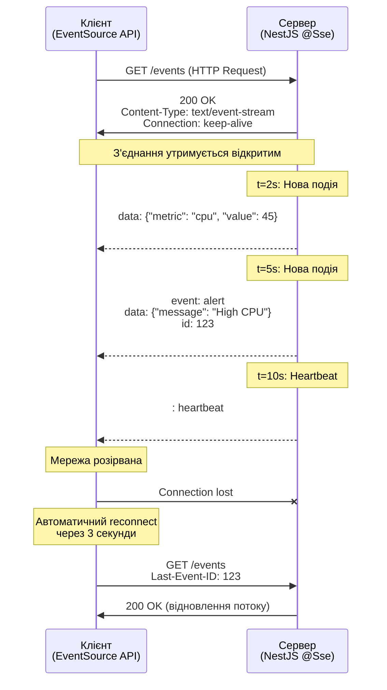

# Server-Sent Events (SSE)

## Короткий зміст

У цій лекції вивчається альтернативний метод real-time комунікації через Server-Sent Events:

- **Концепція SSE** — односторонній канал комунікації server → client через HTTP, сервер може push подій у будь-який момент, клієнт автоматично reconnect при обриві з'єднання
- **Декоратор @Sse()** — створення SSE endpoint у NestJS, повернення Observable для потокової відправки даних, Content-Type: text/event-stream
- **Observable** — використання RxJS Observable для генерації потоку подій, `interval()`, `map()`, `filter()` для трансформації даних, `Subject` для ручного контролю
- **Формат SSE повідомлень** — структура: `data:`, `event:`, `id:`, `retry:`, перевід рядка як delimiter, можливість відправки JSON у data field
- **Порівняння SSE vs WebSocket** — SSE: простіша реалізація, автоматичний reconnect, лише server → client; WebSocket: bi-directional, lower latency, більше можливостей
- **Коли використовувати SSE** — live updates для dashboards, news feeds, stock prices, notifications, моніторинг прогресу задач, будь-які сценарії де потрібен лише push від сервера
- **Підтримка браузерами** — широка підтримка через EventSource API, fallback для старих браузерів через polyfills
- **Інтеграція з frontend** — JavaScript EventSource API, підписка на події, обробка reconnect, closing з'єднання

Розглядаються практичні приклади: live dashboard з метриками, прогрес-бар для завантаження файлів, streaming logs, real-time notifications без WebSocket.

---

::card-group

::card{title="🎯 Мета лекції" icon="i-lucide-target"}

- Опанувати концепцію Server-Sent Events як альтернативу WebSocket для однонаправленої комунікації server → client.
- Навчитися створювати SSE endpoints у NestJS через декоратор `@Sse()` з поверненням RxJS Observable.
- Використовувати RxJS оператори (`interval`, `map`, `filter`, `Subject`) для генерації та трансформації потоків подій.
- Зрозуміти формат SSE протоколу: поля `data`, `event`, `id`, `retry` та роль переносів рядків як delimiters.
- Інтегрувати EventSource API на клієнті для підписки на SSE потік з автоматичним reconnect.
- Порівняти SSE з WebSocket за критеріями складності, latency, bi-directional communication та обрати правильний інструмент.
- Реалізувати практичні сценарії: live dashboard, progress tracking, streaming logs, real-time notifications.

::

::card{title="🔑 Ключові терміни" icon="i-lucide-key"}

- **Server-Sent Events (SSE):** стандарт HTML5 для однонаправленого потокового передавання подій від сервера до клієнта через HTTP.
- **EventSource API:** нативний браузерний API для підключення до SSE endpoint та обробки потоку подій.
- **Observable (RxJS):** асинхронний потік даних, що дозволяє емітувати кілька значень у часі.
- **text/event-stream:** MIME-тип для SSE, вказує браузеру, що відповідь є потоком подій, а не одноразовим документом.
- **Heartbeat (Keep-Alive):** періодичні порожні події або коментарі для утримання HTTP з'єднання активним.
- **Last-Event-ID:** механізм для відновлення пропущених подій після reconnect, браузер автоматично передає ID останньої отриманої події.

::

::

---

## Контекст: Коли WebSocket надмірний

У попередніх лекціях ми детально вивчили WebSocket як універсальне рішення для real-time комунікації з повнодуплексним зв'язком. Проте **не всі задачі потребують двостороннього зв'язку**. Розглянемо типові сценарії:

**Сценарій 1: Live Dashboard з метриками**

Ви створюєте адміністративну панель, що відображає real-time метрики сервера: CPU usage, memory, active connections. Сервер кожні 5 секунд генерує нові дані та відправляє їх всім підключеним адміністраторам. Клієнт **ніколи не відправляє** дані назад — лише отримує оновлення.

**Сценарій 2: Progress Bar для завантаження файлу**

Користувач завантажує великий файл на сервер. Backend обробляє файл порціями та відправляє прогрес (0%, 25%, 50%, 100%) клієнту для відображення progress bar. Клієнт лише **пасивно отримує** оновлення прогресу.

**Сценарій 3: Streaming Logs**

DevOps інженер переглядає логи застосунку у real-time через веб-інтерфейс. Сервер безперервно відправляє нові рядки логів у міру їх появи. Клієнт **не відправляє** дані назад (окрім початкового запиту на підключення).

**Що спільного у цих сценаріях?**

- Комунікація **однонаправлена:** server → client.
- Клієнт **не відправляє** повідомлення після встановлення з'єднання.
- Потрібен **автоматичний reconnect** при втраті мережі.
- Простота важливіша за мінімальну latency.

Для таких сценаріїв **WebSocket надмірний** — ми отримуємо складність двостороннього протоколу, rooms, namespaces, але використовуємо лише половину можливостей (server → client). Тут ідеально підходить **Server-Sent Events (SSE)**.

::note
SSE — це **не конкурент** WebSocket, а **комплементарне рішення** для конкретних задач. Якщо потрібен двосторонній зв'язок (чати, multiplayer ігри) — WebSocket. Якщо лише server → client (dashboards, notifications, streaming) — SSE.
::

---

## Концепція Server-Sent Events

**Server-Sent Events (SSE)** — це стандарт HTML5, що дозволяє серверу відправляти події клієнту через звичайне HTTP з'єднання, яке **залишається відкритим** протягом усього часу роботи. На відміну від long-polling, де після кожної події з'єднання закривається, SSE підтримує **одне постійне з'єднання** для передачі необмеженої кількості подій.

### Принцип роботи SSE

::mermaid



::

**Ключові відмінності від HTTP та WebSocket:**

| Аспект | HTTP (одноразовий) | SSE | WebSocket |
|--------|-------------------|-----|-----------|
| **З'єднання** | Відкривається → відповідь → закривається | Відкривається → залишається відкритим | Відкривається → залишається відкритим |
| **Протокол** | HTTP/1.1 або HTTP/2 | HTTP/1.1 або HTTP/2 | ws:// (окремий протокол) |
| **Напрямок комунікації** | Client → Server | Server → Client | Client ↔ Server |
| **Формат даних** | Будь-який (JSON, HTML, binary) | text/event-stream (текстовий) | Text або Binary |
| **Автоматичний reconnect** | ❌ | ✅ (браузер автоматично) | ❌ (потрібна бібліотека) |
| **Підтримка браузерами** | Всі | IE11+ (polyfill для IE10-) | IE10+ |

### Формат SSE протоколу

SSE використовує текстовий формат з кількома спеціальними полями, розділеними переносами рядків:

```
event: messageCreated
id: 42
data: {"userId": 10, "text": "Привіт, SSE!"}
retry: 5000

event: userJoined
id: 43
data: {"userId": 15, "username": "Andriy"}

: це коментар (heartbeat)

data: {"metric": "cpu", "value": 45}

```

**Структура SSE події:**

| Поле | Обов'язкове | Опис |
|------|-------------|------|
| `data` | ✅ | Корисне навантаження події (може бути JSON, text, кілька рядків) |
| `event` | ❌ | Назва типу події (за замовчуванням `message`) |
| `id` | ❌ | Унікальний ідентифікатор події для механізму Last-Event-ID |
| `retry` | ❌ | Час у мілісекундах для reconnect після розриву з'єднання |
| `:` (коментар) | ❌ | Рядки, що починаються з `:`, ігноруються браузером (для heartbeat) |

**Правила форматування:**

1. Кожна подія **закінчується подвійним переносом рядка** (`\n\n`).
2. Поле `data` може бути багаторядковим:
   ```
   data: {"name": "Alice",
   data: "age": 30}
   
   ```
   Браузер автоматично склеює рядки.
3. Коментарі (рядки, що починаються з `:`) використовуються для heartbeat, щоб утримати з'єднання активним.

::tip
**Heartbeat важливий:** деякі проксі-сервери та firewall автоматично закривають неактивні HTTP з'єднання через 30-60 секунд. Відправляйте коментар `: heartbeat\n\n` кожні 15-30 секунд для запобігання цьому.
::

---

## Створення SSE Endpoint у NestJS

NestJS надає вбудовану підтримку SSE через декоратор `@Sse()` та RxJS Observables.

### Мінімальний приклад SSE Controller

```typescript
// src/events/events.controller.ts
import { Controller, Sse } from '@nestjs/common';
import { Observable, interval, map } from 'rxjs';

interface MessageEvent {
  data: string | object;
  id?: string;
  type?: string;
  retry?: number;
}

@Controller('events')
export class EventsController {
  /**
   * SSE endpoint: відправляє поточний час кожні 2 секунди
   */
  @Sse('stream')
  streamEvents(): Observable<MessageEvent> {
    return interval(2000).pipe(
      map((index) => ({
        data: {
          message: 'Поточний час',
          timestamp: new Date().toISOString(),
          index,
        },
        id: index.toString(),
      })),
    );
  }
}
```

**Пояснення:**

1. **@Sse('stream'):** декоратор, що позначає метод як SSE endpoint. Клієнт підключається через `GET /events/stream`.

2. **Повернення Observable:** метод **має повертати** RxJS `Observable<MessageEvent>`. NestJS автоматично:
   - Встановлює заголовок `Content-Type: text/event-stream`
   - Встановлює `Cache-Control: no-cache`
   - Підписується на Observable та відправляє кожне емітоване значення як SSE подію

3. **interval(2000):** RxJS оператор, що емітує значення кожні 2000 мс (0, 1, 2, 3, ...).

4. **map():** трансформує числа у об'єкти `MessageEvent` з полями `data` та `id`.

### Клієнтська частина: EventSource API

Браузери надають нативний API `EventSource` для підключення до SSE endpoints.

```typescript
// client/sse-client.ts
class SSEClient {
  private eventSource: EventSource | null = null;

  constructor(private url: string) {}

  /**
   * Підключитися до SSE потоку
   */
  connect() {
    this.eventSource = new EventSource(this.url);

    // Обробник успішного підключення
    this.eventSource.addEventListener('open', () => {
      console.log('[SSE] З\'єднання встановлено');
    });

    // Обробник для події типу 'message' (за замовчуванням)
    this.eventSource.addEventListener('message', (event: MessageEvent) => {
      const data = JSON.parse(event.data);
      console.log('[SSE] Отримано подію:', data);
      console.log('[SSE] Event ID:', event.lastEventId);
      
      // Відобразити дані у UI
      this.displayData(data);
    });

    // Обробник помилок та розривів з'єднання
    this.eventSource.addEventListener('error', (error) => {
      console.error('[SSE] Помилка з\'єднання:', error);

      if (this.eventSource?.readyState === EventSource.CLOSED) {
        console.log('[SSE] З\'єднання закрито сервером');
      } else if (this.eventSource?.readyState === EventSource.CONNECTING) {
        console.log('[SSE] Спроба автоматичного reconnect...');
      }
    });
  }

  /**
   * Закрити SSE з'єднання
   */
  disconnect() {
    if (this.eventSource) {
      this.eventSource.close();
      this.eventSource = null;
      console.log('[SSE] З\'єднання закрито клієнтом');
    }
  }

  private displayData(data: any) {
    const container = document.getElementById('sse-data');
    if (container) {
      const item = document.createElement('div');
      item.textContent = `${data.message}: ${data.timestamp}`;
      container.appendChild(item);
    }
  }
}

// Використання
const client = new SSEClient('http://localhost:3001/events/stream');
client.connect();

// Закрити при виході зі сторінки
window.addEventListener('beforeunload', () => {
  client.disconnect();
});
```

**Ключові методи EventSource API:**

| Метод/Властивість | Опис |
|-------------------|------|
| `new EventSource(url)` | Створює з'єднання до SSE endpoint |
| `addEventListener(type, handler)` | Підписується на події певного типу |
| `close()` | Закриває з'єднання (не reconnect) |
| `readyState` | Стан з'єднання: `CONNECTING` (0), `OPEN` (1), `CLOSED` (2) |
| `url` | URL endpoint, до якого підключений клієнт |
| `withCredentials` | Чи відправляти cookies (за замовчуванням `false`) |

::warning
**Обмеження EventSource:** API **не підтримує** передачу кастомних HTTP заголовків (наприклад, `Authorization`). Для автентифікації використовуйте:
1. **Query parameters:** `new EventSource('/events?token=...')` (небезпечно — токен у URL)
2. **Cookies:** встановити HttpOnly cookie через звичайний HTTP запит, EventSource автоматично відправить cookie
3. **Polyfill з підтримкою headers:** використати сторонню бібліотеку замість нативного EventSource
::


---

## RxJS Patterns для SSE

RxJS надає потужні оператори для створення складних потоків подій. Розглянемо типові патерни для SSE.

### Pattern 1: Interval — Періодичне генерування подій

Найпростіший патерн — відправляти події через фіксовані інтервали часу.

```typescript
// src/monitoring/monitoring.controller.ts
import { Controller, Sse } from '@nestjs/common';
import { Observable, interval, map } from 'rxjs';
import { MonitoringService } from './monitoring.service';

@Controller('monitoring')
export class MonitoringController {
  constructor(private readonly monitoringService: MonitoringService) {}

  /**
   * Відправка метрик системи кожні 5 секунд
   */
  @Sse('metrics')
  streamMetrics(): Observable<MessageEvent> {
    return interval(5000).pipe(
      map(async () => {
        // Отримати поточні метрики з сервісу
        const metrics = await this.monitoringService.getCurrentMetrics();

        return {
          data: {
            cpu: metrics.cpuUsage,
            memory: metrics.memoryUsage,
            activeConnections: metrics.activeConnections,
            requestsPerSecond: metrics.rps,
          },
          id: Date.now().toString(),
        };
      }),
    );
  }
}
```

**Використання на клієнті:**

```typescript
const eventSource = new EventSource('http://localhost:3001/monitoring/metrics');

eventSource.addEventListener('message', (event) => {
  const metrics = JSON.parse(event.data);

  // Оновити графік у dashboard
  updateChart('cpu', metrics.cpu);
  updateChart('memory', metrics.memory);
  
  // Оновити лічильники
  document.getElementById('active-connections')!.textContent = metrics.activeConnections;
  document.getElementById('rps')!.textContent = metrics.requestsPerSecond;
});
```

### Pattern 2: Subject — Ручне керування потоком

Для складніших сценаріїв, де події генеруються не періодично, а у відповідь на зовнішні дії (наприклад, нове повідомлення у чаті), використовуйте `Subject`.

```typescript
// src/notifications/notifications.controller.ts
import { Controller, Sse } from '@nestjs/common';
import { Observable, Subject } from 'rxjs';
import { OnEvent } from '@nestjs/event-emitter';

interface NotificationEvent {
  type: string;
  title: string;
  message: string;
  userId: number;
  timestamp: Date;
}

@Controller('notifications')
export class NotificationsController {
  // Subject для ручного емітування подій
  private notificationsSubject = new Subject<MessageEvent>();

  /**
   * SSE endpoint для нотифікацій
   */
  @Sse('stream')
  streamNotifications(): Observable<MessageEvent> {
    return this.notificationsSubject.asObservable();
  }

  /**
   * Обробник події з іншого модуля (наприклад, новий коментар створено)
   */
  @OnEvent('comment.created')
  handleCommentCreated(payload: { postId: string; authorId: number; text: string }) {
    // Знайти власника поста
    const postOwnerId = this.getPostOwnerId(payload.postId);

    if (postOwnerId !== payload.authorId) {
      // Емітувати SSE подію для власника поста
      this.notificationsSubject.next({
        data: {
          type: 'COMMENT',
          title: 'Новий коментар',
          message: `Користувач залишив коментар під вашим постом`,
          postId: payload.postId,
        },
        id: Date.now().toString(),
        type: 'notification', // Тип SSE події
      });
    }
  }

  /**
   * Обробник події про новий лайк
   */
  @OnEvent('post.liked')
  handlePostLiked(payload: { postId: string; userId: number }) {
    const postOwnerId = this.getPostOwnerId(payload.postId);

    if (postOwnerId !== payload.userId) {
      this.notificationsSubject.next({
        data: {
          type: 'LIKE',
          title: 'Новий лайк',
          message: `Ваш пост сподобався користувачу`,
          postId: payload.postId,
        },
        id: Date.now().toString(),
        type: 'notification',
      });
    }
  }

  private getPostOwnerId(postId: string): number {
    // Запит до БД або кешу
    return 123;
  }
}
```

**Клієнтська частина з обробкою різних типів подій:**

```typescript
const eventSource = new EventSource('http://localhost:3001/notifications/stream');

// Обробник для події типу 'notification'
eventSource.addEventListener('notification', (event) => {
  const notification = JSON.parse(event.data);

  // Показати браузерне повідомлення
  if ('Notification' in window && Notification.permission === 'granted') {
    new Notification(notification.title, {
      body: notification.message,
      icon: '/notification-icon.png',
      tag: notification.type, // Унікальний тег для групування
    });
  }

  // Додати до списку нотифікацій у UI
  addNotificationToList(notification);

  // Оновити badge з кількістю непрочитаних
  incrementUnreadCount();
});
```

### Pattern 3: merge — Об'єднання кількох потоків

Коли потрібно емітувати події з кількох джерел у один SSE потік.

```typescript
// src/events/events.controller.ts
import { Controller, Sse } from '@nestjs/common';
import { Observable, interval, merge, map } from 'rxjs';

@Controller('events')
export class EventsController {
  private notificationsSubject = new Subject<MessageEvent>();
  private alertsSubject = new Subject<MessageEvent>();

  /**
   * Об'єднаний потік: heartbeat + notifications + alerts
   */
  @Sse('combined')
  streamCombined(): Observable<MessageEvent> {
    // Heartbeat кожні 30 секунд
    const heartbeat$ = interval(30000).pipe(
      map(() => ({
        type: 'heartbeat',
        data: { timestamp: new Date().toISOString() },
      })),
    );

    // Notifications (ручні події)
    const notifications$ = this.notificationsSubject.asObservable();

    // Alerts (ручні події)
    const alerts$ = this.alertsSubject.asObservable();

    // Об'єднати всі потоки
    return merge(heartbeat$, notifications$, alerts$);
  }

  /**
   * Методи для емітування подій з інших сервісів
   */
  emitNotification(data: any) {
    this.notificationsSubject.next({
      type: 'notification',
      data,
      id: Date.now().toString(),
    });
  }

  emitAlert(data: any) {
    this.alertsSubject.next({
      type: 'alert',
      data,
      id: Date.now().toString(),
    });
  }
}
```

### Pattern 4: filter — Фільтрація подій на стороні сервера

Якщо потрібно відправляти події лише певним клієнтам (наприклад, за userId).

```typescript
// src/events/events.controller.ts
import { Controller, Sse, Query } from '@nestjs/common';
import { Observable, filter } from 'rxjs';

@Controller('events')
export class EventsController {
  private eventsSubject = new Subject<MessageEvent & { userId?: number }>();

  /**
   * SSE endpoint з фільтрацією за userId
   */
  @Sse('user-events')
  streamUserEvents(@Query('userId') userId: string): Observable<MessageEvent> {
    const userIdNum = parseInt(userId, 10);

    return this.eventsSubject.asObservable().pipe(
      // Фільтрувати: пропускати лише події для цього userId або глобальні події
      filter((event) => !event.userId || event.userId === userIdNum),
      // Видалити службове поле userId перед відправкою клієнту
      map(({ userId, ...rest }) => rest),
    );
  }

  /**
   * Емітувати подію для конкретного користувача
   */
  emitToUser(userId: number, data: any) {
    this.eventsSubject.next({
      userId, // Службове поле для фільтрації
      type: 'user-event',
      data,
      id: Date.now().toString(),
    });
  }

  /**
   * Емітувати глобальну подію (всім)
   */
  emitGlobal(data: any) {
    this.eventsSubject.next({
      type: 'global-event',
      data,
      id: Date.now().toString(),
    });
  }
}
```

**Клієнт підключається з userId:**

```typescript
const userId = getCurrentUserId();
const eventSource = new EventSource(`http://localhost:3001/events/user-events?userId=${userId}`);

eventSource.addEventListener('user-event', (event) => {
  console.log('Подія для мене:', JSON.parse(event.data));
});

eventSource.addEventListener('global-event', (event) => {
  console.log('Глобальна подія:', JSON.parse(event.data));
});
```

::note
**Фільтрація vs множинні endpoints:** для складних систем з багатьма типами подій краще створити окремі SSE endpoints (`/events/notifications`, `/events/alerts`) замість фільтрації у одному потоці. Це зменшує навантаження на сервер (не потрібно обробляти фільтр для кожної події).
::

---

## Практичний приклад 1: Live Dashboard з метриками

Створимо повноцінний dashboard для моніторингу серверних метрик у real-time.

### Серверна частина

::code-tree

```typescript [src/monitoring/monitoring.service.ts]
import { Injectable } from '@nestjs/common';
import * as os from 'os';

interface SystemMetrics {
  timestamp: Date;
  cpu: {
    usage: number; // 0-100%
    loadAverage: number[];
  };
  memory: {
    total: number; // bytes
    used: number; // bytes
    free: number; // bytes
    usagePercent: number; // 0-100%
  };
  uptime: number; // seconds
  platform: string;
}

@Injectable()
export class MonitoringService {
  /**
   * Отримати поточні метрики системи
   */
  async getCurrentMetrics(): Promise<SystemMetrics> {
    const cpus = os.cpus();
    
    // Розрахувати середнє CPU usage
    let totalIdle = 0;
    let totalTick = 0;

    cpus.forEach((cpu) => {
      for (const type in cpu.times) {
        totalTick += cpu.times[type];
      }
      totalIdle += cpu.times.idle;
    });

    const idle = totalIdle / cpus.length;
    const total = totalTick / cpus.length;
    const cpuUsage = 100 - (100 * idle) / total;

    // Memory metrics
    const totalMemory = os.totalmem();
    const freeMemory = os.freemem();
    const usedMemory = totalMemory - freeMemory;
    const memoryUsagePercent = (usedMemory / totalMemory) * 100;

    return {
      timestamp: new Date(),
      cpu: {
        usage: Math.round(cpuUsage * 100) / 100,
        loadAverage: os.loadavg(),
      },
      memory: {
        total: totalMemory,
        used: usedMemory,
        free: freeMemory,
        usagePercent: Math.round(memoryUsagePercent * 100) / 100,
      },
      uptime: os.uptime(),
      platform: os.platform(),
    };
  }
}
```

```typescript [src/monitoring/monitoring.controller.ts]
import { Controller, Sse } from '@nestjs/common';
import { Observable, interval, map, merge } from 'rxjs';
import { MonitoringService } from './monitoring.service';

@Controller('monitoring')
export class MonitoringController {
  constructor(private readonly monitoringService: MonitoringService) {}

  /**
   * SSE endpoint для метрик (оновлення кожні 3 секунди)
   */
  @Sse('metrics')
  streamMetrics(): Observable<MessageEvent> {
    // Heartbeat кожні 15 секунд
    const heartbeat$ = interval(15000).pipe(
      map(() => ({
        type: 'heartbeat',
        data: { message: 'alive' },
      })),
    );

    // Метрики кожні 3 секунди
    const metrics$ = interval(3000).pipe(
      map(async (index) => {
        const metrics = await this.monitoringService.getCurrentMetrics();

        return {
          type: 'metrics',
          data: metrics,
          id: index.toString(),
        };
      }),
    );

    return merge(heartbeat$, metrics$);
  }
}
```

::

### Клієнтська частина (React + Chart.js)

```typescript
// client/components/LiveDashboard.tsx
import React, { useEffect, useState } from 'react';
import { Line } from 'react-chartjs-2';

interface Metrics {
  timestamp: string;
  cpu: { usage: number };
  memory: { usagePercent: number };
}

export const LiveDashboard: React.FC = () => {
  const [metrics, setMetrics] = useState<Metrics[]>([]);
  const [isConnected, setIsConnected] = useState(false);

  useEffect(() => {
    const eventSource = new EventSource('http://localhost:3001/monitoring/metrics');

    eventSource.addEventListener('open', () => {
      console.log('[Dashboard] З\'єднання встановлено');
      setIsConnected(true);
    });

    eventSource.addEventListener('metrics', (event) => {
      const data: Metrics = JSON.parse(event.data);

      setMetrics((prev) => {
        const updated = [...prev, data];
        // Зберігати останні 20 точок для графіка
        return updated.slice(-20);
      });
    });

    eventSource.addEventListener('error', () => {
      console.error('[Dashboard] Помилка з\'єднання');
      setIsConnected(false);
    });

    return () => {
      eventSource.close();
    };
  }, []);

  const chartData = {
    labels: metrics.map((m) => new Date(m.timestamp).toLocaleTimeString()),
    datasets: [
      {
        label: 'CPU Usage (%)',
        data: metrics.map((m) => m.cpu.usage),
        borderColor: 'rgb(75, 192, 192)',
        tension: 0.1,
      },
      {
        label: 'Memory Usage (%)',
        data: metrics.map((m) => m.memory.usagePercent),
        borderColor: 'rgb(255, 99, 132)',
        tension: 0.1,
      },
    ],
  };

  return (
    <div className="dashboard">
      <div className="status">
        {isConnected ? (
          <span className="badge badge-success">🟢 Connected</span>
        ) : (
          <span className="badge badge-error">🔴 Disconnected</span>
        )}
      </div>

      <div className="chart-container">
        <Line data={chartData} options={{ animation: false }} />
      </div>

      {metrics.length > 0 && (
        <div className="current-metrics">
          <div className="metric-card">
            <h3>CPU</h3>
            <p className="metric-value">{metrics[metrics.length - 1].cpu.usage.toFixed(2)}%</p>
          </div>
          <div className="metric-card">
            <h3>Memory</h3>
            <p className="metric-value">
              {metrics[metrics.length - 1].memory.usagePercent.toFixed(2)}%
            </p>
          </div>
        </div>
      )}
    </div>
  );
};
```

---

## Практичний приклад 2: Progress Tracking для завантаження файлів

Реалізуємо систему відстеження прогресу завантаження великих файлів з real-time оновленням progress bar.

### Серверна частина

```typescript
// src/uploads/uploads.controller.ts
import {
  Controller,
  Post,
  UploadedFile,
  UseInterceptors,
  Sse,
  Query,
} from '@nestjs/common';
import { FileInterceptor } from '@nestjs/platform-express';
import { Observable, Subject } from 'rxjs';
import { filter, map } from 'rxjs/operators';

interface ProgressEvent {
  uploadId: string;
  progress: number; // 0-100
  bytesUploaded: number;
  totalBytes: number;
  status: 'processing' | 'completed' | 'error';
  message?: string;
}

@Controller('uploads')
export class UploadsController {
  // Subject для емітування прогресу
  private progressSubject = new Subject<ProgressEvent>();

  /**
   * SSE endpoint для відстеження прогресу конкретного завантаження
   */
  @Sse('progress')
  streamProgress(@Query('uploadId') uploadId: string): Observable<MessageEvent> {
    return this.progressSubject.asObservable().pipe(
      // Фільтрувати лише події для цього uploadId
      filter((event) => event.uploadId === uploadId),
      map((event) => ({
        data: event,
        id: Date.now().toString(),
      })),
    );
  }

  /**
   * Завантаження файлу з емітуванням прогресу
   */
  @Post('upload')
  @UseInterceptors(FileInterceptor('file'))
  async uploadFile(@UploadedFile() file: Express.Multer.File) {
    const uploadId = this.generateUploadId();

    // Емітувати початковий статус
    this.emitProgress(uploadId, {
      progress: 0,
      bytesUploaded: 0,
      totalBytes: file.size,
      status: 'processing',
      message: 'Початок обробки файлу',
    });

    // Симуляція обробки файлу порціями (у реальності — обробка через stream)
    const chunkSize = Math.floor(file.size / 10); // 10 частин
    let bytesProcessed = 0;

    for (let i = 1; i <= 10; i++) {
      await this.sleep(500); // Імітація обробки

      bytesProcessed += chunkSize;
      const progress = Math.min(Math.round((bytesProcessed / file.size) * 100), 100);

      this.emitProgress(uploadId, {
        progress,
        bytesUploaded: bytesProcessed,
        totalBytes: file.size,
        status: 'processing',
        message: `Обробка частини ${i}/10`,
      });
    }

    // Завершення
    this.emitProgress(uploadId, {
      progress: 100,
      bytesUploaded: file.size,
      totalBytes: file.size,
      status: 'completed',
      message: 'Файл успішно завантажено',
    });

    return {
      success: true,
      uploadId,
      filename: file.originalname,
      size: file.size,
    };
  }

  private emitProgress(uploadId: string, data: Omit<ProgressEvent, 'uploadId'>) {
    this.progressSubject.next({
      uploadId,
      ...data,
    });
  }

  private generateUploadId(): string {
    return `upload-${Date.now()}-${Math.random().toString(36).substr(2, 9)}`;
  }

  private sleep(ms: number): Promise<void> {
    return new Promise((resolve) => setTimeout(resolve, ms));
  }
}
```

### Клієнтська частина

```typescript
// client/components/FileUpload.tsx
import React, { useState } from 'react';

export const FileUpload: React.FC = () => {
  const [file, setFile] = useState<File | null>(null);
  const [uploading, setUploading] = useState(false);
  const [progress, setProgress] = useState(0);
  const [message, setMessage] = useState('');

  const handleFileSelect = (e: React.ChangeEvent<HTMLInputElement>) => {
    if (e.target.files && e.target.files[0]) {
      setFile(e.target.files[0]);
    }
  };

  const handleUpload = async () => {
    if (!file) return;

    setUploading(true);
    setProgress(0);
    setMessage('Підготовка...');

    // Відправити файл
    const formData = new FormData();
    formData.append('file', file);

    try {
      const response = await fetch('http://localhost:3001/uploads/upload', {
        method: 'POST',
        body: formData,
      });

      const result = await response.json();
      const { uploadId } = result;

      // Підключитися до SSE для відстеження прогресу
      const eventSource = new EventSource(
        `http://localhost:3001/uploads/progress?uploadId=${uploadId}`
      );

      eventSource.addEventListener('message', (event) => {
        const data = JSON.parse(event.data);

        setProgress(data.progress);
        setMessage(data.message);

        if (data.status === 'completed') {
          eventSource.close();
          setUploading(false);
          alert('Файл успішно завантажено!');
        } else if (data.status === 'error') {
          eventSource.close();
          setUploading(false);
          alert(`Помилка: ${data.message}`);
        }
      });

      eventSource.addEventListener('error', () => {
        eventSource.close();
        setUploading(false);
        alert('Помилка з\'єднання');
      });
    } catch (error) {
      console.error('Помилка завантаження:', error);
      setUploading(false);
    }
  };

  return (
    <div className="file-upload">
      <input type="file" onChange={handleFileSelect} disabled={uploading} />

      <button onClick={handleUpload} disabled={!file || uploading}>
        {uploading ? 'Завантаження...' : 'Завантажити'}
      </button>

      {uploading && (
        <div className="progress-container">
          <div className="progress-bar" style={{ width: `${progress}%` }}>
            {progress}%
          </div>
          <p className="progress-message">{message}</p>
        </div>
      )}
    </div>
  );
};
```


---

## Автентифікація SSE з'єднань

Оскільки EventSource API не підтримує кастомні заголовки, автентифікація SSE потребує альтернативних підходів.

### Підхід 1: Cookie-based Authentication (рекомендовано)

Використовуйте HttpOnly cookies для передачі JWT токена. EventSource автоматично відправляє cookies при підключенні.

**Серверна частина:**

```typescript
// src/auth/auth.controller.ts
import { Controller, Post, Res, Body } from '@nestjs/common';
import { Response } from 'express';
import { AuthService } from './auth.service';

@Controller('auth')
export class AuthController {
  constructor(private authService: AuthService) {}

  @Post('login')
  async login(
    @Body() credentials: { email: string; password: string },
    @Res({ passthrough: true }) response: Response,
  ) {
    const user = await this.authService.validateUser(credentials.email, credentials.password);

    if (!user) {
      throw new UnauthorizedException('Invalid credentials');
    }

    const token = this.authService.generateToken(user);

    // Встановити HttpOnly cookie
    response.cookie('auth_token', token, {
      httpOnly: true, // Не доступний через JavaScript
      secure: process.env.NODE_ENV === 'production', // Лише HTTPS у production
      sameSite: 'strict',
      maxAge: 7 * 24 * 60 * 60 * 1000, // 7 днів
    });

    return { success: true, user: { id: user.id, email: user.email } };
  }
}
```

**SSE endpoint з валідацією cookie:**

```typescript
// src/events/events.controller.ts
import { Controller, Sse, Req, UnauthorizedException } from '@nestjs/common';
import { Request } from 'express';
import { Observable } from 'rxjs';
import { JwtService } from '@nestjs/jwt';

@Controller('events')
export class EventsController {
  constructor(private jwtService: JwtService) {}

  @Sse('stream')
  streamEvents(@Req() request: Request): Observable<MessageEvent> {
    // Витягти токен з cookie
    const token = request.cookies['auth_token'];

    if (!token) {
      throw new UnauthorizedException('No authentication token');
    }

    try {
      // Валідувати токен
      const payload = this.jwtService.verify(token, {
        secret: process.env.JWT_SECRET,
      });

      const userId = payload.sub;

      // Повернути потік подій для цього користувача
      return this.getEventsStreamForUser(userId);
    } catch (error) {
      throw new UnauthorizedException('Invalid token');
    }
  }

  private getEventsStreamForUser(userId: number): Observable<MessageEvent> {
    // Фільтрований потік подій для користувача
    return this.eventsSubject.asObservable().pipe(
      filter((event) => event.userId === userId),
      map((event) => ({
        data: event.data,
        id: event.id,
      })),
    );
  }
}
```

**Клієнт з credentials:**

```typescript
// EventSource автоматично відправляє cookies, якщо вказати withCredentials
const eventSource = new EventSource('http://localhost:3001/events/stream', {
  withCredentials: true, // Відправляти cookies cross-origin
});

eventSource.addEventListener('message', (event) => {
  console.log('Подія:', JSON.parse(event.data));
});
```

::note
Опція `withCredentials: true` потрібна **лише для cross-origin** запитів (коли frontend на іншому домені). Якщо frontend та backend на одному домені (наприклад, обидва на `example.com`), cookies відправляються автоматично без цієї опції.
::

### Підхід 2: Query Parameter Token (менш безпечний)

Передавати JWT токен через query parameter. **Небезпечно для production** через потрапляння токена у server logs.

```typescript
@Sse('stream')
streamEvents(@Query('token') token: string): Observable<MessageEvent> {
  if (!token) {
    throw new UnauthorizedException('No token provided');
  }

  try {
    const payload = this.jwtService.verify(token);
    const userId = payload.sub;

    return this.getEventsStreamForUser(userId);
  } catch (error) {
    throw new UnauthorizedException('Invalid token');
  }
}
```

**Клієнт:**

```typescript
const token = localStorage.getItem('accessToken');
const eventSource = new EventSource(`http://localhost:3001/events/stream?token=${token}`);
```

::warning
**Безпека токенів у URL:** токени у query parameters **видимі у:**
- Server access logs
- Proxy logs
- Browser history
- Referrer headers (якщо клієнт переходить на інший сайт)

Використовуйте цей підхід **лише для development** або публічних даних. Для production використовуйте cookie-based authentication.
::

---

## SSE vs WebSocket: Порівняння та вибір

Підсумуємо відмінності між SSE та WebSocket для обґрунтованого вибору технології.

### Технічне порівняння

| Критерій | Server-Sent Events | WebSocket |
|----------|-------------------|-----------|
| **Протокол** | HTTP/1.1 або HTTP/2 | ws:// (окремий протокол поверх TCP) |
| **Напрямок комунікації** | Односторонній (server → client) | Двосторонній (client ↔ server) |
| **Формат даних** | Текстовий (UTF-8) | Текстовий або Бінарний |
| **Автоматичний reconnect** | ✅ Вбудований у браузер | ❌ Потрібна бібліотека (Socket.IO) |
| **Last-Event-ID** | ✅ Автоматично для відновлення подій | ❌ Потрібна власна реалізація |
| **HTTP/2 multiplexing** | ✅ Підтримується | ❌ Окремий протокол |
| **Складність реалізації** | Проста (Observable + @Sse) | Середня (Gateway, rooms, lifecycle) |
| **Latency** | Середня (~50-200 мс) | Низька (~10-50 мс) |
| **Overhead на з'єднання** | Середній (HTTP headers) | Мінімальний (binary frames) |
| **Підтримка браузерами** | IE11+ (polyfill для IE10-) | IE10+ |
| **Firewall-friendly** | ✅ Працює через порт 80/443 | ⚠️ Може блокуватися |
| **CORS** | ✅ Стандартна CORS політика | ✅ Origin validation при handshake |

### Матриця вибору технології

::tabs

::tabs-item{label="За напрямком комунікації"}

**Лише Server → Client:**
- ✅ **SSE** — ідеальний вибір, простіша реалізація.
- ⚠️ **WebSocket** — надмірно складно, якщо client ніколи не відправляє дані.

**Client ↔ Server (двосторонній):**
- ❌ **SSE** — не підтримує відправку від client (потрібні окремі HTTP запити).
- ✅ **WebSocket** — єдиний вибір для повного duplex.

**Гібридний підхід (SSE + HTTP):**
- ✅ **SSE для push** + **HTTP POST для client → server** — працює, але складніше за WebSocket.

::

::tabs-item{label="За типом застосунку"}

**Dashboards та моніторинг:**
- ✅ **SSE** — metrics, logs, system status.
- Приклади: Grafana live queries, server monitoring, real-time analytics.

**Нотифікації:**
- ✅ **SSE** — in-app notifications, alerts, announcements.
- Переваги: автоматичний reconnect, не потрібен двосторонній зв'язок.

**Чати та месенджери:**
- ✅ **WebSocket** — миттєва доставка, typing indicators, read receipts.
- SSE не підходить (client часто відправляє повідомлення).

**Collaborative editing:**
- ✅ **WebSocket** — Google Docs стиль, operational transforms.
- SSE не підходить (client постійно відправляє зміни).

**Live feeds (новини, Twitter):**
- ✅ **SSE** — нові пости з'являються автоматично без refresh.
- WebSocket надмірний (користувач рідко публікує пости).

**Multiplayer ігри:**
- ✅ **WebSocket** — критична latency < 50 мс, постійний обмін даними.
- SSE не підходить (client відправляє input кожен frame).

::

::tabs-item{label="За складністю"}

**MVP / Proof of Concept:**
- ✅ **SSE** — 10 рядків коду, Observable + @Sse, готово.
- ⚠️ **WebSocket** — потрібна бібліотека (Socket.IO), lifecycle hooks, rooms.

**Production з масштабуванням:**
- ⚠️ **SSE** — для scaling потрібен Redis Pub/Sub (як і WebSocket).
- ⚠️ **WebSocket** — Redis Adapter для синхронізації між серверами.
- **Однакова складність масштабування.**

**Старі браузери (IE10, IE11):**
- ✅ **SSE** — polyfill доступний, fallback простіший.
- ⚠️ **WebSocket** — Socket.IO автоматично fallback на long-polling.

::

::

### Коли використовувати SSE

::card-group

::card{title="✅ Ідеальні сценарії для SSE" icon="i-lucide-check-circle"}

- **Live dashboards:** метрики, графіки, статистика у реальному часі.
- **News feeds:** Twitter-style потік нових постів, оновлення стрічки.
- **Notifications:** in-app нотифікації про події (лайки, коментарі, підписки).
- **Progress tracking:** завантаження файлів, обробка задач, ETL pipelines.
- **Streaming logs:** перегляд логів застосунку у real-time.
- **Stock tickers:** котирування акцій, криптовалют (лише отримання, без trading).
- **Live scores:** спортивні результати, турнірні таблиці.
- **System monitoring:** server health, uptime, error rates.

::

::card{title="❌ Неприйнятні сценарії для SSE" icon="i-lucide-x-circle"}

- **Чати:** client постійно відправляє повідомлення → WebSocket.
- **Collaborative editing:** client відправляє зміни документа → WebSocket.
- **Multiplayer ігри:** client відправляє input кожен frame → WebSocket.
- **Бінарні дані:** відео/аудіо streaming → WebSocket або WebRTC.
- **Критична latency < 50 мс:** фінансовий трейдинг → WebSocket.

::

::

---

## Best Practices для SSE

### 1. Завжди додавайте heartbeat

Для запобігання закриттю з'єднання проксі-серверами відправляйте коментар кожні 15-30 секунд.

```typescript
@Sse('stream')
streamEvents(): Observable<MessageEvent> {
  const heartbeat$ = interval(15000).pipe(
    map(() => ({
      type: 'heartbeat',
      data: { timestamp: new Date().toISOString() },
    })),
  );

  const events$ = this.eventsSubject.asObservable();

  return merge(heartbeat$, events$);
}
```

### 2. Використовуйте `id` для відновлення подій

Завжди встановлюйте унікальний `id` для кожної події, щоб браузер міг відновити пропущені події після reconnect.

```typescript
this.eventsSubject.next({
  data: { message: 'Hello' },
  id: Date.now().toString(), // Унікальний ID
});
```

**Обробка Last-Event-ID на сервері:**

```typescript
@Sse('stream')
streamEvents(@Headers('last-event-id') lastEventId?: string): Observable<MessageEvent> {
  const sinceId = lastEventId ? parseInt(lastEventId, 10) : 0;

  // Відправити пропущені події з кешу або БД
  const missedEvents = this.getCachedEventsSince(sinceId);

  const missed$ = from(missedEvents);
  const live$ = this.eventsSubject.asObservable();

  // Спочатку пропущені, потім live
  return concat(missed$, live$);
}
```

### 3. Обмежте кількість одночасних SSE з'єднань

Браузери обмежують кількість одночасних HTTP з'єднань до одного домену (зазвичай 6). SSE займає одне з'єднання.

**Рішення:**
- Використовуйте **один SSE endpoint** для кількох типів подій (замість окремих endpoints).
- Або використовуйте **HTTP/2** (підтримує multiplexing).

### 4. Cleanup при unmount компонента

Завжди закривайте SSE з'єднання при unmount React/Vue компонента.

```typescript
// React
useEffect(() => {
  const eventSource = new EventSource('/events/stream');

  // Обробники подій...

  return () => {
    eventSource.close(); // Cleanup при unmount
  };
}, []);
```

### 5. Логування та моніторинг

Відстежуйте кількість активних SSE з'єднань для capacity planning.

```typescript
@Controller('events')
export class EventsController {
  private activeConnections = 0;

  @Sse('stream')
  streamEvents(): Observable<MessageEvent> {
    this.activeConnections++;
    console.log(`[SSE] Активних з'єднань: ${this.activeConnections}`);

    return this.eventsSubject.asObservable().pipe(
      finalize(() => {
        this.activeConnections--;
        console.log(`[SSE] Клієнт відключився. Залишилось: ${this.activeConnections}`);
      }),
    );
  }

  @Get('metrics')
  getMetrics() {
    return {
      activeSSEConnections: this.activeConnections,
    };
  }
}
```

---

## Troubleshooting типових проблем

### Проблема 1: З'єднання закривається через 60 секунд

**Симптом:** SSE з'єднання автоматично закривається через 60 секунд, навіть якщо події продовжують генеруватися.

**Причина:** проксі-сервер (Nginx, CloudFlare) або load balancer закриває неактивні з'єднання.

**Рішення:** додати heartbeat (див. Best Practice #1) або налаштувати timeout на проксі:

```nginx
# Nginx конфігурація
location /events/ {
    proxy_pass http://localhost:3001;
    proxy_set_header Connection '';
    proxy_http_version 1.1;
    chunked_transfer_encoding off;
    proxy_buffering off;
    proxy_cache off;
    proxy_read_timeout 3600s; # 1 година timeout
}
```

### Проблема 2: Події не доставляються у Safari

**Симптом:** SSE працює у Chrome/Firefox, але не у Safari.

**Причина:** Safari має строгішу валідацію формату SSE. Переконайтеся, що:
- Кожна подія закінчується `\n\n` (подвійний перенос рядка).
- Немає зайвих пробілів після `data:`.
- Використовується правильний MIME-тип `text/event-stream`.

**Діагностика:**

```typescript
@Sse('stream')
streamEvents(): Observable<MessageEvent> {
  return interval(2000).pipe(
    map((index) => {
      const event = {
        data: { message: 'Test', index },
        id: index.toString(),
      };

      console.log('[SSE] Відправка події:', JSON.stringify(event));
      return event;
    }),
  );
}
```

### Проблема 3: Memory Leak через не закриті Observable

**Симптом:** пам'ять сервера зростає при великій кількості клієнтів.

**Причина:** Observable не завершуються при відключенні клієнта.

**Рішення:** використати `finalize()` оператор для cleanup:

```typescript
@Sse('stream')
streamEvents(): Observable<MessageEvent> {
  const connectionId = Math.random().toString(36);

  console.log(`[SSE] Клієнт ${connectionId} підключився`);

  return this.eventsSubject.asObservable().pipe(
    finalize(() => {
      console.log(`[SSE] Клієнт ${connectionId} відключився`);
      // Cleanup: видалити з Map, звільнити ресурси
    }),
  );
}
```

---

## Підсумок

У цій лекції ми опанували Server-Sent Events як ефективну альтернативу WebSocket для однонаправленої комунікації server → client:

1. **Концепція SSE:** односпрямований канал через HTTP з автоматичним reconnect, Last-Event-ID для відновлення подій, формат text/event-stream з полями `data`, `event`, `id`, `retry`.

2. **@Sse() декоратор:** створення SSE endpoints у NestJS з поверненням RxJS Observable, автоматична обробка підписки та відправки подій.

3. **RxJS Patterns:** `interval()` для періодичних подій, `Subject` для ручного керування, `merge()` для об'єднання потоків, `filter()` для фільтрації на стороні сервера.

4. **Практичні приклади:** live dashboard з метриками системи (CPU, memory), progress tracking для завантаження файлів з real-time оновленням UI.

5. **Автентифікація:** cookie-based approach (рекомендовано) з HttpOnly cookies, query parameter approach (менш безпечний) для development.

6. **Порівняння з WebSocket:** SSE простіший для односпрямованої комунікації, WebSocket потрібен для двостороннього зв'язку, матриця вибору залежно від типу застосунку.

7. **Best Practices:** heartbeat для утримання з'єднання, `id` для відновлення подій, cleanup при unmount, логування активних з'єднань, обмеження кількості connections.

8. **Troubleshooting:** розв'язання проблем з timeout на проксі, Safari compatibility, memory leaks через не закриті Observable.

У наступній лекції ми побудуємо **повноцінну архітектуру системи нотифікацій**, що інтегрує WebSocket та SSE для доставки in-app notifications з збереженням у базі даних, read/unread статусами та REST API для історії нотифікацій.

::tip
**Практичне завдання:** створіть систему моніторингу серверних логів у real-time:
1. SSE endpoint, що читає файл логу (наприклад, `tail -f app.log`) та стримить нові рядки клієнту.
2. Frontend з автоматичним scroll до низу при нових логах.
3. Фільтрація логів за рівнем (ERROR, WARN, INFO, DEBUG) на стороні сервера через RxJS `filter()`.
4. Heartbeat кожні 30 секунд для утримання з'єднання активним.
5. Відображення статусу з'єднання (🟢 Connected / 🔴 Disconnected) у UI.
::

