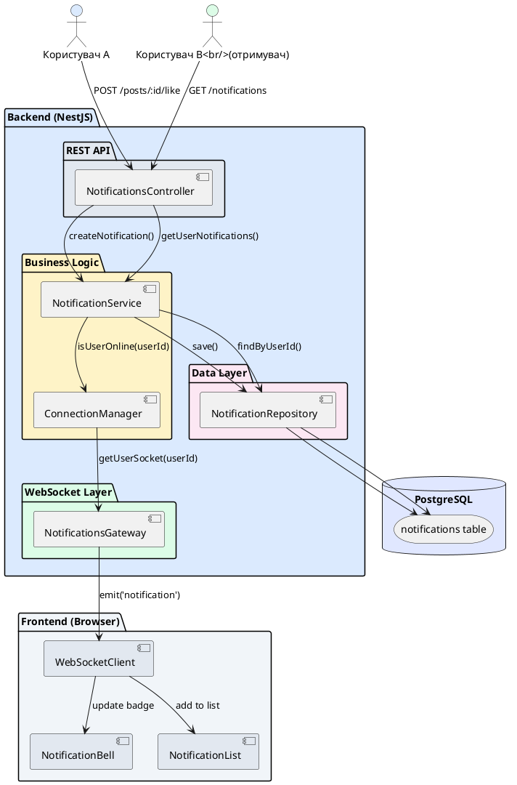
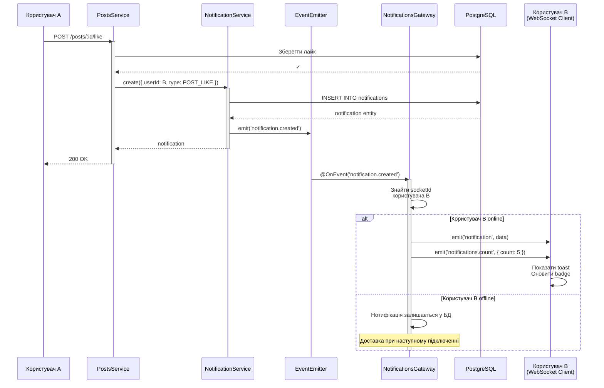

# Архітектура системи нотифікацій

## Короткий зміст

У цій лекції розглядається побудова повноцінної системи in-app нотифікацій:

- **Архітектура системи** — компоненти: Notification Entity (БД), NotificationService (бізнес-логіка), WebSocket Gateway (real-time доставка), REST API (історія нотифікацій)
- **Entity для notifications** — структура таблиці: id, userId, message, type (info/warning/error/success), isRead, createdAt, metadata (JSON для додаткових даних)
- **NotificationService** — методи: `create()` для створення нотифікації, `markAsRead()` для позначення прочитаної, `getUnreadCount()` для лічильника, `getUserNotifications()` для історії
- **Real-time доставка** — інтеграція з WebSocket Gateway, відправка події 'notification' при створенні нотифікації, target користувача через userId → socket mapping
- **REST endpoints** — `GET /notifications` для отримання списку, `GET /notifications/unread-count` для badge, `PATCH /notifications/:id/read` для marking as read, `DELETE /notifications/:id` для видалення
- **Типи нотифікацій** — enum NotificationType: POST_LIKE, COMMENT_REPLY, FOLLOW, SYSTEM_ALERT, різні іконки та дії для кожного типу
- **Групування та пагінація** — пагінація для списку нотифікацій, сортування за createdAt DESC, фільтрація за isRead, group by type
- **Push при офлайн** — збереження у БД навіть якщо користувач офлайн, доставка при наступному підключенні

Розглядаються практичні сценарії: нотифікації про нові лайки, коментарі, підписки, системні повідомлення, інтеграція з frontend для real-time badge оновлення.

---

::card-group

::card{title="🎯 Мета лекції" icon="i-lucide-target"}

- Спроєктувати повноцінну архітектуру системи in-app нотифікацій з БД, бізнес-логікою, real-time доставкою та REST API.
- Створити Notification Entity з підтримкою різних типів нотифікацій, read/unread статусів та metadata для додаткових даних.
- Впровадити NotificationService з методами створення, читання, позначення як прочитані, видалення та підрахунку непрочитаних.
- Інтегрувати WebSocket Gateway для миттєвої доставки нотифікацій online користувачам через event 'notification'.
- Побудувати REST API для отримання історії нотифікацій з пагінацією, фільтрацією та сортуванням.
- Реалізувати систему типів нотифікацій (likes, comments, follows, system alerts) з різними іконками та діями.
- Забезпечити доставку нотифікацій offline користувачам при наступному підключенні.

::

::card{title="🔑 Ключові терміни" icon="i-lucide-key"}

- **In-App Notification:** повідомлення, що відображається всередині веб-застосунку без використання browser push API чи email.
- **Notification Badge:** візуальний індикатор (зазвичай червоне коло з числом) кількості непрочитаних нотифікацій.
- **Read Receipt:** механізм підтвердження, що користувач прочитав нотифікацію (зміна статусу `isRead: false → true`).
- **Notification Type:** категорія нотифікації (LIKE, COMMENT, FOLLOW) для різного UI та логіки обробки.
- **Metadata:** додаткові дані нотифікації у форматі JSON (наприклад, `postId`, `commentId`, `authorName`).
- **Transactional Notification:** нотифікація про дію користувача (лайк, коментар), на відміну від promotional (реклама).

::

::

---

## Контекст: Від real-time технологій до бізнес-логіки

У попередніх лекціях ми опанували технології для real-time комунікації: WebSocket для двостороннього зв'язку, SSE для потокової передачі подій від сервера. Проте сама **технологія доставки** — це лише частина puzzle. Для побудови повноцінної системи нотифікацій потрібна **бізнес-логіка**, що керує життєвим циклом нотифікацій:

1. **Створення нотифікації:** коли користувач A лайкає пост користувача B, система має:
   - Перевірити, чи B не заблокував A
   - Створити запис у БД з типом `POST_LIKE` та metadata `{ postId, likerId }`
   - Якщо B online — відправити через WebSocket
   - Якщо B offline — зберегти для доставки пізніше

2. **Збереження історії:** користувач має бачити історію всіх нотифікацій (останні 100, 500), навіть якщо він був offline.

3. **Read/Unread стани:** після прочитання нотифікація позначається як read, badge з кількістю непрочитаних оновлюється.

4. **Пагінація та фільтрація:** список нотифікацій має пагінацію (20 на сторінку), фільтри (лише непрочитані, лише коментарі).

5. **Видалення:** користувач може видалити окрему нотифікацію або всі read.

6. **Типізація:** різні типи нотифікацій (LIKE, COMMENT, FOLLOW) мають різні іконки, тексти, дії (клік → перехід на пост).

Система нотифікацій — це **інтеграція** WebSocket/SSE технологій з **бізнес-логікою**, **базою даних** та **REST API**. У цій лекції ми побудуємо всю архітектуру end-to-end.

---

## Архітектурний огляд системи

Система нотифікацій складається з кількох шарів, кожен з яких має чітку відповідальність.

::plant-uml{alt="Архітектура системи нотифікацій"}



::

### Компоненти системи

| Компонент | Відповідальність | Технології |
|-----------|------------------|------------|
| **Notification Entity** | Модель даних нотифікації | TypeORM, PostgreSQL |
| **NotificationRepository** | Доступ до БД (CRUD операції) | TypeORM Repository |
| **NotificationService** | Бізнес-логіка (створення, читання, видалення) | NestJS Injectable |
| **NotificationsGateway** | Real-time доставка через WebSocket | Socket.IO |
| **NotificationsController** | REST API для історії та управління | NestJS Controller |
| **ConnectionManager** | Відстеження online користувачів | Map<userId, socketId> |

---

## Notification Entity: Структура даних

Створимо TypeORM Entity для зберігання нотифікацій у базі даних.

```typescript
// src/notifications/entities/notification.entity.ts
import {
  Entity,
  PrimaryGeneratedColumn,
  Column,
  ManyToOne,
  JoinColumn,
  CreateDateColumn,
  Index,
} from 'typeorm';
import { User } from '../../users/entities/user.entity';

export enum NotificationType {
  POST_LIKE = 'POST_LIKE',               // Лайк на пості
  POST_COMMENT = 'POST_COMMENT',         // Коментар до поста
  COMMENT_REPLY = 'COMMENT_REPLY',       // Відповідь на коментар
  USER_FOLLOW = 'USER_FOLLOW',           // Підписка на користувача
  POST_MENTION = 'POST_MENTION',         // Згадування у пості (@username)
  SYSTEM_ALERT = 'SYSTEM_ALERT',         // Системне повідомлення
  ACHIEVEMENT = 'ACHIEVEMENT',           // Досягнення (наприклад, 100 фоловерів)
}

@Entity('notifications')
@Index(['userId', 'isRead']) // Композитний індекс для швидкого пошуку непрочитаних
@Index(['userId', 'createdAt']) // Індекс для сортування по даті
export class Notification {
  @PrimaryGeneratedColumn('uuid')
  id: string;

  // Отримувач нотифікації
  @Column()
  userId: number;

  @ManyToOne(() => User, { onDelete: 'CASCADE' })
  @JoinColumn({ name: 'userId' })
  user: User;

  // Відправник (якщо є, для SYSTEM_ALERT може бути null)
  @Column({ nullable: true })
  actorId?: number;

  @ManyToOne(() => User, { eager: true })
  @JoinColumn({ name: 'actorId' })
  actor?: User;

  // Тип нотифікації
  @Column({
    type: 'enum',
    enum: NotificationType,
  })
  type: NotificationType;

  // Основний текст нотифікації
  @Column({ type: 'text' })
  message: string;

  // Додаткові дані у форматі JSON
  @Column({ type: 'jsonb', nullable: true })
  metadata?: {
    postId?: string;
    commentId?: string;
    achievementType?: string;
    // Інші поля залежно від типу
  };

  // Статус прочитання
  @Column({ default: false })
  isRead: boolean;

  // Дата прочитання (для аналітики)
  @Column({ type: 'timestamp', nullable: true })
  readAt?: Date;

  @CreateDateColumn()
  createdAt: Date;
}
```

**Ключові аспекти Entity:**

1. **Композитні індекси:** `@Index(['userId', 'isRead'])` забезпечує швидкий пошук непрочитаних нотифікацій для конкретного користувача (типовий запит: *"дай мені всі непрочитані нотифікації користувача #123"*).

2. **JSONB metadata:** PostgreSQL колонка типу `jsonb` дозволяє зберігати додаткові дані без зміни схеми таблиці. Для `POST_LIKE` це може бути `{ postId, likerId }`, для `COMMENT_REPLY` — `{ commentId, parentCommentId }`.

3. **Eager loading actor:** `actor` завантажується автоматично, щоб у нотифікації відразу був доступний username та avatar відправника.

4. **Enum для типу:** TypeScript enum забезпечує типобезпеку та автодоповнення у IDE.

5. **ON DELETE CASCADE:** при видаленні користувача всі його нотифікації автоматично видаляються.

### Міграція БД

```bash
# Згенерувати міграцію
npm run typeorm migration:generate -- -n CreateNotificationsTable

# Застосувати міграцію
npm run typeorm migration:run
```

---

## NotificationService: Бізнес-логіка

Створимо сервіс з методами для управління життєвим циклом нотифікацій.

```typescript
// src/notifications/notifications.service.ts
import { Injectable, NotFoundException } from '@nestjs/common';
import { InjectRepository } from '@nestjs/typeorm';
import { Repository } from 'typeorm';
import { Notification, NotificationType } from './entities/notification.entity';
import { EventEmitter2 } from '@nestjs/event-emitter';

interface CreateNotificationDto {
  userId: number;
  actorId?: number;
  type: NotificationType;
  message: string;
  metadata?: any;
}

interface PaginatedNotifications {
  notifications: Notification[];
  total: number;
  page: number;
  pageSize: number;
  hasMore: boolean;
}

@Injectable()
export class NotificationsService {
  constructor(
    @InjectRepository(Notification)
    private notificationRepository: Repository<Notification>,
    private eventEmitter: EventEmitter2, // Для емітування подій до Gateway
  ) {}

  /**
   * Створити нову нотифікацію
   */
  async create(dto: CreateNotificationDto): Promise<Notification> {
    // Перевірка: не створювати нотифікацію, якщо actorId === userId
    // (користувач лайкнув свій власний пост)
    if (dto.actorId && dto.actorId === dto.userId) {
      return null;
    }

    const notification = this.notificationRepository.create({
      userId: dto.userId,
      actorId: dto.actorId,
      type: dto.type,
      message: dto.message,
      metadata: dto.metadata,
      isRead: false,
    });

    const saved = await this.notificationRepository.save(notification);

    // Емітувати подію для NotificationsGateway
    this.eventEmitter.emit('notification.created', saved);

    console.log(
      `[NotificationService] Створено нотифікацію ${saved.id} для користувача ${saved.userId}`
    );

    return saved;
  }

  /**
   * Отримати нотифікації користувача з пагінацією
   */
  async getUserNotifications(
    userId: number,
    page: number = 1,
    pageSize: number = 20,
    unreadOnly: boolean = false,
  ): Promise<PaginatedNotifications> {
    const query = this.notificationRepository
      .createQueryBuilder('notification')
      .where('notification.userId = :userId', { userId })
      .orderBy('notification.createdAt', 'DESC')
      .skip((page - 1) * pageSize)
      .take(pageSize);

    if (unreadOnly) {
      query.andWhere('notification.isRead = false');
    }

    const [notifications, total] = await query.getManyAndCount();

    return {
      notifications,
      total,
      page,
      pageSize,
      hasMore: total > page * pageSize,
    };
  }

  /**
   * Отримати кількість непрочитаних нотифікацій
   */
  async getUnreadCount(userId: number): Promise<number> {
    return this.notificationRepository.count({
      where: {
        userId,
        isRead: false,
      },
    });
  }

  /**
   * Позначити нотифікацію як прочитану
   */
  async markAsRead(notificationId: string, userId: number): Promise<Notification> {
    const notification = await this.notificationRepository.findOne({
      where: { id: notificationId, userId },
    });

    if (!notification) {
      throw new NotFoundException(`Нотифікація ${notificationId} не знайдена`);
    }

    if (notification.isRead) {
      return notification; // Вже прочитана
    }

    notification.isRead = true;
    notification.readAt = new Date();

    return this.notificationRepository.save(notification);
  }

  /**
   * Позначити всі нотифікації як прочитані
   */
  async markAllAsRead(userId: number): Promise<{ affected: number }> {
    const result = await this.notificationRepository.update(
      {
        userId,
        isRead: false,
      },
      {
        isRead: true,
        readAt: new Date(),
      },
    );

    return { affected: result.affected || 0 };
  }

  /**
   * Видалити нотифікацію
   */
  async delete(notificationId: string, userId: number): Promise<void> {
    const result = await this.notificationRepository.delete({
      id: notificationId,
      userId,
    });

    if (result.affected === 0) {
      throw new NotFoundException(`Нотифікація ${notificationId} не знайдена`);
    }
  }

  /**
   * Видалити всі прочитані нотифікації
   */
  async deleteAllRead(userId: number): Promise<{ affected: number }> {
    const result = await this.notificationRepository.delete({
      userId,
      isRead: true,
    });

    return { affected: result.affected || 0 };
  }

  /**
   * Отримати непрочитані нотифікації (для доставки при підключенні)
   */
  async getUnreadNotifications(userId: number, limit: number = 50): Promise<Notification[]> {
    return this.notificationRepository.find({
      where: {
        userId,
        isRead: false,
      },
      order: {
        createdAt: 'DESC',
      },
      take: limit,
    });
  }
}
```

**Основні методи сервісу:**

| Метод | Призначення | Використання |
|-------|-------------|--------------|
| `create()` | Створення нової нотифікації | Викликається з інших модулів (Posts, Comments) |
| `getUserNotifications()` | Отримання історії з пагінацією | REST API для frontend |
| `getUnreadCount()` | Лічильник непрочитаних | Badge у UI |
| `markAsRead()` | Позначити одну як прочитану | При кліку на нотифікацію |
| `markAllAsRead()` | Позначити всі як прочитані | Кнопка "Mark all as read" |
| `delete()` | Видалити одну нотифікацію | Swipe to delete у UI |
| `deleteAllRead()` | Видалити всі прочитані | Cleanup старих нотифікацій |
| `getUnreadNotifications()` | Отримати непрочитані | Доставка при підключенні offline користувача |

::tip
**Event-Driven Architecture:** метод `create()` емітує подію `notification.created` замість прямого виклику Gateway. Це дозволяє легко додати інші обробники (наприклад, відправка email або push notification) без зміни коду `create()`.
::


---

## NotificationsGateway: Real-time доставка

Тепер інтегруємо NotificationService з WebSocket Gateway для миттєвої доставки нотифікацій online користувачам.

```typescript
// src/notifications/notifications.gateway.ts
import {
  WebSocketGateway,
  WebSocketServer,
  OnGatewayConnection,
  OnGatewayDisconnect,
} from '@nestjs/websockets';
import { Server, Socket } from 'socket.io';
import { Injectable } from '@nestjs/common';
import { OnEvent } from '@nestjs/event-emitter';
import { Notification } from './entities/notification.entity';
import { NotificationsService } from './notifications.service';

@Injectable()
@WebSocketGateway({
  namespace: '/notifications',
  cors: { origin: process.env.FRONTEND_URL },
})
export class NotificationsGateway implements OnGatewayConnection, OnGatewayDisconnect {
  @WebSocketServer()
  server: Server;

  // Map: userId → socketId для швидкого пошуку
  private userSocketMap = new Map<number, string>();

  constructor(private notificationsService: NotificationsService) {}

  /**
   * Клієнт підключився
   */
  async handleConnection(client: Socket) {
    const userId = client.handshake.auth?.userId;

    if (!userId) {
      console.warn('[NotificationsGateway] Клієнт без userId, відключаємо');
      client.disconnect();
      return;
    }

    // Зберегти mapping userId → socketId
    this.userSocketMap.set(userId, client.id);
    console.log(`[NotificationsGateway] Користувач ${userId} підключився (${client.id})`);

    // Відправити всі непрочитані нотифікації (користувач був offline)
    const unreadNotifications = await this.notificationsService.getUnreadNotifications(userId);

    if (unreadNotifications.length > 0) {
      client.emit('notifications.unread', {
        count: unreadNotifications.length,
        notifications: unreadNotifications,
      });

      console.log(
        `[NotificationsGateway] Відправлено ${unreadNotifications.length} непрочитаних нотифікацій користувачу ${userId}`
      );
    }

    // Відправити поточний unread count для badge
    const unreadCount = await this.notificationsService.getUnreadCount(userId);
    client.emit('notifications.count', { count: unreadCount });
  }

  /**
   * Клієнт від'єднався
   */
  handleDisconnect(client: Socket) {
    const userId = client.handshake.auth?.userId;

    if (userId) {
      this.userSocketMap.delete(userId);
      console.log(`[NotificationsGateway] Користувач ${userId} від'єднався`);
    }
  }

  /**
   * Обробник події створення нотифікації (від NotificationService)
   */
  @OnEvent('notification.created')
  async handleNotificationCreated(notification: Notification) {
    const targetUserId = notification.userId;
    const socketId = this.userSocketMap.get(targetUserId);

    if (!socketId) {
      console.log(
        `[NotificationsGateway] Користувач ${targetUserId} offline, нотифікація збережена у БД`
      );
      return; // Користувач offline, доставимо при наступному підключенні
    }

    // Відправити нотифікацію до конкретного сокета
    this.server.to(socketId).emit('notification', notification);

    // Оновити unread count
    const unreadCount = await this.notificationsService.getUnreadCount(targetUserId);
    this.server.to(socketId).emit('notifications.count', { count: unreadCount });

    console.log(`[NotificationsGateway] Нотифікація ${notification.id} доставлена користувачу ${targetUserId}`);
  }

  /**
   * Публічний метод для відправки нотифікації конкретному користувачу
   * (можна викликати з інших модулів)
   */
  sendToUser(userId: number, event: string, data: any) {
    const socketId = this.userSocketMap.get(userId);
    if (socketId) {
      this.server.to(socketId).emit(event, data);
    }
  }

  /**
   * Broadcast нотифікація всім підключеним користувачам
   */
  broadcast(event: string, data: any) {
    this.server.emit(event, data);
  }
}
```

**Ключові механізми Gateway:**

1. **User → Socket mapping:** `Map<number, string>` зберігає відповідність userId до socketId. При створенні нотифікації ми швидко знаходимо сокет отримувача.

2. **@OnEvent декоратор:** метод `handleNotificationCreated()` автоматично викликається при емітуванні події `notification.created` з NotificationService. Це **event-driven підхід** — сервіси не знають один про одного напряму.

3. **Offline доставка:** якщо `socketId` відсутній у Map, нотифікація залишається у БД. При наступному підключенні `handleConnection()` завантажує всі непрочитані та відправляє їх разом.

4. **Dual events:** відправляємо дві події — `'notification'` з даними нової нотифікації та `'notifications.count'` з оновленим лічильником. Frontend може обробити їх окремо (додати до списку + оновити badge).

5. **Namespace `/notifications`:** ізоляція WebSocket з'єднань для нотифікацій від інших real-time функцій (чат, live updates).

::warning
**Security:** у production середовищі `userId` має бути з JWT токена (декодування у middleware), а не з `client.handshake.auth`. Інакше зловмисник може підключитися з чужим `userId` та отримувати нотифікації іншого користувача.
::

---

## NotificationsController: REST API

Створимо REST endpoints для отримання історії нотифікацій, позначення як прочитані, видалення.

```typescript
// src/notifications/notifications.controller.ts
import {
  Controller,
  Get,
  Patch,
  Delete,
  Param,
  Query,
  UseGuards,
  Req,
} from '@nestjs/common';
import { NotificationsService } from './notifications.service';
import { JwtAuthGuard } from '../auth/guards/jwt-auth.guard';
import { Request } from 'express';

interface AuthRequest extends Request {
  user: { id: number; username: string };
}

@Controller('notifications')
@UseGuards(JwtAuthGuard)
export class NotificationsController {
  constructor(private notificationsService: NotificationsService) {}

  /**
   * GET /notifications
   * Отримати список нотифікацій з пагінацією
   */
  @Get()
  async getNotifications(
    @Req() req: AuthRequest,
    @Query('page') page: number = 1,
    @Query('pageSize') pageSize: number = 20,
    @Query('unreadOnly') unreadOnly: string = 'false',
  ) {
    const userId = req.user.id;
    const unreadOnlyBool = unreadOnly === 'true';

    return this.notificationsService.getUserNotifications(
      userId,
      Number(page),
      Number(pageSize),
      unreadOnlyBool,
    );
  }

  /**
   * GET /notifications/unread-count
   * Отримати кількість непрочитаних нотифікацій (для badge)
   */
  @Get('unread-count')
  async getUnreadCount(@Req() req: AuthRequest) {
    const userId = req.user.id;
    const count = await this.notificationsService.getUnreadCount(userId);

    return { count };
  }

  /**
   * PATCH /notifications/:id/read
   * Позначити нотифікацію як прочитану
   */
  @Patch(':id/read')
  async markAsRead(@Req() req: AuthRequest, @Param('id') notificationId: string) {
    const userId = req.user.id;
    const notification = await this.notificationsService.markAsRead(notificationId, userId);

    return { success: true, notification };
  }

  /**
   * PATCH /notifications/read-all
   * Позначити всі нотифікації як прочитані
   */
  @Patch('read-all')
  async markAllAsRead(@Req() req: AuthRequest) {
    const userId = req.user.id;
    const result = await this.notificationsService.markAllAsRead(userId);

    return { success: true, affected: result.affected };
  }

  /**
   * DELETE /notifications/:id
   * Видалити нотифікацію
   */
  @Delete(':id')
  async deleteNotification(@Req() req: AuthRequest, @Param('id') notificationId: string) {
    const userId = req.user.id;
    await this.notificationsService.delete(notificationId, userId);

    return { success: true, message: 'Нотифікацію видалено' };
  }

  /**
   * DELETE /notifications/read
   * Видалити всі прочитані нотифікації
   */
  @Delete('read')
  async deleteAllRead(@Req() req: AuthRequest) {
    const userId = req.user.id;
    const result = await this.notificationsService.deleteAllRead(userId);

    return { success: true, affected: result.affected };
  }
}
```

**REST API Endpoints:**

| HTTP Method | Endpoint | Опис | Query Params |
|-------------|----------|------|--------------|
| `GET` | `/notifications` | Список нотифікацій | `page`, `pageSize`, `unreadOnly` |
| `GET` | `/notifications/unread-count` | Кількість непрочитаних | — |
| `PATCH` | `/notifications/:id/read` | Позначити як прочитану | — |
| `PATCH` | `/notifications/read-all` | Позначити всі як прочитані | — |
| `DELETE` | `/notifications/:id` | Видалити нотифікацію | — |
| `DELETE` | `/notifications/read` | Видалити всі прочитані | — |

::tip
**Чому PATCH, а не POST?** За REST convention, PATCH використовується для **часткового оновлення** ресурсу (зміна `isRead: false → true`). POST традиційно для створення нового ресурсу.
::

---

## Notifications Module: Реєстрація компонентів

Об'єднаємо всі компоненти в модуль.

```typescript
// src/notifications/notifications.module.ts
import { Module } from '@nestjs/common';
import { TypeOrmModule } from '@nestjs/typeorm';
import { Notification } from './entities/notification.entity';
import { NotificationsService } from './notifications.service';
import { NotificationsGateway } from './notifications.gateway';
import { NotificationsController } from './notifications.controller';

@Module({
  imports: [
    TypeOrmModule.forFeature([Notification]),
  ],
  providers: [NotificationsService, NotificationsGateway],
  controllers: [NotificationsController],
  exports: [NotificationsService], // Експортуємо для використання в інших модулях
})
export class NotificationsModule {}
```

**Експорт NotificationsService:** інші модулі (Posts, Comments, Users) можуть інжектити `NotificationsService` для створення нотифікацій:

```typescript
// src/posts/posts.service.ts
import { NotificationsService } from '../notifications/notifications.service';
import { NotificationType } from '../notifications/entities/notification.entity';

@Injectable()
export class PostsService {
  constructor(
    private notificationsService: NotificationsService,
  ) {}

  async likePost(postId: string, userId: number) {
    const post = await this.findOne(postId);
    
    // Логіка лайку...
    
    // Створити нотифікацію для автора поста
    await this.notificationsService.create({
      userId: post.authorId,
      actorId: userId,
      type: NotificationType.POST_LIKE,
      message: 'вподобав ваш пост',
      metadata: { postId },
    });
  }
}
```

---

## Frontend інтеграція: React компоненти

Реалізуємо клієнтську частину для відображення нотифікацій.

### WebSocket клієнт

```typescript
// src/hooks/useNotifications.ts
import { useEffect, useState } from 'react';
import { io, Socket } from 'socket.io-client';

interface Notification {
  id: string;
  type: string;
  message: string;
  actor?: { username: string; avatar: string };
  isRead: boolean;
  createdAt: string;
  metadata?: any;
}

export function useNotifications(accessToken: string) {
  const [socket, setSocket] = useState<Socket | null>(null);
  const [notifications, setNotifications] = useState<Notification[]>([]);
  const [unreadCount, setUnreadCount] = useState(0);

  useEffect(() => {
    const userId = parseUserIdFromToken(accessToken); // Декодування JWT

    const newSocket = io('http://localhost:3000/notifications', {
      auth: { userId }, // В production: передавати token, верифікувати на сервері
    });

    newSocket.on('connect', () => {
      console.log('[useNotifications] Підключено до WebSocket');
    });

    // Отримати непрочитані нотифікації після підключення
    newSocket.on('notifications.unread', (data) => {
      console.log('[useNotifications] Отримано непрочитані:', data.count);
      setNotifications((prev) => [...data.notifications, ...prev]);
      setUnreadCount(data.count);
    });

    // Нова нотифікація в real-time
    newSocket.on('notification', (notification: Notification) => {
      console.log('[useNotifications] Нова нотифікація:', notification.id);
      setNotifications((prev) => [notification, ...prev]);
      
      // Показати toast/banner
      showNotificationToast(notification);
    });

    // Оновлення unread count
    newSocket.on('notifications.count', (data) => {
      setUnreadCount(data.count);
    });

    newSocket.on('disconnect', () => {
      console.log('[useNotifications] Відключено від WebSocket');
    });

    setSocket(newSocket);

    return () => {
      newSocket.close();
    };
  }, [accessToken]);

  return { socket, notifications, unreadCount };
}

function parseUserIdFromToken(token: string): number {
  // Декодування JWT (у production використовувати jwt-decode бібліотеку)
  const payload = JSON.parse(atob(token.split('.')[1]));
  return payload.sub;
}

function showNotificationToast(notification: Notification) {
  // Показати browser notification або toast UI
  if ('Notification' in window && Notification.permission === 'granted') {
    new Notification('Нова нотифікація', {
      body: `${notification.actor?.username} ${notification.message}`,
      icon: notification.actor?.avatar,
    });
  }
}
```

### NotificationBell компонент

```typescript
// src/components/NotificationBell.tsx
import React from 'react';
import { Bell } from 'lucide-react';

interface NotificationBellProps {
  unreadCount: number;
  onClick: () => void;
}

export function NotificationBell({ unreadCount, onClick }: NotificationBellProps) {
  return (
    <button
      onClick={onClick}
      className="relative p-2 rounded-full hover:bg-gray-100 transition"
      aria-label="Нотифікації"
    >
      <Bell className="w-6 h-6 text-gray-700" />
      
      {unreadCount > 0 && (
        <span className="absolute top-0 right-0 inline-flex items-center justify-center w-5 h-5 text-xs font-bold text-white bg-red-500 rounded-full">
          {unreadCount > 99 ? '99+' : unreadCount}
        </span>
      )}
    </button>
  );
}
```

### NotificationList компонент

```typescript
// src/components/NotificationList.tsx
import React from 'react';
import { formatDistanceToNow } from 'date-fns';
import { uk } from 'date-fns/locale';
import { Heart, MessageCircle, UserPlus, AlertCircle } from 'lucide-react';

interface Notification {
  id: string;
  type: string;
  message: string;
  actor?: { username: string; avatar: string };
  isRead: boolean;
  createdAt: string;
  metadata?: any;
}

interface NotificationListProps {
  notifications: Notification[];
  onMarkAsRead: (id: string) => void;
  onDelete: (id: string) => void;
}

export function NotificationList({
  notifications,
  onMarkAsRead,
  onDelete,
}: NotificationListProps) {
  const getIcon = (type: string) => {
    switch (type) {
      case 'POST_LIKE':
        return <Heart className="w-5 h-5 text-red-500" />;
      case 'POST_COMMENT':
      case 'COMMENT_REPLY':
        return <MessageCircle className="w-5 h-5 text-blue-500" />;
      case 'USER_FOLLOW':
        return <UserPlus className="w-5 h-5 text-green-500" />;
      case 'SYSTEM_ALERT':
        return <AlertCircle className="w-5 h-5 text-orange-500" />;
      default:
        return <Bell className="w-5 h-5 text-gray-500" />;
    }
  };

  return (
    <div className="w-96 max-h-[600px] overflow-y-auto bg-white rounded-lg shadow-lg">
      <div className="p-4 border-b">
        <h3 className="text-lg font-semibold">Нотифікації</h3>
      </div>

      {notifications.length === 0 ? (
        <div className="p-8 text-center text-gray-500">
          <Bell className="w-12 h-12 mx-auto mb-2 opacity-50" />
          <p>Немає нових нотифікацій</p>
        </div>
      ) : (
        <div className="divide-y">
          {notifications.map((notification) => (
            <div
              key={notification.id}
              className={`p-4 hover:bg-gray-50 cursor-pointer transition ${
                !notification.isRead ? 'bg-blue-50' : ''
              }`}
              onClick={() => onMarkAsRead(notification.id)}
            >
              <div className="flex items-start gap-3">
                {/* Іконка типу нотифікації */}
                <div className="flex-shrink-0 mt-1">{getIcon(notification.type)}</div>

                {/* Avatar актора */}
                {notification.actor && (
                  
                )}

                {/* Текст нотифікації */}
                <div className="flex-1 min-w-0">
                  <p className="text-sm text-gray-900">
                    {notification.actor && (
                      <span className="font-semibold">{notification.actor.username}</span>
                    )}{' '}
                    {notification.message}
                  </p>
                  <p className="text-xs text-gray-500 mt-1">
                    {formatDistanceToNow(new Date(notification.createdAt), {
                      addSuffix: true,
                      locale: uk,
                    })}
                  </p>
                </div>

                {/* Indikator непрочитаної */}
                {!notification.isRead && (
                  <div className="w-2 h-2 bg-blue-500 rounded-full flex-shrink-0 mt-2"></div>
                )}
              </div>
            </div>
          ))}
        </div>
      )}
    </div>
  );
}
```

### Використання у застосунку

```typescript
// src/App.tsx
import React, { useState } from 'react';
import { useNotifications } from './hooks/useNotifications';
import { NotificationBell } from './components/NotificationBell';
import { NotificationList } from './components/NotificationList';

export function App() {
  const accessToken = localStorage.getItem('accessToken');
  const { notifications, unreadCount } = useNotifications(accessToken);
  const [isOpen, setIsOpen] = useState(false);

  const handleMarkAsRead = async (id: string) => {
    await fetch(`http://localhost:3000/notifications/${id}/read`, {
      method: 'PATCH',
      headers: {
        Authorization: `Bearer ${accessToken}`,
      },
    });

    // Оновити локальний стан
    // В production використовувати React Query або Redux
  };

  const handleDelete = async (id: string) => {
    await fetch(`http://localhost:3000/notifications/${id}`, {
      method: 'DELETE',
      headers: {
        Authorization: `Bearer ${accessToken}`,
      },
    });
  };

  return (
    <div className="relative">
      <NotificationBell unreadCount={unreadCount} onClick={() => setIsOpen(!isOpen)} />

      {isOpen && (
        <div className="absolute right-0 mt-2 z-50">
          <NotificationList
            notifications={notifications}
            onMarkAsRead={handleMarkAsRead}
            onDelete={handleDelete}
          />
        </div>
      )}
    </div>
  );
}
```


---

## Практичні сценарії: Типи нотифікацій

Розглянемо конкретні приклади створення нотифікацій для різних подій у застосунку.

### Сценарій 1: Лайк на пості

```typescript
// src/posts/posts.service.ts
import { Injectable } from '@nestjs/common';
import { NotificationsService } from '../notifications/notifications.service';
import { NotificationType } from '../notifications/entities/notification.entity';

@Injectable()
export class PostsService {
  constructor(
    private notificationsService: NotificationsService,
    // інші залежності...
  ) {}

  async likePost(postId: string, likerId: number) {
    const post = await this.postRepository.findOne({
      where: { id: postId },
      relations: ['author'],
    });

    if (!post) {
      throw new NotFoundException('Пост не знайдено');
    }

    // Додати лайк у БД...
    await this.likeRepository.save({ postId, userId: likerId });

    // Створити нотифікацію для автора поста
    await this.notificationsService.create({
      userId: post.author.id,
      actorId: likerId,
      type: NotificationType.POST_LIKE,
      message: 'вподобав ваш пост',
      metadata: {
        postId,
        postTitle: post.title.substring(0, 50), // Перші 50 символів
      },
    });

    console.log(`Користувач ${likerId} лайкнув пост ${postId}`);
  }
}
```

**Результат:** коли користувач Alice лайкає пост Bob, Bob отримує нотифікацію:

```json
{
  "id": "uuid-123",
  "type": "POST_LIKE",
  "message": "вподобав ваш пост",
  "actor": {
    "id": 1,
    "username": "alice",
    "avatar": "https://example.com/avatars/alice.jpg"
  },
  "metadata": {
    "postId": "post-456",
    "postTitle": "My first blog post about TypeScript..."
  },
  "isRead": false,
  "createdAt": "2026-09-07T10:30:00Z"
}
```

### Сценарій 2: Коментар до поста

```typescript
// src/comments/comments.service.ts
@Injectable()
export class CommentsService {
  constructor(
    private notificationsService: NotificationsService,
  ) {}

  async createComment(postId: string, authorId: number, content: string) {
    const post = await this.postRepository.findOne({
      where: { id: postId },
      relations: ['author'],
    });

    // Створити коментар у БД...
    const comment = await this.commentRepository.save({
      postId,
      authorId,
      content,
    });

    // Нотифікація для автора поста (якщо це не self-comment)
    if (post.author.id !== authorId) {
      await this.notificationsService.create({
        userId: post.author.id,
        actorId: authorId,
        type: NotificationType.POST_COMMENT,
        message: 'прокоментував ваш пост',
        metadata: {
          postId,
          commentId: comment.id,
          commentPreview: content.substring(0, 100),
        },
      });
    }

    return comment;
  }
}
```

### Сценарій 3: Відповідь на коментар

```typescript
// src/comments/comments.service.ts
async replyToComment(commentId: string, authorId: number, content: string) {
  const parentComment = await this.commentRepository.findOne({
    where: { id: commentId },
    relations: ['author'],
  });

  // Створити відповідь у БД...
  const reply = await this.commentRepository.save({
    parentCommentId: commentId,
    authorId,
    content,
  });

  // Нотифікація для автора батьківського коментаря
  if (parentComment.author.id !== authorId) {
    await this.notificationsService.create({
      userId: parentComment.author.id,
      actorId: authorId,
      type: NotificationType.COMMENT_REPLY,
      message: 'відповів на ваш коментар',
      metadata: {
        commentId,
        replyId: reply.id,
        replyPreview: content.substring(0, 100),
      },
    });
  }

  return reply;
}
```

### Сценарій 4: Підписка на користувача

```typescript
// src/users/users.service.ts
@Injectable()
export class UsersService {
  constructor(
    private notificationsService: NotificationsService,
  ) {}

  async followUser(followerId: number, followeeId: number) {
    // Додати підписку у БД...
    await this.followRepository.save({ followerId, followeeId });

    // Нотифікація для користувача, на якого підписалися
    await this.notificationsService.create({
      userId: followeeId,
      actorId: followerId,
      type: NotificationType.USER_FOLLOW,
      message: 'підписався на вас',
      metadata: {
        followerId,
      },
    });

    console.log(`Користувач ${followerId} підписався на ${followeeId}`);
  }
}
```

### Сценарій 5: Згадування у пості (@mention)

```typescript
// src/posts/posts.service.ts
async createPost(authorId: number, title: string, content: string) {
  // Створити пост у БД...
  const post = await this.postRepository.save({ authorId, title, content });

  // Знайти всі mentions (@username) у content
  const mentions = this.extractMentions(content); // ['alice', 'bob']

  // Створити нотифікації для згаданих користувачів
  for (const username of mentions) {
    const user = await this.userRepository.findOne({ where: { username } });
    
    if (user && user.id !== authorId) {
      await this.notificationsService.create({
        userId: user.id,
        actorId: authorId,
        type: NotificationType.POST_MENTION,
        message: 'згадав вас у пості',
        metadata: {
          postId: post.id,
          postTitle: title,
        },
      });
    }
  }

  return post;
}

private extractMentions(content: string): string[] {
  const regex = /@(\w+)/g;
  const matches = content.matchAll(regex);
  return Array.from(matches, (m) => m[1]);
}
```

### Сценарій 6: Системна нотифікація

```typescript
// src/admin/admin.service.ts
@Injectable()
export class AdminService {
  constructor(
    private notificationsService: NotificationsService,
  ) {}

  async sendSystemAlert(userIds: number[], message: string) {
    // Масова відправка системних нотифікацій
    for (const userId of userIds) {
      await this.notificationsService.create({
        userId,
        actorId: null, // Немає конкретного відправника
        type: NotificationType.SYSTEM_ALERT,
        message,
        metadata: {
          priority: 'high',
          link: '/announcements/maintenance',
        },
      });
    }

    console.log(`Системна нотифікація відправлена ${userIds.length} користувачам`);
  }
}

// Приклад використання:
await adminService.sendSystemAlert(
  [1, 2, 3, 4, 5],
  'Планове технічне обслуговування сервера о 23:00 UTC'
);
```

### Сценарій 7: Досягнення (Achievement)

```typescript
// src/achievements/achievements.service.ts
@Injectable()
export class AchievementsService {
  constructor(
    private notificationsService: NotificationsService,
  ) {}

  async checkAndAwardAchievements(userId: number) {
    // Перевірити досягнення користувача
    const followerCount = await this.getFollowerCount(userId);

    if (followerCount === 100) {
      await this.notificationsService.create({
        userId,
        actorId: null,
        type: NotificationType.ACHIEVEMENT,
        message: '🎉 Вітаємо! Ви досягли 100 підписників!',
        metadata: {
          achievementType: '100_followers',
          badge: 'influencer_bronze',
        },
      });
    }
  }
}
```

---

## Групування нотифікацій

Для зменшення noise, однотипні нотифікації можна **групувати**. Наприклад, замість 10 окремих нотифікацій *"Alice liked your post", "Bob liked your post", ...*  показати одну: *"Alice, Bob та ще 8 користувачів вподобали ваш пост"*.

```typescript
// src/notifications/notifications.service.ts
interface GroupedNotification {
  type: NotificationType;
  metadata: { postId: string };
  actors: Array<{ id: number; username: string }>;
  count: number;
  latestCreatedAt: Date;
}

async getGroupedNotifications(userId: number): Promise<GroupedNotification[]> {
  // SQL запит з GROUP BY
  const grouped = await this.notificationRepository
    .createQueryBuilder('n')
    .select('n.type', 'type')
    .addSelect('n.metadata->\'postId\'', 'postId')
    .addSelect('COUNT(*)', 'count')
    .addSelect('MAX(n.createdAt)', 'latestCreatedAt')
    .addSelect(
      `json_agg(json_build_object('id', actor.id, 'username', actor.username))`,
      'actors'
    )
    .leftJoin('n.actor', 'actor')
    .where('n.userId = :userId', { userId })
    .andWhere('n.isRead = false')
    .andWhere('n.type IN (:...types)', { types: [NotificationType.POST_LIKE, NotificationType.POST_COMMENT] })
    .andWhere('n.createdAt > :since', { since: new Date(Date.now() - 24 * 60 * 60 * 1000) }) // Останні 24 години
    .groupBy('n.type, n.metadata->\'postId\'')
    .having('COUNT(*) > 1') // Лише групи з 2+ нотифікаціями
    .getRawMany();

  return grouped;
}
```

**Frontend відображення:**

```typescript
// Якщо count > 1, показати групову нотифікацію
{count > 1 ? (
  <p className="text-sm">
    <span className="font-semibold">{actors[0].username}</span>
    {count > 2 && <span>, {actors[1].username}</span>}
    {count > 2 && <span> та ще {count - 2}</span>}
    {' '}{message}
  </p>
) : (
  <p className="text-sm">
    <span className="font-semibold">{actors[0].username}</span>
    {' '}{message}
  </p>
)}
```

::note
**Tradeoff:** групування покращує UX (менше шуму), але ускладнює реалізацію (SQL aggregate queries, кешування груп, updating групи при новій нотифікації).
::

---

## Оптимізація та Best Practices

### 1. Database Indexes

Створіть композитні індекси для швидких запитів:

```sql
-- Індекс для отримання непрочитаних нотифікацій користувача
CREATE INDEX idx_notifications_user_unread 
ON notifications(user_id, is_read, created_at DESC);

-- Індекс для пошуку за типом
CREATE INDEX idx_notifications_user_type 
ON notifications(user_id, type, created_at DESC);
```

### 2. Pagination Best Practices

Для великих списків нотифікацій використовуйте **cursor-based pagination** замість offset:

```typescript
async getUserNotifications(
  userId: number,
  cursor?: string, // ID останньої нотифікації
  limit: number = 20,
) {
  const query = this.notificationRepository
    .createQueryBuilder('n')
    .where('n.userId = :userId', { userId })
    .orderBy('n.createdAt', 'DESC')
    .take(limit);

  if (cursor) {
    // Завантажити нотифікації старіші за cursor
    query.andWhere('n.createdAt < (SELECT createdAt FROM notifications WHERE id = :cursor)', { cursor });
  }

  const notifications = await query.getMany();

  return {
    notifications,
    nextCursor: notifications.length === limit ? notifications[limit - 1].id : null,
  };
}
```

### 3. Throttling повторюваних нотифікацій

Не створювати нову нотифікацію, якщо ідентична вже існує у останні X хвилин:

```typescript
async create(dto: CreateNotificationDto): Promise<Notification> {
  // Перевірка дублікату за останні 5 хвилин
  const recentDuplicate = await this.notificationRepository.findOne({
    where: {
      userId: dto.userId,
      actorId: dto.actorId,
      type: dto.type,
      'metadata.postId': dto.metadata?.postId,
      createdAt: MoreThan(new Date(Date.now() - 5 * 60 * 1000)),
    },
  });

  if (recentDuplicate) {
    console.log('[NotificationService] Дублікат знайдено, пропускаємо створення');
    return recentDuplicate;
  }

  // Створити нову нотифікацію...
}
```

### 4. Автоматичне видалення старих нотифікацій

Створіть cron job для очищення нотифікацій старше 90 днів:

```typescript
// src/notifications/notifications.cron.ts
import { Injectable } from '@nestjs/common';
import { Cron, CronExpression } from '@nestjs/schedule';
import { LessThan } from 'typeorm';
import { NotificationsService } from './notifications.service';

@Injectable()
export class NotificationsCron {
  constructor(
    @InjectRepository(Notification)
    private notificationRepository: Repository<Notification>,
  ) {}

  @Cron(CronExpression.EVERY_DAY_AT_3AM)
  async cleanupOldNotifications() {
    const ninetyDaysAgo = new Date(Date.now() - 90 * 24 * 60 * 60 * 1000);

    const result = await this.notificationRepository.delete({
      createdAt: LessThan(ninetyDaysAgo),
    });

    console.log(`[NotificationsCron] Видалено ${result.affected} старих нотифікацій`);
  }
}
```

### 5. Rate Limiting для створення нотифікацій

Запобігти спаму від одного користувача:

```typescript
// src/notifications/guards/notification-rate-limit.guard.ts
import { Injectable, CanActivate, ExecutionContext } from '@nestjs/common';
import { Reflector } from '@nestjs/core';
import { InjectRedis } from '@liaoliaots/nestjs-redis';
import Redis from 'ioredis';

@Injectable()
export class NotificationRateLimitGuard implements CanActivate {
  constructor(
    private reflector: Reflector,
    @InjectRedis() private redis: Redis,
  ) {}

  async canActivate(context: ExecutionContext): Promise<boolean> {
    const request = context.switchToHttp().getRequest();
    const userId = request.user?.id;

    if (!userId) {
      return true; // Skip для неавторизованих
    }

    const key = `notification-rate-limit:${userId}`;
    const count = await this.redis.incr(key);

    if (count === 1) {
      await this.redis.expire(key, 60); // 60 секунд TTL
    }

    // Максимум 10 нотифікацій за хвилину
    return count <= 10;
  }
}
```

### 6. WebSocket Reconnection Strategy

Клієнт має автоматично перепідключатися при втраті з'єднання:

```typescript
// src/hooks/useNotifications.ts
const newSocket = io('http://localhost:3000/notifications', {
  auth: { userId },
  reconnection: true,
  reconnectionDelay: 1000,
  reconnectionDelayMax: 5000,
  reconnectionAttempts: 5,
});

newSocket.on('reconnect', (attemptNumber) => {
  console.log(`[WebSocket] Перепідключено після ${attemptNumber} спроб`);
  
  // Запитати unread count після перепідключення
  fetchUnreadCount();
});

newSocket.on('reconnect_error', (error) => {
  console.error('[WebSocket] Помилка перепідключення:', error);
});
```

### 7. Notification Preferences

Дозволити користувачам налаштувати, які нотифікації вони хочуть отримувати:

```typescript
// src/users/entities/notification-preferences.entity.ts
@Entity('notification_preferences')
export class NotificationPreferences {
  @PrimaryGeneratedColumn()
  id: number;

  @Column()
  userId: number;

  @Column({ default: true })
  postLikes: boolean;

  @Column({ default: true })
  postComments: boolean;

  @Column({ default: true })
  commentReplies: boolean;

  @Column({ default: true })
  newFollowers: boolean;

  @Column({ default: true })
  mentions: boolean;

  @Column({ default: true })
  systemAlerts: boolean;
}
```

Перевіряти preferences перед створенням нотифікації:

```typescript
async create(dto: CreateNotificationDto): Promise<Notification> {
  // Завантажити preferences користувача
  const preferences = await this.preferencesRepository.findOne({
    where: { userId: dto.userId },
  });

  // Перевірити, чи користувач дозволив цей тип нотифікацій
  const typeKey = this.mapTypeToPreferenceKey(dto.type);
  if (preferences && !preferences[typeKey]) {
    console.log(`[NotificationService] Користувач ${dto.userId} вимкнув ${dto.type}`);
    return null;
  }

  // Створити нотифікацію...
}
```

---

## Діаграма потоку: Створення та доставка нотифікації

::mermaid



::

---

## Порівняння: In-App vs Email vs Push Notifications

| Критерій | In-App Notifications | Email Notifications | Web Push Notifications |
|----------|---------------------|---------------------|------------------------|
| **Швидкість доставки** | Миттєва (WebSocket/SSE) | Секунди — хвилини (SMTP) | Миттєва (Push API) |
| **Надійність** | Потребує online користувача | Висока (email завжди доставляється) | Середня (браузер може блокувати) |
| **Persistence** | Зберігається у БД, історія доступна | Зберігається у email клієнті | Зникає після закриття |
| **User Engagement** | Високий (користувач в app) | Середній (треба відкрити email) | Середній (працює offline) |
| **Implementation складність** | Середня (WebSocket + БД) | Низька (nodemailer) | Висока (Service Worker, VAPID keys) |
| **Use Cases** | Real-time активність в app | Password reset, newsletters | Breaking news, time-sensitive |
| **Rate Limits** | Контролюються бекендом | SMTP provider limits (SendGrid: 100/day free) | Browser limits (Chrome: ~1000/day) |

**Ідеальна стратегія:** комбінувати всі три типи:

1. **In-App:** для real-time активності (лайки, коментарі, підписки) у межах застосунку.
2. **Email:** для критичних подій (зміна пароля, підтвердження email) та weekly digests.
3. **Push:** для time-sensitive подій (нове повідомлення в чаті, термінове оголошення), коли користувач не в застосунку.

---

## Висновки

Система in-app нотифікацій — це **багатошаровий механізм**, що інтегрує бізнес-логіку, базу даних, real-time технології та REST API:

1. **Notification Entity** з TypeORM забезпечує persistence та швидкі запити через композитні індекси.

2. **NotificationService** керує життєвим циклом нотифікацій: створення, читання, позначення, видалення, підрахунок.

3. **Event-Driven підхід** (`@OnEvent` декоратор) дозволяє слабко зв'язати модулі — Posts, Comments, Users створюють нотифікації через сервіс, а Gateway автоматично обробляє події.

4. **WebSocket Gateway** забезпечує миттєву доставку online користувачам та автоматичну доставку offline нотифікацій при підключенні.

5. **REST API** надає frontend доступ до історії нотифікацій з пагінацією, фільтрацією та управлінням (mark as read, delete).

6. **Типізація нотифікацій** через enum дозволяє різні UI представлення (іконки, кольори, дії) для кожного типу.

7. **Frontend інтеграція** з React hooks, Socket.IO client та компонентами NotificationBell/NotificationList створює seamless user experience.

8. **Оптимізації:** database indexes, cursor-based pagination, throttling дублікатів, rate limiting, автоматичне видалення старих нотифікацій, user preferences для контролю типів нотифікацій.

У наступній лекції ми розглянемо **Email нотифікації** з використанням nodemailer, HTML шаблонів та інтеграції з SMTP провайдерами.

::note
**Практичне завдання:** розширити систему нотифікацій додаванням **notification channels** (in-app, email, push) з можливістю користувача обрати, через який канал отримувати кожен тип нотифікацій. Наприклад: `POST_LIKE` → лише in-app, `PASSWORD_RESET` → email + in-app.
::
