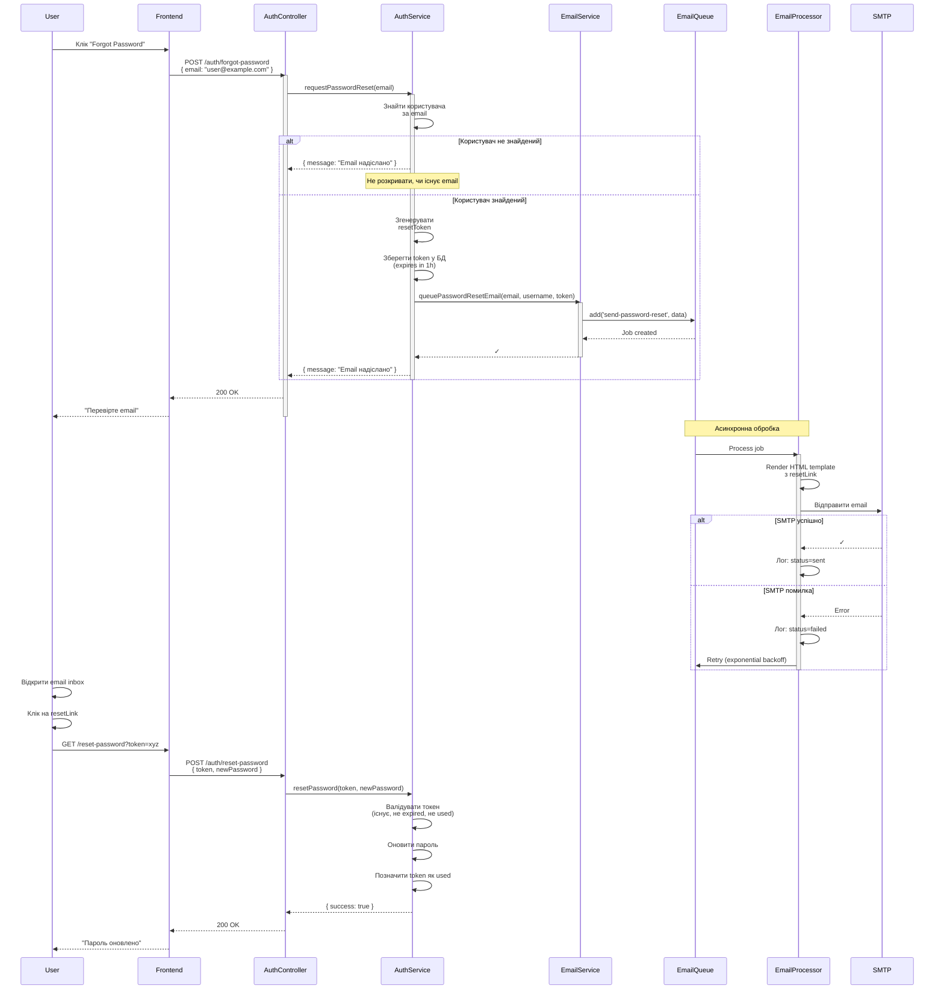

# Email нотифікації

## Короткий зміст

У цій лекції вивчається відправка email повідомлень через NestJS застосунок:

- **Бібліотека nodemailer** — популярна Node.js бібліотека для відправки email, підтримка SMTP, SendGrid, AWS SES, інших провайдерів
- **Інтеграція @nestjs-modules/mailer** — офіційний модуль для NestJS, wrapper над nodemailer з DI підтримкою, конфігурація через `MailerModule.forRoot()`
- **SMTP конфігурація** — налаштування SMTP сервера: host, port, secure (TLS), auth (user, password), приклади: Gmail SMTP, SendGrid SMTP, Mailgun, власний SMTP
- **HTML шаблони листів** — template engines: Handlebars, Pug, EJS для динамічних email, folder structure для шаблонів, передача змінних у template (username, verificationLink)
- **Відправка email** — MailerService з методом `sendMail()`, параметри: to, from, subject, template, context (дані для шаблону), attachments для файлів
- **Тестування email** — Mailtrap для dev середовища (fake SMTP), MailHog для локального тестування, перегляд відправлених email без реальної доставки
- **Best practices** — асинхронна відправка через черги (не блокувати HTTP request), retry logic при помилках SMTP, rate limiting для запобігання спаму, unsubscribe links для транзакційних email
- **Типи email** — welcome email після реєстрації, password reset, email verification, order confirmations, newsletter, promotional emails

Розглядаються практичні приклади: welcome email з шаблоном, password reset з токеном, email verification workflow, використання черг для масових розсилок.

---

::card-group

::card{title="🎯 Мета лекції" icon="i-lucide-target"}

- Інтегрувати nodemailer з NestJS через модуль `@nestjs-modules/mailer` для відправки email з dependency injection.
- Налаштувати SMTP конфігурацію для різних провайдерів: Gmail, SendGrid, AWS SES, Mailgun.
- Створити HTML шаблони листів з використанням Handlebars для динамічного контенту (username, verification links, reset tokens).
- Реалізувати транзакційні email: welcome letter, password reset, email verification з токенами та таймаутами.
- Використати Mailtrap та MailHog для тестування email у development середовищі без реальної відправки.
- Впровадити асинхронну відправку email через черги (Bull/BullMQ) для non-blocking HTTP requests.
- Застосувати best practices: retry logic, rate limiting, unsubscribe mechanisms, email logging та monitoring.

::

::card{title="🔑 Ключові терміни" icon="i-lucide-key"}

- **SMTP (Simple Mail Transfer Protocol):** протокол для відправки email між серверами, вимагає host, port, authentication credentials.
- **Transactional Email:** email, що відправляється у відповідь на дію користувача (реєстрація, reset пароля), на відміну від promotional (маркетинг).
- **Email Template Engine:** інструмент для генерації HTML з шаблонів та змінних (Handlebars, Pug, EJS), дозволяє динамічний контент.
- **SMTP Relay:** проміжний сервер для маршрутизації email (SendGrid, Mailgun), забезпечує deliverability, tracking, anti-spam.
- **SPF/DKIM/DMARC:** DNS записи для автентифікації відправника email, запобігання spam та phishing.
- **Mailtrap:** fake SMTP сервер для testing у dev середовищі, перехоплює email без доставки.

::

::

---

## Контекст: Від In-App до Email нотифікацій

У попередній лекції ми побудували систему **in-app нотифікацій** для real-time комунікації з online користувачами через WebSocket. Проте in-app нотифікації мають обмеження:

1. **Потребують активного користувача:** якщо користувач не відкрив застосунок, він не побачить нотифікацію.
2. **Короткочасні:** нотифікація може загубитися серед інших у списку.
3. **Не підходять для критичних подій:** password reset, email verification вимагають більш надійного каналу.

**Email нотифікації** вирішують ці проблеми:

- **Асинхронна доставка:** email доставляється незалежно від того, чи користувач online.
- **Довгочасне зберігання:** користувач може знайти email через години/дні.
- **Універсальність:** email доступний на всіх пристроях (desktop, mobile, tablet).
- **Офіційний характер:** для password reset, legal notices, invoices email є стандартом.

У цій лекції ми інтегруємо **nodemailer** з NestJS для відправки транзакційних email з HTML шаблонами, SMTP конфігурацією та асинхронною обробкою через черги.

---

## Nodemailer: Основи бібліотеки

**Nodemailer** — найпопулярніша Node.js бібліотека для відправки email (~4M завантажень/тиждень на npm). Підтримує:

- **SMTP транспорт:** прямий зв'язок з SMTP сервером (Gmail, SendGrid, власний сервер).
- **API транспорти:** інтеграція з AWS SES, SendGrid API, Mailgun API.
- **HTML та attachments:** відправка HTML листів з зображеннями, PDF, інших файлів.
- **Template engines:** інтеграція з Handlebars, Pug для динамічного контенту.

### Базовий приклад (без NestJS)

```typescript
import nodemailer from 'nodemailer';

// Створити SMTP transporter
const transporter = nodemailer.createTransport({
  host: 'smtp.gmail.com',
  port: 587,
  secure: false, // true для port 465, false для інших
  auth: {
    user: 'your-email@gmail.com',
    pass: 'your-app-password', // Не звичайний пароль, а App Password з Google Account
  },
});

// Відправити email
const info = await transporter.sendMail({
  from: '"My App" <noreply@myapp.com>',
  to: 'user@example.com',
  subject: 'Welcome to My App!',
  text: 'Hello, thank you for registering!',
  html: '<b>Hello</b>, thank you for registering!',
});

console.log('Email sent:', info.messageId);
```

**Ключові концепції:**

- **Transporter:** об'єкт з конфігурацією SMTP сервера, створюється один раз, використовується багато разів.
- **sendMail() метод:** приймає об'єкт з полями `from`, `to`, `subject`, `text` (plain text), `html` (HTML версія).
- **secure flag:** `true` для port 465 (implicit TLS), `false` для 587 (STARTTLS).

::warning
**Gmail Security:** Gmail блокує "less secure apps" за замовчуванням. Для nodemailer потрібно згенерувати **App Password** у Google Account Settings → Security → 2-Step Verification → App passwords.
::

---

## @nestjs-modules/mailer: Інтеграція з NestJS

Модуль `@nestjs-modules/mailer` надає **dependency injection** для nodemailer, дозволяє конфігурувати transporter через `forRoot()` та інжектити `MailerService` у сервіси.

### Установка

```bash
npm install @nestjs-modules/mailer nodemailer
npm install -D @types/nodemailer

# Для Handlebars template engine
npm install handlebars
```

### Базова конфігурація

```typescript
// src/app.module.ts
import { Module } from '@nestjs/common';
import { MailerModule } from '@nestjs-modules/mailer';
import { HandlebarsAdapter } from '@nestjs-modules/mailer/dist/adapters/handlebars.adapter';
import { join } from 'path';

@Module({
  imports: [
    MailerModule.forRoot({
      transport: {
        host: process.env.SMTP_HOST,
        port: parseInt(process.env.SMTP_PORT, 10),
        secure: process.env.SMTP_SECURE === 'true',
        auth: {
          user: process.env.SMTP_USER,
          pass: process.env.SMTP_PASS,
        },
      },
      defaults: {
        from: '"My App" <noreply@myapp.com>', // Default від кого
      },
      template: {
        dir: join(__dirname, '../templates/emails'), // Папка з шаблонами
        adapter: new HandlebarsAdapter(), // Handlebars для шаблонів
        options: {
          strict: true,
        },
      },
    }),
  ],
})
export class AppModule {}
```

### Environment Variables (.env)

```bash
# Gmail SMTP (для development)
SMTP_HOST=smtp.gmail.com
SMTP_PORT=587
SMTP_SECURE=false
SMTP_USER=your-email@gmail.com
SMTP_PASS=your-app-password

# SendGrid SMTP (для production)
# SMTP_HOST=smtp.sendgrid.net
# SMTP_PORT=587
# SMTP_USER=apikey
# SMTP_PASS=SG.your-sendgrid-api-key
```

::tip
**Environment-based config:** використовуйте `@nestjs/config` модуль для типобезпечного доступу до змінних середовища замість прямого `process.env`.
::

---

## SMTP провайдери: Порівняння

| Провайдер | Free Tier | Pricing (Paid) | Deliverability | Use Case |
|-----------|-----------|----------------|----------------|----------|
| **Gmail SMTP** | 500 emails/day | N/A (не для production) | Середня (може блокуватись) | Development, testing |
| **SendGrid** | 100 emails/day | $15/мес (40k emails) | Висока (95%+) | Transactional + marketing |
| **AWS SES** | 62k emails/мес (якщо надсилається з EC2) | $0.10 за 1000 emails | Висока | High-volume transactional |
| **Mailgun** | 5k emails/мес | $35/мес (50k emails) | Висока | Transactional, European servers |
| **Postmark** | Немає free tier | $15/мес (10k emails) | Дуже висока (98%+) | Premium transactional |
| **Mailtrap** | Необмежено | $10/мес (тестування + staging) | N/A (fake SMTP для testing) | Development only |

**Рекомендації:**

- **Development:** Gmail SMTP або Mailtrap (fake SMTP без реальної доставки).
- **Production (low volume):** SendGrid Free tier (100/day) або AWS SES.
- **Production (high volume):** AWS SES (найдешевший) або SendGrid/Mailgun (кращі UI + analytics).
- **Transactional-only:** Postmark (найкраща deliverability, але дорожче).

### Конфігурація для різних провайдерів

```typescript
// SendGrid SMTP
transport: {
  host: 'smtp.sendgrid.net',
  port: 587,
  auth: {
    user: 'apikey', // Завжди "apikey"
    pass: process.env.SENDGRID_API_KEY,
  },
}

// AWS SES SMTP
transport: {
  host: 'email-smtp.us-east-1.amazonaws.com',
  port: 587,
  auth: {
    user: process.env.AWS_SES_SMTP_USERNAME, // З AWS Console
    pass: process.env.AWS_SES_SMTP_PASSWORD,
  },
}

// Mailgun SMTP
transport: {
  host: 'smtp.mailgun.org',
  port: 587,
  auth: {
    user: process.env.MAILGUN_SMTP_USERNAME, // postmaster@yourdomain.mailgun.org
    pass: process.env.MAILGUN_SMTP_PASSWORD,
  },
}
```


---

## HTML Email шаблони з Handlebars

Handlebars — мінімалістичний template engine з синтаксисом `{{ variable }}` для підстановки змінних.

### Структура папки templates

```
src/
├── templates/
│   └── emails/
│       ├── welcome.hbs
│       ├── password-reset.hbs
│       ├── email-verification.hbs
│       └── partials/
│           ├── header.hbs
│           └── footer.hbs
```

### Приклад: Welcome Email шаблон

```handlebars
<!-- src/templates/emails/welcome.hbs -->
<!DOCTYPE html>
<html lang="uk">
<head>
  <meta charset="UTF-8">
  <meta name="viewport" content="width=device-width, initial-scale=1.0">
  <title>Ласкаво просимо до {{ appName }}!</title>
  <style>
    body {
      font-family: 'Segoe UI', Tahoma, Geneva, Verdana, sans-serif;
      background-color: #f4f4f4;
      margin: 0;
      padding: 0;
    }
    .container {
      max-width: 600px;
      margin: 40px auto;
      background-color: #ffffff;
      border-radius: 8px;
      overflow: hidden;
      box-shadow: 0 2px 4px rgba(0, 0, 0, 0.1);
    }
    .header {
      background: linear-gradient(135deg, #667eea 0%, #764ba2 100%);
      color: #ffffff;
      padding: 40px 20px;
      text-align: center;
    }
    .header h1 {
      margin: 0;
      font-size: 28px;
    }
    .content {
      padding: 40px 30px;
      color: #333333;
      line-height: 1.6;
    }
    .button {
      display: inline-block;
      padding: 14px 32px;
      background-color: #667eea;
      color: #ffffff;
      text-decoration: none;
      border-radius: 6px;
      font-weight: 600;
      margin-top: 20px;
    }
    .button:hover {
      background-color: #5568d3;
    }
    .footer {
      background-color: #f8f8f8;
      padding: 20px;
      text-align: center;
      font-size: 12px;
      color: #666666;
    }
  </style>
</head>
<body>
  <div class="container">
    <div class="header">
      <h1>Ласкаво просимо, {{ username }}! 🎉</h1>
    </div>
    <div class="content">
      <p>Привіт, <strong>{{ username }}</strong>!</p>
      <p>
        Дякуємо за реєстрацію в <strong>{{ appName }}</strong>. 
        Ми раді вітати вас у нашій спільноті!
      </p>
      <p>
        Щоб розпочати, натисніть кнопку нижче для підтвердження вашої email адреси:
      </p>
      <div style="text-align: center;">
        <a href="{{ verificationLink }}" class="button">
          Підтвердити Email
        </a>
      </div>
      <p style="margin-top: 30px; font-size: 14px; color: #666;">
        Якщо кнопка не працює, скопіюйте це посилання у браузер:<br>
        <a href="{{ verificationLink }}" style="color: #667eea;">{{ verificationLink }}</a>
      </p>
    </div>
    <div class="footer">
      <p>© 2026 {{ appName }}. Усі права захищені.</p>
      <p>
        Якщо ви не реєструвалися, проігноруйте цей лист.
      </p>
    </div>
  </div>
</body>
</html>
```

### Приклад: Password Reset шаблон

```handlebars
<!-- src/templates/emails/password-reset.hbs -->
<!DOCTYPE html>
<html lang="uk">
<head>
  <meta charset="UTF-8">
  <title>Скидання пароля</title>
  <style>
    body {
      font-family: Arial, sans-serif;
      background-color: #f4f4f4;
      margin: 0;
      padding: 0;
    }
    .container {
      max-width: 600px;
      margin: 40px auto;
      background-color: #ffffff;
      border-radius: 8px;
      overflow: hidden;
    }
    .header {
      background-color: #ff4757;
      color: #ffffff;
      padding: 30px 20px;
      text-align: center;
    }
    .content {
      padding: 40px 30px;
      color: #333333;
    }
    .button {
      display: inline-block;
      padding: 14px 32px;
      background-color: #ff4757;
      color: #ffffff;
      text-decoration: none;
      border-radius: 6px;
      font-weight: 600;
    }
    .warning {
      background-color: #fff3cd;
      border-left: 4px solid #ffc107;
      padding: 15px;
      margin: 20px 0;
    }
    .footer {
      background-color: #f8f8f8;
      padding: 20px;
      text-align: center;
      font-size: 12px;
      color: #666666;
    }
  </style>
</head>
<body>
  <div class="container">
    <div class="header">
      <h1>🔒 Скидання пароля</h1>
    </div>
    <div class="content">
      <p>Привіт, <strong>{{ username }}</strong>!</p>
      <p>
        Ми отримали запит на скидання пароля для вашого акаунта.
      </p>
      <div style="text-align: center;">
        <a href="{{ resetLink }}" class="button">
          Скинути пароль
        </a>
      </div>
      <div class="warning">
        <strong>⚠️ Важливо:</strong> Це посилання діє протягом <strong>{{ expiresIn }}</strong>.
        Після цього часу вам потрібно буде зробити новий запит.
      </div>
      <p style="font-size: 14px; color: #666;">
        Якщо ви не робили цей запит, проігноруйте цей лист. 
        Ваш пароль залишиться незмінним.
      </p>
      <p style="margin-top: 30px; font-size: 12px; color: #999;">
        Посилання для скидання:<br>
        <a href="{{ resetLink }}" style="color: #ff4757; word-break: break-all;">
          {{ resetLink }}
        </a>
      </p>
    </div>
    <div class="footer">
      <p>© 2026 {{ appName }}. Безпека — наш пріоритет.</p>
    </div>
  </div>
</body>
</html>
```

### Використання Partials (компонентів)

```handlebars
<!-- src/templates/emails/partials/header.hbs -->
<div class="header" style="background-color: {{ headerColor }}; color: #ffffff; padding: 30px;">
  <h1>{{ title }}</h1>
</div>

<!-- src/templates/emails/partials/footer.hbs -->
<div class="footer">
  <p>© {{ year }} {{ appName }}.</p>
  <p>
    <a href="{{ unsubscribeLink }}">Відписатися</a> | 
    <a href="{{ helpLink }}">Допомога</a>
  </p>
</div>
```

Реєстрація partials у MailerModule:

```typescript
import { HandlebarsAdapter } from '@nestjs-modules/mailer/dist/adapters/handlebars.adapter';

template: {
  dir: join(__dirname, '../templates/emails'),
  adapter: new HandlebarsAdapter({
    // Реєстрація partials
    partials: {
      dir: join(__dirname, '../templates/emails/partials'),
    },
  }),
  options: {
    strict: true,
  },
}
```

Використання у шаблоні:

```handlebars
{{> header title="Ласкаво просимо!" headerColor="#667eea" }}

<!-- Контент email -->

{{> footer appName="MyApp" year="2026" unsubscribeLink="..." helpLink="..." }}
```

---

## EmailService: Відправка листів

Створимо сервіс для відправки різних типів email.

```typescript
// src/email/email.service.ts
import { Injectable } from '@nestjs/common';
import { MailerService } from '@nestjs-modules/mailer';
import { ConfigService } from '@nestjs/config';

@Injectable()
export class EmailService {
  constructor(
    private mailerService: MailerService,
    private configService: ConfigService,
  ) {}

  /**
   * Відправити welcome email після реєстрації
   */
  async sendWelcomeEmail(email: string, username: string, verificationToken: string) {
    const verificationLink = `${this.configService.get('FRONTEND_URL')}/verify-email?token=${verificationToken}`;

    await this.mailerService.sendMail({
      to: email,
      subject: 'Ласкаво просимо! Підтвердіть ваш email',
      template: 'welcome', // Імʼя файлу без .hbs
      context: {
        username,
        appName: 'MyApp',
        verificationLink,
      },
    });

    console.log(`[EmailService] Welcome email відправлено на ${email}`);
  }

  /**
   * Відправити email для скидання пароля
   */
  async sendPasswordResetEmail(email: string, username: string, resetToken: string) {
    const resetLink = `${this.configService.get('FRONTEND_URL')}/reset-password?token=${resetToken}`;
    const expiresIn = '1 година';

    await this.mailerService.sendMail({
      to: email,
      subject: '🔒 Скидання пароля',
      template: 'password-reset',
      context: {
        username,
        appName: 'MyApp',
        resetLink,
        expiresIn,
      },
    });

    console.log(`[EmailService] Password reset email відправлено на ${email}`);
  }

  /**
   * Відправити email з verification кодом (для 2FA)
   */
  async sendVerificationCodeEmail(email: string, code: string) {
    await this.mailerService.sendMail({
      to: email,
      subject: 'Ваш код підтвердження',
      html: `
        <div style="font-family: Arial, sans-serif; padding: 40px; background-color: #f4f4f4;">
          <div style="max-width: 500px; margin: 0 auto; background-color: #ffffff; padding: 30px; border-radius: 8px;">
            <h2 style="color: #333;">Ваш код підтвердження</h2>
            <p>Використайте цей код для завершення входу:</p>
            <div style="background-color: #f0f0f0; padding: 20px; text-align: center; font-size: 32px; font-weight: bold; letter-spacing: 8px; margin: 20px 0;">
              ${code}
            </div>
            <p style="color: #666; font-size: 14px;">Код діє протягом 10 хвилин.</p>
          </div>
        </div>
      `,
    });

    console.log(`[EmailService] Verification code email відправлено на ${email}`);
  }

  /**
   * Відправити email з attachments
   */
  async sendInvoiceEmail(email: string, username: string, invoicePath: string) {
    await this.mailerService.sendMail({
      to: email,
      subject: 'Ваш рахунок',
      html: `
        <p>Привіт, ${username}!</p>
        <p>Дякуємо за ваше замовлення. У вкладенні ви знайдете рахунок.</p>
      `,
      attachments: [
        {
          filename: 'invoice.pdf',
          path: invoicePath,
          contentType: 'application/pdf',
        },
      ],
    });

    console.log(`[EmailService] Invoice email відправлено на ${email}`);
  }

  /**
   * Відправити plain text email (без HTML)
   */
  async sendPlainTextEmail(email: string, subject: string, text: string) {
    await this.mailerService.sendMail({
      to: email,
      subject,
      text, // Plain text версія
    });
  }

  /**
   * Відправити email кільком отримувачам
   */
  async sendBulkEmail(emails: string[], subject: string, template: string, context: any) {
    const promises = emails.map((email) =>
      this.mailerService.sendMail({
        to: email,
        subject,
        template,
        context,
      })
    );

    await Promise.all(promises);
    console.log(`[EmailService] Bulk email відправлено ${emails.length} отримувачам`);
  }
}
```

### Використання у інших модулях

```typescript
// src/auth/auth.service.ts
import { Injectable } from '@nestjs/common';
import { EmailService } from '../email/email.service';
import { randomBytes } from 'crypto';

@Injectable()
export class AuthService {
  constructor(private emailService: EmailService) {}

  async register(email: string, username: string, password: string) {
    // Створити користувача у БД...
    
    // Згенерувати verification token
    const verificationToken = randomBytes(32).toString('hex');
    await this.saveVerificationToken(email, verificationToken);

    // Відправити welcome email
    await this.emailService.sendWelcomeEmail(email, username, verificationToken);

    return { message: 'Реєстрація успішна. Перевірте email для підтвердження.' };
  }

  async requestPasswordReset(email: string) {
    const user = await this.findUserByEmail(email);

    if (!user) {
      // Не розкривати, чи існує email
      return { message: 'Якщо email існує, ми відправили інструкції.' };
    }

    // Згенерувати reset token
    const resetToken = randomBytes(32).toString('hex');
    const expiresAt = new Date(Date.now() + 60 * 60 * 1000); // 1 година

    await this.saveResetToken(user.id, resetToken, expiresAt);

    // Відправити email
    await this.emailService.sendPasswordResetEmail(email, user.username, resetToken);

    return { message: 'Інструкції відправлені на email.' };
  }
}
```

---

## Тестування email: Mailtrap та MailHog

### Mailtrap: Fake SMTP для development

**Mailtrap** — online сервіс, що емулює SMTP сервер та перехоплює всі email без реальної доставки. Ідеально для testing.

**Налаштування:**

1. Зареєструватися на [mailtrap.io](https://mailtrap.io/)
2. Створити inbox, отримати SMTP credentials
3. Додати у `.env`:

```bash
SMTP_HOST=sandbox.smtp.mailtrap.io
SMTP_PORT=2525
SMTP_USER=your-mailtrap-username
SMTP_PASS=your-mailtrap-password
```

**Переваги:**
- UI для перегляду відправлених email
- Тестування HTML rendering
- Spam score аналіз
- Forwarding на реальний email (для testing)

### MailHog: Локальний fake SMTP

**MailHog** — self-hosted SMTP сервер для local development.

**Установка (Docker):**

```bash
docker run -d -p 1025:1025 -p 8025:8025 mailhog/mailhog
```

**Налаштування:**

```bash
SMTP_HOST=localhost
SMTP_PORT=1025
SMTP_SECURE=false
SMTP_USER= # Порожньо
SMTP_PASS= # Порожньо
```

**Web UI:** `http://localhost:8025`

**Переваги:**
- Повністю локальний (без інтернету)
- Безкоштовний та open-source
- Миттєва доставка (немає затримок SMTP)

::tip
**Development strategy:** використовуйте Mailtrap для staging середовища (shared з командою) та MailHog для локального development (кожен developer свій instance).
::

---

## Асинхронна відправка через черги

Відправка email через SMTP може зайняти **секунди** (особливо з зовнішніми провайдерами). Це **блокує HTTP response** та погіршує UX.

**Рішення:** відправляти email **асинхронно через черги** (Bull/BullMQ з Redis).

### Установка Bull

```bash
npm install @nestjs/bull bull
npm install @nestjs/redis ioredis
```

### Конфігурація BullModule

```typescript
// src/app.module.ts
import { BullModule } from '@nestjs/bull';

@Module({
  imports: [
    BullModule.forRoot({
      redis: {
        host: process.env.REDIS_HOST || 'localhost',
        port: parseInt(process.env.REDIS_PORT, 10) || 6379,
      },
    }),
    BullModule.registerQueue({
      name: 'email', // Імʼя черги
    }),
    // інші модулі...
  ],
})
export class AppModule {}
```

### Email Queue Producer

```typescript
// src/email/email.service.ts
import { InjectQueue } from '@nestjs/bull';
import { Queue } from 'bull';

@Injectable()
export class EmailService {
  constructor(
    @InjectQueue('email') private emailQueue: Queue,
    private mailerService: MailerService,
  ) {}

  /**
   * Додати email у чергу (non-blocking)
   */
  async queueWelcomeEmail(email: string, username: string, verificationToken: string) {
    await this.emailQueue.add('send-welcome', {
      email,
      username,
      verificationToken,
    });

    console.log(`[EmailService] Welcome email додано у чергу для ${email}`);
  }

  async queuePasswordResetEmail(email: string, username: string, resetToken: string) {
    await this.emailQueue.add('send-password-reset', {
      email,
      username,
      resetToken,
    });
  }
}
```

### Email Queue Consumer

```typescript
// src/email/email.processor.ts
import { Process, Processor } from '@nestjs/bull';
import { Job } from 'bull';
import { MailerService } from '@nestjs-modules/mailer';
import { ConfigService } from '@nestjs/config';

@Processor('email')
export class EmailProcessor {
  constructor(
    private mailerService: MailerService,
    private configService: ConfigService,
  ) {}

  @Process('send-welcome')
  async handleWelcomeEmail(job: Job) {
    const { email, username, verificationToken } = job.data;

    const verificationLink = `${this.configService.get('FRONTEND_URL')}/verify-email?token=${verificationToken}`;

    try {
      await this.mailerService.sendMail({
        to: email,
        subject: 'Ласкаво просимо!',
        template: 'welcome',
        context: {
          username,
          appName: 'MyApp',
          verificationLink,
        },
      });

      console.log(`[EmailProcessor] Welcome email відправлено на ${email}`);
    } catch (error) {
      console.error(`[EmailProcessor] Помилка відправки email на ${email}:`, error);
      throw error; // Bull автоматично retry
    }
  }

  @Process('send-password-reset')
  async handlePasswordResetEmail(job: Job) {
    const { email, username, resetToken } = job.data;

    const resetLink = `${this.configService.get('FRONTEND_URL')}/reset-password?token=${resetToken}`;

    try {
      await this.mailerService.sendMail({
        to: email,
        subject: 'Скидання пароля',
        template: 'password-reset',
        context: {
          username,
          appName: 'MyApp',
          resetLink,
          expiresIn: '1 година',
        },
      });

      console.log(`[EmailProcessor] Password reset email відправлено на ${email}`);
    } catch (error) {
      console.error(`[EmailProcessor] Помилка відправки email:`, error);
      throw error;
    }
  }
}
```

### Retry та Error Handling

```typescript
// Додати job з retry options
await this.emailQueue.add(
  'send-welcome',
  { email, username, verificationToken },
  {
    attempts: 3, // Максимум 3 спроби
    backoff: {
      type: 'exponential',
      delay: 2000, // Початкова затримка 2 секунди
    },
    removeOnComplete: true, // Видалити успішний job
    removeOnFail: false, // Зберегти failed job для debugging
  }
);
```

**Bull автоматично:**
- Retry job при помилці (до `attempts` разів)
- Exponential backoff (2s, 4s, 8s, ...)
- Persistence у Redis (якщо сервер crash, jobs не губляться)


---

## Email Verification Workflow

Повний workflow підтвердження email з токенами та таймаутами.

### Backend: Генерація та збереження токена

```typescript
// src/auth/entities/email-verification-token.entity.ts
import { Entity, PrimaryGeneratedColumn, Column, CreateDateColumn } from 'typeorm';

@Entity('email_verification_tokens')
export class EmailVerificationToken {
  @PrimaryGeneratedColumn('uuid')
  id: string;

  @Column()
  userId: number;

  @Column({ unique: true })
  token: string;

  @Column({ type: 'timestamp' })
  expiresAt: Date;

  @Column({ default: false })
  isUsed: boolean;

  @CreateDateColumn()
  createdAt: Date;
}
```

```typescript
// src/auth/auth.service.ts
import { randomBytes } from 'crypto';

async createEmailVerificationToken(userId: number): Promise<string> {
  const token = randomBytes(32).toString('hex');
  const expiresAt = new Date(Date.now() + 24 * 60 * 60 * 1000); // 24 години

  await this.verificationTokenRepository.save({
    userId,
    token,
    expiresAt,
  });

  return token;
}

async verifyEmail(token: string): Promise<{ success: boolean; message: string }> {
  const tokenRecord = await this.verificationTokenRepository.findOne({
    where: { token },
    relations: ['user'],
  });

  if (!tokenRecord) {
    return { success: false, message: 'Невалідний токен' };
  }

  if (tokenRecord.isUsed) {
    return { success: false, message: 'Токен вже використаний' };
  }

  if (new Date() > tokenRecord.expiresAt) {
    return { success: false, message: 'Токен прострочений. Запросіть новий.' };
  }

  // Позначити користувача як verified
  await this.userRepository.update(tokenRecord.userId, { isEmailVerified: true });

  // Позначити токен як використаний
  tokenRecord.isUsed = true;
  await this.verificationTokenRepository.save(tokenRecord);

  console.log(`Email підтверджено для користувача ${tokenRecord.userId}`);

  return { success: true, message: 'Email успішно підтверджено!' };
}
```

### Frontend: Обробка посилання

```typescript
// src/pages/VerifyEmail.tsx
import React, { useEffect, useState } from 'react';
import { useSearchParams, useNavigate } from 'react-router-dom';

export function VerifyEmailPage() {
  const [searchParams] = useSearchParams();
  const navigate = useNavigate();
  const [status, setStatus] = useState<'loading' | 'success' | 'error'>('loading');
  const [message, setMessage] = useState('');

  useEffect(() => {
    const token = searchParams.get('token');

    if (!token) {
      setStatus('error');
      setMessage('Відсутній токен підтвердження');
      return;
    }

    // Відправити запит на backend
    fetch(`http://localhost:3000/auth/verify-email?token=${token}`)
      .then((res) => res.json())
      .then((data) => {
        if (data.success) {
          setStatus('success');
          setMessage(data.message);
          setTimeout(() => navigate('/login'), 3000); // Redirect через 3 секунди
        } else {
          setStatus('error');
          setMessage(data.message);
        }
      })
      .catch((error) => {
        setStatus('error');
        setMessage('Помилка підтвердження email');
        console.error(error);
      });
  }, [searchParams, navigate]);

  return (
    <div className="flex items-center justify-center min-h-screen bg-gray-100">
      <div className="max-w-md w-full bg-white rounded-lg shadow-lg p-8">
        {status === 'loading' && (
          <div className="text-center">
            <div className="animate-spin rounded-full h-12 w-12 border-b-2 border-blue-500 mx-auto"></div>
            <p className="mt-4 text-gray-600">Підтвердження email...</p>
          </div>
        )}

        {status === 'success' && (
          <div className="text-center">
            <div className="text-green-500 text-6xl mb-4">✓</div>
            <h2 className="text-2xl font-bold text-gray-800 mb-2">Успішно!</h2>
            <p className="text-gray-600">{message}</p>
            <p className="text-sm text-gray-500 mt-4">
              Перенаправлення на сторінку входу...
            </p>
          </div>
        )}

        {status === 'error' && (
          <div className="text-center">
            <div className="text-red-500 text-6xl mb-4">✗</div>
            <h2 className="text-2xl font-bold text-gray-800 mb-2">Помилка</h2>
            <p className="text-gray-600">{message}</p>
            <button
              onClick={() => navigate('/resend-verification')}
              className="mt-6 px-6 py-2 bg-blue-500 text-white rounded hover:bg-blue-600"
            >
              Запросити новий лист
            </button>
          </div>
        )}
      </div>
    </div>
  );
}
```

### Resend Verification Email

```typescript
// src/auth/auth.controller.ts
@Post('resend-verification')
async resendVerificationEmail(@Body('email') email: string) {
  const user = await this.authService.findUserByEmail(email);

  if (!user) {
    // Не розкривати, чи існує email
    return { message: 'Якщо email існує, ми відправили лист.' };
  }

  if (user.isEmailVerified) {
    return { message: 'Email вже підтверджено.' };
  }

  // Створити новий токен
  const token = await this.authService.createEmailVerificationToken(user.id);

  // Відправити email
  await this.emailService.queueWelcomeEmail(email, user.username, token);

  return { message: 'Лист з підтвердженням відправлено.' };
}
```

---

## Best Practices для Email відправки

### 1. Rate Limiting

Запобігти spam та abuse:

```typescript
// src/email/guards/email-rate-limit.guard.ts
import { Injectable, CanActivate, ExecutionContext, HttpException } from '@nestjs/common';
import { InjectRedis } from '@liaoliaots/nestjs-redis';
import Redis from 'ioredis';

@Injectable()
export class EmailRateLimitGuard implements CanActivate {
  constructor(@InjectRedis() private redis: Redis) {}

  async canActivate(context: ExecutionContext): Promise<boolean> {
    const request = context.switchToHttp().getRequest();
    const email = request.body.email;

    if (!email) {
      return true;
    }

    const key = `email-rate-limit:${email}`;
    const count = await this.redis.incr(key);

    if (count === 1) {
      await this.redis.expire(key, 3600); // 1 година TTL
    }

    // Максимум 3 email за годину на один email
    if (count > 3) {
      throw new HttpException(
        'Забагато запитів. Спробуйте пізніше.',
        429
      );
    }

    return true;
  }
}

// Використання у контролері
@Post('resend-verification')
@UseGuards(EmailRateLimitGuard)
async resendVerificationEmail(@Body('email') email: string) {
  // ...
}
```

### 2. Email Logging та Monitoring

```typescript
// src/email/entities/email-log.entity.ts
@Entity('email_logs')
export class EmailLog {
  @PrimaryGeneratedColumn('uuid')
  id: string;

  @Column()
  recipient: string;

  @Column()
  subject: string;

  @Column()
  template: string;

  @Column({ type: 'enum', enum: ['pending', 'sent', 'failed'] })
  status: string;

  @Column({ type: 'text', nullable: true })
  errorMessage?: string;

  @CreateDateColumn()
  createdAt: Date;

  @Column({ type: 'timestamp', nullable: true })
  sentAt?: Date;
}
```

```typescript
// src/email/email.processor.ts
@Process('send-welcome')
async handleWelcomeEmail(job: Job) {
  const { email, username } = job.data;

  // Створити лог запис
  const log = await this.emailLogRepository.save({
    recipient: email,
    subject: 'Ласкаво просимо!',
    template: 'welcome',
    status: 'pending',
  });

  try {
    await this.mailerService.sendMail({
      to: email,
      subject: 'Ласкаво просимо!',
      template: 'welcome',
      context: { username, appName: 'MyApp' },
    });

    // Оновити статус на sent
    log.status = 'sent';
    log.sentAt = new Date();
    await this.emailLogRepository.save(log);

    console.log(`[EmailProcessor] Email відправлено на ${email}`);
  } catch (error) {
    // Оновити статус на failed
    log.status = 'failed';
    log.errorMessage = error.message;
    await this.emailLogRepository.save(log);

    throw error; // Bull retry
  }
}
```

### 3. Unsubscribe Mechanism

Для транзакційних email (password reset, verification) unsubscribe не потрібен, але для **promotional** та **newsletter** email — це **legal requirement** (GDPR, CAN-SPAM Act).

```typescript
// src/users/entities/email-preferences.entity.ts
@Entity('email_preferences')
export class EmailPreferences {
  @PrimaryGeneratedColumn()
  id: number;

  @Column()
  userId: number;

  @Column({ default: true })
  receiveNewsletter: boolean;

  @Column({ default: true })
  receivePromotions: boolean;

  @Column({ unique: true })
  unsubscribeToken: string; // Унікальний токен для unsubscribe link
}
```

```typescript
// src/email/email.service.ts
async sendNewsletterEmail(email: string, username: string, unsubscribeToken: string) {
  const unsubscribeLink = `${this.configService.get('BACKEND_URL')}/email/unsubscribe?token=${unsubscribeToken}`;

  await this.mailerService.sendMail({
    to: email,
    subject: 'Щотижневий дайджест',
    template: 'newsletter',
    context: {
      username,
      articles: [...],
      unsubscribeLink,
    },
  });
}
```

```typescript
// src/email/email.controller.ts
@Get('unsubscribe')
async unsubscribe(@Query('token') token: string) {
  const preferences = await this.preferencesRepository.findOne({
    where: { unsubscribeToken: token },
  });

  if (!preferences) {
    return { message: 'Невалідне посилання' };
  }

  // Вимкнути всі promotional email
  preferences.receiveNewsletter = false;
  preferences.receivePromotions = false;
  await this.preferencesRepository.save(preferences);

  return { message: 'Ви успішно відписалися від розсилки.' };
}
```

### 4. Inline CSS для Email

Email clients (Gmail, Outlook) мають обмежену підтримку CSS. **Best practice:** використовувати inline CSS.

**Tool:** [Juice](https://www.npmjs.com/package/juice) — конвертує `<style>` теги у inline CSS.

```bash
npm install juice
```

```typescript
// src/email/email.processor.ts
import juice from 'juice';

async handleWelcomeEmail(job: Job) {
  const html = await this.renderTemplate('welcome', context);
  const inlinedHtml = juice(html); // Конвертувати CSS у inline

  await this.mailerService.sendMail({
    to: email,
    subject: 'Ласкаво просимо!',
    html: inlinedHtml,
  });
}
```

### 5. Email Preview Text

**Preheader** — текст, що відображається після subject у inbox preview.

```handlebars
<!-- src/templates/emails/welcome.hbs -->
<!DOCTYPE html>
<html>
<head>
  <meta charset="UTF-8">
  <title>Ласкаво просимо!</title>
  
  <!-- Preview text (не відображається у email body) -->
  <div style="display:none;font-size:1px;color:#ffffff;line-height:1px;max-height:0px;max-width:0px;opacity:0;overflow:hidden;">
    Підтвердіть ваш email та розпочніть користуватися всіма функціями {{ appName }}!
  </div>
</head>
<body>
  <!-- Email content -->
</body>
</html>
```

### 6. SPF, DKIM, DMARC налаштування

Для покращення **deliverability** (шанс потрапити у inbox, а не spam):

**SPF (Sender Policy Framework):** DNS запис, що вказує, які IP можуть відправляти email від вашого домену.

```
// DNS TXT record для yourdomain.com
v=spf1 include:_spf.google.com include:sendgrid.net ~all
```

**DKIM (DomainKeys Identified Mail):** цифровий підпис email для верифікації відправника.

**DMARC (Domain-based Message Authentication):** політика обробки email, що не пройшли SPF/DKIM.

```
// DNS TXT record для _dmarc.yourdomain.com
v=DMARC1; p=quarantine; rua=mailto:dmarc-reports@yourdomain.com
```

::note
**SendGrid/Mailgun автоматично налаштовують** SPF/DKIM для вашого домену через їх UI. Для власного SMTP сервера потрібна ручна конфігурація.
::

---

## Діаграма потоку: Password Reset Email

::mermaid



::

---

## Порівняння: Transactional vs Marketing Email

| Критерій | Transactional Email | Marketing/Promotional Email |
|----------|---------------------|----------------------------|
| **Тригер** | Дія користувача (реєстрація, reset) | Scheduled campaigns |
| **Персоналізація** | Висока (username, specific data) | Середня (сегментація) |
| **Deliverability priority** | Критична (має дійти негайно) | Середня |
| **Unsubscribe requirement** | Не потрібен | **Обов'язковий** (GDPR, CAN-SPAM) |
| **Volume** | Низький (за потребою) | Високий (масові розсилки) |
| **Content** | Функціональний (link, code, info) | Маркетинговий (offers, news) |
| **Rate limiting** | Менш критичний | Критичний (anti-spam) |
| **Провайдери** | Postmark, AWS SES | SendGrid, Mailchimp, Klaviyo |
| **Метрики** | Delivery rate, bounce rate | Open rate, click rate, conversion |

**Рекомендація:** використовувати **окремі SMTP/API credentials** для transactional та marketing email. Це дозволяє:
- Ізолювати reputation (якщо marketing email потрапить у spam, transactional не постраждає)
- Різні rate limits
- Окремий monitoring та analytics

---

## Висновки

Email нотифікації — **критична частина** більшості веб-застосунків для **транзакційних подій** (password reset, email verification) та **довгочасної комунікації** з користувачами.

1. **Nodemailer** — стандарт для відправки email у Node.js з підтримкою SMTP та API транспортів.

2. **@nestjs-modules/mailer** надає **dependency injection** та інтеграцію з Handlebars для HTML шаблонів.

3. **SMTP провайдери:** Gmail для dev, SendGrid/AWS SES/Mailgun для production з високою deliverability.

4. **HTML шаблони** з Handlebars дозволяють динамічний контент (username, links, verification codes) з reusable partials.

5. **Mailtrap та MailHog** — ідеальні інструменти для **testing email** у dev середовищі без реальної доставки.

6. **Асинхронна відправка через черги** (Bull/BullMQ) запобігає блокуванню HTTP requests, забезпечує retry logic та persistence.

7. **Best practices:** rate limiting для anti-spam, email logging для monitoring, unsubscribe mechanisms для legal compliance, SPF/DKIM/DMARC для deliverability.

8. **Email verification workflow** з токенами та таймаутами забезпечує security та валідацію користувачів.

У наступній лекції ми розглянемо **Web Push нотифікації** через Service Workers та Web Push API для доставки повідомлень у браузер навіть коли сайт закритий.

::note
**Практичне завдання:** реалізувати **email digest** систему, що раз на тиждень відправляє користувачу summary активності (нові followers, comments, likes) з використанням cron job та HTML шаблону з динамічним списком подій.
::
