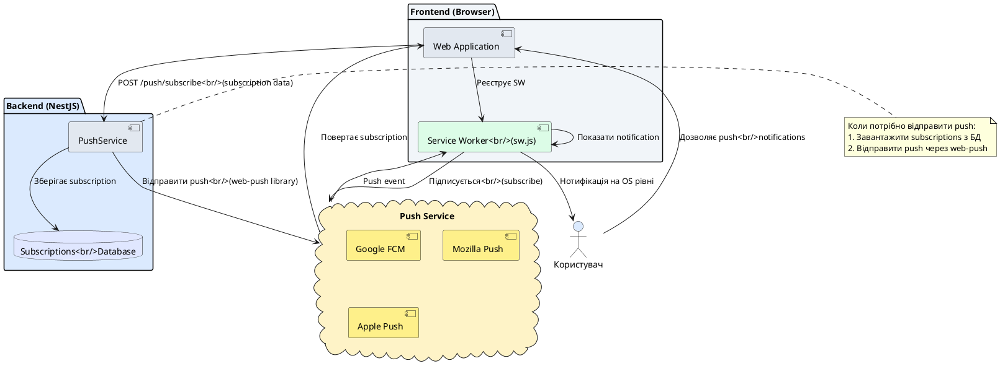
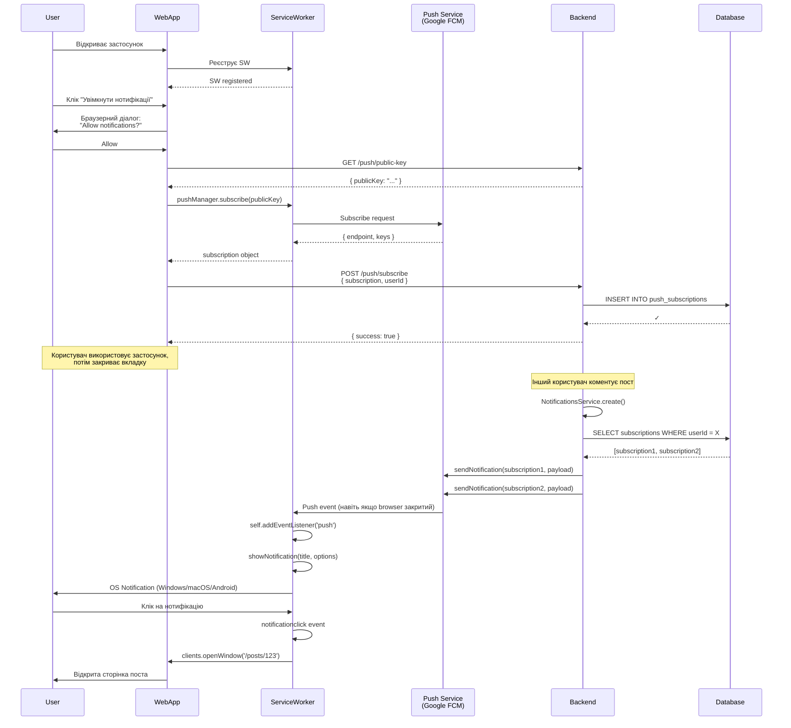

# Web Push нотифікації

## Короткий зміст

У цій лекції розглядається реалізація браузерних push-нотифікацій через Web Push API:

- **Web Push API** — стандарт для відправки нотифікацій у браузер навіть коли сайт закритий, підтримка Chrome, Firefox, Edge, Safari (з iOS 16.4+)
- **Service Workers** — фоновий скрипт для отримання push подій, реєстрація Service Worker, обробка події 'push', показ notification через Notification API
- **VAPID ключі** — пара public/private ключів для автентифікації push сервера, генерація через `web-push generate-vapid-keys`, публічний ключ передається на frontend, приватний — на backend
- **Бібліотека web-push** — Node.js бібліотека для відправки push через Web Push Protocol, метод `sendNotification(subscription, payload, options)`
- **Push subscription** — об'єкт з endpoint та keys (p256dh, auth), отримується на frontend через `serviceWorkerRegistration.pushManager.subscribe()`, передається на backend для збереження
- **Subscription management** — Entity для зберігання subscriptions (userId, endpoint, keys, device info), CRUD операції: create subscription при subscribe, delete при unsubscribe
- **Відправка push** — метод у Service для відправки push всім subscriptions користувача, payload у форматі JSON з title, body, icon, badge, actions
- **Permissions** — запит дозволу на нотифікації через `Notification.requestPermission()`, handling відмови, re-request logic

Розглядаються практичні приклади: підписка на push при вході, відправка push при новому повідомленні, click handling у Service Worker, deep links у застосунок, fallback для браузерів без підтримки.

---

::card-group

::card{title="🎯 Мета лекції" icon="i-lucide-target"}

- Зрозуміти архітектуру Web Push API: Service Worker як проміжна ланка між сервером та браузером.
- Згенерувати VAPID ключі для автентифікації push сервера через `web-push generate-vapid-keys`.
- Зареєструвати Service Worker на frontend та підписати користувача на push нотифікації через PushManager API.
- Створити Push Subscription Entity у NestJS для збереження subscriptions з userId, endpoint, p256dh/auth keys.
- Інтегрувати бібліотеку `web-push` для відправки push нотифікацій з backend до браузера через Web Push Protocol.
- Реалізувати обробку push подій у Service Worker: `self.addEventListener('push')` для показу notification.
- Впровадити click handling у нотифікаціях для deep links та відкриття конкретних сторінок застосунку.
- Застосувати best practices: permission UI/UX, subscription renewal, fallback для Safari iOS, error handling для expired subscriptions.

::

::card{title="🔑 Ключові терміни" icon="i-lucide-key"}

- **Service Worker:** JavaScript скрипт, що працює у фоновому режимі браузера незалежно від веб-сторінки, може отримувати push події навіть коли сайт закритий.
- **VAPID (Voluntary Application Server Identification):** стандарт автентифікації push сервера через пару public/private ключів для запобігання spam.
- **Push Subscription:** об'єкт з унікальним endpoint (URL push сервісу браузера) та encryption keys для безпечної доставки.
- **PushManager API:** браузерний API для управління підписками на push нотифікації (`subscribe()`, `getSubscription()`, `unsubscribe()`).
- **Web Push Protocol:** протокол для доставки push повідомлень від application server до push service (Google FCM, Mozilla Push Service).
- **Notification API:** браузерний API для відображення нотифікацій з title, body, icon, badge, actions.

::

::

---

## Контекст: Від Email до Browser Push

У попередній лекції ми реалізували **email нотифікації** для асинхронної доставки повідомлень користувачам. Email підходить для **довгочасної комунікації** та **офіційних повідомлень**, але має недоліки:

1. **Затримка доставки:** SMTP доставка може зайняти секунди-хвилини.
2. **Низький engagement:** користувачі не завжди перевіряють email негайно.
3. **Обмежена інтерактивність:** email не підходить для time-sensitive подій (нове повідомлення у чаті, live update).

**Web Push нотифікації** вирішують ці проблеми:

- **Миттєва доставка:** push доставляється за секунди через браузерний push service.
- **Працює offline:** Service Worker отримує push навіть коли вкладка застосунку закрита або браузер згорнутий.
- **Високий engagement:** нотифікація відображається на рівні OS (Windows Action Center, macOS Notification Center).
- **Інтерактивність:** actions у нотифікації (Reply, Like, Dismiss) для швидкої відповіді.

У цій лекції ми інтегруємо **Web Push API** з NestJS backend та React frontend для відправки браузерних push нотифікацій.

---

## Web Push архітектура: Огляд компонентів

Web Push система складається з **чотирьох компонентів**:

::plant-uml{alt="Web Push архітектура"}



::

### Компоненти системи

| Компонент | Відповідальність | Технології |
|-----------|------------------|------------|
| **Web Application** | Запит permission, реєстрація Service Worker, підписка на push | React, PushManager API |
| **Service Worker** | Фоновий скрипт для отримання push подій та показу notifications | JavaScript (sw.js) |
| **Push Service (Cloud)** | Проміжний сервіс браузера для доставки push | Google FCM, Mozilla Push, Apple Push |
| **Backend (NestJS)** | Зберігання subscriptions, відправка push через web-push | web-push library, TypeORM |
| **Subscriptions Database** | Persistence subscriptions (userId, endpoint, keys) | PostgreSQL |

**Важливо:** Backend **не відправляє push безпосередньо** до браузера. Замість цього Backend → Push Service → Service Worker → Browser Notification.

---

## VAPID ключі: Генерація та налаштування

**VAPID (Voluntary Application Server Identification)** — стандарт автентифікації application server через public/private ключі. Push Service (Google FCM, Mozilla) вимагає VAPID для запобігання spam.

### Генерація VAPID ключів

```bash
# Встановити web-push CLI
npm install -g web-push

# Згенерувати ключі
web-push generate-vapid-keys
```

**Вивід:**

```
=======================================

Public Key:
BEl62iUYgUivxIkv69yViEuiBIa-Ib27SDbQjfTkIhsAj5H_8d8GCfEZ...

Private Key:
3JZfPd6IVZ8oSMuC2B7nt3WhxdXNT9yxcf3gNEkN...

=======================================
```

### Додати у .env

```bash
# VAPID Keys для Web Push
VAPID_PUBLIC_KEY=BEl62iUYgUivxIkv69yViEuiBIa-Ib27SDbQjfTkIhsAj5H_8d8GCfEZ...
VAPID_PRIVATE_KEY=3JZfPd6IVZ8oSMuC2B7nt3WhxdXNT9yxcf3gNEkN...
VAPID_SUBJECT=mailto:admin@myapp.com  # Email або URL застосунку
```

::warning
**Security:** Private Key має зберігатися **виключно на backend** та **ніколи не передаватися** на frontend. Public Key передається на frontend для підписки.
::

---

## Backend: Subscription Entity та Service

### Установка web-push

```bash
npm install web-push
npm install -D @types/web-push
```

### Push Subscription Entity

```typescript
// src/push/entities/push-subscription.entity.ts
import {
  Entity,
  PrimaryGeneratedColumn,
  Column,
  ManyToOne,
  JoinColumn,
  CreateDateColumn,
  Index,
} from 'typeorm';
import { User } from '../../users/entities/user.entity';

@Entity('push_subscriptions')
@Index(['userId']) // Індекс для швидкого пошуку subscriptions користувача
@Index(['endpoint'], { unique: true }) // Унікальний endpoint (один браузер = одна підписка)
export class PushSubscription {
  @PrimaryGeneratedColumn('uuid')
  id: string;

  @Column()
  userId: number;

  @ManyToOne(() => User, { onDelete: 'CASCADE' })
  @JoinColumn({ name: 'userId' })
  user: User;

  // Унікальний URL push сервісу браузера
  @Column({ type: 'text', unique: true })
  endpoint: string;

  // Encryption keys для безпечної доставки
  @Column({ type: 'text' })
  p256dh: string; // Public key для шифрування

  @Column({ type: 'text' })
  auth: string; // Authentication secret

  // Metadata для аналітики
  @Column({ nullable: true })
  userAgent?: string;

  @Column({ nullable: true })
  deviceType?: string; // 'desktop', 'mobile', 'tablet'

  @CreateDateColumn()
  createdAt: Date;

  @Column({ type: 'timestamp', nullable: true })
  lastUsedAt?: Date; // Оновлюється при кожній успішній відправці
}
```

### PushService: Управління підписками

```typescript
// src/push/push.service.ts
import { Injectable, NotFoundException } from '@nestjs/common';
import { InjectRepository } from '@nestjs/typeorm';
import { Repository } from 'typeorm';
import { PushSubscription } from './entities/push-subscription.entity';
import webpush from 'web-push';
import { ConfigService } from '@nestjs/config';

interface SubscribeDto {
  userId: number;
  subscription: {
    endpoint: string;
    keys: {
      p256dh: string;
      auth: string;
    };
  };
  userAgent?: string;
  deviceType?: string;
}

interface PushPayload {
  title: string;
  body: string;
  icon?: string;
  badge?: string;
  image?: string;
  data?: any;
  actions?: Array<{ action: string; title: string; icon?: string }>;
}

@Injectable()
export class PushService {
  constructor(
    @InjectRepository(PushSubscription)
    private subscriptionRepository: Repository<PushSubscription>,
    private configService: ConfigService,
  ) {
    // Налаштувати web-push з VAPID ключами
    webpush.setVapidDetails(
      this.configService.get('VAPID_SUBJECT'),
      this.configService.get('VAPID_PUBLIC_KEY'),
      this.configService.get('VAPID_PRIVATE_KEY'),
    );
  }

  /**
   * Створити або оновити subscription
   */
  async subscribe(dto: SubscribeDto): Promise<PushSubscription> {
    // Перевірити, чи вже існує subscription з цим endpoint
    let subscription = await this.subscriptionRepository.findOne({
      where: { endpoint: dto.subscription.endpoint },
    });

    if (subscription) {
      // Оновити userId (якщо користувач перелогінився)
      subscription.userId = dto.userId;
      subscription.lastUsedAt = new Date();
    } else {
      // Створити нову subscription
      subscription = this.subscriptionRepository.create({
        userId: dto.userId,
        endpoint: dto.subscription.endpoint,
        p256dh: dto.subscription.keys.p256dh,
        auth: dto.subscription.keys.auth,
        userAgent: dto.userAgent,
        deviceType: dto.deviceType,
      });
    }

    return this.subscriptionRepository.save(subscription);
  }

  /**
   * Відписатися від push нотифікацій
   */
  async unsubscribe(endpoint: string): Promise<void> {
    await this.subscriptionRepository.delete({ endpoint });
    console.log(`[PushService] Subscription видалено: ${endpoint}`);
  }

  /**
   * Отримати всі subscriptions користувача
   */
  async getUserSubscriptions(userId: number): Promise<PushSubscription[]> {
    return this.subscriptionRepository.find({
      where: { userId },
    });
  }

  /**
   * Відправити push нотифікацію конкретному користувачу
   */
  async sendToUser(userId: number, payload: PushPayload): Promise<void> {
    const subscriptions = await this.getUserSubscriptions(userId);

    if (subscriptions.length === 0) {
      console.log(`[PushService] Користувач ${userId} не має push subscriptions`);
      return;
    }

    const promises = subscriptions.map((sub) =>
      this.sendToSubscription(sub, payload)
    );

    await Promise.allSettled(promises);
    console.log(`[PushService] Push відправлено на ${subscriptions.length} пристроїв`);
  }

  /**
   * Відправити push нотифікацію конкретній subscription
   */
  private async sendToSubscription(
    subscription: PushSubscription,
    payload: PushPayload,
  ): Promise<void> {
    const pushSubscription = {
      endpoint: subscription.endpoint,
      keys: {
        p256dh: subscription.p256dh,
        auth: subscription.auth,
      },
    };

    try {
      await webpush.sendNotification(
        pushSubscription,
        JSON.stringify(payload),
        {
          TTL: 60 * 60, // Time-to-live: 1 година
        }
      );

      // Оновити lastUsedAt
      subscription.lastUsedAt = new Date();
      await this.subscriptionRepository.save(subscription);

      console.log(`[PushService] Push успішно відправлено на ${subscription.endpoint.substring(0, 50)}...`);
    } catch (error) {
      console.error(`[PushService] Помилка відправки push:`, error);

      // Якщо subscription expired або invalid, видалити з БД
      if (error.statusCode === 410 || error.statusCode === 404) {
        console.log(`[PushService] Subscription expired, видаляємо з БД`);
        await this.subscriptionRepository.delete(subscription.id);
      }

      throw error;
    }
  }

  /**
   * Відправити push всім користувачам (broadcast)
   */
  async broadcast(payload: PushPayload): Promise<void> {
    const allSubscriptions = await this.subscriptionRepository.find();

    console.log(`[PushService] Broadcasting push на ${allSubscriptions.length} підписників`);

    const promises = allSubscriptions.map((sub) =>
      this.sendToSubscription(sub, payload).catch((err) => {
        // Продовжити відправку навіть якщо одна subscription failed
        console.error(`Failed to send to ${sub.id}:`, err.message);
      })
    );

    await Promise.allSettled(promises);
  }
}
```

**Ключові аспекти сервісу:**

1. **webpush.setVapidDetails():** конфігурація VAPID keys при ініціалізації сервісу.

2. **subscribe() метод:** створює або оновлює subscription (один endpoint = одна підписка, навіть якщо користувач перелогінився).

3. **sendToSubscription():** відправляє push через `webpush.sendNotification()`, обробляє expired subscriptions (HTTP 410/404) та видаляє їх з БД.

4. **TTL (Time-To-Live):** час, протягом якого push service зберігає повідомлення для offline браузера. Після TTL повідомлення видаляється.

5. **Promise.allSettled():** відправка push на всі subscriptions паралельно, навіть якщо одна failed.


### PushController: REST API

```typescript
// src/push/push.controller.ts
import {
  Controller,
  Post,
  Delete,
  Body,
  Req,
  UseGuards,
  Get,
} from '@nestjs/common';
import { PushService } from './push.service';
import { JwtAuthGuard } from '../auth/guards/jwt-auth.guard';
import { Request } from 'express';

interface AuthRequest extends Request {
  user: { id: number; username: string };
}

@Controller('push')
@UseGuards(JwtAuthGuard)
export class PushController {
  constructor(private pushService: PushService) {}

  /**
   * POST /push/subscribe
   * Підписатися на push нотифікації
   */
  @Post('subscribe')
  async subscribe(@Req() req: AuthRequest, @Body() body: any) {
    const userId = req.user.id;
    const { subscription, userAgent, deviceType } = body;

    await this.pushService.subscribe({
      userId,
      subscription,
      userAgent,
      deviceType,
    });

    return { success: true, message: 'Підписка створена' };
  }

  /**
   * DELETE /push/unsubscribe
   * Відписатися від push нотифікацій
   */
  @Delete('unsubscribe')
  async unsubscribe(@Body('endpoint') endpoint: string) {
    await this.pushService.unsubscribe(endpoint);
    return { success: true, message: 'Підписка видалена' };
  }

  /**
   * GET /push/public-key
   * Отримати VAPID public key (для frontend)
   */
  @Get('public-key')
  getPublicKey() {
    return {
      publicKey: process.env.VAPID_PUBLIC_KEY,
    };
  }

  /**
   * POST /push/test
   * Відправити тестову нотифікацію (для development)
   */
  @Post('test')
  async sendTestNotification(@Req() req: AuthRequest) {
    const userId = req.user.id;

    await this.pushService.sendToUser(userId, {
      title: 'Тестова нотифікація',
      body: 'Це тестове повідомлення з backend!',
      icon: '/logo.png',
      badge: '/badge.png',
      data: {
        url: '/notifications',
      },
    });

    return { success: true, message: 'Тестова нотифікація відправлена' };
  }
}
```

### Push Module

```typescript
// src/push/push.module.ts
import { Module } from '@nestjs/common';
import { TypeOrmModule } from '@nestjs/typeorm';
import { PushSubscription } from './entities/push-subscription.entity';
import { PushService } from './push.service';
import { PushController } from './push.controller';

@Module({
  imports: [TypeOrmModule.forFeature([PushSubscription])],
  providers: [PushService],
  controllers: [PushController],
  exports: [PushService], // Експортуємо для використання в інших модулях
})
export class PushModule {}
```

---

## Frontend: Service Worker реєстрація

### Створення Service Worker файлу

```javascript
// public/sw.js
self.addEventListener('install', (event) => {
  console.log('[Service Worker] Installed');
  self.skipWaiting(); // Активувати SW негайно
});

self.addEventListener('activate', (event) => {
  console.log('[Service Worker] Activated');
  event.waitUntil(self.clients.claim()); // Взяти контроль над сторінками
});

/**
 * Обробка push події
 */
self.addEventListener('push', (event) => {
  console.log('[Service Worker] Push received:', event);

  if (!event.data) {
    console.warn('[Service Worker] Push event without data');
    return;
  }

  const data = event.data.json();
  console.log('[Service Worker] Push data:', data);

  const options = {
    body: data.body,
    icon: data.icon || '/logo.png',
    badge: data.badge || '/badge.png',
    image: data.image,
    data: data.data, // Додаткові дані для click handler
    actions: data.actions || [],
    vibrate: [200, 100, 200], // Вібрація на mobile
    tag: data.tag || 'default', // Якщо є notification з таким tag, замінити її
    renotify: true, // Показати notification навіть якщо tag існує
  };

  event.waitUntil(
    self.registration.showNotification(data.title, options)
  );
});

/**
 * Обробка кліку на нотифікацію
 */
self.addEventListener('notificationclick', (event) => {
  console.log('[Service Worker] Notification clicked:', event);

  event.notification.close(); // Закрити нотифікацію

  const urlToOpen = event.notification.data?.url || '/';

  event.waitUntil(
    // Спробувати знайти вже відкриту вкладку застосунку
    self.clients.matchAll({ type: 'window', includeUncontrolled: true }).then((clientList) => {
      // Якщо знайдено відкриту вкладку, перейти на неї
      for (const client of clientList) {
        if (client.url.includes(self.location.origin) && 'focus' in client) {
          client.navigate(urlToOpen);
          return client.focus();
        }
      }

      // Якщо немає відкритої вкладки, відкрити нову
      if (self.clients.openWindow) {
        return self.clients.openWindow(urlToOpen);
      }
    })
  );
});

/**
 * Обробка кліку на action button
 */
self.addEventListener('notificationclick', (event) => {
  if (event.action) {
    console.log('[Service Worker] Action clicked:', event.action);

    // Обробка різних actions
    switch (event.action) {
      case 'reply':
        // Відкрити сторінку для відповіді
        event.waitUntil(self.clients.openWindow('/messages'));
        break;
      case 'like':
        // Відправити API запит для лайку
        event.waitUntil(
          fetch('/api/posts/like', {
            method: 'POST',
            headers: { 'Content-Type': 'application/json' },
            body: JSON.stringify({ postId: event.notification.data.postId }),
          })
        );
        break;
      case 'dismiss':
        // Просто закрити
        event.notification.close();
        break;
    }
  }
});
```

### Реєстрація Service Worker у React

```typescript
// src/utils/registerServiceWorker.ts
export async function registerServiceWorker(): Promise<ServiceWorkerRegistration | null> {
  if (!('serviceWorker' in navigator)) {
    console.warn('Service Workers не підтримуються у цьому браузері');
    return null;
  }

  try {
    const registration = await navigator.serviceWorker.register('/sw.js', {
      scope: '/',
    });

    console.log('[SW] Service Worker registered:', registration);

    // Чекати поки Service Worker активується
    await navigator.serviceWorker.ready;
    console.log('[SW] Service Worker ready');

    return registration;
  } catch (error) {
    console.error('[SW] Service Worker registration failed:', error);
    return null;
  }
}
```

### Push Subscription Hook

```typescript
// src/hooks/usePushNotifications.ts
import { useState, useEffect } from 'react';

interface UsePushNotificationsReturn {
  isSupported: boolean;
  permission: NotificationPermission;
  isSubscribed: boolean;
  requestPermission: () => Promise<boolean>;
  subscribe: () => Promise<void>;
  unsubscribe: () => Promise<void>;
}

export function usePushNotifications(
  accessToken: string
): UsePushNotificationsReturn {
  const [isSupported, setIsSupported] = useState(false);
  const [permission, setPermission] = useState<NotificationPermission>('default');
  const [isSubscribed, setIsSubscribed] = useState(false);

  useEffect(() => {
    // Перевірити підтримку
    const supported =
      'serviceWorker' in navigator &&
      'PushManager' in window &&
      'Notification' in window;

    setIsSupported(supported);

    if (supported) {
      setPermission(Notification.permission);
      checkSubscription();
    }
  }, []);

  /**
   * Перевірити, чи користувач вже підписаний
   */
  const checkSubscription = async () => {
    try {
      const registration = await navigator.serviceWorker.ready;
      const subscription = await registration.pushManager.getSubscription();
      setIsSubscribed(!!subscription);
    } catch (error) {
      console.error('[Push] Error checking subscription:', error);
    }
  };

  /**
   * Запросити дозвіл на нотифікації
   */
  const requestPermission = async (): Promise<boolean> => {
    if (!isSupported) {
      return false;
    }

    try {
      const result = await Notification.requestPermission();
      setPermission(result);
      return result === 'granted';
    } catch (error) {
      console.error('[Push] Error requesting permission:', error);
      return false;
    }
  };

  /**
   * Підписатися на push нотифікації
   */
  const subscribe = async () => {
    if (!isSupported || permission !== 'granted') {
      console.warn('[Push] Cannot subscribe: not supported or permission denied');
      return;
    }

    try {
      const registration = await navigator.serviceWorker.ready;

      // Отримати VAPID public key з backend
      const response = await fetch('http://localhost:3000/push/public-key', {
        headers: {
          Authorization: `Bearer ${accessToken}`,
        },
      });
      const { publicKey } = await response.json();

      // Підписатися на push
      const subscription = await registration.pushManager.subscribe({
        userVisibleOnly: true, // Завжди показувати notification
        applicationServerKey: urlBase64ToUint8Array(publicKey),
      });

      console.log('[Push] Subscription created:', subscription);

      // Відправити subscription на backend
      await fetch('http://localhost:3000/push/subscribe', {
        method: 'POST',
        headers: {
          'Content-Type': 'application/json',
          Authorization: `Bearer ${accessToken}`,
        },
        body: JSON.stringify({
          subscription: subscription.toJSON(),
          userAgent: navigator.userAgent,
          deviceType: getDeviceType(),
        }),
      });

      setIsSubscribed(true);
      console.log('[Push] Subscription saved to backend');
    } catch (error) {
      console.error('[Push] Error subscribing:', error);
    }
  };

  /**
   * Відписатися від push нотифікацій
   */
  const unsubscribe = async () => {
    try {
      const registration = await navigator.serviceWorker.ready;
      const subscription = await registration.pushManager.getSubscription();

      if (subscription) {
        const endpoint = subscription.endpoint;

        // Відписатися локально
        await subscription.unsubscribe();

        // Видалити subscription з backend
        await fetch('http://localhost:3000/push/unsubscribe', {
          method: 'DELETE',
          headers: {
            'Content-Type': 'application/json',
            Authorization: `Bearer ${accessToken}`,
          },
          body: JSON.stringify({ endpoint }),
        });

        setIsSubscribed(false);
        console.log('[Push] Unsubscribed');
      }
    } catch (error) {
      console.error('[Push] Error unsubscribing:', error);
    }
  };

  return {
    isSupported,
    permission,
    isSubscribed,
    requestPermission,
    subscribe,
    unsubscribe,
  };
}

/**
 * Конвертувати VAPID public key з base64 у Uint8Array
 */
function urlBase64ToUint8Array(base64String: string): Uint8Array {
  const padding = '='.repeat((4 - (base64String.length % 4)) % 4);
  const base64 = (base64String + padding).replace(/-/g, '+').replace(/_/g, '/');

  const rawData = window.atob(base64);
  const outputArray = new Uint8Array(rawData.length);

  for (let i = 0; i < rawData.length; ++i) {
    outputArray[i] = rawData.charCodeAt(i);
  }
  return outputArray;
}

function getDeviceType(): string {
  const ua = navigator.userAgent;
  if (/mobile/i.test(ua)) return 'mobile';
  if (/tablet|ipad/i.test(ua)) return 'tablet';
  return 'desktop';
}
```

### UI Компонент для підписки

```typescript
// src/components/PushNotificationButton.tsx
import React from 'react';
import { Bell, BellOff } from 'lucide-react';
import { usePushNotifications } from '../hooks/usePushNotifications';

interface PushNotificationButtonProps {
  accessToken: string;
}

export function PushNotificationButton({ accessToken }: PushNotificationButtonProps) {
  const {
    isSupported,
    permission,
    isSubscribed,
    requestPermission,
    subscribe,
    unsubscribe,
  } = usePushNotifications(accessToken);

  const handleClick = async () => {
    if (!isSupported) {
      alert('Push нотифікації не підтримуються у вашому браузері');
      return;
    }

    if (permission === 'denied') {
      alert(
        'Ви відхилили дозвіл на нотифікації. Будь ласка, увімкніть їх у налаштуваннях браузера.'
      );
      return;
    }

    if (permission === 'default') {
      const granted = await requestPermission();
      if (!granted) {
        return;
      }
    }

    if (isSubscribed) {
      await unsubscribe();
    } else {
      await subscribe();
    }
  };

  if (!isSupported) {
    return null; // Не показувати кнопку, якщо не підтримується
  }

  return (
    <button
      onClick={handleClick}
      className={`flex items-center gap-2 px-4 py-2 rounded-lg font-medium transition ${
        isSubscribed
          ? 'bg-blue-500 text-white hover:bg-blue-600'
          : 'bg-gray-200 text-gray-700 hover:bg-gray-300'
      }`}
    >
      {isSubscribed ? <Bell className="w-5 h-5" /> : <BellOff className="w-5 h-5" />}
      {isSubscribed ? 'Push увімкнено' : 'Увімкнути Push'}
    </button>
  );
}
```

### Автоматична підписка після логіну

```typescript
// src/App.tsx
import React, { useEffect } from 'react';
import { registerServiceWorker } from './utils/registerServiceWorker';
import { usePushNotifications } from './hooks/usePushNotifications';

export function App() {
  const accessToken = localStorage.getItem('accessToken');
  const { permission, subscribe } = usePushNotifications(accessToken);

  useEffect(() => {
    // Зареєструвати Service Worker при завантаженні
    registerServiceWorker();

    // Якщо користувач вже дозволив нотифікації, автоматично підписатися
    if (accessToken && permission === 'granted') {
      subscribe();
    }
  }, [accessToken, permission]);

  return (
    <div>
      {/* Ваш застосунок */}
    </div>
  );
}
```

---

## Практичний сценарій: Відправка push при новому коментарі

### Backend інтеграція з NotificationsService

```typescript
// src/notifications/notifications.service.ts
import { Injectable } from '@nestjs/common';
import { PushService } from '../push/push.service';
import { NotificationType } from './entities/notification.entity';

@Injectable()
export class NotificationsService {
  constructor(
    private pushService: PushService,
    // інші залежності...
  ) {}

  async create(dto: CreateNotificationDto): Promise<Notification> {
    // Створити in-app нотифікацію у БД
    const notification = await this.notificationRepository.save({
      userId: dto.userId,
      type: dto.type,
      message: dto.message,
      metadata: dto.metadata,
    });

    // Відправити WebSocket для online користувачів
    this.eventEmitter.emit('notification.created', notification);

    // Відправити Web Push для offline/background користувачів
    await this.sendPushNotification(notification);

    return notification;
  }

  private async sendPushNotification(notification: Notification) {
    const payload = this.buildPushPayload(notification);

    try {
      await this.pushService.sendToUser(notification.userId, payload);
      console.log(`[Notifications] Push відправлено користувачу ${notification.userId}`);
    } catch (error) {
      console.error('[Notifications] Помилка відправки push:', error);
      // Не кидаємо error, щоб не заблокувати створення in-app нотифікації
    }
  }

  private buildPushPayload(notification: Notification): any {
    const basePayload = {
      title: this.getNotificationTitle(notification.type),
      body: `${notification.actor?.username} ${notification.message}`,
      icon: notification.actor?.avatar || '/logo.png',
      badge: '/badge.png',
      data: {
        notificationId: notification.id,
        url: this.getNotificationUrl(notification),
      },
    };

    // Додати actions залежно від типу
    if (notification.type === NotificationType.POST_COMMENT) {
      basePayload['actions'] = [
        { action: 'reply', title: 'Відповісти', icon: '/icons/reply.png' },
        { action: 'view', title: 'Переглянути', icon: '/icons/view.png' },
      ];
    } else if (notification.type === NotificationType.POST_LIKE) {
      basePayload['actions'] = [
        { action: 'like-back', title: 'Лайкнути назад', icon: '/icons/heart.png' },
        { action: 'view', title: 'Переглянути', icon: '/icons/view.png' },
      ];
    }

    return basePayload;
  }

  private getNotificationTitle(type: NotificationType): string {
    const titles = {
      [NotificationType.POST_LIKE]: '❤️ Новий лайк',
      [NotificationType.POST_COMMENT]: '💬 Новий коментар',
      [NotificationType.COMMENT_REPLY]: '💬 Відповідь на коментар',
      [NotificationType.USER_FOLLOW]: '👤 Новий підписник',
      [NotificationType.POST_MENTION]: '📢 Вас згадали',
      [NotificationType.SYSTEM_ALERT]: '🔔 Системне повідомлення',
    };

    return titles[type] || '🔔 Нова нотифікація';
  }

  private getNotificationUrl(notification: Notification): string {
    if (notification.metadata?.postId) {
      return `/posts/${notification.metadata.postId}`;
    }
    if (notification.metadata?.commentId) {
      return `/comments/${notification.metadata.commentId}`;
    }
    if (notification.type === NotificationType.USER_FOLLOW) {
      return `/profile/${notification.actor?.id}`;
    }
    return '/notifications';
  }
}
```

### Результат

Коли користувач B коментує пост користувача A:

1. **Backend:** `CommentsService` → `NotificationsService.create()` → `PushService.sendToUser()`
2. **Push Service (Cloud):** Google FCM → Service Worker користувача A
3. **Service Worker:** `'push'` event → `showNotification()`
4. **OS Notification Center:** Нотифікація відображається навіть якщо браузер згорнутий
5. **Click Handler:** Клік на нотифікацію → відкрити вкладку → navigate до `/posts/:id`


---

## Permission Best Practices

### 1. Contextual Permission Request

**Не запитувати дозвіл** одразу при завантаженні сайту — це роздратовує користувачів та зменшує conversion rate.

**Краще:** показати UI element, який пояснює **чому** користувач має увімкнути нотифікації.

```typescript
// src/components/PushPermissionPrompt.tsx
import React, { useState } from 'react';
import { X, Bell } from 'lucide-react';

interface PushPermissionPromptProps {
  onRequestPermission: () => Promise<boolean>;
}

export function PushPermissionPrompt({ onRequestPermission }: PushPermissionPromptProps) {
  const [isVisible, setIsVisible] = useState(true);
  const [isRequesting, setIsRequesting] = useState(false);

  if (!isVisible) {
    return null;
  }

  const handleEnable = async () => {
    setIsRequesting(true);
    const granted = await onRequestPermission();
    setIsRequesting(false);

    if (granted) {
      setIsVisible(false);
    }
  };

  return (
    <div className="fixed bottom-4 right-4 max-w-sm bg-white rounded-lg shadow-xl p-6 border border-gray-200">
      <button
        onClick={() => setIsVisible(false)}
        className="absolute top-2 right-2 text-gray-400 hover:text-gray-600"
      >
        <X className="w-5 h-5" />
      </button>

      <div className="flex items-start gap-4">
        <div className="p-3 bg-blue-100 rounded-full">
          <Bell className="w-6 h-6 text-blue-600" />
        </div>
        <div className="flex-1">
          <h3 className="text-lg font-semibold text-gray-900 mb-2">
            Увімкніть нотифікації
          </h3>
          <p className="text-sm text-gray-600 mb-4">
            Отримуйте сповіщення про нові коментарі, лайки та повідомлення навіть коли сайт закритий.
          </p>
          <button
            onClick={handleEnable}
            disabled={isRequesting}
            className="w-full py-2 px-4 bg-blue-500 text-white rounded-lg font-medium hover:bg-blue-600 transition disabled:opacity-50"
          >
            {isRequesting ? 'Обробка...' : 'Увімкнути нотифікації'}
          </button>
          <button
            onClick={() => setIsVisible(false)}
            className="w-full mt-2 py-2 px-4 text-gray-600 text-sm hover:text-gray-800"
          >
            Можливо пізніше
          </button>
        </div>
      </div>
    </div>
  );
}
```

### 2. Permission Denied Handling

Якщо користувач відхилив дозвіл, браузер **більше не покаже** системний діалог. Потрібно надати інструкції для ручного увімкнення.

```typescript
// src/components/PushPermissionDenied.tsx
import React from 'react';
import { AlertCircle } from 'lucide-react';

export function PushPermissionDenied() {
  const getBrowserInstructions = () => {
    const ua = navigator.userAgent;

    if (ua.includes('Chrome')) {
      return 'Налаштування → Конфіденційність і безпека → Налаштування сайту → Сповіщення';
    } else if (ua.includes('Firefox')) {
      return 'Параметри → Приватність і безпека → Дозволи → Сповіщення';
    } else if (ua.includes('Safari')) {
      return 'Safari → Налаштування → Веб-сайти → Сповіщення';
    }

    return 'Налаштування браузера → Сповіщення';
  };

  return (
    <div className="bg-yellow-50 border border-yellow-200 rounded-lg p-4">
      <div className="flex items-start gap-3">
        <AlertCircle className="w-5 h-5 text-yellow-600 flex-shrink-0 mt-0.5" />
        <div className="flex-1">
          <h4 className="text-sm font-semibold text-yellow-900 mb-1">
            Нотифікації заблоковані
          </h4>
          <p className="text-sm text-yellow-800 mb-2">
            Ви відхилили дозвіл на сповіщення. Щоб увімкнути їх, перейдіть у налаштування браузера:
          </p>
          <p className="text-sm text-yellow-700 font-mono bg-yellow-100 p-2 rounded">
            {getBrowserInstructions()}
          </p>
        </div>
      </div>
    </div>
  );
}
```

### 3. Progressive Enhancement

Не робити Web Push **обов'язковим** для функціональності застосунку. Користувач має отримувати повний досвід навіть без push нотифікацій.

```typescript
// Fallback: якщо push не підтримується, показувати in-app нотифікації
if (!isPushSupported) {
  // Використовувати лише WebSocket in-app notifications
  useInAppNotifications();
} else {
  // Комбінувати WebSocket + Push
  useInAppNotifications();
  usePushNotifications();
}
```

### 4. Subscription Renewal

Push subscriptions можуть **прострочуватися** (endpoint expired, browser updated). Потрібно **періодично перевіряти** валідність subscription.

```typescript
// src/hooks/usePushNotifications.ts
useEffect(() => {
  if (!isSubscribed) {
    return;
  }

  // Перевіряти subscription кожні 24 години
  const interval = setInterval(async () => {
    try {
      const registration = await navigator.serviceWorker.ready;
      const subscription = await registration.pushManager.getSubscription();

      if (!subscription) {
        // Subscription expired, створити нову
        console.log('[Push] Subscription expired, re-subscribing');
        await subscribe();
      }
    } catch (error) {
      console.error('[Push] Error checking subscription:', error);
    }
  }, 24 * 60 * 60 * 1000); // 24 години

  return () => clearInterval(interval);
}, [isSubscribed]);
```

---

## Testing Web Push

### 1. Local Testing з ngrok

Push Service (Google FCM) вимагає **HTTPS** для security. Для local testing використовуйте **ngrok** для створення HTTPS tunnel.

```bash
# Встановити ngrok
brew install ngrok  # macOS
# або завантажити з https://ngrok.com/

# Запустити backend на localhost:3000
npm run start:dev

# Створити HTTPS tunnel
ngrok http 3000
```

Ngrok видасть URL типу `https://abc123.ngrok.io`. Використовуйте його для backend API у frontend.

### 2. Chrome DevTools для Debugging

**Application Tab → Service Workers:**
- Перегляд зареєстрованих Service Workers
- Unregister для тестування повторної реєстрації
- Update on reload для автоматичного оновлення SW

**Application Tab → Push Messaging:**
- Симуляція push події без backend
- Перевірка subscription details (endpoint, keys)

**Console Tab:**
- Логи Service Worker (відображаються окремо від main thread)

### 3. Тестування Notifications

**Chrome DevTools → Application → Notifications:**
- Перегляд всіх показаних notifications
- Симуляція click event

**Manual Test:**
```javascript
// У консолі браузера
navigator.serviceWorker.ready.then((registration) => {
  registration.showNotification('Test Notification', {
    body: 'This is a test',
    icon: '/logo.png',
  });
});
```

---

## Safari та iOS Push Limitations

### Safari Desktop (macOS)

Safari підтримує Web Push з macOS Big Sur (11.3+), але має обмеження:

- **VAPID обов'язковий:** Safari не працює без VAPID keys.
- **Permissions UI:** відрізняється від Chrome/Firefox, показує додатковий крок для вибору "Allow" або "Don't Allow".
- **Delayed support:** деякі features (actions, images) підтримуються пізніше за Chrome.

### Safari iOS

iOS **не підтримував** Web Push до iOS 16.4 (березень 2023). З iOS 16.4+:

- **Потрібен Add to Home Screen:** push працює лише для PWA, доданих на Home Screen.
- **Немає push для звичайних сайтів:** якщо користувач просто відкрив Safari, push не працює.
- **Обмежена підтримка:** notifications API обмежений порівняно з Android Chrome.

**Fallback для iOS < 16.4:**

```typescript
// Перевірка підтримки
const isPushSupported =
  'serviceWorker' in navigator &&
  'PushManager' in window &&
  'Notification' in window;

if (!isPushSupported) {
  // Для iOS < 16.4 показати альтернативу
  console.log('Web Push не підтримується, використовуємо in-app notifications');
}
```

---

## Діаграма: Web Push Full Flow

::mermaid



::

---

## Best Practices та Оптимізації

### 1. Batching Notifications

Якщо надходить **багато нотифікацій за короткий час**, групувати їх у одну:

```javascript
// Service Worker: batching logic
let notificationQueue = [];
let batchTimeout = null;

self.addEventListener('push', (event) => {
  const data = event.data.json();
  
  notificationQueue.push(data);
  
  // Скасувати попередній timeout
  if (batchTimeout) {
    clearTimeout(batchTimeout);
  }
  
  // Показати batched notification через 2 секунди
  batchTimeout = setTimeout(() => {
    if (notificationQueue.length === 1) {
      // Одна нотифікація — показати як є
      showSingleNotification(notificationQueue[0]);
    } else {
      // Кілька нотифікацій — показати групову
      showBatchedNotification(notificationQueue);
    }
    
    notificationQueue = [];
  }, 2000);
  
  event.waitUntil(Promise.resolve());
});

function showBatchedNotification(notifications) {
  const title = `${notifications.length} нових нотифікацій`;
  const body = notifications.map(n => n.body).join(', ');
  
  self.registration.showNotification(title, {
    body,
    icon: '/logo.png',
    badge: '/badge.png',
    tag: 'batched', // Всі batched notifications мають один tag
    data: {
      url: '/notifications',
      count: notifications.length,
    },
  });
}
```

### 2. Silent Push для Data Sync

Використати push для **синхронізації даних** без показу notification (якщо дозволено UX):

```javascript
// Service Worker: silent push
self.addEventListener('push', (event) => {
  const data = event.data.json();
  
  if (data.silent) {
    // Синхронізувати дані без notification
    event.waitUntil(
      fetch('/api/sync', {
        method: 'POST',
        body: JSON.stringify(data),
      })
    );
    return;
  }
  
  // Показати notification як зазвичай
  event.waitUntil(
    self.registration.showNotification(data.title, { body: data.body })
  );
});
```

::warning
**userVisibleOnly:** більшість браузерів вимагають `userVisibleOnly: true` при підписці, що означає **кожен push має показувати notification**. Silent push може порушувати privacy guidelines.
::

### 3. Rate Limiting Push

Запобігти spam push notifications:

```typescript
// src/push/push.service.ts
import { InjectRedis } from '@liaoliaots/nestjs-redis';
import Redis from 'ioredis';

async sendToUser(userId: number, payload: PushPayload): Promise<void> {
  // Перевірити rate limit (максимум 10 push за хвилину)
  const key = `push-rate-limit:${userId}`;
  const count = await this.redis.incr(key);
  
  if (count === 1) {
    await this.redis.expire(key, 60); // 60 секунд TTL
  }
  
  if (count > 10) {
    console.warn(`[PushService] Rate limit exceeded для користувача ${userId}`);
    return;
  }
  
  // Відправити push...
}
```

### 4. Analytics та Metrics

Відстежувати ефективність push notifications:

```typescript
// src/push/entities/push-analytics.entity.ts
@Entity('push_analytics')
export class PushAnalytics {
  @PrimaryGeneratedColumn('uuid')
  id: string;

  @Column()
  userId: number;

  @Column()
  notificationId: string;

  @Column({ type: 'timestamp' })
  sentAt: Date;

  @Column({ type: 'timestamp', nullable: true })
  deliveredAt?: Date; // Коли Service Worker отримав push

  @Column({ type: 'timestamp', nullable: true })
  clickedAt?: Date; // Коли користувач клікнув

  @Column({ default: false })
  wasClicked: boolean;
}
```

Відстежувати clicks через Service Worker → Backend callback:

```javascript
// Service Worker
self.addEventListener('notificationclick', (event) => {
  const notificationId = event.notification.data.notificationId;
  
  // Відправити analytics event на backend
  fetch('/api/push/analytics/click', {
    method: 'POST',
    headers: { 'Content-Type': 'application/json' },
    body: JSON.stringify({ notificationId }),
  });
  
  // Решта click handling...
});
```

---

## Порівняння: In-App vs Email vs Web Push

| Критерій | In-App (WebSocket) | Email | Web Push |
|----------|-------------------|-------|----------|
| **Доставка** | Миттєва (online користувачі) | Секунди-хвилини | Миттєва (навіть offline) |
| **Потребує активний застосунок** | ✅ Так | ❌ Ні | ❌ Ні (працює у фоні) |
| **Підтримка платформ** | Всі браузери з WebSocket | Універсальна | Chrome, Firefox, Edge, Safari (16.4+) |
| **Engagement rate** | Високий (користувач у застосунку) | Середній (треба відкрити email) | Високий (OS notification) |
| **Persistence** | Зберігається у БД, історія доступна | Зберігається у email client | Зникає після закриття |
| **Use Cases** | Real-time activity у застосунку | Офіційні листи, weekly digests | Time-sensitive events, breaking news |
| **Implementation складність** | Середня (WebSocket + БД) | Низька (nodemailer) | Висока (Service Worker, VAPID) |
| **Permission required** | ❌ Ні | ❌ Ні | ✅ Так (browser permission) |
| **Privacy concerns** | Низькі | Низькі | Середні (tracking possible) |

**Ідеальна стратегія:** використовувати **всі три типи** залежно від контексту:

1. **In-App (WebSocket):** для real-time updates коли користувач online (нові повідомлення у чаті, live score updates).
2. **Email:** для офіційних листів (password reset, weekly digest, invoices).
3. **Web Push:** для time-sensitive подій коли користувач може бути offline (новий коментар, breaking news, reminder).

---

## Висновки

Web Push нотифікації — **потужний інструмент** для engagement користувачів навіть коли вони не у застосунку, завдяки **Service Workers** та **Web Push API**.

1. **VAPID ключі** забезпечують автентифікацію application server для запобігання spam push notifications.

2. **Service Worker** працює у фоновому режимі браузера та отримує push події незалежно від того, чи відкрита вкладка застосунку.

3. **Push Subscription** містить унікальний endpoint (URL push сервісу браузера) та encryption keys для безпечної доставки.

4. **web-push library** на backend спрощує відправку push через Web Push Protocol до різних браузерних push services (Google FCM, Mozilla Push).

5. **Permission UX** — критична частина: contextual prompts, handling denied permissions, progressive enhancement без обов'язковості push.

6. **Safari iOS обмеження:** push працює лише для PWA (Add to Home Screen) з iOS 16.4+, fallback для старіших версій.

7. **Best practices:** batching notifications, rate limiting, analytics tracking, subscription renewal для expired endpoints.

8. **Multi-channel strategy:** комбінувати In-App (WebSocket), Email та Web Push для максимального coverage та engagement.

У наступній лекції ми розглянемо **Фонові задачі та черги** з Bull/BullMQ для асинхронної обробки завдань (email відправка, image processing, data imports).

::note
**Практичне завдання:** реалізувати **"Remind Me Later"** функцію — користувач може відкласти нотифікацію на 1 годину, backend відправляє delayed push через Bull queue з delay параметром.
::
