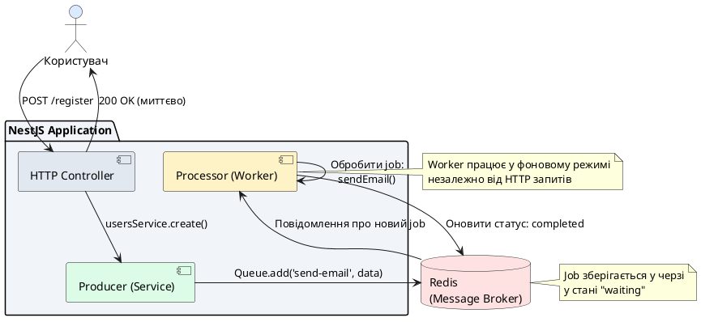
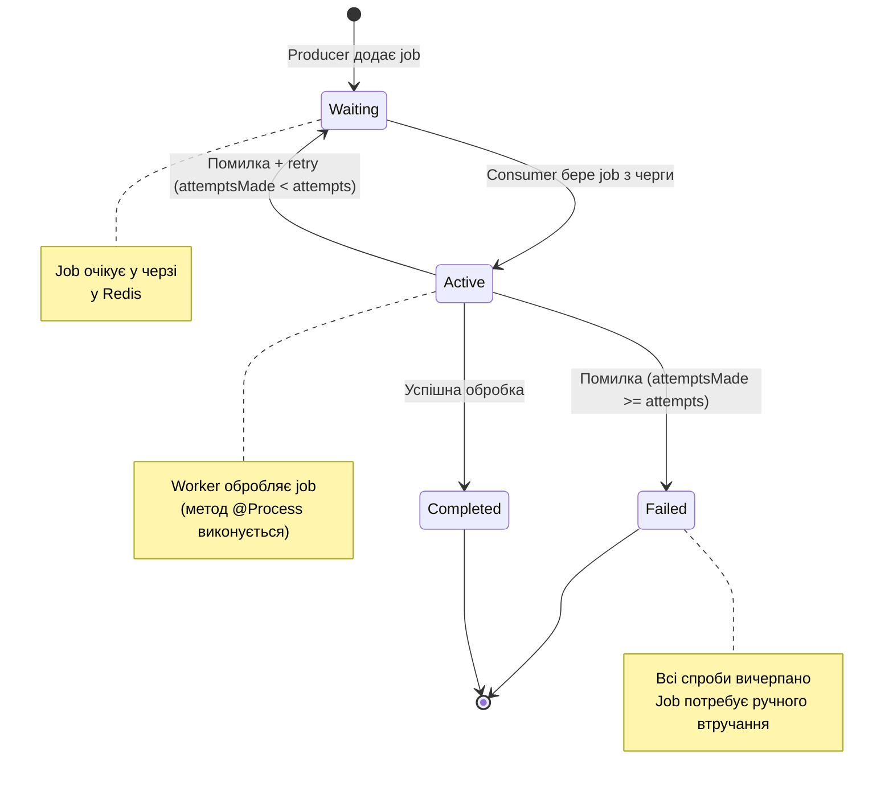
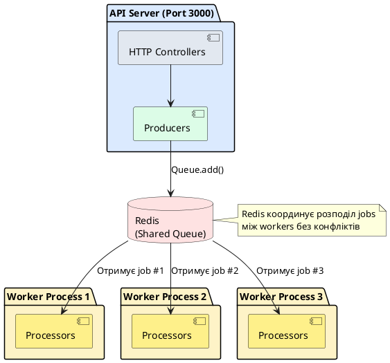

# Фонові задачі та черги

## Короткий зміст

У цій лекції вивчається організація асинхронної обробки завдань через черги з використанням Bull та Redis:

- **Концепція черг** — відкладене виконання задач поза HTTP request-response циклом, producer додає job у чергу, consumer обробляє jobs асинхронно, Redis як message broker
- **Бібліотека @nestjs/bull** — інтеграція Bull (популярна queue library) з NestJS, конфігурація через `BullModule.forRoot()` з Redis connection, реєстрація черг через `BullModule.registerQueue()`
- **Producers** — додавання jobs у чергу через `Queue.add('jobName', data, options)`, options: delay (відкладений старт), attempts (кількість retry), priority
- **Consumers (Processors)** — обробка jobs через декоратор `@Process('jobName')`, отримання job data, виконання асинхронної логіки, повернення результату
- **Job lifecycle** — стани job: waiting → active → completed/failed, progress tracking через `job.progress()`, events для кожного стану
- **Retry logic** — автоматичні retry при помилках, налаштування через attempts та backoff (експоненційна затримка), dead letter queue для permanently failed jobs
- **Job events** — слухачі подій: `@OnQueueActive()`, `@OnQueueCompleted()`, `@OnQueueFailed()` для моніторингу та логування
- **Bull Board** — UI dashboard для моніторингу черг, перегляд активних/completed/failed jobs, retry вручну

Розглядаються практичні сценарії: відправка email через чергу, обробка uploaded images (resize, optimization), генерація PDF звітів, імпорт даних з CSV, cleanup задачі.

---

::card-group

::card{title="🎯 Мета лекції" icon="i-lucide-target"}

- Зрозуміти концепцію черг (*queues*) як механізму асинхронної обробки завдань поза HTTP циклом запит-відповідь.
- Налаштувати Redis як брокер повідомлень (*message broker*) для зберігання черг та координації між producer та consumer.
- Інтегрувати бібліотеку Bull через `@nestjs/bull` для створення та обробки фонових задач у NestJS.
- Створити Producer для додавання jobs у чергу з параметрами: delay (відкладений старт), attempts (повторні спроби), priority (пріоритет).
- Реалізувати Processor через декоратор `@Process()` для асинхронної обробки jobs з можливістю tracking прогресу.
- Налаштувати retry logic з експоненційною затримкою (*exponential backoff*) для обробки тимчасових помилок.
- Впровадити event listeners (`@OnQueueCompleted()`, `@OnQueueFailed()`) для моніторингу життєвого циклу задач.
- Підключити Bull Board для візуального моніторингу черг та ручного керування failed jobs.

::

::card{title="🔑 Ключові терміни" icon="i-lucide-key"}

- **Queue (черга):** структура даних для асинхронного виконання задач, де producer додає jobs, а consumer обробляє їх у порядку FIFO або за пріоритетом.
- **Job:** одиниця роботи у черзі, містить payload (дані) та metadata (attempts, delay, priority).
- **Producer:** компонент, що додає jobs у чергу (зазвичай HTTP контролер або сервіс).
- **Consumer (Processor):** компонент, що обробляє jobs з черги через метод з декоратором `@Process()`.
- **Redis:** in-memory база даних, що слугує брокером повідомлень для зберігання черг та координації між workers.
- **Bull:** Node.js бібліотека для роботи з чергами на основі Redis, підтримує delayed jobs, retry logic, priorities.
- **Backoff:** стратегія затримки між повторними спробами, зазвичай експоненційна (1s → 2s → 4s → 8s).

::

::

---

## Проблематика: Обмеження синхронної обробки

У попередніх лекціях ми реалізували **real-time комунікацію** через WebSocket та **email/push нотифікації** для доставки повідомлень користувачам. Проте всі ці операції виконувалися **синхронно** у контексті HTTP запиту або WebSocket події. Це створює наступні проблеми:

### Проблема 1: Блокування HTTP потоку

Розглянемо типовий сценарій реєстрації користувача з відправкою email підтвердження:

```typescript
// ❌ Синхронна обробка: користувач чекає відправки email
@Post('register')
async register(@Body() dto: RegisterDto) {
  const user = await this.usersService.create(dto);
  
  // Відправка email блокує HTTP запит на 2-5 секунд
  await this.emailService.sendVerificationEmail(user.email, user.verificationToken);
  
  return { success: true, userId: user.id };
}
```

**Проблеми цього підходу:**

1. **Затримка відповіді:** Користувач чекає 2-5 секунд, поки SMTP сервер обробить email.
2. **Ризик timeout:** Якщо SMTP сервер недоступний, запит може зависнути на 30+ секунд.
3. **Погана UX:** Користувач не бачить миттєвої реакції системи.
4. **Втрата запиту при помилці:** Якщо email не відправився, користувач отримує помилку, хоча реєстрація технічно успішна.

### Проблема 2: Важкі обчислювальні задачі

Деякі операції вимагають значних обчислювальних ресурсів:

- **Обробка зображень:** resize, compression, watermark (може займати 10-30 секунд для високоякісного фото).
- **Генерація PDF звітів:** складні звіти з графіками та таблицями (5-15 секунд).
- **Відео конвертація:** транскодування відео у різні формати (хвилини-години).
- **Масовий експорт даних:** генерація CSV файлів з мільйонами записів (хвилини).

Виконання таких операцій у HTTP потоці:

- Блокує worker thread Node.js процесу.
- Створює ризик Memory Overflow при обробці великих файлів.
- Унеможливлює horizontal scaling (не можна розподілити навантаження між серверами).

### Проблема 3: Scheduled та Batch операції

Деякі задачі потребують виконання:

- **У конкретний час:** щоденні backup о 2:00 ночі, weekly звіти у п'ятницю о 18:00.
- **Масово для багатьох користувачів:** відправка newsletter на 100,000 email адрес.
- **З retry logic:** якщо зовнішній API недоступний, спробувати знову через 5 хвилин.

Синхронна обробка таких сценаріїв неможлива або дуже неефективна.

---

## Рішення: Архітектура з чергами

**Черга (Queue)** — це структура даних для асинхронного виконання завдань, де **Producer** додає задачі (*jobs*) у чергу, а **Consumer** обробляє їх у фоновому режимі.

### Архітектурна схема

::plant-uml{alt="Архітектура черг з Bull та Redis"}



::

### Ключові переваги черг

| Переваг | Опис |
|---------|------|
| **Асинхронність** | HTTP запит завершується миттєво, фонова обробка відбувається паралельно |
| **Надійність** | Jobs зберігаються у Redis, навіть якщо процес падає, job залишається у черзі |
| **Retry Logic** | Автоматичні повторні спроби при тимчасових помилках (network timeout, API rate limit) |
| **Horizontal Scaling** | Можна запустити кілька worker процесів для паралельної обробки |
| **Priority Queues** | Важливі jobs (password reset) обробляються раніше за звичайні (newsletter) |
| **Delayed Jobs** | Виконання через певний час (send reminder email через 24 години) |
| **Моніторинг** | Bull Board надає UI для перегляду статусу jobs та метрик черги |

::note
У середовищі виробництва (*production*) Redis часто запускається як окремий сервіс або managed service (AWS ElastiCache, Azure Cache for Redis), що гарантує високу доступність та persistence.
::

---

## Встановлення залежностей

::tabs
::tabs-item{label="npm"}
```bash
# Bull та Redis клієнт
npm install @nestjs/bull bull

# Redis сервер (якщо локально)
npm install -D redis-server
```
::
::tabs-item{label="yarn"}
```bash
yarn add @nestjs/bull bull
yarn add -D redis-server
```
::
::tabs-item{label="pnpm"}
```bash
pnpm add @nestjs/bull bull
pnpm add -D redis-server
```
::
::

### Запуск Redis через Docker

Найпростіший спосіб запустити Redis для development:

```yaml
# docker-compose.yml
version: '3.8'

services:
  redis:
    image: redis:7-alpine
    container_name: myapp-redis
    ports:
      - "6379:6379"
    volumes:
      - redis-data:/data
    command: redis-server --appendonly yes
    healthcheck:
      test: ["CMD", "redis-cli", "ping"]
      interval: 10s
      timeout: 3s
      retries: 3

volumes:
  redis-data:
```

::terminal-preview{title="docker compose up -d redis" :cursor="true"}

<div class="line"><span class="opacity-40">$</span> <strong class="font-bold">docker compose up -d redis</strong></div>
<div class="line"><span class="text-blue-400">[+]</span> Running 1/1</div>
<div class="line"> ✔ Container myapp-redis  <span class="text-green-400 font-bold">Started</span>                                     1.2s</div>
<div class="line"></div>
<div class="line"><span class="opacity-40">$</span> <strong class="font-bold">docker ps</strong></div>
<div class="line"><span class="opacity-60">CONTAINER ID   IMAGE              STATUS                    PORTS</span></div>
<div class="line">3f8a9c1d2e4b   redis:7-alpine     Up 5 seconds (healthy)    0.0.0.0:6379->6379/tcp</div>

::

::tip
Для production рекомендується налаштувати Redis persistence через **AOF (Append-Only File)** або **RDB snapshots** для збереження даних черг при перезапуску сервера.
::


---

## Конфігурація Bull Module у NestJS

### Глобальна конфігурація Redis

Bull використовує Redis як брокер повідомлень. Спочатку потрібно налаштувати з'єднання з Redis через `BullModule.forRoot()`:

```typescript
// src/app.module.ts
import { Module } from '@nestjs/common';
import { BullModule } from '@nestjs/bull';
import { ConfigModule, ConfigService } from '@nestjs/config';

@Module({
  imports: [
    ConfigModule.forRoot({
      isGlobal: true,
    }),
    
    // Глобальна конфігурація Bull
    BullModule.forRootAsync({
      inject: [ConfigService],
      useFactory: (configService: ConfigService) => ({
        redis: {
          host: configService.get('REDIS_HOST', 'localhost'),
          port: configService.get('REDIS_PORT', 6379),
          password: configService.get('REDIS_PASSWORD'),
          db: configService.get('REDIS_DB', 0),
        },
        // Глобальні налаштування для всіх черг
        defaultJobOptions: {
          attempts: 3, // Кількість повторних спроб при помилці
          backoff: {
            type: 'exponential', // Експоненційна затримка між спробами
            delay: 2000, // Базова затримка 2 секунди
          },
          removeOnComplete: 100, // Зберігати лише 100 останніх completed jobs
          removeOnFail: 500,     // Зберігати 500 останніх failed jobs для аналізу
        },
      }),
    }),
  ],
})
export class AppModule {}
```

**Пояснення параметрів:**

- **attempts: 3** — якщо job завершився з помилкою, Bull автоматично спробує виконати його ще 2 рази.
- **backoff.type: 'exponential'** — затримка між спробами зростає експоненційно: 1-й retry через 2s, 2-й через 4s, 3-й через 8s.
- **removeOnComplete: 100** — Bull зберігає метадані про completed jobs для моніторингу, але обмежує кількість для економії пам'яті.

::note
У production середовищі параметр `db` дозволяє ізолювати черги різних застосунків на одному Redis instance (db=0 для app1, db=1 для app2).
::

### Змінні оточення

```bash
# .env
REDIS_HOST=localhost
REDIS_PORT=6379
# REDIS_PASSWORD=  # Опціонально для локального dev
REDIS_DB=0
```

---

## Створення Email Queue: Producer та Processor

Розглянемо практичний приклад: **асинхронна відправка email** через чергу замість синхронної обробки.

### Крок 1: Реєстрація черги у модулі

Кожна черга має унікальне ім'я та реєструється через `BullModule.registerQueue()`:

```typescript
// src/email/email.module.ts
import { Module } from '@nestjs/common';
import { BullModule } from '@nestjs/bull';
import { EmailService } from './email.service';
import { EmailProcessor } from './email.processor';

@Module({
  imports: [
    // Реєстрація черги з ім'ям 'email'
    BullModule.registerQueue({
      name: 'email',
    }),
  ],
  providers: [EmailService, EmailProcessor],
  exports: [EmailService], // Експортуємо для використання в інших модулях
})
export class EmailModule {}
```

::warning
Ім'я черги (`'email'`) має бути **унікальним** у межах застосунку. Якщо дві черги матимуть однакове ім'я, це призведе до конфліктів при обробці jobs.
::

### Крок 2: Producer — додавання jobs у чергу

Producer — це сервіс, що додає jobs у чергу через `Queue.add()` метод:

```typescript
// src/email/email.service.ts
import { Injectable } from '@nestjs/common';
import { InjectQueue } from '@nestjs/bull';
import { Queue } from 'bull';

interface SendEmailJobData {
  to: string;
  subject: string;
  template: string;
  context: Record<string, any>;
}

@Injectable()
export class EmailService {
  constructor(
    @InjectQueue('email') private emailQueue: Queue,
  ) {}

  /**
   * Додати job для відправки email у чергу
   */
  async sendVerificationEmail(email: string, token: string): Promise<void> {
    const jobData: SendEmailJobData = {
      to: email,
      subject: 'Підтвердження реєстрації',
      template: 'verification',
      context: {
        token,
        verificationUrl: `https://myapp.com/verify?token=${token}`,
      },
    };

    // Додати job у чергу з іменем 'send-email'
    await this.emailQueue.add('send-email', jobData, {
      attempts: 5, // Перевизначити глобальний attempts для email (важливий use case)
      backoff: {
        type: 'exponential',
        delay: 3000, // Збільшити базову затримку до 3 секунд
      },
      priority: 1, // Вищий пріоритет для verification emails
    });

    console.log(`[EmailService] Job додано у чергу: send-email для ${email}`);
  }

  /**
   * Відправити email з затримкою (delayed job)
   */
  async sendReminderEmail(email: string, message: string, delayMs: number): Promise<void> {
    await this.emailQueue.add(
      'send-reminder',
      { to: email, subject: 'Нагадування', message },
      {
        delay: delayMs, // Виконати job через delayMs мілісекунд
        priority: 3,    // Нижчий пріоритет для reminders
      },
    );

    console.log(`[EmailService] Reminder job додано з затримкою ${delayMs}ms`);
  }

  /**
   * Масова відправка newsletter
   */
  async sendNewsletter(subscribers: string[], content: string): Promise<void> {
    const jobs = subscribers.map((email) => ({
      name: 'send-newsletter',
      data: { to: email, subject: 'Newsletter', content },
      opts: {
        priority: 5, // Найнижчий пріоритет для bulk emails
      },
    }));

    // Додати багато jobs одночасно (bulk insert)
    await this.emailQueue.addBulk(jobs);
    
    console.log(`[EmailService] ${jobs.length} newsletter jobs додано у чергу`);
  }
}
```

**Ключові концепції Producer:**

1. **Job Name** (`'send-email'`, `'send-reminder'`) — ідентифікатор типу задачі, Processor використовує його для маршрутизації.

2. **Job Data** — payload з даними для обробки, має бути JSON-serializable (без функцій, class instances).

3. **Job Options:**
   - `attempts` — кількість спроб при помилці.
   - `delay` — затримка перед виконанням у мілісекундах.
   - `priority` — пріоритет (менше число = вищий пріоритет), jobs з priority=1 обробляються раніше за priority=5.
   - `backoff` — стратегія затримки між retry.

4. **addBulk()** — оптимізований метод для додавання багатьох jobs одночасно (використовує Redis pipeline для мінімізації network roundtrips).

::tip
Для newsletter з тисячами email адрес краще додавати jobs батчами по 100-500 штук, ніж один величезний batch, щоб уникнути memory spike на Redis.
::

### Крок 3: Consumer (Processor) — обробка jobs

Processor — це клас з методами, декорованими `@Process()`, що виконують фактичну роботу:

```typescript
// src/email/email.processor.ts
import { Processor, Process, OnQueueActive, OnQueueCompleted, OnQueueFailed } from '@nestjs/bull';
import { Job } from 'bull';
import { Injectable } from '@nestjs/common';
import { MailerService } from '@nestjs-modules/mailer';

interface SendEmailJobData {
  to: string;
  subject: string;
  template: string;
  context: Record<string, any>;
}

@Processor('email') // Ім'я черги, яку обробляє цей Processor
@Injectable()
export class EmailProcessor {
  constructor(private mailerService: MailerService) {}

  /**
   * Обробити job типу 'send-email'
   */
  @Process('send-email')
  async handleSendEmail(job: Job<SendEmailJobData>): Promise<void> {
    const { to, subject, template, context } = job.data;

    console.log(`[EmailProcessor] Processing job ${job.id}: send-email to ${to}`);

    try {
      await this.mailerService.sendMail({
        to,
        subject,
        template,
        context,
      });

      console.log(`[EmailProcessor] Email успішно відправлено на ${to}`);
    } catch (error) {
      console.error(`[EmailProcessor] Помилка відправки email на ${to}:`, error.message);
      throw error; // Bull автоматично зареєструє fail та почне retry
    }
  }

  /**
   * Обробити job типу 'send-reminder'
   */
  @Process('send-reminder')
  async handleSendReminder(job: Job<{ to: string; subject: string; message: string }>): Promise<void> {
    const { to, subject, message } = job.data;

    console.log(`[EmailProcessor] Processing reminder job ${job.id}`);

    await this.mailerService.sendMail({
      to,
      subject,
      text: message,
    });
  }

  /**
   * Обробити job типу 'send-newsletter'
   */
  @Process('send-newsletter')
  async handleSendNewsletter(job: Job<{ to: string; subject: string; content: string }>): Promise<void> {
    const { to, subject, content } = job.data;

    // Імітація прогресу (корисно для довгих операцій)
    await job.progress(30); // 30% виконано

    await this.mailerService.sendMail({
      to,
      subject,
      html: content,
    });

    await job.progress(100); // 100% виконано
  }

  /**
   * Event listener: викликається коли job стає активним
   */
  @OnQueueActive()
  onActive(job: Job) {
    console.log(`[EmailProcessor] Job ${job.id} (${job.name}) started processing`);
  }

  /**
   * Event listener: викликається коли job успішно завершено
   */
  @OnQueueCompleted()
  onCompleted(job: Job, result: any) {
    console.log(`[EmailProcessor] Job ${job.id} (${job.name}) completed successfully`);
  }

  /**
   * Event listener: викликається коли job завершився з помилкою
   */
  @OnQueueFailed()
  onFailed(job: Job, error: Error) {
    console.error(
      `[EmailProcessor] Job ${job.id} (${job.name}) failed after ${job.attemptsMade} attempts:`,
      error.message,
    );

    // Якщо всі спроби вичерпано (attemptsMade === attempts), job переходить у стан 'failed'
    if (job.attemptsMade === job.opts.attempts) {
      console.error(`[EmailProcessor] Job ${job.id} permanently failed, requires manual intervention`);
      // Тут можна відправити alert DevOps команді або записати у dead letter queue
    }
  }
}
```

**Життєвий цикл Job:**

::mermaid



::

::note
Якщо метод `@Process()` викидає помилку (*throw error*), Bull автоматично помічає job як failed та планує retry згідно з налаштуваннями backoff. Якщо всі attempts вичерпано, job переходить у permanent failed state.
::


---

## Інтеграція черги з HTTP контролером

Тепер замість синхронної відправки email у контролері, ми додаємо job у чергу:

```typescript
// src/auth/auth.controller.ts
import { Controller, Post, Body } from '@nestjs/common';
import { UsersService } from '../users/users.service';
import { EmailService } from '../email/email.service';

interface RegisterDto {
  email: string;
  password: string;
  username: string;
}

@Controller('auth')
export class AuthController {
  constructor(
    private usersService: UsersService,
    private emailService: EmailService,
  ) {}

  /**
   * ✅ Асинхронна реєстрація через чергу
   */
  @Post('register')
  async register(@Body() dto: RegisterDto) {
    // 1. Створити користувача у БД (синхронно)
    const user = await this.usersService.create({
      email: dto.email,
      password: dto.password,
      username: dto.username,
      verificationToken: this.generateToken(),
    });

    // 2. Додати job для відправки email у чергу (асинхронно, не блокує відповідь)
    await this.emailService.sendVerificationEmail(user.email, user.verificationToken);

    // 3. Миттєво повернути відповідь користувачу
    return {
      success: true,
      userId: user.id,
      message: 'Реєстрація успішна. Перевірте email для підтвердження.',
    };
  }

  private generateToken(): string {
    return Math.random().toString(36).substring(2, 15);
  }
}
```

**Переваги цього підходу:**

| Аспект | Синхронний підхід | Асинхронний через чергу |
|--------|-------------------|-------------------------|
| **Час відповіді** | 2-5 секунд (чекає SMTP) | ~100ms (миттєвий return) |
| **Надійність** | Якщо SMTP падає, весь запит fails | Job зберігається у Redis, retry автоматично |
| **UX** | Користувач чекає на білому екрані | Користувач бачить instant feedback |
| **Scalability** | Кожен HTTP worker блокується | HTTP workers вільні, job обробляє окремий worker |
| **Moніторинг** | Складно відстежити failed emails | Bull Board показує статус кожного job |

---

## Job Progress Tracking для довгих операцій

Для операцій, що тривають кілька хвилин (обробка відео, генерація великого PDF), корисно відстежувати прогрес виконання:

```typescript
// src/media/media.processor.ts
import { Processor, Process } from '@nestjs/bull';
import { Job } from 'bull';
import sharp from 'sharp'; // Бібліотека для обробки зображень

interface ImageProcessingJobData {
  imageId: string;
  inputPath: string;
  outputPath: string;
  operations: Array<{ type: 'resize' | 'watermark' | 'compress'; params: any }>;
}

@Processor('media')
export class MediaProcessor {
  @Process('process-image')
  async handleImageProcessing(job: Job<ImageProcessingJobData>): Promise<{ outputPath: string }> {
    const { imageId, inputPath, outputPath, operations } = job.data;

    console.log(`[MediaProcessor] Processing image ${imageId}, ${operations.length} operations`);

    let image = sharp(inputPath);
    const totalOperations = operations.length;

    for (let i = 0; i < operations.length; i++) {
      const operation = operations[i];

      // Виконати операцію
      switch (operation.type) {
        case 'resize':
          image = image.resize(operation.params.width, operation.params.height);
          break;
        case 'watermark':
          image = image.composite([{ input: operation.params.watermarkPath }]);
          break;
        case 'compress':
          image = image.jpeg({ quality: operation.params.quality });
          break;
      }

      // Оновити прогрес
      const progress = Math.round(((i + 1) / totalOperations) * 100);
      await job.progress(progress);

      console.log(`[MediaProcessor] Image ${imageId}: ${progress}% completed`);
    }

    // Зберегти результат
    await image.toFile(outputPath);

    console.log(`[MediaProcessor] Image ${imageId} processing completed`);

    return { outputPath };
  }
}
```

### Відображення прогресу на Frontend

Frontend може polling status job через API:

```typescript
// src/media/media.controller.ts
import { Controller, Get, Param } from '@nestjs/common';
import { InjectQueue } from '@nestjs/bull';
import { Queue } from 'bull';

@Controller('media')
export class MediaController {
  constructor(@InjectQueue('media') private mediaQueue: Queue) {}

  /**
   * GET /media/jobs/:jobId/status
   * Отримати статус та прогрес job
   */
  @Get('jobs/:jobId/status')
  async getJobStatus(@Param('jobId') jobId: string) {
    const job = await this.mediaQueue.getJob(jobId);

    if (!job) {
      return { status: 'not_found' };
    }

    const state = await job.getState();
    const progress = job.progress();

    return {
      jobId: job.id,
      status: state, // 'waiting', 'active', 'completed', 'failed'
      progress, // 0-100
      data: job.data,
      result: job.returnvalue, // Результат після completed
      failedReason: job.failedReason,
      attemptsMade: job.attemptsMade,
      processedOn: job.processedOn,
      finishedOn: job.finishedOn,
    };
  }
}
```

Frontend React приклад polling:

```typescript
// src/hooks/useJobProgress.ts
import { useState, useEffect } from 'react';

interface JobStatus {
  status: 'waiting' | 'active' | 'completed' | 'failed' | 'not_found';
  progress: number;
  result?: any;
  failedReason?: string;
}

export function useJobProgress(jobId: string | null, pollInterval = 2000) {
  const [jobStatus, setJobStatus] = useState<JobStatus | null>(null);

  useEffect(() => {
    if (!jobId) return;

    const fetchStatus = async () => {
      const response = await fetch(`/api/media/jobs/${jobId}/status`);
      const data = await response.json();
      setJobStatus(data);

      // Зупинити polling якщо job завершено або failed
      if (data.status === 'completed' || data.status === 'failed') {
        clearInterval(intervalId);
      }
    };

    fetchStatus(); // Перший запит миттєво

    const intervalId = setInterval(fetchStatus, pollInterval);

    return () => clearInterval(intervalId);
  }, [jobId, pollInterval]);

  return jobStatus;
}
```

```typescript
// Використання у компоненті
function ImageUpload() {
  const [jobId, setJobId] = useState<string | null>(null);
  const jobStatus = useJobProgress(jobId);

  const handleUpload = async (file: File) => {
    const formData = new FormData();
    formData.append('file', file);

    const response = await fetch('/api/media/upload', {
      method: 'POST',
      body: formData,
    });

    const { jobId } = await response.json();
    setJobId(jobId);
  };

  return (
    <div>
      <input type="file" onChange={(e) => handleUpload(e.target.files[0])} />
      
      {jobStatus && (
        <div>
          <p>Статус: {jobStatus.status}</p>
          {jobStatus.status === 'active' && (
            <progress value={jobStatus.progress} max={100}>
              {jobStatus.progress}%
            </progress>
          )}
          {jobStatus.status === 'completed' && (
            <p>✅ Обробка завершена! Результат: {jobStatus.result?.outputPath}</p>
          )}
          {jobStatus.status === 'failed' && (
            <p>❌ Помилка: {jobStatus.failedReason}</p>
          )}
        </div>
      )}
    </div>
  );
}
```

::tip
Для real-time оновлень прогресу замість HTTP polling використовуйте WebSocket: коли job оновлює progress, відправляйте event через WebSocket Gateway на frontend.
::

---

## Retry Logic та Exponential Backoff

Bull підтримує автоматичні повторні спроби з гнучкою конфігурацією затримки між спробами.

### Exponential Backoff

**Експоненційна затримка** — це стратегія, де час між retry зростає експоненційно:

::math-formula
\text{delay} = \text{baseDelay} \times 2^{\text{attemptNumber}}
::

**Приклад:**
- Базова затримка: 2 секунди
- 1-й retry (attempt=1): :math-formula{tex="2 \times 2^1 = 4s" inline}
- 2-й retry (attempt=2): :math-formula{tex="2 \times 2^2 = 8s" inline}
- 3-й retry (attempt=3): :math-formula{tex="2 \times 2^3 = 16s" inline}

```typescript
await this.emailQueue.add('send-email', jobData, {
  attempts: 5,
  backoff: {
    type: 'exponential',
    delay: 2000, // Базова затримка 2 секунди
  },
});
```

### Fixed Backoff

Фіксована затримка між спробами:

```typescript
await this.queue.add('task', data, {
  attempts: 3,
  backoff: {
    type: 'fixed',
    delay: 5000, // Кожен retry через 5 секунд
  },
});
```

### Custom Backoff Function

Для складніших сценаріїв можна визначити власну логіку:

```typescript
await this.queue.add('api-call', data, {
  attempts: 10,
  backoff: {
    type: 'custom',
    // Для перших 3 спроб — швидкий retry, потім повільний
    delay: (attemptsMade: number) => {
      if (attemptsMade <= 3) {
        return 1000; // 1 секунда
      } else if (attemptsMade <= 6) {
        return 5000; // 5 секунд
      } else {
        return 30000; // 30 секунд
      }
    },
  },
});
```

::warning
Експоненційна затримка може швидко призвести до дуже довгих інтервалів. Наприклад, при базовій затримці 5 секунд та 10 спробах, 10-й retry буде через **85 хвилин**. Розглядайте обмеження максимальної затримки.
::

### Dead Letter Queue для permanently failed jobs

Коли job вичерпав всі спроби, він переходить у стан `failed`. Для критичних операцій корисно зберігати такі jobs у окрему **Dead Letter Queue (DLQ)** для ручної обробки:

```typescript
@Processor('email')
export class EmailProcessor {
  constructor(
    @InjectQueue('email') private emailQueue: Queue,
    @InjectQueue('email-dlq') private emailDlqQueue: Queue, // Dead Letter Queue
  ) {}

  @OnQueueFailed()
  async onFailed(job: Job, error: Error) {
    // Якщо job permanently failed (всі спроби вичерпано)
    if (job.attemptsMade === job.opts.attempts) {
      console.error(`[EmailProcessor] Job ${job.id} permanently failed, moving to DLQ`);

      // Додати job у DLQ для ручної обробки
      await this.emailDlqQueue.add('failed-email', {
        originalJobId: job.id,
        originalJobName: job.name,
        jobData: job.data,
        error: error.message,
        stack: error.stack,
        attemptsMade: job.attemptsMade,
        failedAt: new Date(),
      });

      // Опціонально: відправити alert DevOps команді
      // await this.alertService.sendSlackMessage(`Email job ${job.id} failed permanently`);
    }
  }
}
```

У Bull Board адміністратор може переглянути DLQ, виправити проблему (наприклад, оновити SMTP credentials) та вручну retry job.

---

## Bull Board: UI Dashboard для моніторингу

**Bull Board** — це веб-інтерфейс для моніторингу черг Bull, перегляду активних jobs та ручного керування ними.

### Встановлення

```bash
npm install @bull-board/api @bull-board/express
```

### Інтеграція з NestJS

```typescript
// src/bull-board/bull-board.module.ts
import { Module, OnModuleInit } from '@nestjs/common';
import { ExpressAdapter } from '@bull-board/express';
import { createBullBoard } from '@bull-board/api';
import { BullAdapter } from '@bull-board/api/bullAdapter';
import { Queue } from 'bull';
import { InjectQueue } from '@nestjs/bull';

@Module({})
export class BullBoardModule implements OnModuleInit {
  constructor(
    @InjectQueue('email') private emailQueue: Queue,
    @InjectQueue('media') private mediaQueue: Queue,
    @InjectQueue('email-dlq') private emailDlqQueue: Queue,
  ) {}

  onModuleInit() {
    const serverAdapter = new ExpressAdapter();
    serverAdapter.setBasePath('/admin/queues'); // URL для доступу до dashboard

    createBullBoard({
      queues: [
        new BullAdapter(this.emailQueue),
        new BullAdapter(this.mediaQueue),
        new BullAdapter(this.emailDlqQueue),
      ],
      serverAdapter,
    });

    // Примонтувати Express middleware у NestJS
    const app = require('../main').app; // Отримати Express app instance
    app.use('/admin/queues', serverAdapter.getRouter());

    console.log('[Bull Board] Dashboard доступний на http://localhost:3000/admin/queues');
  }
}
```

### Додати до AppModule

```typescript
// src/app.module.ts
import { BullBoardModule } from './bull-board/bull-board.module';

@Module({
  imports: [
    // ...інші модулі
    BullBoardModule,
  ],
})
export class AppModule {}
```

### Використання Bull Board

Відкрийте у браузері: `http://localhost:3000/admin/queues`

**Можливості dashboard:**

- **Перегляд черг:** список всіх зареєстрованих черг з метриками (waiting, active, completed, failed jobs).
- **Job details:** детальна інформація про кожен job (data, progress, attempts, timestamps).
- **Retry failed jobs:** вручну перезапустити failed job після виправлення проблеми.
- **Clean jobs:** видалити старі completed/failed jobs для очищення Redis пам'яті.
- **Pause/Resume queues:** призупинити обробку черги для maintenance.

::caution
У production середовищі Bull Board має бути захищений автентифікацією (JWT middleware або Basic Auth), щоб запобігти несанкціонованому доступу до sensitive job data.
::


---

## Horizontal Scaling: Кілька Worker процесів

Одна з найпотужніших можливостей черг — це **horizontal scaling**, коли кілька worker процесів обробляють jobs паралельно з однієї черги.

### Архітектура з кількома workers

::plant-uml{alt="Horizontal Scaling з Bull Workers"}



::

### Конфігурація окремого Worker процесу

У production часто розділяють **API Server** (обробляє HTTP запити, додає jobs у чергу) та **Worker процеси** (лише обробляють jobs з черги):

```typescript
// src/worker.ts — Окремий процес для обробки jobs
import { NestFactory } from '@nestjs/core';
import { AppModule } from './app.module';

async function bootstrap() {
  const app = await NestFactory.createApplicationContext(AppModule);

  // Worker не слухає HTTP порт, лише обробляє jobs
  console.log('[Worker] Started processing jobs from queue');
  console.log('[Worker] Press Ctrl+C to stop');
}

bootstrap();
```

### Graceful Shutdown для Workers

При зупинці worker процесу важливо дочекатися завершення активних jobs:

```typescript
// src/worker.ts
import { NestFactory } from '@nestjs/core';
import { AppModule } from './app.module';

async function bootstrap() {
  const app = await NestFactory.createApplicationContext(AppModule);

  // Обробити SIGTERM/SIGINT для graceful shutdown
  process.on('SIGTERM', async () => {
    console.log('[Worker] Received SIGTERM, shutting down gracefully...');
    await app.close();
    process.exit(0);
  });

  process.on('SIGINT', async () => {
    console.log('[Worker] Received SIGINT, shutting down gracefully...');
    await app.close();
    process.exit(0);
  });

  console.log('[Worker] Started processing jobs from queue');
}

bootstrap();
```

**Bull автоматично:**
1. Призупиняє прийом нових jobs з черги.
2. Дочекається завершення активних jobs (або timeout).
3. Повертає незавершені jobs назад у чергу для інших workers.

### Запуск кількох workers

::tabs
::tabs-item{label="npm scripts"}
```json
// package.json
{
  "scripts": {
    "start:api": "nest start",
    "start:worker": "ts-node src/worker.ts",
    "start:worker:multi": "npm-run-all --parallel worker:*",
    "worker:1": "ts-node src/worker.ts",
    "worker:2": "ts-node src/worker.ts",
    "worker:3": "ts-node src/worker.ts"
  }
}
```
::
::tabs-item{label="Docker Compose"}
```yaml
# docker-compose.yml
version: '3.8'

services:
  api:
    build: .
    command: npm run start:api
    ports:
      - "3000:3000"
    environment:
      - REDIS_HOST=redis
    depends_on:
      - redis

  worker:
    build: .
    command: npm run start:worker
    deploy:
      replicas: 3  # Запустити 3 worker контейнери
    environment:
      - REDIS_HOST=redis
    depends_on:
      - redis

  redis:
    image: redis:7-alpine
    ports:
      - "6379:6379"
```
::
::tabs-item{label="Kubernetes"}
```yaml
# k8s/worker-deployment.yaml
apiVersion: apps/v1
kind: Deployment
metadata:
  name: queue-worker
spec:
  replicas: 5  # 5 worker pods
  selector:
    matchLabels:
      app: queue-worker
  template:
    metadata:
      labels:
        app: queue-worker
    spec:
      containers:
      - name: worker
        image: myapp/worker:latest
        env:
        - name: REDIS_HOST
          value: redis-service
        resources:
          requests:
            memory: "256Mi"
            cpu: "250m"
          limits:
            memory: "512Mi"
            cpu: "500m"
```
::
::

::note
У Kubernetes можна налаштувати **Horizontal Pod Autoscaler (HPA)** для автоматичного збільшення кількості worker pods при зростанні черги (наприклад, якщо waiting jobs > 100, додати ще 2 workers).
::

---

## Concurrency та Rate Limiting

Bull дозволяє налаштувати **кількість jobs, що обробляються паралельно** у одному worker процесі:

```typescript
// src/email/email.processor.ts
@Processor('email')
export class EmailProcessor {
  /**
   * Обробляти до 5 jobs одночасно у цьому worker
   */
  @Process({ name: 'send-email', concurrency: 5 })
  async handleSendEmail(job: Job<SendEmailJobData>): Promise<void> {
    // ...обробка
  }
}
```

**Коли використовувати concurrency:**

- **I/O-bound tasks** (network requests, database queries) — високий concurrency (10-20) дозволяє максимізувати throughput.
- **CPU-bound tasks** (image processing, video encoding) — низький concurrency (1-2) запобігає перевантаженню CPU.

### Rate Limiting для зовнішніх API

Якщо job викликає зовнішній API з rate limit (наприклад, 100 requests/minute), налаштуйте **limiter** у черзі:

```typescript
// src/app.module.ts
BullModule.registerQueue({
  name: 'external-api',
  limiter: {
    max: 100,        // Максимум 100 jobs
    duration: 60000, // За 60 секунд (1 хвилина)
  },
})
```

Bull автоматично затримає обробку jobs, якщо досягнуто ліміту, щоб не порушувати rate limit API.

---

## Практичні сценарії використання черг

### Сценарій 1: Обробка uploaded зображень

```typescript
// src/media/media.service.ts
@Injectable()
export class MediaService {
  constructor(@InjectQueue('media') private mediaQueue: Queue) {}

  async uploadImage(file: Express.Multer.File, userId: number): Promise<{ jobId: string }> {
    // Зберегти original file
    const originalPath = await this.saveFile(file);

    // Додати job для обробки
    const job = await this.mediaQueue.add('process-image', {
      imageId: uuidv4(),
      userId,
      originalPath,
      operations: [
        { type: 'resize', params: { width: 1920, height: 1080 } },
        { type: 'compress', params: { quality: 85 } },
        { type: 'watermark', params: { watermarkPath: '/assets/watermark.png' } },
      ],
    });

    return { jobId: job.id as string };
  }
}
```

```typescript
// src/media/media.processor.ts
@Processor('media')
export class MediaProcessor {
  @Process({ name: 'process-image', concurrency: 3 })
  async handleProcessImage(job: Job): Promise<string> {
    const { imageId, originalPath, operations } = job.data;

    let processedPath = originalPath;

    for (let i = 0; i < operations.length; i++) {
      processedPath = await this.applyOperation(processedPath, operations[i]);
      await job.progress((i + 1) / operations.length * 100);
    }

    // Оновити запис у БД
    await this.mediaRepository.update(imageId, {
      status: 'processed',
      processedPath,
    });

    return processedPath;
  }
}
```

### Сценарій 2: Генерація PDF звітів

```typescript
// src/reports/reports.service.ts
@Injectable()
export class ReportsService {
  constructor(@InjectQueue('reports') private reportsQueue: Queue) {}

  async generateMonthlyReport(userId: number, month: number, year: number): Promise<{ jobId: string }> {
    const job = await this.reportsQueue.add('generate-pdf', {
      userId,
      reportType: 'monthly',
      month,
      year,
    }, {
      priority: 2, // Середній пріоритет
      attempts: 3,
    });

    return { jobId: job.id as string };
  }

  async generateAnnualReport(userId: number, year: number): Promise<{ jobId: string }> {
    const job = await this.reportsQueue.add('generate-pdf', {
      userId,
      reportType: 'annual',
      year,
    }, {
      priority: 1, // Вищий пріоритет для річних звітів
      attempts: 5,
      timeout: 300000, // 5 хвилин timeout
    });

    return { jobId: job.id as string };
  }
}
```

```typescript
// src/reports/reports.processor.ts
@Processor('reports')
export class ReportsProcessor {
  @Process({ name: 'generate-pdf', concurrency: 2 })
  async handleGeneratePdf(job: Job): Promise<string> {
    const { userId, reportType, month, year } = job.data;

    // 1. Завантажити дані з БД
    await job.progress(20);
    const data = await this.dataService.fetchReportData(userId, reportType, { month, year });

    // 2. Згенерувати PDF через puppeteer або pdfkit
    await job.progress(60);
    const pdfBuffer = await this.pdfService.generate(data);

    // 3. Завантажити PDF у S3
    await job.progress(80);
    const s3Key = `reports/${userId}/${reportType}-${year}-${month || ''}.pdf`;
    await this.s3Service.upload(s3Key, pdfBuffer);

    await job.progress(100);

    // 4. Відправити email з посиланням
    await this.emailService.sendReportEmail(userId, s3Key);

    return s3Key;
  }
}
```

### Сценарій 3: Scheduled cleanup задачі

```typescript
// src/cleanup/cleanup.service.ts
import { Injectable } from '@nestjs/common';
import { Cron, CronExpression } from '@nestjs/schedule';
import { InjectQueue } from '@nestjs/bull';
import { Queue } from 'bull';

@Injectable()
export class CleanupService {
  constructor(@InjectQueue('cleanup') private cleanupQueue: Queue) {}

  /**
   * Щоночі о 2:00 додати job для очищення expired sessions
   */
  @Cron(CronExpression.EVERY_DAY_AT_2AM)
  async scheduleCleanupExpiredSessions() {
    await this.cleanupQueue.add('cleanup-sessions', {
      expiryThreshold: Date.now() - 7 * 24 * 60 * 60 * 1000, // 7 днів
    });

    console.log('[CleanupService] Scheduled cleanup-sessions job');
  }

  /**
   * Щотижня у неділю о 3:00 видалити старі logs
   */
  @Cron('0 3 * * 0') // Неділя, 3:00 AM
  async scheduleCleanupOldLogs() {
    await this.cleanupQueue.add('cleanup-logs', {
      olderThan: Date.now() - 30 * 24 * 60 * 60 * 1000, // 30 днів
    });
  }
}
```

```typescript
// src/cleanup/cleanup.processor.ts
@Processor('cleanup')
export class CleanupProcessor {
  @Process('cleanup-sessions')
  async handleCleanupSessions(job: Job): Promise<number> {
    const { expiryThreshold } = job.data;

    const result = await this.sessionsRepository.delete({
      expiresAt: LessThan(new Date(expiryThreshold)),
    });

    console.log(`[CleanupProcessor] Видалено ${result.affected} expired sessions`);
    return result.affected;
  }

  @Process('cleanup-logs')
  async handleCleanupLogs(job: Job): Promise<number> {
    const { olderThan } = job.data;

    const result = await this.logsRepository.delete({
      createdAt: LessThan(new Date(olderThan)),
    });

    console.log(`[CleanupProcessor] Видалено ${result.affected} старих logs`);
    return result.affected;
  }
}
```

::tip
Для scheduled задач рекомендується використовувати комбінацію `@nestjs/schedule` (для cron triggers) та `@nestjs/bull` (для фактичної обробки), щоб отримати переваги retry logic та моніторингу черг.
::

---

## Best Practices та Patterns

### 1. Ідемпотентність задач

**Ідемпотентна задача** — це задача, яку можна безпечно виконати кілька разів без небажаних побічних ефектів.

**Проблема:**
```typescript
// ❌ Не ідемпотентна: кожен retry додасть ще одне повідомлення
@Process('send-notification')
async handle(job: Job) {
  await this.notificationsRepository.create({
    userId: job.data.userId,
    message: job.data.message,
  });
}
```

Якщо цей job retry після помилки на етапі підтвердження Redis, користувач отримає дублікат нотифікації.

**Рішення:**
```typescript
// ✅ Ідемпотентна: перевіряємо наявність перед створенням
@Process('send-notification')
async handle(job: Job) {
  const { userId, message, idempotencyKey } = job.data;

  // Перевірити, чи вже існує нотифікація з цим ключем
  const existing = await this.notificationsRepository.findOne({
    where: { idempotencyKey },
  });

  if (existing) {
    console.log(`[Processor] Notification з ключем ${idempotencyKey} вже існує, skip`);
    return;
  }

  // Створити нову нотифікацію
  await this.notificationsRepository.create({
    userId,
    message,
    idempotencyKey, // Унікальний ключ для dedupication
  });
}
```

При додаванні job у чергу генеруйте унікальний `idempotencyKey`:

```typescript
await this.queue.add('send-notification', {
  userId,
  message,
  idempotencyKey: uuidv4(), // Або jobId
});
```

### 2. Distributed Locks для singleton jobs

У horizontal scaling сценарії кілька workers можуть одночасно обробляти один і той самий scheduled job (наприклад, daily backup). Для запобігання дублюванню використовуйте **distributed lock**:

```typescript
import { Injectable } from '@nestjs/common';
import { InjectQueue } from '@nestjs/bull';
import { Queue } from 'bull';
import Redlock from 'redlock';
import Redis from 'ioredis';

@Injectable()
export class BackupService {
  private redlock: Redlock;

  constructor(
    @InjectQueue('backup') private backupQueue: Queue,
    private redis: Redis,
  ) {
    this.redlock = new Redlock([this.redis], {
      retryCount: 10,
      retryDelay: 200,
    });
  }

  @Cron(CronExpression.EVERY_DAY_AT_2AM)
  async scheduleDailyBackup() {
    const lockKey = 'lock:daily-backup';
    const lockTtl = 60000; // 1 хвилина

    try {
      // Спробувати захопити distributed lock
      const lock = await this.redlock.lock(lockKey, lockTtl);

      console.log('[BackupService] Lock acquired, scheduling backup job');

      await this.backupQueue.add('perform-backup', {
        timestamp: Date.now(),
      });

      // Звільнити lock після додавання job
      await lock.unlock();
    } catch (error) {
      // Інший worker вже захопив lock, skip
      console.log('[BackupService] Lock already held by another worker, skipping');
    }
  }
}
```

::note
Бібліотека **Redlock** реалізує distributed lock algorithm для Redis, гарантуючи, що лише один worker може виконати критичну секцію коду одночасно.
::

### 3. Error Handling та Alerting

Для production критично важливо отримувати alerts про failed jobs:

```typescript
@Processor('payment')
export class PaymentProcessor {
  constructor(private slackService: SlackService) {}

  @OnQueueFailed()
  async onFailed(job: Job, error: Error) {
    const { userId, amount, paymentMethod } = job.data;

    // Якщо job permanently failed
    if (job.attemptsMade === job.opts.attempts) {
      // Відправити alert у Slack
      await this.slackService.sendAlert({
        channel: '#alerts-payments',
        text: `🚨 Payment job ${job.id} permanently failed`,
        attachments: [
          {
            color: 'danger',
            fields: [
              { title: 'User ID', value: userId, short: true },
              { title: 'Amount', value: `$${amount}`, short: true },
              { title: 'Payment Method', value: paymentMethod, short: true },
              { title: 'Error', value: error.message },
              { title: 'Attempts', value: job.attemptsMade.toString(), short: true },
            ],
          },
        ],
      });

      // Логувати у structured logging service (DataDog, Sentry)
      this.logger.error('Payment job permanently failed', {
        jobId: job.id,
        userId,
        amount,
        error: error.message,
        stack: error.stack,
      });
    }
  }
}
```

### 4. Job Priorities для критичних операцій

Використовуйте priority для критичних jobs:

```typescript
// Високий пріоритет: password reset email (користувач чекає)
await this.emailQueue.add('send-email', data, { priority: 1 });

// Середній пріоритет: transactional emails (order confirmation)
await this.emailQueue.add('send-email', data, { priority: 3 });

// Низький пріоритет: marketing emails (newsletter)
await this.emailQueue.add('send-email', data, { priority: 10 });
```

Jobs з нижчим числом priority обробляються першими.

---

## Порівняння з іншими підходами

::card-group

::card{title="Черги (Bull + Redis)" icon="i-lucide-layers"}

**Переваги:**
- Надійність через persistence у Redis
- Retry logic та backoff
- Horizontal scaling
- Priority queues
- UI для моніторингу (Bull Board)

**Недоліки:**
- Додаткова залежність (Redis)
- Складніша архітектура
- Overhead для простих задач

**Коли використовувати:**
- Довгі операції (>5 секунд)
- Критичні операції з потребою retry
- Масові операції (bulk emails)
- Production застосунки

::

::card{title="Cron Jobs (@nestjs/schedule)" icon="i-lucide-clock"}

**Переваги:**
- Простота налаштування
- Без додаткових залежностей
- Ідеально для scheduled tasks

**Недоліки:**
- Немає retry logic
- Немає progress tracking
- Складно scale horizontally
- Немає UI для моніторингу

**Коли використовувати:**
- Прості scheduled задачі
- Невеликі обсяги даних
- Операції, що не потребують retry

::

::card{title="Event-Driven (EventEmitter)" icon="i-lucide-zap"}

**Переваги:**
- Найшвидший підхід (in-memory)
- Нульовий overhead
- Reactive programming

**Недоліки:**
- Втрата подій при crash процесу
- Немає persistence
- Немає retry logic
- Тільки у межах одного процесу

**Коли використовувати:**
- Real-time events у межах процесу
- Некритичні події
- High-performance сценарії

::

::


---

## Запитання для самоперевірки

::accordion

::accordion-item{label="❓ Чому Redis використовується як брокер повідомлень для черг замість реляційної БД?" icon="i-lucide-help-circle"}

Redis є оптимальним вибором для черг через наступні характеристики:

1. **In-memory архітектура:** Операції читання/запису виконуються у пам'яті зі швидкістю ~100,000 ops/sec, що на порядки швидше за дискові БД.

2. **Атомарні операції:** Redis підтримує атомарні операції типу `LPUSH` (додати у чергу) та `BRPOP` (blocking pop з черги), які гарантують thread-safe доступ від кількох workers без race conditions.

3. **Pub/Sub підтримка:** Redis має вбудований механізм Pub/Sub для сповіщення workers про нові jobs без постійного polling.

4. **TTL (Time-To-Live):** Автоматичне видалення старих jobs через налаштування expiration, економить пам'ять.

5. **Persistence опції:** Хоча Redis працює in-memory, підтримує AOF та RDB snapshots для збереження даних при перезапуску.

Реляційна БД (PostgreSQL, MySQL) більш відповідна для зберігання metadata про jobs (audit logs, історія виконання), але не для черги як такої через high latency дискових операцій.

::

::accordion-item{label="❓ Що станеться з активним job, якщо worker процес раптово завершиться (crash або kill -9)?" icon="i-lucide-help-circle"}

Bull має механізм **stalled job detection** для обробки таких сценаріїв:

1. **Stalled timeout:** Кожен job має `stalledInterval` (за замовчуванням 30 секунд). Якщо job перебуває у стані `active` довше цього часу без оновлень progress, він вважається **stalled**.

2. **Автоматичний retry:** Bull переводить stalled job назад у стан `waiting` або `failed` (залежно від кількості спроб) та передає іншому worker для повторної обробки.

3. **Graceful shutdown:** При коректному shutdown (`SIGTERM`) worker дочекається завершення активних jobs або поверне їх у чергу.

4. **Crash scenario:** При crash (kill -9, out of memory) активний job стане stalled через 30 секунд та автоматично retry іншим worker.

**Важливо:** Для критичних операцій (платежі, фінансові транзакції) job має бути **ідемпотентним**, щоб повторне виконання не створило дублікат транзакції.

::

::accordion-item{label="❓ Як вибрати оптимальну кількість worker процесів для production?" icon="i-lucide-help-circle"}

Оптимальна кількість workers залежить від типу задач та доступних ресурсів:

**Для I/O-bound задач** (network requests, database queries, email відправка):
- **Формула:** Кількість workers = Кількість CPU cores × 2-4
- **Обґрунтування:** Більшість часу worker чекає на I/O операції, тому можна запустити більше workers, ніж cores.
- **Приклад:** Сервер з 4 CPU cores → 8-16 workers.

**Для CPU-bound задач** (image processing, video encoding, PDF generation):
- **Формула:** Кількість workers = Кількість CPU cores
- **Обґрунтування:** CPU-intensive операції максимально навантажують cores, більше workers призведе до context switching overhead.
- **Приклад:** Сервер з 8 CPU cores → 8 workers.

**Додаткові фактори:**
- **Доступна RAM:** Кожен worker споживає 100-500MB, врахуйте memory footprint.
- **Redis throughput:** Redis може обробити ~100,000 ops/sec, при дуже великій кількості workers може стати bottleneck.
- **Concurrency у Processor:** Якщо `concurrency: 5`, то 4 workers × 5 concurrent jobs = 20 jobs одночасно.

**Best practice:** Почніть з консервативного числа (кількість cores) та збільшуйте, моніторячи CPU usage, memory, Redis latency. Використовуйте Kubernetes HPA для auto-scaling базуючись на довжині черги.

::

::accordion-item{label="❓ Чи можна використовувати Bull для real-time комунікації замість WebSocket?" icon="i-lucide-help-circle"}

**Ні**, Bull не призначений для real-time комунікації з низькою затримкою. Ось чому:

1. **Latency:** Навіть з Redis, додавання job → обробка worker → повернення результату займає мінімум **50-200ms**. WebSocket має латентність ~1-5ms.

2. **Polling overhead:** Frontend потребуватиме polling job status кожні кілька секунд, що створює додаткове навантаження на API.

3. **Архітектурна складність:** Для отримання результату job потрібно зберігати jobId, періодично запитувати статус, обробляти timeout.

**Коли використовувати що:**

| Сценарій | Технологія | Обґрунтування |
|----------|-----------|---------------|
| Чат повідомлення | WebSocket | Користувач очікує миттєву доставку (<100ms) |
| Email відправка | Bull Queue | Користувачу не потрібен instant feedback, важлива надійність |
| Live нотифікації | WebSocket + Bull | WebSocket для online користувачів, Bull як fallback для offline |
| Image upload | Bull Queue | Обробка займає секунди-хвилини, progress через polling або WebSocket |
| Multiplayer game | WebSocket | Критична низька латентність для синхронізації гравців |
| Daily report generation | Bull Queue | Scheduled задача, результат доставляється через email |

**Гібридний підхід:** Використовуйте Bull для важкої обробки, а WebSocket для повідомлення frontend про завершення:

```typescript
@Process('process-image')
async handleProcessImage(job: Job): Promise<string> {
  const result = await this.processImage(job.data);

  // Після завершення job відправити WebSocket event
  this.wsGateway.emit(`job:${job.id}:completed`, {
    jobId: job.id,
    result,
  });

  return result;
}
```

::

::accordion-item{label="❓ Як забезпечити порядок виконання jobs (FIFO) у Bull?" icon="i-lucide-help-circle"}

За замовчуванням Bull обробляє jobs у порядку **FIFO (First In, First Out)**, але є нюанси:

**Проблеми, що можуть порушити FIFO:**

1. **Priority:** Jobs з вищим priority (менше число) обробляються першими навіть якщо додані пізніше.

2. **Delay:** Delayed jobs обробляться лише після закінчення delay, порушуючи початковий порядок.

3. **Retry:** Failed job з retry повертається у чергу та може обробитися пізніше за нові jobs.

4. **Concurrency:** При `concurrency > 1` кілька jobs обробляються паралельно, фактичний порядок завершення може відрізнятися від порядку старту.

**Рішення для strict FIFO:**

```typescript
// 1. Вимкнути priority (усі jobs мають однаковий priority)
await this.queue.add('task', data); // Без opts.priority

// 2. Встановити concurrency = 1 (обробка по одному job)
@Process({ name: 'task', concurrency: 1 })
async handleTask(job: Job) {
  // ...
}

// 3. Уникати delay та retry для strict ordering
await this.queue.add('task', data, {
  attempts: 1, // Без retry
  delay: 0,    // Без затримки
});
```

**Альтернатива:** Для задач з критичною важливістю порядку (наприклад, обробка фінансових транзакцій у хронологічному порядку) розгляньте використання **Kafka** або **RabbitMQ** з partition keys, які гарантують порядок у межах однієї partition.

::

::accordion-item{label="❓ Яка різниця між Bull та BullMQ, і який обрати для нового проєкту?" icon="i-lucide-help-circle"}

**Bull** та **BullMQ** — це дві версії однієї концепції, але з різною реалізацією:

**Bull (оригінальна версія):**
- Використовує Redis client `ioredis@4`
- Стабільний та широко протестований у production
- Підтримується спільнотою, але розробка уповільнена
- Добре інтегрований з `@nestjs/bull`

**BullMQ (нова версія, рекомендована):**
- Повністю переписаний з нуля з focus на performance та нові фічі
- Використовує Redis client `ioredis@5`
- **Performance:** До 50% швидше завдяки оптимізованим Lua scripts
- **Нові можливості:**
  - **Job Flows:** Ланцюжки та дерева залежностей між jobs (job B виконується лише після успішного завершення job A)
  - **Delayed repeatable jobs:** Combine delayed + repeat patterns
  - **Worker threads:** Підтримка Node.js Worker Threads для CPU-intensive задач
  - **Better TypeScript support:** Нативна типізація

**Рекомендація:**

- **Для нового проєкту у 2026 році:** Використовуйте **BullMQ** через кращу performance та активну підтримку.

- **Для існуючого проєкту з Bull:** Міграція на BullMQ можлива, але потребує рефакторингу кодової бази (API трохи відрізняється).

**Інтеграція BullMQ з NestJS:**

```bash
npm install @nestjs/bullmq bullmq
```

```typescript
// app.module.ts
import { BullModule } from '@nestjs/bullmq';

BullModule.forRoot({
  connection: {
    host: 'localhost',
    port: 6379,
  },
})
```

API дуже схожий на Bull, тому міграція відносно безболісна.

::

::

---

## Резюме лекції

У цій лекції ми опанували організацію **асинхронної обробки фонових задач** через черги з використанням Bull та Redis. Основні висновки:

::card-group

::card{title="🎯 Ключові концепції" icon="i-lucide-check-circle"}

- **Черги** дозволяють відокремити важкі операції від HTTP request-response циклу, покращуючи UX та надійність системи.
- **Redis** як in-memory брокер повідомлень забезпечує швидкість (~100k ops/sec) та persistence для черг.
- **Bull** надає powerful абстракцію над Redis з підтримкою retry logic, priorities, delayed jobs, progress tracking.
- **Producer** додає jobs у чергу через `Queue.add()`, **Processor** обробляє jobs через декоратор `@Process()`.
- **Horizontal scaling** — кілька worker процесів обробляють jobs паралельно з однієї черги без конфліктів.

::

::card{title="🔧 Практичні навички" icon="i-lucide-wrench"}

- Налаштування `BullModule` з Redis connection та глобальними job options (attempts, backoff).
- Створення Producer сервісу для додавання jobs з параметрами delay, priority, attempts.
- Реалізація Processor класу з event listeners (`@OnQueueCompleted`, `@OnQueueFailed`).
- Tracking прогресу довгих операцій через `job.progress()` та polling з frontend.
- Інтеграція Bull Board для візуального моніторингу черг та ручного керування failed jobs.
- Налаштування ідемпотентності задач та distributed locks для singleton jobs.

::

::card{title="📊 Архітектурні рішення" icon="i-lucide-box"}

- **Асинхронність:** HTTP відповідь повертається миттєво, фонова обробка не блокує користувача.
- **Надійність:** Jobs зберігаються у Redis, автоматичні retry при помилках, graceful shutdown при crash worker.
- **Scalability:** Додавання нових workers не вимагає змін у коді, лише запуск додаткових процесів.
- **Observability:** Bull Board + structured logging + alerting на failed jobs забезпечують повний контроль над системою.

::

::

### Наступні кроки

У наступній лекції ми розглянемо **Планувальники та Cron jobs** через `@nestjs/schedule`, що дозволяє виконувати періодичні задачі за розкладом (daily backups, weekly reports, cleanup jobs). Ми інтегруємо scheduler з Bull для отримання переваг обох підходів: cron для scheduling, Bull для надійної обробки.

::tip
**Додаткове читання:**
- [Bull Documentation](https://github.com/OptimalBits/bull) — офіційна документація з прикладами patterns
- [BullMQ Documentation](https://docs.bullmq.io/) — документація нової версії з job flows
- [Bull Board Repository](https://github.com/felixmosh/bull-board) — UI dashboard для моніторингу
- [Redis Persistence Guide](https://redis.io/docs/management/persistence/) — налаштування AOF та RDB для production
::

---

**Автор матеріалу:** Кафедра Комп'ютерних наук  
**Останнє оновлення:** 2026
