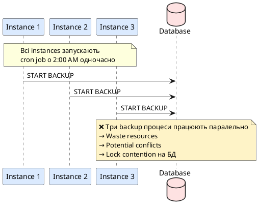
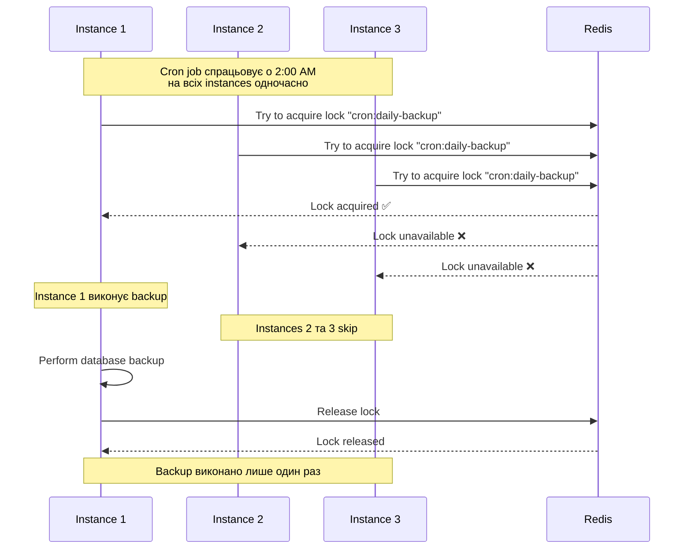

# Планувальники та Cron jobs

## Короткий зміст

У цій лекції розглядається автоматизоване виконання періодичних задач через планувальники:

- **Бібліотека @nestjs/schedule** — офіційний модуль для scheduling у NestJS, конфігурація через `ScheduleModule.forRoot()`, підтримка cron, intervals, timeouts
- **Декоратор @Cron()** — виконання задачі за розкладом cron, синтаксис cron expression (`'0 0 * * *'` = щодня о опівночі), підтримка named cron patterns (`CronExpression.EVERY_DAY_AT_MIDNIGHT`)
- **Cron expressions** — формат: секунди хвилини години день_місяця місяць день_тижня, wildcards та ranges, приклади: `'*/5 * * * *'` кожні 5 хвилин, `'0 9 * * 1-5'` робочі дні о 9:00
- **Декоратор @Interval()** — виконання через фіксовані інтервали часу (мілісекунди), приклад: `@Interval(10000)` кожні 10 секунд, простіше за cron для простих інтервалів
- **Декоратор @Timeout()** — одноразове виконання через затримку, корисно для delayed tasks при старті застосунку
- **Динамічне керування** — `SchedulerRegistry` для runtime управління jobs, методи `addCronJob()`, `deleteCronJob()`, `getCronJobs()`, pause/resume через job.stop() та job.start()
- **Timezone** — налаштування timezone для cron jobs через options `{ timeZone: 'Europe/Kiev' }`, важливо для глобальних застосунків
- **Best practices** — ідемпотентність задач (безпечний re-run), distributed locks для horizontal scaling (лише один instance виконує job), error handling та алерти

Розглядаються практичні сценарії: щоденне резервне копіювання БД, очищення expired sessions, генерація weekly/monthly звітів, sending reminders, aggregating metrics, health checks.

---

::card-group

::card{title="🎯 Мета лекції" icon="i-lucide-target"}

- Зрозуміти концепцію **планувальників** (*schedulers*) як механізму автоматизації періодичних задач без ручного втручання.
- Інтегрувати `@nestjs/schedule` для створення cron jobs, intervals та timeouts у NestJS застосунку.
- Опанувати синтаксис **cron expressions** для складних розкладів (щодня о 2:00, кожні 5 хвилин, робочі дні о 9:00).
- Використовувати декоратори `@Cron()`, `@Interval()`, `@Timeout()` для декларативного визначення scheduled tasks.
- Налаштувати **timezone** для cron jobs через `timeZone` option для коректної роботи у різних географічних регіонах.
- Реалізувати динамічне керування jobs через `SchedulerRegistry` для runtime додавання/видалення/pause/resume.
- Інтегрувати scheduler з **Bull Queue** для комбінування переваг: cron для scheduling, Bull для надійної обробки з retry logic.
- Застосувати **distributed locks** через Redlock для запобігання дублюванню cron jobs у horizontal scaling сценаріях.

::

::card{title="🔑 Ключові терміни" icon="i-lucide-key"}

- **Cron Job:** задача, що виконується автоматично за розкладом, визначеним через cron expression.
- **Cron Expression:** рядок з 6 полів (секунди, хвилини, години, день місяця, місяць, день тижня) для визначення розкладу.
- **Scheduler:** компонент системи, що відстежує час та запускає задачі згідно з розкладом.
- **Interval:** періодичне виконання задачі через фіксовані проміжки часу (наприклад, кожні 10 секунд).
- **Timeout:** одноразове виконання задачі через певну затримку після старту застосунку.
- **SchedulerRegistry:** сервіс для динамічного управління scheduled jobs у runtime (додавання, видалення, pause).
- **Distributed Lock:** механізм синхронізації у розподілених системах, що гарантує виконання cron job лише одним instance.

::

::

---

## Контекст: Від ручного запуску до автоматизації

У попередній лекції ми реалізували **фонові задачі через черги Bull**, що дозволяють асинхронно обробляти важкі операції (email відправка, image processing, PDF generation). Проте всі ці задачі **ініціювалися вручну** — користувач натискає кнопку, HTTP запит додає job у чергу.

Але багато операцій потребують **автоматичного виконання** за розкладом:

### Типові сценарії scheduled задач

| Сценарій | Розклад | Обґрунтування |
|----------|---------|---------------|
| **Database backup** | Щодня о 2:00 AM | Мінімальне навантаження на БД, користувачі offline |
| **Очищення expired sessions** | Кожні 30 хвилин | Звільнення пам'яті Redis, запобігання accumulation |
| **Weekly email digest** | Щоп'ятниці о 18:00 | Підсумковий звіт активності за тиждень |
| **Health check зовнішніх API** | Кожні 5 хвилин | Виявлення downtime та автоматичні alert |
| **Aggregating metrics** | Кожну годину | Збір статистики для dashboard та аналітики |
| **Sending birthday emails** | Щодня о 9:00 | Персоналізовані привітання користувачів |
| **Cleanup старих файлів** | Щонеділі о 3:00 AM | Видалення temporary files, архівація logs |

**Проблема ручного запуску:**
- Потребує manual intervention (DevOps повинен запустити скрипт).
- Ризик людської помилки (забув запустити backup).
- Неможливість точного timing (backup має бути о 2:00, не о 2:05).

**Рішення:** **Планувальники (Schedulers)** автоматизують виконання задач за розкладом без ручного втручання.

---

## Встановлення @nestjs/schedule

`@nestjs/schedule` — офіційний NestJS модуль, що надає декоратори для scheduling на основі бібліотеки `node-cron`.

::tabs
::tabs-item{label="npm"}
```bash
npm install @nestjs/schedule
```
::
::tabs-item{label="yarn"}
```bash
yarn add @nestjs/schedule
```
::
::tabs-item{label="pnpm"}
```bash
pnpm add @nestjs/schedule
```
::
::

### Реєстрація модуля

```typescript
// src/app.module.ts
import { Module } from '@nestjs/common';
import { ScheduleModule } from '@nestjs/schedule';

@Module({
  imports: [
    ScheduleModule.forRoot(), // Глобальна реєстрація scheduler
    // інші модулі...
  ],
})
export class AppModule {}
```

**`ScheduleModule.forRoot()`** ініціалізує глобальний scheduler та реєструє всі cron jobs, intervals та timeouts з декораторів `@Cron()`, `@Interval()`, `@Timeout()` у всіх providers застосунку.

::note
На відміну від Bull Queue, `@nestjs/schedule` **не потребує зовнішніх залежностей** (Redis, RabbitMQ). Scheduler працює in-process у Node.js runtime через `setInterval()` та `setTimeout()` під капотом.
::

---

## Декоратор @Cron(): Складні розклади

`@Cron()` виконує метод за **cron expression** — рядком, що визначає точний розклад виконання.

### Базовий приклад: Щоденний backup

```typescript
// src/backup/backup.service.ts
import { Injectable, Logger } from '@nestjs/common';
import { Cron, CronExpression } from '@nestjs/schedule';

@Injectable()
export class BackupService {
  private readonly logger = new Logger(BackupService.name);

  /**
   * Щодня о 2:00 AM
   */
  @Cron(CronExpression.EVERY_DAY_AT_2AM)
  async handleDailyBackup() {
    this.logger.log('[BackupService] Starting daily database backup...');

    try {
      // Виконати backup команду
      await this.performDatabaseBackup();
      
      this.logger.log('[BackupService] Daily backup completed successfully');
    } catch (error) {
      this.logger.error('[BackupService] Daily backup failed:', error.message);
      // Відправити alert DevOps команді
      await this.alertService.sendSlackMessage('🚨 Daily backup failed');
    }
  }

  private async performDatabaseBackup(): Promise<void> {
    // Логіка backup (pg_dump, mongodump, тощо)
    // Завантаження у S3 або локальний storage
  }
}
```

### Синтаксис Cron Expression

Cron expression складається з **6 полів**, розділених пробілами:

```
┌────────────── секунди (0-59)
│ ┌──────────── хвилини (0-59)
│ │ ┌────────── години (0-23)
│ │ │ ┌──────── день місяця (1-31)
│ │ │ │ ┌────── місяць (1-12 або JAN-DEC)
│ │ │ │ │ ┌──── день тижня (0-7, 0 або 7 = неділя, або SUN-SAT)
│ │ │ │ │ │
* * * * * *
```

**Спеціальні символи:**

| Символ | Значення | Приклад |
|--------|----------|---------|
| `*` | Будь-яке значення | `* * * * * *` = кожну секунду |
| `,` | Список значень | `0 0,12 * * *` = о 00:00 та 12:00 |
| `-` | Діапазон | `0 9-17 * * *` = кожну годину з 9:00 до 17:00 |
| `/` | Крок | `*/15 * * * *` = кожні 15 хвилин |

### Приклади Cron Expressions

::code-group

```typescript [Кожну хвилину]
@Cron('0 * * * * *')
// Або через named expression
@Cron(CronExpression.EVERY_MINUTE)
async everyMinute() {
  // Виконується щохвилини о XX:XX:00
}
```

```typescript [Кожні 5 хвилин]
@Cron('0 */5 * * * *')
async everyFiveMinutes() {
  // Виконується о XX:00:00, XX:05:00, XX:10:00, ...
}
```

```typescript [Робочі дні о 9:00]
@Cron('0 0 9 * * 1-5')
async weekdaysAt9AM() {
  // Виконується понеділок-п'ятниця о 9:00:00
  // 1 = Monday, 5 = Friday
}
```

```typescript [Перший день місяця]
@Cron('0 0 0 1 * *')
async firstDayOfMonth() {
  // Виконується 1-го числа кожного місяця о 00:00:00
}
```

```typescript [Щонеділі о 3:00 AM]
@Cron('0 0 3 * * 0')
// Або
@Cron(CronExpression.EVERY_WEEK)
async everyWeek() {
  // Виконується щонеділі о 03:00:00
}
```

::

### Named Cron Expressions

`@nestjs/schedule` надає **константи** для популярних розкладів:

```typescript
import { CronExpression } from '@nestjs/schedule';

@Cron(CronExpression.EVERY_SECOND)       // Кожну секунду
@Cron(CronExpression.EVERY_5_SECONDS)    // Кожні 5 секунд
@Cron(CronExpression.EVERY_10_SECONDS)   // Кожні 10 секунд
@Cron(CronExpression.EVERY_30_SECONDS)   // Кожні 30 секунд
@Cron(CronExpression.EVERY_MINUTE)       // Кожну хвилину
@Cron(CronExpression.EVERY_5_MINUTES)    // Кожні 5 хвилин
@Cron(CronExpression.EVERY_10_MINUTES)   // Кожні 10 хвилин
@Cron(CronExpression.EVERY_30_MINUTES)   // Кожні 30 хвилин
@Cron(CronExpression.EVERY_HOUR)         // Кожну годину
@Cron(CronExpression.EVERY_DAY_AT_1AM)   // Щодня о 1:00
@Cron(CronExpression.EVERY_DAY_AT_2AM)   // Щодня о 2:00
@Cron(CronExpression.EVERY_DAY_AT_MIDNIGHT) // Щодня о 00:00
@Cron(CronExpression.EVERY_DAY_AT_NOON)  // Щодня о 12:00
@Cron(CronExpression.EVERY_WEEK)         // Щонеділі о 00:00
@Cron(CronExpression.EVERY_WEEKDAY)      // Пн-Пт о 00:00
@Cron(CronExpression.EVERY_WEEKEND)      // Сб-Нд о 00:00
@Cron(CronExpression.EVERY_1ST_DAY_OF_MONTH_AT_MIDNIGHT) // 1-е число о 00:00
@Cron(CronExpression.EVERY_1ST_DAY_OF_MONTH_AT_NOON)     // 1-е число о 12:00
```

::tip
Використовуйте named expressions для покращення читабельності коду. `CronExpression.EVERY_DAY_AT_2AM` зрозуміліше, ніж `'0 0 2 * * *'`.
::

---

## Timezone: Важливість для глобальних застосунків

За замовчуванням cron jobs виконуються у **timezone сервера**. Для глобальних застосунків це може бути проблемою:

**Сценарій:** Ваш застосунок розгорнутий на AWS у регіоні `us-east-1` (UTC-5), але більшість користувачів у Європі. Ви хочете відправляти daily digest email о 9:00 ранку **за часом користувача**, а не сервера.

### Налаштування timezone

```typescript
// src/notifications/notifications.service.ts
import { Injectable } from '@nestjs/common';
import { Cron } from '@nestjs/schedule';

@Injectable()
export class NotificationsService {
  /**
   * Відправити daily digest о 9:00 за київським часом
   */
  @Cron('0 0 9 * * *', {
    name: 'daily-digest-ukraine',
    timeZone: 'Europe/Kiev', // IANA timezone
  })
  async sendDailyDigestUkraine() {
    const users = await this.getUsersByTimezone('Europe/Kiev');
    await this.sendDigestEmails(users);
  }

  /**
   * Відправити daily digest о 9:00 за нью-йоркським часом
   */
  @Cron('0 0 9 * * *', {
    name: 'daily-digest-ny',
    timeZone: 'America/New_York',
  })
  async sendDailyDigestNY() {
    const users = await this.getUsersByTimezone('America/New_York');
    await this.sendDigestEmails(users);
  }
}
```

**IANA Timezone Database:** Використовуйте стандартні назви timezone з [IANA database](https://www.iana.org/time-zones):
- `Europe/Kiev` (Київ)
- `Europe/London` (Лондон)
- `America/New_York` (Нью-Йорк)
- `Asia/Tokyo` (Токіо)
- `Australia/Sydney` (Сідней)

::warning
Уникайте застарілих абревіатур типу `EST`, `PST`, `CET`. Вони не враховують daylight saving time (*літній час*). Завжди використовуйте повні IANA назви.
::

### Альтернатива: Dynamic timezone per user

Для складніших сценаріїв (кожен користувач має свій timezone preference), використовуйте один cron job + перевірку timezone у runtime:

```typescript
@Injectable()
export class NotificationsService {
  /**
   * Виконується кожну годину та перевіряє, чи є користувачі,
   * для яких зараз 9:00 ранку у їхньому timezone
   */
  @Cron(CronExpression.EVERY_HOUR)
  async sendDailyDigestDynamic() {
    const currentTime = new Date();

    // Завантажити всіх користувачів з їхніми timezone
    const users = await this.usersRepository.find({
      select: ['id', 'email', 'timezone', 'digestTime'],
    });

    for (const user of users) {
      // Конвертувати поточний час у timezone користувача
      const userLocalTime = new Date(
        currentTime.toLocaleString('en-US', { timeZone: user.timezone })
      );

      // Перевірити, чи зараз 9:00 у timezone користувача
      if (userLocalTime.getHours() === 9 && userLocalTime.getMinutes() === 0) {
        await this.sendDigestEmail(user);
      }
    }
  }
}
```

::note
Цей підхід більш гнучкий, але створює overhead: метод викликається 24 рази на день (кожну годину), навіть якщо жоден користувач не потребує digest у цю годину. Для великих застосунків краще створювати окремі cron jobs для кожного популярного timezone.
::


---

## Декоратор @Interval(): Прості періодичні задачі

`@Interval()` виконує метод через **фіксовані інтервали** (у мілісекундах), що простіше за cron expression для простих сценаріїв.

### Базовий приклад: Health Check

```typescript
// src/health/health.service.ts
import { Injectable, Logger } from '@nestjs/common';
import { Interval } from '@nestjs/schedule';

@Injectable()
export class HealthService {
  private readonly logger = new Logger(HealthService.name);

  /**
   * Перевіряти доступність external API кожні 5 хвилин
   */
  @Interval(5 * 60 * 1000) // 5 minutes in milliseconds
  async checkExternalApiHealth() {
    this.logger.log('[HealthService] Checking external API health...');

    try {
      const response = await fetch('https://api.example.com/health', {
        method: 'GET',
        timeout: 5000,
      });

      if (response.ok) {
        this.logger.log('[HealthService] External API is healthy');
      } else {
        this.logger.warn(`[HealthService] External API returned ${response.status}`);
        await this.alertService.sendAlert('External API unhealthy');
      }
    } catch (error) {
      this.logger.error('[HealthService] External API is DOWN:', error.message);
      await this.alertService.sendCriticalAlert('External API DOWN');
    }
  }
}
```

### Порівняння @Cron vs @Interval

| Аспект | @Cron | @Interval |
|--------|-------|-----------|
| **Синтаксис** | Cron expression (`'0 0 2 * * *'`) | Мілісекунди (`60000`) |
| **Точність timing** | Виконується **точно** о 2:00:00 | Виконується **приблизно** кожні 60 секунд (залежить від тривалості попереднього виконання) |
| **Use case** | Scheduled задачі (backup о 2:00 ночі) | Періодичні перевірки (health check кожні 5 хвилин) |
| **Timezone підтримка** | Так (через `timeZone` option) | Ні (не залежить від часу доби) |
| **Складність** | Більш складний синтаксис | Простіший (лише число) |

**Коли використовувати @Interval:**
- Перевірки стану зовнішніх сервісів (health checks).
- Polling черг або баз даних на нові записи.
- Aggregating metrics кожні N хвилин.
- Cleanup in-memory cache кожні 10 хвилин.

**Коли використовувати @Cron:**
- Задачі з конкретним timing (daily backup **точно** о 2:00).
- Задачі з залежністю від дня тижня/місяця (weekly report **щоп'ятниці** о 18:00).
- Задачі з timezone requirements (send email о 9:00 **за київським часом**).

### Named Interval

Для зручності управління можна призначити ім'я інтервалу:

```typescript
@Interval('health-check-interval', 5 * 60 * 1000)
async checkHealth() {
  // ...
}
```

Пізніше можна динамічно керувати цим інтервалом через `SchedulerRegistry` (детальніше у наступних розділах).

---

## Декоратор @Timeout(): Одноразове виконання

`@Timeout()` виконує метод **один раз** через певну затримку після старту застосунку.

### Приклад: Warm-up cache при старті

```typescript
// src/cache/cache.service.ts
import { Injectable, Logger } from '@nestjs/common';
import { Timeout } from '@nestjs/schedule';

@Injectable()
export class CacheService {
  private readonly logger = new Logger(CacheService.name);

  /**
   * Завантажити frequently used data у cache через 10 секунд після старту
   */
  @Timeout(10000) // 10 seconds
  async warmUpCache() {
    this.logger.log('[CacheService] Warming up cache...');

    try {
      // Завантажити popular products у Redis
      const products = await this.productsRepository.find({
        where: { popular: true },
        take: 100,
      });

      for (const product of products) {
        await this.redis.setex(
          `product:${product.id}`,
          3600, // TTL 1 година
          JSON.stringify(product),
        );
      }

      this.logger.log('[CacheService] Cache warmed up with 100 products');
    } catch (error) {
      this.logger.error('[CacheService] Cache warm-up failed:', error.message);
    }
  }

  /**
   * Виконати database migrations через 5 секунд після старту
   */
  @Timeout('run-migrations', 5000)
  async runMigrations() {
    this.logger.log('[CacheService] Running pending migrations...');
    // Логіка migrations
  }
}
```

**Use cases для @Timeout:**

- **Cache warm-up:** Завантаження даних у cache при старті для швидшого першого запиту.
- **Database seeding:** Заповнення БД тестовими даними у development mode.
- **Initial health check:** Перевірка доступності зовнішніх сервісів перед початком обробки запитів.
- **License validation:** Перевірка валідності ліцензії застосунку через кілька секунд після старту.

::warning
`@Timeout()` виконується **при кожному перезапуску** застосунку. Якщо вам потрібна задача, що виконується **один раз у житті** застосунку (наприклад, database migration), використовуйте додаткову логіку перевірки у БД перед виконанням.
::

---

## Динамічне керування jobs через SchedulerRegistry

`SchedulerRegistry` дозволяє **створювати, видаляти, pause/resume** cron jobs та intervals у runtime.

### Отримання доступу до SchedulerRegistry

```typescript
// src/tasks/tasks.service.ts
import { Injectable, Logger } from '@nestjs/common';
import { SchedulerRegistry } from '@nestjs/schedule';
import { CronJob } from 'cron';

@Injectable()
export class TasksService {
  private readonly logger = new Logger(TasksService.name);

  constructor(private schedulerRegistry: SchedulerRegistry) {}

  /**
   * Динамічно додати новий cron job
   */
  addCronJob(name: string, cronExpression: string, callback: () => void) {
    const job = new CronJob(cronExpression, callback);

    this.schedulerRegistry.addCronJob(name, job);
    job.start();

    this.logger.log(`[TasksService] Cron job '${name}' added: ${cronExpression}`);
  }

  /**
   * Видалити cron job
   */
  deleteCronJob(name: string) {
    this.schedulerRegistry.deleteCronJob(name);
    this.logger.warn(`[TasksService] Cron job '${name}' deleted`);
  }

  /**
   * Отримати список всіх cron jobs
   */
  getCronJobs(): Map<string, CronJob> {
    const jobs = this.schedulerRegistry.getCronJobs();
    
    jobs.forEach((value, key) => {
      let next;
      try {
        next = value.nextDate().toJSDate();
      } catch (e) {
        next = 'error: next fire date is in the past!';
      }
      this.logger.log(`Job: ${key} -> next: ${next}`);
    });

    return jobs;
  }

  /**
   * Pause cron job (зупинити виконання)
   */
  pauseCronJob(name: string) {
    const job = this.schedulerRegistry.getCronJob(name);
    job.stop();
    this.logger.warn(`[TasksService] Cron job '${name}' paused`);
  }

  /**
   * Resume cron job (відновити виконання)
   */
  resumeCronJob(name: string) {
    const job = this.schedulerRegistry.getCronJob(name);
    job.start();
    this.logger.log(`[TasksService] Cron job '${name}' resumed`);
  }
}
```

### API для динамічного управління

```typescript
// src/tasks/tasks.controller.ts
import { Controller, Post, Delete, Body, Param, Get } from '@nestjs/common';
import { TasksService } from './tasks.service';

@Controller('tasks')
export class TasksController {
  constructor(private tasksService: TasksService) {}

  /**
   * POST /tasks/cron
   * Створити новий cron job
   */
  @Post('cron')
  createCronJob(@Body() body: { name: string; cron: string; action: string }) {
    const callback = () => {
      console.log(`[CronJob ${body.name}] Executing action: ${body.action}`);
      // Виконати відповідну дію
    };

    this.tasksService.addCronJob(body.name, body.cron, callback);

    return { success: true, message: `Cron job '${body.name}' created` };
  }

  /**
   * DELETE /tasks/cron/:name
   * Видалити cron job
   */
  @Delete('cron/:name')
  deleteCronJob(@Param('name') name: string) {
    this.tasksService.deleteCronJob(name);
    return { success: true, message: `Cron job '${name}' deleted` };
  }

  /**
   * GET /tasks/cron
   * Отримати список всіх cron jobs
   */
  @Get('cron')
  getCronJobs() {
    const jobs = this.tasksService.getCronJobs();
    
    const jobsList = [];
    jobs.forEach((job, name) => {
      jobsList.push({
        name,
        nextRun: job.nextDate().toJSDate(),
        running: job.running,
      });
    });

    return jobsList;
  }

  /**
   * POST /tasks/cron/:name/pause
   * Pause cron job
   */
  @Post('cron/:name/pause')
  pauseCronJob(@Param('name') name: string) {
    this.tasksService.pauseCronJob(name);
    return { success: true, message: `Cron job '${name}' paused` };
  }

  /**
   * POST /tasks/cron/:name/resume
   * Resume cron job
   */
  @Post('cron/:name/resume')
  resumeCronJob(@Param('name') name: string) {
    this.tasksService.resumeCronJob(name);
    return { success: true, message: `Cron job '${name}' resumed` };
  }
}
```

::terminal-preview{title="curl localhost:3000/tasks/cron" :cursor="true"}

<div class="line"><span class="opacity-40">$</span> <strong class="font-bold">curl -X POST http://localhost:3000/tasks/cron \</strong></div>
<div class="line">  -H "Content-Type: application/json" \</div>
<div class="line">  -d '{"name":"backup","cron":"0 0 2 * * *","action":"database-backup"}'</div>
<div class="line"></div>
<div class="line"><span class="text-green-400">{"success":true,"message":"Cron job 'backup' created"}</span></div>
<div class="line"></div>
<div class="line"><span class="opacity-40">$</span> <strong class="font-bold">curl http://localhost:3000/tasks/cron</strong></div>
<div class="line"><span class="text-blue-400">[</span></div>
<div class="line">  {</div>
<div class="line">    "name": "backup",</div>
<div class="line">    "nextRun": "2026-09-08T02:00:00.000Z",</div>
<div class="line">    "running": <span class="text-green-400">true</span></div>
<div class="line">  }</div>
<div class="line"><span class="text-blue-400">]</span></div>

::

### Динамічне керування Intervals

Аналогічно для intervals:

```typescript
@Injectable()
export class TasksService {
  constructor(private schedulerRegistry: SchedulerRegistry) {}

  /**
   * Додати новий interval
   */
  addInterval(name: string, milliseconds: number, callback: () => void) {
    const interval = setInterval(callback, milliseconds);
    this.schedulerRegistry.addInterval(name, interval);
    console.log(`[TasksService] Interval '${name}' added: every ${milliseconds}ms`);
  }

  /**
   * Видалити interval
   */
  deleteInterval(name: string) {
    this.schedulerRegistry.deleteInterval(name);
    console.log(`[TasksService] Interval '${name}' deleted`);
  }

  /**
   * Отримати всі intervals
   */
  getIntervals(): string[] {
    const intervals = this.schedulerRegistry.getIntervals();
    return Array.from(intervals);
  }
}
```

---

## Інтеграція Scheduler з Bull Queue

Найпотужніший підхід — **комбінування scheduler з Bull Queue**:

1. **Scheduler** запускає задачу за розкладом.
2. **Scheduler додає job у Bull Queue** замість виконання логіки безпосередньо.
3. **Bull Worker** обробляє job з усіма перевагами: retry logic, progress tracking, моніторинг.

### Приклад: Daily Report через Scheduler + Bull

```typescript
// src/reports/reports.service.ts
import { Injectable, Logger } from '@nestjs/common';
import { Cron, CronExpression } from '@nestjs/schedule';
import { InjectQueue } from '@nestjs/bull';
import { Queue } from 'bull';

@Injectable()
export class ReportsService {
  private readonly logger = new Logger(ReportsService.name);

  constructor(@InjectQueue('reports') private reportsQueue: Queue) {}

  /**
   * Щодня о 6:00 AM створити job для генерації daily reports
   */
  @Cron(CronExpression.EVERY_DAY_AT_6AM, {
    name: 'schedule-daily-reports',
    timeZone: 'Europe/Kiev',
  })
  async scheduleDailyReports() {
    this.logger.log('[ReportsService] Scheduling daily reports...');

    try {
      // Завантажити список users, які підписані на daily reports
      const users = await this.usersRepository.find({
        where: { dailyReportEnabled: true },
      });

      this.logger.log(`[ReportsService] Found ${users.length} users for daily report`);

      // Додати job у чергу для кожного користувача
      for (const user of users) {
        await this.reportsQueue.add('generate-daily-report', {
          userId: user.id,
          date: new Date().toISOString().split('T')[0], // YYYY-MM-DD
        }, {
          attempts: 3,
          backoff: {
            type: 'exponential',
            delay: 5000,
          },
          priority: 2, // Середній пріоритет
        });
      }

      this.logger.log(`[ReportsService] ${users.length} jobs added to queue`);
    } catch (error) {
      this.logger.error('[ReportsService] Failed to schedule daily reports:', error.message);
    }
  }
}
```

```typescript
// src/reports/reports.processor.ts
import { Processor, Process } from '@nestjs/bull';
import { Job } from 'bull';
import { Injectable } from '@nestjs/common';

@Processor('reports')
@Injectable()
export class ReportsProcessor {
  @Process('generate-daily-report')
  async handleGenerateDailyReport(job: Job): Promise<void> {
    const { userId, date } = job.data;

    console.log(`[ReportsProcessor] Generating daily report for user ${userId}, date ${date}`);

    // 1. Завантажити дані користувача
    const userData = await this.fetchUserActivity(userId, date);

    // 2. Згенерувати PDF звіт
    const pdfBuffer = await this.generatePdfReport(userData);

    // 3. Завантажити у S3
    const s3Key = `reports/${userId}/daily-${date}.pdf`;
    await this.s3Service.upload(s3Key, pdfBuffer);

    // 4. Відправити email з посиланням
    await this.emailService.sendReportEmail(userId, s3Key);

    console.log(`[ReportsProcessor] Daily report sent to user ${userId}`);
  }
}
```

**Переваги цього підходу:**

| Переваг | Опис |
|---------|------|
| **Точний timing** | Scheduler гарантує запуск **точно** о 6:00 AM |
| **Retry logic** | Якщо генерація PDF або email failed, Bull автоматично retry |
| **Progress tracking** | Frontend може polling статус job через API |
| **Horizontal scaling** | Кілька workers обробляють jobs паралельно |
| **Моніторинг** | Bull Board показує статус кожного job |
| **Ідемпотентність** | Навіть якщо scheduler спрацював двічі, Bull гарантує унікальність jobs за jobId |

::note
Цей патерн є **best practice** для production: scheduler відповідає за timing, Bull відповідає за надійну обробку.
::


---

## Distributed Locks: Запобігання дублюванню у Horizontal Scaling

У production застосунки часто запускаються у **кількох instances** (horizontal scaling). Проблема: всі instances виконають один і той самий cron job одночасно, що призведе до **дублювання** (наприклад, 3 backups одночасно).

::plant-uml{alt="Проблема дублювання cron jobs без Distributed Lock"}



::

**Рішення:** **Distributed Lock** гарантує, що лише **один instance** виконає cron job.

### Реалізація через Redlock

```bash
npm install redlock ioredis
```

```typescript
// src/common/distributed-lock.service.ts
import { Injectable, OnModuleInit } from '@nestjs/common';
import Redis from 'ioredis';
import Redlock from 'redlock';

@Injectable()
export class DistributedLockService implements OnModuleInit {
  private redlock: Redlock;
  private redis: Redis;

  onModuleInit() {
    this.redis = new Redis({
      host: process.env.REDIS_HOST || 'localhost',
      port: Number(process.env.REDIS_PORT) || 6379,
    });

    this.redlock = new Redlock([this.redis], {
      driftFactor: 0.01, // Максимальний drift для clock skew
      retryCount: 10,    // Кількість спроб захопити lock
      retryDelay: 200,   // Затримка між спробами (ms)
      retryJitter: 200,  // Рандомізація затримки для уникнення thundering herd
    });
  }

  /**
   * Виконати callback лише якщо вдалося захопити lock
   */
  async executeWithLock<T>(
    lockKey: string,
    ttl: number, // Time-to-live lock у мілісекундах
    callback: () => Promise<T>,
  ): Promise<T | null> {
    try {
      // Спробувати захопити distributed lock
      const lock = await this.redlock.lock(lockKey, ttl);

      console.log(`[DistributedLock] Lock acquired: ${lockKey}`);

      try {
        // Виконати callback під захистом lock
        const result = await callback();
        return result;
      } finally {
        // Звільнити lock після виконання
        await lock.unlock();
        console.log(`[DistributedLock] Lock released: ${lockKey}`);
      }
    } catch (error) {
      // Інший instance вже захопив lock або lock недоступний
      console.log(`[DistributedLock] Failed to acquire lock: ${lockKey}`);
      return null;
    }
  }
}
```

### Використання у Cron Job

```typescript
// src/backup/backup.service.ts
import { Injectable, Logger } from '@nestjs/common';
import { Cron, CronExpression } from '@nestjs/schedule';
import { DistributedLockService } from '../common/distributed-lock.service';

@Injectable()
export class BackupService {
  private readonly logger = new Logger(BackupService.name);

  constructor(private distributedLockService: DistributedLockService) {}

  /**
   * Щодня о 2:00 AM — лише один instance виконає backup
   */
  @Cron(CronExpression.EVERY_DAY_AT_2AM, {
    name: 'daily-backup',
  })
  async handleDailyBackup() {
    const lockKey = 'cron:daily-backup';
    const lockTtl = 10 * 60 * 1000; // 10 хвилин (більше, ніж тривалість backup)

    const result = await this.distributedLockService.executeWithLock(
      lockKey,
      lockTtl,
      async () => {
        this.logger.log('[BackupService] Starting daily database backup...');

        // Фактична логіка backup
        await this.performDatabaseBackup();

        this.logger.log('[BackupService] Daily backup completed successfully');
        return true;
      },
    );

    if (result === null) {
      this.logger.log('[BackupService] Backup already running on another instance, skipping');
    }
  }

  private async performDatabaseBackup(): Promise<void> {
    // Логіка backup
    // Це може зайняти кілька хвилин
  }
}
```

**Як працює Distributed Lock:**

::mermaid



::

::warning
**TTL Lock має бути більшим за максимальний час виконання задачі.** Якщо backup займає 8 хвилин, встановіть TTL = 10 хвилин. Інакше lock може expirе до завершення задачі, і інший instance почне backup паралельно.
::

---

## Практичні сценарії scheduled задач

### Сценарій 1: Очищення expired sessions

```typescript
// src/sessions/sessions.service.ts
import { Injectable, Logger } from '@nestjs/common';
import { Cron, CronExpression } from '@nestjs/schedule';
import { LessThan } from 'typeorm';

@Injectable()
export class SessionsService {
  private readonly logger = new Logger(SessionsService.name);

  /**
   * Кожні 30 хвилин очищати expired sessions
   */
  @Cron('0 */30 * * * *', {
    name: 'cleanup-expired-sessions',
  })
  async cleanupExpiredSessions() {
    this.logger.log('[SessionsService] Cleaning up expired sessions...');

    try {
      const expiryThreshold = new Date(Date.now() - 7 * 24 * 60 * 60 * 1000); // 7 днів

      const result = await this.sessionsRepository.delete({
        expiresAt: LessThan(expiryThreshold),
      });

      this.logger.log(`[SessionsService] Deleted ${result.affected} expired sessions`);
    } catch (error) {
      this.logger.error('[SessionsService] Cleanup failed:', error.message);
    }
  }

  /**
   * Щодня о 3:00 AM очищати refresh tokens старше 30 днів
   */
  @Cron(CronExpression.EVERY_DAY_AT_3AM, {
    name: 'cleanup-old-refresh-tokens',
  })
  async cleanupOldRefreshTokens() {
    this.logger.log('[SessionsService] Cleaning up old refresh tokens...');

    const thirtyDaysAgo = new Date(Date.now() - 30 * 24 * 60 * 60 * 1000);

    const result = await this.refreshTokensRepository.delete({
      createdAt: LessThan(thirtyDaysAgo),
    });

    this.logger.log(`[SessionsService] Deleted ${result.affected} old refresh tokens`);
  }
}
```

### Сценарій 2: Aggregating metrics

```typescript
// src/analytics/analytics.service.ts
import { Injectable, Logger } from '@nestjs/common';
import { Cron, CronExpression } from '@nestjs/schedule';

@Injectable()
export class AnalyticsService {
  private readonly logger = new Logger(AnalyticsService.name);

  /**
   * Кожну годину aggregate metrics для dashboard
   */
  @Cron(CronExpression.EVERY_HOUR, {
    name: 'aggregate-hourly-metrics',
  })
  async aggregateHourlyMetrics() {
    this.logger.log('[AnalyticsService] Aggregating hourly metrics...');

    const now = new Date();
    const oneHourAgo = new Date(now.getTime() - 60 * 60 * 1000);

    // Aggregate кількість requests за останню годину
    const requestCount = await this.logsRepository.count({
      where: {
        timestamp: Between(oneHourAgo, now),
      },
    });

    // Aggregate кількість active users за останню годину
    const activeUsers = await this.usersRepository
      .createQueryBuilder('user')
      .where('user.lastSeenAt >= :oneHourAgo', { oneHourAgo })
      .getCount();

    // Aggregate кількість errors за останню годину
    const errorCount = await this.logsRepository.count({
      where: {
        level: 'error',
        timestamp: Between(oneHourAgo, now),
      },
    });

    // Зберегти aggregated metrics
    await this.metricsRepository.save({
      timestamp: now,
      period: 'hourly',
      requestCount,
      activeUsers,
      errorCount,
    });

    this.logger.log(
      `[AnalyticsService] Metrics: ${requestCount} requests, ${activeUsers} users, ${errorCount} errors`
    );
  }

  /**
   * Щодня о опівночі aggregate daily metrics
   */
  @Cron(CronExpression.EVERY_DAY_AT_MIDNIGHT, {
    name: 'aggregate-daily-metrics',
    timeZone: 'Europe/Kiev',
  })
  async aggregateDailyMetrics() {
    this.logger.log('[AnalyticsService] Aggregating daily metrics...');

    const today = new Date();
    today.setHours(0, 0, 0, 0);

    const yesterday = new Date(today.getTime() - 24 * 60 * 60 * 1000);

    // Aggregate metrics за вчора (щоб день був повний)
    const dailyMetrics = await this.calculateDailyMetrics(yesterday);

    await this.metricsRepository.save({
      timestamp: yesterday,
      period: 'daily',
      ...dailyMetrics,
    });

    this.logger.log('[AnalyticsService] Daily metrics saved');
  }
}
```

### Сценарій 3: Sending birthday emails

```typescript
// src/users/users.service.ts
import { Injectable, Logger } from '@nestjs/common';
import { Cron } from '@nestjs/schedule';
import { InjectQueue } from '@nestjs/bull';
import { Queue } from 'bull';

@Injectable()
export class UsersService {
  private readonly logger = new Logger(UsersService.name);

  constructor(@InjectQueue('email') private emailQueue: Queue) {}

  /**
   * Щодня о 9:00 AM відправити birthday emails
   */
  @Cron('0 0 9 * * *', {
    name: 'send-birthday-emails',
    timeZone: 'Europe/Kiev',
  })
  async sendBirthdayEmails() {
    this.logger.log('[UsersService] Checking for birthdays today...');

    const today = new Date();
    const todayMonth = today.getMonth() + 1; // 1-12
    const todayDay = today.getDate(); // 1-31

    // Знайти користувачів з днем народження сьогодні
    const users = await this.usersRepository
      .createQueryBuilder('user')
      .where('EXTRACT(MONTH FROM user.birthDate) = :month', { month: todayMonth })
      .andWhere('EXTRACT(DAY FROM user.birthDate) = :day', { day: todayDay })
      .getMany();

    this.logger.log(`[UsersService] Found ${users.length} users with birthday today`);

    // Додати job у чергу для кожного користувача
    for (const user of users) {
      await this.emailQueue.add('send-birthday-email', {
        userId: user.id,
        email: user.email,
        name: user.name,
      }, {
        priority: 1, // Високий пріоритет для birthday emails
        attempts: 3,
      });
    }

    this.logger.log(`[UsersService] ${users.length} birthday email jobs added to queue`);
  }
}
```

### Сценарій 4: Database vacuum та optimization

```typescript
// src/database/database.service.ts
import { Injectable, Logger } from '@nestjs/common';
import { Cron } from '@nestjs/schedule';
import { DataSource } from 'typeorm';

@Injectable()
export class DatabaseService {
  private readonly logger = new Logger(DatabaseService.name);

  constructor(private dataSource: DataSource) {}

  /**
   * Щонеділі о 4:00 AM виконати VACUUM ANALYZE (PostgreSQL)
   */
  @Cron('0 0 4 * * 0', {
    name: 'database-vacuum',
  })
  async performVacuum() {
    this.logger.log('[DatabaseService] Starting VACUUM ANALYZE...');

    try {
      await this.dataSource.query('VACUUM ANALYZE');
      this.logger.log('[DatabaseService] VACUUM ANALYZE completed successfully');
    } catch (error) {
      this.logger.error('[DatabaseService] VACUUM ANALYZE failed:', error.message);
    }
  }

  /**
   * Щомісяця 1-го числа о 2:00 AM оптимізувати таблиці
   */
  @Cron('0 0 2 1 * *', {
    name: 'optimize-tables',
  })
  async optimizeTables() {
    this.logger.log('[DatabaseService] Optimizing database tables...');

    const tables = ['users', 'posts', 'comments', 'sessions'];

    for (const table of tables) {
      try {
        // PostgreSQL
        await this.dataSource.query(`REINDEX TABLE ${table}`);
        this.logger.log(`[DatabaseService] Table ${table} reindexed`);
      } catch (error) {
        this.logger.error(`[DatabaseService] Failed to reindex ${table}:`, error.message);
      }
    }
  }
}
```

---

## Error Handling та Alerting у Cron Jobs

Критично важливо відстежувати помилки у cron jobs, оскільки вони виконуються автоматично без human supervision.

### Централізований error handler

```typescript
// src/common/cron-error-handler.ts
import { Injectable, Logger } from '@nestjs/common';

@Injectable()
export class CronErrorHandler {
  private readonly logger = new Logger(CronErrorHandler.name);

  /**
   * Wrapper для безпечного виконання cron jobs з error handling
   */
  async executeSafely(
    jobName: string,
    callback: () => Promise<void>,
  ): Promise<void> {
    const startTime = Date.now();

    try {
      this.logger.log(`[${jobName}] Starting execution...`);

      await callback();

      const duration = Date.now() - startTime;
      this.logger.log(`[${jobName}] Completed successfully in ${duration}ms`);

      // Відправити success метрику у monitoring system
      await this.sendMetric(jobName, 'success', duration);
    } catch (error) {
      const duration = Date.now() - startTime;
      this.logger.error(`[${jobName}] Failed after ${duration}ms:`, error.message);

      // Відправити failed метрику
      await this.sendMetric(jobName, 'failed', duration);

      // Відправити alert у Slack/PagerDuty
      await this.sendAlert(jobName, error);

      // Опціонально: re-throw error для додаткової обробки
      // throw error;
    }
  }

  private async sendMetric(jobName: string, status: string, duration: number) {
    // Відправити у DataDog, Prometheus, CloudWatch, тощо
    console.log(`[Metric] ${jobName}.${status}: ${duration}ms`);
  }

  private async sendAlert(jobName: string, error: Error) {
    // Відправити alert через Slack, email, PagerDuty
    console.error(`[Alert] Cron job ${jobName} failed:`, error.message);
  }
}
```

### Використання у cron jobs

```typescript
// src/backup/backup.service.ts
import { Injectable } from '@nestjs/common';
import { Cron, CronExpression } from '@nestjs/schedule';
import { CronErrorHandler } from '../common/cron-error-handler';

@Injectable()
export class BackupService {
  constructor(private cronErrorHandler: CronErrorHandler) {}

  @Cron(CronExpression.EVERY_DAY_AT_2AM, {
    name: 'daily-backup',
  })
  async handleDailyBackup() {
    await this.cronErrorHandler.executeSafely('daily-backup', async () => {
      // Фактична логіка backup
      await this.performDatabaseBackup();
    });
  }
}
```

### Dead Man's Switch (Heartbeat Monitoring)

**Dead Man's Switch** — це механізм моніторингу, коли cron job **повинен регулярно повідомляти**, що він виконався успішно. Якщо повідомлення не надходить, система відправляє alert.

Популярні сервіси: [Healthchecks.io](https://healthchecks.io/), [Cronitor](https://cronitor.io/), [UptimeRobot](https://uptimerobot.com/).

```typescript
// src/backup/backup.service.ts
import { Injectable, Logger } from '@nestjs/common';
import { Cron, CronExpression } from '@nestjs/schedule';

@Injectable()
export class BackupService {
  private readonly logger = new Logger(BackupService.name);

  @Cron(CronExpression.EVERY_DAY_AT_2AM)
  async handleDailyBackup() {
    const healthCheckUrl = process.env.HEALTHCHECK_BACKUP_URL; // URL з Healthchecks.io

    try {
      // Виконати backup
      await this.performDatabaseBackup();

      // Повідомити healthcheck service про success
      await fetch(healthCheckUrl);

      this.logger.log('[BackupService] Backup completed, healthcheck pinged');
    } catch (error) {
      this.logger.error('[BackupService] Backup failed:', error.message);

      // Повідомити healthcheck service про failure
      await fetch(`${healthCheckUrl}/fail`);
    }
  }
}
```

**Як працює Dead Man's Switch:**

1. Ви створюєте healthcheck на Healthchecks.io з розкладом "щодня о 2:00 AM".
2. Healthchecks.io генерує унікальний URL (наприклад, `https://hc-ping.com/abc123`).
3. Ваш cron job робить HTTP GET на цей URL після успішного виконання.
4. Якщо Healthchecks.io **не отримує ping протягом 25 годин** (з урахуванням grace period), він відправляє alert на email/Slack/PagerDuty.

::tip
Dead Man's Switch критично важливий для **silent failures** — коли cron job не виконався через crash застосунку, але ніхто не помітив, бо немає error logs.
::


---

## Best Practices для Production

### 1. Ідемпотентність cron jobs

**Ідемпотентна задача** — це задача, яку можна виконати кілька разів без небажаних побічних ефектів.

**Проблема:**

```typescript
// ❌ Не ідемпотентна: кожен re-run додасть ще один backup
@Cron(CronExpression.EVERY_DAY_AT_2AM)
async backup() {
  const filename = `backup.sql`; // Завжди однакове ім'я
  await this.createBackup(filename);
}
```

Якщо cron job виконався двічі (наприклад, через clock drift або manual retry), backup файл буде перезаписаний без попередження.

**Рішення:**

```typescript
// ✅ Ідемпотентна: filename містить timestamp
@Cron(CronExpression.EVERY_DAY_AT_2AM)
async backup() {
  const timestamp = new Date().toISOString().replace(/:/g, '-');
  const filename = `backup-${timestamp}.sql`;

  // Перевірити, чи вже існує backup за сьогодні
  const existingBackup = await this.s3Service.fileExists(`backups/${filename}`);
  if (existingBackup) {
    this.logger.log('[Backup] Backup already exists for today, skipping');
    return;
  }

  await this.createBackup(filename);
}
```

### 2. Graceful degradation

Cron job не має падати весь застосунок при помилці:

```typescript
@Cron(CronExpression.EVERY_HOUR)
async aggregateMetrics() {
  try {
    // Спроба aggregate metrics
    const metrics = await this.calculateMetrics();
    await this.saveMetrics(metrics);
  } catch (error) {
    // Логувати помилку, але не падати
    this.logger.error('[Metrics] Aggregation failed, will retry next hour:', error.message);

    // Відправити alert
    await this.alertService.sendAlert('Metrics aggregation failed');

    // НЕ викидаємо error далі (не падаємо)
  }
}
```

### 3. Timeout для довгих операцій

Деякі cron jobs можуть зависнути на невизначений час (наприклад, backup великої БД). Встановіть **timeout** для запобігання accumulation hanging jobs:

```typescript
@Cron(CronExpression.EVERY_DAY_AT_2AM)
async backup() {
  const timeoutMs = 30 * 60 * 1000; // 30 хвилин максимум

  const timeoutPromise = new Promise<never>((_, reject) =>
    setTimeout(() => reject(new Error('Backup timeout')), timeoutMs)
  );

  try {
    await Promise.race([
      this.performBackup(),
      timeoutPromise,
    ]);

    this.logger.log('[Backup] Completed successfully');
  } catch (error) {
    if (error.message === 'Backup timeout') {
      this.logger.error('[Backup] Timeout exceeded (30 minutes), aborting');
      await this.alertService.sendCriticalAlert('Backup timeout');
    } else {
      this.logger.error('[Backup] Failed:', error.message);
    }
  }
}
```

### 4. Logging та Audit Trail

Кожен cron job має логувати:
- Час старту та завершення
- Кількість оброблених записів
- Duration виконання
- Success/failure статус

```typescript
@Cron(CronExpression.EVERY_DAY_AT_MIDNIGHT)
async cleanup() {
  const startTime = Date.now();
  const jobName = 'cleanup-expired-sessions';

  this.logger.log(`[${jobName}] Starting...`);

  let deletedCount = 0;

  try {
    const result = await this.sessionsRepository.delete({
      expiresAt: LessThan(new Date()),
    });

    deletedCount = result.affected || 0;

    const duration = Date.now() - startTime;
    this.logger.log(
      `[${jobName}] Completed: ${deletedCount} sessions deleted in ${duration}ms`
    );

    // Зберегти audit log
    await this.auditLogsRepository.save({
      action: jobName,
      status: 'success',
      metadata: { deletedCount, duration },
      timestamp: new Date(),
    });
  } catch (error) {
    const duration = Date.now() - startTime;
    this.logger.error(
      `[${jobName}] Failed after ${duration}ms:`,
      error.message
    );

    await this.auditLogsRepository.save({
      action: jobName,
      status: 'failed',
      error: error.message,
      timestamp: new Date(),
    });
  }
}
```

### 5. Environment-specific configuration

Cron jobs можуть бути **disabled у development** або мати різні розклади для різних environments:

```typescript
// src/backup/backup.service.ts
import { Injectable } from '@nestjs/common';
import { Cron, CronExpression } from '@nestjs/schedule';
import { ConfigService } from '@nestjs/config';

@Injectable()
export class BackupService {
  constructor(private configService: ConfigService) {}

  @Cron(CronExpression.EVERY_DAY_AT_2AM)
  async backup() {
    // Пропустити у development
    if (this.configService.get('NODE_ENV') === 'development') {
      console.log('[Backup] Skipped in development mode');
      return;
    }

    // Виконати backup
    await this.performBackup();
  }
}
```

Або через dynamic registration:

```typescript
// src/backup/backup.module.ts
import { Module, OnModuleInit } from '@nestjs/common';
import { SchedulerRegistry } from '@nestjs/schedule';
import { CronJob } from 'cron';
import { ConfigService } from '@nestjs/config';

@Module({})
export class BackupModule implements OnModuleInit {
  constructor(
    private schedulerRegistry: SchedulerRegistry,
    private configService: ConfigService,
  ) {}

  onModuleInit() {
    const isProduction = this.configService.get('NODE_ENV') === 'production';

    if (isProduction) {
      // Зареєструвати cron job лише у production
      const job = new CronJob('0 0 2 * * *', () => {
        this.performBackup();
      });

      this.schedulerRegistry.addCronJob('daily-backup', job);
      job.start();

      console.log('[BackupModule] Daily backup job registered');
    } else {
      console.log('[BackupModule] Daily backup disabled in non-production environment');
    }
  }

  private async performBackup() {
    // Логіка backup
  }
}
```

---

## Моніторинг та Observability

### Метрики для cron jobs

Відстежуйте наступні метрики для кожного cron job:

| Метрика | Опис | Threshold для alert |
|---------|------|---------------------|
| **Execution count** | Кількість виконань за період | > 0 (перевірка, що job виконується) |
| **Success rate** | % успішних виконань | < 95% |
| **Failure count** | Кількість помилок за 24 години | > 3 |
| **Duration** | Час виконання job | > 2x середнього |
| **Last execution** | Час останнього виконання | > expected interval + grace period |
| **Records processed** | Кількість оброблених записів | < expected minimum (можливо, дані не надходять) |

### Dashboard приклад (Grafana)

```typescript
// src/metrics/metrics.service.ts
import { Injectable } from '@nestjs/common';
import * as client from 'prom-client';

@Injectable()
export class MetricsService {
  private cronJobExecutions: client.Counter;
  private cronJobDuration: client.Histogram;
  private cronJobLastSuccess: client.Gauge;

  constructor() {
    // Counter для кількості виконань
    this.cronJobExecutions = new client.Counter({
      name: 'cron_job_executions_total',
      help: 'Total number of cron job executions',
      labelNames: ['job_name', 'status'], // status: success | failed
    });

    // Histogram для тривалості виконання
    this.cronJobDuration = new client.Histogram({
      name: 'cron_job_duration_seconds',
      help: 'Duration of cron job execution',
      labelNames: ['job_name'],
      buckets: [1, 5, 10, 30, 60, 300, 600], // 1s, 5s, 10s, 30s, 1m, 5m, 10m
    });

    // Gauge для timestamp останнього успішного виконання
    this.cronJobLastSuccess = new client.Gauge({
      name: 'cron_job_last_success_timestamp',
      help: 'Timestamp of last successful cron job execution',
      labelNames: ['job_name'],
    });
  }

  recordExecution(jobName: string, status: 'success' | 'failed', durationSeconds: number) {
    this.cronJobExecutions.inc({ job_name: jobName, status });
    this.cronJobDuration.observe({ job_name: jobName }, durationSeconds);

    if (status === 'success') {
      this.cronJobLastSuccess.set({ job_name: jobName }, Date.now() / 1000);
    }
  }
}
```

Використання у cron jobs:

```typescript
@Cron(CronExpression.EVERY_DAY_AT_2AM)
async backup() {
  const startTime = Date.now();

  try {
    await this.performBackup();

    const duration = (Date.now() - startTime) / 1000; // секунди
    this.metricsService.recordExecution('daily-backup', 'success', duration);
  } catch (error) {
    const duration = (Date.now() - startTime) / 1000;
    this.metricsService.recordExecution('daily-backup', 'failed', duration);
    throw error;
  }
}
```

---

## Запитання для самоперевірки

::accordion

::accordion-item{label="❓ Яка різниця між @Cron('0 0 2 * * *') та @Interval(2 * 60 * 60 * 1000)?" icon="i-lucide-help-circle"}

Хоча обидва виконуються приблизно кожні 2 години, є фундаментальні відмінності:

**@Cron('0 0 2 * * *'):**
- Виконується **точно** о 2:00:00 AM кожної доби.
- **Один раз на добу**, завжди о тому самому часі.
- Залежить від timezone (можна налаштувати через `timeZone` option).
- **Use case:** Daily backup, що має виконуватися о конкретному часі (2:00 AM, коли навантаження мінімальне).

**@Interval(2 * 60 * 60 * 1000):**
- Виконується кожні **~2 години** після завершення попереднього виконання.
- Якщо перше виконання о 14:00, наступне буде о ~16:00, потім ~18:00, тощо.
- Не залежить від timezone або години доби.
- Якщо виконання зайняло 30 хвилин, наступне буде через 2 години після завершення (не через 2 години після старту).
- **Use case:** Periodic health checks, aggregating metrics кожні 2 години незалежно від часу доби.

**Важливо:** Interval **не гарантує** точного timing, бо залежить від тривалості попереднього виконання та event loop congestion.

::

::accordion-item{label="❓ Чому cron jobs потребують distributed locks у horizontal scaling сценаріях?" icon="i-lucide-help-circle"}

У production застосунки часто запускаються у **кількох instances** для high availability та load balancing. Проблема: `@nestjs/schedule` працює **локально у кожному instance**, тому всі instances виконають **один і той самий cron job одночасно**.

**Приклад проблеми:**

Ви маєте 5 instances застосунку з cron job `@Cron(CronExpression.EVERY_DAY_AT_2AM)` для database backup. О 2:00 AM **всі 5 instances** одночасно почнуть backup:

1. **Waste resources:** 5 backup процесів працюють паралельно, кожен споживає CPU, memory, network bandwidth.
2. **Database lock contention:** Всі 5 процесів намагаються захопити lock на таблиці одночасно, що сповільнює БД.
3. **File conflicts:** Якщо всі пишуть у один S3 bucket, можливі conflicts або overwrites.
4. **Billing issues:** Cloud providers нараховують charges за кожен запит, тому 5 backups = 5x вартість.

**Рішення: Distributed Lock**

Distributed lock (через Redlock, Zookeeper, Consul) гарантує, що **лише один instance** з 5 захопить lock та виконає cron job. Інші 4 instances побачать, що lock вже захоплений, та **пропустять виконання**.

**Alternative рішення:**

1. **Dedicated cron instance:** Запустити окремий instance застосунку **лише для cron jobs**, без HTTP server. Інші instances не мають cron jobs взагалі.

2. **External scheduler:** Використовувати зовнішній scheduler (Kubernetes CronJob, AWS EventBridge, Airflow), що викликає HTTP endpoint на одному з instances.

::

::accordion-item{label="❓ Як налаштувати різні cron expressions для різних environments (dev, staging, prod)?" icon="i-lucide-help-circle"}

Є кілька підходів:

**Підхід 1: Conditional execution всередині cron job**

```typescript
@Cron(CronExpression.EVERY_DAY_AT_2AM)
async backup() {
  // Пропустити у development
  if (this.configService.get('NODE_ENV') === 'development') {
    this.logger.log('[Backup] Skipped in development');
    return;
  }

  // У staging виконувати частіше для тестування
  if (this.configService.get('NODE_ENV') === 'staging') {
    // Логіка для staging (швидший backup, менший dataset)
    await this.performStagingBackup();
    return;
  }

  // Production backup
  await this.performProductionBackup();
}
```

**Підхід 2: Environment-specific configuration**

```typescript
// config/cron.config.ts
export default () => ({
  cron: {
    backup: {
      development: 'disabled',
      staging: '0 0 * * * *', // Кожну годину для тестування
      production: '0 0 2 * * *', // Щодня о 2:00 AM
    },
  },
});
```

```typescript
// backup.service.ts
@Injectable()
export class BackupService implements OnModuleInit {
  constructor(
    private configService: ConfigService,
    private schedulerRegistry: SchedulerRegistry,
  ) {}

  onModuleInit() {
    const env = this.configService.get('NODE_ENV');
    const cronExpression = this.configService.get(`cron.backup.${env}`);

    if (cronExpression === 'disabled') {
      console.log('[Backup] Cron disabled in', env);
      return;
    }

    const job = new CronJob(cronExpression, () => this.performBackup());
    this.schedulerRegistry.addCronJob('backup', job);
    job.start();

    console.log(`[Backup] Cron registered: ${cronExpression} (${env})`);
  }
}
```

**Підхід 3: Feature flags (найгнучкіший)**

```typescript
@Cron(CronExpression.EVERY_DAY_AT_2AM)
async backup() {
  const isEnabled = await this.featureFlagsService.isEnabled('cron-backup');

  if (!isEnabled) {
    this.logger.log('[Backup] Disabled via feature flag');
    return;
  }

  await this.performBackup();
}
```

Feature flag можна toggle через admin panel без redeploy застосунку.

::

::accordion-item{label="❓ Чому краще комбінувати @nestjs/schedule з Bull Queue замість виконувати логіку безпосередньо у cron job?" icon="i-lucide-help-circle"}

Комбінування scheduler + queue є **best practice** для production через наступні переваги:

**Проблеми виконання логіки безпосередньо у cron job:**

1. **Немає retry logic:** Якщо email відправка failed через temporary SMTP issue, cron job не спробує знову. Доведеться чекати наступного дня.

2. **Немає progress tracking:** Неможливо відстежити, скільки % daily report згенеровано.

3. **Блокування scheduler:** Якщо daily report генерується 30 хвилин, scheduler thread блокується, інші cron jobs можуть затриматися.

4. **Складний horizontal scaling:** Distributed lock запобігає дублюванню, але якщо instance з cron job падає під час виконання, задача втрачається до наступного дня.

**Переваги scheduler + queue:**

```typescript
// Scheduler відповідає за timing
@Cron(CronExpression.EVERY_DAY_AT_6AM)
async scheduleDailyReports() {
  const users = await this.getUsers();

  // Додати jobs у чергу (швидко, не блокує scheduler)
  for (const user of users) {
    await this.queue.add('generate-report', { userId: user.id });
  }
}

// Bull Worker відповідає за обробку з retry logic
@Process('generate-report')
async handleGenerateReport(job: Job) {
  // Якщо failed, Bull автоматично retry згідно з attempts/backoff
  await this.generateReport(job.data.userId);
}
```

| Аспект | Безпосередньо у Cron | Scheduler + Queue |
|--------|----------------------|-------------------|
| **Retry logic** | Немає (чекати наступного дня) | Автоматичні retry з backoff |
| **Progress tracking** | Немає | `job.progress()` |
| **Horizontal scaling** | Потребує distributed locks | Кілька workers обробляють паралельно |
| **Failure recovery** | Якщо instance падає, задача втрачена | Jobs зберігаються у Redis, інший worker продовжить |
| **Monitoring** | Лише через custom logging | Bull Board dashboard |
| **Scheduler thread blocking** | Блокується на час виконання | Миттєво додає jobs та звільняється |

::

::accordion-item{label="❓ Як забезпечити, що cron job не стартує нове виконання, поки попереднє ще не завершилося?" icon="i-lucide-help-circle"}

Це називається **overlapping executions problem**. Якщо cron job виконується довше, ніж інтервал між запусками, виникне перекриття:

**Приклад проблеми:**

Cron expression: `@Cron('0 */5 * * * *')` (кожні 5 хвилин)
Час виконання job: 8 хвилин

```
Time:  0:00    0:05    0:10    0:15
       |       |       |       |
       Start1  Start2  Start3  ...
       |       |       |
       |----8 min-----|
               |----8 min-----|
```

О 0:05 стартує друге виконання, хоча перше ще не завершилося. Це може призвести до race conditions, lock conflicts, подвійної обробки даних.

**Рішення 1: Mutex lock (для single instance)**

```typescript
@Injectable()
export class BackupService {
  private isRunning = false;

  @Cron(CronExpression.EVERY_5_MINUTES)
  async backup() {
    if (this.isRunning) {
      this.logger.warn('[Backup] Previous execution still running, skipping');
      return;
    }

    this.isRunning = true;

    try {
      await this.performBackup();
    } finally {
      this.isRunning = false;
    }
  }
}
```

**Рішення 2: Distributed lock (для horizontal scaling)**

```typescript
@Cron(CronExpression.EVERY_5_MINUTES)
async backup() {
  const lockKey = 'lock:backup';
  const lockTtl = 10 * 60 * 1000; // 10 хвилин (більше, ніж max час виконання)

  const result = await this.distributedLockService.executeWithLock(
    lockKey,
    lockTtl,
    async () => {
      await this.performBackup();
    },
  );

  if (result === null) {
    this.logger.warn('[Backup] Lock held, skipping');
  }
}
```

**Рішення 3: Scheduler + Queue (найкраще)**

Scheduler просто додає job у чергу, якщо job з таким `jobId` вже існує у черзі, Bull його проігнорує:

```typescript
@Cron(CronExpression.EVERY_5_MINUTES)
async scheduleBackup() {
  await this.queue.add(
    'backup',
    { timestamp: Date.now() },
    {
      jobId: 'backup-job', // Фіксований jobId, гарантує унікальність
      removeOnComplete: true,
    },
  );
}
```

Bull гарантує, що job з `jobId: 'backup-job'` може існувати лише один у черзі одночасно.

::

::

---

## Резюме лекції

У цій лекції ми опанували автоматизацію періодичних задач через **планувальники** (schedulers) у NestJS:

::card-group

::card{title="🎯 Ключові концепції" icon="i-lucide-check-circle"}

- **`@nestjs/schedule`** надає декоратори для scheduling без зовнішніх залежностей (працює in-process через Node.js timers).
- **Cron expressions** дозволяють визначити складні розклади (щодня о 2:00, робочі дні о 9:00, перший день місяця).
- **`@Cron()`** для задач з точним timing, **`@Interval()`** для періодичних перевірок, **`@Timeout()`** для одноразового виконання.
- **Timezone** критично важливий для глобальних застосунків (налаштування через `timeZone` option).
- **SchedulerRegistry** дозволяє динамічно керувати jobs у runtime (створити, видалити, pause, resume).

::

::card{title="🔧 Production Best Practices" icon="i-lucide-shield-check"}

- **Scheduler + Bull Queue** — найкращий патерн: scheduler для timing, Bull для надійної обробки з retry.
- **Distributed Locks** (Redlock) запобігають дублюванню cron jobs у horizontal scaling сценаріях.
- **Ідемпотентність** — задачі мають бути безпечними для повторного виконання.
- **Error handling** — централізований wrapper для logging, metrics, alerting.
- **Dead Man's Switch** (Healthchecks.io) — моніторинг, що cron job виконується за розкладом.

::

::card{title="📊 Практичні сценарії" icon="i-lucide-briefcase"}

- Daily database backup о 2:00 AM з distributed lock.
- Cleanup expired sessions кожні 30 хвилин.
- Aggregating hourly/daily metrics для dashboard.
- Sending birthday emails щодня о 9:00 (з timezone per user).
- Weekly email digest щоп'ятниці о 18:00 через scheduler + queue.
- Database vacuum та optimization щонеділі о 4:00 AM.

::

::

### Наступні кроки

У наступній лекції ми розглянемо **Практичні сценарії застосування** — комплексні приклади, що інтегрують всі вивчені технології:

- Real-time чат через WebSocket
- Welcome email після реєстрації через Bull Queue
- Daily digest через Scheduler + Queue + Email
- Live dashboard metrics через SSE
- Комбіновані сценарії: WebSocket + Push + In-App Notifications

::tip
**Додаткове читання:**
- [@nestjs/schedule Documentation](https://docs.nestjs.com/techniques/task-scheduling) — офіційна документація
- [Cron Expression Generator](https://crontab.guru/) — інтерактивний інструмент для створення cron expressions
- [Redlock Algorithm](https://redis.io/docs/manual/patterns/distributed-locks/) — distributed locks для Redis
- [Healthchecks.io Guide](https://healthchecks.io/docs/) — налаштування Dead Man's Switch monitoring
::

---

**Автор матеріалу:** Кафедра Комп'ютерних наук  
**Останнє оновлення:** 2026
