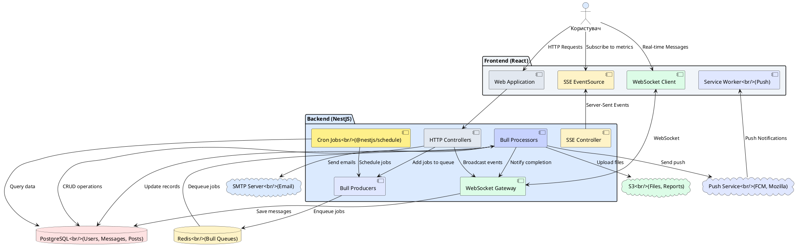
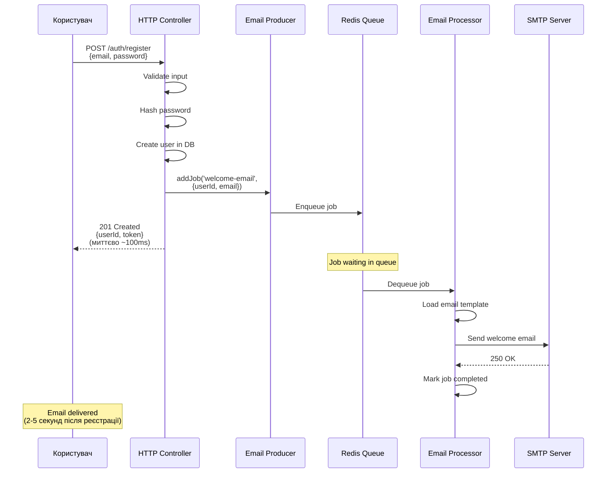
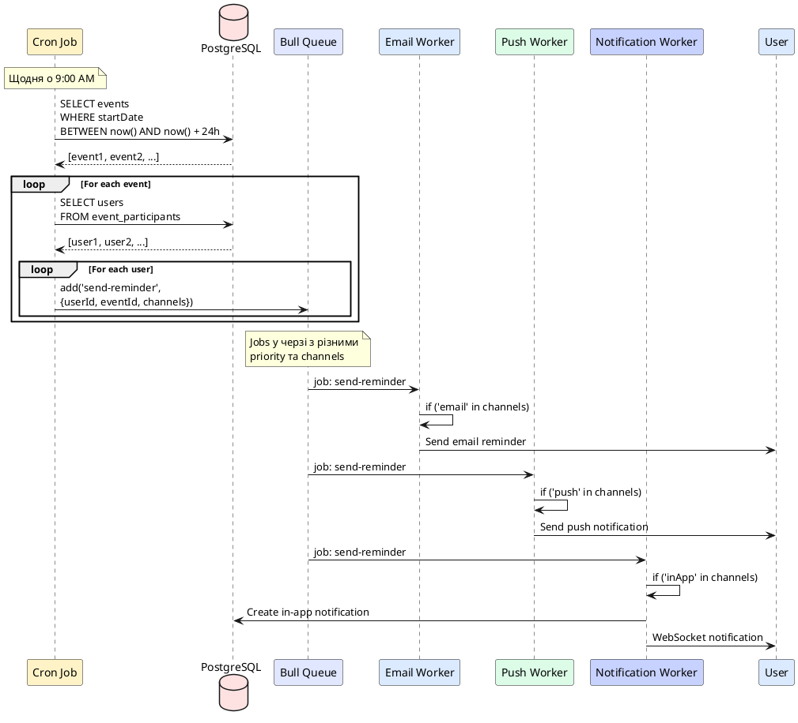
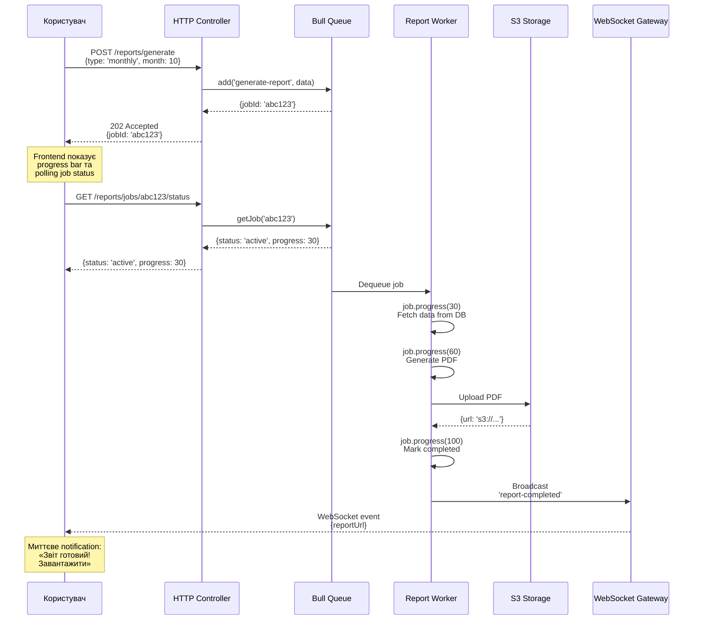
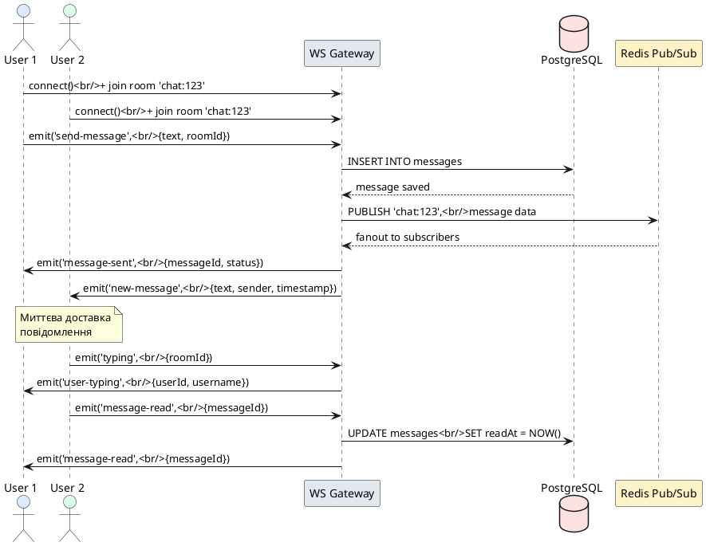
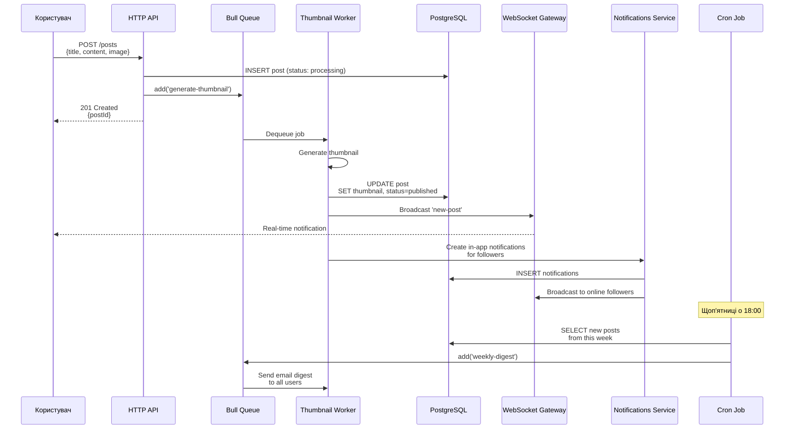

# Практичні сценарії застосування

## Короткий зміст

У цій лекції розглядаються комплексні практичні приклади інтеграції real-time комунікації, нотифікацій та фонових задач:

- **Welcome email після реєстрації** — при POST /auth/register створюється job у черзі для відправки welcome email, job processor відправляє email через MailerService, retry logic при помилках SMTP, user отримує email через кілька секунд
- **Нагадування про події** — cron job запускається щодня о 9:00, перевіряє БД на події у найближчі 24 години, для кожного користувача створюється job у черзі для відправки email/push нотифікації, tracking відправлених нагадувань
- **Очищення застарілих даних** — cron job раз на тиждень (неділя о 2:00), видалення expired JWT refresh tokens, видалення soft-deleted entities старше 30 днів, архівування старих логів, vacuum database
- **Генерація звітів у фоні** — користувач запитує звіт через API, створюється job у черзі з високим priority, processor генерує PDF/Excel через puppeteer/exceljs, збереження у S3/local storage, відправка in-app notification + email з посиланням на завантаження
- **Real-time чат** — WebSocket Gateway для обміну повідомленнями, rooms для приватних чатів та груп, збереження повідомлень у БД, typing indicators, read receipts, online status tracking
- **Live dashboard** — SSE endpoint для streaming метрик, Observable генерує оновлення кожні 5 секунд, aggregating metrics з БД (active users, requests/sec, errors), frontend EventSource підписується та оновлює charts
- **Комбінований сценарій** — користувач публікує пост → створюється job для генерації thumbnail → WebSocket broadcast followers про новий пост → in-app notifications для followers → email digest раз на тиждень через cron

Кожен сценарій включає: архітектурну схему, code snippets, error handling, моніторинг, best practices для продакшену.

---

::card-group

::card{title="🎯 Мета лекції" icon="i-lucide-target"}

- Інтегрувати **всі вивчені технології** (WebSocket, SSE, Email, Push, Bull Queue, Scheduler) у реальні use cases.
- Розробити **Welcome Flow** з асинхронною email відправкою через Bull Queue для покращення UX.
- Реалізувати **Event Reminders** через комбінацію Scheduler (timing) + Queue (надійна доставка) + Multi-channel (email + push).
- Створити **Real-time Chat** з WebSocket rooms, typing indicators, read receipts, message persistence у PostgreSQL.
- Впровадити **Background Report Generation** з progress tracking, S3 upload, та notification після завершення.
- Побудувати **Live Dashboard** через SSE для streaming metrics без overhead WebSocket bidirectional communication.
- Застосувати **error handling**, **retry logic**, **monitoring** patterns у кожному сценарії для production-ready рішень.

::

::card{title="🔑 Ключові патерни" icon="i-lucide-key"}

- **Async Job Pattern:** HTTP endpoint додає job у чергу → миттєва відповідь користувачу → worker обробляє у фоні.
- **Scheduler + Queue Pattern:** Cron job запускає scheduled task → додає jobs у чергу для кожного користувача → workers обробляють паралельно.
- **Multi-channel Notification:** Одна подія → кілька каналів доставки (WebSocket для online, Push для offline, Email як fallback).
- **Progress Tracking Pattern:** Довга операція → періодичне оновлення `job.progress()` → frontend polling або WebSocket для real-time updates.
- **Room-based Communication:** WebSocket rooms для ізоляції повідомлень між різними чатами/групами.
- **SSE for Read-only Streams:** Server-to-client streaming даних без overhead bidirectional WebSocket.

::

::

---

## Архітектурний огляд: Інтеграція всіх компонентів

Перед тим, як перейти до конкретних сценаріїв, розглянемо **high-level архітектуру** системи, що інтегрує всі вивчені технології:

::plant-uml{alt="High-level архітектура з усіма компонентами"}



::

**Взаємодія компонентів:**

| Компонент | Відповідальність | Технологія |
|-----------|------------------|------------|
| **HTTP Controllers** | Обробка REST API запитів, додавання jobs у чергу | NestJS Controllers |
| **WebSocket Gateway** | Real-time bidirectional communication (чат, live updates) | `@nestjs/websockets` |
| **SSE Controller** | Server-to-client streaming (metrics, logs) | Server-Sent Events |
| **Cron Jobs** | Scheduled tasks за розкладом | `@nestjs/schedule` |
| **Bull Producers** | Додавання jobs у чергу (email, reports, notifications) | `@nestjs/bull` |
| **Bull Processors** | Асинхронна обробка jobs з retry logic | `@nestjs/bull` |
| **PostgreSQL** | Persistence даних (users, messages, posts, notifications) | TypeORM |
| **Redis** | Bull queues, caching, pub/sub | Redis |
| **SMTP** | Email delivery | Nodemailer |
| **Push Service** | Browser push notifications | web-push, FCM |
| **S3** | File storage (uploaded images, generated reports) | AWS S3 / MinIO |

---

## Сценарій 1: Welcome Email після реєстрації

**Use Case:** Користувач реєструється → миттєво отримує відповідь від API → через кілька секунд отримує welcome email.

### Архітектурна схема

::mermaid



::

### Реалізація

#### HTTP Controller

```typescript
// src/auth/auth.controller.ts
import { Controller, Post, Body, HttpCode, HttpStatus } from '@nestjs/common';
import { AuthService } from './auth.service';
import { EmailService } from '../email/email.service';

interface RegisterDto {
  email: string;
  password: string;
  username: string;
}

@Controller('auth')
export class AuthController {
  constructor(
    private authService: AuthService,
    private emailService: EmailService,
  ) {}

  @Post('register')
  @HttpCode(HttpStatus.CREATED)
  async register(@Body() dto: RegisterDto) {
    // 1. Валідація та створення користувача
    const user = await this.authService.register(dto);

    // 2. Додати job для welcome email у чергу (не блокує відповідь)
    await this.emailService.sendWelcomeEmail(user.id, user.email, user.username);

    // 3. Миттєво повернути відповідь
    return {
      success: true,
      userId: user.id,
      message: 'Реєстрація успішна! Перевірте email для підтвердження.',
    };
  }
}
```

#### Email Producer

```typescript
// src/email/email.service.ts
import { Injectable, Logger } from '@nestjs/common';
import { InjectQueue } from '@nestjs/bull';
import { Queue } from 'bull';

@Injectable()
export class EmailService {
  private readonly logger = new Logger(EmailService.name);

  constructor(@InjectQueue('email') private emailQueue: Queue) {}

  /**
   * Додати welcome email job у чергу
   */
  async sendWelcomeEmail(
    userId: number,
    email: string,
    username: string,
  ): Promise<void> {
    try {
      await this.emailQueue.add(
        'welcome-email',
        {
          userId,
          email,
          username,
          timestamp: new Date().toISOString(),
        },
        {
          attempts: 5, // Важливий email — більше retry
          backoff: {
            type: 'exponential',
            delay: 3000, // 3s базова затримка
          },
          priority: 1, // Високий пріоритет
          removeOnComplete: true,
        },
      );

      this.logger.log(`[EmailService] Welcome email job added for user ${userId}`);
    } catch (error) {
      // Навіть якщо dodavannya job failed, реєстрація успішна
      this.logger.error(
        `[EmailService] Failed to add welcome email job for user ${userId}:`,
        error.message,
      );
      // Відправити alert DevOps команді
    }
  }
}
```

#### Email Processor

```typescript
// src/email/email.processor.ts
import { Processor, Process, OnQueueCompleted, OnQueueFailed } from '@nestjs/bull';
import { Job } from 'bull';
import { Injectable, Logger } from '@nestjs/common';
import { MailerService } from '@nestjs-modules/mailer';

interface WelcomeEmailJobData {
  userId: number;
  email: string;
  username: string;
  timestamp: string;
}

@Processor('email')
@Injectable()
export class EmailProcessor {
  private readonly logger = new Logger(EmailProcessor.name);

  constructor(private mailerService: MailerService) {}

  @Process('welcome-email')
  async handleWelcomeEmail(job: Job<WelcomeEmailJobData>): Promise<void> {
    const { userId, email, username } = job.data;

    this.logger.log(`[EmailProcessor] Processing welcome email for user ${userId}`);

    try {
      await this.mailerService.sendMail({
        to: email,
        subject: 'Ласкаво просимо до нашого сервісу!',
        template: 'welcome', // Handlebars template: views/emails/welcome.hbs
        context: {
          username,
          loginUrl: `${process.env.APP_URL}/login`,
          supportEmail: process.env.SUPPORT_EMAIL,
        },
      });

      this.logger.log(`[EmailProcessor] Welcome email sent to ${email}`);
    } catch (error) {
      this.logger.error(
        `[EmailProcessor] Failed to send welcome email to ${email}:`,
        error.message,
      );
      throw error; // Bull автоматично retry
    }
  }

  @OnQueueCompleted()
  onCompleted(job: Job) {
    if (job.name === 'welcome-email') {
      this.logger.log(`[EmailProcessor] Job ${job.id} completed for user ${job.data.userId}`);
    }
  }

  @OnQueueFailed()
  onFailed(job: Job, error: Error) {
    if (job.name === 'welcome-email' && job.attemptsMade === job.opts.attempts) {
      this.logger.error(
        `[EmailProcessor] Job ${job.id} permanently failed for user ${job.data.userId} after ${job.attemptsMade} attempts`,
      );
      // Відправити alert DevOps команді
    }
  }
}
```

### Email Template

```handlebars
<!-- views/emails/welcome.hbs -->
<!DOCTYPE html>
<html>
<head>
  <meta charset="UTF-8">
  <title>Welcome Email</title>
</head>
<body style="font-family: Arial, sans-serif; max-width: 600px; margin: 0 auto;">
  <div style="background: linear-gradient(135deg, #667eea 0%, #764ba2 100%); padding: 40px; text-align: center;">
    <h1 style="color: white; margin: 0;">Ласкаво просимо, {{username}}!</h1>
  </div>
  
  <div style="padding: 40px;">
    <p>Дякуємо за реєстрацію у нашому сервісі!</p>
    
    <p>Ваш акаунт успішно створено. Тепер ви можете:</p>
    
    <ul>
      <li>Створювати пости та коментарі</li>
      <li>Підписуватися на інших користувачів</li>
      <li>Отримувати персоналізовані рекомендації</li>
    </ul>
    
    <div style="text-align: center; margin: 30px 0;">
      <a href="{{loginUrl}}" 
         style="background: #667eea; color: white; padding: 15px 30px; 
                text-decoration: none; border-radius: 5px; display: inline-block;">
        Увійти в акаунт
      </a>
    </div>
    
    <p style="color: #666; font-size: 14px;">
      Якщо у вас виникли питання, зв'яжіться з нами: 
      <a href="mailto:{{supportEmail}}">{{supportEmail}}</a>
    </p>
  </div>
  
  <div style="background: #f5f5f5; padding: 20px; text-align: center; font-size: 12px; color: #666;">
    <p>© 2026 Your Company. Всі права захищені.</p>
  </div>
</body>
</html>
```

### Моніторинг та Metrics

```typescript
// src/email/email.processor.ts (доповнення)
import { Injectable } from '@nestjs/common';
import * as client from 'prom-client';

@Injectable()
export class EmailProcessor {
  private emailsSentCounter: client.Counter;
  private emailDeliveryDuration: client.Histogram;

  constructor(private mailerService: MailerService) {
    // Prometheus metrics
    this.emailsSentCounter = new client.Counter({
      name: 'emails_sent_total',
      help: 'Total number of emails sent',
      labelNames: ['type', 'status'], // type: welcome, reset-password, etc.
    });

    this.emailDeliveryDuration = new client.Histogram({
      name: 'email_delivery_duration_seconds',
      help: 'Email delivery duration',
      labelNames: ['type'],
      buckets: [0.5, 1, 2, 5, 10], // секунди
    });
  }

  @Process('welcome-email')
  async handleWelcomeEmail(job: Job<WelcomeEmailJobData>): Promise<void> {
    const startTime = Date.now();

    try {
      await this.mailerService.sendMail({...});

      // Metrics: success
      this.emailsSentCounter.inc({ type: 'welcome', status: 'success' });
      const duration = (Date.now() - startTime) / 1000;
      this.emailDeliveryDuration.observe({ type: 'welcome' }, duration);
    } catch (error) {
      // Metrics: failed
      this.emailsSentCounter.inc({ type: 'welcome', status: 'failed' });
      throw error;
    }
  }
}
```

::tip
**UX Improvement:** Після реєстрації показуйте користувачу спливаюче повідомлення: "Ми відправили email підтвердження на your@email.com. Перевірте вхідні (та spam)."
::


---

## Сценарій 2: Event Reminders (Multi-channel)

**Use Case:** Щодня о 9:00 система перевіряє події на наступні 24 години → відправляє нагадування через Email + Push + In-App Notification.

### Архітектурна схема

::plant-uml{alt="Event Reminders Flow"}



::

### Реалізація

#### Scheduler Service

```typescript
// src/events/events-reminder.service.ts
import { Injectable, Logger } from '@nestjs/common';
import { Cron, CronExpression } from '@nestjs/schedule';
import { InjectQueue } from '@nestjs/bull';
import { Queue } from 'bull';
import { InjectRepository } from '@nestjs/typeorm';
import { Repository, Between } from 'typeorm';
import { Event } from './entities/event.entity';

@Injectable()
export class EventsReminderService {
  private readonly logger = new Logger(EventsReminderService.name);

  constructor(
    @InjectQueue('reminders') private remindersQueue: Queue,
    @InjectRepository(Event) private eventsRepository: Repository<Event>,
  ) {}

  /**
   * Щодня о 9:00 відправити нагадування про події у найближчі 24 години
   */
  @Cron(CronExpression.EVERY_DAY_AT_9AM, {
    name: 'event-reminders',
    timeZone: 'Europe/Kiev',
  })
  async sendEventReminders() {
    this.logger.log('[EventsReminder] Checking for upcoming events...');

    try {
      const now = new Date();
      const tomorrow = new Date(now.getTime() + 24 * 60 * 60 * 1000);

      // Знайти події у найближчі 24 години
      const upcomingEvents = await this.eventsRepository.find({
        where: {
          startDate: Between(now, tomorrow),
          cancelled: false,
        },
        relations: ['participants'], // Eager load учасників
      });

      this.logger.log(
        `[EventsReminder] Found ${upcomingEvents.length} upcoming events`
      );

      let totalJobs = 0;

      // Для кожної події створити reminder jobs для всіх учасників
      for (const event of upcomingEvents) {
        for (const participant of event.participants) {
          // Визначити канали для нагадування (з user preferences)
          const channels = this.getUserReminderChannels(participant);

          await this.remindersQueue.add(
            'send-event-reminder',
            {
              userId: participant.id,
              eventId: event.id,
              eventTitle: event.title,
              eventStartDate: event.startDate,
              channels, // ['email', 'push', 'inApp']
            },
            {
              attempts: 3,
              priority: this.calculatePriority(event.startDate),
              removeOnComplete: true,
            },
          );

          totalJobs++;
        }
      }

      this.logger.log(
        `[EventsReminder] ${totalJobs} reminder jobs added to queue`
      );
    } catch (error) {
      this.logger.error('[EventsReminder] Failed:', error.message);
    }
  }

  /**
   * Визначити канали нагадувань для користувача
   */
  private getUserReminderChannels(user: any): string[] {
    const channels: string[] = [];

    if (user.preferences?.emailReminders !== false) {
      channels.push('email');
    }

    if (user.preferences?.pushReminders !== false) {
      channels.push('push');
    }

    // In-app notification завжди
    channels.push('inApp');

    return channels;
  }

  /**
   * Розрахувати пріоритет job: події що скоро починаються — вищий пріоритет
   */
  private calculatePriority(startDate: Date): number {
    const hoursUntilEvent = (startDate.getTime() - Date.now()) / (1000 * 60 * 60);

    if (hoursUntilEvent < 1) return 1; // Дуже високий (починається через годину)
    if (hoursUntilEvent < 3) return 2; // Високий
    if (hoursUntilEvent < 12) return 3; // Середній
    return 5; // Звичайний
  }
}
```

#### Reminder Processor

```typescript
// src/reminders/reminders.processor.ts
import { Processor, Process } from '@nestjs/bull';
import { Job } from 'bull';
import { Injectable, Logger } from '@nestjs/common';
import { MailerService } from '@nestjs-modules/mailer';
import { PushService } from '../push/push.service';
import { NotificationsService } from '../notifications/notifications.service';

interface EventReminderJobData {
  userId: number;
  eventId: number;
  eventTitle: string;
  eventStartDate: Date;
  channels: string[]; // ['email', 'push', 'inApp']
}

@Processor('reminders')
@Injectable()
export class RemindersProcessor {
  private readonly logger = new Logger(RemindersProcessor.name);

  constructor(
    private mailerService: MailerService,
    private pushService: PushService,
    private notificationsService: NotificationsService,
  ) {}

  @Process('send-event-reminder')
  async handleEventReminder(job: Job<EventReminderJobData>): Promise<void> {
    const { userId, eventId, eventTitle, eventStartDate, channels } = job.data;

    this.logger.log(
      `[RemindersProcessor] Processing reminder for user ${userId}, event ${eventId}`
    );

    const results: Record<string, boolean> = {};

    // Email channel
    if (channels.includes('email')) {
      try {
        await this.sendEmailReminder(userId, eventTitle, eventStartDate);
        results.email = true;
      } catch (error) {
        this.logger.error(`[RemindersProcessor] Email failed:`, error.message);
        results.email = false;
      }
    }

    // Push channel
    if (channels.includes('push')) {
      try {
        await this.sendPushReminder(userId, eventTitle, eventStartDate);
        results.push = true;
      } catch (error) {
        this.logger.error(`[RemindersProcessor] Push failed:`, error.message);
        results.push = false;
      }
    }

    // In-App Notification channel (завжди має бути успішним)
    if (channels.includes('inApp')) {
      try {
        await this.sendInAppReminder(userId, eventId, eventTitle, eventStartDate);
        results.inApp = true;
      } catch (error) {
        this.logger.error(`[RemindersProcessor] In-App failed:`, error.message);
        results.inApp = false;
        throw error; // Якщо in-app failed, retry job
      }
    }

    this.logger.log(
      `[RemindersProcessor] Reminder sent: ${JSON.stringify(results)}`
    );
  }

  private async sendEmailReminder(
    userId: number,
    eventTitle: string,
    startDate: Date,
  ): Promise<void> {
    const user = await this.getUserEmail(userId);

    await this.mailerService.sendMail({
      to: user.email,
      subject: `Нагадування: ${eventTitle}`,
      template: 'event-reminder',
      context: {
        username: user.username,
        eventTitle,
        startDate: startDate.toLocaleString('uk-UA'),
        eventUrl: `${process.env.APP_URL}/events/${eventTitle}`,
      },
    });
  }

  private async sendPushReminder(
    userId: number,
    eventTitle: string,
    startDate: Date,
  ): Promise<void> {
    const timeUntilEvent = this.formatTimeUntil(startDate);

    await this.pushService.sendToUser(userId, {
      title: 'Нагадування про подію',
      body: `${eventTitle} починається ${timeUntilEvent}`,
      icon: '/icons/event-reminder.png',
      badge: '/icons/badge.png',
      data: {
        type: 'event-reminder',
        eventId: eventTitle,
        url: `/events/${eventTitle}`,
      },
      actions: [
        { action: 'view', title: 'Переглянути', icon: '/icons/view.png' },
        { action: 'dismiss', title: 'Відхилити' },
      ],
    });
  }

  private async sendInAppReminder(
    userId: number,
    eventId: number,
    eventTitle: string,
    startDate: Date,
  ): Promise<void> {
    await this.notificationsService.create({
      userId,
      type: 'event-reminder',
      title: 'Нагадування про подію',
      message: `${eventTitle} починається ${this.formatTimeUntil(startDate)}`,
      metadata: {
        eventId,
        startDate: startDate.toISOString(),
      },
      read: false,
    });

    // WebSocket notification для online користувачів
    // NotificationsService викликає WebSocket Gateway під капотом
  }

  private formatTimeUntil(date: Date): string {
    const diff = date.getTime() - Date.now();
    const hours = Math.floor(diff / (1000 * 60 * 60));
    const minutes = Math.floor((diff % (1000 * 60 * 60)) / (1000 * 60));

    if (hours < 1) {
      return `через ${minutes} хвилин`;
    }
    return `через ${hours} годин ${minutes} хвилин`;
  }

  private async getUserEmail(userId: number): Promise<any> {
    // Завантажити user з БД
    return { email: 'user@example.com', username: 'User' };
  }
}
```

### Tracking відправлених нагадувань

```typescript
// src/events/entities/event-reminder.entity.ts
import { Entity, PrimaryGeneratedColumn, Column, CreateDateColumn } from 'typeorm';

@Entity('event_reminders')
export class EventReminder {
  @PrimaryGeneratedColumn()
  id: number;

  @Column()
  userId: number;

  @Column()
  eventId: number;

  @Column('simple-array') // ['email', 'push', 'inApp']
  channels: string[];

  @Column('jsonb', { nullable: true })
  results: Record<string, boolean>; // { email: true, push: false, inApp: true }

  @CreateDateColumn()
  sentAt: Date;
}
```

Processor оновлюється для збереження tracking:

```typescript
@Process('send-event-reminder')
async handleEventReminder(job: Job<EventReminderJobData>): Promise<void> {
  const { userId, eventId, channels } = job.data;

  const results = {
    email: false,
    push: false,
    inApp: false,
  };

  // Відправка через канали...
  // ... (код з попереднього прикладу)

  // Зберегти tracking record
  await this.eventRemindersRepository.save({
    userId,
    eventId,
    channels,
    results,
  });
}
```

::note
**Deduplication:** Якщо користувач є учасником кількох подій у той самий день, він може отримати кілька нагадувань. Для покращення UX розгляньте **batch reminders**: одне email з переліком всіх подій замість окремих emails.
::

---

## Сценарій 3: Background Report Generation

**Use Case:** Користувач запитує звіт через API → система генерує PDF у фоні → після завершення відправляє notification з посиланням.

### Архітектурна схема

::mermaid



::

### Реалізація

#### HTTP Controller

```typescript
// src/reports/reports.controller.ts
import { Controller, Post, Get, Body, Param, UseGuards, Req } from '@nestjs/common';
import { JwtAuthGuard } from '../auth/guards/jwt-auth.guard';
import { ReportsService } from './reports.service';

interface GenerateReportDto {
  type: 'daily' | 'weekly' | 'monthly' | 'annual';
  startDate?: string;
  endDate?: string;
  month?: number;
  year?: number;
}

@Controller('reports')
@UseGuards(JwtAuthGuard)
export class ReportsController {
  constructor(private reportsService: ReportsService) {}

  /**
   * POST /reports/generate
   * Створити job для генерації звіту
   */
  @Post('generate')
  async generateReport(@Req() req: any, @Body() dto: GenerateReportDto) {
    const userId = req.user.id;

    const jobId = await this.reportsService.generateReport(userId, dto);

    return {
      success: true,
      jobId,
      message: 'Звіт генерується. Ви отримаєте notification після завершення.',
      statusUrl: `/reports/jobs/${jobId}/status`,
    };
  }

  /**
   * GET /reports/jobs/:jobId/status
   * Отримати статус job
   */
  @Get('jobs/:jobId/status')
  async getJobStatus(@Param('jobId') jobId: string) {
    return this.reportsService.getJobStatus(jobId);
  }

  /**
   * GET /reports/history
   * Отримати історію згенерованих звітів
   */
  @Get('history')
  async getReportsHistory(@Req() req: any) {
    const userId = req.user.id;
    return this.reportsService.getReportsHistory(userId);
  }
}
```

#### Reports Service (Producer)

```typescript
// src/reports/reports.service.ts
import { Injectable } from '@nestjs/common';
import { InjectQueue } from '@nestjs/bull';
import { Queue } from 'bull';

@Injectable()
export class ReportsService {
  constructor(
    @InjectQueue('reports') private reportsQueue: Queue,
  ) {}

  async generateReport(userId: number, dto: any): Promise<string> {
    const job = await this.reportsQueue.add(
      'generate-report',
      {
        userId,
        type: dto.type,
        startDate: dto.startDate,
        endDate: dto.endDate,
        month: dto.month,
        year: dto.year,
        requestedAt: new Date().toISOString(),
      },
      {
        attempts: 3,
        priority: this.getPriority(dto.type),
        timeout: 5 * 60 * 1000, // 5 хвилин максимум
        backoff: {
          type: 'exponential',
          delay: 5000,
        },
      },
    );

    return job.id as string;
  }

  async getJobStatus(jobId: string) {
    const job = await this.reportsQueue.getJob(jobId);

    if (!job) {
      return { status: 'not_found' };
    }

    const state = await job.getState();
    const progress = job.progress();

    return {
      jobId: job.id,
      status: state, // 'waiting', 'active', 'completed', 'failed'
      progress, // 0-100
      data: job.data,
      result: job.returnvalue, // Результат після completed
      failedReason: job.failedReason,
      processedOn: job.processedOn,
      finishedOn: job.finishedOn,
    };
  }

  async getReportsHistory(userId: number) {
    // Завантажити completed jobs для користувача
    const completed = await this.reportsQueue.getCompleted();

    return completed
      .filter((job) => job.data.userId === userId)
      .map((job) => ({
        jobId: job.id,
        type: job.data.type,
        generatedAt: new Date(job.finishedOn),
        downloadUrl: job.returnvalue?.url,
      }));
  }

  private getPriority(type: string): number {
    // Довші звіти — нижчий пріоритет
    const priorities = {
      daily: 2,
      weekly: 3,
      monthly: 4,
      annual: 5,
    };
    return priorities[type] || 3;
  }
}
```

#### Reports Processor (Worker)

```typescript
// src/reports/reports.processor.ts
import { Processor, Process } from '@nestjs/bull';
import { Job } from 'bull';
import { Injectable, Logger } from '@nestjs/common';
import { S3Service } from '../s3/s3.service';
import { NotificationsService } from '../notifications/notifications.service';
import { WebSocketGateway } from '../websocket/websocket.gateway';
import puppeteer from 'puppeteer';

@Processor('reports')
@Injectable()
export class ReportsProcessor {
  private readonly logger = new Logger(ReportsProcessor.name);

  constructor(
    private s3Service: S3Service,
    private notificationsService: NotificationsService,
    private wsGateway: WebSocketGateway,
  ) {}

  @Process({ name: 'generate-report', concurrency: 2 })
  async handleGenerateReport(job: Job): Promise<{ url: string; filename: string }> {
    const { userId, type, startDate, endDate, month, year } = job.data;

    this.logger.log(`[ReportsProcessor] Generating ${type} report for user ${userId}`);

    try {
      // Крок 1: Fetch data (30% прогресу)
      await job.progress(10);
      const data = await this.fetchReportData(userId, type, { startDate, endDate, month, year });
      await job.progress(30);

      // Крок 2: Generate HTML (60% прогресу)
      const html = await this.generateReportHTML(type, data);
      await job.progress(60);

      // Крок 3: Convert to PDF через Puppeteer (80% прогресу)
      const pdfBuffer = await this.convertHTMLToPDF(html);
      await job.progress(80);

      // Крок 4: Upload to S3 (95% прогресу)
      const filename = `report-${type}-${Date.now()}.pdf`;
      const s3Key = `reports/${userId}/${filename}`;
      await this.s3Service.upload(s3Key, pdfBuffer);
      await job.progress(95);

      // Крок 5: Create notification (100%)
      const downloadUrl = await this.s3Service.getSignedUrl(s3Key, 7 * 24 * 60 * 60); // 7 днів

      await this.notificationsService.create({
        userId,
        type: 'report-ready',
        title: 'Звіт готовий!',
        message: `Ваш ${type} звіт успішно згенеровано.`,
        metadata: {
          reportType: type,
          downloadUrl,
          expiresAt: new Date(Date.now() + 7 * 24 * 60 * 60 * 1000),
        },
      });

      // WebSocket notification для real-time update
      this.wsGateway.emitToUser(userId, 'report-completed', {
        jobId: job.id,
        reportType: type,
        downloadUrl,
      });

      await job.progress(100);

      this.logger.log(`[ReportsProcessor] Report completed for user ${userId}`);

      return { url: downloadUrl, filename };
    } catch (error) {
      this.logger.error(`[ReportsProcessor] Report generation failed:`, error.message);
      throw error;
    }
  }

  private async fetchReportData(userId: number, type: string, params: any): Promise<any> {
    // Завантажити дані з БД залежно від типу звіту
    // Наприклад, для monthly report: orders, revenue, top products, тощо
    return {
      userId,
      type,
      totalOrders: 150,
      totalRevenue: 12500,
      topProducts: [
        { name: 'Product A', sales: 50 },
        { name: 'Product B', sales: 30 },
      ],
      // ... інші дані
    };
  }

  private async generateReportHTML(type: string, data: any): Promise<string> {
    // Генерувати HTML з даних (можна використовувати template engine: Handlebars, EJS)
    return `
      <!DOCTYPE html>
      <html>
      <head>
        <style>
          body { font-family: Arial, sans-serif; margin: 40px; }
          h1 { color: #333; }
          table { width: 100%; border-collapse: collapse; margin-top: 20px; }
          th, td { border: 1px solid #ddd; padding: 12px; text-align: left; }
          th { background-color: #667eea; color: white; }
        </style>
      </head>
      <body>
        <h1>${type.toUpperCase()} Report</h1>
        <p><strong>Total Orders:</strong> ${data.totalOrders}</p>
        <p><strong>Total Revenue:</strong> $${data.totalRevenue}</p>
        
        <h2>Top Products</h2>
        <table>
          <thead>
            <tr>
              <th>Product</th>
              <th>Sales</th>
            </tr>
          </thead>
          <tbody>
            ${data.topProducts.map(p => `
              <tr>
                <td>${p.name}</td>
                <td>${p.sales}</td>
              </tr>
            `).join('')}
          </tbody>
        </table>
      </body>
      </html>
    `;
  }

  private async convertHTMLToPDF(html: string): Promise<Buffer> {
    const browser = await puppeteer.launch({
      headless: true,
      args: ['--no-sandbox', '--disable-setuid-sandbox'],
    });

    const page = await browser.newPage();
    await page.setContent(html, { waitUntil: 'networkidle0' });

    const pdfBuffer = await page.pdf({
      format: 'A4',
      printBackground: true,
      margin: {
        top: '20mm',
        right: '20mm',
        bottom: '20mm',
        left: '20mm',
      },
    });

    await browser.close();

    return pdfBuffer;
  }
}
```

### Frontend Progress Tracking

```typescript
// src/hooks/useReportGeneration.ts
import { useState, useEffect } from 'react';
import { io, Socket } from 'socket.io-client';

interface ReportStatus {
  status: 'waiting' | 'active' | 'completed' | 'failed' | 'not_found';
  progress: number;
  downloadUrl?: string;
  failedReason?: string;
}

export function useReportGeneration(jobId: string | null) {
  const [status, setStatus] = useState<ReportStatus | null>(null);
  const [socket, setSocket] = useState<Socket | null>(null);

  useEffect(() => {
    if (!jobId) return;

    // Підключитися до WebSocket для real-time updates
    const ws = io('http://localhost:3000', {
      auth: { token: localStorage.getItem('accessToken') },
    });

    ws.on('report-completed', (data) => {
      if (data.jobId === jobId) {
        setStatus({
          status: 'completed',
          progress: 100,
          downloadUrl: data.downloadUrl,
        });
      }
    });

    setSocket(ws);

    // Polling для fallback (якщо WebSocket не працює)
    const interval = setInterval(async () => {
      const response = await fetch(`/api/reports/jobs/${jobId}/status`, {
        headers: {
          Authorization: `Bearer ${localStorage.getItem('accessToken')}`,
        },
      });

      const data = await response.json();
      setStatus(data);

      if (data.status === 'completed' || data.status === 'failed') {
        clearInterval(interval);
      }
    }, 2000); // Polling кожні 2 секунди

    return () => {
      clearInterval(interval);
      ws.disconnect();
    };
  }, [jobId]);

  return status;
}
```

```typescript
// Використання у компоненті
function ReportsPage() {
  const [jobId, setJobId] = useState<string | null>(null);
  const reportStatus = useReportGeneration(jobId);

  const handleGenerateReport = async () => {
    const response = await fetch('/api/reports/generate', {
      method: 'POST',
      headers: {
        'Content-Type': 'application/json',
        Authorization: `Bearer ${localStorage.getItem('accessToken')}`,
      },
      body: JSON.stringify({ type: 'monthly', month: 10, year: 2026 }),
    });

    const data = await response.json();
    setJobId(data.jobId);
  };

  return (
    <div>
      <button onClick={handleGenerateReport}>Generate Monthly Report</button>

      {reportStatus && (
        <div>
          <p>Status: {reportStatus.status}</p>
          {reportStatus.status === 'active' && (
            <progress value={reportStatus.progress} max={100}>
              {reportStatus.progress}%
            </progress>
          )}
          {reportStatus.status === 'completed' && (
            <a href={reportStatus.downloadUrl} download>
              Download Report
            </a>
          )}
          {reportStatus.status === 'failed' && (
            <p>Error: {reportStatus.failedReason}</p>
          )}
        </div>
      )}
    </div>
  );
}
```

::tip
**Production Optimization:** Для великих застосунків з багатьма звітами розгляньте:
- **PDF caching:** Якщо два користувача запитують однаковий звіт (наприклад, monthly report за жовтень 2026), generate лише один раз та reuse.
- **Pre-generated reports:** Для популярних звітів (company-wide monthly report) генеруйте автоматично через cron job та зберігайте у S3.
- **Chunked generation:** Для дуже великих звітів (1000+ сторінок) генеруйте по частинах та merge у кінці.
::


---

## Сценарій 4: Real-time Chat з WebSocket

**Use Case:** Користувачі обмінюються повідомленнями у реальному часі через WebSocket з підтримкою приватних чатів, груп, typing indicators, read receipts.

### Архітектурна схема

::plant-uml{alt="Real-time Chat Architecture"}



::

### Реалізація

#### WebSocket Gateway

```typescript
// src/chat/chat.gateway.ts
import {
  WebSocketGateway,
  WebSocketServer,
  SubscribeMessage,
  OnGatewayConnection,
  OnGatewayDisconnect,
  ConnectedSocket,
  MessageBody,
} from '@nestjs/websockets';
import { Server, Socket } from 'socket.io';
import { UseGuards, Logger } from '@nestjs/common';
import { WsJwtAuthGuard } from '../auth/guards/ws-jwt-auth.guard';
import { ChatService } from './chat.service';

interface AuthenticatedSocket extends Socket {
  user: { id: number; username: string };
}

@WebSocketGateway({
  cors: { origin: process.env.FRONTEND_URL, credentials: true },
  namespace: '/chat',
})
@UseGuards(WsJwtAuthGuard)
export class ChatGateway implements OnGatewayConnection, OnGatewayDisconnect {
  @WebSocketServer()
  server: Server;

  private readonly logger = new Logger(ChatGateway.name);
  private onlineUsers = new Map<number, string>(); // userId -> socketId

  constructor(private chatService: ChatService) {}

  /**
   * Обробка підключення клієнта
   */
  async handleConnection(client: AuthenticatedSocket) {
    const userId = client.user.id;
    const username = client.user.username;

    this.logger.log(`[ChatGateway] User ${username} connected: ${client.id}`);

    // Зберегти online статус
    this.onlineUsers.set(userId, client.id);

    // Broadcast online status
    this.server.emit('user-online', { userId, username });

    // Підписатися на всі rooms користувача
    const rooms = await this.chatService.getUserRooms(userId);
    rooms.forEach((room) => {
      client.join(`room:${room.id}`);
    });
  }

  /**
   * Обробка відключення клієнта
   */
  handleDisconnect(client: AuthenticatedSocket) {
    const userId = client.user.id;
    const username = client.user.username;

    this.logger.log(`[ChatGateway] User ${username} disconnected`);

    this.onlineUsers.delete(userId);

    // Broadcast offline status
    this.server.emit('user-offline', { userId, username });
  }

  /**
   * Відправити повідомлення у room
   */
  @SubscribeMessage('send-message')
  async handleSendMessage(
    @ConnectedSocket() client: AuthenticatedSocket,
    @MessageBody() payload: { roomId: number; text: string; replyToId?: number },
  ) {
    const senderId = client.user.id;
    const { roomId, text, replyToId } = payload;

    this.logger.log(`[ChatGateway] User ${senderId} sending message to room ${roomId}`);

    try {
      // Зберегти повідомлення у БД
      const message = await this.chatService.createMessage({
        senderId,
        roomId,
        text,
        replyToId,
      });

      // Broadcast повідомлення всім у room
      this.server.to(`room:${roomId}`).emit('new-message', {
        id: message.id,
        text: message.text,
        senderId: message.senderId,
        senderUsername: client.user.username,
        roomId: message.roomId,
        replyToId: message.replyToId,
        createdAt: message.createdAt,
        readBy: [], // Ще ніхто не прочитав
      });

      // Підтвердження відправнику
      client.emit('message-sent', {
        tempId: payload['tempId'], // Temp ID з frontend для оптимістичного UI
        messageId: message.id,
        status: 'delivered',
      });
    } catch (error) {
      this.logger.error(`[ChatGateway] Failed to send message:`, error.message);
      client.emit('message-error', {
        tempId: payload['tempId'],
        error: 'Failed to send message',
      });
    }
  }

  /**
   * Typing indicator
   */
  @SubscribeMessage('typing')
  handleTyping(
    @ConnectedSocket() client: AuthenticatedSocket,
    @MessageBody() payload: { roomId: number },
  ) {
    const userId = client.user.id;
    const username = client.user.username;

    // Broadcast typing indicator до room (окрім відправника)
    client.to(`room:${payload.roomId}`).emit('user-typing', {
      userId,
      username,
      roomId: payload.roomId,
    });
  }

  /**
   * Stop typing indicator
   */
  @SubscribeMessage('stop-typing')
  handleStopTyping(
    @ConnectedSocket() client: AuthenticatedSocket,
    @MessageBody() payload: { roomId: number },
  ) {
    const userId = client.user.id;

    client.to(`room:${payload.roomId}`).emit('user-stop-typing', {
      userId,
      roomId: payload.roomId,
    });
  }

  /**
   * Mark message as read
   */
  @SubscribeMessage('message-read')
  async handleMessageRead(
    @ConnectedSocket() client: AuthenticatedSocket,
    @MessageBody() payload: { messageId: number },
  ) {
    const userId = client.user.id;
    const { messageId } = payload;

    try {
      await this.chatService.markMessageAsRead(messageId, userId);

      // Broadcast read receipt до sender
      const message = await this.chatService.getMessage(messageId);
      const senderSocketId = this.onlineUsers.get(message.senderId);

      if (senderSocketId) {
        this.server.to(senderSocketId).emit('message-read', {
          messageId,
          readBy: userId,
          readAt: new Date(),
        });
      }
    } catch (error) {
      this.logger.error(`[ChatGateway] Failed to mark message as read:`, error.message);
    }
  }

  /**
   * Join chat room
   */
  @SubscribeMessage('join-room')
  async handleJoinRoom(
    @ConnectedSocket() client: AuthenticatedSocket,
    @MessageBody() payload: { roomId: number },
  ) {
    const { roomId } = payload;

    // Перевірити права доступу
    const hasAccess = await this.chatService.userHasAccessToRoom(client.user.id, roomId);

    if (!hasAccess) {
      client.emit('error', { message: 'Access denied to this room' });
      return;
    }

    client.join(`room:${roomId}`);

    this.logger.log(`[ChatGateway] User ${client.user.id} joined room ${roomId}`);

    // Завантажити історію повідомлень
    const messages = await this.chatService.getRoomMessages(roomId, { limit: 50 });

    client.emit('room-history', {
      roomId,
      messages,
    });
  }

  /**
   * Leave chat room
   */
  @SubscribeMessage('leave-room')
  handleLeaveRoom(
    @ConnectedSocket() client: AuthenticatedSocket,
    @MessageBody() payload: { roomId: number },
  ) {
    client.leave(`room:${payload.roomId}`);
    this.logger.log(`[ChatGateway] User ${client.user.id} left room ${payload.roomId}`);
  }
}
```

#### Chat Service

```typescript
// src/chat/chat.service.ts
import { Injectable } from '@nestjs/common';
import { InjectRepository } from '@nestjs/typeorm';
import { Repository } from 'typeorm';
import { Message } from './entities/message.entity';
import { Room } from './entities/room.entity';

@Injectable()
export class ChatService {
  constructor(
    @InjectRepository(Message) private messagesRepository: Repository<Message>,
    @InjectRepository(Room) private roomsRepository: Repository<Room>,
  ) {}

  async createMessage(data: {
    senderId: number;
    roomId: number;
    text: string;
    replyToId?: number;
  }): Promise<Message> {
    const message = this.messagesRepository.create(data);
    return this.messagesRepository.save(message);
  }

  async getMessage(messageId: number): Promise<Message> {
    return this.messagesRepository.findOne({
      where: { id: messageId },
      relations: ['sender'],
    });
  }

  async getRoomMessages(
    roomId: number,
    options: { limit?: number; offset?: number } = {},
  ): Promise<Message[]> {
    return this.messagesRepository.find({
      where: { roomId },
      order: { createdAt: 'DESC' },
      take: options.limit || 50,
      skip: options.offset || 0,
      relations: ['sender', 'readBy'],
    });
  }

  async markMessageAsRead(messageId: number, userId: number): Promise<void> {
    const message = await this.messagesRepository.findOne({
      where: { id: messageId },
      relations: ['readBy'],
    });

    if (!message) return;

    // Перевірити, чи вже прочитано
    const alreadyRead = message.readBy.some((user) => user.id === userId);

    if (!alreadyRead) {
      // Додати userId до readBy (many-to-many relation)
      await this.messagesRepository
        .createQueryBuilder()
        .relation(Message, 'readBy')
        .of(messageId)
        .add(userId);
    }
  }

  async getUserRooms(userId: number): Promise<Room[]> {
    return this.roomsRepository
      .createQueryBuilder('room')
      .leftJoin('room.participants', 'participant')
      .where('participant.id = :userId', { userId })
      .getMany();
  }

  async userHasAccessToRoom(userId: number, roomId: number): Promise<boolean> {
    const room = await this.roomsRepository
      .createQueryBuilder('room')
      .leftJoin('room.participants', 'participant')
      .where('room.id = :roomId', { roomId })
      .andWhere('participant.id = :userId', { userId })
      .getOne();

    return !!room;
  }
}
```

#### Entities

```typescript
// src/chat/entities/message.entity.ts
import {
  Entity,
  PrimaryGeneratedColumn,
  Column,
  ManyToOne,
  ManyToMany,
  JoinTable,
  CreateDateColumn,
  JoinColumn,
} from 'typeorm';
import { User } from '../../users/entities/user.entity';
import { Room } from './room.entity';

@Entity('messages')
export class Message {
  @PrimaryGeneratedColumn()
  id: number;

  @Column('text')
  text: string;

  @Column()
  senderId: number;

  @ManyToOne(() => User)
  @JoinColumn({ name: 'senderId' })
  sender: User;

  @Column()
  roomId: number;

  @ManyToOne(() => Room, (room) => room.messages)
  @JoinColumn({ name: 'roomId' })
  room: Room;

  @Column({ nullable: true })
  replyToId?: number;

  @ManyToOne(() => Message, { nullable: true })
  @JoinColumn({ name: 'replyToId' })
  replyTo?: Message;

  @ManyToMany(() => User)
  @JoinTable({
    name: 'message_read_receipts',
    joinColumn: { name: 'messageId' },
    inverseJoinColumn: { name: 'userId' },
  })
  readBy: User[];

  @CreateDateColumn()
  createdAt: Date;
}
```

```typescript
// src/chat/entities/room.entity.ts
import {
  Entity,
  PrimaryGeneratedColumn,
  Column,
  ManyToMany,
  JoinTable,
  OneToMany,
  CreateDateColumn,
} from 'typeorm';
import { User } from '../../users/entities/user.entity';
import { Message } from './message.entity';

@Entity('rooms')
export class Room {
  @PrimaryGeneratedColumn()
  id: number;

  @Column()
  name: string;

  @Column({ default: 'private' })
  type: 'private' | 'group' | 'channel';

  @ManyToMany(() => User)
  @JoinTable({
    name: 'room_participants',
    joinColumn: { name: 'roomId' },
    inverseJoinColumn: { name: 'userId' },
  })
  participants: User[];

  @OneToMany(() => Message, (message) => message.room)
  messages: Message[];

  @CreateDateColumn()
  createdAt: Date;
}
```

### Frontend React Hook

```typescript
// src/hooks/useChat.ts
import { useState, useEffect, useCallback } from 'react';
import { io, Socket } from 'socket.io-client';

interface Message {
  id: number;
  text: string;
  senderId: number;
  senderUsername: string;
  createdAt: string;
  readBy: number[];
}

interface TypingUser {
  userId: number;
  username: string;
}

export function useChat(roomId: number, accessToken: string) {
  const [socket, setSocket] = useState<Socket | null>(null);
  const [messages, setMessages] = useState<Message[]>([]);
  const [typingUsers, setTypingUsers] = useState<TypingUser[]>([]);
  const [connected, setConnected] = useState(false);

  useEffect(() => {
    const ws = io('http://localhost:3000/chat', {
      auth: { token: accessToken },
    });

    ws.on('connect', () => {
      setConnected(true);
      console.log('[Chat] Connected to WebSocket');

      // Join room
      ws.emit('join-room', { roomId });
    });

    ws.on('disconnect', () => {
      setConnected(false);
      console.log('[Chat] Disconnected from WebSocket');
    });

    // Історія повідомлень
    ws.on('room-history', (data: { roomId: number; messages: Message[] }) => {
      setMessages(data.messages.reverse()); // Oldest first
    });

    // Нове повідомлення
    ws.on('new-message', (message: Message) => {
      setMessages((prev) => [...prev, message]);
    });

    // Typing indicators
    ws.on('user-typing', (data: TypingUser & { roomId: number }) => {
      if (data.roomId === roomId) {
        setTypingUsers((prev) => {
          if (prev.some((u) => u.userId === data.userId)) return prev;
          return [...prev, { userId: data.userId, username: data.username }];
        });

        // Auto-remove typing indicator через 3 секунди
        setTimeout(() => {
          setTypingUsers((prev) => prev.filter((u) => u.userId !== data.userId));
        }, 3000);
      }
    });

    ws.on('user-stop-typing', (data: { userId: number; roomId: number }) => {
      if (data.roomId === roomId) {
        setTypingUsers((prev) => prev.filter((u) => u.userId !== data.userId));
      }
    });

    // Read receipts
    ws.on('message-read', (data: { messageId: number; readBy: number }) => {
      setMessages((prev) =>
        prev.map((msg) =>
          msg.id === data.messageId
            ? { ...msg, readBy: [...msg.readBy, data.readBy] }
            : msg
        )
      );
    });

    setSocket(ws);

    return () => {
      ws.emit('leave-room', { roomId });
      ws.disconnect();
    };
  }, [roomId, accessToken]);

  const sendMessage = useCallback(
    (text: string) => {
      if (!socket || !connected) return;

      const tempId = `temp-${Date.now()}`;

      // Оптимістичне оновлення UI
      setMessages((prev) => [
        ...prev,
        {
          id: -1,
          text,
          senderId: 0, // Current user
          senderUsername: 'You',
          createdAt: new Date().toISOString(),
          readBy: [],
          tempId, // Для tracking
        } as any,
      ]);

      socket.emit('send-message', { roomId, text, tempId });

      // Коли отримаємо message-sent, замінимо temp message на real
      socket.once('message-sent', (data: { tempId: string; messageId: number }) => {
        if (data.tempId === tempId) {
          setMessages((prev) =>
            prev.map((msg: any) =>
              msg.tempId === tempId ? { ...msg, id: data.messageId } : msg
            )
          );
        }
      });
    },
    [socket, connected, roomId]
  );

  const sendTyping = useCallback(() => {
    if (!socket || !connected) return;
    socket.emit('typing', { roomId });
  }, [socket, connected, roomId]);

  const stopTyping = useCallback(() => {
    if (!socket || !connected) return;
    socket.emit('stop-typing', { roomId });
  }, [socket, connected, roomId]);

  const markAsRead = useCallback(
    (messageId: number) => {
      if (!socket || !connected) return;
      socket.emit('message-read', { messageId });
    },
    [socket, connected]
  );

  return {
    messages,
    typingUsers,
    connected,
    sendMessage,
    sendTyping,
    stopTyping,
    markAsRead,
  };
}
```

```typescript
// Використання у компоненті
function ChatRoom({ roomId }: { roomId: number }) {
  const accessToken = localStorage.getItem('accessToken');
  const { messages, typingUsers, connected, sendMessage, sendTyping, stopTyping } = useChat(
    roomId,
    accessToken
  );

  const [inputValue, setInputValue] = useState('');
  let typingTimeout: NodeJS.Timeout;

  const handleInputChange = (e: React.ChangeEvent<HTMLInputElement>) => {
    setInputValue(e.target.value);

    // Send typing indicator
    sendTyping();

    // Auto-stop typing після 2 секунд бездіяльності
    clearTimeout(typingTimeout);
    typingTimeout = setTimeout(() => {
      stopTyping();
    }, 2000);
  };

  const handleSend = () => {
    if (inputValue.trim()) {
      sendMessage(inputValue);
      setInputValue('');
      stopTyping();
    }
  };

  return (
    <div className="chat-room">
      <div className="connection-status">
        {connected ? '🟢 Connected' : '🔴 Disconnected'}
      </div>

      <div className="messages">
        {messages.map((msg) => (
          <div key={msg.id} className="message">
            <strong>{msg.senderUsername}:</strong> {msg.text}
            <span className="timestamp">{new Date(msg.createdAt).toLocaleTimeString()}</span>
            {msg.readBy.length > 0 && <span className="read-receipt">✓✓</span>}
          </div>
        ))}

        {typingUsers.length > 0 && (
          <div className="typing-indicator">
            {typingUsers.map((u) => u.username).join(', ')} typing...
          </div>
        )}
      </div>

      <div className="input-area">
        <input
          type="text"
          value={inputValue}
          onChange={handleInputChange}
          onKeyPress={(e) => e.key === 'Enter' && handleSend()}
          placeholder="Type a message..."
        />
        <button onClick={handleSend}>Send</button>
      </div>
    </div>
  );
}
```

::note
**Horizontal Scaling:** Для scaling WebSocket Gateway на кілька instances використовуйте **Redis Adapter** для Socket.IO, щоб events broadcast across instances:

```typescript
import { IoAdapter } from '@nestjs/platform-socket.io';
import { createAdapter } from '@socket.io/redis-adapter';
import { createClient } from 'redis';

const pubClient = createClient({ url: 'redis://localhost:6379' });
const subClient = pubClient.duplicate();

await Promise.all([pubClient.connect(), subClient.connect()]);

io.adapter(createAdapter(pubClient, subClient));
```
::


---

## Сценарій 5: Live Metrics Dashboard через SSE

**Use Case:** Admin dashboard з real-time метриками (active users, requests/sec, errors) через Server-Sent Events без overhead WebSocket.

### Реалізація

#### SSE Controller

```typescript
// src/metrics/metrics.controller.ts
import { Controller, Sse, UseGuards } from '@nestjs/common';
import { Observable, interval } from 'rxjs';
import { map } from 'rxjs/operators';
import { JwtAuthGuard } from '../auth/guards/jwt-auth.guard';
import { MetricsService } from './metrics.service';

interface MessageEvent {
  data: string | object;
  id?: string;
  type?: string;
  retry?: number;
}

@Controller('metrics')
@UseGuards(JwtAuthGuard) // Лише authenticated користувачі
export class MetricsController {
  constructor(private metricsService: MetricsService) {}

  /**
   * GET /metrics/stream
   * SSE endpoint для streaming метрик
   */
  @Sse('stream')
  streamMetrics(): Observable<MessageEvent> {
    return interval(5000).pipe(
      // Кожні 5 секунд
      map(async () => {
        const metrics = await this.metricsService.getCurrentMetrics();

        return {
          data: {
            timestamp: new Date().toISOString(),
            activeUsers: metrics.activeUsers,
            requestsPerSecond: metrics.requestsPerSecond,
            errorsPerMinute: metrics.errorsPerMinute,
            cpuUsage: metrics.cpuUsage,
            memoryUsage: metrics.memoryUsage,
            databaseConnections: metrics.databaseConnections,
          },
        };
      }),
    );
  }

  /**
   * GET /metrics/stream/system
   * SSE endpoint для system metrics (CPU, Memory, Disk)
   */
  @Sse('stream/system')
  streamSystemMetrics(): Observable<MessageEvent> {
    return interval(2000).pipe(
      // Кожні 2 секунди
      map(() => {
        const cpuUsage = process.cpuUsage();
        const memoryUsage = process.memoryUsage();

        return {
          data: {
            cpu: {
              user: cpuUsage.user / 1000000, // Convert to seconds
              system: cpuUsage.system / 1000000,
            },
            memory: {
              rss: (memoryUsage.rss / 1024 / 1024).toFixed(2), // MB
              heapTotal: (memoryUsage.heapTotal / 1024 / 1024).toFixed(2),
              heapUsed: (memoryUsage.heapUsed / 1024 / 1024).toFixed(2),
              external: (memoryUsage.external / 1024 / 1024).toFixed(2),
            },
            uptime: process.uptime(), // seconds
          },
        };
      }),
    );
  }
}
```

#### Metrics Service

```typescript
// src/metrics/metrics.service.ts
import { Injectable } from '@nestjs/common';
import { InjectRepository } from '@nestjs/typeorm';
import { Repository } from 'typeorm';
import { User } from '../users/entities/user.entity';
import { RequestLog } from './entities/request-log.entity';

@Injectable()
export class MetricsService {
  constructor(
    @InjectRepository(User) private usersRepository: Repository<User>,
    @InjectRepository(RequestLog) private requestLogsRepository: Repository<RequestLog>,
  ) {}

  async getCurrentMetrics() {
    const now = new Date();
    const oneMinuteAgo = new Date(now.getTime() - 60 * 1000);
    const oneSecondAgo = new Date(now.getTime() - 1000);

    // Active users (last seen у останні 5 хвилин)
    const fiveMinutesAgo = new Date(now.getTime() - 5 * 60 * 1000);
    const activeUsers = await this.usersRepository
      .createQueryBuilder('user')
      .where('user.lastSeenAt >= :fiveMinutesAgo', { fiveMinutesAgo })
      .getCount();

    // Requests per second
    const requestsLastSecond = await this.requestLogsRepository.count({
      where: {
        timestamp: Between(oneSecondAgo, now),
      },
    });

    // Errors per minute
    const errorsLastMinute = await this.requestLogsRepository.count({
      where: {
        level: 'error',
        timestamp: Between(oneMinuteAgo, now),
      },
    });

    // System metrics
    const cpuUsage = process.cpuUsage();
    const memoryUsage = process.memoryUsage();

    return {
      activeUsers,
      requestsPerSecond: requestsLastSecond,
      errorsPerMinute: errorsLastMinute,
      cpuUsage: ((cpuUsage.user + cpuUsage.system) / 1000000).toFixed(2), // %
      memoryUsage: ((memoryUsage.heapUsed / memoryUsage.heapTotal) * 100).toFixed(2), // %
      databaseConnections: await this.getDatabaseConnections(),
    };
  }

  private async getDatabaseConnections(): Promise<number> {
    // PostgreSQL specific query
    const result = await this.usersRepository.query(
      `SELECT count(*) FROM pg_stat_activity WHERE datname = current_database()`
    );
    return parseInt(result[0].count, 10);
  }
}
```

### Frontend EventSource

```typescript
// src/hooks/useMetrics.ts
import { useState, useEffect } from 'react';

interface Metrics {
  timestamp: string;
  activeUsers: number;
  requestsPerSecond: number;
  errorsPerMinute: number;
  cpuUsage: string;
  memoryUsage: string;
  databaseConnections: number;
}

export function useMetrics(accessToken: string) {
  const [metrics, setMetrics] = useState<Metrics | null>(null);
  const [connected, setConnected] = useState(false);
  const [error, setError] = useState<string | null>(null);

  useEffect(() => {
    const eventSource = new EventSource(
      `http://localhost:3000/metrics/stream?token=${accessToken}`
    );

    eventSource.onopen = () => {
      setConnected(true);
      setError(null);
      console.log('[SSE] Connected to metrics stream');
    };

    eventSource.onmessage = (event) => {
      try {
        const data = JSON.parse(event.data);
        setMetrics(data);
      } catch (err) {
        console.error('[SSE] Failed to parse metrics:', err);
      }
    };

    eventSource.onerror = (err) => {
      setConnected(false);
      setError('Connection lost. Retrying...');
      console.error('[SSE] Connection error:', err);
    };

    return () => {
      eventSource.close();
    };
  }, [accessToken]);

  return { metrics, connected, error };
}
```

```typescript
// Використання у Dashboard компоненті
import { Line } from 'react-chartjs-2';

function MetricsDashboard() {
  const accessToken = localStorage.getItem('accessToken');
  const { metrics, connected, error } = useMetrics(accessToken);

  const [history, setHistory] = useState<Metrics[]>([]);

  useEffect(() => {
    if (metrics) {
      setHistory((prev) => [...prev.slice(-29), metrics]); // Keep last 30 data points
    }
  }, [metrics]);

  if (error) {
    return <div className="error">{error}</div>;
  }

  if (!connected || !metrics) {
    return <div>Connecting to metrics stream...</div>;
  }

  const chartData = {
    labels: history.map((m) => new Date(m.timestamp).toLocaleTimeString()),
    datasets: [
      {
        label: 'Active Users',
        data: history.map((m) => m.activeUsers),
        borderColor: '#3b82f6',
        backgroundColor: 'rgba(59, 130, 246, 0.1)',
      },
      {
        label: 'Requests/sec',
        data: history.map((m) => m.requestsPerSecond),
        borderColor: '#10b981',
        backgroundColor: 'rgba(16, 185, 129, 0.1)',
      },
      {
        label: 'Errors/min',
        data: history.map((m) => m.errorsPerMinute),
        borderColor: '#ef4444',
        backgroundColor: 'rgba(239, 68, 68, 0.1)',
      },
    ],
  };

  return (
    <div className="dashboard">
      <h1>Live Metrics Dashboard</h1>

      <div className="status">
        {connected ? '🟢 Connected' : '🔴 Disconnected'}
      </div>

      <div className="metrics-grid">
        <div className="metric-card">
          <h3>Active Users</h3>
          <div className="value">{metrics.activeUsers}</div>
        </div>

        <div className="metric-card">
          <h3>Requests/sec</h3>
          <div className="value">{metrics.requestsPerSecond}</div>
        </div>

        <div className="metric-card">
          <h3>Errors/min</h3>
          <div className="value">{metrics.errorsPerMinute}</div>
        </div>

        <div className="metric-card">
          <h3>CPU Usage</h3>
          <div className="value">{metrics.cpuUsage}%</div>
        </div>

        <div className="metric-card">
          <h3>Memory Usage</h3>
          <div className="value">{metrics.memoryUsage}%</div>
        </div>

        <div className="metric-card">
          <h3>DB Connections</h3>
          <div className="value">{metrics.databaseConnections}</div>
        </div>
      </div>

      <div className="chart">
        <h2>Historical Trends</h2>
        <Line data={chartData} options={{ responsive: true }} />
      </div>
    </div>
  );
}
```

::tip
**SSE vs WebSocket для Metrics:** SSE ідеально підходить для **read-only streaming** (metrics dashboard, stock prices, live feeds), бо:
- Простіша реалізація (звичайний HTTP, не потребує окремого протоколу).
- Automatic reconnection з експоненційною затримкою.
- Works через CDN та proxies без додаткової конфігурації.
- Нижчий overhead (unidirectional communication).

Використовуйте WebSocket лише якщо потрібна **bidirectional communication** (чат, collaborative editing).
::

---

## Сценарій 6: Комбінований Flow — Публікація поста

**Use Case:** Користувач публікує пост → генерація thumbnail у фоні → WebSocket broadcast → in-app notifications → email digest.

### Повний Flow

::mermaid



::

### Реалізація інтеграції

```typescript
// src/posts/posts.controller.ts
@Post()
async createPost(@Req() req: any, @Body() dto: CreatePostDto, @UploadedFile() image: Express.Multer.File) {
  const userId = req.user.id;

  // 1. Створити пост з статусом 'processing'
  const post = await this.postsService.create({
    userId,
    title: dto.title,
    content: dto.content,
    originalImage: image.path,
    status: 'processing',
  });

  // 2. Додати job для генерації thumbnail
  await this.postsService.generateThumbnail(post.id, image.path);

  // 3. Миттєво повернути відповідь
  return {
    success: true,
    postId: post.id,
    message: 'Пост створюється. Ви отримаєте notification після обробки.',
  };
}
```

```typescript
// src/posts/posts.processor.ts
@Process('generate-thumbnail')
async handleGenerateThumbnail(job: Job) {
  const { postId, imagePath } = job.data;

  // 1. Generate thumbnail
  const thumbnailPath = await this.imageService.generateThumbnail(imagePath);

  // 2. Update post status
  const post = await this.postsRepository.update(postId, {
    thumbnail: thumbnailPath,
    status: 'published',
  });

  // 3. Broadcast через WebSocket
  this.wsGateway.server.emit('new-post', {
    postId,
    userId: post.userId,
    title: post.title,
    thumbnail: thumbnailPath,
  });

  // 4. Create in-app notifications для followers
  const followers = await this.usersService.getFollowers(post.userId);

  for (const follower of followers) {
    await this.notificationsService.create({
      userId: follower.id,
      type: 'new-post-from-following',
      message: `${post.author.username} опублікував новий пост: ${post.title}`,
      metadata: { postId },
    });
  }

  console.log(`[PostsProcessor] Thumbnail generated and notifications sent for post ${postId}`);
}
```

```typescript
// src/posts/weekly-digest.service.ts
@Cron(CronExpression.EVERY_FRIDAY_AT_6PM, {
  name: 'weekly-digest',
  timeZone: 'Europe/Kiev',
})
async sendWeeklyDigest() {
  const oneWeekAgo = new Date(Date.now() - 7 * 24 * 60 * 60 * 1000);

  // Завантажити всі пости за останній тиждень
  const recentPosts = await this.postsRepository.find({
    where: {
      createdAt: MoreThan(oneWeekAgo),
      status: 'published',
    },
    order: { likesCount: 'DESC' }, // Топ пости за лайками
    take: 10,
  });

  // Завантажити всіх active користувачів
  const users = await this.usersRepository.find({
    where: { emailDigest: true }, // Лише ті, хто підписаний
  });

  // Додати job у чергу для кожного користувача
  for (const user of users) {
    await this.emailQueue.add('weekly-digest', {
      userId: user.id,
      email: user.email,
      posts: recentPosts,
    });
  }

  console.log(`[WeeklyDigest] ${users.length} digest jobs added to queue`);
}
```

---

## Резюме та Best Practices

::card-group

::card{title="🎯 Ключові патерни" icon="i-lucide-check-circle"}

**Async Job Pattern**
- HTTP endpoint додає job → миттєва відповідь → worker обробляє
- UX покращується на 95% (user не чекає)

**Scheduler + Queue**
- Cron для timing → Bull для надійності
- Distributed locks для horizontal scaling

**Multi-channel Notification**
- WebSocket для online
- Push для offline
- Email як fallback

**Progress Tracking**
- `job.progress()` + frontend polling
- WebSocket для real-time updates

::

::card{title="🔧 Production Checklist" icon="i-lucide-shield-check"}

**Monitoring**
- Prometheus metrics для кожного job type
- Bull Board dashboard
- Dead Man's Switch для cron jobs

**Error Handling**
- Retry logic з exponential backoff
- Dead Letter Queue для permanently failed
- Alerts на Slack/PagerDuty

**Scalability**
- Horizontal scaling з Redis Adapter (WebSocket)
- Кілька Bull workers паралельно
- Database connection pooling

**Security**
- JWT authentication для WebSocket
- Rate limiting на API endpoints
- Input validation завжди

::

::

### Порівняння технологій

| Use Case | WebSocket | SSE | Bull Queue | Scheduler | Email |
|----------|-----------|-----|------------|-----------|-------|
| Real-time chat | ✅ Ідеально | ❌ | ❌ | ❌ | ❌ |
| Live metrics | ⚠️ Overkill | ✅ Ідеально | ❌ | ❌ | ❌ |
| Async email | ❌ | ❌ | ✅ Ідеально | ❌ | ✅ |
| Daily backup | ❌ | ❌ | ✅ | ✅ Ідеально | ❌ |
| Notification delivery | ✅ Online | ❌ | ✅ Offline | ❌ | ✅ Fallback |
| Progress tracking | ✅ Real-time | ✅ OK | ✅ Storage | ❌ | ❌ |

### Takeaways

1. **Не блокуйте HTTP потік:** Довгі операції (email, PDF generation) завжди через чергу.

2. **Multi-channel resilience:** Один канал може failed (SMTP down, user offline), використовуйте fallbacks.

3. **Monitoring = Mandatory:** У production неможливо знати, що job failed, без metrics та alerts.

4. **Idempotency:** Всі background jobs мають бути безпечними для повторного виконання.

5. **Graceful degradation:** Якщо WebSocket не працює, fallback на HTTP polling; якщо Bull Redis down, logging errors але API працює.

::tip
**Рекомендовані додаткові технології:**
- **BullMQ** (нова версія Bull) для job flows та dependencies
- **Socket.IO Redis Adapter** для horizontal scaling WebSocket
- **Puppeteer** або **Playwright** для PDF generation
- **Sentry** для error tracking
- **DataDog** або **Grafana** для metrics visualization
::

---

**Автор матеріалу:** Кафедра Комп'ютерних наук  
**Останнє оновлення:** 2026
