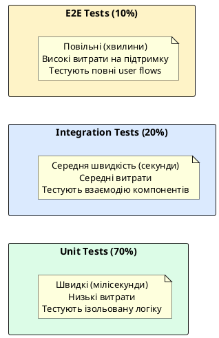
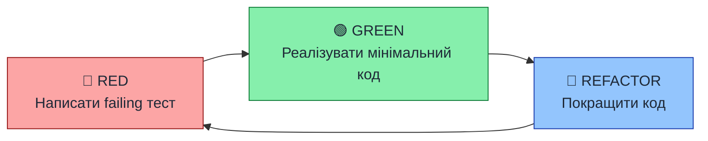

# Піраміда тестування та стратегія

::card-group

::card{title="🎯 Мета лекції" icon="i-lucide-target"}

- Зрозуміти концепцію піраміди тестування та обґрунтування співвідношення між різними типами тестів.
- Опанувати стратегію розподілу зусиль: 70% Unit тестів, 20% Integration тестів, 10% E2E тестів.
- Навчитися визначати, що саме тестувати на кожному рівні піраміди для досягнення оптимального балансу між швидкістю та впевненістю.
- Ознайомитися з методологією Test-Driven Development (TDD) та її застосуванням у backend розробці.

::

::card{title="🔑 Ключові терміни" icon="i-lucide-key"}

- **Test Pyramid (Піраміда тестування):** архітектурна модель розподілу автоматизованих тестів за рівнями деталізації та витрат.
- **Unit Test (Модульний тест):** ізольована перевірка окремого компонента (функції, методу класу) без залежностей.
- **Integration Test (Інтеграційний тест):** тестування взаємодії між кількома компонентами системи або із зовнішніми ресурсами.
- **E2E Test (End-to-End тест):** наскрізне тестування повного бізнес-сценарію від точки входу до виходу через реальний API.
- **Test-Driven Development (TDD):** методологія розробки, де тест пишеться перед реалізацією коду.

::

::

---

## Короткий зміст

У цій лекції розглядається стратегічний підхід до тестування backend застосунків:

- **Піраміда тестування** — концепція розподілу тестів: багато Unit тестів (основа піраміди), менше Integration тестів (середина), мало E2E тестів (вершина), обґрунтування співвідношення через швидкість виконання та вартість підтримки
- **Unit тести (70%)** — тестування ізольованої бізнес-логіки у сервісах, функціях, утилітах без зовнішніх залежностей, швидкі (мілісекунди), дешеві у підтримці, високе покриття edge cases
- **Integration тести (20%)** — тестування взаємодії між компонентами (сервіс + репозиторій + БД, контролер + сервіс), перевірка інтеграційних точок, середня швидкість виконання
- **E2E тести (10%)** — тестування повних user flows через HTTP API, перевірка критичних business scenarios (реєстрація, оплата), повільні але найближчі до реальності
- **Що тестувати на кожному рівні** — Unit: бізнес-логіка, edge cases, validation; Integration: database queries, external API calls; E2E: authentication flows, CRUD operations, error handling
- **Test-Driven Development (TDD)** — підхід Red-Green-Refactor: написання failing test → реалізація мінімального коду → рефакторинг, переваги для backend розробки
- **Стратегія для NestJS** — фокус на Unit тестах сервісів, Integration тести для складних queries, E2E для критичних endpoints, використання test databases для ізоляції

Вивчається обґрунтування кількості тестів на кожному рівні, баланс між швидкістю feedback loop та впевненістю у коді, практичні рекомендації для команд різного розміру.

---

## Проблема відсутності стратегії тестування

На попередніх етапах ми розробили повноцінний backend застосунок на NestJS: створили контролери для обробки HTTP-запитів, реалізували бізнес-логіку у сервісах, налаштували взаємодію з базою даних через TypeORM, впровадили автентифікацію та авторизацію, додали підтримку WebSocket для комунікації у реальному часі. Проте до цього моменту ми ще не обговорили систематичний підхід до тестування — а це критична складова професійної розробки.

Уявіть ситуацію: ви завершили розробку модуля оплати замовлень, який інтегрується із зовнішнім платіжним шлюзом, оновлює статус замовлення у базі даних, надсилає email-нотифікацію клієнту та додає запис до системи логування. Без автоматизованих тестів будь-яка зміна у цьому модулі вимагає ручної перевірки всього ланцюга операцій. Якщо розробник забуде перевірити граничний випадок (*edge case*), коли платіжний шлюз повертає помилку саме під час оновлення статусу, баг може потрапити у продакшн і призвести до фінансових втрат.

Саме для вирішення цієї проблеми у індустрії склалася концепція **піраміди тестування** (*Test Pyramid*), яку вперше сформулював Майк Кон у 2009 році. Ця модель визначає оптимальне співвідношення між різними типами автоматизованих тестів, забезпечуючи баланс між швидкістю зворотного зв'язку (*feedback loop*), впевненістю у коректності коду та витратами на підтримку тестового покриття.


::note
Піраміда тестування не є догмою із жорстким розподілом 70/20/10. Конкретні пропорції залежать від специфіки проєкту: складні математичні алгоритми вимагають більше Unit тестів, а microservices архітектура — більше Integration тестів. Проте базовий принцип залишається незмінним: **максимум швидких і дешевих тестів біля основи, мінімум повільних і дорогих на вершині**.
::

---

## Структура піраміди тестування

Піраміда тестування складається з трьох основних рівнів, розташованих за принципом зменшення кількості тестів знизу вгору. Ця структура відображає фундаментальний компроміс між **швидкістю виконання**, **деталізацією тестування** та **витратами на підтримку**.

::plant-uml{alt="Структура піраміди тестування"}



::

Розглянемо детально кожен рівень піраміди та економічне обґрунтування їх співвідношення.

### Основа піраміди: Unit тести (70%)

**Unit тест** — це автоматизована перевірка найменшого тестованого модуля коду (функції, методу класу, окремого сервісу) в ізоляції від усіх зовнішніх залежностей. Ключове слово — **ізоляція**: якщо ваш сервіс залежить від репозиторію для доступу до бази даних, то в Unit тесті цей репозиторій замінюється на **тестовий дублер** (*test double*, часто називають *mock* або *stub*), який повертає заздалегідь визначені дані без реального звернення до БД.

Чому саме Unit тести мають становити більшість вашого тестового покриття? Причин декілька:

**1. Швидкість виконання.** Типовий Unit тест виконується за **1–5 мілісекунд**, оскільки він не виконує жодних дорогих операцій вводу-виводу: немає мережевих запитів, немає читання з диска, немає реальних SQL-запитів до бази даних. Ви можете запускати сотні Unit тестів за секунду і отримувати миттєвий зворотний зв'язок після кожної зміни коду. Це критично для підтримки високої продуктивності розробки.

**2. Низькі витрати на підтримку.** Unit тести зосереджені на **контракті** (*contract*) вашого коду: вони перевіряють вхідні параметри та очікувані результати конкретної функції. Якщо внутрішня реалізація функції змінюється, але контракт залишається колишнім, Unit тести продовжують працювати без змін. Наприклад, якщо ви оптимізували алгоритм розрахунку знижки, але вхідні дані (об'єкт замовлення) та вихідний результат (підсумкова ціна) залишилися незмінними, ваші тести залишаються актуальними.

**3. Висока деталізація помилок.** Коли Unit тест падає, ви одразу бачите, яка саме функція або метод працює некоректно. Не потрібно аналізувати стек викликів або логи бази даних — помилка локалізована на рівні окремої одиниці коду.

**4. Покриття граничних випадків (*edge cases*).** Unit тести ідеально підходять для перевірки нестандартних сценаріїв: порожні масиви, null-значення, від'ємні числа, перевищення лімітів. Наприклад, при тестуванні функції валідації email-адреси ви можете легко перевірити 20+ граничних випадків (відсутність символу `@`, декілька `@`, спецсимволи, максимальна довжина) за лічені мілісекунди.

::tip
Кожен Unit тест має перевіряти **один логічний сценарій**. Якщо функція `calculateDiscount` має три різні правила для знижок (базова знижка, знижка для постійного клієнта, сезонна знижка), створіть три окремі тести з описовими назвами: `should_apply_base_discount_for_new_customer`, `should_apply_loyalty_discount_for_regular_customer`, `should_apply_seasonal_discount_during_promotion`.
::

### Середина піраміди: Integration тести (20%)

**Integration тест** перевіряє коректність взаємодії між кількома компонентами вашої системи або між вашою системою та зовнішніми ресурсами. На відміну від Unit тестів, тут ми **не використовуємо заглушки** (*mocks*) для всіх залежностей — натомість запускаємо реальні компоненти та перевіряємо їх спільну роботу.

Типові сценарії для Integration тестів у backend застосунках:

**1. Тестування збереження даних.** Ви перевіряєте, що ваш сервіс коректно взаємодіє з базою даних: чи правильно зберігаються дані, чи коректно виконуються складні JOIN-запити, чи спрацьовують database triggers та constraints. Для цього Integration тест запускає реальний екземпляр бази даних (зазвичай у Docker-контейнері) та виконує операції через ваш репозиторій або ORM.

```typescript
// Приклад Integration тесту для UserService + Database
describe('UserService Integration', () => {
  let service: UserService;
  let repository: Repository<User>;
  let testDatabase: DataSource;

  beforeAll(async () => {
    // Підключення до тестової БД (наприклад, SQLite in-memory)
    testDatabase = await createTestDatabase();
    repository = testDatabase.getRepository(User);
    service = new UserService(repository);
  });

  it('should persist user with hashed password', async () => {
    const userData = { email: 'test@example.com', password: 'Secret123' };
    
    const user = await service.registerUser(userData);
    
    // Перевіряємо, що дані реально збереглися в БД
    const savedUser = await repository.findOne({ where: { email: userData.email } });
    expect(savedUser).toBeDefined();
    expect(savedUser!.password).not.toBe('Secret123'); // Пароль має бути захешований
    expect(savedUser!.password).toMatch(/^\$2[ayb]\$.{56}$/); // bcrypt формат
  });
});
```

У цьому тесті ми перевіряємо не лише логіку хешування пароля (це може бути окремий Unit тест), а саме **інтеграцію**: чи коректно `UserService` викликає методи `repository`, чи зберігаються дані у правильному форматі, чи спрацьовують database constraints (наприклад, унікальність email).

**2. Тестування зовнішніх API.** Якщо ваш застосунок інтегрується із платіжним шлюзом, поштовим сервісом або іншими HTTP API, Integration тести можуть перевіряти коректність цієї взаємодії. Зверніть увагу: для реальних зовнішніх сервісів часто використовують **test sandbox** оточення або **mock server** (наприклад, WireMock), щоб не витрачати гроші та не залежати від доступності зовнішнього API.


**3. Тестування взаємодії між шарами архітектури.** У багатошаровій архітектурі (Controller → Service → Repository) Integration тест може перевіряти коректність передачі даних між шарами. Наприклад, чи правильно контролер десеріалізує JSON із запиту, чи передає валідовані дані до сервісу, чи обробляє винятки (*exceptions*) від репозиторію.

Чому Integration тестів менше, ніж Unit тестів? Є дві основні причини:

**Перша** — **швидкість виконання**. Типовий Integration тест виконується за **100–500 мілісекунд** або навіть кілька секунд, якщо він включає операції з базою даних або мережеві запити. Запуск 1000 Integration тестів може зайняти 10–20 хвилин, що неприйнятно для швидкого циклу розробки.

**Друга** — **складність підтримки**. Integration тести чутливі до змін у багатьох місцях: якщо змінилася структура таблиці БД, формат відповіді зовнішнього API або порядок виконання операцій, доведеться оновлювати тести. Крім того, вони вимагають налаштування тестового оточення: Docker-контейнери для БД, конфігурація мережевих портів, очищення даних між тестами.

::warning
Найпоширеніша помилка — створювати Integration тести для перевірки бізнес-логіки, яку можна покрити Unit тестами. Наприклад, якщо ви пишете Integration тест для перевірки валідації email-формату при реєстрації користувача, це марна трата ресурсів — валідаційну логіку треба тестувати на Unit рівні. Integration тести мають зосереджуватися саме на **інтеграційних точках** (*integration points*), а не дублювати Unit покриття.
::

### Вершина піраміди: End-to-End тести (10%)

**E2E тест** (*End-to-End test*) — це автоматизована перевірка повного користувацького сценарію від точки входу до виходу з системи. Для backend застосунку це означає виконання реальних HTTP-запитів до вашого API, як це робив би клієнт (браузер або мобільний застосунок), та перевірку відповідей.

Ключова відмінність E2E тестів від Integration тестів: E2E тест **не знає про внутрішню структуру** вашого додатку. Він взаємодіє лише через публічний API (REST endpoints або GraphQL), перевіряє HTTP status codes, формати JSON-відповідей та побічні ефекти (наприклад, чи з'явився новий запис у БД після виклику `POST /api/users`).

Приклад E2E тесту для сценарію реєстрації та входу:

```typescript
// E2E тест через HTTP API (використовуємо supertest)
describe('User Authentication Flow (E2E)', () => {
  let app: INestApplication;
  let authToken: string;

  beforeAll(async () => {
    // Запускаємо повний NestJS застосунок у тестовому режимі
    const moduleFixture = await Test.createTestingModule({
      imports: [AppModule],
    }).compile();

    app = moduleFixture.createNestApplication();
    await app.init();
  });

  it('should register new user and return 201', async () => {
    const response = await request(app.getHttpServer())
      .post('/api/auth/register')
      .send({ email: 'newuser@test.com', password: 'SecurePass123!' })
      .expect(201);

    expect(response.body).toHaveProperty('id');
    expect(response.body.email).toBe('newuser@test.com');
  });

  it('should authenticate user and return JWT token', async () => {
    const response = await request(app.getHttpServer())
      .post('/api/auth/login')
      .send({ email: 'newuser@test.com', password: 'SecurePass123!' })
      .expect(200);

    expect(response.body).toHaveProperty('access_token');
    authToken = response.body.access_token;
  });

  it('should access protected route with valid token', async () => {
    await request(app.getHttpServer())
      .get('/api/users/profile')
      .set('Authorization', `Bearer ${authToken}`)
      .expect(200);
  });

  it('should reject access to protected route without token', async () => {
    await request(app.getHttpServer())
      .get('/api/users/profile')
      .expect(401); // Unauthorized
  });
});
```

Цей тест покриває повний сценарій автентифікації: реєстрація → вхід → отримання токену → доступ до захищеного ресурсу → перевірка захисту від неавторизованих запитів. Усі компоненти системи працюють разом: контролери, сервіси, middleware для JWT, guards для перевірки авторизації, база даних для збереження користувача.

Чому E2E тестів найменше?

**1. Повільна швидкість виконання.** Кожен E2E тест запускає весь застосунок, виконує реальні HTTP-запити через мережевий стек операційної системи, взаємодіє з базою даних та іншими сервісами. Типовий час виконання — **2–10 секунд на один тест**. Якщо у вас 100 E2E тестів, повний прогін може тривати 15–30 хвилин.

**2. Крихкість (*flakiness*).** E2E тести схильні до випадкових збоїв через таймаути мережевих запитів, проблеми з доступом до БД, race conditions при паралельному виконанні тестів. Такі тести інколи «червоніють» навіть при відсутності реальних багів, що знижує довіру до них з боку команди.

**3. Високі витрати на підтримку.** Будь-яка зміна у публічному API (додавання нового поля у відповідь, зміна структури JSON, оновлення шляху endpoint) вимагає оновлення E2E тестів. Крім того, складніше локалізувати помилку: якщо E2E тест падає, потрібно аналізувати логи всього застосунку, перевіряти стан БД та діагностувати, який саме компонент у ланцюзі викликів працює некоректно.

::caution
E2E тести **не замінюють** Unit та Integration тести. Спокуса написати лише E2E тести («адже вони найбільш реалістичні!») призводить до надзвичайно повільного feedback loop: розробник очікує 20–30 хвилин на результат тестування після кожної зміни коду, що знищує продуктивність. Правильна стратегія — використовувати E2E лише для **критичних бізнес-сценаріїв** (реєстрація, оплата, генерація звітів), а всю іншу логіку покривати Unit та Integration тестами.
::

---

## Що тестувати на кожному рівні піраміди

Визначення правильного рівня для кожного тесту — це мистецтво, яке приходить з досвідом. Однак існують загальні рекомендації, які допоможуть розподілити зусилля оптимально.


### Unit рівень: чиста бізнес-логіка

На Unit рівні тестуйте всю логіку, яка **не залежить** від зовнішніх систем або інфраструктури. Це включає:

**1. Обчислення та алгоритми.** Функції розрахунку знижок, конвертації валют, форматування даних, обробки рядків. Приклад: метод `calculateTotalPrice(items: OrderItem[]): number`, який підсумовує вартість товарів із урахуванням знижок та податків.

**2. Валідаційна логіка.** Перевірка форматів даних (email, phone number, credit card), діапазонів значень (вік від 18 до 120), обов'язковості полів. Приклад: функція `validatePassword(password: string): ValidationResult`, яка перевіряє мінімальну довжину, наявність великих літер та спецсимволів.

**3. Трансформація даних.** Мапінг між доменними об'єктами та DTO (*Data Transfer Objects*), серіалізація/десеріалізація, фільтрація колекцій. Приклад: метод `toDTO(user: User): UserDTO`, який перетворює entity із приватним паролем на публічний DTO без чутливих полів.

**4. Бізнес-правила.** Складна логіка прийняття рішень, стейт-машини (*state machines*), правила доступу. Приклад: метод `canApproveOrder(user: User, order: Order): boolean`, який перевіряє, чи має користувач право затверджувати замовлення на основі ролі та статусу замовлення.

**5. Граничні випадки та помилки.** Перевірка поведінки при некоректних вхідних даних: порожні масиви, null-значення, від'ємні числа, перевищення лімітів. Приклад: як функція `divideNumbers(a: number, b: number)` обробляє ділення на нуль (викидає виняток чи повертає `Infinity`).

::code-group

```typescript [calculateDiscount - Unit Test]
import { calculateDiscount } from './pricing.service';

describe('calculateDiscount', () => {
  it('should apply 10% discount for orders above $100', () => {
    const result = calculateDiscount({ total: 150, isLoyalCustomer: false });
    expect(result).toBe(15); // 10% від $150
  });

  it('should apply 20% discount for loyal customers', () => {
    const result = calculateDiscount({ total: 100, isLoyalCustomer: true });
    expect(result).toBe(20); // 20% від $100
  });

  it('should return 0 discount for orders below $50', () => {
    const result = calculateDiscount({ total: 30, isLoyalCustomer: false });
    expect(result).toBe(0);
  });

  it('should handle edge case: zero total', () => {
    const result = calculateDiscount({ total: 0, isLoyalCustomer: true });
    expect(result).toBe(0);
  });
});
```

```typescript [validateEmail - Unit Test]
import { validateEmail } from './validators';

describe('validateEmail', () => {
  it('should accept valid email addresses', () => {
    expect(validateEmail('user@example.com')).toBe(true);
    expect(validateEmail('test.user+tag@domain.co.uk')).toBe(true);
  });

  it('should reject emails without @ symbol', () => {
    expect(validateEmail('invalid.email.com')).toBe(false);
  });

  it('should reject emails with multiple @ symbols', () => {
    expect(validateEmail('user@@example.com')).toBe(false);
  });

  it('should reject empty string', () => {
    expect(validateEmail('')).toBe(false);
  });

  it('should reject emails longer than 254 characters', () => {
    const longEmail = 'a'.repeat(250) + '@example.com';
    expect(validateEmail(longEmail)).toBe(false);
  });
});
```

::

::tip
При написанні Unit тестів використовуйте принцип **AAA** (*Arrange-Act-Assert*):
1. **Arrange** — підготуйте вхідні дані та налаштуйте заглушки (*mocks*).
2. **Act** — викличте тестовану функцію або метод.
3. **Assert** — перевірте очікуваний результат.

Цей підхід робить тести читабельними та зрозумілими для інших розробників.
::

### Integration рівень: взаємодія компонентів

На Integration рівні тестуйте реальну співпрацю між частинами вашої системи:

**1. Операції з базою даних.** Перевірка CRUD операцій (Create, Read, Update, Delete), складних JOIN-запитів, агрегацій, транзакцій. Приклад: чи коректно метод `repository.findUsersWithActiveOrders()` виконує LEFT JOIN між таблицями `users` та `orders` і повертає лише користувачів із замовленнями у статусі `active`.

**2. Інтеграція із зовнішніми сервісами.** Взаємодія з платіжними шлюзами, email-провайдерами, хмарними сховищами (AWS S3, Google Cloud Storage). Зазвичай тестується через sandbox-оточення або mock-сервер. Приклад: чи правильно ваш `PaymentService` відправляє запит до Stripe API та обробляє відповіді із кодами помилок (`card_declined`, `insufficient_funds`).

**3. Механізми авторизації та middleware.** Перевірка JWT-токенів, refresh token rotation, RBAC (*Role-Based Access Control*). Приклад: чи коректно `AuthGuard` блокує доступ до endpoint `/api/admin/users`, якщо токен користувача не містить ролі `admin`.

**4. Робота з чергами повідомлень.** Якщо ви використовуєте систему черг (RabbitMQ, Redis Bull), Integration тести перевіряють, чи правильно повідомлення додаються до черги, обробляються worker-процесами та видаляються після успішного виконання.

```typescript
// Приклад Integration тесту для OrderService + Database
describe('OrderService Integration', () => {
  let service: OrderService;
  let orderRepository: Repository<Order>;
  let userRepository: Repository<User>;
  let database: DataSource;

  beforeAll(async () => {
    // Підключення до in-memory SQLite БД
    database = await createTestDatabase();
    orderRepository = database.getRepository(Order);
    userRepository = database.getRepository(User);
    service = new OrderService(orderRepository);
  });

  beforeEach(async () => {
    // Очищення даних між тестами
    await orderRepository.clear();
    await userRepository.clear();
  });

  it('should create order with related user', async () => {
    // Arrange: створюємо користувача
    const user = await userRepository.save({
      email: 'customer@test.com',
      name: 'Test User',
    });

    // Act: створюємо замовлення для цього користувача
    const order = await service.createOrder({
      userId: user.id,
      items: [{ productId: 'P123', quantity: 2, price: 50 }],
    });

    // Assert: перевіряємо, що замовлення збереглося з правильними зв'язками
    const savedOrder = await orderRepository.findOne({
      where: { id: order.id },
      relations: ['user'], // Завантажуємо пов'язаного користувача
    });

    expect(savedOrder).toBeDefined();
    expect(savedOrder!.user.email).toBe('customer@test.com');
    expect(savedOrder!.totalAmount).toBe(100); // 2 × $50
  });

  it('should rollback transaction if order creation fails', async () => {
    const user = await userRepository.save({ email: 'test@test.com', name: 'User' });

    // Симулюємо помилку: негативна ціна (порушення constraint)
    await expect(
      service.createOrder({
        userId: user.id,
        items: [{ productId: 'P999', quantity: 1, price: -10 }], // Невалідні дані
      }),
    ).rejects.toThrow();

    // Перевіряємо, що транзакція відкотилася і замовлення не збереглося
    const orders = await orderRepository.find();
    expect(orders).toHaveLength(0);
  });
});
```

У цьому тесті ми не заглушаємо (*mock*) репозиторій — натомість використовуємо реальну in-memory базу даних. Це дозволяє перевірити коректність SQL-запитів, спрацювання database constraints та механізми транзакцій.


### E2E рівень: критичні бізнес-сценарії

На E2E рівні покривайте лише **найважливіші user journeys**, від яких залежить бізнес:

**1. Повний цикл реєстрації та автентифікації.** Користувач реєструється → отримує email для підтвердження → підтверджує акаунт → входить у систему → отримує JWT-токен → використовує токен для доступу до захищених ресурсів.

**2. Критичні транзакції.** Оформлення замовлення з оплатою, бронювання послуги, перекази коштів між рахунками. Це сценарії, які при збої призводять до прямих фінансових втрат або втрати клієнтів.

**3. Складні workflows.** Багатокрокові процеси, що вимагають послідовності дій: створення чернетки документа → додавання вкладень → відправка на затвердження → схвалення менеджером → публікація.

**4. Обробка помилок на рівні API.** Перевірка, що система коректно повертає HTTP status codes та зрозумілі повідомлення про помилки для різних ситуацій: `400 Bad Request` для невалідних даних, `401 Unauthorized` для відсутнього токена, `403 Forbidden` для недостатніх прав, `409 Conflict` для дублікатів, `500 Internal Server Error` для критичних збоїв.

```typescript
// E2E тест для повного циклу замовлення
describe('Order Creation Flow (E2E)', () => {
  let app: INestApplication;
  let authToken: string;
  let userId: string;

  beforeAll(async () => {
    const moduleFixture = await Test.createTestingModule({
      imports: [AppModule],
    }).compile();

    app = moduleFixture.createNestApplication();
    await app.init();

    // Підготовка: створюємо та авторизуємо користувача
    const registerResponse = await request(app.getHttpServer())
      .post('/api/auth/register')
      .send({ email: 'buyer@test.com', password: 'Pass123!' });

    userId = registerResponse.body.id;

    const loginResponse = await request(app.getHttpServer())
      .post('/api/auth/login')
      .send({ email: 'buyer@test.com', password: 'Pass123!' });

    authToken = loginResponse.body.access_token;
  });

  it('should complete full order creation flow', async () => {
    // Крок 1: Додавання товарів до кошика
    const cartResponse = await request(app.getHttpServer())
      .post('/api/cart/items')
      .set('Authorization', `Bearer ${authToken}`)
      .send({ productId: 'PROD-001', quantity: 2 })
      .expect(201);

    expect(cartResponse.body.items).toHaveLength(1);

    // Крок 2: Оформлення замовлення
    const orderResponse = await request(app.getHttpServer())
      .post('/api/orders')
      .set('Authorization', `Bearer ${authToken}`)
      .send({
        shippingAddress: {
          street: '123 Main St',
          city: 'Kyiv',
          postalCode: '01001',
        },
        paymentMethod: 'credit_card',
      })
      .expect(201);

    expect(orderResponse.body).toHaveProperty('orderId');
    expect(orderResponse.body.status).toBe('pending_payment');

    const orderId = orderResponse.body.orderId;

    // Крок 3: Обробка платежу (симулюємо успішну оплату)
    await request(app.getHttpServer())
      .post(`/api/orders/${orderId}/payment`)
      .set('Authorization', `Bearer ${authToken}`)
      .send({ paymentToken: 'tok_visa_success' }) // Тестовий токен
      .expect(200);

    // Крок 4: Перевірка, що статус замовлення оновився
    const updatedOrderResponse = await request(app.getHttpServer())
      .get(`/api/orders/${orderId}`)
      .set('Authorization', `Bearer ${authToken}`)
      .expect(200);

    expect(updatedOrderResponse.body.status).toBe('paid');
    expect(updatedOrderResponse.body.paidAt).toBeDefined();
  });

  it('should reject order creation with invalid address', async () => {
    const response = await request(app.getHttpServer())
      .post('/api/orders')
      .set('Authorization', `Bearer ${authToken}`)
      .send({
        shippingAddress: {
          street: '', // Порожня адреса
          city: 'Kyiv',
        },
        paymentMethod: 'credit_card',
      })
      .expect(400); // Bad Request

    expect(response.body.message).toContain('street');
  });
});
```

Цей E2E тест покриває повний бізнес-сценарій від додавання товару до кошика до успішної оплати, а також перевіряє валідацію вхідних даних. Звернітьте увагу: ми не тестуємо кожну можливу комбінацію помилок (це завдання для Unit тестів) — лише критичний happy path та основні сценарії помилок.

::warning
Уникайте дублювання перевірок між рівнями піраміди. Якщо валідація формату email вже покрита Unit тестом для функції `validateEmail()`, не потрібно створювати окремий E2E тест для перевірки цього ж правила через HTTP API. E2E тести мають зосереджуватися на **інтеграції всієї системи**, а не повторювати логіку нижніх рівнів.
::

---

## Методологія Test-Driven Development (TDD)

**Test-Driven Development** (*TDD*) — це методологія розробки, де автоматизований тест пишеться **перед** реалізацією коду, який він перевіряє. Процес TDD складається з трьох послідовних кроків, які циклічно повторюються:

::steps

### Крок 1: Red — написання failing тесту

Спочатку ви пишете тест для функціоналу, якого ще не існує. Тест описує очікувану поведінку системи: які вхідні дані передаються, який результат очікується. Оскільки код ще не реалізований, тест **має провалитися** (*fail*) — це підтверджує, що тест дійсно перевіряє щось нове.

Приклад: ви плануєте додати функцію для розрахунку знижки постійним клієнтам. Перед написанням коду ви створюєте тест:

```typescript
describe('calculateLoyaltyDiscount', () => {
  it('should return 15% discount for customers with 5+ orders', () => {
    const discount = calculateLoyaltyDiscount({ orderCount: 7 });
    expect(discount).toBe(0.15); // 15%
  });
});
```

Запускаєте тест — він червоний (*red*), оскільки функція `calculateLoyaltyDiscount` ще не існує.

### Крок 2: Green — реалізація мінімального коду

Тепер ви пишете **найпростішу реалізацію**, яка дозволить тесту пройти (*pass*). Не потрібно створювати ідеальний код — достатньо, щоб тест став зеленим (*green*). Навіть якщо це виглядає як «заглушка», головне — швидко отримати feedback.

```typescript
export function calculateLoyaltyDiscount(customer: { orderCount: number }): number {
  if (customer.orderCount >= 5) {
    return 0.15;
  }
  return 0;
}
```

Тест проходить. Переходимо до наступного кроку.

### Крок 3: Refactor — покращення коду

Тепер, коли тест зелений і ви впевнені, що функція працює, можна **рефакторити** (*refactor*) код: покращити читабельність, видалити дублювання, оптимізувати алгоритм. При кожній зміні запускаєте тест знову — якщо він залишається зеленим, значить рефакторинг не зламав функціональність.

Припустимо, з'являється нова вимога: клієнти із 10+ замовленнями мають отримувати 20% знижку. Додаємо новий тест:

```typescript
it('should return 20% discount for customers with 10+ orders', () => {
  const discount = calculateLoyaltyDiscount({ orderCount: 12 });
  expect(discount).toBe(0.20);
});
```

Тест червоний. Оновлюємо реалізацію:

```typescript
export function calculateLoyaltyDiscount(customer: { orderCount: number }): number {
  if (customer.orderCount >= 10) {
    return 0.20;
  }
  if (customer.orderCount >= 5) {
    return 0.15;
  }
  return 0;
}
```

Обидва тести зелені. Цикл повторюється для кожної нової функції.

::


::mermaid



::

### Переваги TDD для backend розробки

Чому TDD варто застосовувати саме для backend систем?

**1. Чіткість вимог.** Написання тесту змушує вас сформулювати очікувану поведінку **до** початку кодування. Це запобігає ситуації, коли розробник починає писати код, не розуміючи повністю, що саме має робити функція. Тест стає **специфікацією** (*specification*) коду.

**2. Захист від регресії.** Кожна нова функція автоматично отримує тестове покриття. Якщо у майбутньому хтось змінить код і випадково зламає існуючу логіку, тести миттєво це виявлять. Це особливо цінно для складних backend систем із великою кількістю взаємозалежних компонентів.

**3. Впевненість у рефакторингу.** TDD створює «страхову сітку» (*safety net*) для майбутніх змін. Ви можете безстрашно переписувати внутрішню реалізацію, знаючи, що тести підтвердять коректність оновленого коду. Без тестів рефакторинг перетворюється на небезпечну гру: кожна зміна може привнести несподіваний баг.

**4. Простіший дизайн.** Коли ви пишете тест перед кодом, ви змушені думати про **інтерфейс** (*interface*) вашої функції: які параметри вона приймає, що повертає, як обробляє помилки. Це природним чином веде до створення простіших, зрозуміліших API. Код, який важко протестувати, зазвичай є поганим кодом із надмірними залежностями або складною структурою.

**5. Документація через приклади.** Тести служать «живою документацією» (*living documentation*): будь-хто може подивитися на тест і зрозуміти, як використовувати функцію, які вхідні дані вона очікує та які результати повертає. На відміну від текстової документації, тести завжди актуальні — якщо код змінився, а тест не оновили, він провалиться.

::tip
TDD найефективніше працює для **чистої бізнес-логіки** (Unit рівень піраміди). Для Integration та E2E тестів, які вимагають налаштування складного оточення (БД, зовнішні сервіси), TDD може бути надмірно громіздким. У таких випадках дозволено спочатку створити «скелет» інтеграції, а потім написати тести для перевірки коректності.
::

### Коли НЕ варто використовувати TDD

Попри всі переваги, TDD не є універсальним рішенням. Існують ситуації, коли цей підхід малоефективний:

**1. Дослідження нових технологій.** Якщо ви вперше працюєте з новою бібліотекою або фреймворком і ще не розумієте, як саме будувати архітектуру, TDD може уповільнити процес навчання. У таких випадках краще створити кілька експериментальних прототипів (*spike solutions*), зрозуміти підхід, а потім повернутися до TDD для production-коду.

**2. Швидкі прототипи для демонстрації.** Якщо вам потрібно за кілька годин створити proof-of-concept для обговорення з командою чи клієнтом, витрачати час на написання тестів може бути недоцільно. Однак після схвалення концепції прототип має бути переписаний із застосуванням TDD.

**3. Код, що часто змінюється.** У початковій фазі проєкту вимоги можуть кардинально змінюватися щодня. Якщо ви пишете тести для коду, який буде викинутий через тиждень, це марна трата часу. TDD найкраще працює для стабільних вимог.

**4. Тестування UI/UX взаємодій.** Для frontend компонентів із складними візуальними ефектами або анімаціями TDD може бути неефективним — часто простіше спочатку створити візуальний прототип, а потім додати автоматизовані тести для логіки.

::note
Навіть якщо ви не практикуєте TDD у класичному стилі (тест → код → рефакторинг), **завжди додавайте тести** для нового функціоналу якомога швидше після його реалізації. Затримка із написанням тестів призводить до технічного боргу (*technical debt*): незабаром у проєкті накопичується великий обсяг непротестованого коду, який страшно рефакторити або змінювати.
::

---

## Стратегія тестування для NestJS застосунків

Застосунки на фреймворку NestJS мають чітку модульну структуру, що спрощує розподіл тестів за рівнями піраміди. Розглянемо рекомендовану стратегію для типового NestJS проєкту.

### Фокус на Unit тестах сервісів

Більшість бізнес-логіки у NestJS зосереджена у **сервісах** (*services*) — це класи, анотовані декоратором `@Injectable()`, які інкапсулюють операції з даними, виклики зовнішніх API, обчислення тощо. Саме сервіси мають бути основним об'єктом Unit тестування.

Типовий сервіс у NestJS має залежності, які впроваджуються через конструктор (*dependency injection*). Для Unit тестів ці залежності замінюються на **test doubles** (моки або стаби):

```typescript
// user.service.ts
@Injectable()
export class UserService {
  constructor(
    private readonly userRepository: Repository<User>,
    private readonly hashService: HashService,
  ) {}

  async registerUser(dto: RegisterUserDto): Promise<User> {
    const existingUser = await this.userRepository.findOne({ 
      where: { email: dto.email } 
    });
    
    if (existingUser) {
      throw new ConflictException('Email already registered');
    }

    const hashedPassword = await this.hashService.hash(dto.password);
    const user = this.userRepository.create({
      email: dto.email,
      password: hashedPassword,
    });

    return this.userRepository.save(user);
  }
}
```

Unit тест для цього сервісу:

```typescript
// user.service.spec.ts
import { Test, TestingModule } from '@nestjs/testing';
import { ConflictException } from '@nestjs/common';
import { UserService } from './user.service';
import { Repository } from 'typeorm';
import { User } from './user.entity';
import { HashService } from '../auth/hash.service';

describe('UserService', () => {
  let service: UserService;
  let userRepository: jest.Mocked<Repository<User>>;
  let hashService: jest.Mocked<HashService>;

  beforeEach(async () => {
    // Створюємо моки для залежностей
    const mockUserRepository = {
      findOne: jest.fn(),
      create: jest.fn(),
      save: jest.fn(),
    };

    const mockHashService = {
      hash: jest.fn(),
      compare: jest.fn(),
    };

    const module: TestingModule = await Test.createTestingModule({
      providers: [
        UserService,
        { provide: Repository, useValue: mockUserRepository },
        { provide: HashService, useValue: mockHashService },
      ],
    }).compile();

    service = module.get<UserService>(UserService);
    userRepository = module.get(Repository);
    hashService = module.get(HashService);
  });

  describe('registerUser', () => {
    it('should successfully register new user', async () => {
      const dto = { email: 'new@test.com', password: 'Pass123!' };
      
      // Arrange: налаштовуємо моки
      userRepository.findOne.mockResolvedValue(null); // Користувача не існує
      hashService.hash.mockResolvedValue('$2b$10$hashedPassword');
      userRepository.create.mockReturnValue({ 
        id: '123', 
        email: dto.email, 
        password: '$2b$10$hashedPassword' 
      } as User);
      userRepository.save.mockResolvedValue({ 
        id: '123', 
        email: dto.email, 
        password: '$2b$10$hashedPassword' 
      } as User);

      // Act
      const result = await service.registerUser(dto);

      // Assert
      expect(result.email).toBe(dto.email);
      expect(result.password).not.toBe(dto.password); // Пароль захешований
      expect(hashService.hash).toHaveBeenCalledWith(dto.password);
      expect(userRepository.save).toHaveBeenCalled();
    });

    it('should throw ConflictException if email already exists', async () => {
      const dto = { email: 'existing@test.com', password: 'Pass123!' };
      
      // Arrange: користувач вже існує
      userRepository.findOne.mockResolvedValue({ 
        id: '999', 
        email: dto.email 
      } as User);

      // Act & Assert
      await expect(service.registerUser(dto)).rejects.toThrow(ConflictException);
      expect(hashService.hash).not.toHaveBeenCalled(); // Не має досягти хешування
      expect(userRepository.save).not.toHaveBeenCalled();
    });
  });
});
```

Цей Unit тест перевіряє бізнес-логіку методу `registerUser`:
- Чи коректно обробляється ситуація, коли email вже зареєстрований (викидається `ConflictException`).
- Чи викликається хешування пароля перед збереженням.
- Чи передаються правильні дані до репозиторію.

При цьому ми **не перевіряємо реальну роботу з БД** — це завдання для Integration тестів.


### Integration тести для складних запитів до БД

Коли ваш сервіс виконує складні SQL-запити із JOIN, підзапитами, агрегаціями або покладається на database-specific features (тригери, збережені процедури, JSON-колонки), Unit тестів недостатньо. Тут потрібні Integration тести із реальною базою даних.

У NestJS зазвичай використовують **in-memory SQLite** або **Dockerized PostgreSQL/MySQL** для Integration тестів. Це дозволяє запускати тести ізольовано від production БД.

Приклад Integration тесту для складного запиту:

```typescript
// order.service.integration.spec.ts
import { Test, TestingModule } from '@nestjs/testing';
import { TypeOrmModule } from '@nestjs/typeorm';
import { DataSource } from 'typeorm';
import { OrderService } from './order.service';
import { Order } from './order.entity';
import { User } from '../user/user.entity';

describe('OrderService Integration', () => {
  let service: OrderService;
  let dataSource: DataSource;

  beforeAll(async () => {
    // Підключення до in-memory SQLite
    const module: TestingModule = await Test.createTestingModule({
      imports: [
        TypeOrmModule.forRoot({
          type: 'sqlite',
          database: ':memory:',
          entities: [Order, User],
          synchronize: true, // Автоматично створює таблиці
        }),
        TypeOrmModule.forFeature([Order, User]),
      ],
      providers: [OrderService],
    }).compile();

    service = module.get<OrderService>(OrderService);
    dataSource = module.get<DataSource>(DataSource);
  });

  beforeEach(async () => {
    // Очищення даних між тестами
    await dataSource.getRepository(Order).clear();
    await dataSource.getRepository(User).clear();
  });

  afterAll(async () => {
    await dataSource.destroy();
  });

  it('should find orders with total above threshold using aggregation', async () => {
    // Arrange: створюємо тестові дані
    const user = await dataSource.getRepository(User).save({
      email: 'buyer@test.com',
      name: 'Test Buyer',
    });

    await dataSource.getRepository(Order).save([
      { user, items: [{ price: 50, quantity: 2 }], totalAmount: 100 },
      { user, items: [{ price: 200, quantity: 1 }], totalAmount: 200 },
      { user, items: [{ price: 30, quantity: 1 }], totalAmount: 30 },
    ]);

    // Act: викликаємо метод із складним запитом
    const highValueOrders = await service.findOrdersAboveAmount(150);

    // Assert
    expect(highValueOrders).toHaveLength(1);
    expect(highValueOrders[0].totalAmount).toBe(200);
  });

  it('should correctly calculate user statistics with JOIN', async () => {
    // Arrange
    const user1 = await dataSource.getRepository(User).save({ 
      email: 'user1@test.com', 
      name: 'User One' 
    });
    const user2 = await dataSource.getRepository(User).save({ 
      email: 'user2@test.com', 
      name: 'User Two' 
    });

    await dataSource.getRepository(Order).save([
      { user: user1, totalAmount: 100 },
      { user: user1, totalAmount: 200 },
      { user: user2, totalAmount: 50 },
    ]);

    // Act: метод виконує LEFT JOIN та GROUP BY
    const stats = await service.getUserOrderStatistics();

    // Assert
    expect(stats).toHaveLength(2);
    const user1Stats = stats.find(s => s.userId === user1.id);
    expect(user1Stats.totalOrders).toBe(2);
    expect(user1Stats.totalSpent).toBe(300);
  });
});
```

Ці Integration тести перевіряють коректність SQL-запитів та агрегацій. Якщо ви змінюєте структуру таблиць або оптимізуєте запити, тести підтвердять, що результати залишилися правильними.

::note
Для швидкості виконання Integration тестів використовуйте **in-memory базу** (SQLite) замість реального PostgreSQL/MySQL, якщо ваші запити не покладаються на специфічні features цих СУБД. Це скорочує час виконання тестів із секунд до мілісекунд. Проте для тестування PostgreSQL-specific функцій (JSONB, full-text search, array operations) знадобиться реальний Postgres у Docker.
::

### E2E тести для критичних endpoints

У NestJS E2E тести розміщуються у директорії `test/` (на відміну від Unit/Integration тестів, які знаходяться поруч із тестованим кодом у `*.spec.ts` файлах). E2E тести запускають весь застосунок через `supertest` та перевіряють відповіді HTTP API.

Рекомендована стратегія:

**1. Покрийте основні CRUD операції для кожного ресурсу.** Для ресурсу `users` створіть E2E тест, що перевіряє: `POST /users` (створення), `GET /users/:id` (читання), `PATCH /users/:id` (оновлення), `DELETE /users/:id` (видалення).

**2. Протестуйте authentication/authorization flows.** Перевірте, що захищені endpoints повертають `401 Unauthorized` без токена та `403 Forbidden` для користувачів без необхідних прав.

**3. Перевірте обробку помилок.** Надішліть невалідні дані та переконайтеся, що API повертає `400 Bad Request` із зрозумілими повідомленнями про помилки. Спробуйте отримати доступ до неіснуючого ресурсу — очікується `404 Not Found`.

**4. Протестуйте складні workflows.** Наприклад, повний цикл оформлення замовлення: створення кошика → додавання товарів → застосування промокоду → оплата → перевірка статусу.

```typescript
// test/auth.e2e-spec.ts
import { Test, TestingModule } from '@nestjs/testing';
import { INestApplication, ValidationPipe } from '@nestjs/common';
import * as request from 'supertest';
import { AppModule } from '../src/app.module';

describe('Authentication (E2E)', () => {
  let app: INestApplication;

  beforeAll(async () => {
    const moduleFixture: TestingModule = await Test.createTestingModule({
      imports: [AppModule],
    }).compile();

    app = moduleFixture.createNestApplication();
    
    // Налаштовуємо ValidationPipe, як у production
    app.useGlobalPipes(new ValidationPipe({ 
      whitelist: true, 
      forbidNonWhitelisted: true 
    }));
    
    await app.init();
  });

  afterAll(async () => {
    await app.close();
  });

  describe('POST /api/auth/register', () => {
    it('should register new user with valid data', () => {
      return request(app.getHttpServer())
        .post('/api/auth/register')
        .send({
          email: 'newuser@example.com',
          password: 'SecurePass123!',
          name: 'Test User',
        })
        .expect(201)
        .expect(res => {
          expect(res.body).toHaveProperty('id');
          expect(res.body.email).toBe('newuser@example.com');
          expect(res.body).not.toHaveProperty('password'); // Пароль не має повертатися
        });
    });

    it('should reject registration with weak password', () => {
      return request(app.getHttpServer())
        .post('/api/auth/register')
        .send({
          email: 'user@example.com',
          password: '123', // Занадто короткий пароль
          name: 'User',
        })
        .expect(400)
        .expect(res => {
          expect(res.body.message).toContain('password');
        });
    });

    it('should reject registration with duplicate email', async () => {
      // Спочатку реєструємо користувача
      await request(app.getHttpServer())
        .post('/api/auth/register')
        .send({
          email: 'duplicate@example.com',
          password: 'ValidPass123!',
          name: 'First User',
        });

      // Спроба реєстрації з тим самим email
      return request(app.getHttpServer())
        .post('/api/auth/register')
        .send({
          email: 'duplicate@example.com',
          password: 'AnotherPass456!',
          name: 'Second User',
        })
        .expect(409); // Conflict
    });
  });

  describe('POST /api/auth/login', () => {
    beforeAll(async () => {
      // Підготовка: створюємо користувача для тестів входу
      await request(app.getHttpServer())
        .post('/api/auth/register')
        .send({
          email: 'logintest@example.com',
          password: 'LoginPass123!',
          name: 'Login Test User',
        });
    });

    it('should authenticate user and return JWT token', () => {
      return request(app.getHttpServer())
        .post('/api/auth/login')
        .send({
          email: 'logintest@example.com',
          password: 'LoginPass123!',
        })
        .expect(200)
        .expect(res => {
          expect(res.body).toHaveProperty('access_token');
          expect(typeof res.body.access_token).toBe('string');
        });
    });

    it('should reject login with incorrect password', () => {
      return request(app.getHttpServer())
        .post('/api/auth/login')
        .send({
          email: 'logintest@example.com',
          password: 'WrongPassword',
        })
        .expect(401); // Unauthorized
    });

    it('should reject login for non-existent user', () => {
      return request(app.getHttpServer())
        .post('/api/auth/login')
        .send({
          email: 'nonexistent@example.com',
          password: 'SomePassword123!',
        })
        .expect(401);
    });
  });
});
```

Цей E2E тест покриває критичні сценарії автентифікації та перевіряє, що система коректно обробляє як валідні, так і помилкові запити. Зверніть увагу: ми не тестуємо кожен можливий варіант валідації (наприклад, 20 різних форматів некоректного email) — для цього є Unit тести. E2E тести зосереджені на перевірці повного шляху запиту через всі шари застосунку.

::tip
Використовуйте **окрему тестову базу даних** для E2E тестів. Налаштуйте змінну оточення `NODE_ENV=test` та підключайтеся до тестової БД замість production. Після кожного тесту очищайте дані (`afterEach` hook) або використовуйте транзакції з rollback, щоб тести не впливали один на одного.
::


---

## Практичні рекомендації для команд

Впровадження піраміди тестування у реальний проєкт вимагає балансу між теоретичними ідеалами та практичними обмеженнями. Розглянемо рекомендації для команд різного розміру та зрілості.

### Для команд-початківців (1-3 розробники)

Якщо ваша команда лише починає працювати з автоматизованим тестуванням, дотримуйтеся принципу **прогресивного впровадження**:

**Етап 1: Покриття критичної логіки Unit тестами.** Почніть із тестування найважливіших бізнес-правил: розрахунків, валідації, трансформацій даних. Не намагайтеся одразу покрити весь код — це демотивує. Встановіть реалістичну ціль: наприклад, «кожна нова функція з бізнес-логікою має мати принаймні один Unit тест».

**Етап 2: Додайте E2E тести для критичних flows.** Коли Unit покриття досягне 40-50%, створіть кілька E2E тестів для найбільш важливих сценаріїв: реєстрація користувача, створення замовлення, обробка платежів. Навіть 5-10 E2E тестів значно підвищать впевненість у стабільності системи.

**Етап 3: Інтеграційні тести для складних компонентів.** Коли команда звикне до написання тестів, додайте Integration тести для компонентів, що працюють із БД або зовнішніми API. Це особливо корисно для модулів, де складність взаємодії між шарами висока.

::note
Не встановлюйте занадто амбітні цілі щодо code coverage (наприклад, «90% покриття за місяць»). Краще мати **50% покриття якісними тестами**, ніж 90% покриття безглузими тестами, які просто викликають функції без перевірки результатів. Зосередьтеся на покритті бізнес-логіки, а не на досягненні метрики заради метрики.
::

### Для середніх команд (4-10 розробників)

Середні команди зазвичай працюють над кількома модулями паралельно. Тут критично важливо дотримуватися **єдиних стандартів тестування** та автоматизувати процеси:

**1. Встановіть мінімальні вимоги до code coverage.** Налаштуйте CI/CD pipeline так, щоб pull request не міг бути зливаний (*merged*) до головної гілки, якщо покриття тестами падає нижче встановленого порогу (наприклад, 60% для Unit тестів). Це запобігає накопиченню непротестованого коду.

**2. Використовуйте pre-commit hooks для запуску тестів.** Налаштуйте Git hooks (наприклад, через `husky`), щоб Unit тести автоматично виконувалися перед кожним commit. Це дає розробнику миттєвий зворотний зв'язок: якщо тест провалився, commit не відбудеться, і розробник одразу виправить проблему.

**3. Розділіть тести у CI/CD pipeline.** У pipeline запускайте Unit тести на кожен push, Integration тести — на кожен pull request, а E2E тести — лише перед деплоєм у staging/production оточення. Це оптимізує швидкість зворотного зв'язку: розробники отримують результати Unit тестів за 1-2 хвилини, а не чекають 20 хвилин на завершення всіх E2E тестів.

**4. Створіть шаблони тестів.** Підготуйте стандартизовані шаблони для Unit, Integration та E2E тестів. Це спрощує початок роботи для нових членів команди та забезпечує консистентність структури тестів.

```typescript
// Приклад шаблону Unit тесту для сервісу
describe('ServiceName', () => {
  let service: ServiceName;
  let mockDependency: jest.Mocked<DependencyType>;

  beforeEach(() => {
    // Налаштування моків та ініціалізація сервісу
  });

  describe('methodName', () => {
    it('should handle success case', () => {
      // Arrange
      // Act
      // Assert
    });

    it('should handle error case', () => {
      // Arrange
      // Act
      // Assert
    });

    it('should handle edge case', () => {
      // Arrange
      // Act
      // Assert
    });
  });
});
```

::tip
Проводьте регулярні **code review** для тестів так само, як для production коду. Поганий тест може бути гіршим за відсутність тесту: він створює хибне відчуття безпеки, але не ловить реальні баги. Звертайте увагу на те, чи тести перевіряють значущу поведінку, чи просто викликають функції без assertions.
::

### Для великих команд (10+ розробників)

Великі команди працюють над складними системами із десятками мікросервісів та сотнями тисяч рядків коду. Тут стратегія тестування стає критичною для підтримки якості:

**1. Виділіть відповідальних за якість тестів.** Призначте одного або кількох розробників (або QA-інженерів) відповідальними за моніторинг метрик тестування: code coverage, швидкість виконання тестів, кількість flaky тестів. Вони мають регулярно аналізувати ці дані та пропонувати покращення.

**2. Інвестуйте у тестову інфраструктуру.** Для великих проєктів критично важливо мати швидкі тести. Налаштуйте паралельне виконання тестів на кількох CI runners, використовуйте Docker для швидкого розгортання тестових БД, впровадьте caching для залежностей. Якщо повний прогін тестів займає більше 10-15 хвилин, розробники почнуть їх ігнорувати.

**3. Використовуйте contract testing для мікросервісів.** У мікросервісній архітектурі важко підтримувати E2E тести, які покривають взаємодію між усіма сервісами. Натомість використовуйте **contract testing** (наприклад, Pact): кожен сервіс визначає контракт свого API, і тести перевіряють, чи інші сервіси дотримуються цього контракту. Це дозволяє тестувати інтеграцію без запуску всіх сервісів одночасно.

**4. Моніторте flaky тесты.** Тести, що періодично падають без очевидної причини (через race conditions, таймаути, залежність від зовнішніх ресурсів), підривають довіру команди до тестів. Впровадьте систему трекінгу flaky тестів: якщо тест падає у менше ніж 100% запусків, позначте його як flaky та пріоритизуйте виправлення.

::warning
У великих командах існує ризик «тестового бюрократизму»: коли команда витрачає більше часу на підтримку тестів, ніж на розробку нового функціоналу. Щоб уникнути цього, регулярно рефакторте тести: видаляйте дублювання, об'єднуйте схожі тести, оптимізуйте повільні Integration/E2E тести. Тести — це теж код, і вони вимагають такої ж уваги до якості.
::

---

## Метрики ефективності тестування

Як зрозуміти, чи ваша стратегія тестування працює? Існує кілька ключових метрик, які варто відстежувати:

### Code Coverage (Покриття коду)

**Code coverage** показує відсоток рядків коду, які виконуються під час запуску тестів. Зазвичай вимірюється у відсотках: 75% coverage означає, що 75% рядків коду було виконано принаймні один раз під час тестів.

Проте code coverage — це **не ціль сама по собі**. Висока метрика не гарантує якість тестів. Можна досягти 90% покриття, просто викликаючи всі функції без перевірки результатів:

```typescript
// Приклад «поганого» тесту з високим coverage, але нульовою цінністю
it('should call calculateDiscount', () => {
  calculateDiscount({ total: 100, isLoyalCustomer: true });
  // Немає assertions! Тест нічого не перевіряє.
});
```

Цей тест підвищує code coverage, але не ловить баги. **Правильний підхід** — використовувати coverage як індикатор непокритих ділянок коду, які потенційно потребують тестування, але не як самоціль.

::accordion

::accordion-item{label="❓ Який оптимальний відсоток code coverage?" icon="i-lucide-help-circle"}

Немає універсальної відповіді. Для backend систем рекомендується:
- **Unit тести:** 70-80% coverage для бізнес-логіки. Не обов'язково покривати геттери/сеттери, автогенерований код, прості мапери.
- **Integration тести:** окремо не вимірюється, оскільки вони дублюють покриття Unit тестів, але перевіряють інтеграційні точки.
- **E2E тести:** не фокусуйтеся на coverage — важливіше покрити критичні user journeys.

Краще мати 60% coverage із якісними тестами, ніж 95% із формальними тестами без assertions.

::

::accordion-item{label="❓ Як вимірювати code coverage у NestJS проєкті?" icon="i-lucide-help-circle"}

У NestJS зазвичай використовують Jest для тестування. Jest має вбудовану підтримку code coverage. Запустіть тести з прапором `--coverage`:

```bash
npm test -- --coverage
```

Jest згенерує звіт у терміналі та створить директорію `coverage/` із детальним HTML-звітом. Ви можете відкрити `coverage/lcov-report/index.html` у браузері та побачити, які саме рядки коду не покриті тестами.

Для автоматизації додайте у `package.json`:

```json
{
  "scripts": {
    "test:cov": "jest --coverage --coverageReporters=text-summary lcov"
  }
}
```

::

::


### Test Execution Time (Час виконання тестів)

Швидкість виконання тестів критично впливає на продуктивність команди. Якщо розробник чекає 20 хвилин на результат кожного запуску тестів, він почне їх пропускати або запускати рідше. Рекомендовані цільові показники:

- **Unit тести:** < 5 секунд для повного запуску всіх тестів у проєкті.
- **Integration тести:** < 1 хвилини.
- **E2E тести:** < 10 хвилин.

Якщо тести виконуються повільніше, розгляньте оптимізації:
- Паралельне виконання тестів (Jest підтримує через `--maxWorkers`).
- Використання in-memory БД замість реального PostgreSQL/MySQL для Integration тестів.
- Мокування повільних зовнішніх API замість реальних викликів.
- Видалення дублюючих тестів або об'єднання схожих test cases.

::tip
Додайте у CI/CD pipeline **окремі stages** для різних типів тестів:
1. **Fast feedback** (Unit тести) — запускається на кожен push, результат за 1-2 хвилини.
2. **Integration** — запускається на pull request, результат за 5-10 хвилин.
3. **E2E** — запускається перед merge у main гілку або deploy, результат за 15-20 хвилин.

Це дозволяє розробникам швидко отримувати зворотний зв'язок на ранніх етапах без очікування повного тестового циклу.
::

### Flakiness Rate (Відсоток нестабільних тестів)

**Flaky test** — це тест, який періодично падає без зміни коду. Найчастіші причини:
- Race conditions при асинхронних операціях.
- Таймаути мережевих запитів (залежність від зовнішніх сервісів).
- Відсутність очищення даних між тестами (один тест впливає на інший).
- Випадковість у тестових даних без фіксованого seed.

Flaky тести підривають довіру команди до тестів: якщо розробники бачать, що тести «червоніють» навіть без їхніх змін, вони починають ігнорувати результати.

**Рекомендації:**
- Відстежуйте flaky тести за допомогою CI/CD analytics (наприклад, GitHub Actions artifacts, Jenkins plugins).
- Якщо тест падає у менше ніж 95% запусків, позначте його як flaky та пріоритизуйте виправлення.
- Для тестів із таймаутами збільшуйте час очікування у CI оточенні (CI runners можуть бути повільнішими за локальні машини).
- Використовуйте фіксований seed для генераторів випадкових даних: `faker.seed(12345)`.

::caution
Якщо у вашому проєкті більше 5% тестів є flaky, це серйозна проблема. Команда почне ігнорувати результати тестів, що зведе нанівець всю цінність автоматизованого тестування. Регулярно виділяйте час на виправлення flaky тестів — це інвестиція у продуктивність команди.
::

---

## Поширені антипаттерни у тестуванні

Навіть досвідчені розробники інколи потрапляють у пастки, які знижують ефективність тестування. Розглянемо найпоширеніші антипаттерни та способи їх уникнення.

### Антипаттерн 1: Тестування деталей реалізації

**Проблема:** Тест перевіряє **як** працює код (внутрішню реалізацію), а не **що** він робить (зовнішню поведінку). Такі тести ламаються при кожній зміні внутрішньої структури, навіть якщо зовнішня поведінка залишається незмінною.

```typescript
// ❌ Поганий приклад: тест перевіряє внутрішню реалізацію
it('should call userRepository.findOne exactly once', async () => {
  const spy = jest.spyOn(userRepository, 'findOne');
  
  await service.getUserById('123');
  
  expect(spy).toHaveBeenCalledTimes(1); // Перевіряємо кількість викликів
});
```

Чому це погано? Якщо ви оптимізуєте код та додасте кешування (щоб `findOne` викликався лише при відсутності даних у кеші), цей тест провалиться, хоча зовнішня поведінка (`getUserById` повертає коректного користувача) не змінилася.

**Правильний підхід:** Тестуйте результат, а не процес.

```typescript
// ✅ Хороший приклад: тест перевіряє результат
it('should return user with correct id', async () => {
  userRepository.findOne.mockResolvedValue({ id: '123', email: 'test@test.com' });
  
  const user = await service.getUserById('123');
  
  expect(user).toEqual({ id: '123', email: 'test@test.com' });
});
```

### Антипаттерн 2: Залежність між тестами

**Проблема:** Один тест покладається на результат іншого тесту. Якщо тести запускаються у випадковому порядку (а вони мають так робити!), це призводить до непередбачуваних падінь.

```typescript
// ❌ Поганий приклад: другий тест залежить від першого
describe('UserService', () => {
  let createdUserId: string;

  it('should create user', async () => {
    const user = await service.createUser({ email: 'test@test.com' });
    createdUserId = user.id; // Зберігаємо id для наступного тесту
  });

  it('should update user', async () => {
    // Цей тест провалиться, якщо попередній не виконався
    await service.updateUser(createdUserId, { name: 'Updated Name' });
    // ...
  });
});
```

**Правильний підхід:** Кожен тест має бути повністю автономним.

```typescript
// ✅ Хороший приклад: тести незалежні
describe('UserService', () => {
  it('should create user', async () => {
    const user = await service.createUser({ email: 'test@test.com' });
    expect(user).toHaveProperty('id');
  });

  it('should update user', async () => {
    // Підготовка: створюємо користувача спеціально для цього тесту
    const user = await service.createUser({ email: 'update-test@test.com' });
    
    const updated = await service.updateUser(user.id, { name: 'Updated' });
    expect(updated.name).toBe('Updated');
  });
});
```

### Антипаттерн 3: Надмірне мокування

**Проблема:** Замокували настільки багато залежностей, що тест перевіряє лише взаємодію між моками, а не реальну логіку.

```typescript
// ❌ Поганий приклад: замоковано все, включаючи об'єкти даних
it('should process order', async () => {
  const mockOrder = { total: 100 };
  const mockUser = { id: '1' };
  const mockPayment = { status: 'success' };
  
  orderService.calculateTotal = jest.fn().mockReturnValue(100);
  orderService.validateUser = jest.fn().mockReturnValue(true);
  orderService.processPayment = jest.fn().mockResolvedValue(mockPayment);
  
  await orderService.processOrder(mockOrder, mockUser);
  
  expect(orderService.processPayment).toHaveBeenCalled();
});
```

Такий тест не перевіряє реальну логіку — він перевіряє лише те, що моки були викликані. Якщо у реальному коді `calculateTotal` має баг, цей тест не виявить його.

**Правильний підхід:** Мокуйте лише зовнішні залежності (БД, API), але не внутрішню логіку.

```typescript
// ✅ Хороший приклад: мокуємо лише зовнішні залежності
it('should process order with correct total', async () => {
  // Мокуємо лише репозиторій (зовнішня залежність)
  orderRepository.save.mockResolvedValue({ id: 'order-123', status: 'completed' });
  paymentGateway.charge.mockResolvedValue({ success: true });
  
  // Використовуємо реальну логіку calculateTotal
  const result = await orderService.processOrder({ 
    items: [{ price: 50, quantity: 2 }] 
  });
  
  expect(result.total).toBe(100); // Перевіряємо реальний розрахунок
  expect(paymentGateway.charge).toHaveBeenCalledWith(100);
});
```

### Антипаттерн 4: Тестування тривіального коду

**Проблема:** Написання тестів для коду, який не містить логіки: геттерів, сеттерів, простих мапінгів.

```typescript
// ❌ Марна трата часу: тестування геттера
it('should return user email', () => {
  const user = new User('test@test.com', 'password');
  expect(user.getEmail()).toBe('test@test.com');
});
```

Такі тести не додають цінності: якщо геттер зламається, це одразу виявиться у реальних тестах, які використовують цей метод.

**Правильний підхід:** Фокусуйтеся на тестуванні бізнес-логіки, а не тривіального коду.

::note
Якщо ви сумніваєтеся, чи варто писати тест для конкретного шматка коду, запитайте себе: «Чи може тут бути баг, який не буде виявлений іншими тестами?» Якщо відповідь «ні», тест, ймовірно, непотрібний.
::

---

## Висновки та рекомендації

Піраміда тестування — це не догматичне правило, а стратегічний підхід до забезпечення якості backend застосунків. Ключові принципи, які варто запам'ятати:

::card-group

::card{title="✅ Пріоритет швидким тестам" icon="i-lucide-zap"}

Більшість вашого тестового покриття має складатися з швидких Unit тестів, які виконуються за мілісекунди та дають миттєвий зворотний зв'язок. Це дозволяє розробникам запускати тести після кожної зміни коду без втрати продуктивності.

::

::card{title="🎯 Тестуйте поведінку, не реалізацію" icon="i-lucide-target"}

Зосередьтеся на перевірці **що** робить код (зовнішня поведінка), а не **як** він це робить (внутрішня реалізація). Тести мають бути стійкими до рефакторингу: якщо ви змінюєте внутрішню структуру, але зберігаєте контракт, тести не мають падати.

::

::card{title="🔬 Кожен рівень має свою мету" icon="i-lucide-layers"}

- **Unit тести:** покриття бізнес-логіки, валідації, граничних випадків.
- **Integration тести:** перевірка взаємодії між компонентами, складних SQL-запитів, інтеграції з зовнішніми API.
- **E2E тести:** критичні user journeys, найважливіші бізнес-сценарії.

Не дублюйте перевірки між рівнями.

::

::card{title="⚡ Оптимізуйте час виконання" icon="i-lucide-timer"}

Повільні тести знищують продуктивність команди. Використовуйте in-memory БД для Integration тестів, мокуйте повільні зовнішні сервіси, запускайте тести паралельно. Цільовий час: Unit тести < 5 сек, Integration < 1 хв, E2E < 10 хв.

::

::

Впровадження піраміди тестування — це інвестиція, яка окупається надзвичайно швидко: менше багів у продакшні, швидша розробка нових функцій, впевненість у рефакторингу коду, зниження стресу команди під час релізів. Почніть із малого — покрийте Unit тестами найкритичнішу бізнес-логіку, додайте кілька E2E тестів для важливих сценаріїв, а потім поступово розширюйте покриття.

::accordion

::accordion-item{label="❓ Скільки часу витрачати на написання тестів?" icon="i-lucide-help-circle"}

Загальне правило: на написання тестів має йти **приблизно стільки ж часу**, скільки на написання production коду, а інколи і більше для складної логіки. Якщо функція займає 2 години на реалізацію, закладіть 1.5-2 години на написання тестів. Це може здаватися великими витратами, але тести окупаються за рахунок:
- Меншої кількості багів у продакшні (економія на hotfix та підтримці).
- Швидшого виявлення регресій при змінах коду.
- Можливості безстрашного рефакторингу.

У довгостроковій перспективі команди з хорошим тестовим покриттям розробляють функції **швидше**, ніж команди без тестів.

::

::accordion-item{label="❓ Що робити із legacy кодом без тестів?" icon="i-lucide-help-circle"}

Не намагайтеся покрити тестами весь legacy код одразу — це нереалістично. Натомість використовуйте стратегію **прогресивного покриття**:

1. **Перед кожною зміною legacy коду** спочатку напишіть тест для поточної поведінки (навіть якщо вона містить баги). Це створить «страхову сітку».
2. **Потім виправляйте баг** або додавайте нову функцію і оновлюйте тести.
3. **Пріоритизуйте покриття критичних модулів:** модулі платежів, автентифікації, обробки даних мають бути покриті у першу чергу.

Через кілька місяців такого підходу ваш legacy код природним чином отримає тестове покриття.

::

::accordion-item{label="❓ Чи потрібно тестувати приватні методи класів?" icon="i-lucide-help-circle"}

Зазвичай **ні**. Приватні методи — це деталь реалізації, яка може змінитися при рефакторингу. Натомість тестуйте публічні методи, які викликають приватні. Якщо публічний метод працює коректно, значить і приватні методи працюють правильно.

Виняток: якщо приватний метод містить складну логіку, яку важко покрити через публічний API, розгляньте можливість зробити його публічним (або перенести у окрему утиліту) та протестувати окремо. Якщо метод настільки складний, що його важко тестувати, це може бути сигналом до рефакторингу архітектури.

::

::
