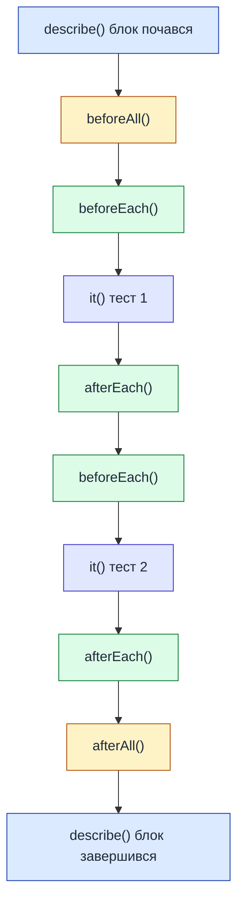

# Основи Jest у NestJS

::card-group

::card{title="🎯 Мета лекції" icon="i-lucide-target"}

- Опанувати фреймворк Jest для написання автоматизованих тестів у TypeScript проєктах.
- Зрозуміти структуру тестових файлів та організацію test suites через `describe()` та `it()`.
- Навчитися використовувати основні matchers для перевірки результатів: `toBe()`, `toEqual()`, `toThrow()`.
- Освоїти створення ізольованого DI контейнера через `Test.createTestingModule()` для тестування NestJS компонентів.
- Опанувати lifecycle hooks (`beforeEach`, `afterEach`) для підготовки та очищення тестового середовища.

::

::card{title="🔑 Ключові терміни" icon="i-lucide-key"}

- **Jest:** JavaScript testing framework від Facebook із вбудованою підтримкою TypeScript та assertions.
- **Test Suite:** логічна група пов'язаних тестів, оформлена через `describe()` блок.
- **Matcher:** функція для перевірки очікуваного результату (наприклад, `expect(value).toBe(5)`).
- **Test.createTestingModule():** NestJS утиліта для створення ізольованого модуля з Dependency Injection для тестів.
- **Lifecycle Hooks:** функції (`beforeEach`, `afterEach`, `beforeAll`, `afterAll`) для підготовки та очищення стану між тестами.

::

::

---

## Короткий зміст

У цій лекції вивчаються базові концепції тестування через Jest framework у NestJS:

- **Конфігурація Jest** — файл `jest.config.js` або `package.json`, налаштування testEnvironment (node), roots (src), moduleFileExtensions, coverageDirectory, preset для TypeScript через ts-jest
- **Структура тестів** — `describe()` для групування тестів (test suite), `it()` або `test()` для окремого тест-кейсу, вкладені describe блоки для ієрархічної організації
- **Matchers** — assertion методи: `toBe()` для примітивів, `toEqual()` для об'єктів/масивів, `toThrow()` для помилок, `toBeTruthy()`/`toBeFalsy()`, `toHaveLength()`, `toContain()`, `toMatchObject()`
- **Test.createTestingModule()** — створення ізольованого DI контейнера для тестів, імпорт модулів, providers, controllers, compile для побудови module, get() для отримання instances
- **Setup та teardown** — `beforeEach()` для підготовки перед кожним тестом, `afterEach()` для cleanup, `beforeAll()` для одноразової ініціалізації suite, `afterAll()` для фінального cleanup
- **Async testing** — підтримка async/await у тестах, повернення Promise з тесту, `resolves`/`rejects` matchers для асинхронних assertion
- **Test isolation** — кожен тест має бути незалежним, не покладатися на порядок виконання, cleanup стану між тестами

Розглядаються практичні приклади: написання першого тесту для NestJS сервісу, організація test files (*.spec.ts), running tests через `npm test`, watch mode для TDD.

---

## Чому саме Jest для NestJS

На попередній лекції ми розглянули стратегію піраміди тестування та обґрунтували необхідність автоматизованих тестів для backend застосунків. Проте залишається питання: **який саме фреймворк використовувати** для написання тестів?

У екосистемі TypeScript існує кілька популярних рішень для тестування: Mocha + Chai, Jasmine, AVA, Vitest. Проте NestJS за замовчуванням інтегрований саме з **Jest** — тестовим фреймворком від Facebook, який став стандартом де-факто для JavaScript та TypeScript проєктів. Чому саме Jest?

**1. Zero configuration.** Jest працює «з коробки» без складних налаштувань. Коли ви створюєте новий NestJS проєкт через `nest new`, конфігурація Jest вже присутня у `package.json`, і ви можете одразу писати тести. На відміну від Mocha, де потрібно окремо встановлювати assertion бібліотеку (Chai), test runner та налаштовувати транспіляцію TypeScript, Jest надає все необхідне в єдиному пакеті.

**2. Вбудована підтримка TypeScript.** Jest використовує `ts-jest` preset для автоматичної транспіляції TypeScript коду під час виконання тестів. Це означає, що ваші тести пишуться на TypeScript із повною підтримкою типізації, автокомпліту та рефакторингу через IDE.

**3. Потужна система моків.** Jest має найбільш розвинену систему для створення test doubles: автоматичні моки для модулів (`jest.mock()`), spy функції для відстеження викликів (`jest.spyOn()`), можливість замокувати частину модуля, зберігши решту функціоналу. Це критично важливо для Unit тестування, де потрібно ізолювати тестований компонент від зовнішніх залежностей.

**4. Snapshot testing.** Jest підтримує snapshot тестування — коли ви зберігаєте «знімок» (*snapshot*) результату першого запуску тесту, а при наступних запусках Jest автоматично порівнює поточний результат із збереженим. Це особливо корисно для тестування серіалізації даних або відповідей API: будь-яка неочікувана зміна у структурі одразу виявляється.

**5. Швидкість виконання.** Jest паралельно виконує тести у ізольованих процесах (*worker processes*), що значно пришвидшує запуск великих test suites. Крім того, Jest інтелектуально кешує результати транспіляції, що робить повторні запуски майже миттєвими.

**6. Watch mode для TDD.** Jest має інтерактивний watch mode, який автоматично перезапускає тести при зміні коду. У цьому режимі ви можете вибрати, які саме тести запускати: лише ті, що пов'язані зі зміненими файлами, лише failed тести для швидкого debugging, або всі тести для повної перевірки.

::note
Альтернативою Jest у 2024-2026 роках став **Vitest** — сучасний тестовий фреймворк, оптимізований для Vite-based проєктів. Vitest має сумісний із Jest API, але працює значно швидше завдяки нативній підтримці ESM та використанню esbuild для транспіляції. Проте для NestJS проєктів Jest залишається основним вибором через глибоку інтеграцію із фреймворком та наявність готових утиліт (`@nestjs/testing`).
::

---

## Конфігурація Jest у NestJS проєкті

Коли ви створюєте новий NestJS застосунок через CLI команду `nest new my-project`, Jest автоматично налаштовується через секцію у файлі `package.json`. Розглянемо типову конфігурацію та пояснимо призначення кожного параметра.


### Базова конфігурація у package.json

```json
{
  "name": "my-nestjs-app",
  "version": "1.0.0",
  "scripts": {
    "test": "jest",
    "test:watch": "jest --watch",
    "test:cov": "jest --coverage",
    "test:debug": "node --inspect-brk -r tsconfig-paths/register -r ts-node/register node_modules/.bin/jest --runInBand"
  },
  "jest": {
    "moduleFileExtensions": ["js", "json", "ts"],
    "rootDir": "src",
    "testRegex": ".*\\.spec\\.ts$",
    "transform": {
      "^.+\\.(t|j)s$": "ts-jest"
    },
    "collectCoverageFrom": [
      "**/*.(t|j)s"
    ],
    "coverageDirectory": "../coverage",
    "testEnvironment": "node"
  }
}
```

Розглянемо кожен параметр детально:

**`moduleFileExtensions`** — масив розширень файлів, які Jest має обробляти. Для TypeScript проєкту це `ts` (TypeScript вихідний код), `js` (скомпільований JavaScript або CommonJS модулі) та `json` (конфігураційні файли або моки даних).

**`rootDir`** — кореневий каталог, де Jest шукає тестові файли. У NestJS проєктах це зазвичай `src/`, оскільки саме там розміщується весь application code. Це означає, що шляхи у тестах будуть відносними до `src/`.

**`testRegex`** — регулярний вираз для пошуку тестових файлів. Паттерн `.*\\.spec\\.ts$` означає: будь-який файл, що закінчується на `.spec.ts`. Це стандартна конвенція NestJS: Unit тести розміщуються поруч із тестованим кодом та мають суфікс `.spec.ts`. Наприклад, для файлу `user.service.ts` тест буде називатися `user.service.spec.ts`.

**`transform`** — налаштування транспіляції коду перед виконанням тестів. Патерн `^.+\\.(t|j)s$` означає «всі файли з розширенням `.ts` або `.js`», а значення `ts-jest` вказує використовувати пакет `ts-jest` для перетворення TypeScript у JavaScript. Це дозволяє писати тести на TypeScript без попередньої компіляції.

**`collectCoverageFrom`** — визначає, для яких файлів збирати метрики code coverage. Паттерн `**/*.(t|j)s` означає «всі TypeScript та JavaScript файли у всіх підкаталогах». При запуску `npm run test:cov` Jest проаналізує, які рядки коду були виконані під час тестів, та згенерує звіт.

**`coverageDirectory`** — каталог для збереження звітів про code coverage. Значення `../coverage` означає, що звіти зберігаються на рівень вище від `rootDir` (тобто у корені проєкту). Ця директорія зазвичай додається до `.gitignore`, оскільки містить автоматично згенеровані файли.

**`testEnvironment`** — середовище виконання тестів. Значення `node` означає, що тести виконуються у Node.js runtime, а не у браузерному середовищі. Це правильний вибір для backend застосунків: немає DOM API, немає `window` об'єкта, натомість доступні Node.js модулі (`fs`, `http`, `crypto`).

::tip
Для складніших конфігурацій рекомендується створити окремий файл `jest.config.js` або `jest.config.ts` у корені проєкту. Це дозволяє використовувати JavaScript логіку для умовних налаштувань та покращує читабельність:

```typescript
// jest.config.ts
import type { Config } from 'jest';

const config: Config = {
  moduleFileExtensions: ['js', 'json', 'ts'],
  rootDir: 'src',
  testRegex: '.*\\.spec\\.ts$',
  transform: {
    '^.+\\.(t|j)s$': 'ts-jest',
  },
  collectCoverageFrom: ['**/*.(t|j)s'],
  coverageDirectory: '../coverage',
  testEnvironment: 'node',
  // Додаткові налаштування
  moduleNameMapper: {
    '^@/(.*)$': '<rootDir>/$1', // Підтримка path aliases
  },
  testTimeout: 10000, // Збільшений таймаут для Integration тестів
};

export default config;
```

::

### Структура тестового файлу

Тестові файли у NestJS розміщуються **поруч із тестованим кодом**, а не у окремій директорії `test/`. Це спрощує навігацію: коли ви працюєте над `user.service.ts`, тест для нього знаходиться у тому ж каталозі як `user.service.spec.ts`.

Типова структура NestJS модуля з тестами:

```
src/
├── user/
│   ├── user.controller.ts
│   ├── user.controller.spec.ts      ← Unit тест контролера
│   ├── user.service.ts
│   ├── user.service.spec.ts         ← Unit тест сервісу
│   ├── user.entity.ts
│   ├── user.module.ts
│   └── dto/
│       ├── create-user.dto.ts
│       └── create-user.dto.spec.ts  ← Тести для DTO валідації
└── app.module.ts
```

E2E тести, навпаки, розміщуються у окремій директорії `test/` у корені проєкту:

```
test/
├── app.e2e-spec.ts
├── auth.e2e-spec.ts
└── users.e2e-spec.ts
```

Це логічне розділення: Unit/Integration тести тісно пов'язані з конкретними модулями, тоді як E2E тести перевіряють взаємодію між модулями через HTTP API.

::note
Конвенція іменування `*.spec.ts` для Unit/Integration тестів та `*.e2e-spec.ts` для E2E тестів дозволяє легко розрізняти типи тестів та налаштовувати різні конфігурації Jest для їх запуску. Наприклад, ви можете створити окремий `jest-e2e.json` config, що використовує реальну БД для E2E тестів, тоді як основний `jest.config.js` використовує in-memory моки для Unit тестів.
::

---

## Перший тест: структура та синтаксис

Напишемо найпростіший можливий тест, щоб зрозуміти базову структуру. Припустимо, у нас є функція для валідації email-адрес:

```typescript
// validators/email.validator.ts
export function isValidEmail(email: string): boolean {
  const emailRegex = /^[^\s@]+@[^\s@]+\.[^\s@]+$/;
  return emailRegex.test(email);
}
```

Тепер створимо тест для цієї функції:

```typescript
// validators/email.validator.spec.ts
import { isValidEmail } from './email.validator';

describe('isValidEmail', () => {
  it('should return true for valid email addresses', () => {
    expect(isValidEmail('user@example.com')).toBe(true);
    expect(isValidEmail('test.user+tag@domain.co.uk')).toBe(true);
  });

  it('should return false for emails without @ symbol', () => {
    expect(isValidEmail('invalid.email.com')).toBe(false);
  });

  it('should return false for emails without domain', () => {
    expect(isValidEmail('user@')).toBe(false);
  });

  it('should return false for empty string', () => {
    expect(isValidEmail('')).toBe(false);
  });
});
```

Розберемо структуру тесту по елементам:

### describe() — групування тестів

**`describe(name, fn)`** створює **test suite** — логічну групу пов'язаних тестів. Перший аргумент — це рядок із описом групи (зазвичай назва тестованої функції або класу), другий — callback функція, всередині якої розміщуються індивідуальні тести.

У нашому прикладі `describe('isValidEmail', ...)` створює групу для всіх тестів функції `isValidEmail`. Це дозволяє організувати тести ієрархічно: уявіть, що у вас є клас `UserService` з десятками методів — кожен метод може мати свій вкладений `describe()` блок:

```typescript
describe('UserService', () => {
  describe('registerUser', () => {
    it('should hash password before saving', () => { /* ... */ });
    it('should throw error if email exists', () => { /* ... */ });
  });

  describe('updateProfile', () => {
    it('should update user name', () => { /* ... */ });
    it('should not update email if already taken', () => { /* ... */ });
  });
});
```

Така ієрархія покращує читабельність звітів при запуску тестів: ви бачите структуру `UserService → registerUser → should hash password`, що одразу вказує на локацію можливого бага.


### it() або test() — індивідуальний тест

**`it(name, fn)`** або **`test(name, fn)`** визначає один конкретний тест-кейс. Обидві функції ідентичні — `it` є аліасом для `test`. У NestJS спільноті прийнято використовувати `it`, оскільки це створює природно читабельні речення: *«it should return true for valid email»* («воно має повертати true для валідного email»).

Перший аргумент — це опис очікуваної поведінки у форматі **should + дія**. Хороші описи тестів читаються як специфікація поведінки:
- ✅ `should return user when id exists`
- ✅ `should throw NotFoundException when user not found`
- ✅ `should hash password before saving to database`
- ❌ `test user creation` (занадто загально)
- ❌ `getUserById works` (не описує конкретну поведінку)

Другий аргумент — функція, що містить логіку тесту. Всередині цієї функції ми викликаємо тестовану функцію та перевіряємо результат через `expect()`.

### expect() та matchers — перевірка результатів

**`expect(value)`** створює **assertion** — твердження про те, яким має бути результат. Після `expect()` викликаються **matchers** — методи, що виконують конкретну перевірку.

**Основні matchers для примітивних типів:**

```typescript
// Strict equality (використовує ===)
expect(2 + 2).toBe(4);
expect('hello').toBe('hello');
expect(true).toBe(true);

// Truthy/Falsy перевірки
expect('non-empty string').toBeTruthy();
expect(0).toBeFalsy();
expect(null).toBeFalsy();
expect(undefined).toBeUndefined();
expect(value).toBeDefined();
expect(null).toBeNull();

// Числові порівняння
expect(10).toBeGreaterThan(5);
expect(10).toBeGreaterThanOrEqual(10);
expect(5).toBeLessThan(10);
expect(0.1 + 0.2).toBeCloseTo(0.3); // Для floating point
```

**Matchers для об'єктів та масивів:**

```typescript
// Deep equality (рекурсивно порівнює структуру)
expect({ name: 'John', age: 30 }).toEqual({ name: 'John', age: 30 });

// Часткове співпадіння (об'єкт містить вказані властивості)
expect({ name: 'John', age: 30, city: 'Kyiv' }).toMatchObject({ 
  name: 'John', 
  age: 30 
});

// Масиви
expect([1, 2, 3]).toHaveLength(3);
expect(['apple', 'banana', 'orange']).toContain('banana');
expect([1, 2, 3]).toEqual(expect.arrayContaining([2, 1])); // Порядок не важливий
```

**Matchers для винятків:**

```typescript
// Перевірка, що функція викидає помилку
expect(() => {
  throw new Error('Something went wrong');
}).toThrow();

expect(() => {
  throw new Error('User not found');
}).toThrow('User not found');

expect(() => {
  throw new NotFoundException('User not found');
}).toThrow(NotFoundException);
```

::warning
Не плутайте `toBe()` та `toEqual()`:
- **`toBe()`** використовує **strict equality** (`===`) і працює лише для примітивів (числа, рядки, boolean). Для об'єктів він порівнює **посилання в пам'яті**, а не вміст.
- **`toEqual()`** виконує **deep equality** — рекурсивно порівнює структуру об'єктів та масивів.

```typescript
// ❌ НЕПРАВИЛЬНО: toBe() для об'єктів
expect({ name: 'John' }).toBe({ name: 'John' }); // FAIL! Різні посилання

// ✅ ПРАВИЛЬНО: toEqual() для об'єктів
expect({ name: 'John' }).toEqual({ name: 'John' }); // PASS
```
::

### Запуск тестів

Після написання тесту запустіть його через npm script:

```bash
# Запуск всіх тестів один раз
npm test

# Watch mode: автоматичний перезапуск при змінах
npm run test:watch

# Запуск з code coverage звітом
npm run test:cov

# Запуск тестів для конкретного файлу
npm test user.service.spec.ts
```

Результат виконання у терміналі:

::terminal-preview{title="npm test" :cursor="false"}

<div class="line"><span class="opacity-40">$</span> <strong class="font-bold">npm test</strong></div>
<div class="line"></div>
<div class="line"><span class="text-blue-400">PASS</span>  src/validators/email.validator.spec.ts</div>
<div class="line">  isValidEmail</div>
<div class="line">    <span class="text-green-400">✓</span> should return true for valid email addresses (3 ms)</div>
<div class="line">    <span class="text-green-400">✓</span> should return false for emails without @ symbol (1 ms)</div>
<div class="line">    <span class="text-green-400">✓</span> should return false for emails without domain (1 ms)</div>
<div class="line">    <span class="text-green-400">✓</span> should return false for empty string (1 ms)</div>
<div class="line"></div>
<div class="line"><span class="text-green-400 font-bold">Test Suites: 1 passed</span>, 1 total</div>
<div class="line"><span class="text-green-400 font-bold">Tests:       4 passed</span>, 4 total</div>
<div class="line">Time:        2.156 s</div>

::

Зелені галочки (✓) вказують на успішно пройдені тести. Якщо тест падає, Jest покаже детальну інформацію про те, що саме пішло не так:

::terminal-preview{title="npm test — Failed Test" :cursor="false"}

<div class="line"><span class="opacity-40">$</span> <strong class="font-bold">npm test</strong></div>
<div class="line"></div>
<div class="line"><span class="text-rose-400">FAIL</span>  src/validators/email.validator.spec.ts</div>
<div class="line">  isValidEmail</div>
<div class="line">    <span class="text-green-400">✓</span> should return true for valid email addresses</div>
<div class="line">    <span class="text-rose-400">✕</span> should return false for emails without @ symbol (5 ms)</div>
<div class="line"></div>
<div class="line">  <span class="text-rose-400 font-bold">● isValidEmail › should return false for emails without @ symbol</span></div>
<div class="line"></div>
<div class="line">    expect(received).toBe(expected) // Object.is equality</div>
<div class="line"></div>
<div class="line">    Expected: <span class="text-green-400">false</span></div>
<div class="line">    Received: <span class="text-rose-400">true</span></div>
<div class="line"></div>
<div class="line">      5 |   it('should return false for emails without @ symbol', () => {</div>
<div class="line">      6 |     expect(isValidEmail('invalid.email.com')).toBe(false);</div>
<div class="line">    <span class="text-rose-400 font-bold">></span> 7 |   });</div>
<div class="line">        <span class="text-rose-400 font-bold">        ^</span></div>

::

Jest точно вказує, де саме виникла помилка: файл, номер рядка, очікуване значення (Expected) та отримане значення (Received). Це дозволяє швидко локалізувати проблему.

---

## Тестування NestJS сервісів через Test.createTestingModule()

Попередній приклад показав тестування простої функції без залежностей. Проте реальні NestJS компоненти (сервіси, контролери) покладаються на **Dependency Injection** — вони отримують залежності через конструктор. Як протестувати такий код?

NestJS надає утиліту **`Test.createTestingModule()`**, яка створює ізольований DI контейнер спеціально для тестів. Це дозволяє замінити реальні залежності на моки без зміни тестованого коду.

### Приклад: тестування UserService

Припустимо, у нас є сервіс для роботи з користувачами:

```typescript
// user/user.service.ts
import { Injectable, NotFoundException } from '@nestjs/common';
import { InjectRepository } from '@nestjs/typeorm';
import { Repository } from 'typeorm';
import { User } from './user.entity';

@Injectable()
export class UserService {
  constructor(
    @InjectRepository(User)
    private readonly userRepository: Repository<User>,
  ) {}

  async findById(id: string): Promise<User> {
    const user = await this.userRepository.findOne({ where: { id } });
    
    if (!user) {
      throw new NotFoundException(`User with ID ${id} not found`);
    }
    
    return user;
  }

  async createUser(email: string, name: string): Promise<User> {
    const user = this.userRepository.create({ email, name });
    return this.userRepository.save(user);
  }
}
```

Цей сервіс залежить від `Repository<User>` для доступу до бази даних. У Unit тесті ми **не хочемо** запускати реальну БД — натомість замінимо репозиторій на mock.


### Створення тестового модуля

```typescript
// user/user.service.spec.ts
import { Test, TestingModule } from '@nestjs/testing';
import { getRepositoryToken } from '@nestjs/typeorm';
import { NotFoundException } from '@nestjs/common';
import { UserService } from './user.service';
import { User } from './user.entity';
import { Repository } from 'typeorm';

describe('UserService', () => {
  let service: UserService;
  let repository: jest.Mocked<Repository<User>>;

  beforeEach(async () => {
    // Створюємо mock репозиторію
    const mockRepository = {
      findOne: jest.fn(),
      create: jest.fn(),
      save: jest.fn(),
    };

    // Створюємо тестовий модуль
    const module: TestingModule = await Test.createTestingModule({
      providers: [
        UserService,
        {
          provide: getRepositoryToken(User),
          useValue: mockRepository,
        },
      ],
    }).compile();

    // Отримуємо екземпляри з DI контейнера
    service = module.get<UserService>(UserService);
    repository = module.get(getRepositoryToken(User));
  });

  describe('findById', () => {
    it('should return user when found', async () => {
      // Arrange: налаштовуємо mock
      const mockUser = { id: '123', email: 'test@example.com', name: 'Test User' };
      repository.findOne.mockResolvedValue(mockUser as User);

      // Act: викликаємо тестований метод
      const result = await service.findById('123');

      // Assert: перевіряємо результат
      expect(result).toEqual(mockUser);
      expect(repository.findOne).toHaveBeenCalledWith({ where: { id: '123' } });
    });

    it('should throw NotFoundException when user not found', async () => {
      // Arrange: репозиторій повертає null
      repository.findOne.mockResolvedValue(null);

      // Act & Assert: перевіряємо, що викидається виняток
      await expect(service.findById('999')).rejects.toThrow(NotFoundException);
      await expect(service.findById('999')).rejects.toThrow('User with ID 999 not found');
    });
  });

  describe('createUser', () => {
    it('should create and save new user', async () => {
      // Arrange
      const email = 'new@example.com';
      const name = 'New User';
      const createdUser = { id: '456', email, name };
      
      repository.create.mockReturnValue(createdUser as User);
      repository.save.mockResolvedValue(createdUser as User);

      // Act
      const result = await service.createUser(email, name);

      // Assert
      expect(repository.create).toHaveBeenCalledWith({ email, name });
      expect(repository.save).toHaveBeenCalledWith(createdUser);
      expect(result).toEqual(createdUser);
    });
  });
});
```

Розберемо ключові елементи цього тесту:

### Test.createTestingModule()

**`Test.createTestingModule(metadata)`** створює ізольований NestJS модуль для тестів. Він приймає той самий метадата об'єкт, що й звичайний `@Module()` декоратор: `providers`, `imports`, `controllers`, `exports`.

У нашому прикладі ми реєструємо:
1. **`UserService`** — тестований сервіс.
2. **Mock для Repository** — замість реального TypeORM репозиторію використовуємо об'єкт із заглушками.

Звернітьsite увагу на синтаксис заміни залежності:

```typescript
{
  provide: getRepositoryToken(User),
  useValue: mockRepository,
}
```

**`getRepositoryToken(User)`** — це утиліта від `@nestjs/typeorm`, яка повертає унікальний токен для репозиторію entity `User`. NestJS використовує цей токен для реєстрації та отримання залежностей у DI контейнері. Ми кажемо: *«коли хтось запитує `Repository<User>`, надай йому `mockRepository` замість реального»*.

### compile() — побудова модуля

Після визначення metadata викликаємо **`.compile()`**, що компілює модуль та створює DI контейнер. Це асинхронна операція, тому використовуємо `await`:

```typescript
const module: TestingModule = await Test.createTestingModule({
  // ...
}).compile();
```

Результат — об'єкт типу `TestingModule`, який надає методи для отримання екземплярів з DI контейнера.

### module.get() — отримання instances

**`module.get<T>(token)`** витягує екземпляр із DI контейнера за токеном (класом або рядком). У нашому тесті ми отримуємо два об'єкти:

```typescript
service = module.get<UserService>(UserService);
repository = module.get(getRepositoryToken(User));
```

Перший рядок повертає екземпляр `UserService`, другий — наш mock репозиторію. Зверніть увагу: `service` автоматично отримав `repository` через конструктор завдяки DI — ми не викликали `new UserService(repository)` вручну.

::tip
Типізація `jest.Mocked<T>` додає до об'єкта інформацію про те, що всі його методи є Jest mock функціями. Це дає автокомпліт у IDE для методів на кшталт `.mockResolvedValue()`, `.mockReturnValue()`, `.toHaveBeenCalledWith()`:

```typescript
let repository: jest.Mocked<Repository<User>>;

// Тепер TypeScript знає, що repository.findOne є mock функцією
repository.findOne.mockResolvedValue(user); // ✅ Автокомпліт працює
```

Якщо не використовувати `jest.Mocked<T>`, TypeScript вважатиме `repository.findOne` звичайною функцією, і ви не отримаєте автокомпліт для mock методів.
::

### Налаштування mock поведінки

Jest надає різні методи для налаштування того, що повертає mock функція:

**`mockReturnValue(value)`** — для синхронних функцій:

```typescript
repository.create.mockReturnValue({ id: '1', email: 'test@test.com' } as User);
```

**`mockResolvedValue(value)`** — для асинхронних функцій (повертають Promise):

```typescript
repository.findOne.mockResolvedValue({ id: '1', email: 'test@test.com' } as User);
// Еквівалентно: mockReturnValue(Promise.resolve(value))
```

**`mockRejectedValue(error)`** — для симуляції помилок у асинхронних функціях:

```typescript
repository.save.mockRejectedValue(new Error('Database connection failed'));
```

**`mockImplementation(fn)`** — для складної логіки:

```typescript
repository.findOne.mockImplementation(async (options) => {
  if (options.where.id === '123') {
    return { id: '123', email: 'test@test.com' } as User;
  }
  return null;
});
```

---

## Lifecycle Hooks: підготовка та очищення стану

У попередньому прикладі ми використали **`beforeEach()`** для створення тестового модуля перед кожним тестом. Це один із **lifecycle hooks** — спеціальних функцій, що виконуються на різних етапах запуску тестів.

### beforeEach() — підготовка перед кожним тестом

**`beforeEach(fn)`** виконується **перед кожним** індивідуальним тестом (`it()` блоком) у поточному `describe()`. Це ідеальне місце для:
- Створення свіжого екземпляра тестованого класу.
- Скидання стану моків до початкових значень.
- Ініціалізації тестових даних.

```typescript
describe('UserService', () => {
  let service: UserService;
  let repository: jest.Mocked<Repository<User>>;

  beforeEach(async () => {
    // Цей код виконається ПЕРЕД КОЖНИМ тестом
    const mockRepository = {
      findOne: jest.fn(),
      create: jest.fn(),
      save: jest.fn(),
    };

    const module = await Test.createTestingModule({
      providers: [
        UserService,
        { provide: getRepositoryToken(User), useValue: mockRepository },
      ],
    }).compile();

    service = module.get<UserService>(UserService);
    repository = module.get(getRepositoryToken(User));
  });

  it('test 1', () => {
    // service та repository — свіжі екземпляри
  });

  it('test 2', () => {
    // service та repository — НОВІ свіжі екземпляри (не ті самі, що у test 1)
  });
});
```

Чому це важливо? **Ізоляція тестів.** Якщо один тест змінює внутрішній стан сервісу або викликає методи моку, ці зміни **не мають впливати** на наступний тест. `beforeEach()` гарантує, що кожен тест отримує чистий стан.


### afterEach() — очищення після кожного тесту

**`afterEach(fn)`** виконується **після кожного** тесту. Використовується для очищення ресурсів:
- Закриття відкритих з'єднань (файли, сокети, БД).
- Видалення тимчасових файлів.
- Скидання глобального стану.

```typescript
describe('FileService', () => {
  let service: FileService;
  let tempFilePath: string;

  beforeEach(() => {
    service = new FileService();
    tempFilePath = path.join(__dirname, 'temp-test-file.txt');
  });

  afterEach(async () => {
    // Видаляємо тимчасовий файл після кожного тесту
    if (fs.existsSync(tempFilePath)) {
      await fs.promises.unlink(tempFilePath);
    }
  });

  it('should write data to file', async () => {
    await service.writeFile(tempFilePath, 'test data');
    expect(fs.existsSync(tempFilePath)).toBe(true);
  });
  // afterEach() виконається тут і видалить файл

  it('should read data from file', async () => {
    await fs.promises.writeFile(tempFilePath, 'test content');
    const data = await service.readFile(tempFilePath);
    expect(data).toBe('test content');
  });
  // afterEach() виконається знову
});
```

### beforeAll() та afterAll() — одноразова ініціалізація

**`beforeAll(fn)`** виконується **один раз** перед усіма тестами у `describe()` блоці. **`afterAll(fn)`** — один раз після всіх тестів. Використовуються для дорогих операцій, які можна виконати один раз та переіспользовувати:

```typescript
describe('DatabaseService', () => {
  let service: DatabaseService;
  let connection: Connection;

  beforeAll(async () => {
    // Підключення до БД — дорога операція
    connection = await createConnection({
      type: 'sqlite',
      database: ':memory:',
      entities: [User, Order],
      synchronize: true,
    });
    service = new DatabaseService(connection);
  });

  afterAll(async () => {
    // Закриваємо з'єднання після всіх тестів
    await connection.close();
  });

  beforeEach(async () => {
    // Очищаємо дані між тестами, але НЕ пересоздаємо connection
    await connection.getRepository(User).clear();
    await connection.getRepository(Order).clear();
  });

  it('should save user to database', async () => {
    const user = await service.saveUser({ email: 'test@test.com' });
    expect(user.id).toBeDefined();
  });

  it('should find user by id', async () => {
    const created = await service.saveUser({ email: 'find@test.com' });
    const found = await service.findUserById(created.id);
    expect(found.email).toBe('find@test.com');
  });
});
```

У цьому прикладі підключення до БД створюється один раз (`beforeAll`), але дані очищаються між тестами (`beforeEach`). Це оптимізує швидкість виконання: створення connection може займати 100-200 мс, а очищення таблиць — лише 5-10 мс.

::warning
Будьте обережні з використанням `beforeAll()` для ініціалізації об'єктів, які мають **мутабельний стан**. Якщо один тест змінює стан об'єкта, створеного у `beforeAll()`, це може вплинути на інші тести. Правило: використовуйте `beforeAll()` для ресурсів, які **лише читаються** (БД з'єднання, конфігураційні дані), а `beforeEach()` — для об'єктів, які **змінюються** під час тестів.
::

### Порядок виконання hooks

Jest виконує hooks у чітко визначеному порядку:

::mermaid



::

Для вкладених `describe()` блоків hooks батьківського блоку виконуються **перед** hooks дочірнього:

```typescript
describe('Outer', () => {
  beforeEach(() => console.log('Outer beforeEach'));
  afterEach(() => console.log('Outer afterEach'));

  it('Outer test', () => console.log('Outer test'));

  describe('Inner', () => {
    beforeEach(() => console.log('Inner beforeEach'));
    afterEach(() => console.log('Inner afterEach'));

    it('Inner test', () => console.log('Inner test'));
  });
});

// Вивід:
// Outer beforeEach
// Outer test
// Outer afterEach
// Outer beforeEach      ← Спочатку батьківський hook
// Inner beforeEach      ← Потім дочірній
// Inner test
// Inner afterEach       ← Дочірній cleanup
// Outer afterEach       ← Батьківський cleanup
```

---

## Асинхронне тестування

Більшість операцій у backend застосунках є асинхронними: запити до БД, виклики зовнішніх API, читання файлів. Jest має вбудовану підтримку асинхронного коду через `async/await` та спеціальні matchers.

### async/await у тестах

Найпростіший спосіб тестувати асинхронний код — використовувати `async/await`:

```typescript
describe('UserService', () => {
  let service: UserService;

  it('should fetch user from database', async () => {
    // Використовуємо await для асинхронних викликів
    const user = await service.findById('123');
    
    expect(user.id).toBe('123');
    expect(user.email).toBeDefined();
  });

  it('should create multiple users in sequence', async () => {
    const user1 = await service.createUser('user1@test.com', 'User One');
    const user2 = await service.createUser('user2@test.com', 'User Two');
    
    expect(user1.id).not.toBe(user2.id);
  });
});
```

Коли тест функція позначена як `async`, Jest автоматично чекає, поки Promise завершиться, перед тим як рухатися до наступного тесту.

### Тестування помилок у асинхронному коді

Для перевірки, що асинхронна функція викидає помилку, використовуйте matcher **`.rejects`**:

```typescript
it('should throw error when user not found', async () => {
  // ✅ Правильний спосіб: await + .rejects
  await expect(service.findById('nonexistent')).rejects.toThrow(NotFoundException);
  
  // Можна також перевіряти повідомлення помилки
  await expect(service.findById('999')).rejects.toThrow('User with ID 999 not found');
});
```

Аналогічно, для перевірки успішного завершення Promise існує matcher **`.resolves`**:

```typescript
it('should resolve with user data', async () => {
  await expect(service.findById('123')).resolves.toMatchObject({
    id: '123',
    email: 'test@example.com',
  });
});
```

::caution
**НЕ забувайте `await`** перед `expect()` при використанні `.rejects` або `.resolves`! Без `await` Jest не дочекається завершення Promise і тест завжди буде проходити:

```typescript
// ❌ НЕПРАВИЛЬНО: без await тест завжди проходить
it('should throw error', () => {
  expect(service.findById('999')).rejects.toThrow(); // Promise не дочекався!
});

// ✅ ПРАВИЛЬНО: з await
it('should throw error', async () => {
  await expect(service.findById('999')).rejects.toThrow();
});
```
::

### Альтернативний синтаксис: done callback

До появи `async/await` у Jest використовувався callback параметр `done`:

```typescript
it('should call callback after async operation', (done) => {
  service.findById('123').then(user => {
    expect(user.id).toBe('123');
    done(); // Сигналізує Jest, що тест завершився
  });
});
```

Цей підхід застарілий і не рекомендується для нового коду. Використовуйте `async/await` — це простіше та читабельніше.

---

## Організація тестів та best practices

Завершимо лекцію рекомендаціями щодо структури та стилю тестів, які допоможуть підтримувати high quality test suite.

### Принцип AAA (Arrange-Act-Assert)

Кожен тест має чітко розділятися на три секції:

**1. Arrange (Підготовка)** — налаштування тестових даних та моків:

```typescript
// Arrange
const mockUser = { id: '123', email: 'test@example.com', name: 'Test' };
repository.findOne.mockResolvedValue(mockUser as User);
```

**2. Act (Дія)** — виклик тестованого методу:

```typescript
// Act
const result = await service.findById('123');
```

**3. Assert (Перевірка)** — assertion очікуваного результату:

```typescript
// Assert
expect(result).toEqual(mockUser);
expect(repository.findOne).toHaveBeenCalledWith({ where: { id: '123' } });
```

Розділення цих секцій покращує читабельність — будь-хто може швидко зрозуміти, що тест робить:

```typescript
it('should update user email', async () => {
  // Arrange
  const userId = '123';
  const newEmail = 'newemail@example.com';
  const existingUser = { id: userId, email: 'old@example.com', name: 'User' };
  repository.findOne.mockResolvedValue(existingUser as User);
  repository.save.mockResolvedValue({ ...existingUser, email: newEmail } as User);

  // Act
  const updated = await service.updateEmail(userId, newEmail);

  // Assert
  expect(updated.email).toBe(newEmail);
  expect(repository.save).toHaveBeenCalledWith(
    expect.objectContaining({ email: newEmail })
  );
});
```


### Описові назви тестів

Назва тесту має відповідати на питання: **«Що має робити код у цьому сценарії?»**

**✅ Хороші назви:**

```typescript
it('should return user when valid id is provided')
it('should throw NotFoundException when user does not exist')
it('should hash password before saving to database')
it('should not allow duplicate email addresses')
it('should calculate discount for loyalty customers correctly')
```

**❌ Погані назви:**

```typescript
it('works') // Що саме працює?
it('test getUserById') // Який саме аспект тестуємо?
it('should work correctly') // Занадто загально
it('case 1') // Незрозумілий контекст
```

Якість назви тесту перевіряється простим тестом: якби тест провалився, чи могли б ви **без читання коду тесту** зрозуміти, яка функціональність зламалася? Якщо так — назва хороша.

### Один assertion на концепцію

Уникайте тестів, що перевіряють десятки різних речей одночасно. Якщо тест падає з назвою `should handle user registration`, і всередині 20 assertions, неясно, що саме зламалося.

**❌ Поганий приклад:**

```typescript
it('should handle user operations', async () => {
  const user = await service.createUser('test@test.com', 'Test');
  expect(user.email).toBe('test@test.com');
  expect(user.password).not.toBe('plaintext');
  
  const found = await service.findById(user.id);
  expect(found).toBeDefined();
  
  await service.deleteUser(user.id);
  await expect(service.findById(user.id)).rejects.toThrow();
  
  // Який саме аспект цей тест перевіряє?!
});
```

**✅ Хороший приклад:**

```typescript
describe('User operations', () => {
  it('should create user with hashed password', async () => {
    const user = await service.createUser('test@test.com', 'password123');
    
    expect(user.password).not.toBe('password123');
    expect(user.password).toMatch(/^\$2[ayb]\$.{56}$/); // bcrypt hash format
  });

  it('should find created user by id', async () => {
    const created = await service.createUser('find@test.com', 'pass');
    const found = await service.findById(created.id);
    
    expect(found.id).toBe(created.id);
    expect(found.email).toBe('find@test.com');
  });

  it('should throw error when finding deleted user', async () => {
    const user = await service.createUser('delete@test.com', 'pass');
    await service.deleteUser(user.id);
    
    await expect(service.findById(user.id)).rejects.toThrow(NotFoundException);
  });
});
```

Тепер кожен тест має чітку, єдину відповідальність. Якщо один із них падає, ви одразу знаєте, яка саме функціональність зламалася.

::tip
Якщо тест перевіряє складну поведінку, яка вимагає кількох assertions, це нормально — головне, щоб всі assertions стосувалися **однієї концепції**. Наприклад, тест `should return paginated results with correct metadata` може перевіряти і `items`, і `totalCount`, і `pageNumber` — це все частина однієї концепції пагінації.
::

### Ізоляція тестів

Кожен тест має бути **повністю незалежним** від інших тестів. Це означає:

**1. Не покладайтеся на порядок виконання.** Jest може виконувати тести у випадковому порядку (особливо при паралельному запуску). Якщо тест Б залежить від того, що тест А виконався першим і створив якісь дані, це порушення ізоляції.

**2. Очищайте стан між тестами.** Використовуйте `beforeEach()` для створення свіжих екземплярів та `afterEach()` для cleanup.

**3. Не використовуйте спільний мутабельний стан.** Якщо всі тести звертаються до одного глобального об'єкта, зміни одного тесту вплинуть на інші.

```typescript
// ❌ ПОГАНО: спільний мутабельний стан
const sharedCache = new Map();

describe('CacheService', () => {
  it('test 1', () => {
    sharedCache.set('key', 'value1');
    // ...
  });

  it('test 2', () => {
    // Цей тест побачить 'key' із попереднього тесту!
    expect(sharedCache.has('key')).toBe(false); // FAIL
  });
});

// ✅ ДОБРЕ: кожен тест має свій стан
describe('CacheService', () => {
  let cache: Map<string, string>;

  beforeEach(() => {
    cache = new Map(); // Свіжий екземпляр для кожного тесту
  });

  it('test 1', () => {
    cache.set('key', 'value1');
    expect(cache.get('key')).toBe('value1');
  });

  it('test 2', () => {
    expect(cache.has('key')).toBe(false); // PASS: cache порожній
  });
});
```

### Використання test.skip() та test.only()

Під час розробки корисні два модифікатори:

**`test.only()`** — виконує **лише цей** тест, ігноруючи всі інші:

```typescript
describe('UserService', () => {
  it.only('should test this one', () => {
    // Лише цей тест виконається
  });

  it('should skip this', () => {
    // Буде пропущено
  });
});
```

Це корисно для швидкого debugging одного конкретного тесту без запуску всього test suite.

**`test.skip()`** — пропускає тест:

```typescript
it.skip('should test feature not yet implemented', () => {
  // Цей тест не виконається, але залишиться у коді як нагадування
});
```

::warning
**Ніколи не комітьте** код із `test.only()` або `test.skip()` у production гілку! Це може приховати критичні тести, які перестали проходити. Налаштуйте linter або pre-commit hook, щоб блокувати коміти з цими модифікаторами.
::

---

## Висновки та наступні кроки

У цій лекції ми опанували фундаментальні концепції тестування з Jest у NestJS:

::card-group

::card{title="✅ Конфігурація Jest" icon="i-lucide-settings"}

Налаштування через `package.json` або `jest.config.js`, використання `ts-jest` для TypeScript, організація тестових файлів із суфіксом `.spec.ts` поруч із application code.

::

::card{title="✅ Структура тестів" icon="i-lucide-layers"}

Групування через `describe()`, індивідуальні тести через `it()`, використання matchers (`toBe`, `toEqual`, `toThrow`) для assertions, принцип AAA (Arrange-Act-Assert).

::

::card{title="✅ Тестування NestJS компонентів" icon="i-lucide-box"}

Створення ізольованого DI контейнера через `Test.createTestingModule()`, заміна залежностей на моки, отримання instances через `module.get()`.

::

::card{title="✅ Lifecycle hooks" icon="i-lucide-clock"}

Використання `beforeEach()` для підготовки перед кожним тестом, `afterEach()` для cleanup, `beforeAll()` та `afterAll()` для дорогих операцій, що виконуються один раз.

::

::

На наступній лекції ми заглибимося у **Unit тестування сервісів** із складними залежностями: розглянемо різні типи test doubles (mocks, stubs, spies), навчимося тестувати методи з side effects, опанували перевірку асинхронних операцій та обробку помилок. Ми також вивчимо, як мокувати TypeORM репозиторії, зовнішні HTTP API та файлову систему.

::accordion

::accordion-item{label="❓ Чи потрібно тестувати геттери та сеттери?" icon="i-lucide-help-circle"}

Зазвичай **ні**. Геттери та сеттери є тривіальним кодом без бізнес-логіки:

```typescript
class User {
  private _email: string;

  getEmail(): string {
    return this._email; // Немає логіки для тестування
  }

  setEmail(email: string): void {
    this._email = email; // Немає логіки
  }
}
```

Якщо ці методи ламаються, це одразу виявиться у тестах, що використовують цей клас. Виняток: якщо геттер/сеттер містить **валідацію** або **трансформацію** даних:

```typescript
setAge(age: number): void {
  if (age < 0 || age > 150) {
    throw new Error('Invalid age');
  }
  this._age = age; // ← Тут є логіка, варто протестувати
}
```

У цьому випадку тестуйте валідаційну логіку, а не сам факт присвоєння значення.

::

::accordion-item{label="❓ Скільки assertions має бути в одному тесті?" icon="i-lucide-help-circle"}

Немає жорсткого ліміту, але керуйтеся принципом **«один тест — одна концепція»**. Якщо всі assertions перевіряють різні аспекти **однієї** функціональності, це нормально:

```typescript
it('should return paginated users', async () => {
  const result = await service.getUsers({ page: 1, limit: 10 });
  
  expect(result.items).toHaveLength(10);        // Кількість елементів
  expect(result.totalCount).toBeGreaterThan(0); // Загальна кількість
  expect(result.currentPage).toBe(1);           // Поточна сторінка
  expect(result.hasNextPage).toBe(true);        // Наявність наступної сторінки
});
```

Всі ці assertions стосуються однієї концепції — **пагінації**. Проте якщо ви тестуєте абсолютно різні речі (валідація + збереження + відправка email), краще розділити на окремі тести.

::

::accordion-item{label="❓ Як організувати тести для великих класів із десятками методів?" icon="i-lucide-help-circle"}

Використовуйте **вкладені `describe()` блоки** для створення ієрархічної структури:

```typescript
describe('UserService', () => {
  let service: UserService;

  beforeEach(() => {
    // Загальна підготовка для всіх тестів UserService
  });

  describe('registerUser', () => {
    it('should hash password', () => { /* ... */ });
    it('should check email uniqueness', () => { /* ... */ });
    it('should send welcome email', () => { /* ... */ });
  });

  describe('updateProfile', () => {
    it('should update user name', () => { /* ... */ });
    it('should validate email format', () => { /* ... */ });
  });

  describe('deleteUser', () => {
    it('should soft delete user', () => { /* ... */ });
    it('should anonymize personal data', () => { /* ... */ });
  });
});
```

Така структура покращує читабельність звітів та дозволяє легко знайти тести для конкретного методу. Крім того, ви можете додати **окремі `beforeEach()` hooks** для кожного вкладеного блоку, якщо певні методи вимагають специфічної підготовки.

::

::

**Практичне завдання:** Створіть простий NestJS сервіс `MathService` з методами `add(a, b)`, `divide(a, b)` (має викидати помилку при діленні на нуль), `factorial(n)`. Напишіть Unit тести для всіх методів, перевіривши як happy path, так і edge cases (нуль, від'ємні числа, дуже великі числа). Використайте `describe()` блоки для організації тестів та переконайтеся, що code coverage досягає 100% для цього сервісу.
