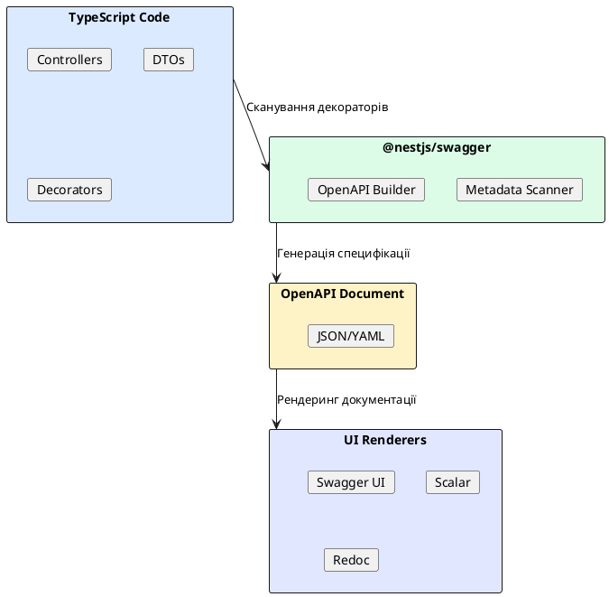

# Swagger, OpenAPI, Scalar та Arazzo

::card-group

::card{title="🎯 Мета лекції" icon="i-lucide-target"}

- Опанувати специфікацію OpenAPI 3.0 для формального опису REST API.
- Навчитися інтегрувати @nestjs/swagger для автоматичної генерації документації з TypeScript коду.
- Освоїти декоратори для документування endpoints, DTO, responses та authentication схем.
- Зрозуміти переваги Scalar як сучасної альтернативи Swagger UI.
- Ознайомитися з Arazzo Specification для описування складних API workflows.

::

::card{title="🔑 Ключові терміни" icon="i-lucide-key"}

- **OpenAPI Specification (OAS):** формальний стандарт опису REST API у машинно-читабельному форматі (JSON/YAML).
- **Swagger:** набір інструментів для роботи з OpenAPI: Swagger UI (інтерактивна документація), Swagger Editor, Swagger Codegen.
- **API Documentation:** актуальна, завжди синхронізована з кодом документація для розробників, що інтегруються з вашим API.
- **Scalar:** сучасна UI бібліотека для відображення OpenAPI документації з покращеним дизайном та UX.
- **Arazzo Specification:** розширення OpenAPI для опису послідовностей API викликів (workflows) із умовною логікою.

::

::

---

## Короткий зміст

У цій лекції вивчається автоматична генерація інтерактивної документації API через OpenAPI специфікацію:

- **Специфікація OpenAPI 3.0** — industry standard для опису REST API, структура: info, servers, paths, components (schemas, securitySchemes), tags, формат JSON або YAML
- **@nestjs/swagger інтеграція** — встановлення пакету, налаштування через `SwaggerModule.setup('/api/docs', app, document)`, генерація OpenAPI document через `SwaggerModule.createDocument(app, config)`
- **Декоратори для endpoints** — `@ApiTags()` для групування endpoints, `@ApiOperation()` для опису операції (summary, description), `@ApiResponse()` для документування можливих відповідей з кодами та схемами, `@ApiParam()`, `@ApiQuery()`, `@ApiBody()`
- **Декоратори для DTO** — `@ApiProperty()` для документування полей з типом, description, example, required, `@ApiPropertyOptional()` для опціональних полів, enum для обмеження значень
- **Автентифікація у Swagger** — `@ApiBearerAuth()` для JWT endpoints, налаштування security schemes у SwaggerConfig, UI для введення Bearer токена та тестування protected routes
- **Версіонування API** — підтримка multiple versions через окремі Swagger documents, URL versioning (/v1, /v2), header versioning, deprecation notices
- **Scalar** — сучасна альтернатива Swagger UI з кращим дизайном, інтеграція через `@scalar/nestjs-api-reference`, features: theme customization, improved navigation, better request/response examples, OpenAPI 3.1 підтримка
- **Arazzo Specification** — офіційна специфікація від OpenAPI Initiative для описування workflows та послідовностей API викликів, визначення multi-step processes з умовною логікою, передача параметрів між кроками (outputs → inputs), success/failure criteria, use cases: onboarding flows, checkout processes, approval workflows, testing scenarios
- **Генерація клієнтів** — автоматична генерація TypeScript/JavaScript клієнтів з OpenAPI spec через openapi-generator, SDK для frontend без ручного написання

Розглядаються практичні приклади: налаштування Swagger для NestJS проєкту, документування CRUD endpoints, switching на Scalar UI, опис складного workflow через Arazzo Specification.

---

## Проблема документації API

На попередніх лекціях ми розробили backend застосунок на NestJS із автентифікацією, CRUD операціями, валідацією та тестами. Проте залишається критична проблема: **як frontend розробники дізнаються, які endpoints доступні, які параметри приймають та які відповіді повертають?**

Традиційний підхід — написання документації вручну у Google Docs, Notion або Markdown файлах. Цей підхід має серйозні недоліки:

**1. Документація відстає від коду.** Розробник змінює endpoint (додає нове поле у response, змінює назву параметра), але забуває оновити документацію. Через місяць документація стає неактуальною та вводить в оману.

**2. Немає перевірки коректності.** Документація може містити помилки: невірні типи, неіснуючі endpoints, застарілі приклади. Їх неможливо автоматично виявити.

**3. Відсутність інтерактивності.** Статична документація не дозволяє **тестувати endpoints** безпосередньо з браузера: frontend розробник має скопіювати curl команду або написати код для перевірки.

**4. Дублювання інформації.** Типи TypeScript вже описують структуру DTO, валідаційні декоратори (`@IsEmail`, `@MinLength`) визначають правила, але документація описує це все ще раз — вручну.

**Рішення — OpenAPI Specification та автогенерація документації.** Замість ручного написання ви **анотуєте TypeScript код** спеціальними декораторами, а бібліотека `@nestjs/swagger` автоматично генерує **OpenAPI specification** — формальний опис вашого API у JSON/YAML форматі. Цей опис використовується для рендерингу **інтерактивної документації**, що завжди синхронізована з кодом.

::plant-uml{alt="Процес генерації API документації"}



::

У результаті фронтенд розробник відкриває `/api/docs`, бачить список всіх endpoints, може безпосередньо виконати запит з браузера, побачити структуру request/response, перевірити authentication — все без написання жодного рядка коду.

---

## Специфікація OpenAPI 3.0

**OpenAPI Specification (OAS)** — це industry standard для опису REST API, створений спільнотою та підтриманий **OpenAPI Initiative** (частина Linux Foundation). Поточна версія — **OpenAPI 3.1** (сумісна з JSON Schema 2020-12), але більшість інструментів досі використовують **OpenAPI 3.0**.

### Структура OpenAPI документа

Типовий OpenAPI документ складається з кількох ключових секцій:

```yaml
openapi: 3.0.0
info:
  title: Blog API
  description: REST API для блог-платформи
  version: 1.0.0
  contact:
    name: API Support
    email: support@blog.com

servers:
  - url: https://api.blog.com/v1
    description: Production server
  - url: http://localhost:3000/api
    description: Development server

tags:
  - name: Auth
    description: Автентифікація та авторизація
  - name: Posts
    description: Управління постами
  - name: Users
    description: Користувачі

paths:
  /auth/register:
    post:
      tags: [Auth]
      summary: Реєстрація нового користувача
      requestBody:
        required: true
        content:
          application/json:
            schema:
              $ref: '#/components/schemas/RegisterDto'
      responses:
        '201':
          description: Користувач успішно зареєстрований
          content:
            application/json:
              schema:
                $ref: '#/components/schemas/UserResponse'
        '400':
          description: Невалідні дані
        '409':
          description: Email вже зареєстрований

  /posts:
    get:
      tags: [Posts]
      summary: Отримати список постів
      parameters:
        - in: query
          name: page
          schema:
            type: integer
            default: 1
        - in: query
          name: limit
          schema:
            type: integer
            default: 10
      responses:
        '200':
          description: Список постів
          content:
            application/json:
              schema:
                type: array
                items:
                  $ref: '#/components/schemas/Post'

components:
  schemas:
    RegisterDto:
      type: object
      required:
        - email
        - password
        - name
      properties:
        email:
          type: string
          format: email
          example: user@example.com
        password:
          type: string
          minLength: 8
          example: SecurePass123!
        name:
          type: string
          example: John Doe

    UserResponse:
      type: object
      properties:
        id:
          type: string
          format: uuid
        email:
          type: string
        name:
          type: string
        createdAt:
          type: string
          format: date-time

    Post:
      type: object
      properties:
        id:
          type: string
        title:
          type: string
        content:
          type: string
        authorId:
          type: string
        published:
          type: boolean
        createdAt:
          type: string
          format: date-time

  securitySchemes:
    bearerAuth:
      type: http
      scheme: bearer
      bearerFormat: JWT

security:
  - bearerAuth: []
```

### Ключові секції OpenAPI

**`openapi`** — версія специфікації (3.0.0, 3.0.3, 3.1.0).

**`info`** — метаінформація про API: назва, опис, версія, контакти, ліцензія.

**`servers`** — список серверів, де розгорнуто API (production, staging, development). Swagger UI використовує це для вибору базового URL.

**`tags`** — логічне групування endpoints. У Swagger UI endpoints групуються за тегами.

**`paths`** — найважливіша секція, що описує всі endpoints: методи HTTP, параметри, тіла запитів, відповіді.

**`components`** — переіспользовувані компоненти: схеми даних (`schemas`), параметри (`parameters`), відповіді (`responses`), security schemes.

**`security`** — глобальні налаштування безпеки (authentication/authorization).

::note
**JSON Schema vs OpenAPI Schema:** У OpenAPI 3.0 схеми об'єктів — це розширена версія JSON Schema Draft 5 з додатковими полями (`example`, `nullable`, `discriminator`). У OpenAPI 3.1 повністю сумісна з JSON Schema 2020-12, що спрощує валідацію та переіспользання схем.
::

### Переваги формальної специфікації

**1. Машинно-читабельний формат.** OpenAPI документ — це JSON/YAML, який можна парсити програмно. Це дозволяє:
- Автоматично генерувати клієнтські SDK (TypeScript, Python, Java).
- Валідувати запити/відповіді проти схеми.
- Генерувати моки для тестування.
- Створювати автоматизовані тести на основі специфікації.

**2. Незалежність від мови програмування.** OpenAPI описує API на рівні HTTP, не прив'язуючись до backend технології. Ваш API може бути на NestJS, Django, Spring Boot — специфікація однакова.

**3. Екосистема інструментів.** Для OpenAPI існують десятки інструментів: Swagger UI, Redoc, Scalar, Postman (імпорт OpenAPI), Insomnia, API мокери, code generators.

---

## Інтеграція @nestjs/swagger

NestJS має офіційну бібліотеку `@nestjs/swagger`, що автоматично генерує OpenAPI документ зі структури вашого застосунку.

### Встановлення

```bash
npm install --save @nestjs/swagger
```

### Базова конфігурація у main.ts

```typescript
// src/main.ts
import { NestFactory } from '@nestjs/core';
import { ValidationPipe } from '@nestjs/common';
import { SwaggerModule, DocumentBuilder } from '@nestjs/swagger';
import { AppModule } from './app.module';

async function bootstrap() {
  const app = await NestFactory.create(AppModule);

  // Глобальні налаштування
  app.setGlobalPrefix('api');
  app.useGlobalPipes(new ValidationPipe({
    whitelist: true,
    transform: true,
  }));

  // Конфігурація Swagger
  const config = new DocumentBuilder()
    .setTitle('Blog API')
    .setDescription('REST API для блог-платформи на NestJS')
    .setVersion('1.0')
    .addTag('auth', 'Автентифікація користувачів')
    .addTag('users', 'Управління користувачами')
    .addTag('posts', 'CRUD операції з постами')
    .addBearerAuth() // Додаємо підтримку JWT Bearer токенів
    .build();

  // Генерація OpenAPI документа
  const document = SwaggerModule.createDocument(app, config);

  // Налаштування Swagger UI за адресою /api/docs
  SwaggerModule.setup('api/docs', app, document, {
    swaggerOptions: {
      persistAuthorization: true, // Зберігає JWT токен між перезавантаженнями
    },
  });

  await app.listen(3000);
  console.log(`🚀 Server running on http://localhost:3000`);
  console.log(`📚 Swagger docs available at http://localhost:3000/api/docs`);
}

bootstrap();
```

Після запуску застосунку відкрийте `http://localhost:3000/api/docs` — ви побачите інтерактивну документацію Swagger UI зі списком усіх endpoints.


### Пояснення конфігурації

**`DocumentBuilder`** — builder клас для налаштування метаданих OpenAPI документа:
- **`.setTitle()`** — назва API у документації.
- **`.setDescription()`** — детальний опис призначення API.
- **`.setVersion()`** — версія API (семантичне версіонування: `major.minor.patch`).
- **`.addTag()`** — додає тег для групування endpoints. У Swagger UI endpoints з однаковим тегом відображаються у одній секції.
- **`.addBearerAuth()`** — додає підтримку JWT Bearer токенів для документування protected endpoints.

**`SwaggerModule.createDocument(app, config)`** — сканує всі контролери та генерує OpenAPI document з їхніх декораторів.

**`SwaggerModule.setup(path, app, document, options)`** — створює HTTP endpoint для Swagger UI:
- **`path`** — шлях для доступу до документації (наприклад, `api/docs`).
- **`document`** — згенерований OpenAPI document.
- **`options`** — налаштування Swagger UI (теми, persistAuthorization, фільтри).

::tip
**Доступ до raw OpenAPI JSON:** За замовчуванням Swagger UI доступний за шляхом `/api/docs`, а raw OpenAPI document у JSON форматі — за шляхом `/api/docs-json`. Це корисно для інтеграції з іншими інструментами (Postman, code generators):

```bash
curl http://localhost:3000/api/docs-json > openapi.json
```

Ви можете змінити цей шлях:

```typescript
SwaggerModule.setup('api/docs', app, document, {
  jsonDocumentUrl: '/api/openapi.json', // Custom шлях для JSON
  yamlDocumentUrl: '/api/openapi.yaml', // YAML формат
});
```
::

---

## Документування контролерів та endpoints

Після базової конфігурації Swagger вже буде генерувати документацію зі структури контролерів, проте вона буде мінімальною. Для покращення використовуйте декоратори з `@nestjs/swagger`.

### @ApiTags() — групування endpoints

```typescript
// auth/auth.controller.ts
import { Controller, Post, Body } from '@nestjs/common';
import { ApiTags } from '@nestjs/swagger';

@ApiTags('auth') // Група endpoints для автентифікації
@Controller('auth')
export class AuthController {
  @Post('register')
  register(@Body() dto: RegisterDto) {
    // ...
  }

  @Post('login')
  login(@Body() dto: LoginDto) {
    // ...
  }
}
```

У Swagger UI ці endpoints будуть згруповані під секцією **«auth»**.

### @ApiOperation() — опис операції

```typescript
import { ApiOperation } from '@nestjs/swagger';

@Post('register')
@ApiOperation({
  summary: 'Реєстрація нового користувача',
  description: 'Створює новий акаунт користувача. Email має бути унікальним. Пароль автоматично хешується через bcrypt.',
})
register(@Body() dto: RegisterDto) {
  return this.authService.register(dto);
}
```

**`summary`** — коротке однорядкове резюме (відображається у списку endpoints).
**`description`** — детальний опис із підтримкою Markdown (відображається при розгортанні endpoint).

### @ApiResponse() — документування відповідей

```typescript
import { ApiResponse } from '@nestjs/swagger';

@Post('register')
@ApiOperation({ summary: 'Реєстрація нового користувача' })
@ApiResponse({
  status: 201,
  description: 'Користувач успішно зареєстрований',
  type: UserResponseDto,
})
@ApiResponse({
  status: 400,
  description: 'Невалідні дані (email не відповідає формату, пароль занадто короткий)',
})
@ApiResponse({
  status: 409,
  description: 'Email вже зареєстрований у системі',
})
register(@Body() dto: RegisterDto): Promise<UserResponseDto> {
  return this.authService.register(dto);
}
```

Для кожного HTTP status code створюється окрема `@ApiResponse()`. Параметр `type` вказує на DTO клас, структура якого автоматично відображається у Swagger.

::note
**Скорочені декоратори:** NestJS надає готові декоратори для найпоширеніших статусів:
- `@ApiOkResponse()` — еквівалент `@ApiResponse({ status: 200 })`
- `@ApiCreatedResponse()` — еквівалент `@ApiResponse({ status: 201 })`
- `@ApiBadRequestResponse()` — еквівалент `@ApiResponse({ status: 400 })`
- `@ApiUnauthorizedResponse()` — еквівалент `@ApiResponse({ status: 401 })`
- `@ApiForbiddenResponse()` — еквівалент `@ApiResponse({ status: 403 })`
- `@ApiNotFoundResponse()` — еквівалент `@ApiResponse({ status: 404 })`

```typescript
@Post('register')
@ApiCreatedResponse({ description: 'Користувач створений', type: UserResponseDto })
@ApiBadRequestResponse({ description: 'Невалідні дані' })
@ApiConflictResponse({ description: 'Email вже існує' })
register(@Body() dto: RegisterDto) {
  // ...
}
```
::

### @ApiParam(), @ApiQuery(), @ApiBody() — параметри

Для документування параметрів маршруту, query параметрів та тіла запиту:

```typescript
import { ApiParam, ApiQuery, ApiBody } from '@nestjs/swagger';

@Get(':id')
@ApiParam({
  name: 'id',
  type: String,
  description: 'Унікальний ідентифікатор користувача (UUID)',
  example: '550e8400-e29b-41d4-a716-446655440000',
})
findOne(@Param('id') id: string) {
  return this.userService.findById(id);
}

@Get()
@ApiQuery({
  name: 'page',
  type: Number,
  required: false,
  description: 'Номер сторінки для пагінації',
  example: 1,
})
@ApiQuery({
  name: 'limit',
  type: Number,
  required: false,
  description: 'Кількість елементів на сторінці',
  example: 10,
})
findAll(@Query('page') page: number = 1, @Query('limit') limit: number = 10) {
  return this.userService.findAll(page, limit);
}

@Post()
@ApiBody({
  type: CreateUserDto,
  description: 'Дані для створення користувача',
  examples: {
    user1: {
      summary: 'Базовий користувач',
      value: {
        email: 'user@example.com',
        name: 'John Doe',
        password: 'SecurePass123!',
      },
    },
    admin: {
      summary: 'Адміністратор',
      value: {
        email: 'admin@example.com',
        name: 'Admin User',
        password: 'AdminPass123!',
        role: 'admin',
      },
    },
  },
})
create(@Body() dto: CreateUserDto) {
  return this.userService.create(dto);
}
```

**`@ApiBody()`** підтримує кілька прикладів (`examples`), що відображаються у Swagger UI як dropdown для швидкого заповнення форми.

---

## Документування DTO через @ApiProperty()

Декоратори на контролерах документують endpoints, але структура DTO (Data Transfer Objects) також має бути описана для генерації схем.

### Базовий приклад DTO

```typescript
// auth/dto/register.dto.ts
import { ApiProperty } from '@nestjs/swagger';
import { IsEmail, IsString, MinLength, MaxLength } from 'class-validator';

export class RegisterDto {
  @ApiProperty({
    description: 'Email-адреса користувача (має бути унікальною)',
    example: 'user@example.com',
    type: String,
    format: 'email',
  })
  @IsEmail()
  email: string;

  @ApiProperty({
    description: 'Пароль (мінімум 8 символів, має містити цифри та літери)',
    example: 'SecurePass123!',
    minLength: 8,
    maxLength: 128,
  })
  @IsString()
  @MinLength(8)
  @MaxLength(128)
  password: string;

  @ApiProperty({
    description: "Повне ім'я користувача",
    example: 'John Doe',
    minLength: 2,
    maxLength: 100,
  })
  @IsString()
  @MinLength(2)
  @MaxLength(100)
  name: string;
}
```

**Параметри `@ApiProperty()`:**
- **`description`** — опис поля у документації.
- **`example`** — приклад значення (використовується у Swagger UI для автозаповнення).
- **`type`** — тип даних (String, Number, Boolean, або custom клас).
- **`format`** — формат даних для валідації (`email`, `uuid`, `date-time`, `uri`).
- **`minLength` / `maxLength`** — обмеження довжини рядка.
- **`minimum` / `maximum`** — обмеження числових значень.
- **`enum`** — перелік допустимих значень.
- **`required`** — чи обов'язкове поле (за замовчуванням `true`, якщо поле не optional).

### @ApiPropertyOptional() — опціональні поля

Для опціональних полей використовуйте `@ApiPropertyOptional()`:

```typescript
import { ApiProperty, ApiPropertyOptional } from '@nestjs/swagger';
import { IsOptional, IsBoolean } from 'class-validator';

export class UpdatePostDto {
  @ApiPropertyOptional({
    description: 'Новий заголовок поста',
    example: 'Updated Title',
  })
  @IsOptional()
  @IsString()
  title?: string;

  @ApiPropertyOptional({
    description: 'Оновлений контент поста',
    example: 'New content here...',
  })
  @IsOptional()
  @IsString()
  content?: string;

  @ApiPropertyOptional({
    description: 'Чи опублікований пост',
    example: true,
  })
  @IsOptional()
  @IsBoolean()
  published?: boolean;
}
```

### Enum values

Для полів з обмеженим набором значень:

```typescript
export enum UserRole {
  USER = 'user',
  ADMIN = 'admin',
  MODERATOR = 'moderator',
}

export class CreateUserDto {
  @ApiProperty({
    description: 'Роль користувача у системі',
    enum: UserRole,
    default: UserRole.USER,
    example: UserRole.USER,
  })
  @IsEnum(UserRole)
  role: UserRole;
}
```

У Swagger UI це відобразиться як dropdown з доступними значеннями.

### Вкладені об'єкти

Для складних структур із вкладеними об'єктами:

```typescript
export class AddressDto {
  @ApiProperty({ example: 'Kyiv' })
  city: string;

  @ApiProperty({ example: 'Shevchenko St.' })
  street: string;

  @ApiProperty({ example: '01001' })
  postalCode: string;
}

export class CreateOrderDto {
  @ApiProperty({ description: 'Список ID товарів', type: [String] })
  productIds: string[];

  @ApiProperty({ description: 'Адреса доставки', type: AddressDto })
  shippingAddress: AddressDto;
}
```

**`type: [String]`** — масив рядків.
**`type: AddressDto`** — вкладений об'єкт.

::tip
**Автоматична інференція типів:** `@nestjs/swagger` може автоматично визначити деякі типи з TypeScript метаданих, якщо ви ввімкнете `CLI Plugin`:

```json
// nest-cli.json
{
  "collection": "@nestjs/schematics",
  "sourceRoot": "src",
  "compilerOptions": {
    "plugins": ["@nestjs/swagger"]
  }
}
```

З увімкненим plugin не потрібно вручну вказувати `@ApiProperty()` для простих типів — вони визначаються автоматично. Проте для `description`, `example` та `enum` все одно потрібні декоратори.
::

---

## Автентифікація у Swagger: JWT Bearer

Більшість endpoints вимагають автентифікації через JWT токен. Щоб документувати це та дозволити тестувати protected endpoints у Swagger UI, налаштуйте Bearer auth.

### Крок 1: Додайте Bearer auth у конфігурацію

```typescript
// main.ts
const config = new DocumentBuilder()
  .setTitle('Blog API')
  .setVersion('1.0')
  .addBearerAuth() // Додає схему безпеки типу Bearer Token
  .build();
```

Це додає до OpenAPI документа секцію:

```yaml
components:
  securitySchemes:
    bearer:
      type: http
      scheme: bearer
      bearerFormat: JWT
```

### Крок 2: Позначте protected endpoints

```typescript
import { ApiBearerAuth } from '@nestjs/swagger';

@Controller('posts')
@ApiTags('posts')
export class PostController {
  @Get()
  @ApiOperation({ summary: 'Отримати список постів (публічний)' })
  findAll() {
    return this.postService.findAll();
  }

  @Post()
  @ApiBearerAuth() // Вимагає Bearer токен
  @ApiOperation({ summary: 'Створити новий пост (requires auth)' })
  create(@Body() dto: CreatePostDto) {
    return this.postService.create(dto);
  }

  @Patch(':id')
  @ApiBearerAuth() // Вимагає Bearer токен
  @ApiOperation({ summary: 'Оновити пост (requires auth)' })
  update(@Param('id') id: string, @Body() dto: UpdatePostDto) {
    return this.postService.update(id, dto);
  }
}
```

### Крок 3: Тестування у Swagger UI

Після налаштування Bearer auth у Swagger UI з'явиться кнопка **«Authorize»** (іконка замка) у верхньому правому куті. Натисніть її, введіть JWT токен у форматі `Bearer <token>`, та усі наступні запити до protected endpoints автоматично включатимуть цей токен у header `Authorization`.

::note
**Як отримати JWT токен для тестування?**

1. **Через Swagger UI:** викличте endpoint `POST /api/auth/login` з валідними credentials, скопіюйте `access_token` з відповіді.
2. **Через curl або Postman:** зареєструйтеся, увійдіть, збережіть токен.
3. **Hardcoded токен для dev:** під час розробки можна тимчасово хардкодити токен у Swagger:

```typescript
SwaggerModule.setup('api/docs', app, document, {
  swaggerOptions: {
    persistAuthorization: true,
    // Попередньо заповнює токен (лише для dev!)
    // authAction: {
    //   bearer: {
    //     name: 'bearer',
    //     schema: { type: 'http', in: 'header' },
    //     value: 'Bearer eyJhbGciOiJIUzI1NiIsInR5cCI6IkpXVCJ9...'
    //   }
    // }
  },
});
```

**Ніколи не комітьте реальні токени у репозиторій!**
::


---

## Scalar: сучасна альтернатива Swagger UI

**Scalar** — це сучасна open-source бібліотека для рендерингу OpenAPI документації з покращеним дизайном, UX та продуктивністю порівняно з класичним Swagger UI.

### Переваги Scalar над Swagger UI

::card-group

::card{title="🎨 Сучасний дизайн" icon="i-lucide-palette"}

Scalar має мінімалістичний, адаптивний інтерфейс з підтримкою темної/світлої тем, кращою типографікою та анімаціями.

::

::card{title="⚡ Швидкість" icon="i-lucide-zap"}

Побудований на Vue 3 із оптимізацією продуктивності. Швидше завантажується та рендериться порівняно з Swagger UI (React-based).

::

::card{title="🔍 Покращена навігація" icon="i-lucide-search"}

Потужний пошук по endpoints, автоматична  генерація змісту, breadcrumbs для складної структури API.

::

::card{title="📖 Кращі приклади" icon="i-lucide-book-open"}

Відображає request/response приклади у кількох форматах: curl, JavaScript/fetch, Python, PHP, Go. Автоматична синхронізація параметрів між формами та прикладами коду.

::

::

### Інтеграція Scalar у NestJS

Встановлення пакету:

```bash
npm install --save @scalar/nestjs-api-reference
```

Налаштування у `main.ts`:

```typescript
// main.ts
import { NestFactory } from '@nestjs/core';
import { SwaggerModule, DocumentBuilder } from '@nestjs/swagger';
import { apiReference } from '@scalar/nestjs-api-reference';
import { AppModule } from './app.module';

async function bootstrap() {
  const app = await NestFactory.create(AppModule);

  // Генерація OpenAPI документа (як раніше)
  const config = new DocumentBuilder()
    .setTitle('Blog API')
    .setDescription('REST API для блог-платформи')
    .setVersion('1.0')
    .addBearerAuth()
    .build();

  const document = SwaggerModule.createDocument(app, config);

  // Варіант 1: Лише Scalar (замість Swagger UI)
  app.use(
    '/api/docs',
    apiReference({
      spec: {
        content: document,
      },
      theme: 'purple', // 'default', 'moon', 'purple', 'solarized', 'bluePlanet'
      darkMode: true,
      layout: 'modern', // 'modern' або 'classic'
      showSidebar: true,
    }),
  );

  // Варіант 2: Обидва (Swagger UI + Scalar)
  SwaggerModule.setup('api/swagger', app, document); // Swagger UI
  app.use('/api/docs', apiReference({ spec: { content: document } })); // Scalar

  await app.listen(3000);
  console.log(`📚 Scalar docs: http://localhost:3000/api/docs`);
  console.log(`📚 Swagger UI: http://localhost:3000/api/swagger`);
}

bootstrap();
```

### Налаштування кастомізації

```typescript
app.use(
  '/api/docs',
  apiReference({
    spec: {
      content: document,
    },
    // Тема та кольори
    theme: 'purple',
    darkMode: true,

    // Layout опції
    layout: 'modern',
    showSidebar: true,
    hideDarkModeToggle: false,
    hideDownloadButton: false,

    // Метадані
    metaData: {
      title: 'Blog API Documentation | Scalar',
      description: 'Interactive API documentation for Blog API',
      ogDescription: 'Explore and test Blog API endpoints',
      ogTitle: 'Blog API Docs',
      ogImage: 'https://example.com/og-image.png',
      twitterCard: 'summary_large_image',
    },

    // Custom CSS
    customCss: `
      .scalar-card {
        border-radius: 12px;
      }
      .scalar-button {
        font-weight: 600;
      }
    `,

    // Authentication налаштування
    authentication: {
      preferredSecurityScheme: 'bearer',
      apiKey: {
        token: process.env.DEFAULT_API_KEY, // Для dev
      },
    },

    // Серверні змінні
    servers: [
      {
        url: 'https://api.production.com',
        description: 'Production',
      },
      {
        url: 'http://localhost:3000',
        description: 'Development',
      },
    ],
  }),
);
```

### Порівняння: Swagger UI vs Scalar

| Функція                          | Swagger UI     | Scalar         |
|----------------------------------|----------------|----------------|
| **Підтримка OpenAPI**            | 2.0, 3.0, 3.1  | 3.0, 3.1       |
| **Дизайн**                       | Класичний      | Сучасний       |
| **Темна тема**                   | ✅ Базова      | ✅ Покращена   |
| **Швидкість завантаження**       | Середня        | Швидка         |
| **Request examples**             | curl           | 10+ мов        |
| **Пошук**                        | Базовий        | Розширений     |
| **Mobile responsive**            | ⚠️ Обмежений   | ✅ Повний      |
| **Кастомізація CSS**             | ✅             | ✅             |
| **Try it out функціонал**        | ✅             | ✅             |
| **WebSocket підтримка**          | ❌             | ⚠️ Планується  |
| **Розмір bundle**                | ~500 KB        | ~200 KB        |

::tip
**Коли використовувати що?**

**Залишайтеся на Swagger UI**, якщо:
- Ваша команда вже звикла до Swagger UI.
- Потрібна підтримка OpenAPI 2.0 (Swagger).
- Використовуєте специфічні Swagger UI plugins.

**Перейдіть на Scalar**, якщо:
- Важлива естетика та UX документації.
- Потрібні приклади коду для різних мов.
- Хочете швидшого завантаження та кращої mobile підтримки.
- Працюєте з OpenAPI 3.1 (повна підтримка JSON Schema 2020-12).

**Використовуйте обидва**: налаштуйте обидва UI за різними шляхами (`/api/swagger` та `/api/docs`) та дозвольте користувачам вибирати.
::

---

## Arazzo Specification: документування workflows

**Arazzo Specification** — це офіційне розширення OpenAPI від OpenAPI Initiative для опису **послідовностей API викликів** (workflows) із умовною логікою та передачею даних між кроками.

### Проблема, яку вирішує Arazzo

OpenAPI чудово описує окремі endpoints, але не показує, **як їх використовувати разом** для досягнення бізнес-цілей. Наприклад:

**Сценарій:** Користувач хоче створити замовлення.

**Послідовність дій:**
1. `POST /auth/register` — реєстрація (якщо ще не зареєстрований).
2. `POST /auth/login` — вхід у систему, отримання JWT токена.
3. `GET /products` — перегляд доступних товарів.
4. `POST /cart/items` — додавання товарів до кошика.
5. `POST /orders` — створення замовлення з товарів у кошику.
6. `POST /orders/{orderId}/payment` — оплата замовлення.
7. `GET /orders/{orderId}` — перевірка статусу замовлення.

OpenAPI описує кожен endpoint окремо, але **не показує порядок** та **не пояснює залежності**. Arazzo заповнює цю прогалину, описуючи workflows у машинно-читабельному форматі.

### Структура Arazzo документа

```yaml
arazzo: 1.0.0
info:
  title: Blog API Workflows
  version: 1.0.0
  description: Типові сценарії використання Blog API

sourceDescriptions:
  - name: blogAPI
    type: openapi
    url: /api/docs-json # Посилання на OpenAPI документ

workflows:
  - workflowId: user-registration-and-post-creation
    summary: Реєстрація користувача та створення поста
    description: Повний цикл від реєстрації до публікації першого поста
    
    inputs:
      type: object
      properties:
        userEmail:
          type: string
        userPassword:
          type: string
        userN ame:
          type: string
        postTitle:
          type: string
        postContent:
          type: string

    steps:
      - stepId: register
        description: Реєстрація нового користувача
        operationId: AuthController_register # Посилання на operationId з OpenAPI
        requestBody:
          contentType: application/json
          payload:
            email: $inputs.userEmail
            password: $inputs.userPassword
            name: $inputs.userName
        successCriteria:
          - condition: $statusCode == 201
        outputs:
          userId: $response.body.id
          accessToken: $response.body.access_token

      - stepId: createPost
        description: Створення поста авторизованим користувачем
        operationId: PostController_create
        dependsOn: [register] # Цей крок залежить від успішного виконання register
        requestBody:
          contentType: application/json
          payload:
            title: $inputs.postTitle
            content: $inputs.postContent
            authorId: $steps.register.outputs.userId # Використання output попереднього кроку
        parameters:
          - name: Authorization
            in: header
            value: Bearer $steps.register.outputs.accessToken
        successCriteria:
          - condition: $statusCode == 201
        outputs:
          postId: $response.body.id

      - stepId: publishPost
        description: Публікація створеного поста
        operationId: PostController_update
        dependsOn: [createPost]
        parameters:
          - name: id
            in: path
            value: $steps.createPost.outputs.postId
          - name: Authorization
            in: header
            value: Bearer $steps.register.outputs.accessToken
        requestBody:
          contentType: application/json
          payload:
            published: true
        successCriteria:
          - condition: $statusCode == 200
          - condition: $response.body.published == true

    outputs:
      userId: $steps.register.outputs.userId
      postId: $steps.createPost.outputs.postId
      postPublishedAt: $response.body.publishedAt
```

### Ключові концепції Arazzo

**`workflows`** — список сценаріїв використання API. Кожен workflow — це послідовність кроків.

**`steps`** — окремі API виклики у workflow. Кожен крок посилається на `operationId` з OpenAPI документа.

**`inputs`** — параметри, які користувач надає на початку workflow (наприклад, email, пароль).

**`outputs`** — дані, що повертаються після виконання кроку та можуть використовуватися у наступних кроках.

**`dependsOn`** — визначає залежності між кроками. Крок не виконається, поки не завершаться всі його залежності.

**`successCriteria`** — умови успіху кроку (HTTP status code, значення полів у відповіді).

**Runtime Expressions** — спеціальний синтаксис для доступу до даних:
- `$inputs.userEmail` — вхідний параметр workflow.
- `$steps.register.outputs.userId` — output попереднього кроку.
- `$response.body.id` — поле з відповіді API.
- `$statusCode` — HTTP status code відповіді.

### Використання Arazzo для тестування

Arazzo документи можуть використовуватися для **автоматизованого тестування** workflows:

```typescript
// Псевдокод для виконання Arazzo workflow
import { ArazzoRunner } from 'arazzo-runner';

const runner = new ArazzoRunner({
  arazzoSpec: 'workflows.arazzo.yaml',
  openApiSpec: 'openapi.json',
});

const result = await runner.executeWorkflow('user-registration-and-post-creation', {
  inputs: {
    userEmail: 'test@example.com',
    userPassword: 'SecurePass123!',
    userName: 'Test User',
    postTitle: 'My First Post',
    postContent: 'Hello, World!',
  },
});

console.log('Workflow completed:', result.success);
console.log('Outputs:', result.outputs);
```

::note
**Arazzo vs Postman Collections:** Обидва описують послідовності API викликів, проте:

- **Arazzo** — відкритий стандарт від OpenAPI Initiative, machine-readable (YAML/JSON), інтегрується з OpenAPI документами, підтримує умовну логіку.
- **Postman Collections** — proprietary формат Postman, орієнтований на UI інструмент, менш формальний, але з потужним GUI для створення та виконання.

Arazzo кращий для **автоматизації**, **генерації документації** та **інтеграції з CI/CD**. Postman зручніший для **ручного тестування** та **exploratory testing**.
::

### Use cases для Arazzo

**1. Onboarding flows:** Документування процесу реєстрації нового користувача, верифікації email, налаштування профілю, вибору subscription plan.

**2. Checkout processes:** Весь цикл оформлення замовлення: додавання товарів → застосування промокоду → вибір доставки → оплата → підтвердження.

**3. Approval workflows:** Багатокрокові процеси затвердження: створення запиту → ревю менеджером → затвердження директором → виконання.

**4. Data migration:** Послідовність викликів для міграції даних між системами: експорт → трансформація → валідація → імпорт.

**5. Testing scenarios:** Автоматизовані тести для складних user journeys, де важливий порядок викликів та передача даних між ними.

---

## Генерація клієнтських SDK

Одна з найпотужніших можливостей OpenAPI — автоматична генерація клієнтських SDK для frontend застосунків.

### Використання openapi-generator

Встановлення:

```bash
npm install -g @openapitools/openapi-generator-cli
```

Генерація TypeScript клієнта:

```bash
# Завантаження OpenAPI spec
curl http://localhost:3000/api/docs-json > openapi.json

# Генерація TypeScript Axios клієнта
openapi-generator-cli generate \
  -i openapi.json \
  -g typescript-axios \
  -o ./src/generated/api \
  --additional-properties=npmName=blog-api-client,npmVersion=1.0.0
```

Результат — готовий TypeScript SDK із типізованими методами для всіх endpoints:

```typescript
// Автоматично згенерований код
import { Configuration, AuthApi, PostsApi } from './generated/api';

const config = new Configuration({
  basePath: 'http://localhost:3000/api',
});

const authApi = new AuthApi(config);
const postsApi = new PostsApi(config);

// Реєстрація (типізовані параметри!)
const registerResponse = await authApi.authControllerRegister({
  email: 'user@example.com',
  password: 'SecurePass123!',
  name: 'John Doe',
});

const token = registerResponse.data.access_token;

// Створення поста (типізований response!)
const postResponse = await postsApi.postControllerCreate(
  {
    title: 'My Post',
    content: 'Content here',
  },
  {
    headers: {
      Authorization: `Bearer ${token}`,
    },
  },
);

console.log('Post created:', postResponse.data.id);
```

### Переваги згенерованих SDK

**1. Типова безпека:** Всі параметри та responses типізовані через TypeScript. IDE підказує доступні поля та ловить помилки на етапі компіляції.

**2. Автоматична синхронізація:** Якщо backend змінює структуру API, просто перегенеруйте SDK, та TypeScript покаже всі місця, де потрібно оновити frontend код.

**3. Зменшення boilerplate:** Не потрібно вручну писати `fetch()` або `axios` виклики для кожного endpoint.

**4. Документація у коді:** Згенеровані методи містять JSDoc коментарі з описами з OpenAPI spec.

**5. Підтримка authentication:** Генератор автоматично додає методи для Bearer auth, API keys, OAuth2.

### Підтримувані мови та фреймворки

OpenAPI Generator підтримує генерацію клієнтів для 40+ мов та фреймворків:

- **Frontend:** TypeScript (Axios, Fetch, Angular), JavaScript (jQuery, Node.js)
- **Mobile:** Swift (iOS), Kotlin (Android), Dart (Flutter)
- **Backend:** Python, Java, C#, Go, Ruby, PHP, Rust

Список усіх генераторів:

```bash
openapi-generator-cli list
```

---

## Висновки та best practices

::card-group

::card{title="✅ Документуйте код через декоратори" icon="i-lucide-code"}

Використовуйте `@ApiTags()`, `@ApiOperation()`, `@ApiResponse()` та `@ApiProperty()` для опису endpoints та DTO. Документація генерується автоматично з коду та завжди актуальна.

::

::card{title="✅ Надавайте приклади" icon="i-lucide-lightbulb"}

Параметр `example` у `@ApiProperty()` критично важливий для розробників, що інтегруються з вашим API. Хороші приклади зменшують кількість питань та помилок інтеграції.

::

::card{title="✅ Документуйте помилки" icon="i-lucide-alert-circle"}

Використовуйте `@ApiResponse()` для всіх можливих HTTP status codes (200, 400, 401, 403, 404, 409, 500). Поясніть, у яких випадках виникає кожна помилка.

::

::card{title="✅ Розгляньте Scalar для кращого UX" icon="i-lucide-sparkles"}

Якщо естетика документації важлива (наприклад, для публічного API), інвестуйте час у налаштування Scalar з кастомною темою та брендингом.

::

::

**Практичне завдання:** Додайте повну Swagger/Scalar документацію до вашого blog API проєкту:
1. Налаштуйте `@nestjs/swagger` у `main.ts`.
2. Додайте `@ApiTags()` та `@ApiOperation()` до всіх контролерів.
3. Задокументуйте всі DTO через `@ApiProperty()` з прикладами.
4. Налаштуйте Bearer auth для protected endpoints.
5. Згенеруйте TypeScript Axios клієнт через `openapi-generator`.
6. (Додатково) Інтегруйте Scalar та порівняйте з Swagger UI.

::accordion

::accordion-item{label="❓ Як версіонувати API через OpenAPI?" icon="i-lucide-help-circle"}

Існує кілька підходів до версіонування API:

**Підхід 1: URL versioning (найпоширеніший)**

```typescript
// main.ts
const configV1 = new DocumentBuilder()
  .setTitle('Blog API')
  .setVersion('1.0')
  .build();

const configV2 = new DocumentBuilder()
  .setTitle('Blog API')
  .setVersion('2.0')
  .build();

const documentV1 = SwaggerModule.createDocument(app, configV1, {
  include: [AuthModuleV1, PostModuleV1], // Модулі для v1
});

const documentV2 = SwaggerModule.createDocument(app, configV2, {
  include: [AuthModuleV2, PostModuleV2], // Модулі для v2
});

SwaggerModule.setup('api/v1/docs', app, documentV1);
SwaggerModule.setup('api/v2/docs', app, documentV2);
```

Це створює окремі Swagger документації за шляхами `/api/v1/docs` та `/api/v2/docs`.

**Підхід 2: Header versioning**

```typescript
app.enableVersioning({
  type: VersioningType.HEADER,
  header: 'API-Version',
});

// У контролері
@Controller('posts')
@Version('1')
export class PostControllerV1 { /* ... */ }

@Controller('posts')
@Version('2')
export class PostControllerV2 { /* ... */ }
```

**Підхід 3: Deprecation notices**

Для поступового припинення підтримки старих версій:

```typescript
@Post()
@ApiOperation({
  summary: 'Create post (deprecated)',
  deprecated: true,
})
@ApiResponse({
  status: 200,
  description: 'Use POST /v2/posts instead. This endpoint will be removed in v3.',
})
create(@Body() dto: CreatePostDto) {
  // ...
}
```

::

::accordion-item{label="❓ Як документувати file uploads у Swagger?" icon="i-lucide-help-circle"}

Для endpoints, що приймають файли (multipart/form-data):

```typescript
import { ApiConsumes, ApiBody } from '@nestjs/swagger';
import { FileInterceptor } from '@nestjs/platform-express';

@Post('upload')
@ApiConsumes('multipart/form-data')
@ApiBody({
  schema: {
    type: 'object',
    properties: {
      file: {
        type: 'string',
        format: 'binary',
      },
      description: {
        type: 'string',
      },
    },
  },
})
@UseInterceptors(FileInterceptor('file'))
uploadFile(
  @UploadedFile() file: Express.Multer.File,
  @Body('description') description: string,
) {
  return { filename: file.originalname, description };
}
```

У Swagger UI з'явиться кнопка **«Choose File»** для вибору файлу з файлової системи.

::

::