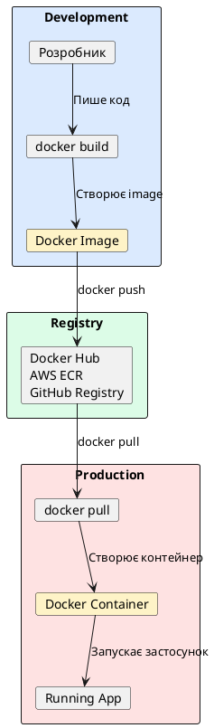

# Docker та контейнеризація

::card-group

::card{title="🎯 Мета лекції" icon="i-lucide-target"}

- Опанувати концепції Docker контейнеризації для упаковки NestJS застосунків.
- Навчитися створювати оптимізовані Dockerfile з multi-stage builds для зменшення розміру образів.
- Освоїти Docker Compose для оркестрації multi-container середовищ (NestJS + PostgreSQL + Redis).
- Зрозуміти принципи volumes для персистентності даних та networking для комунікації між контейнерами.
- Впровадити best practices для безпечних та ефективних production-ready Docker образів.

::

::card{title="🔑 Ключові терміни" icon="i-lucide-key"}

- **Container:** ізольоване середовище виконання з власною файловою системою, процесами та мережею.
- **Image:** незмінний template для створення контейнерів, містить ОС, залежності та код застосунку.
- **Dockerfile:** текстовий файл з інструкціями для побудови Docker image.
- **Multi-stage Build:** техніка оптимізації, що використовує кілька базових образів для зменшення final image size.
- **Docker Compose:** інструмент для декларативного опису та запуску multi-container застосунків через YAML конфігурацію.

::

::

---

## Короткий зміст

У цій лекції вивчається упаковка NestJS застосунку у Docker контейнери для reproducible deployments:

- **Docker концепція** — контейнеризація для ізоляції застосунків, образи (images) як templates, контейнери (containers) як running instances, переваги: consistency across environments, easy scaling, dependency isolation
- **Dockerfile для NestJS** — інструкції для побудови image: FROM node:18-alpine базовий образ, WORKDIR для робочої директорії, COPY для файлів, RUN для команд (npm install), CMD для запуску застосунку, EXPOSE для порту
- **Multi-stage build** — оптимізація розміру образу: stage 1 (builder) для npm install та build, stage 2 (production) лише з dist/ та production dependencies, копіювання артефактів між stages, зменшення final image size з ~1GB до ~200MB
- **.dockerignore** — виключення файлів з build context: node_modules/, .git/, .env, *.md, зменшення build time та розміру image
- **Docker Compose** — оркестрація multi-container застосунків, docker-compose.yml з services: app (NestJS), db (PostgreSQL), redis, networks для communication, volumes для persistence
- **Volumes** — персистентність даних БД через named volumes, bind mounts для development (live reload), anonymous volumes для node_modules
- **Networking** — communication між контейнерами через service names, environment variables для connection strings (DATABASE_HOST=db), port mapping для доступу ззовні (-p 3000:3000)
- **Best practices** — використання .dockerignore, multi-stage builds, non-root user для security, health checks, minimal base images (alpine), layer caching optimization

Розглядаються практичні приклади: Dockerfile для NestJS з multi-stage, docker-compose.yml для dev environment (NestJS + PostgreSQL + Redis), production-ready setup, debugging у контейнері.

---

## Проблема розгортання без контейнеризації

На попередніх лекціях ми розробили повнофункціональний NestJS застосунок із автентифікацією, тестуванням, документацією та конфігурацією. Проте виникає питання: **як розгорнути цей застосунок у production**, щоб він працював стабільно та передбачувано?

**Традиційний підхід «розгортання на сервері»** створює низку проблем:

**1. "Works on my machine" синдром.** Застосунок працює на локальній машині розробника (macOS з Node.js 18.16.0), але падає на production сервері (Ubuntu з Node.js 16.20.0). Причина — різні версії Node.js, системних бібліотек, залежностей.

**2. Складність налаштування середовища.** Для запуску застосунку потрібно вручну встановити Node.js, PostgreSQL, Redis, налаштувати environment variables, запустити міграції БД. Процес займає години та схильний до людських помилок.

**3. Конфлікти залежностей.** На одному сервері розгорнуто два застосунки: один вимагає Node.js 14, інший — Node.js 18. Без контейнеризації це вимагає складних workarounds через nvm або окремі сервери.

**4. Відсутність ізоляції.** Застосунки на одному сервері ділять файлову систему, мережу, ресурси. Збій одного може впливати на інші (наприклад, memory leak у одному застосунку споживає всю RAM).

**5. Складність масштабування.** Щоб запустити 3 інстанси застосунку для балансування навантаження, потрібно вручну налаштовувати кожен сервер — довгий та помилконебезпечний процес.

**Рішення — Docker контейнеризація.** Docker упаковує застосунок разом із **усіма залежностями** (Node.js, npm packages, системні бібліотеки) в **ізольований контейнер**, що гарантує однакову поведінку на будь-якому середовищі:

```bash
# Локальна машина розробника
docker run -p 3000:3000 my-nestjs-app

# Staging сервер
docker run -p 3000:3000 my-nestjs-app

# Production сервер
docker run -p 3000:3000 my-nestjs-app

# Результат однаковий на всіх середовищах ✅
```

::plant-uml{alt="Docker контейнеризація: від розробки до production"}



::

**Переваги Docker:**

1. **Consistency across environments:** той самий Docker image працює на macOS, Linux, Windows — локально та у production.
2. **Dependency isolation:** кожен контейнер має власні залежності, версії Node.js, npm packages — без конфліктів.
3. **Easy scaling:** запуск 10 інстансів застосунку — одна команда `docker-compose up --scale app=10`.
4. **Fast deployment:** розгортання застосунку — завантаження Docker image (секунди) замість налаштування сервера (години).
5. **Rollback capability:** повернення до попередньої версії — перезапуск контейнера з попереднім image tag.

---

## Docker базові концепції

Перед створенням Dockerfile розберемося з ключовими концепціями Docker.

### Image vs Container

**Docker Image** — незмінний (immutable) template, що містить:
- Операційну систему (наприклад, Alpine Linux)
- Runtime середовище (Node.js 18)
- Залежності (npm packages)
- Код застосунку (скопійовані файли)
- Інструкції для запуску (CMD)

**Аналогія:** Image — це «рецепт» або «blueprint» для створення контейнерів.

**Docker Container** — запущений екземпляр (running instance) image з власними:
- Файловою системою (копія з image + зміни)
- Процесами (Node.js процес)
- Мережевим інтерфейсом (IP адреса у Docker мережі)
- Ресурсами (виділена RAM, CPU)

**Аналогія:** Container — це «готова страва», приготована за «рецептом» (image).

**Зв'язок:** Один image може створити **багато контейнерів**:

```bash
# Створення image з назвою my-app
docker build -t my-app .

# Запуск 3 контейнерів з одного image
docker run -d -p 3001:3000 my-app  # Контейнер 1
docker run -d -p 3002:3000 my-app  # Контейнер 2
docker run -d -p 3003:3000 my-app  # Контейнер 3
```

### Dockerfile інструкції

**Dockerfile** — текстовий файл з інструкціями для побудови image. Основні команди:

**`FROM`** — базовий image, на якому будується ваш image:

```dockerfile
FROM node:18-alpine  # Alpine Linux з Node.js 18 (мінімальний розмір)
```

**`WORKDIR`** — робоча директорія всередині контейнера:

```dockerfile
WORKDIR /app  # Всі наступні команди виконуються у /app
```

**`COPY`** — копіювання файлів з host машини у image:

```dockerfile
COPY package*.json ./  # Копіювання package.json та package-lock.json
COPY . .                # Копіювання всіх файлів проєкту
```

**`RUN`** — виконання команди **під час побудови image**:

```dockerfile
RUN npm install         # Встановлення залежностей при build
RUN npm run build       # Компіляція TypeScript у JavaScript
```

**`CMD`** — команда, що виконується **при запуску контейнера**:

```dockerfile
CMD ["node", "dist/main.js"]  # Запуск застосунку
```

**`EXPOSE`** — документування порту (не відкриває порт!):

```dockerfile
EXPOSE 3000  # Документує, що застосунок слухає на порту 3000
```

**`ENV`** — встановлення environment variables:

```dockerfile
ENV NODE_ENV=production
ENV PORT=3000
```

**Порядок виконання:** Dockerfile читається **зверху вниз**, кожна інструкція створює **новий layer** у image.

### Layers та кешування

Docker використовує **layer-based architecture** для оптимізації:

```dockerfile
FROM node:18-alpine      # Layer 1: базовий image
WORKDIR /app             # Layer 2: створення /app директорії
COPY package*.json ./    # Layer 3: копіювання package.json
RUN npm install          # Layer 4: встановлення залежностей
COPY . .                 # Layer 5: копіювання коду
RUN npm run build        # Layer 6: компіляція
CMD ["node", "dist/main.js"]  # Metadata, не layer
```

**Кешування:** Якщо layer не змінився, Docker використовує **закешовану версію** замість повторного виконання:

```bash
# Перша побудова — всі layers створюються заново
$ docker build -t my-app .
Step 1/7 : FROM node:18-alpine
 ---> Pulling from library/node
Step 2/7 : WORKDIR /app
 ---> Running in abc123
Step 3/7 : COPY package*.json ./
 ---> Running in def456
Step 4/7 : RUN npm install
 ---> Running in ghi789 (займає 2 хвилини)
...

# Друга побудова — змінено лише код, npm install з кешу
$ docker build -t my-app .
Step 1/7 : FROM node:18-alpine
 ---> Using cache
Step 2/7 : WORKDIR /app
 ---> Using cache
Step 3/7 : COPY package*.json ./
 ---> Using cache
Step 4/7 : RUN npm install
 ---> Using cache (завантажено з кешу за секунди!)
Step 5/7 : COPY . .
 ---> Running in jkl012 (лише цей layer перебудовується)
...
```

**Best practice:** Копіюйте `package.json` **окремо** перед копіюванням коду, щоб `npm install` кешувався:

```dockerfile
# ✅ ХОРОША ПРАКТИКА: npm install кешується, якщо package.json не змінився
COPY package*.json ./
RUN npm install
COPY . .  # Копіювання коду після npm install

# ❌ ПОГАНА ПРАКТИКА: npm install перевиконується при кожній зміні коду
COPY . .
RUN npm install
```


---

## Простий Dockerfile для NestJS

Створимо базовий Dockerfile для NestJS застосунку:

```dockerfile
# Dockerfile (базова версія)
FROM node:18-alpine

# Встановлення робочої директорії
WORKDIR /app

# Копіювання package.json та package-lock.json
COPY package*.json ./

# Встановлення залежностей
RUN npm install

# Копіювання коду застосунку
COPY . .

# Компіляція TypeScript
RUN npm run build

# Expose порту
EXPOSE 3000

# Запуск застосунку
CMD ["node", "dist/main.js"]
```

### Побудова та запуск

```bash
# Побудова Docker image
docker build -t my-nestjs-app .

# Перегляд створених images
docker images
# REPOSITORY        TAG       IMAGE ID       SIZE
# my-nestjs-app     latest    abc123def456   1.2GB

# Запуск контейнера
docker run -p 3000:3000 my-nestjs-app

# Запуск у detached mode (у фоні)
docker run -d -p 3000:3000 --name nestjs-container my-nestjs-app

# Перегляд логів
docker logs nestjs-container

# Зупинка контейнера
docker stop nestjs-container

# Видалення контейнера
docker rm nestjs-container
```

::terminal-preview{title="docker build — Build Output" :cursor="false"}

<div class="line"><span class="opacity-40">$</span> <strong class="font-bold">docker build -t my-nestjs-app .</strong></div>
<div class="line"></div>
<div class="line">[+] Building 128.4s (12/12) FINISHED</div>
<div class="line"> => [internal] load build definition from Dockerfile</div>
<div class="line"> => => transferring dockerfile: 245B</div>
<div class="line"> => [internal] load .dockerignore</div>
<div class="line"> => [1/6] FROM node:18-alpine</div>
<div class="line"> => [2/6] WORKDIR /app</div>
<div class="line"> => [3/6] COPY package*.json ./</div>
<div class="line"> => [4/6] RUN npm install <span class="text-amber-400">(120.5s)</span></div>
<div class="line"> => [5/6] COPY . .</div>
<div class="line"> => [6/6] RUN npm run build <span class="text-amber-400">(5.2s)</span></div>
<div class="line"> => exporting to image</div>
<div class="line"> => => exporting layers</div>
<div class="line"> => => writing image sha256:abc123...</div>
<div class="line"> => => naming to docker.io/library/my-nestjs-app</div>
<div class="line"></div>
<div class="line"><span class="text-emerald-400">✓</span> Successfully built my-nestjs-app</div>

::

**Проблеми базового Dockerfile:**

1. **Великий розмір image (~1.2GB)** — містить development залежності (`devDependencies`), TypeScript код, тести.
2. **Неоптимальний для production** — запускає застосунок як root user (небезпечно).
3. **Повільна побудова** — `npm install` виконується кожного разу навіть при незмінних залежностях.

---

## Multi-stage Build для оптимізації

**Multi-stage build** розділяє процес побудови на **кілька етапів** (stages), копіюючи лише необхідні артефакти у final image:

```dockerfile
# Dockerfile (multi-stage)

# ===================================
# Stage 1: Builder
# ===================================
FROM node:18-alpine AS builder

WORKDIR /app

# Копіювання dependency files
COPY package*.json ./
COPY tsconfig*.json ./

# Встановлення всіх залежностей (включно з devDependencies)
RUN npm ci

# Копіювання коду
COPY src ./src

# Компіляція TypeScript
RUN npm run build

# ===================================
# Stage 2: Production
# ===================================
FROM node:18-alpine AS production

# Створення non-root user
RUN addgroup -g 1001 -S nodejs && \
    adduser -S nestjs -u 1001

WORKDIR /app

# Копіювання package files
COPY package*.json ./

# Встановлення ЛИШЕ production залежностей
RUN npm ci --omit=dev && npm cache clean --force

# Копіювання скомпільованого коду з builder stage
COPY --from=builder /app/dist ./dist

# Зміна власника файлів на nestjs user
RUN chown -R nestjs:nodejs /app

# Перемикання на non-root user
USER nestjs

# Expose порту
EXPOSE 3000

# Health check
HEALTHCHECK --interval=30s --timeout=3s --start-period=5s \
  CMD node -e "require('http').get('http://localhost:3000/health', (r) => {process.exit(r.statusCode === 200 ? 0 : 1)})"

# Запуск застосунку
CMD ["node", "dist/main.js"]
```

**Що відбувається:**

1. **Stage 1 (builder):**
   - Встановлює **всі** залежності (включно з `typescript`, `@types/*`, тестові фреймворки).
   - Компілює TypeScript → JavaScript у директорію `dist/`.

2. **Stage 2 (production):**
   - Встановлює **лише** `dependencies` (без `devDependencies`).
   - Копіює скомпільований код з builder stage (`COPY --from=builder`).
   - Створює non-root user для безпеки.
   - Додає health check для моніторингу.

**Результат:** final image містить лише те, що потрібно для запуску застосунку — розмір зменшується з ~1.2GB до ~200MB.

::terminal-preview{title="docker build — Multi-stage Size Comparison" :cursor="false"}

<div class="line"><span class="opacity-40">$</span> <strong class="font-bold">docker images</strong></div>
<div class="line"></div>
<div class="line">REPOSITORY          TAG        SIZE</div>
<div class="line">my-app-basic        latest     <span class="text-rose-400">1.2GB</span></div>
<div class="line">my-app-multistage   latest     <span class="text-emerald-400">187MB</span></div>
<div class="line"></div>
<div class="line"><span class="text-emerald-400">✓</span> Size reduced by 84%!</div>

::

### .dockerignore файл

Створіть `.dockerignore` для виключення файлів з build context:

```
# .dockerignore

# Dependencies
node_modules/
npm-debug.log
package-lock.json  # Використовуємо npm ci

# Build artifacts
dist/
build/

# Tests
*.spec.ts
*.e2e-spec.ts
test/
coverage/

# Environment files
.env
.env.*
!.env.example

# Git
.git/
.gitignore
.github/

# IDE
.vscode/
.idea/
*.swp
*.swo

# Documentation
*.md
docs/

# Docker
Dockerfile
docker-compose*.yml
.dockerignore

# Misc
.DS_Store
.eslintrc.js
.prettierrc
```

**Ефект:** зменшення build context з ~500MB до ~50MB, прискорення `docker build` на 50-70%.

---

## Docker Compose для Multi-Container Setup

**Docker Compose** дозволяє декларативно описати **кілька сервісів** (NestJS app, PostgreSQL, Redis) та їх взаємодію у файлі `docker-compose.yml`.

### Базовий docker-compose.yml

```yaml
# docker-compose.yml
version: '3.8'

services:
  # PostgreSQL Database
  db:
    image: postgres:15-alpine
    container_name: blog-postgres
    restart: unless-stopped
    environment:
      POSTGRES_USER: postgres
      POSTGRES_PASSWORD: postgres
      POSTGRES_DB: blog_db
    ports:
      - "5432:5432"
    volumes:
      - postgres_data:/var/lib/postgresql/data
    networks:
      - blog-network

  # Redis Cache
  redis:
    image: redis:7-alpine
    container_name: blog-redis
    restart: unless-stopped
    ports:
      - "6379:6379"
    volumes:
      - redis_data:/data
    networks:
      - blog-network

  # NestJS Application
  app:
    build:
      context: .
      dockerfile: Dockerfile
      target: production
    container_name: blog-app
    restart: unless-stopped
    ports:
      - "3000:3000"
    environment:
      NODE_ENV: production
      DATABASE_HOST: db
      DATABASE_PORT: 5432
      DATABASE_USER: postgres
      DATABASE_PASSWORD: postgres
      DATABASE_NAME: blog_db
      REDIS_HOST: redis
      REDIS_PORT: 6379
    depends_on:
      - db
      - redis
    networks:
      - blog-network

# Named volumes для персистентності даних
volumes:
  postgres_data:
  redis_data:

# Custom network для комунікації між контейнерами
networks:
  blog-network:
    driver: bridge
```

### Команди Docker Compose

```bash
# Запуск всіх сервісів у detached mode
docker-compose up -d

# Перегляд статусу сервісів
docker-compose ps

# Перегляд логів всіх сервісів
docker-compose logs -f

# Перегляд логів конкретного сервісу
docker-compose logs -f app

# Зупинка всіх сервісів
docker-compose stop

# Зупинка та видалення контейнерів
docker-compose down

# Зупинка та видалення контейнерів + volumes
docker-compose down -v

# Перебудова образів та запуск
docker-compose up -d --build

# Масштабування сервісу (запуск 3 інстансів app)
docker-compose up -d --scale app=3
```

::terminal-preview{title="docker-compose up — Startup Output" :cursor="false"}

<div class="line"><span class="opacity-40">$</span> <strong class="font-bold">docker-compose up -d</strong></div>
<div class="line"></div>
<div class="line">[+] Running 5/5</div>
<div class="line"> ✔ Network blog_blog-network      <span class="text-emerald-400">Created</span></div>
<div class="line"> ✔ Volume "blog_postgres_data"    <span class="text-emerald-400">Created</span></div>
<div class="line"> ✔ Volume "blog_redis_data"       <span class="text-emerald-400">Created</span></div>
<div class="line"> ✔ Container blog-postgres         <span class="text-emerald-400">Started</span></div>
<div class="line"> ✔ Container blog-redis            <span class="text-emerald-400">Started</span></div>
<div class="line"> ✔ Container blog-app              <span class="text-emerald-400">Started</span></div>
<div class="line"></div>
<div class="line"><span class="opacity-40">$</span> <strong class="font-bold">docker-compose ps</strong></div>
<div class="line"></div>
<div class="line">NAME            IMAGE              STATUS         PORTS</div>
<div class="line">blog-app        blog-app:latest    <span class="text-emerald-400">Up 5 seconds</span>   0.0.0.0:3000->3000/tcp</div>
<div class="line">blog-postgres   postgres:15-alpine <span class="text-emerald-400">Up 7 seconds</span>   0.0.0.0:5432->5432/tcp</div>
<div class="line">blog-redis      redis:7-alpine     <span class="text-emerald-400">Up 6 seconds</span>   0.0.0.0:6379->6379/tcp</div>
<div class="line"></div>
<div class="line"><span class="text-emerald-400">✓</span> Application running at http://localhost:3000</div>

::

### Пояснення ключових опцій

**`services`** — список контейнерів для запуску:
- `db` — PostgreSQL база даних.
- `redis` — Redis кеш.
- `app` — NestJS застосунок.

**`image`** — готовий Docker image з Docker Hub (для db та redis).

**`build`** — інструкції для побудови custom image (для app):
```yaml
build:
  context: .          # Директорія з Dockerfile
  dockerfile: Dockerfile
  target: production  # Multi-stage target
```

**`container_name`** — зручна назва контейнера (замість автогенерованої).

**`restart: unless-stopped`** — автоматичний перезапуск контейнера при падінні (крім ручної зупинки).

**`ports`** — mapping портів `host:container`:
```yaml
ports:
  - "3000:3000"  # localhost:3000 → container:3000
```

**`environment`** — environment variables для контейнера:
```yaml
environment:
  DATABASE_HOST: db  # Використовуємо service name як hostname!
```

**`depends_on`** — порядок запуску (app запускається після db та redis):
```yaml
depends_on:
  - db
  - redis
```

::warning
**`depends_on` не чекає готовності сервісу!** Він лише забезпечує порядок запуску контейнерів. PostgreSQL контейнер може стартувати, але БД ще не готова приймати з'єднання. Для production використовуйте **wait-for-it.sh** або retry логіку у застосунку (див. розділ Best Practices).
::

**`volumes`** — персистентність даних:
```yaml
volumes:
  - postgres_data:/var/lib/postgresql/data  # Named volume
```

**`networks`** — custom мережа для комунікації між контейнерами:
```yaml
networks:
  - blog-network
```

Контейнери у одній мережі можуть звертатися один до одного **за service name**:
```typescript
// У NestJS застосунку
const dbHost = 'db';  // Замість localhost
const redisHost = 'redis';
```


---

## Volumes для персистентності даних

**Volumes** дозволяють зберігати дані **поза контейнером**, щоб вони не втрачалися при перезапуску або видаленні контейнера.

### Типи volumes

**1. Named Volumes** — Docker керує зберіганням даних:

```yaml
services:
  db:
    volumes:
      - postgres_data:/var/lib/postgresql/data

volumes:
  postgres_data:  # Docker створює та керує цим volume
```

Дані зберігаються у `/var/lib/docker/volumes/` та **не видаляються** при `docker-compose down`.

**2. Bind Mounts** — прив'язка директорії host машини до контейнера:

```yaml
services:
  app:
    volumes:
      - ./src:/app/src  # Зміни у ./src одразу доступні у контейнері
      - /app/node_modules  # Anonymous volume для node_modules
```

Корисно для **development** — зміни коду одразу відображаються без rebuild.

**3. Anonymous Volumes** — тимчасові volumes без назви:

```yaml
volumes:
  - /app/node_modules  # Створюється та видаляється з контейнером
```

### Development Setup з Hot Reload

Для локальної розробки з live reload створіть `docker-compose.dev.yml`:

```yaml
# docker-compose.dev.yml
version: '3.8'

services:
  db:
    image: postgres:15-alpine
    environment:
      POSTGRES_USER: postgres
      POSTGRES_PASSWORD: postgres
      POSTGRES_DB: blog_dev
    ports:
      - "5432:5432"
    volumes:
      - postgres_dev_data:/var/lib/postgresql/data

  redis:
    image: redis:7-alpine
    ports:
      - "6379:6379"

  app:
    build:
      context: .
      dockerfile: Dockerfile.dev  # Окремий Dockerfile для dev
      target: development
    ports:
      - "3000:3000"
      - "9229:9229"  # Debugger port
    environment:
      NODE_ENV: development
      DATABASE_HOST: db
      DATABASE_PORT: 5432
      DATABASE_USER: postgres
      DATABASE_PASSWORD: postgres
      DATABASE_NAME: blog_dev
      REDIS_HOST: redis
      REDIS_PORT: 6379
    volumes:
      - ./src:/app/src  # Bind mount для live reload
      - ./test:/app/test
      - /app/node_modules  # Anonymous volume (не override)
    command: npm run start:dev  # Watch mode
    depends_on:
      - db
      - redis

volumes:
  postgres_dev_data:
```

**Dockerfile.dev для development:**

```dockerfile
# Dockerfile.dev
FROM node:18-alpine AS development

WORKDIR /app

COPY package*.json ./
RUN npm install  # Всі залежності, включно з dev

COPY . .

EXPOSE 3000 9229

CMD ["npm", "run", "start:dev"]
```

Запуск development середовища:

```bash
docker-compose -f docker-compose.dev.yml up -d
```

Тепер зміни у `src/` одразу викликають hot reload у контейнері.

---

## Networking та комунікація між контейнерами

Docker створює **ізольовані мережі** для груп контейнерів. Контейнери у одній мережі можуть комунікувати за **service names**.

### Service Discovery

У `docker-compose.yml` кожен сервіс отримує hostname = service name:

```yaml
services:
  db:  # Hostname: db
    image: postgres:15-alpine

  redis:  # Hostname: redis
    image: redis:7-alpine

  app:  # Hostname: app
    environment:
      DATABASE_HOST: db     # DNS резолвить db → IP адресу контейнера
      REDIS_HOST: redis
```

У NestJS застосунку:

```typescript
// config/database.config.ts
export default registerAs('database', () => ({
  host: process.env.DATABASE_HOST || 'localhost',  // 'db' у Docker, 'localhost' локально
  port: parseInt(process.env.DATABASE_PORT, 10) || 5432,
  username: process.env.DATABASE_USER || 'postgres',
  password: process.env.DATABASE_PASSWORD,
  name: process.env.DATABASE_NAME || 'blog_db',
}));
```

### Port Mapping

**`ports`** відкриває доступ до контейнера **ззовні**:

```yaml
services:
  app:
    ports:
      - "3000:3000"  # host:container
```

- `3000:3000` — localhost:3000 на host машині → port 3000 у контейнері.
- `8080:3000` — localhost:8080 на host машині → port 3000 у контейнері.

**Без `ports`** контейнер доступний **лише всередині Docker мережі**:

```yaml
services:
  redis:
    # Немає ports — доступний лише для app сервісу, не для host машини
    image: redis:7-alpine
```

### Custom Networks

Створіть окремі мережі для ізоляції сервісів:

```yaml
services:
  app:
    networks:
      - frontend
      - backend

  db:
    networks:
      - backend  # DB доступна лише для backend

  nginx:
    networks:
      - frontend  # Nginx не має доступу до DB

networks:
  frontend:
  backend:
```

---

## Environment Variables у Docker

Є кілька способів передати environment variables у контейнер:

### 1. Inline у docker-compose.yml

```yaml
services:
  app:
    environment:
      NODE_ENV: production
      PORT: 3000
      DATABASE_HOST: db
```

### 2. Через .env файл

Створіть `.env` у директорії з `docker-compose.yml`:

```bash
# .env
NODE_ENV=production
DATABASE_PASSWORD=secure-password
JWT_SECRET=generated-jwt-secret
```

Docker Compose автоматично завантажує `.env` файл:

```yaml
services:
  app:
    environment:
      NODE_ENV: ${NODE_ENV}
      DATABASE_PASSWORD: ${DATABASE_PASSWORD}
      JWT_SECRET: ${JWT_SECRET}
```

### 3. Через env_file

```yaml
services:
  app:
    env_file:
      - .env.production  # Завантажує всі змінні з файлу
```

### 4. Через docker run

```bash
docker run -e NODE_ENV=production -e PORT=3000 my-app
```

::warning
**Не комітьте .env у Git!** Для production використовуйте secrets management (Docker Secrets, Kubernetes Secrets, AWS Secrets Manager). Докладніше у розділі Best Practices.
::

---

## Production-ready Docker Setup

Для production застосуйте додаткові заходи безпеки та надійності:

### 1. Health Checks

Додайте health check endpoint у NestJS:

```typescript
// health/health.controller.ts
import { Controller, Get } from '@nestjs/common';
import { HealthCheck, HealthCheckService, TypeOrmHealthIndicator } from '@nestjs/terminus';

@Controller('health')
export class HealthController {
  constructor(
    private health: HealthCheckService,
    private db: TypeOrmHealthIndicator,
  ) {}

  @Get()
  @HealthCheck()
  check() {
    return this.health.check([
      () => this.db.pingCheck('database'),
    ]);
  }
}
```

Встановіть `@nestjs/terminus`:

```bash
npm install --save @nestjs/terminus
```

У Dockerfile додайте HEALTHCHECK:

```dockerfile
HEALTHCHECK --interval=30s --timeout=3s --start-period=10s --retries=3 \
  CMD node -e "require('http').get('http://localhost:3000/health', (r) => {process.exit(r.statusCode === 200 ? 0 : 1)})"
```

Docker автоматично перезапускає контейнер, якщо health check падає.

### 2. Non-root User

Запуск застосунку як root — **небезпечно**. Створіть dedicated user:

```dockerfile
# Створення non-root user
RUN addgroup -g 1001 -S nodejs && \
    adduser -S nestjs -u 1001

# Зміна власника файлів
RUN chown -R nestjs:nodejs /app

# Перемикання на nestjs user
USER nestjs
```

### 3. Secrets Management

**Не передавайте secrets через environment variables у production!** Використовуйте Docker Secrets (Docker Swarm) або Kubernetes Secrets.

**Docker Secrets приклад:**

```yaml
# docker-compose.yml (Docker Swarm)
version: '3.8'

services:
  app:
    image: my-app:latest
    secrets:
      - db_password
      - jwt_secret
    environment:
      DATABASE_PASSWORD_FILE: /run/secrets/db_password
      JWT_SECRET_FILE: /run/secrets/jwt_secret

secrets:
  db_password:
    external: true
  jwt_secret:
    external: true
```

Створення secrets:

```bash
echo "secure-db-password" | docker secret create db_password -
echo "generated-jwt-secret" | docker secret create jwt_secret -
```

У NestJS зчитуйте secrets з файлів:

```typescript
// config/database.config.ts
import { readFileSync } from 'fs';

function getSecret(key: string): string {
  const filePath = process.env[`${key}_FILE`];
  if (filePath) {
    return readFileSync(filePath, 'utf8').trim();
  }
  return process.env[key];
}

export default registerAs('database', () => ({
  password: getSecret('DATABASE_PASSWORD'),
}));
```

### 4. Resource Limits

Обмежте CPU та RAM для контейнера:

```yaml
services:
  app:
    deploy:
      resources:
        limits:
          cpus: '1.0'
          memory: 512M
        reservations:
          cpus: '0.5'
          memory: 256M
```

### 5. Logging

Налаштуйте structured logging:

```typescript
// main.ts
import { Logger } from '@nestjs/common';

const logger = new Logger('Bootstrap');

async function bootstrap() {
  const app = await NestFactory.create(AppModule, {
    logger: ['error', 'warn', 'log'], // Production: лише важливі логи
  });

  await app.listen(3000);
  logger.log(`🚀 Application running on port 3000`);
}
```

У `docker-compose.yml` налаштуйте log driver:

```yaml
services:
  app:
    logging:
      driver: "json-file"
      options:
        max-size: "10m"
        max-file: "3"
```

### 6. Wait-for-it Script

Додайте скрипт очікування готовності БД:

```bash
# scripts/wait-for-it.sh
#!/bin/sh
# wait-for-it.sh

set -e

host="$1"
shift
cmd="$@"

until nc -z "$host" 5432; do
  >&2 echo "Postgres is unavailable - sleeping"
  sleep 1
done

>&2 echo "Postgres is up - executing command"
exec $cmd
```

У Dockerfile:

```dockerfile
COPY scripts/wait-for-it.sh /usr/local/bin/
RUN chmod +x /usr/local/bin/wait-for-it.sh

CMD ["wait-for-it.sh", "db:5432", "--", "node", "dist/main.js"]
```

Альтернатива — використати готове рішення:

```dockerfile
RUN apk add --no-cache netcat-openbsd

CMD ["sh", "-c", "while ! nc -z db 5432; do sleep 1; done && node dist/main.js"]
```


---

## Debugging у Docker контейнері

Для debugging NestJS застосунку у Docker налаштуйте remote debugging через Chrome DevTools або VS Code.

### 1. Додайте debugger port у Dockerfile

```dockerfile
# Dockerfile.dev
FROM node:18-alpine AS development

WORKDIR /app

COPY package*.json ./
RUN npm install

COPY . .

EXPOSE 3000
EXPOSE 9229  # Debugger port

CMD ["npm", "run", "start:debug"]
```

### 2. Налаштуйте start:debug script

```json
// package.json
{
  "scripts": {
    "start:debug": "nest start --debug 0.0.0.0:9229 --watch"
  }
}
```

`0.0.0.0:9229` дозволяє підключатися до debugger ззовні контейнера (замість `localhost:9229`).

### 3. Docker Compose з debugger port

```yaml
# docker-compose.dev.yml
services:
  app:
    build:
      context: .
      dockerfile: Dockerfile.dev
    ports:
      - "3000:3000"
      - "9229:9229"  # Debugger port
    volumes:
      - ./src:/app/src
      - /app/node_modules
    command: npm run start:debug
```

### 4. VS Code launch.json

```json
// .vscode/launch.json
{
  "version": "0.2.0",
  "configurations": [
    {
      "type": "node",
      "request": "attach",
      "name": "Docker: Attach to Node",
      "address": "localhost",
      "port": 9229,
      "restart": true,
      "sourceMaps": true,
      "localRoot": "${workspaceFolder}",
      "remoteRoot": "/app",
      "protocol": "inspector"
    }
  ]
}
```

### 5. Запуск та debugging

```bash
# Запуск контейнера з debugger
docker-compose -f docker-compose.dev.yml up -d

# У VS Code: Run → Start Debugging (F5)
# Встановлюйте breakpoints у src/ файлах
```

::tip
**Chrome DevTools:** Відкрийте `chrome://inspect` → Configure → додайте `localhost:9229` → клікніть на "inspect" під Remote Target.
::

---

## Docker Best Practices

### 1. Використовуйте .dockerignore

Виключайте непотрібні файли з build context:

```
node_modules/
dist/
.git/
*.md
.env
test/
coverage/
```

**Ефект:** зменшення build time на 50-70%.

### 2. Multi-stage Builds

Розділяйте build та runtime stages:

```dockerfile
FROM node:18-alpine AS builder
# ... build process

FROM node:18-alpine AS production
COPY --from=builder /app/dist ./dist
# Лише production dependencies
```

**Ефект:** зменшення image size з ~1.2GB до ~200MB.

### 3. Оптимізуйте Layer Caching

Копіюйте `package.json` окремо від коду:

```dockerfile
COPY package*.json ./
RUN npm ci
COPY . .  # Копіюється останнім
```

**Ефект:** `npm install` кешується, якщо залежності не змінилися.

### 4. Використовуйте Alpine Images

```dockerfile
FROM node:18-alpine  # ~40MB замість node:18 (~900MB)
```

Alpine Linux — мінімалістична дистрибуція (5MB), що зменшує розмір final image.

### 5. Non-root User

```dockerfile
RUN addgroup -g 1001 -S nodejs && adduser -S nestjs -u 1001
USER nestjs
```

**Ефект:** підвищення безпеки — застосунок не має root привілеїв.

### 6. Health Checks

```dockerfile
HEALTHCHECK --interval=30s --timeout=3s \
  CMD node -e "require('http').get('http://localhost:3000/health', ...)"
```

**Ефект:** автоматичне виявлення та перезапуск нездорових контейнерів.

### 7. Secrets через Files (не Environment Variables)

```yaml
secrets:
  - db_password
environment:
  DATABASE_PASSWORD_FILE: /run/secrets/db_password
```

**Ефект:** secrets не видно через `docker inspect` або логи.

### 8. Resource Limits

```yaml
deploy:
  resources:
    limits:
      cpus: '1.0'
      memory: 512M
```

**Ефект:** запобігання resource exhaustion при memory leaks або CPU spikes.

### 9. Proper Logging

```yaml
logging:
  driver: "json-file"
  options:
    max-size: "10m"
    max-file: "3"
```

**Ефект:** обмеження розміру log файлів, запобігання заповненню диску.

### 10. Use Specific Image Tags

```dockerfile
FROM node:18.16.0-alpine  # ✅ Конкретна версія
# Замість
FROM node:latest  # ❌ Непередбачувані зміни
```

**Ефект:** reproducible builds — той самий image на різних середовищах.

---

## Практичний приклад: повний production setup

Повна структура проєкту з Docker:

```
project/
├── src/
│   ├── auth/
│   ├── users/
│   ├── config/
│   └── main.ts
├── test/
├── scripts/
│   └── wait-for-it.sh
├── Dockerfile
├── Dockerfile.dev
├── docker-compose.yml
├── docker-compose.dev.yml
├── .dockerignore
├── .env.example
└── package.json
```

### Production Dockerfile

```dockerfile
# Dockerfile
# ===================================
# Stage 1: Builder
# ===================================
FROM node:18.16.0-alpine AS builder

WORKDIR /app

# Копіювання dependency files
COPY package*.json ./
COPY tsconfig*.json ./

# Встановлення залежностей
RUN npm ci

# Копіювання коду
COPY src ./src

# Компіляція
RUN npm run build

# Видалення devDependencies
RUN npm prune --production

# ===================================
# Stage 2: Production
# ===================================
FROM node:18.16.0-alpine AS production

# Встановлення netcat для wait-for-it
RUN apk add --no-cache netcat-openbsd

# Створення non-root user
RUN addgroup -g 1001 -S nodejs && \
    adduser -S nestjs -u 1001

WORKDIR /app

# Копіювання production dependencies
COPY --from=builder --chown=nestjs:nodejs /app/node_modules ./node_modules

# Копіювання compiled code
COPY --from=builder --chown=nestjs:nodejs /app/dist ./dist

# Копіювання package.json для metadata
COPY --chown=nestjs:nodejs package.json ./

# Копіювання scripts
COPY --chown=nestjs:nodejs scripts ./scripts
RUN chmod +x ./scripts/wait-for-it.sh

# Перемикання на non-root user
USER nestjs

# Expose порту
EXPOSE 3000

# Health check
HEALTHCHECK --interval=30s --timeout=3s --start-period=10s --retries=3 \
  CMD node -e "require('http').get('http://localhost:3000/health', (r) => {process.exit(r.statusCode === 200 ? 0 : 1)})"

# Запуск з wait-for-it
CMD ["sh", "-c", "while ! nc -z ${DATABASE_HOST:-db} ${DATABASE_PORT:-5432}; do sleep 1; done && node dist/main.js"]
```

### Production docker-compose.yml

```yaml
# docker-compose.yml
version: '3.8'

services:
  db:
    image: postgres:15-alpine
    container_name: blog-postgres
    restart: unless-stopped
    environment:
      POSTGRES_USER: ${DATABASE_USER:-postgres}
      POSTGRES_PASSWORD: ${DATABASE_PASSWORD}
      POSTGRES_DB: ${DATABASE_NAME:-blog_prod}
    volumes:
      - postgres_data:/var/lib/postgresql/data
    networks:
      - backend
    healthcheck:
      test: ["CMD-SHELL", "pg_isready -U ${DATABASE_USER:-postgres}"]
      interval: 10s
      timeout: 5s
      retries: 5

  redis:
    image: redis:7-alpine
    container_name: blog-redis
    restart: unless-stopped
    command: redis-server --requirepass ${REDIS_PASSWORD}
    volumes:
      - redis_data:/data
    networks:
      - backend
    healthcheck:
      test: ["CMD", "redis-cli", "--raw", "incr", "ping"]
      interval: 10s
      timeout: 3s
      retries: 5

  app:
    build:
      context: .
      dockerfile: Dockerfile
      target: production
    container_name: blog-app
    restart: unless-stopped
    ports:
      - "${PORT:-3000}:3000"
    environment:
      NODE_ENV: production
      DATABASE_HOST: db
      DATABASE_PORT: 5432
      DATABASE_USER: ${DATABASE_USER:-postgres}
      DATABASE_PASSWORD: ${DATABASE_PASSWORD}
      DATABASE_NAME: ${DATABASE_NAME:-blog_prod}
      REDIS_HOST: redis
      REDIS_PORT: 6379
      REDIS_PASSWORD: ${REDIS_PASSWORD}
      JWT_SECRET: ${JWT_SECRET}
      JWT_EXPIRATION: ${JWT_EXPIRATION:-1h}
    depends_on:
      db:
        condition: service_healthy
      redis:
        condition: service_healthy
    networks:
      - backend
      - frontend
    deploy:
      resources:
        limits:
          cpus: '1.0'
          memory: 512M
        reservations:
          cpus: '0.5'
          memory: 256M
    logging:
      driver: "json-file"
      options:
        max-size: "10m"
        max-file: "3"

  nginx:
    image: nginx:alpine
    container_name: blog-nginx
    restart: unless-stopped
    ports:
      - "80:80"
      - "443:443"
    volumes:
      - ./nginx.conf:/etc/nginx/nginx.conf:ro
      - ./ssl:/etc/nginx/ssl:ro
    depends_on:
      - app
    networks:
      - frontend

volumes:
  postgres_data:
  redis_data:

networks:
  backend:
    driver: bridge
  frontend:
    driver: bridge
```

### .env для production

```bash
# .env (не комітити!)
NODE_ENV=production

DATABASE_USER=prod_user
DATABASE_PASSWORD=ultra-secure-production-password
DATABASE_NAME=blog_prod

REDIS_PASSWORD=redis-secure-password

JWT_SECRET=generated-by-openssl-rand-hex-32-see-docs
JWT_EXPIRATION=1h

PORT=3000
```

### Deployment процес

```bash
# 1. Клонування репозиторію на production сервер
git clone https://github.com/your-org/blog-api.git
cd blog-api

# 2. Створення .env з production значеннями
nano .env

# 3. Побудова та запуск
docker-compose up -d --build

# 4. Перегляд логів
docker-compose logs -f app

# 5. Перевірка статусу
docker-compose ps

# 6. Запуск міграцій БД (якщо потрібно)
docker-compose exec app npm run migration:run

# 7. Health check
curl http://localhost:3000/health
```

::terminal-preview{title="Production Deployment" :cursor="false"}

<div class="line"><span class="opacity-40">$</span> <strong class="font-bold">docker-compose up -d --build</strong></div>
<div class="line"></div>
<div class="line">[+] Building 45.2s (18/18) FINISHED</div>
<div class="line"> => [builder 1/6] FROM node:18.16.0-alpine</div>
<div class="line"> => [builder 6/6] RUN npm run build</div>
<div class="line"> => [production 4/5] COPY --from=builder /app/dist ./dist</div>
<div class="line"></div>
<div class="line">[+] Running 5/5</div>
<div class="line"> ✔ Network blog_backend      <span class="text-emerald-400">Created</span></div>
<div class="line"> ✔ Network blog_frontend     <span class="text-emerald-400">Created</span></div>
<div class="line"> ✔ Container blog-postgres    <span class="text-emerald-400">Healthy</span></div>
<div class="line"> ✔ Container blog-redis       <span class="text-emerald-400">Healthy</span></div>
<div class="line"> ✔ Container blog-app         <span class="text-emerald-400">Started</span></div>
<div class="line"> ✔ Container blog-nginx       <span class="text-emerald-400">Started</span></div>
<div class="line"></div>
<div class="line"><span class="opacity-40">$</span> <strong class="font-bold">curl http://localhost:3000/health</strong></div>
<div class="line">{"status":"ok","info":{"database":{"status":"up"}}}</div>
<div class="line"></div>
<div class="line"><span class="text-emerald-400">✓</span> Application deployed successfully!</div>

::


---

## Висновки

::card-group

::card{title="✅ Переваги Docker контейнеризації" icon="i-lucide-check-circle"}

- **Consistency:** застосунок працює однаково на development, staging, production — "works on my machine" проблема вирішена.
- **Isolation:** кожен контейнер має власні залежності, версії Node.js, системні бібліотеки — без конфліктів.
- **Portability:** Docker image працює на будь-якій платформі (Linux, macOS, Windows, cloud).
- **Scalability:** запуск кількох інстансів застосунку — одна команда `docker-compose up --scale app=10`.
- **Fast Deployment:** розгортання застосунку — завантаження image (секунди) замість налаштування сервера (години).
- **Rollback:** повернення до попередньої версії — перезапуск контейнера з попереднім image tag.
- **Development Parity:** однакове середовище для всіх розробників — clone repo, `docker-compose up`, готово.

::

::card{title="⚠️ Поширені помилки" icon="i-lucide-alert-triangle"}

- **Великі Docker images** — відсутність multi-stage builds призводить до images розміром 1GB+.
- **Відсутність .dockerignore** — node_modules/, .git/, test/ додаються до build context, уповільнюючи build.
- **Запуск як root** — небезпечно для production, завжди створюйте non-root user.
- **Hardcoded environment variables** — використання `ENV DATABASE_PASSWORD=secret` у Dockerfile замість runtime змінних.
- **Відсутність health checks** — Docker не знає, чи застосунок справді працює, навіть якщо контейнер running.
- **Ігнорування depends_on readiness** — app стартує до готовності БД, викликаючи connection errors.
- **Не закріплені image tags** — `FROM node:latest` замість `FROM node:18.16.0-alpine` призводить до непередбачуваних змін.

::

::

**Що ми розглянули:**

1. **Проблема традиційного деплою** — "works on my machine", складність налаштування, конфлікти залежностей.
2. **Docker базові концепції** — image vs container, Dockerfile інструкції, layers та кешування.
3. **Простий Dockerfile для NestJS** — базова структура, побудова та запуск контейнера.
4. **Multi-stage build** — оптимізація розміру image з ~1.2GB до ~200MB через розділення build та runtime stages.
5. **.dockerignore** — виключення непотрібних файлів для зменшення build time на 50-70%.
6. **Docker Compose** — оркестрація multi-container setup (NestJS + PostgreSQL + Redis), services, networks, volumes.
7. **Volumes** — персистентність даних через named volumes, bind mounts для development з live reload.
8. **Networking** — комунікація між контейнерами через service names, port mapping для зовнішнього доступу.
9. **Production-ready setup** — health checks, non-root user, secrets management, resource limits, structured logging.
10. **Debugging у Docker** — remote debugging через VS Code або Chrome DevTools на порту 9229.
11. **Best Practices** — 10 правил для оптимальних та безпечних Docker образів.
12. **Практичний приклад** — повний production setup з Dockerfile, docker-compose.yml, nginx, health checks.

**Ключові висновки:**

- **Використовуйте multi-stage builds** — зменшення розміру image на 80-90%.
- **Створюйте .dockerignore** — виключення node_modules/, .git/, test/ прискорює build.
- **Запускайте як non-root user** — підвищення безпеки у production.
- **Додайте health checks** — автоматичне виявлення та перезапуск нездорових контейнерів.
- **Використовуйте Alpine images** — базовий образ ~40MB замість ~900MB.
- **Закріплюйте версії** — `node:18.16.0-alpine` замість `node:latest` для reproducible builds.
- **Secrets через files** — використання Docker Secrets або Kubernetes Secrets замість environment variables.
- **Wait for dependencies** — додайте retry логіку або wait-for-it script для готовності БД.

Docker контейнеризація — це **стандарт індустрії** для розгортання backend застосунків. Вона забезпечує consistency, isolation, portability та easy scaling. У поєднанні з оркестраторами (Kubernetes, Docker Swarm) Docker дозволяє створювати highly available та fault-tolerant системи для production навантаження.

---

## Часті запитання (FAQ)

::accordion

::accordion-item{title="Чи потрібно комітити Dockerfile у Git?"}

**Так, обов'язково!** `Dockerfile` та `docker-compose.yml` — частина проєкту, як `package.json` або `tsconfig.json`. Вони описують, як побудувати та запустити застосунок.

**Комітьте:**
- `Dockerfile`
- `Dockerfile.dev`
- `docker-compose.yml`
- `docker-compose.dev.yml`
- `.dockerignore`
- `.env.example` (приклад змінних)

**НЕ комітьте:**
- `.env` (містить реальні паролі та secrets)
- `docker-compose.override.yml` (локальні override)

Додайте до `.gitignore`:

```gitignore
.env
.env.local
.env.*.local
docker-compose.override.yml
```

::

::accordion-item{title="Як оновити застосунок у production без downtime?"}

Використовуйте **rolling updates** через Docker Swarm або Kubernetes:

**Docker Swarm приклад:**

```bash
# Ініціалізація Swarm
docker swarm init

# Deploy stack
docker stack deploy -c docker-compose.yml blog

# Оновлення image
docker service update --image my-app:v2 blog_app

# Docker поступово замінює контейнери:
# 1. Запускає новий контейнер з v2
# 2. Чекає health check
# 3. Зупиняє старий контейнер v1
# 4. Повторює для наступного контейнера
```

**Kubernetes приклад:**

```yaml
# deployment.yml
apiVersion: apps/v1
kind: Deployment
metadata:
  name: nestjs-app
spec:
  replicas: 3
  strategy:
    type: RollingUpdate
    rollingUpdate:
      maxSurge: 1
      maxUnavailable: 0  # Zero downtime
  template:
    spec:
      containers:
      - name: app
        image: my-app:v2
```

**Blue-Green Deployment:**

```bash
# Запуск нової версії (green) паралельно зі старою (blue)
docker-compose -f docker-compose.green.yml up -d

# Перевірка green версії
curl http://localhost:3001/health

# Перемикання nginx на green
# (зміна upstream у nginx.conf)

# Зупинка blue версії
docker-compose -f docker-compose.blue.yml down
```

::

::accordion-item{title="Як налаштувати CI/CD для автоматичної побудови Docker images?"}

**GitHub Actions приклад:**

```yaml
# .github/workflows/docker-build.yml
name: Build and Push Docker Image

on:
  push:
    branches: [main]
  pull_request:
    branches: [main]

jobs:
  build:
    runs-on: ubuntu-latest

    steps:
      - name: Checkout code
        uses: actions/checkout@v3

      - name: Set up Docker Buildx
        uses: docker/setup-buildx-action@v2

      - name: Login to Docker Hub
        uses: docker/login-action@v2
        with:
          username: ${{ secrets.DOCKER_USERNAME }}
          password: ${{ secrets.DOCKER_PASSWORD }}

      - name: Build and push
        uses: docker/build-push-action@v4
        with:
          context: .
          file: ./Dockerfile
          push: true
          tags: |
            myusername/my-app:latest
            myusername/my-app:${{ github.sha }}
          cache-from: type=registry,ref=myusername/my-app:latest
          cache-to: type=inline

      - name: Deploy to production
        if: github.ref == 'refs/heads/main'
        run: |
          ssh user@prod-server "docker-compose pull && docker-compose up -d"
```

**GitLab CI приклад:**

```yaml
# .gitlab-ci.yml
stages:
  - build
  - deploy

build:
  stage: build
  image: docker:latest
  services:
    - docker:dind
  script:
    - docker login -u $CI_REGISTRY_USER -p $CI_REGISTRY_PASSWORD $CI_REGISTRY
    - docker build -t $CI_REGISTRY_IMAGE:$CI_COMMIT_SHA .
    - docker push $CI_REGISTRY_IMAGE:$CI_COMMIT_SHA

deploy:
  stage: deploy
  only:
    - main
  script:
    - ssh user@prod-server "docker pull $CI_REGISTRY_IMAGE:$CI_COMMIT_SHA"
    - ssh user@prod-server "docker-compose up -d"
```

::

::accordion-item{title="Як дебагити проблеми у Docker контейнері?"}

**1. Перегляд логів:**

```bash
# Логи конкретного контейнера
docker logs blog-app

# Логи з follow (live stream)
docker logs -f blog-app

# Останні 100 рядків
docker logs --tail 100 blog-app

# Логи всіх сервісів у Compose
docker-compose logs -f
```

**2. Вхід у контейнер:**

```bash
# Інтерактивний shell
docker exec -it blog-app sh

# Перегляд файлів
docker exec blog-app ls -la /app

# Перевірка процесів
docker exec blog-app ps aux
```

**3. Перевірка мережі:**

```bash
# Інспекція контейнера
docker inspect blog-app

# Перевірка мережевих з'єднань
docker network inspect blog_backend

# Ping між контейнерами
docker exec blog-app ping db
```

**4. Перевірка volumes:**

```bash
# Список volumes
docker volume ls

# Інспекція volume
docker volume inspect blog_postgres_data
```

**5. Використання docker-compose exec для команд:**

```bash
# Запуск команди у контейнері
docker-compose exec app npm run migration:run

# Отримання shell
docker-compose exec app sh
```

**6. Debugging через VS Code:**

Налаштуйте `launch.json` для remote debugging (див. розділ "Debugging у Docker контейнері").

::

::accordion-item{title="Чи можна використовувати Docker для локальної розробки?"}

**Так, це рекомендована практика!** Docker забезпечує однакове середовище для всіх розробників.

**Переваги:**

1. **Однакові залежності** — версії Node.js, PostgreSQL, Redis ідентичні для всіх.
2. **Легке налаштування** — новий розробник: `git clone`, `docker-compose up`, готово (без годин setup).
3. **Ізоляція** — не потрібно встановлювати PostgreSQL/Redis локально, можна працювати над кількома проєктами з різними версіями БД.
4. **Hot Reload** — через bind mounts зміни у коді одразу застосовуються.

**Development setup з hot reload:**

```yaml
# docker-compose.dev.yml
services:
  app:
    build:
      context: .
      dockerfile: Dockerfile.dev
    volumes:
      - ./src:/app/src  # Live reload
      - /app/node_modules
    command: npm run start:dev
    ports:
      - "3000:3000"
      - "9229:9229"  # Debugger
```

```bash
# Запуск development середовища
docker-compose -f docker-compose.dev.yml up -d

# Зміни у src/ одразу викликають hot reload
```

**Альтернатива — гібридний підхід:**
- Node.js та застосунок локально (без Docker).
- БД та Redis у Docker:

```yaml
# docker-compose.services.yml
services:
  db:
    image: postgres:15-alpine
    ports:
      - "5432:5432"

  redis:
    image: redis:7-alpine
    ports:
      - "6379:6379"
```

```bash
docker-compose -f docker-compose.services.yml up -d
npm run start:dev  # Локально
```

::

::accordion-item{title="Як організувати Docker setup для мікросервісів?"}

Для мікросервісної архітектури використовуйте **окремі Docker images** для кожного сервісу:

```
microservices/
├── auth-service/
│   ├── src/
│   ├── Dockerfile
│   └── package.json
├── user-service/
│   ├── src/
│   ├── Dockerfile
│   └── package.json
├── payment-service/
│   ├── src/
│   ├── Dockerfile
│   └── package.json
└── docker-compose.yml  # Оркестрація всіх сервісів
```

**docker-compose.yml для мікросервісів:**

```yaml
version: '3.8'

services:
  postgres:
    image: postgres:15-alpine
    environment:
      POSTGRES_DB: microservices_db
      POSTGRES_PASSWORD: ${DB_PASSWORD}
    volumes:
      - postgres_data:/var/lib/postgresql/data
    networks:
      - backend

  redis:
    image: redis:7-alpine
    networks:
      - backend

  auth-service:
    build: ./auth-service
    ports:
      - "3001:3000"
    environment:
      DATABASE_HOST: postgres
      REDIS_HOST: redis
      JWT_SECRET: ${JWT_SECRET}
    depends_on:
      - postgres
      - redis
    networks:
      - backend
      - frontend

  user-service:
    build: ./user-service
    ports:
      - "3002:3000"
    environment:
      DATABASE_HOST: postgres
      AUTH_SERVICE_URL: http://auth-service:3000
    depends_on:
      - postgres
      - auth-service
    networks:
      - backend
      - frontend

  payment-service:
    build: ./payment-service
    ports:
      - "3003:3000"
    environment:
      DATABASE_HOST: postgres
      USER_SERVICE_URL: http://user-service:3000
    depends_on:
      - postgres
      - user-service
    networks:
      - backend
      - frontend

  api-gateway:
    build: ./api-gateway
    ports:
      - "80:3000"
    environment:
      AUTH_SERVICE_URL: http://auth-service:3000
      USER_SERVICE_URL: http://user-service:3000
      PAYMENT_SERVICE_URL: http://payment-service:3000
    depends_on:
      - auth-service
      - user-service
      - payment-service
    networks:
      - frontend

volumes:
  postgres_data:

networks:
  backend:
  frontend:
```

**Запуск:**

```bash
docker-compose up -d --build
```

**Для production:** використовуйте Kubernetes для оркестрації мікросервісів (auto-scaling, service discovery, load balancing).

::

::

**Додаткові ресурси:**

- [Docker Official Documentation](https://docs.docker.com/)
- [Docker Compose Documentation](https://docs.docker.com/compose/)
- [Docker Best Practices](https://docs.docker.com/develop/dev-best-practices/)
- [NestJS Docker Guide](https://docs.nestjs.com/recipes/docker)
- [Multi-stage Builds Guide](https://docs.docker.com/build/building/multi-stage/)
