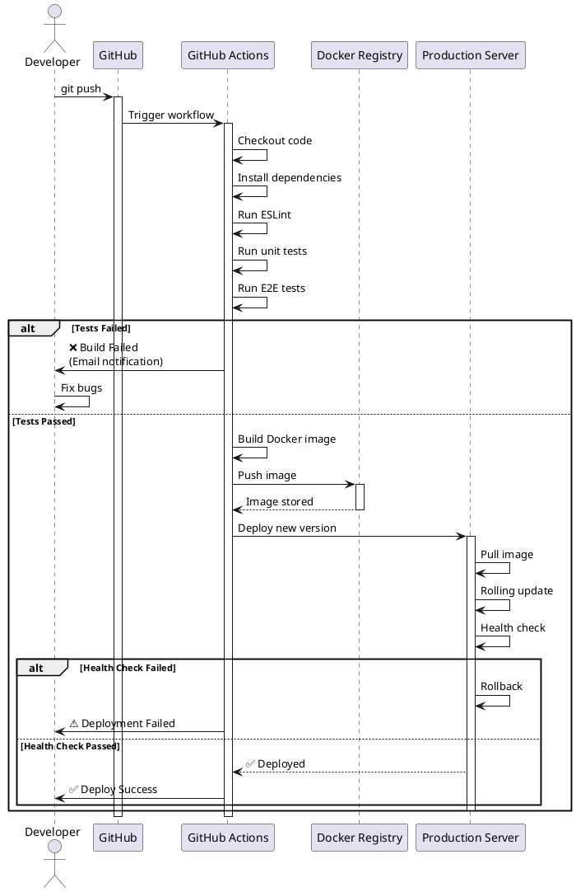

# CI/CD Pipelines

::card-group

::card{title="🎯 Мета лекції" icon="i-lucide-target"}

- Опанувати концепції Continuous Integration та Continuous Deployment для автоматизації delivery процесу.
- Навчитися створювати GitHub Actions workflows для автоматичного тестування, побудови та розгортання NestJS застосунків.
- Освоїти налаштування pipeline stages: lint, unit tests, E2E tests, Docker build, deployment.
- Зрозуміти стратегії deployment: Blue-Green, Rolling Updates, Canary Releases для zero-downtime deploys.
- Впровадити best practices для безпечного управління secrets та notifications при збоях.

::

::card{title="🔑 Ключові терміни" icon="i-lucide-key"}

- **CI (Continuous Integration):** практика автоматичного запуску тестів при кожному commit для раннього виявлення проблем.
- **CD (Continuous Deployment):** автоматичне розгортання застосунку у production після успішного проходження всіх тестів.
- **Pipeline:** послідовність автоматизованих етапів (stages) від commit до production deploy.
- **Workflow:** YAML файл, що описує CI/CD процес у GitHub Actions.
- **Artifact:** результат побудови (Docker image, compiled code), що зберігається для наступних stages або deployment.

::

::

---

## Короткий зміст

У цій лекції вивчається автоматизація процесів testing, building та deployment через CI/CD:

- **Концепція CI/CD** — Continuous Integration: автоматичний запуск тестів при кожному commit, early detection проблем; Continuous Deployment: автоматичний deploy після успішних тестів, швидкий delivery features
- **GitHub Actions** — CI/CD платформа інтегрована у GitHub, workflow files у `.github/workflows/`, тригери: push, pull_request, schedule, manual dispatch
- **Workflow синтаксис YAML** — структура: name, on (triggers), jobs (stages), steps (commands), використання actions з marketplace, environment variables та secrets
- **Pipeline stages** — типовий flow: 1) Checkout code, 2) Setup Node.js, 3) Install dependencies, 4) Lint code (ESLint), 5) Run unit tests, 6) Run E2E tests, 7) Build production, 8) Deploy, кожен stage може блокувати наступний при failure
- **Running tests у CI** — setup test database через Docker services, environment variables для test config, parallel test execution через matrix strategy (Node 18/20), artifacts для test reports та coverage
- **Docker build та push** — build Docker image у CI, login до Docker registry (Docker Hub, GitHub Container Registry, AWS ECR), tagging з version/commit SHA, push до registry для deployment
- **Deployment strategies** — Blue-Green deployment: два identичні environments, switch traffic; Rolling updates: поступова заміна instances; Canary releases: поступовий rollout до частини users
- **Environment secrets** — зберігання sensitive data у GitHub Secrets, доступ через `${{ secrets.DATABASE_URL }}`, різні secrets для staging/production environments
- **Notifications** — Slack/Discord/Email notifications при failed builds, integration з issue tracking для auto-creating bugs

Розглядаються практичні приклади: GitHub Actions workflow для NestJS (lint → test → build → deploy), setup PostgreSQL service для E2E тестів, deploy до AWS/DigitalOcean, rollback strategies.

---

## Проблема ручного deployment

На попередніх лекціях ми розробили NestJS застосунок, покрили його тестами, контейнеризували через Docker. Проте **процес від commit до production** залишається ручним:

```bash
# Типовий ручний workflow
git add .
git commit -m "feat: add user profile endpoint"
git push origin main

# SSH на production сервер
ssh user@prod-server

# Pull останніх змін
cd /app
git pull origin main

# Встановлення залежностей (якщо package.json змінився)
npm install

# Запуск тестів (вручну перевіряємо, що нічого не зламалося)
npm run test

# Компіляція
npm run build

# Перезапуск застосунку
pm2 restart app

# Перевірка логів
pm2 logs app
```

**Проблеми ручного підходу:**

1. **Людські помилки:** розробник забув запустити тести перед push → баг потрапив у production.
2. **Втрата часу:** кожен deploy займає 10-15 хвилин ручної роботи → розробники уникають частих deploys.
3. **Inconsistency:** різні розробники виконують deploy по-різному → непередбачувані результати.
4. **Відсутність rollback:** якщо новий deploy зламав production, повернення до попередньої версії — ще 15 хвилин ручної роботи.
5. **Блокування розробників:** тільки senior розробники мають SSH доступ до production → bottleneck.

**Рішення — CI/CD автоматизація.** При кожному commit у main гілку автоматично:

1. Запускаються **всі тести** (unit, integration, E2E).
2. Виконується **linting** та **type checking**.
3. Будується **Docker image**.
4. Image **публікується** у Docker registry.
5. Застосунок **автоматично деплоїться** на production сервер.
6. У разі проблем — **automatic rollback** до попередньої версії.

Весь процес займає **3-5 хвилин** без участі розробника.

::plant-uml{alt="CI/CD Pipeline Flow"}



::

---

## Концепція CI/CD

### Continuous Integration (CI)

**Continuous Integration** — практика, при якій розробники **часто інтегрують** код у спільний репозиторій (кілька разів на день), а **автоматичні тести** перевіряють кожну інтеграцію.

**Основні принципи CI:**

1. **Maintain a Single Source Repository** — один Git репозиторій як single source of truth.
2. **Automate the Build** — автоматична компіляція при кожному commit.
3. **Make Your Build Self-Testing** — тести запускаються автоматично як частина build процесу.
4. **Everyone Commits to Mainline Every Day** — розробники комітять у main гілку щодня, уникаючи довгоживучих feature branches.
5. **Every Commit Should Build Mainline on an Integration Machine** — кожен commit тригерить build на CI сервері (не лише локально).
6. **Fix Broken Builds Immediately** — якщо build падає, це **highest priority** — фіксити одразу.

**Переваги CI:**

- **Early Bug Detection:** баги виявляються через години після commit, а не через тижні.
- **Reduce Integration Risk:** постійна інтеграція замість "big bang merge" раз на тиждень.
- **Better Code Quality:** automated linting та tests забезпечують дотримання стандартів.
- **Faster Development:** розробники отримують швидкий feedback про проблеми.

### Continuous Deployment (CD)

**Continuous Deployment** — автоматичне розгортання кожного успішного build у production без ручного втручання.

**Відрізнити від Continuous Delivery:**

- **Continuous Delivery:** автоматична підготовка до deploy, але **фінальний deploy — ручний** (натискання кнопки).
- **Continuous Deployment:** **повністю автоматичний** deploy у production після успішних тестів.

**Переваги CD:**

- **Faster Time to Market:** features потрапляють до користувачів через хвилини після merge, а не через дні/тижні.
- **Reduced Risk:** маленькі, часті deploys легше відкотити у разі проблем, ніж великі release.
- **Immediate Feedback:** користувачі одразу бачать нові features → швидкий feedback loop.
- **Less Manual Work:** розробники фокусуються на коді, а не на deployment процесі.

**Вимоги для CD:**

1. **Comprehensive Test Suite** — висока test coverage (80%+) для впевненості, що зміни не зламають production.
2. **Fast Tests** — тести мають виконуватися за 5-10 хвилин, інакше блокується delivery.
3. **Automated Rollback** — здатність автоматично відкотити deploy при виявленні проблем.
4. **Monitoring and Alerts** — моніторинг production для швидкого виявлення проблем після deploy.

---

## GitHub Actions — вступ

**GitHub Actions** — вбудована CI/CD платформа у GitHub, що дозволяє автоматизувати workflows безпосередньо у репозиторії.

### Переваги GitHub Actions

1. **Native GitHub Integration** — не потрібно налаштовувати зовнішні сервіси (Jenkins, CircleCI).
2. **Free for Public Repos** — необмежені build хвилини для open-source проєктів.
3. **Generous Free Tier** — 2000 хвилин/місяць для private repos.
4. **Matrix Builds** — тестування на кількох версіях Node.js / ОС паралельно.
5. **Marketplace** — тисячі готових actions для типових завдань (Docker build, AWS deploy).
6. **Secrets Management** — безпечне зберігання API keys, passwords.

### Структура GitHub Actions

**Workflow** — YAML файл у `.github/workflows/` директорії, що описує автоматизований процес.

**Job** — група пов'язаних steps, що виконуються на одному runner (віртуальній машині).

**Step** — окрема команда або action (наприклад, "checkout code", "run tests").

**Runner** — віртуальна машина (Ubuntu, macOS, Windows), де виконується job.

**Action** — повторно використовуваний блок коду (з Marketplace або custom).

**Основна структура:**

```yaml
name: CI/CD Pipeline  # Назва workflow

on:  # Тригери
  push:
    branches: [main]
  pull_request:
    branches: [main]

jobs:  # Jobs для виконання
  test:
    runs-on: ubuntu-latest  # Runner
    steps:  # Steps у job
      - name: Checkout code
        uses: actions/checkout@v3
      
      - name: Setup Node.js
        uses: actions/setup-node@v3
        with:
          node-version: 18
      
      - name: Install dependencies
        run: npm ci
      
      - name: Run tests
        run: npm test
```

### Тригери (on)

**`push`** — тригер при push у певні гілки:

```yaml
on:
  push:
    branches:
      - main
      - develop
    paths-ignore:
      - '**.md'  # Ігнорувати зміни у markdown файлах
```

**`pull_request`** — тригер при створенні або оновленні PR:

```yaml
on:
  pull_request:
    branches: [main]
    types: [opened, synchronize, reopened]
```

**`schedule`** — запуск за розкладом (cron syntax):

```yaml
on:
  schedule:
    - cron: '0 2 * * *'  # Кожного дня о 2:00 UTC
```

**`workflow_dispatch`** — ручний запуск через GitHub UI:

```yaml
on:
  workflow_dispatch:
    inputs:
      environment:
        description: 'Environment to deploy'
        required: true
        default: 'staging'
```

**Комбінація тригерів:**

```yaml
on:
  push:
    branches: [main]
  pull_request:
    branches: [main]
  schedule:
    - cron: '0 2 * * *'
  workflow_dispatch:
```


---

## Базовий CI Workflow для NestJS

Створимо простий CI workflow для автоматичного тестування NestJS застосунку:

```yaml
# .github/workflows/ci.yml
name: CI

on:
  push:
    branches: [main, develop]
  pull_request:
    branches: [main]

jobs:
  lint:
    name: Lint Code
    runs-on: ubuntu-latest

    steps:
      - name: Checkout code
        uses: actions/checkout@v3

      - name: Setup Node.js
        uses: actions/setup-node@v3
        with:
          node-version: 18
          cache: 'npm'

      - name: Install dependencies
        run: npm ci

      - name: Run ESLint
        run: npm run lint

      - name: Check TypeScript types
        run: npm run build

  test:
    name: Run Tests
    runs-on: ubuntu-latest
    needs: lint  # Запускається після успішного lint

    strategy:
      matrix:
        node-version: [18, 20]  # Тестуємо на Node 18 та 20

    steps:
      - name: Checkout code
        uses: actions/checkout@v3

      - name: Setup Node.js ${{ matrix.node-version }}
        uses: actions/setup-node@v3
        with:
          node-version: ${{ matrix.node-version }}
          cache: 'npm'

      - name: Install dependencies
        run: npm ci

      - name: Run unit tests
        run: npm run test:cov

      - name: Upload coverage to Codecov
        uses: codecov/codecov-action@v3
        with:
          files: ./coverage/lcov.info
          flags: unittests
          name: codecov-umbrella

  e2e:
    name: E2E Tests
    runs-on: ubuntu-latest
    needs: lint

    services:
      postgres:
        image: postgres:15
        env:
          POSTGRES_USER: postgres
          POSTGRES_PASSWORD: postgres
          POSTGRES_DB: test_db
        options: >-
          --health-cmd pg_isready
          --health-interval 10s
          --health-timeout 5s
          --health-retries 5
        ports:
          - 5432:5432

      redis:
        image: redis:7
        options: >-
          --health-cmd "redis-cli ping"
          --health-interval 10s
          --health-timeout 5s
          --health-retries 5
        ports:
          - 6379:6379

    steps:
      - name: Checkout code
        uses: actions/checkout@v3

      - name: Setup Node.js
        uses: actions/setup-node@v3
        with:
          node-version: 18
          cache: 'npm'

      - name: Install dependencies
        run: npm ci

      - name: Run E2E tests
        run: npm run test:e2e
        env:
          DATABASE_HOST: localhost
          DATABASE_PORT: 5432
          DATABASE_USER: postgres
          DATABASE_PASSWORD: postgres
          DATABASE_NAME: test_db
          REDIS_HOST: localhost
          REDIS_PORT: 6379

      - name: Upload E2E test results
        if: always()
        uses: actions/upload-artifact@v3
        with:
          name: e2e-test-results
          path: test-results/
```

### Пояснення ключових елементів

**`needs: lint`** — job `test` чекає успішного завершення `lint`:

```yaml
test:
  needs: lint  # Якщо lint падає, test не запускається
```

**`strategy.matrix`** — паралельне виконання на різних версіях:

```yaml
strategy:
  matrix:
    node-version: [18, 20]
    os: [ubuntu-latest, windows-latest]  # Опціонально: різні ОС
```

Створює **4 jobs** (Node 18/Ubuntu, Node 20/Ubuntu, Node 18/Windows, Node 20/Windows).

**`services`** — Docker контейнери для PostgreSQL та Redis:

```yaml
services:
  postgres:
    image: postgres:15
    env:
      POSTGRES_PASSWORD: postgres
    options: >-
      --health-cmd pg_isready
      --health-interval 10s
    ports:
      - 5432:5432
```

**`cache: 'npm'`** — кешування node_modules для прискорення:

```yaml
- uses: actions/setup-node@v3
  with:
    cache: 'npm'  # Кешує npm dependencies
```

**`if: always()`** — виконати step навіть якщо попередні failed:

```yaml
- name: Upload test results
  if: always()  # Завантажити результати навіть якщо тести провалилися
```

**`uses: actions/upload-artifact@v3`** — збереження артефактів (test reports, coverage):

```yaml
- uses: actions/upload-artifact@v3
  with:
    name: coverage-report
    path: coverage/
```

::terminal-preview{title="GitHub Actions — Build Success" :cursor="false"}

<div class="line"><span class="text-emerald-400">✓</span> <strong>Lint Code</strong> completed in 1m 23s</div>
<div class="line">  <span class="text-sky-400">→</span> Checkout code</div>
<div class="line">  <span class="text-sky-400">→</span> Setup Node.js 18</div>
<div class="line">  <span class="text-sky-400">→</span> Install dependencies (cached)</div>
<div class="line">  <span class="text-sky-400">→</span> Run ESLint — <span class="text-emerald-400">✓ No errors found</span></div>
<div class="line"></div>
<div class="line"><span class="text-emerald-400">✓</span> <strong>Run Tests (Node 18)</strong> completed in 2m 45s</div>
<div class="line">  <span class="text-sky-400">→</span> Run unit tests — <span class="text-emerald-400">✓ 156 tests passed</span></div>
<div class="line">  <span class="text-sky-400">→</span> Coverage: 87.3%</div>
<div class="line"></div>
<div class="line"><span class="text-emerald-400">✓</span> <strong>Run Tests (Node 20)</strong> completed in 2m 38s</div>
<div class="line">  <span class="text-sky-400">→</span> Run unit tests — <span class="text-emerald-400">✓ 156 tests passed</span></div>
<div class="line"></div>
<div class="line"><span class="text-emerald-400">✓</span> <strong>E2E Tests</strong> completed in 3m 12s</div>
<div class="line">  <span class="text-sky-400">→</span> Setup PostgreSQL service</div>
<div class="line">  <span class="text-sky-400">→</span> Run E2E tests — <span class="text-emerald-400">✓ 42 tests passed</span></div>
<div class="line"></div>
<div class="line"><span class="text-emerald-400 font-bold">✓ All checks passed!</span></div>

::

---

## Docker Build та Push до Registry

Після успішних тестів побудуємо Docker image та опублікуємо у registry:

```yaml
# .github/workflows/ci-cd.yml
name: CI/CD

on:
  push:
    branches: [main]

jobs:
  # ... lint, test, e2e jobs (як у попередньому прикладі)

  build:
    name: Build and Push Docker Image
    runs-on: ubuntu-latest
    needs: [test, e2e]  # Чекає успішного test та e2e

    steps:
      - name: Checkout code
        uses: actions/checkout@v3

      - name: Set up Docker Buildx
        uses: docker/setup-buildx-action@v2

      - name: Log in to Docker Hub
        uses: docker/login-action@v2
        with:
          username: ${{ secrets.DOCKER_USERNAME }}
          password: ${{ secrets.DOCKER_PASSWORD }}

      - name: Extract metadata
        id: meta
        uses: docker/metadata-action@v4
        with:
          images: myusername/my-nestjs-app
          tags: |
            type=ref,event=branch
            type=sha,prefix={{branch}}-
            type=semver,pattern={{version}}

      - name: Build and push
        uses: docker/build-push-action@v4
        with:
          context: .
          file: ./Dockerfile
          push: true
          tags: ${{ steps.meta.outputs.tags }}
          labels: ${{ steps.meta.outputs.labels }}
          cache-from: type=registry,ref=myusername/my-nestjs-app:latest
          cache-to: type=inline

      - name: Image digest
        run: echo ${{ steps.build.outputs.digest }}
```

### Налаштування Docker Registry Secrets

**1. Docker Hub:**

У GitHub репозиторії: **Settings → Secrets and variables → Actions → New repository secret**

Додайте:
- `DOCKER_USERNAME` — ваш Docker Hub username
- `DOCKER_PASSWORD` — Docker Hub access token (не пароль!)

Створення Docker Hub access token:
1. Увійдіть на [hub.docker.com](https://hub.docker.com)
2. Account Settings → Security → New Access Token
3. Скопіюйте token та додайте до GitHub Secrets

**2. GitHub Container Registry (ghcr.io):**

```yaml
- name: Log in to GitHub Container Registry
  uses: docker/login-action@v2
  with:
    registry: ghcr.io
    username: ${{ github.actor }}
    password: ${{ secrets.GITHUB_TOKEN }}  # Автоматично доступний
```

**3. AWS ECR:**

```yaml
- name: Configure AWS credentials
  uses: aws-actions/configure-aws-credentials@v2
  with:
    aws-access-key-id: ${{ secrets.AWS_ACCESS_KEY_ID }}
    aws-secret-access-key: ${{ secrets.AWS_SECRET_ACCESS_KEY }}
    aws-region: us-east-1

- name: Log in to Amazon ECR
  id: login-ecr
  uses: aws-actions/amazon-ecr-login@v1

- name: Build and push to ECR
  env:
    ECR_REGISTRY: ${{ steps.login-ecr.outputs.registry }}
    ECR_REPOSITORY: my-nestjs-app
    IMAGE_TAG: ${{ github.sha }}
  run: |
    docker build -t $ECR_REGISTRY/$ECR_REPOSITORY:$IMAGE_TAG .
    docker push $ECR_REGISTRY/$ECR_REPOSITORY:$IMAGE_TAG
```

### Tagging стратегії

**Semantic Versioning:**

```yaml
tags: |
  type=semver,pattern={{version}}      # 1.2.3
  type=semver,pattern={{major}}.{{minor}}  # 1.2
  type=semver,pattern={{major}}        # 1
```

**Git SHA:**

```yaml
tags: |
  type=sha,prefix={{branch}}-  # main-abc123d
```

**Branch name:**

```yaml
tags: |
  type=ref,event=branch  # main, develop
```

**Latest tag для main:**

```yaml
tags: |
  type=raw,value=latest,enable={{is_default_branch}}
```

**Комбінована стратегія:**

```yaml
tags: |
  type=ref,event=branch
  type=sha,prefix={{branch}}-
  type=raw,value=latest,enable={{is_default_branch}}
```

Результат для commit `abc123d` у main:
- `myusername/my-app:main`
- `myusername/my-app:main-abc123d`
- `myusername/my-app:latest`

---

## Deployment на Production

Після побудови Docker image автоматично деплоїмо на production сервер:

### Deployment через SSH

```yaml
deploy:
  name: Deploy to Production
  runs-on: ubuntu-latest
  needs: build
  if: github.ref == 'refs/heads/main'  # Лише для main гілки

  steps:
    - name: Deploy to server via SSH
      uses: appleboy/ssh-action@v0.1.10
      with:
        host: ${{ secrets.PROD_SERVER_HOST }}
        username: ${{ secrets.PROD_SERVER_USER }}
        key: ${{ secrets.PROD_SERVER_SSH_KEY }}
        script: |
          cd /app
          docker-compose pull
          docker-compose up -d
          docker system prune -af

    - name: Wait for health check
      run: |
        sleep 10
        curl -f http://${{ secrets.PROD_SERVER_HOST }}/health || exit 1

    - name: Notify Slack on success
      if: success()
      uses: slackapi/slack-github-action@v1.24.0
      with:
        webhook-url: ${{ secrets.SLACK_WEBHOOK_URL }}
        payload: |
          {
            "text": "✅ Deployment to production succeeded!",
            "attachments": [{
              "color": "good",
              "fields": [
                { "title": "Commit", "value": "${{ github.sha }}", "short": true },
                { "title": "Author", "value": "${{ github.actor }}", "short": true }
              ]
            }]
          }

    - name: Notify Slack on failure
      if: failure()
      uses: slackapi/slack-github-action@v1.24.0
      with:
        webhook-url: ${{ secrets.SLACK_WEBHOOK_URL }}
        payload: |
          {
            "text": "❌ Deployment to production failed!",
            "attachments": [{
              "color": "danger",
              "fields": [
                { "title": "Commit", "value": "${{ github.sha }}", "short": true },
                { "title": "Author", "value": "${{ github.actor }}", "short": true },
                { "title": "Logs", "value": "${{ github.server_url }}/${{ github.repository }}/actions/runs/${{ github.run_id }}", "short": false }
              ]
            }]
          }
```

### Налаштування SSH ключа

**Генерація SSH ключа:**

```bash
ssh-keygen -t ed25519 -C "github-actions" -f github-actions-key
```

**Додавання public key на сервер:**

```bash
# На production сервері
cat github-actions-key.pub >> ~/.ssh/authorized_keys
```

**Додавання private key до GitHub Secrets:**

1. Скопіюйте вміст `github-actions-key` (private key)
2. GitHub repo → Settings → Secrets → New secret
3. Name: `PROD_SERVER_SSH_KEY`
4. Value: вставте private key

**Додайте інші secrets:**
- `PROD_SERVER_HOST` — IP або domain production сервера
- `PROD_SERVER_USER` — SSH username (наприклад, `ubuntu`, `deploy`)

::warning
**Security:** Ніколи не комітьте SSH ключі у Git! Використовуйте лише GitHub Secrets для зберігання credentials.
::

### Deployment на AWS ECS

```yaml
deploy-ecs:
  name: Deploy to AWS ECS
  runs-on: ubuntu-latest
  needs: build

  steps:
    - name: Configure AWS credentials
      uses: aws-actions/configure-aws-credentials@v2
      with:
        aws-access-key-id: ${{ secrets.AWS_ACCESS_KEY_ID }}
        aws-secret-access-key: ${{ secrets.AWS_SECRET_ACCESS_KEY }}
        aws-region: us-east-1

    - name: Download task definition
      run: |
        aws ecs describe-task-definition \
          --task-definition my-app-task \
          --query taskDefinition > task-definition.json

    - name: Fill in new image ID in task definition
      id: task-def
      uses: aws-actions/amazon-ecs-render-task-definition@v1
      with:
        task-definition: task-definition.json
        container-name: my-app
        image: ${{ secrets.ECR_REGISTRY }}/my-app:${{ github.sha }}

    - name: Deploy to ECS service
      uses: aws-actions/amazon-ecs-deploy-task-definition@v1
      with:
        task-definition: ${{ steps.task-def.outputs.task-definition }}
        service: my-app-service
        cluster: production-cluster
        wait-for-service-stability: true
```


---

## Deployment Strategies

Розглянемо різні стратегії deployment для мінімізації downtime та ризику.

### 1. Blue-Green Deployment

**Концепція:** Два identичні production environments (Blue — поточний, Green — новий). Traffic перемикається з Blue на Green після успішного deploy.

```yaml
# .github/workflows/blue-green-deploy.yml
name: Blue-Green Deployment

on:
  push:
    branches: [main]

jobs:
  deploy:
    runs-on: ubuntu-latest

    steps:
      - name: Deploy to Green environment
        uses: appleboy/ssh-action@v0.1.10
        with:
          host: ${{ secrets.GREEN_SERVER_HOST }}
          username: ${{ secrets.SERVER_USER }}
          key: ${{ secrets.SSH_KEY }}
          script: |
            cd /app
            docker-compose pull
            docker-compose up -d

      - name: Health check Green environment
        run: |
          for i in {1..30}; do
            if curl -f http://${{ secrets.GREEN_SERVER_HOST }}/health; then
              echo "Green environment healthy"
              exit 0
            fi
            echo "Waiting for Green environment... ($i/30)"
            sleep 10
          done
          echo "Green environment health check failed"
          exit 1

      - name: Switch traffic to Green (update Load Balancer)
        run: |
          # AWS ALB приклад
          aws elbv2 modify-target-group \
            --target-group-arn ${{ secrets.TARGET_GROUP_ARN }} \
            --health-check-path /health
          
          # Перемикання traffic з Blue на Green
          aws elbv2 register-targets \
            --target-group-arn ${{ secrets.TARGET_GROUP_ARN }} \
            --targets Id=${{ secrets.GREEN_INSTANCE_ID }}
          
          aws elbv2 deregister-targets \
            --target-group-arn ${{ secrets.TARGET_GROUP_ARN }} \
            --targets Id=${{ secrets.BLUE_INSTANCE_ID }}

      - name: Monitor Green environment
        run: |
          sleep 60
          # Перевірка error rate, response time
          if [ $(check_error_rate) -gt 1 ]; then
            echo "High error rate detected, rolling back"
            exit 1
          fi

      - name: Rollback to Blue on failure
        if: failure()
        run: |
          aws elbv2 register-targets \
            --target-group-arn ${{ secrets.TARGET_GROUP_ARN }} \
            --targets Id=${{ secrets.BLUE_INSTANCE_ID }}
          
          aws elbv2 deregister-targets \
            --target-group-arn ${{ secrets.TARGET_GROUP_ARN }} \
            --targets Id=${{ secrets.GREEN_INSTANCE_ID }}
```

**Переваги:**
- **Zero downtime** — миттєве перемикання traffic.
- **Easy rollback** — перемикання назад на Blue за секунди.
- **Testing in production-like environment** — Green environment ідентичний до production.

**Недоліки:**
- **Resource cost** — потрібно підтримувати 2 повноцінних environments.
- **Database migrations** — складність при backward-incompatible змінах схеми БД.

### 2. Rolling Update

**Концепція:** Поступова заміна instances застосунку одна за одною.

```yaml
deploy-rolling:
  name: Rolling Update
  runs-on: ubuntu-latest

  steps:
    - name: Get list of instances
      id: instances
      run: |
        INSTANCES=$(aws ec2 describe-instances \
          --filters "Name=tag:Environment,Values=production" \
          --query "Reservations[*].Instances[*].InstanceId" \
          --output text)
        echo "instances=$INSTANCES" >> $GITHUB_OUTPUT

    - name: Rolling update
      run: |
        for instance in ${{ steps.instances.outputs.instances }}; do
          echo "Updating instance: $instance"
          
          # 1. Deregister from load balancer
          aws elbv2 deregister-targets \
            --target-group-arn ${{ secrets.TARGET_GROUP_ARN }} \
            --targets Id=$instance
          
          # 2. Wait for connection draining (30s)
          sleep 30
          
          # 3. Update instance
          ssh user@$instance "cd /app && docker-compose pull && docker-compose up -d"
          
          # 4. Health check
          sleep 10
          if ! ssh user@$instance "curl -f http://localhost:3000/health"; then
            echo "Health check failed, aborting"
            exit 1
          fi
          
          # 5. Register back to load balancer
          aws elbv2 register-targets \
            --target-group-arn ${{ secrets.TARGET_GROUP_ARN }} \
            --targets Id=$instance
          
          # 6. Wait for health check in load balancer
          sleep 20
          
          echo "Instance $instance updated successfully"
        done
```

**Переваги:**
- **Zero downtime** — завжди є працюючі instances.
- **No extra infrastructure** — використовуємо існуючі instances.
- **Gradual rollout** — проблеми виявляються на першій instance, інші не оновлюються.

**Недоліки:**
- **Slower deployment** — update по одній instance займає час.
- **Mixed versions** — під час deploy одночасно працюють стара та нова версії.

### 3. Canary Release

**Концепція:** Нова версія розгортається лише для **малої частини користувачів** (5-10%), решта працюють зі старою версією. Якщо метрики canary group нормальні — rollout на всіх користувачів.

```yaml
deploy-canary:
  name: Canary Release
  runs-on: ubuntu-latest

  steps:
    - name: Deploy to canary instance
      uses: appleboy/ssh-action@v0.1.10
      with:
        host: ${{ secrets.CANARY_SERVER_HOST }}
        username: ${{ secrets.SERVER_USER }}
        key: ${{ secrets.SSH_KEY }}
        script: |
          cd /app
          docker-compose pull
          docker-compose up -d

    - name: Configure load balancer (10% traffic to canary)
      run: |
        # AWS ALB weighted routing
        aws elbv2 modify-rule \
          --rule-arn ${{ secrets.CANARY_RULE_ARN }} \
          --actions Type=forward,ForwardConfig='{
            "TargetGroups":[
              {"TargetGroupArn":"${{ secrets.STABLE_TARGET_GROUP }}","Weight":90},
              {"TargetGroupArn":"${{ secrets.CANARY_TARGET_GROUP }}","Weight":10}
            ]
          }'

    - name: Monitor canary metrics (30 min)
      run: |
        for i in {1..30}; do
          ERROR_RATE=$(check_error_rate_canary)
          LATENCY=$(check_latency_canary)
          
          if [ $ERROR_RATE -gt 5 ]; then
            echo "Canary error rate too high: $ERROR_RATE%"
            exit 1
          fi
          
          if [ $LATENCY -gt 500 ]; then
            echo "Canary latency too high: ${LATENCY}ms"
            exit 1
          fi
          
          echo "Canary metrics OK ($i/30)"
          sleep 60
        done

    - name: Promote canary to stable (100% traffic)
      if: success()
      run: |
        # Deploy to all stable instances
        for instance in $STABLE_INSTANCES; do
          ssh user@$instance "cd /app && docker-compose pull && docker-compose up -d"
        done
        
        # Switch 100% traffic to stable
        aws elbv2 modify-rule \
          --rule-arn ${{ secrets.CANARY_RULE_ARN }} \
          --actions Type=forward,TargetGroupArn=${{ secrets.STABLE_TARGET_GROUP }}

    - name: Rollback canary on failure
      if: failure()
      run: |
        # Switch 100% traffic to stable (remove canary)
        aws elbv2 modify-rule \
          --rule-arn ${{ secrets.CANARY_RULE_ARN }} \
          --actions Type=forward,TargetGroupArn=${{ secrets.STABLE_TARGET_GROUP }}
        
        # Rollback canary instance
        ssh user@${{ secrets.CANARY_SERVER_HOST }} \
          "cd /app && docker-compose down && docker-compose up -d"
```

**Переваги:**
- **Minimized risk** — проблеми впливають лише на 10% користувачів.
- **Real production testing** — перевірка на реальному трафіку перед повним rollout.
- **Automated rollback** — при виявленні проблем canary автоматично відключається.

**Недоліки:**
- **Complex setup** — потрібна складна інфраструктура (weighted routing, metrics monitoring).
- **Longer deployment** — від commit до 100% rollout може пройти години.

---

## Environment-specific Workflows

Створення окремих workflows для різних environments:

### Staging Deployment

```yaml
# .github/workflows/deploy-staging.yml
name: Deploy to Staging

on:
  push:
    branches: [develop]

jobs:
  deploy-staging:
    runs-on: ubuntu-latest
    environment:
      name: staging
      url: https://staging.example.com

    steps:
      - name: Checkout code
        uses: actions/checkout@v3

      - name: Build and push Docker image
        uses: docker/build-push-action@v4
        with:
          push: true
          tags: myusername/my-app:staging-${{ github.sha }}

      - name: Deploy to staging
        uses: appleboy/ssh-action@v0.1.10
        with:
          host: ${{ secrets.STAGING_SERVER_HOST }}
          username: ${{ secrets.STAGING_SERVER_USER }}
          key: ${{ secrets.STAGING_SSH_KEY }}
          script: |
            cd /app
            export IMAGE_TAG=staging-${{ github.sha }}
            docker-compose pull
            docker-compose up -d

      - name: Run smoke tests
        run: |
          sleep 10
          curl -f https://staging.example.com/health
          curl -f https://staging.example.com/api/docs  # Swagger доступний на staging
```

### Production Deployment з Manual Approval

```yaml
# .github/workflows/deploy-production.yml
name: Deploy to Production

on:
  workflow_dispatch:  # Ручний запуск
    inputs:
      version:
        description: 'Version to deploy'
        required: true
        default: 'latest'

jobs:
  deploy-production:
    runs-on: ubuntu-latest
    environment:
      name: production
      url: https://example.com

    steps:
      - name: Checkout code
        uses: actions/checkout@v3

      - name: Deploy to production
        uses: appleboy/ssh-action@v0.1.10
        with:
          host: ${{ secrets.PROD_SERVER_HOST }}
          username: ${{ secrets.PROD_SERVER_USER }}
          key: ${{ secrets.PROD_SSH_KEY }}
          script: |
            cd /app
            export IMAGE_TAG=${{ github.event.inputs.version }}
            docker-compose pull
            docker-compose up -d

      - name: Health check
        run: |
          for i in {1..10}; do
            if curl -f https://example.com/health; then
              echo "Production healthy"
              exit 0
            fi
            sleep 5
          done
          exit 1

      - name: Create deployment tag
        run: |
          git tag -a "prod-${{ github.event.inputs.version }}" \
            -m "Production deployment: ${{ github.event.inputs.version }}"
          git push origin "prod-${{ github.event.inputs.version }}"
```

### GitHub Environments з Protection Rules

У GitHub репозиторії: **Settings → Environments → New environment**

Створіть `production` environment з правилами:

1. **Required reviewers** — deployment потребує approval від senior developers.
2. **Wait timer** — 5-хвилинна затримка перед deployment для можливості cancel.
3. **Deployment branches** — лише `main` гілка може деплоїтися у production.

Тепер при запуску production deployment workflow:

1. Workflow чекає на approval від reviewers.
2. Після approval чекає 5 хвилин (wait timer).
3. Виконує deployment.

::tip
**Manual approval** корисний для production deployments, щоб senior developer міг перевірити зміни перед deploy. Для staging використовуйте automatic deployment без approval.
::

---

## Secrets Management

### GitHub Secrets

GitHub Secrets дозволяють безпечно зберігати sensitive data (паролі, API keys) без комітів у Git.

**Типи secrets:**

1. **Repository secrets** — доступні лише у цьому репозиторії.
2. **Environment secrets** — специфічні для environment (staging, production).
3. **Organization secrets** — доступні у всіх repos організації.

**Додавання secrets:**

GitHub repo → **Settings → Secrets and variables → Actions → New repository secret**

**Типові secrets для NestJS проєкту:**

```
# Docker Registry
DOCKER_USERNAME
DOCKER_PASSWORD

# Deployment
PROD_SERVER_HOST
PROD_SERVER_USER
PROD_SSH_KEY

# Database (для E2E тестів у CI)
TEST_DATABASE_URL

# External Services
SLACK_WEBHOOK_URL
AWS_ACCESS_KEY_ID
AWS_SECRET_ACCESS_KEY

# Application
JWT_SECRET
SMTP_PASSWORD
STRIPE_SECRET_KEY
```

### Використання secrets у workflow

```yaml
steps:
  - name: Login to Docker Hub
    uses: docker/login-action@v2
    with:
      username: ${{ secrets.DOCKER_USERNAME }}
      password: ${{ secrets.DOCKER_PASSWORD }}

  - name: Run E2E tests
    env:
      DATABASE_URL: ${{ secrets.TEST_DATABASE_URL }}
      JWT_SECRET: ${{ secrets.JWT_SECRET }}
    run: npm run test:e2e

  - name: Deploy
    uses: appleboy/ssh-action@v0.1.10
    with:
      host: ${{ secrets.PROD_SERVER_HOST }}
      key: ${{ secrets.PROD_SSH_KEY }}
```

### Environment-specific Secrets

Створіть окремі environments у GitHub та додайте специфічні secrets:

**Staging environment:**
- `DATABASE_URL` → `postgres://staging-db.example.com/blog_staging`
- `API_URL` → `https://staging-api.example.com`

**Production environment:**
- `DATABASE_URL` → `postgres://prod-db.example.com/blog_prod`
- `API_URL` → `https://api.example.com`

У workflow вказуйте environment:

```yaml
jobs:
  deploy:
    runs-on: ubuntu-latest
    environment: production  # Використовує production secrets

    steps:
      - name: Deploy
        env:
          DATABASE_URL: ${{ secrets.DATABASE_URL }}  # production DATABASE_URL
```

::warning
**Ніколи не виводьте secrets у логи!** GitHub автоматично маскує secrets у logs, але уникайте `echo ${{ secrets.SECRET }}` або передачі secrets як arguments команд. Використовуйте environment variables:

```yaml
# ❌ ПОГАНА ПРАКТИКА
run: curl -H "Authorization: Bearer ${{ secrets.API_KEY }}" ...

# ✅ ХОРОША ПРАКТИКА
env:
  API_KEY: ${{ secrets.API_KEY }}
run: curl -H "Authorization: Bearer $API_KEY" ...
```
::


---

## Notifications та Monitoring

Налаштування notifications для інформування команди про статус deployments.

### Slack Notifications

```yaml
# .github/workflows/ci-cd.yml
jobs:
  deploy:
    runs-on: ubuntu-latest
    # ... deployment steps

  notify:
    name: Notify Team
    runs-on: ubuntu-latest
    needs: deploy
    if: always()  # Виконується навіть якщо deploy failed

    steps:
      - name: Notify Slack on Success
        if: needs.deploy.result == 'success'
        uses: slackapi/slack-github-action@v1.24.0
        with:
          webhook-url: ${{ secrets.SLACK_WEBHOOK_URL }}
          payload: |
            {
              "text": "✅ Deployment Successful",
              "blocks": [
                {
                  "type": "header",
                  "text": {
                    "type": "plain_text",
                    "text": "✅ Production Deployment Successful"
                  }
                },
                {
                  "type": "section",
                  "fields": [
                    {
                      "type": "mrkdwn",
                      "text": "*Repository:*\n${{ github.repository }}"
                    },
                    {
                      "type": "mrkdwn",
                      "text": "*Branch:*\n${{ github.ref_name }}"
                    },
                    {
                      "type": "mrkdwn",
                      "text": "*Commit:*\n<${{ github.event.head_commit.url }}|${{ github.sha }}>"
                    },
                    {
                      "type": "mrkdwn",
                      "text": "*Author:*\n${{ github.actor }}"
                    }
                  ]
                },
                {
                  "type": "section",
                  "text": {
                    "type": "mrkdwn",
                    "text": "*Commit Message:*\n${{ github.event.head_commit.message }}"
                  }
                },
                {
                  "type": "actions",
                  "elements": [
                    {
                      "type": "button",
                      "text": {
                        "type": "plain_text",
                        "text": "View Deployment"
                      },
                      "url": "https://example.com"
                    },
                    {
                      "type": "button",
                      "text": {
                        "type": "plain_text",
                        "text": "View Workflow"
                      },
                      "url": "${{ github.server_url }}/${{ github.repository }}/actions/runs/${{ github.run_id }}"
                    }
                  ]
                }
              ]
            }

      - name: Notify Slack on Failure
        if: needs.deploy.result == 'failure'
        uses: slackapi/slack-github-action@v1.24.0
        with:
          webhook-url: ${{ secrets.SLACK_WEBHOOK_URL }}
          payload: |
            {
              "text": "❌ Deployment Failed",
              "blocks": [
                {
                  "type": "header",
                  "text": {
                    "type": "plain_text",
                    "text": "❌ Production Deployment Failed"
                  }
                },
                {
                  "type": "section",
                  "fields": [
                    {
                      "type": "mrkdwn",
                      "text": "*Repository:*\n${{ github.repository }}"
                    },
                    {
                      "type": "mrkdwn",
                      "text": "*Branch:*\n${{ github.ref_name }}"
                    },
                    {
                      "type": "mrkdwn",
                      "text": "*Commit:*\n<${{ github.event.head_commit.url }}|${{ github.sha }}>"
                    },
                    {
                      "type": "mrkdwn",
                      "text": "*Author:*\n${{ github.actor }}"
                    }
                  ]
                },
                {
                  "type": "section",
                  "text": {
                    "type": "mrkdwn",
                    "text": "⚠️ *Action Required:* Check logs and fix the issue or rollback to previous version."
                  }
                },
                {
                  "type": "actions",
                  "elements": [
                    {
                      "type": "button",
                      "text": {
                        "type": "plain_text",
                        "text": "View Logs"
                      },
                      "url": "${{ github.server_url }}/${{ github.repository }}/actions/runs/${{ github.run_id }}",
                      "style": "danger"
                    }
                  ]
                }
              ]
            }
```

**Налаштування Slack Webhook:**

1. Створіть Slack App: https://api.slack.com/apps → Create New App
2. Enable Incoming Webhooks
3. Add New Webhook to Workspace → вибрати канал (наприклад, #deployments)
4. Скопіюйте Webhook URL
5. Додайте до GitHub Secrets як `SLACK_WEBHOOK_URL`

### Discord Notifications

```yaml
- name: Notify Discord
  uses: sarisia/actions-status-discord@v1
  if: always()
  with:
    webhook: ${{ secrets.DISCORD_WEBHOOK }}
    status: ${{ job.status }}
    title: "Deployment to Production"
    description: |
      Commit: ${{ github.sha }}
      Author: ${{ github.actor }}
      Message: ${{ github.event.head_commit.message }}
    color: 0x00ff00  # Green for success
    url: ${{ github.server_url }}/${{ github.repository }}/actions/runs/${{ github.run_id }}
```

### Email Notifications

GitHub автоматично надсилає email notifications для failed workflows, але можна налаштувати custom emails:

```yaml
- name: Send email on failure
  if: failure()
  uses: dawidd6/action-send-mail@v3
  with:
    server_address: smtp.gmail.com
    server_port: 587
    username: ${{ secrets.SMTP_USER }}
    password: ${{ secrets.SMTP_PASSWORD }}
    subject: "❌ Deployment Failed: ${{ github.repository }}"
    to: devops@example.com
    from: GitHub Actions <actions@example.com>
    body: |
      Deployment to production failed!
      
      Repository: ${{ github.repository }}
      Branch: ${{ github.ref_name }}
      Commit: ${{ github.sha }}
      Author: ${{ github.actor }}
      
      Logs: ${{ github.server_url }}/${{ github.repository }}/actions/runs/${{ github.run_id }}
```

### Integration з Issue Tracking

Автоматичне створення issue при failed deployment:

```yaml
- name: Create issue on deployment failure
  if: failure()
  uses: actions/github-script@v6
  with:
    script: |
      const issue = await github.rest.issues.create({
        owner: context.repo.owner,
        repo: context.repo.repo,
        title: `🔥 Production Deployment Failed - ${context.sha.substring(0, 7)}`,
        body: `
          ## Deployment Failure Details
          
          **Commit:** ${context.sha}
          **Author:** ${context.actor}
          **Branch:** ${context.ref}
          **Workflow:** [View Logs](${context.serverUrl}/${context.repo.owner}/${context.repo.repo}/actions/runs/${context.runId})
          
          **Commit Message:**
          \`\`\`
          ${context.payload.head_commit.message}
          \`\`\`
          
          ### Action Required
          - [ ] Investigate failure cause
          - [ ] Fix the issue
          - [ ] Verify fix in staging
          - [ ] Re-deploy or rollback
          
          cc @devops-team
        `,
        labels: ['bug', 'deployment', 'production', 'urgent'],
        assignees: ['tech-lead']
      });
      
      console.log(`Created issue #${issue.data.number}`);
```

---

## Rollback Strategies

Автоматичне або ручне повернення до попередньої версії при проблемах.

### Automatic Rollback на Failed Health Check

```yaml
deploy:
  name: Deploy with Auto-Rollback
  runs-on: ubuntu-latest

  steps:
    - name: Save current version for rollback
      id: current-version
      run: |
        CURRENT_TAG=$(ssh user@${{ secrets.PROD_SERVER_HOST }} \
          "cd /app && docker-compose config | grep 'image:' | awk '{print \$2}' | cut -d':' -f2")
        echo "tag=$CURRENT_TAG" >> $GITHUB_OUTPUT

    - name: Deploy new version
      run: |
        ssh user@${{ secrets.PROD_SERVER_HOST }} \
          "cd /app && export IMAGE_TAG=${{ github.sha }} && docker-compose pull && docker-compose up -d"

    - name: Health check with retry
      id: health-check
      run: |
        for i in {1..10}; do
          if curl -f https://example.com/health; then
            echo "Health check passed"
            exit 0
          fi
          echo "Health check failed, attempt $i/10"
          sleep 10
        done
        echo "Health check failed after 10 attempts"
        exit 1

    - name: Rollback on failure
      if: failure() && steps.health-check.outcome == 'failure'
      run: |
        echo "Rolling back to version: ${{ steps.current-version.outputs.tag }}"
        ssh user@${{ secrets.PROD_SERVER_HOST }} \
          "cd /app && export IMAGE_TAG=${{ steps.current-version.outputs.tag }} && docker-compose up -d"
        
        # Verify rollback
        sleep 10
        curl -f https://example.com/health || exit 1
        echo "Rollback completed successfully"

    - name: Notify on rollback
      if: failure() && steps.health-check.outcome == 'failure'
      uses: slackapi/slack-github-action@v1.24.0
      with:
        webhook-url: ${{ secrets.SLACK_WEBHOOK_URL }}
        payload: |
          {
            "text": "⚠️ Automatic rollback executed due to failed health check",
            "blocks": [
              {
                "type": "section",
                "text": {
                  "type": "mrkdwn",
                  "text": "*Rolled back to:* ${{ steps.current-version.outputs.tag }}"
                }
              }
            ]
          }
```

### Manual Rollback Workflow

```yaml
# .github/workflows/rollback.yml
name: Manual Rollback

on:
  workflow_dispatch:
    inputs:
      version:
        description: 'Version to rollback to (commit SHA or tag)'
        required: true
      environment:
        description: 'Environment'
        required: true
        type: choice
        options:
          - staging
          - production

jobs:
  rollback:
    name: Rollback to ${{ github.event.inputs.version }}
    runs-on: ubuntu-latest
    environment: ${{ github.event.inputs.environment }}

    steps:
      - name: Confirm rollback
        run: |
          echo "Rolling back ${{ github.event.inputs.environment }} to version ${{ github.event.inputs.version }}"
          echo "This action was initiated by: ${{ github.actor }}"

      - name: Deploy previous version
        uses: appleboy/ssh-action@v0.1.10
        with:
          host: ${{ secrets.SERVER_HOST }}
          username: ${{ secrets.SERVER_USER }}
          key: ${{ secrets.SSH_KEY }}
          script: |
            cd /app
            export IMAGE_TAG=${{ github.event.inputs.version }}
            docker-compose pull
            docker-compose up -d

      - name: Verify rollback
        run: |
          sleep 10
          for i in {1..5}; do
            if curl -f ${{ secrets.APP_URL }}/health; then
              echo "Rollback verified successfully"
              exit 0
            fi
            sleep 5
          done
          echo "Rollback verification failed"
          exit 1

      - name: Create rollback tag
        run: |
          git tag -a "rollback-${{ github.event.inputs.environment }}-$(date +%Y%m%d-%H%M%S)" \
            -m "Rollback ${{ github.event.inputs.environment }} to ${{ github.event.inputs.version }}"
          git push origin "rollback-${{ github.event.inputs.environment }}-$(date +%Y%m%d-%H%M%S)"

      - name: Notify team
        uses: slackapi/slack-github-action@v1.24.0
        with:
          webhook-url: ${{ secrets.SLACK_WEBHOOK_URL }}
          payload: |
            {
              "text": "🔄 Manual rollback executed",
              "blocks": [
                {
                  "type": "header",
                  "text": {
                    "type": "plain_text",
                    "text": "🔄 Manual Rollback Executed"
                  }
                },
                {
                  "type": "section",
                  "fields": [
                    {
                      "type": "mrkdwn",
                      "text": "*Environment:*\n${{ github.event.inputs.environment }}"
                    },
                    {
                      "type": "mrkdwn",
                      "text": "*Version:*\n${{ github.event.inputs.version }}"
                    },
                    {
                      "type": "mrkdwn",
                      "text": "*Initiated by:*\n${{ github.actor }}"
                    }
                  ]
                }
              ]
            }
```

Запуск ручного rollback:
1. GitHub repo → **Actions**
2. **Manual Rollback** workflow → **Run workflow**
3. Вказати version (commit SHA або tag) та environment
4. Клік **Run workflow**

---

## Performance Optimization

Оптимізація CI/CD pipelines для швидших builds.

### Caching Dependencies

```yaml
jobs:
  build:
    runs-on: ubuntu-latest

    steps:
      - uses: actions/checkout@v3

      - name: Setup Node.js with cache
        uses: actions/setup-node@v3
        with:
          node-version: 18
          cache: 'npm'  # Автоматичний cache node_modules

      - name: Install dependencies
        run: npm ci  # Швидше ніж npm install

      # Альтернатива — manual caching
      - name: Cache node_modules
        uses: actions/cache@v3
        with:
          path: node_modules
          key: ${{ runner.os }}-node-${{ hashFiles('**/package-lock.json') }}
          restore-keys: |
            ${{ runner.os }}-node-
```

### Docker Layer Caching

```yaml
- name: Set up Docker Buildx
  uses: docker/setup-buildx-action@v2

- name: Build and push with cache
  uses: docker/build-push-action@v4
  with:
    context: .
    push: true
    tags: myusername/my-app:latest
    cache-from: type=registry,ref=myusername/my-app:buildcache
    cache-to: type=registry,ref=myusername/my-app:buildcache,mode=max
```

### Parallel Jobs

```yaml
jobs:
  lint:
    runs-on: ubuntu-latest
    steps:
      - run: npm run lint

  unit-test:
    runs-on: ubuntu-latest
    steps:
      - run: npm run test

  e2e-test:
    runs-on: ubuntu-latest
    steps:
      - run: npm run test:e2e

  # lint, unit-test, e2e-test виконуються паралельно

  build:
    needs: [lint, unit-test, e2e-test]  # Чекає завершення всіх трьох
    runs-on: ubuntu-latest
    steps:
      - run: docker build -t my-app .
```

### Conditional Execution

```yaml
jobs:
  deploy:
    if: github.ref == 'refs/heads/main' && github.event_name == 'push'
    # Деплоїться лише при push у main

  test:
    if: github.event_name == 'pull_request'
    # Тести запускаються лише для PR
```

### Skip CI для певних commits

```bash
# Коміт без тригера CI
git commit -m "docs: update README [skip ci]"

# Або
git commit -m "docs: update README [ci skip]"
```

---

## Best Practices

### 1. Fail Fast

Організуйте jobs так, щоб швидкі перевірки (lint, type check) виконувалися першими:

```yaml
jobs:
  lint:          # 1-2 хвилини
    runs-on: ubuntu-latest
    steps:
      - run: npm run lint

  unit-test:     # 2-3 хвилини
    needs: lint
    steps:
      - run: npm test

  e2e-test:      # 5-10 хвилин
    needs: unit-test
    steps:
      - run: npm run test:e2e

  build:         # 3-5 хвилин
    needs: [unit-test, e2e-test]
    steps:
      - run: docker build
```

Якщо lint падає (1-2 хв), unit/e2e тести не запускаються → економія часу.

### 2. Keep Secrets Secure

```yaml
# ✅ ХОРОША ПРАКТИКА
env:
  DATABASE_URL: ${{ secrets.DATABASE_URL }}
run: npm run migration:run

# ❌ ПОГАНА ПРАКТИКА
run: npm run migration:run --url=${{ secrets.DATABASE_URL }}
```

### 3. Use Specific Action Versions

```yaml
# ✅ ХОРОША ПРАКТИКА: pinned version
- uses: actions/checkout@v3.5.2

# ❌ ПОГАНА ПРАКТИКА: floating version
- uses: actions/checkout@main
```

### 4. Limit Concurrent Deployments

```yaml
concurrency:
  group: production-deployment
  cancel-in-progress: false  # Не cancel поточний deploy
```

Це запобігає одночасним deploys, які можуть конфліктувати.

### 5. Add Timeouts

```yaml
jobs:
  test:
    runs-on: ubuntu-latest
    timeout-minutes: 10  # Автоматичний cancel після 10 хв

    steps:
      - name: Run tests
        timeout-minutes: 5  # Timeout для конкретного step
        run: npm test
```

### 6. Monitor Build Duration

Регулярно переглядайте metrics:

```bash
# GitHub repo → Insights → Actions
# Перевіряйте:
# - Average build time (мета: < 10 хв)
# - Success rate (мета: > 95%)
# - Queue time (мета: < 1 хв)
```

### 7. Keep Workflows DRY

Використовуйте reusable workflows для спільної логіки:

```yaml
# .github/workflows/reusable-test.yml
name: Reusable Test Workflow

on:
  workflow_call:
    inputs:
      node-version:
        required: true
        type: string

jobs:
  test:
    runs-on: ubuntu-latest
    steps:
      - uses: actions/checkout@v3
      - uses: actions/setup-node@v3
        with:
          node-version: ${{ inputs.node-version }}
      - run: npm ci
      - run: npm test
```

```yaml
# .github/workflows/ci.yml
name: CI

on: [push]

jobs:
  test-node-18:
    uses: ./.github/workflows/reusable-test.yml
    with:
      node-version: '18'

  test-node-20:
    uses: ./.github/workflows/reusable-test.yml
    with:
      node-version: '20'
```

### 8. Document Deployment Process

Створіть `DEPLOYMENT.md`:

```markdown
# Deployment Guide

## Automatic Deployment

Push to `main` branch triggers automatic deployment to production.

## Manual Deployment

1. Go to Actions → "Deploy to Production"
2. Click "Run workflow"
3. Select version/tag to deploy
4. Click "Run workflow"
5. Wait for approval from tech lead
6. Deployment executes after 5-minute wait timer

## Rollback

1. Go to Actions → "Manual Rollback"
2. Click "Run workflow"
3. Enter commit SHA or tag of stable version
4. Select environment (staging/production)
5. Click "Run workflow"

## Troubleshooting

If deployment fails:
1. Check workflow logs for errors
2. Verify health endpoint: `curl https://example.com/health`
3. Check application logs: `ssh prod-server "docker logs blog-app"`
4. If needed, execute manual rollback
```


---

## Повний приклад: Production-ready CI/CD Pipeline

Комплексний workflow для NestJS застосунку з усіма best practices:

```yaml
# .github/workflows/production-pipeline.yml
name: Production CI/CD Pipeline

on:
  push:
    branches: [main]
  pull_request:
    branches: [main]

env:
  NODE_VERSION: 18
  DOCKER_IMAGE: myusername/my-nestjs-app

jobs:
  # ============================================
  # Stage 1: Code Quality Checks
  # ============================================
  lint:
    name: Lint and Type Check
    runs-on: ubuntu-latest
    timeout-minutes: 5

    steps:
      - name: Checkout code
        uses: actions/checkout@v3

      - name: Setup Node.js
        uses: actions/setup-node@v3
        with:
          node-version: ${{ env.NODE_VERSION }}
          cache: 'npm'

      - name: Install dependencies
        run: npm ci

      - name: Run ESLint
        run: npm run lint

      - name: Run Prettier check
        run: npm run format:check

      - name: TypeScript type check
        run: npx tsc --noEmit

  # ============================================
  # Stage 2: Unit Tests
  # ============================================
  unit-test:
    name: Unit Tests
    runs-on: ubuntu-latest
    needs: lint
    timeout-minutes: 10

    strategy:
      matrix:
        node-version: [18, 20]

    steps:
      - uses: actions/checkout@v3

      - name: Setup Node.js ${{ matrix.node-version }}
        uses: actions/setup-node@v3
        with:
          node-version: ${{ matrix.node-version }}
          cache: 'npm'

      - name: Install dependencies
        run: npm ci

      - name: Run unit tests with coverage
        run: npm run test:cov

      - name: Upload coverage to Codecov
        if: matrix.node-version == 18
        uses: codecov/codecov-action@v3
        with:
          files: ./coverage/lcov.info
          flags: unittests

      - name: Archive test results
        if: always()
        uses: actions/upload-artifact@v3
        with:
          name: unit-test-results-node-${{ matrix.node-version }}
          path: |
            coverage/
            test-results/

  # ============================================
  # Stage 3: E2E Tests
  # ============================================
  e2e-test:
    name: E2E Tests
    runs-on: ubuntu-latest
    needs: lint
    timeout-minutes: 15

    services:
      postgres:
        image: postgres:15-alpine
        env:
          POSTGRES_USER: postgres
          POSTGRES_PASSWORD: postgres
          POSTGRES_DB: test_db
        options: >-
          --health-cmd pg_isready
          --health-interval 10s
          --health-timeout 5s
          --health-retries 5
        ports:
          - 5432:5432

      redis:
        image: redis:7-alpine
        options: >-
          --health-cmd "redis-cli ping"
          --health-interval 10s
          --health-timeout 5s
          --health-retries 5
        ports:
          - 6379:6379

    steps:
      - uses: actions/checkout@v3

      - name: Setup Node.js
        uses: actions/setup-node@v3
        with:
          node-version: ${{ env.NODE_VERSION }}
          cache: 'npm'

      - name: Install dependencies
        run: npm ci

      - name: Run E2E tests
        env:
          NODE_ENV: test
          DATABASE_HOST: localhost
          DATABASE_PORT: 5432
          DATABASE_USER: postgres
          DATABASE_PASSWORD: postgres
          DATABASE_NAME: test_db
          REDIS_HOST: localhost
          REDIS_PORT: 6379
          JWT_SECRET: test-jwt-secret-for-e2e-tests-only
        run: npm run test:e2e

      - name: Upload E2E test results
        if: always()
        uses: actions/upload-artifact@v3
        with:
          name: e2e-test-results
          path: test-results/

  # ============================================
  # Stage 4: Security Scan
  # ============================================
  security:
    name: Security Scan
    runs-on: ubuntu-latest
    needs: lint
    timeout-minutes: 5

    steps:
      - uses: actions/checkout@v3

      - name: Run npm audit
        run: npm audit --audit-level=high
        continue-on-error: true

      - name: Run Snyk security scan
        uses: snyk/actions/node@master
        continue-on-error: true
        env:
          SNYK_TOKEN: ${{ secrets.SNYK_TOKEN }}
        with:
          args: --severity-threshold=high

  # ============================================
  # Stage 5: Build Docker Image
  # ============================================
  build:
    name: Build Docker Image
    runs-on: ubuntu-latest
    needs: [unit-test, e2e-test]
    if: github.event_name == 'push' && github.ref == 'refs/heads/main'
    timeout-minutes: 15

    steps:
      - uses: actions/checkout@v3

      - name: Set up Docker Buildx
        uses: docker/setup-buildx-action@v2

      - name: Log in to Docker Hub
        uses: docker/login-action@v2
        with:
          username: ${{ secrets.DOCKER_USERNAME }}
          password: ${{ secrets.DOCKER_PASSWORD }}

      - name: Extract metadata
        id: meta
        uses: docker/metadata-action@v4
        with:
          images: ${{ env.DOCKER_IMAGE }}
          tags: |
            type=sha,prefix=main-
            type=raw,value=latest

      - name: Build and push
        uses: docker/build-push-action@v4
        with:
          context: .
          file: ./Dockerfile
          push: true
          tags: ${{ steps.meta.outputs.tags }}
          labels: ${{ steps.meta.outputs.labels }}
          cache-from: type=registry,ref=${{ env.DOCKER_IMAGE }}:buildcache
          cache-to: type=registry,ref=${{ env.DOCKER_IMAGE }}:buildcache,mode=max

      - name: Image digest
        run: echo "Image pushed with digest ${{ steps.build.outputs.digest }}"

  # ============================================
  # Stage 6: Deploy to Production
  # ============================================
  deploy:
    name: Deploy to Production
    runs-on: ubuntu-latest
    needs: build
    environment:
      name: production
      url: https://example.com
    concurrency:
      group: production-deployment
      cancel-in-progress: false
    timeout-minutes: 10

    steps:
      - name: Save current version for rollback
        id: current-version
        run: |
          CURRENT_TAG=$(ssh -o StrictHostKeyChecking=no \
            ${{ secrets.PROD_SERVER_USER }}@${{ secrets.PROD_SERVER_HOST }} \
            "cd /app && docker-compose config | grep 'image:' | awk '{print \$2}' | cut -d':' -f2" || echo "none")
          echo "tag=$CURRENT_TAG" >> $GITHUB_OUTPUT

      - name: Deploy via SSH
        uses: appleboy/ssh-action@v0.1.10
        with:
          host: ${{ secrets.PROD_SERVER_HOST }}
          username: ${{ secrets.PROD_SERVER_USER }}
          key: ${{ secrets.PROD_SSH_KEY }}
          script: |
            cd /app
            export IMAGE_TAG=main-${{ github.sha }}
            docker-compose pull
            docker-compose up -d
            docker system prune -af

      - name: Health check with retry
        id: health-check
        run: |
          echo "Waiting for application to start..."
          sleep 15
          
          for i in {1..10}; do
            if curl -f https://example.com/health; then
              echo "✅ Health check passed"
              exit 0
            fi
            echo "⏳ Health check attempt $i/10 failed, retrying..."
            sleep 10
          done
          
          echo "❌ Health check failed after 10 attempts"
          exit 1

      - name: Rollback on failure
        if: failure() && steps.health-check.outcome == 'failure'
        uses: appleboy/ssh-action@v0.1.10
        with:
          host: ${{ secrets.PROD_SERVER_HOST }}
          username: ${{ secrets.PROD_SERVER_USER }}
          key: ${{ secrets.PROD_SSH_KEY }}
          script: |
            cd /app
            export IMAGE_TAG=${{ steps.current-version.outputs.tag }}
            docker-compose up -d
            
            # Verify rollback
            sleep 10
            curl -f http://localhost:3000/health || exit 1

  # ============================================
  # Stage 7: Notifications
  # ============================================
  notify:
    name: Send Notifications
    runs-on: ubuntu-latest
    needs: [deploy]
    if: always()

    steps:
      - name: Notify Slack on Success
        if: needs.deploy.result == 'success'
        uses: slackapi/slack-github-action@v1.24.0
        with:
          webhook-url: ${{ secrets.SLACK_WEBHOOK_URL }}
          payload: |
            {
              "text": "✅ Production deployment successful",
              "blocks": [
                {
                  "type": "header",
                  "text": {
                    "type": "plain_text",
                    "text": "✅ Production Deployment Successful"
                  }
                },
                {
                  "type": "section",
                  "fields": [
                    {"type": "mrkdwn", "text": "*Commit:*\n${{ github.sha }}"},
                    {"type": "mrkdwn", "text": "*Author:*\n${{ github.actor }}"}
                  ]
                },
                {
                  "type": "section",
                  "text": {
                    "type": "mrkdwn",
                    "text": "*Message:* ${{ github.event.head_commit.message }}"
                  }
                }
              ]
            }

      - name: Notify Slack on Failure
        if: needs.deploy.result == 'failure'
        uses: slackapi/slack-github-action@v1.24.0
        with:
          webhook-url: ${{ secrets.SLACK_WEBHOOK_URL }}
          payload: |
            {
              "text": "❌ Production deployment failed",
              "blocks": [
                {
                  "type": "header",
                  "text": {
                    "type": "plain_text",
                    "text": "❌ Production Deployment Failed"
                  }
                },
                {
                  "type": "section",
                  "text": {
                    "type": "mrkdwn",
                    "text": "⚠️ *Action Required:* <${{ github.server_url }}/${{ github.repository }}/actions/runs/${{ github.run_id }}|View Logs>"
                  }
                }
              ]
            }

      - name: Create issue on failure
        if: needs.deploy.result == 'failure'
        uses: actions/github-script@v6
        with:
          script: |
            await github.rest.issues.create({
              owner: context.repo.owner,
              repo: context.repo.repo,
              title: `🔥 Production Deployment Failed - ${context.sha.substring(0, 7)}`,
              body: `Deployment failed. [View logs](${context.serverUrl}/${context.repo.owner}/${context.repo.repo}/actions/runs/${context.runId})`,
              labels: ['bug', 'deployment', 'production']
            });
```

::terminal-preview{title="Production Pipeline — Execution" :cursor="false"}

<div class="line"><span class="text-sky-400">→</span> <strong>Stage 1: Code Quality Checks</strong></div>
<div class="line">  <span class="text-emerald-400">✓</span> Lint and Type Check (1m 23s)</div>
<div class="line"></div>
<div class="line"><span class="text-sky-400">→</span> <strong>Stage 2: Unit Tests</strong></div>
<div class="line">  <span class="text-emerald-400">✓</span> Unit Tests (Node 18) (2m 45s)</div>
<div class="line">  <span class="text-emerald-400">✓</span> Unit Tests (Node 20) (2m 38s)</div>
<div class="line"></div>
<div class="line"><span class="text-sky-400">→</span> <strong>Stage 3: E2E Tests</strong></div>
<div class="line">  <span class="text-emerald-400">✓</span> E2E Tests (3m 12s)</div>
<div class="line"></div>
<div class="line"><span class="text-sky-400">→</span> <strong>Stage 4: Security Scan</strong></div>
<div class="line">  <span class="text-emerald-400">✓</span> Security Scan (45s)</div>
<div class="line"></div>
<div class="line"><span class="text-sky-400">→</span> <strong>Stage 5: Build Docker Image</strong></div>
<div class="line">  <span class="text-emerald-400">✓</span> Build Docker Image (4m 32s)</div>
<div class="line">  <span class="text-sky-400">  →</span> Image: myusername/my-app:main-abc123d</div>
<div class="line"></div>
<div class="line"><span class="text-sky-400">→</span> <strong>Stage 6: Deploy to Production</strong></div>
<div class="line">  <span class="text-amber-400">⏳</span> Waiting for approval...</div>
<div class="line">  <span class="text-emerald-400">✓</span> Approved by @tech-lead</div>
<div class="line">  <span class="text-sky-400">  →</span> Deploying to production...</div>
<div class="line">  <span class="text-emerald-400">✓</span> Health check passed</div>
<div class="line">  <span class="text-emerald-400">✓</span> Deploy to Production (2m 15s)</div>
<div class="line"></div>
<div class="line"><span class="text-sky-400">→</span> <strong>Stage 7: Notifications</strong></div>
<div class="line">  <span class="text-emerald-400">✓</span> Slack notification sent</div>
<div class="line"></div>
<div class="line"><span class="text-emerald-400 font-bold">✓ Pipeline completed successfully in 14m 32s</span></div>

::

---

## Висновки

::card-group

::card{title="✅ Переваги CI/CD автоматизації" icon="i-lucide-check-circle"}

- **Швидший delivery:** features потрапляють до користувачів через хвилини після merge замість днів/тижнів.
- **Вища якість коду:** автоматичні тести та lint перевіряють кожен commit, запобігаючи багам у production.
- **Менше людських помилок:** автоматизація виключає ручні помилки при deployment (забув запустити тести, неправильна команда).
- **Швидкий rollback:** при проблемах автоматичне повернення до попередньої версії за хвилини.
- **Впевненість у deployments:** висока test coverage дозволяє деплоїти без страху «зламати production».
- **Transparency:** вся команда бачить статус build/deployment у GitHub Actions та Slack notifications.
- **Productive developers:** розробники фокусуються на коді, а не на deployment процесі.

::

::card{title="⚠️ Поширені помилки" icon="i-lucide-alert-triangle"}

- **Недостатня test coverage** — CD без comprehensive test suite = deployment багів у production.
- **Повільні тести** — E2E тести, що виконуються 30+ хвилин, блокують delivery pipeline.
- **Відсутність rollback strategy** — при проблемах немає швидкого способу повернутися до стабільної версії.
- **Secrets у коді** — комітити API keys або паролі у workflow files замість GitHub Secrets.
- **Відсутність notifications** — команда не знає про failed deployments до скарг користувачів.
- **No environment separation** — deploy у production без попереднього тестування на staging.
- **Missing health checks** — deployment вважається успішним навіть якщо застосунок не працює.

::

::

**Що ми розглянули:**

1. **Проблема ручного deployment** — людські помилки, втрата часу, inconsistency, відсутність rollback.
2. **Концепція CI/CD** — Continuous Integration для раннього виявлення багів, Continuous Deployment для швидкого delivery.
3. **GitHub Actions основи** — workflow syntax, тригери (push, PR, schedule), jobs, steps, runners.
4. **Базовий CI workflow** — lint → unit tests → E2E tests з PostgreSQL/Redis services, matrix builds.
5. **Docker build та push** — автоматична побудова Docker images, публікація у registry (Docker Hub, GHCR, AWS ECR).
6. **Deployment strategies** — Blue-Green (zero downtime switch), Rolling Update (поступова заміна), Canary (gradual rollout).
7. **Environment-specific workflows** — окремі pipelines для staging та production, manual approval gates.
8. **Secrets management** — безпечне зберігання credentials у GitHub Secrets, environment-specific secrets.
9. **Notifications** — Slack/Discord/Email alerts при failed builds, automatic issue creation.
10. **Rollback strategies** — automatic rollback на failed health check, manual rollback workflow.
11. **Performance optimization** — caching dependencies, Docker layer caching, parallel jobs, conditional execution.
12. **Best Practices** — fail fast, secure secrets, pinned versions, timeouts, reusable workflows, documentation.
13. **Production-ready pipeline** — комплексний workflow з lint, tests, security scan, build, deploy, notifications.

**Ключові висновки:**

- **Автоматизуйте все** — від lint до deployment, мінімізуючи ручне втручання.
- **Висока test coverage обов'язкова** — 80%+ coverage для впевненого Continuous Deployment.
- **Fail fast principle** — швидкі перевірки (lint) першими, повільні (E2E) останніми.
- **Multiple environments** — завжди тестуйте на staging перед production.
- **Automatic rollback** — здатність швидко повернутися до стабільної версії критично важлива.
- **Notifications essential** — команда має знати про проблеми одразу, не через користувачів.
- **Security first** — використовуйте GitHub Secrets, не комітьте credentials, pinned action versions.
- **Monitor and optimize** — регулярно переглядайте build duration та success rate, оптимізуйте повільні jobs.

CI/CD автоматизація — це **ключ до швидкого та надійного delivery** у сучасній розробці. Вона дозволяє командам деплоїти по кілька разів на день без страху зламати production, забезпечуючи швидкий time-to-market для нових features та bugfixes.

---

## Часті запитання (FAQ)

::accordion

::accordion-item{title="Скільки коштує GitHub Actions?"}

**GitHub Actions pricing:**

**Free tier (для всіх):**
- **Public repositories:** необмежені хвилини
- **Private repositories:** 
  - 2000 хвилин/місяць для Free plan
  - 3000 хвилин/місяць для Pro plan
  - 50000 хвилин/місяць для Teams/Enterprise

**Множники за різні ОС:**
- Linux: 1x (1 хвилина = 1 хвилина)
- Windows: 2x (1 хвилина = 2 хвилини)
- macOS: 10x (1 хвилина = 10 хвилин)

**Оптимізація витрат:**

1. **Використовуйте Linux runners** — найдешевші (безкоштовні для public repos).
2. **Cache dependencies** — зменшує build time на 50-70%.
3. **Parallel jobs** — швидші builds, менше загального часу.
4. **Conditional execution** — skip CI для documentation commits (`[skip ci]`).
5. **Self-hosted runners** — для private repos з великим навантаженням (безкоштовно, але потребує власного сервера).

**Приклад витрат:**

Проєкт з 100 commits/місяць, кожен build 10 хвилин:
- Public repo: **$0** (необмежено)
- Private repo Free plan: 100 × 10 = 1000 хвилин ✅ (в межах 2000)
- Private repo з 300 commits/місяць: 3000 хвилин → потрібен Pro plan або оптимізація

::

::accordion-item{title="Як налаштувати CI/CD для монорепозиторію?"}

Монорепозиторій містить кілька застосунків/сервісів у одному Git repo. CI/CD має запускати тести/deployment лише для змінених сервісів.

**Використовуйте `paths` фільтри:**

```yaml
# .github/workflows/auth-service.yml
name: Auth Service CI/CD

on:
  push:
    branches: [main]
    paths:
      - 'services/auth-service/**'
      - 'shared/**'
      - 'package.json'

jobs:
  test:
    runs-on: ubuntu-latest
    defaults:
      run:
        working-directory: services/auth-service

    steps:
      - uses: actions/checkout@v3
      - run: npm ci
      - run: npm test
```

**Альтернатива — detect changes у workflow:**

```yaml
jobs:
  detect-changes:
    runs-on: ubuntu-latest
    outputs:
      auth-changed: ${{ steps.changes.outputs.auth }}
      user-changed: ${{ steps.changes.outputs.user }}
    steps:
      - uses: actions/checkout@v3
      - uses: dorny/paths-filter@v2
        id: changes
        with:
          filters: |
            auth:
              - 'services/auth-service/**'
            user:
              - 'services/user-service/**'

  test-auth:
    needs: detect-changes
    if: needs.detect-changes.outputs.auth-changed == 'true'
    runs-on: ubuntu-latest
    steps:
      - run: npm test
        working-directory: services/auth-service

  test-user:
    needs: detect-changes
    if: needs.detect-changes.outputs.user-changed == 'true'
    runs-on: ubuntu-latest
    steps:
      - run: npm test
        working-directory: services/user-service
```

**Nx / Turborepo integration:**

```yaml
- name: Run affected tests
  run: npx nx affected --target=test --base=origin/main
```

Nx автоматично визначає affected projects та запускає тести лише для них.

::

::accordion-item{title="Як дебагити failed workflow?"}

**1. Перегляд логів у GitHub UI:**

GitHub repo → Actions → клікнути на failed workflow → розгорнути failed step

**2. Re-run з debug logging:**

```yaml
# Тимчасово додайте у workflow
- name: Debug environment
  run: |
    echo "Node version: $(node --version)"
    echo "npm version: $(npm --version)"
    echo "Working directory: $(pwd)"
    ls -la
    env | sort
```

**3. Локальне тестування workflow через `act`:**

```bash
# Встановлення act (local GitHub Actions runner)
brew install act  # macOS
# або
curl https://raw.githubusercontent.com/nektos/act/master/install.sh | sudo bash

# Запуск workflow локально
act -j test  # Запускає job з назвою "test"

# Запуск з secrets
act -j deploy --secret-file .secrets
```

**4. Enable debug logging:**

GitHub repo → Settings → Secrets → додайте:
- `ACTIONS_STEP_DEBUG` = `true`
- `ACTIONS_RUNNER_DEBUG` = `true`

Наступний workflow run виводитиме детальні debug logs.

**5. SSH до runner для debugging:**

```yaml
- name: Setup tmate session (SSH debugging)
  if: failure()
  uses: mxschmitt/action-tmate@v3
  timeout-minutes: 30
```

При падінні workflow ви отримаєте SSH команду у логах для підключення до runner.

::

::accordion-item{title="Як деплоїти на VPS без Docker?"}

Deployment на VPS через SSH без Docker (traditional approach):

```yaml
deploy:
  name: Deploy to VPS
  runs-on: ubuntu-latest

  steps:
    - name: Deploy via SSH
      uses: appleboy/ssh-action@v0.1.10
      with:
        host: ${{ secrets.VPS_HOST }}
        username: ${{ secrets.VPS_USER }}
        key: ${{ secrets.VPS_SSH_KEY }}
        script: |
          # Navigate to app directory
          cd /var/www/my-app

          # Pull latest code
          git pull origin main

          # Install dependencies
          npm ci --production

          # Run migrations
          npm run migration:run

          # Build application
          npm run build

          # Restart PM2 process
          pm2 restart my-app

          # Wait and check health
          sleep 5
          curl -f http://localhost:3000/health || exit 1

    - name: Verify deployment
      run: |
        sleep 10
        curl -f https://example.com/health
```

**Setup на VPS (one-time):**

```bash
# 1. Встановлення Node.js
curl -fsSL https://deb.nodesource.com/setup_18.x | sudo -E bash -
sudo apt-get install -y nodejs

# 2. Встановлення PM2
sudo npm install -g pm2

# 3. Клонування репозиторію
cd /var/www
git clone https://github.com/your-org/my-app.git
cd my-app

# 4. Initial setup
npm ci --production
npm run build

# 5. Start with PM2
pm2 start dist/main.js --name my-app
pm2 save
pm2 startup  # Auto-start on reboot

# 6. Setup nginx reverse proxy
sudo apt install nginx
sudo nano /etc/nginx/sites-available/my-app
```

**Nginx config:**

```nginx
server {
    listen 80;
    server_name example.com;

    location / {
        proxy_pass http://localhost:3000;
        proxy_http_version 1.1;
        proxy_set_header Upgrade $http_upgrade;
        proxy_set_header Connection 'upgrade';
        proxy_set_header Host $host;
        proxy_cache_bypass $http_upgrade;
    }
}
```

::

::accordion-item{title="Як налаштувати multi-environment deployment (dev/staging/prod)?"}

**1. Створіть окремі environments у GitHub:**

Settings → Environments → New environment

Створіть:
- `development` (no protection rules)
- `staging` (optional: require approval)
- `production` (require approval + wait timer)

**2. Workflow з environment selection:**

```yaml
name: Multi-Environment Deploy

on:
  workflow_dispatch:
    inputs:
      environment:
        description: 'Environment to deploy'
        required: true
        type: choice
        options:
          - development
          - staging
          - production

jobs:
  deploy:
    runs-on: ubuntu-latest
    environment: ${{ github.event.inputs.environment }}

    steps:
      - name: Deploy to ${{ github.event.inputs.environment }}
        uses: appleboy/ssh-action@v0.1.10
        with:
          host: ${{ secrets.SERVER_HOST }}  # Environment-specific
          username: ${{ secrets.SERVER_USER }}
          key: ${{ secrets.SSH_KEY }}
          script: |
            cd /app
            export ENVIRONMENT=${{ github.event.inputs.environment }}
            docker-compose -f docker-compose.$ENVIRONMENT.yml up -d
```

**3. Automatic deployment based on branch:**

```yaml
on:
  push:
    branches:
      - develop    # → staging
      - main       # → production

jobs:
  deploy:
    runs-on: ubuntu-latest
    environment: ${{ github.ref == 'refs/heads/main' && 'production' || 'staging' }}
    
    steps:
      - name: Determine environment
        id: env
        run: |
          if [ "${{ github.ref }}" == "refs/heads/main" ]; then
            echo "name=production" >> $GITHUB_OUTPUT
          else
            echo "name=staging" >> $GITHUB_OUTPUT
          fi

      - name: Deploy
        run: echo "Deploying to ${{ steps.env.outputs.name }}"
```

::

::accordion-item{title="Як інтегрувати CI/CD з іншими платформами (GitLab, Bitbucket)?"}

**GitLab CI/CD:**

```yaml
# .gitlab-ci.yml
stages:
  - test
  - build
  - deploy

variables:
  NODE_VERSION: "18"

test:
  stage: test
  image: node:$NODE_VERSION
  script:
    - npm ci
    - npm run lint
    - npm test
  coverage: '/All files[^|]*\|[^|]*\s+([\d\.]+)/'

build:
  stage: build
  image: docker:latest
  services:
    - docker:dind
  script:
    - docker login -u $CI_REGISTRY_USER -p $CI_REGISTRY_PASSWORD $CI_REGISTRY
    - docker build -t $CI_REGISTRY_IMAGE:$CI_COMMIT_SHA .
    - docker push $CI_REGISTRY_IMAGE:$CI_COMMIT_SHA
  only:
    - main

deploy:
  stage: deploy
  image: alpine:latest
  before_script:
    - apk add --no-cache openssh-client
    - eval $(ssh-agent -s)
    - echo "$SSH_PRIVATE_KEY" | ssh-add -
  script:
    - ssh user@server "cd /app && docker-compose pull && docker-compose up -d"
  only:
    - main
  environment:
    name: production
    url: https://example.com
```

**Bitbucket Pipelines:**

```yaml
# bitbucket-pipelines.yml
image: node:18

pipelines:
  default:
    - step:
        name: Test
        caches:
          - node
        script:
          - npm ci
          - npm run lint
          - npm test

  branches:
    main:
      - step:
          name: Build Docker Image
          services:
            - docker
          script:
            - docker build -t myapp:$BITBUCKET_COMMIT .
            - docker push myapp:$BITBUCKET_COMMIT

      - step:
          name: Deploy to Production
          deployment: production
          script:
            - pipe: atlassian/ssh-run:0.2.2
              variables:
                SSH_USER: 'deploy'
                SERVER: 'example.com'
                COMMAND: 'cd /app && docker-compose up -d'
```

::

::

**Додаткові ресурси:**

- [GitHub Actions Documentation](https://docs.github.com/en/actions)
- [GitHub Actions Marketplace](https://github.com/marketplace?type=actions)
- [Awesome GitHub Actions](https://github.com/sdras/awesome-actions)
- [CI/CD Best Practices Guide](https://www.atlassian.com/continuous-delivery/principles/continuous-integration-vs-delivery-vs-deployment)
