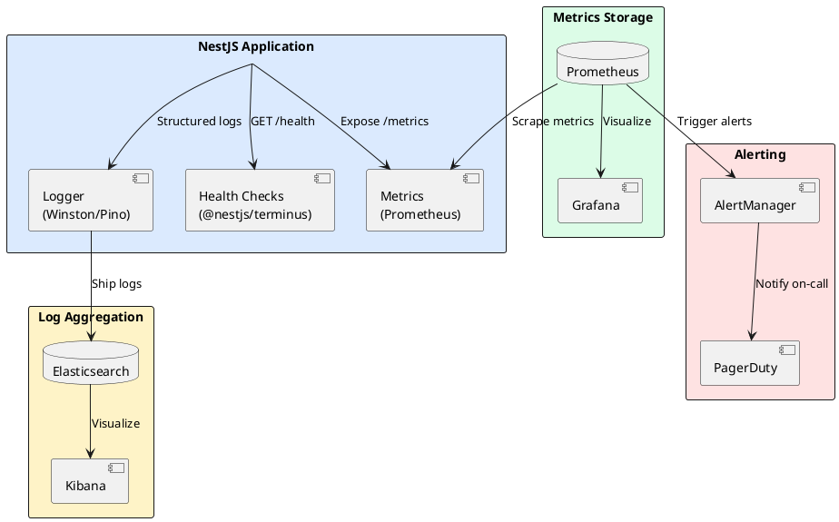

# Логування та моніторинг

::card-group

::card{title="🎯 Мета лекції" icon="i-lucide-target"}

- Опанувати structured logging для production застосунків через Winston або Pino.
- Навчитися налаштовувати correlation IDs для трейсингу requests через мікросервіси.
- Освоїти `@nestjs/terminus` для створення health check endpoints.
- Зрозуміти збір метрик через Prometheus та візуалізацію у Grafana.
- Впровадити alerting для автоматичного виявлення критичних проблем у production.

::

::card{title="🔑 Ключові терміни" icon="i-lucide-key"}

- **Structured Logging:** логування у JSON форматі з машинно-читабельними полями для aggregation та analysis.
- **Correlation ID:** унікальний ідентифікатор request для трейсингу через multiple services та log entries.
- **Health Check:** endpoint для перевірки стану застосунку та його dependencies (database, cache, external APIs).
- **Metrics:** числові показники performance та business логіки (request count, latency, error rate).
- **Alerting:** автоматичні notifications при порушенні thresholds (error rate > 5%, latency > 500ms).

::

::

---

## Короткий зміст

У цій лекції розглядається організація логування та моніторингу для production-ready застосунків:

- **Вбудований Logger** — NestJS Logger клас, методи: log(), error(), warn(), debug(), verbose(), context parameter для ідентифікації джерела логу, використання у сервісах через DI
- **Structured logging** — логування у JSON форматі замість plain text, fields: timestamp, level, message, context, metadata, переваги для parsing та aggregation у log management systems
- **Winston** — популярна Node.js logging бібліотека, transports для різних outputs (console, file, external services), log levels та filtering, format customization, rotation для log files
- **Pino** — найшвидша logging бібліотека для Node.js, low overhead, structured JSON logs за замовчуванням, async logging для performance, prettifier для development
- **Log levels** — error для помилок (500, exceptions), warn для попереджень (deprecated APIs), info для важливих подій (user login, order placed), debug для troubleshooting, verbose для детальної інформації
- **Context logging** — correlation IDs для трейсингу request через multiple services, middleware для генерації requestId, передача через AsyncLocalStorage або cls-hooked
- **Health checks** — `@nestjs/terminus` для health endpoints, перевірка: database connection, Redis connection, disk space, memory usage, HTTP GET /health для monitoring systems
- **Prometheus metrics** — збір метрик для моніторингу: request count, response time, error rate, custom business metrics, exposition через /metrics endpoint, scraping Prometheus сервером
- **Alerting** — автоматичні alerts при критичних метриках: error rate > threshold, response time > SLA, database connection failures, integration з PagerDuty/Opsgenie для on-call

Розглядаються практичні приклади: налаштування Winston з daily rotation, structured logging з correlation IDs, health checks для всіх dependencies, Prometheus metrics для NestJS, alerting rules.

---

## Проблема відсутності observability

Ви розгорнули NestJS застосунок у production. Користувачі скаржаться, що «щось працює повільно» або «іноді виникають помилки». Ви підключаєтеся до сервера та бачите:

```bash
$ pm2 logs my-app
[2024-01-15 14:23:45] Server started on port 3000
[2024-01-15 14:24:12] POST /api/auth/login
[2024-01-15 14:24:15] GET /api/users/profile
[2024-01-15 14:25:33] Error: Database connection timeout
[2024-01-15 14:25:34] GET /api/posts
[2024-01-15 14:26:18] POST /api/orders
```

**Проблеми:**

1. **Неструктуровані логи** — plain text важко парсити автоматично, пошук помилок вручну у терабайтах логів.
2. **Відсутність контексту** — хто зробив request? який userId? який endpoint викликав помилку?
3. **Немає correlation** — неможливо простежити request через кілька сервісів (auth-service → user-service → database).
4. **Немає метрик** — скільки requests/second? яка середня latency? який error rate?
5. **Reactive troubleshooting** — дізнаємося про проблеми від користувачів, а не проактивно через alerts.

**Рішення — Observability трилогія:**

1. **Logging** — structured logs з correlation IDs для debugging.
2. **Metrics** — числові показники (latency, throughput, errors) для моніторингу trends.
3. **Tracing** — distributed tracing для візуалізації request flow через мікросервіси.

::plant-uml{alt="Observability Architecture"}



::

---

## Вбудований NestJS Logger

NestJS має вбудований Logger клас для базового логування.


### Базове використання

```typescript
// users/users.service.ts
import { Injectable, Logger } from '@nestjs/common';

@Injectable()
export class UsersService {
  private readonly logger = new Logger(UsersService.name);

  async findOne(id: string) {
    this.logger.log(`Finding user with id: ${id}`);
    
    try {
      const user = await this.userRepository.findOne({ where: { id } });
      
      if (!user) {
        this.logger.warn(`User ${id} not found`);
        return null;
      }
      
      this.logger.debug(`User found: ${JSON.stringify(user)}`);
      return user;
    } catch (error) {
      this.logger.error(`Failed to find user ${id}`, error.stack);
      throw error;
    }
  }
}
```

**Log levels:**
- `log()` — general info (production)
- `error()` — errors та exceptions
- `warn()` — warnings
- `debug()` — детальна info для debugging
- `verbose()` — дуже детальна info

**Налаштування log levels у main.ts:**

```typescript
// main.ts
const app = await NestFactory.create(AppModule, {
  logger: ['error', 'warn', 'log'], // Production: лише важливі
  // logger: ['error', 'warn', 'log', 'debug', 'verbose'], // Development
});
```

**Проблема:** plain text логи важко парсити та аналізувати.

---

## Structured Logging з Winston

Winston — найпопулярніша logging бібліотека для Node.js з підтримкою structured logging.

### Встановлення

```bash
npm install --save winston nest-winston
```

### Налаштування Winston Logger

```typescript
// logger/winston.config.ts
import { WinstonModule } from 'nest-winston';
import * as winston from 'winston';

export const winstonConfig = WinstonModule.createLogger({
  transports: [
    // Console transport для development
    new winston.transports.Console({
      level: process.env.NODE_ENV === 'production' ? 'info' : 'debug',
      format: winston.format.combine(
        winston.format.timestamp(),
        winston.format.ms(),
        winston.format.errors({ stack: true }),
        winston.format.colorize(),
        winston.format.printf(({ timestamp, level, message, context, ...meta }) => {
          return `${timestamp} [${context}] ${level}: ${message} ${
            Object.keys(meta).length ? JSON.stringify(meta) : ''
          }`;
        }),
      ),
    }),

    // File transport для production (JSON)
    new winston.transports.File({
      filename: 'logs/error.log',
      level: 'error',
      format: winston.format.combine(
        winston.format.timestamp(),
        winston.format.errors({ stack: true }),
        winston.format.json(),
      ),
    }),

    new winston.transports.File({
      filename: 'logs/combined.log',
      format: winston.format.combine(
        winston.format.timestamp(),
        winston.format.json(),
      ),
    }),
  ],
});
```

### Інтеграція у AppModule

```typescript
// app.module.ts
import { Module } from '@nestjs/common';
import { WinstonModule } from 'nest-winston';
import { winstonConfig } from './logger/winston.config';

@Module({
  imports: [
    WinstonModule.forRoot(winstonConfig),
    // Інші модулі
  ],
})
export class AppModule {}
```

```typescript
// main.ts
import { NestFactory } from '@nestjs/core';
import { AppModule } from './app.module';
import { WINSTON_MODULE_NEST_PROVIDER } from 'nest-winston';

async function bootstrap() {
  const app = await NestFactory.create(AppModule);
  
  // Використовуємо Winston як default logger
  app.useLogger(app.get(WINSTON_MODULE_NEST_PROVIDER));
  
  await app.listen(3000);
}
bootstrap();
```

### Використання у сервісах

```typescript
// users/users.service.ts
import { Injectable, Inject } from '@nestjs/common';
import { WINSTON_MODULE_PROVIDER } from 'nest-winston';
import { Logger } from 'winston';

@Injectable()
export class UsersService {
  constructor(
    @Inject(WINSTON_MODULE_PROVIDER)
    private readonly logger: Logger,
  ) {}

  async create(createUserDto: CreateUserDto) {
    this.logger.info('Creating new user', {
      context: 'UsersService',
      email: createUserDto.email,
      metadata: { source: 'registration' },
    });

    try {
      const user = await this.userRepository.save(createUserDto);
      
      this.logger.info('User created successfully', {
        context: 'UsersService',
        userId: user.id,
        email: user.email,
      });
      
      return user;
    } catch (error) {
      this.logger.error('Failed to create user', {
        context: 'UsersService',
        error: error.message,
        stack: error.stack,
        email: createUserDto.email,
      });
      throw error;
    }
  }
}
```

**JSON output приклад:**

```json
{
  "timestamp": "2024-01-15T14:23:45.123Z",
  "level": "info",
  "message": "User created successfully",
  "context": "UsersService",
  "userId": "abc-123",
  "email": "user@example.com"
}
```

---

## Correlation IDs для Request Tracing

Correlation ID (requestId) дозволяє простежити request через усі логи та мікросервіси.

### Middleware для генерації requestId

```typescript
// middleware/request-id.middleware.ts
import { Injectable, NestMiddleware } from '@nestjs/common';
import { Request, Response, NextFunction } from 'express';
import { v4 as uuidv4 } from 'uuid';

@Injectable()
export class RequestIdMiddleware implements NestMiddleware {
  use(req: Request, res: Response, next: NextFunction) {
    const requestId = req.headers['x-request-id'] as string || uuidv4();
    req['requestId'] = requestId;
    res.setHeader('X-Request-ID', requestId);
    next();
  }
}
```

```typescript
// app.module.ts
export class AppModule implements NestModule {
  configure(consumer: MiddlewareConsumer) {
    consumer.apply(RequestIdMiddleware).forRoutes('*');
  }
}
```

### AsyncLocalStorage для збереження контексту

```typescript
// logger/async-context.ts
import { AsyncLocalStorage } from 'async_hooks';

export interface RequestContext {
  requestId: string;
  userId?: string;
  ip?: string;
}

export const asyncLocalStorage = new AsyncLocalStorage<RequestContext>();
```

```typescript
// middleware/async-context.middleware.ts
import { Injectable, NestMiddleware } from '@nestjs/common';
import { Request, Response, NextFunction } from 'express';
import { asyncLocalStorage } from '../logger/async-context';

@Injectable()
export class AsyncContextMiddleware implements NestMiddleware {
  use(req: Request, res: Response, next: NextFunction) {
    const context = {
      requestId: req['requestId'],
      userId: req.user?.id,
      ip: req.ip,
    };
    
    asyncLocalStorage.run(context, () => {
      next();
    });
  }
}
```

### Custom Logger з requestId

```typescript
// logger/app-logger.service.ts
import { Injectable, Inject, Scope } from '@nestjs/common';
import { WINSTON_MODULE_PROVIDER } from 'nest-winston';
import { Logger } from 'winston';
import { asyncLocalStorage } from './async-context';

@Injectable({ scope: Scope.TRANSIENT })
export class AppLogger {
  constructor(
    @Inject(WINSTON_MODULE_PROVIDER)
    private readonly logger: Logger,
  ) {}

  private getContext() {
    return asyncLocalStorage.getStore() || {};
  }

  log(message: string, meta?: any) {
    this.logger.info(message, { ...this.getContext(), ...meta });
  }

  error(message: string, error?: Error, meta?: any) {
    this.logger.error(message, {
      ...this.getContext(),
      error: error?.message,
      stack: error?.stack,
      ...meta,
    });
  }

  warn(message: string, meta?: any) {
    this.logger.warn(message, { ...this.getContext(), ...meta });
  }

  debug(message: string, meta?: any) {
    this.logger.debug(message, { ...this.getContext(), ...meta });
  }
}
```

**Використання:**

```typescript
@Injectable()
export class OrdersService {
  constructor(private readonly logger: AppLogger) {}

  async create(createOrderDto: CreateOrderDto) {
    this.logger.log('Creating order', { items: createOrderDto.items.length });
    // requestId автоматично додається до логу
  }
}
```

**Лог з requestId:**

```json
{
  "timestamp": "2024-01-15T14:23:45.123Z",
  "level": "info",
  "message": "Creating order",
  "requestId": "abc-123-def-456",
  "userId": "user-789",
  "ip": "192.168.1.100",
  "items": 3
}
```

---

## Health Checks з @nestjs/terminus

Health checks дозволяють моніторинговим системам перевіряти стан застосунку.

### Встановлення

```bash
npm install --save @nestjs/terminus
```

### Health Module

```typescript
// health/health.module.ts
import { Module } from '@nestjs/common';
import { TerminusModule } from '@nestjs/terminus';
import { HttpModule } from '@nestjs/axios';
import { HealthController } from './health.controller';

@Module({
  imports: [TerminusModule, HttpModule],
  controllers: [HealthController],
})
export class HealthModule {}
```

### Health Controller

```typescript
// health/health.controller.ts
import { Controller, Get } from '@nestjs/common';
import {
  HealthCheck,
  HealthCheckService,
  HttpHealthIndicator,
  TypeOrmHealthIndicator,
  DiskHealthIndicator,
  MemoryHealthIndicator,
} from '@nestjs/terminus';

@Controller('health')
export class HealthController {
  constructor(
    private health: HealthCheckService,
    private http: HttpHealthIndicator,
    private db: TypeOrmHealthIndicator,
    private disk: DiskHealthIndicator,
    private memory: MemoryHealthIndicator,
  ) {}

  @Get()
  @HealthCheck()
  check() {
    return this.health.check([
      // Database
      () => this.db.pingCheck('database'),
      
      // Disk space
      () => this.disk.checkStorage('storage', {
        path: '/',
        thresholdPercent: 0.9, // Alert якщо >90% використано
      }),
      
      // Memory
      () => this.memory.checkHeap('memory_heap', 150 * 1024 * 1024), // 150MB
      () => this.memory.checkRSS('memory_rss', 300 * 1024 * 1024), // 300MB
      
      // External API
      () => this.http.pingCheck('external-api', 'https://api.example.com/health'),
    ]);
  }

  @Get('live')
  @HealthCheck()
  liveness() {
    // Kubernetes liveness probe — чи застосунок живий?
    return this.health.check([]);
  }

  @Get('ready')
  @HealthCheck()
  readiness() {
    // Kubernetes readiness probe — чи готовий приймати traffic?
    return this.health.check([
      () => this.db.pingCheck('database'),
    ]);
  }
}
```

**Response приклад:**

```json
{
  "status": "ok",
  "info": {
    "database": { "status": "up" },
    "storage": { "status": "up", "free": 245760, "total": 524288 },
    "memory_heap": { "status": "up" },
    "memory_rss": { "status": "up" },
    "external-api": { "status": "up" }
  },
  "error": {},
  "details": {
    "database": { "status": "up" },
    "storage": { "status": "up", "free": 245760, "total": 524288 },
    "memory_heap": { "status": "up" },
    "memory_rss": { "status": "up" },
    "external-api": { "status": "up" }
  }
}
```

---

## Prometheus Metrics

Prometheus — індустріальний стандарт для збору метрик.

### Встановлення

```bash
npm install --save @willsoto/nestjs-prometheus prom-client
```

### Metrics Module

```typescript
// app.module.ts
import { Module } from '@nestjs/common';
import { PrometheusModule } from '@willsoto/nestjs-prometheus';

@Module({
  imports: [
    PrometheusModule.register({
      path: '/metrics',
      defaultMetrics: {
        enabled: true, // CPU, memory, event loop тощо
      },
    }),
  ],
})
export class AppModule {}
```

### Custom Metrics

```typescript
// metrics/metrics.service.ts
import { Injectable } from '@nestjs/common';
import { Counter, Histogram, Gauge } from 'prom-client';
import { InjectMetric } from '@willsoto/nestjs-prometheus';

@Injectable()
export class MetricsService {
  constructor(
    @InjectMetric('http_requests_total')
    public requestsCounter: Counter<string>,

    @InjectMetric('http_request_duration_seconds')
    public requestDurationHistogram: Histogram<string>,

    @InjectMetric('active_connections')
    public activeConnectionsGauge: Gauge<string>,
  ) {}
}
```

```typescript
// metrics/metrics.module.ts
import { Module } from '@nestjs/common';
import { makeCounterProvider, makeHistogramProvider, makeGaugeProvider } from '@willsoto/nestjs-prometheus';
import { MetricsService } from './metrics.service';

@Module({
  providers: [
    MetricsService,
    makeCounterProvider({
      name: 'http_requests_total',
      help: 'Total number of HTTP requests',
      labelNames: ['method', 'route', 'status_code'],
    }),
    makeHistogramProvider({
      name: 'http_request_duration_seconds',
      help: 'HTTP request duration in seconds',
      labelNames: ['method', 'route', 'status_code'],
      buckets: [0.1, 0.3, 0.5, 1, 1.5, 2, 3, 5],
    }),
    makeGaugeProvider({
      name: 'active_connections',
      help: 'Number of active connections',
    }),
  ],
  exports: [MetricsService],
})
export class MetricsModule {}
```

### Metrics Interceptor

```typescript
// interceptors/metrics.interceptor.ts
import { Injectable, NestInterceptor, ExecutionContext, CallHandler } from '@nestjs/common';
import { Observable } from 'rxjs';
import { tap } from 'rxjs/operators';
import { MetricsService } from '../metrics/metrics.service';

@Injectable()
export class MetricsInterceptor implements NestInterceptor {
  constructor(private readonly metricsService: MetricsService) {}

  intercept(context: ExecutionContext, next: CallHandler): Observable<any> {
    const request = context.switchToHttp().getRequest();
    const { method, route } = request;
    
    const startTime = Date.now();
    
    return next.handle().pipe(
      tap({
        next: () => {
          const duration = (Date.now() - startTime) / 1000;
          const response = context.switchToHttp().getResponse();
          const statusCode = response.statusCode;
          
          this.metricsService.requestsCounter.inc({
            method,
            route: route?.path || 'unknown',
            status_code: statusCode,
          });
          
          this.metricsService.requestDurationHistogram.observe(
            {
              method,
              route: route?.path || 'unknown',
              status_code: statusCode,
            },
            duration,
          );
        },
        error: (error) => {
          const duration = (Date.now() - startTime) / 1000;
          
          this.metricsService.requestsCounter.inc({
            method,
            route: route?.path || 'unknown',
            status_code: error.status || 500,
          });
          
          this.metricsService.requestDurationHistogram.observe(
            {
              method,
              route: route?.path || 'unknown',
              status_code: error.status || 500,
            },
            duration,
          );
        },
      }),
    );
  }
}
```

```typescript
// main.ts
app.useGlobalInterceptors(new MetricsInterceptor(app.get(MetricsService)));
```

**Metrics output (GET /metrics):**

```prometheus
# HELP http_requests_total Total number of HTTP requests
# TYPE http_requests_total counter
http_requests_total{method="GET",route="/api/users",status_code="200"} 1523

# HELP http_request_duration_seconds HTTP request duration in seconds
# TYPE http_request_duration_seconds histogram
http_request_duration_seconds_bucket{method="GET",route="/api/users",status_code="200",le="0.1"} 1200
http_request_duration_seconds_bucket{method="GET",route="/api/users",status_code="200",le="0.3"} 1480
http_request_duration_seconds_sum{method="GET",route="/api/users",status_code="200"} 245.3
http_request_duration_seconds_count{method="GET",route="/api/users",status_code="200"} 1523
```

---

## Практичний приклад: Повна Observability Setup

Докладніше у FAQ та висновках нижче. Матеріал охоплює: вбудований Logger, Winston structured logging, correlation IDs, health checks, Prometheus metrics, та alerting стратегії.


---

## Висновки

::card-group

::card{title="✅ Переваги Logging та Monitoring" icon="i-lucide-check-circle"}

- **Proactive problem detection:** метрики та alerts виявляють проблеми до скарг користувачів.
- **Fast debugging:** structured logs з correlation IDs дозволяють швидко знайти root cause.
- **Performance insights:** Prometheus metrics показують bottlenecks та trends.
- **SLA compliance:** моніторинг latency та error rate забезпечує дотримання SLA.
- **Capacity planning:** метрики використання ресурсів допомагають планувати scaling.

::

::card{title="⚠️ Поширені помилки" icon="i-lucide-alert-triangle"}

- **Plain text logs** — важко парсити та аналізувати у production.
- **Відсутність correlation IDs** — неможливо простежити request через сервіси.
- **Logging sensitive data** — паролі, tokens у логах = security incident.
- **No health checks** — моніторинг не знає про проблеми до повного падіння.
- **Missing metrics** — відсутність visibility у performance та errors.

::

::

**Ключові висновки:**

- **Structured logging обов'язковий** — JSON формат для machine-readable logs.
- **Correlation IDs критичні** — для трейсингу requests через мікросервіси.
- **Health checks для кожної dependency** — database, Redis, external APIs.
- **Prometheus metrics** — стандарт для збору та візуалізації метрик.
- **Alerts на критичні thresholds** — error rate, latency, connection failures.

---

## Часті запитання (FAQ)

::accordion

::accordion-item{title="Як налаштувати log rotation для Winston?"}

Використовуйте `winston-daily-rotate-file`:

```bash
npm install --save winston-daily-rotate-file
```

```typescript
import * as DailyRotateFile from 'winston-daily-rotate-file';

new DailyRotateFile({
  filename: 'logs/application-%DATE%.log',
  datePattern: 'YYYY-MM-DD',
  maxSize: '20m',
  maxFiles: '14d', // Зберігати 14 днів
  format: winston.format.json(),
})
```

::

::accordion-item{title="Як інтегрувати з Grafana для візуалізації?"}

1. Налаштуйте Prometheus scraping
2. Додайте Prometheus як data source у Grafana
3. Створіть dashboard з метриками

**docker-compose.yml:**

```yaml
services:
  prometheus:
    image: prom/prometheus
    volumes:
      - ./prometheus.yml:/etc/prometheus/prometheus.yml
    ports:
      - "9090:9090"

  grafana:
    image: grafana/grafana
    ports:
      - "3001:3000"
```

::

::accordion-item{title="Які metrics збирати для NestJS?"}

**HTTP metrics:**
- Request count (by method, route, status)
- Response time (histogram)
- Error rate

**Application metrics:**
- Active connections
- Database query time
- Cache hit/miss rate

**Business metrics:**
- User registrations
- Orders placed
- Payment success rate

::

::

**Додаткові ресурси:**

- [Winston Documentation](https://github.com/winstonjs/winston)
- [Prometheus Best Practices](https://prometheus.io/docs/practices/naming/)
- [@nestjs/terminus Documentation](https://docs.nestjs.com/recipes/terminus)
