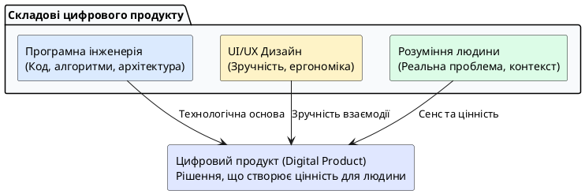
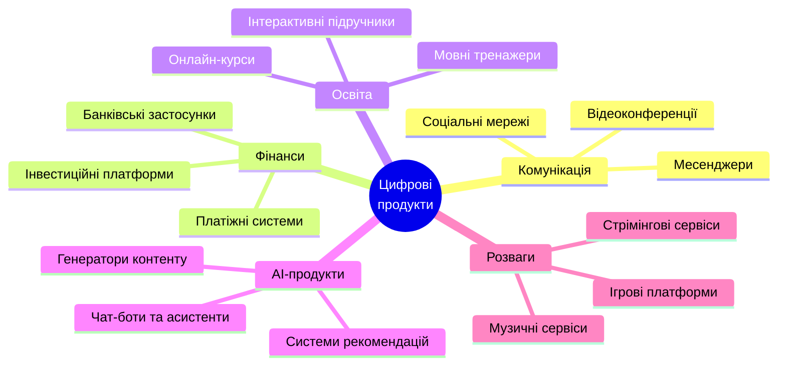
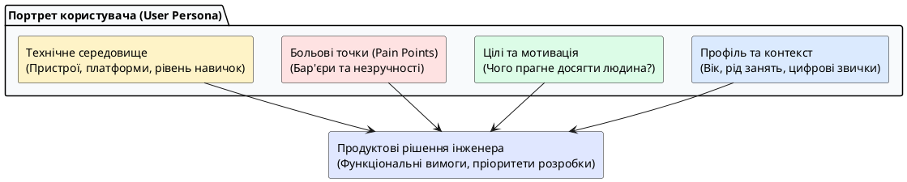
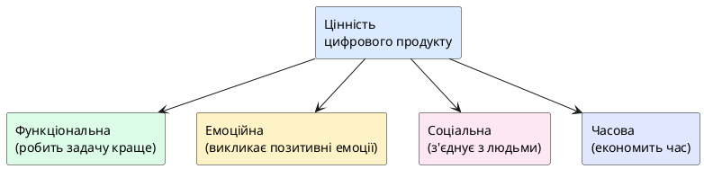
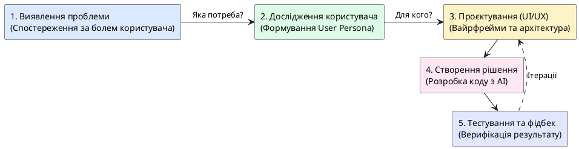

# Вступ до професії розробника цифрових продуктів

::card-group

::card{title="🎯 Мета розділу" icon="i-lucide-target"}

- Зрозуміти, що таке цифровий продукт та чим він відрізняється від звичайної програми.
- Усвідомити роль користувача як центральної фігури у розробці продукту.
- Навчитися визначати проблему та потребу, які продукт має вирішувати.
- Осмислити поняття цінності цифрового продукту для кінцевого користувача.

::

::card{title="🔑 Ключові терміни" icon="i-lucide-key"}

- **Цифровий продукт (*Digital Product*):** програмне рішення, що вирішує конкретну проблему користувача через цифровий інтерфейс.
- **Користувач (*User*):** людина, яка взаємодіє з продуктом для досягнення своєї мети.
- **Потреба (*Need*):** усвідомлена або неусвідомлена необхідність, яку продукт має задовольнити.
- **Цінність продукту (*Product Value*):** користь, яку отримує людина від використання продукту.

::

::

---

## Що таке цифровий продукт

Коли ми чуємо слово «програма», часто уявляємо щось технічне: рядки коду, алгоритми, бази даних. Проте **цифровий продукт** (*digital product*) — це значно більше, ніж просто код. Це комплексне рішення, що поєднує технологію, дизайн та розуміння потреб людини для вирішення конкретної проблеми.

Подумайте про застосунки, якими ви користуєтесь щодня: месенджер для спілкування, карти для навігації, банківський застосунок для оплати покупок, стрімінговий сервіс для перегляду фільмів. Кожен із цих продуктів існує не заради самої технології, а тому, що він **розв'язує реальну проблему** реальної людини. Месенджер дозволяє миттєво зв'язатися з будь-ким у світі. Карти допомагають знайти найшвидший маршрут. Банківський застосунок звільняє від необхідності відвідувати фізичне відділення банку.

Важливо розуміти принципову різницю між «програмою» та «продуктом». Програма — це набір інструкцій, які виконує комп'ютер. Продукт — це **досвід**, який отримує людина при взаємодії з цією програмою. Саме тому два застосунки з однаковою функціональністю можуть мати кардинально різний успіх на ринку: один зручний, інтуїтивно зрозумілий та приємний у використанні, а інший — технічно правильний, але незручний і заплутаний.

{.diagram-img}

::plant-uml{alt="Цифровий продукт як синтез технологій, дизайну та потреб користувача"}



::

::note
Цифровий продукт — це не лише мобільний застосунок чи вебсайт. Це може бути чат-бот для підтримки клієнтів, система рекомендацій інтернет-магазину, розумний термостат, голосовий помічник або навіть AI-асистент, що допомагає писати код. Спільна риса — кожен із них створений для людини та вирішує її конкретну задачу.
::

---

## Приклади цифрових продуктів

Цифрові продукти оточують нас всюди, і часто ми навіть не замислюємося про складність технологій, що стоять за простим натисканням кнопки. Розглянемо декілька категорій, щоб відчути широту цієї сфери.

**Комунікаційні продукти** — месенджери (Telegram, WhatsApp), поштові клієнти (Gmail), соціальні мережі (Instagram, LinkedIn). Вони вирішують фундаментальну потребу людини у спілкуванні та підтримці соціальних зв'язків. Технологічна складність таких продуктів вражає: синхронізація мільйонів повідомлень у реальному часі, шифрування, доставка push-сповіщень на мільярди пристроїв.

**Фінансові продукти** — банківські застосунки (monobank, Revolut), платіжні системи (Apple Pay, Google Pay), криптовалютні біржі. Вони перетворили фінансові операції з багатогодинного процесу на дію, що займає секунди.

**Освітні продукти** — платформи онлайн-навчання (Coursera, Prometheus), мовні тренажери (Duolingo), електронні підручники. Вони демократизували доступ до знань: студент з невеликого міста має ті самі можливості навчання, що й студент провідного університету.

**AI-продукти** — інтелектуальні асистенти (ChatGPT, Google Gemini, Claude), системи автоматичного перекладу (Google Translate, DeepL), генератори зображень (Midjourney, DALL·E). Це найновіша хвиля цифрових продуктів, яка фундаментально змінює спосіб взаємодії людини з технологією.

::mermaid



::

---

## Хто такий користувач цифрового продукту

Центральною фігурою будь-якого цифрового продукту є **користувач** (*user*) — конкретна людина з конкретними потребами, звичками, обмеженнями та очікуваннями. Це може здаватися очевидним, проте одна з найпоширеніших помилок починаючих розробників — створення продукту «для всіх». Продукт, створений «для всіх», насправді не підходить нікому, бо намагається задовольнити суперечливі потреби одночасно.

Розуміння користувача починається з відповідей на фундаментальні питання: *Хто ця людина? У якій ситуації вона опиняється? Що їй заважає? Який результат вона хоче отримати? Які у неї технічні навички?* Відповіді на ці питання формують так званий **портрет користувача** (*user persona*) — узагальнений образ типового представника цільової аудиторії.

Наприклад, для навчального застосунку з програмування портрет користувача може виглядати так: «Марія, 20 років, студентка коледжу, вивчає інженерію програмного забезпечення, має ноутбук та смартфон, вільно володіє українською мовою, має базові знання англійської для читання технічної документації, хоче навчитися створювати вебзастосунки, але не знає, з чого почати».

{.diagram-img}

::plant-uml{alt="Дослідження користувачів та модель портрета користувача (User Persona)"}



::

::tip
Коли ви створюєте будь-який продукт (навіть навчальний проєкт), завжди починайте з питання: «Для кого я це роблю?» Це допоможе приймати правильні рішення щодо дизайну, функціональності та пріоритетів.
::

---

## Проблема і потреба користувача

Кожен успішний цифровий продукт існує тому, що він **вирішує проблему** або **задовольняє потребу** конкретної людини. Різниця між проблемою та потребою тонка, але важлива для розуміння.

**Проблема** — це перешкода, з якою стикається людина при досягненні своєї мети. Наприклад: «Я не можу швидко знайти потрібну інформацію серед сотень документів», «Мені складно запам'ятовувати нові слова іноземної мови», «Я витрачаю годину на дорогу до банку, щоб оплатити рахунок».

**Потреба** — це більш глибоке бажання, яке стоїть за проблемою. За проблемою пошуку інформації стоїть потреба в ефективному управлінні знаннями. За проблемою вивчення мови — потреба в комунікації. За проблемою відвідування банку — потреба в зручному управлінні фінансами.

Розуміння різниці між проблемою та потребою допомагає створювати справді інноваційні продукти. Якщо фокусуватися лише на проблемі, ви створите «швидшого коня» (за відомою цитатою Генрі Форда). Якщо зрозуміти потребу, ви створите «автомобіль» — принципово нове рішення, про яке користувач навіть не мріяв.

::warning
Типова помилка розробників-початківців: починати зі «Який застосунок я хочу створити?» замість «Яку проблему я хочу вирішити?» Технологія — це інструмент. Спочатку визначте проблему, а потім шукайте технічне рішення.
::

---

## Цінність цифрового продукту

**Цінність** (*value*) — це конкретна користь, яку отримує людина від використання продукту. Цінність — це не список функцій і не технічна складність. Це відповідь на питання: «Чому людина обере саме цей продукт, а не альтернативу (включаючи варіант "не робити нічого")?»

Цінність цифрового продукту можна класифікувати за декількома вимірами:

**Функціональна цінність** — продукт виконує задачу краще, швидше або дешевше, ніж альтернативи. Google Maps прокладає маршрут швидше, ніж паперова карта. Калькулятор рахує точніше, ніж людина.

**Емоційна цінність** — продукт викликає позитивні емоції: задоволення, впевненість, спокій. Красивий інтерфейс банківського застосунку дає відчуття надійності та контролю над фінансами.

**Соціальна цінність** — продукт допомагає людині взаємодіяти з іншими, належати до спільноти, отримувати визнання. Соціальні мережі задовольняють потребу в приналежності та самовираженні.

**Часова цінність** — продукт економить час користувача. Система автоматичного заповнення документів звільняє години рутинної роботи. AI-асистент скорочує час на пошук та аналіз інформації.

{.diagram-img}

::plant-uml{alt="Виміри цінності цифрового продукту"}



::

---

## Від ідеї до продукту: перший погляд

Створення цифрового продукту — це не одноразова дія, а **процес**, що складається з багатьох етапів. На цьому етапі курсу ми лише окреслимо загальну картину, а детальніше розглянемо кожен крок у наступних розділах.

Уявіть, що ви помітили проблему: студенти вашої групи часто забувають про дедлайни здачі завдань. Це реальна проблема, яка призводить до зниження успішності. Яким може бути цифровий продукт, що її вирішує?

Перш ніж писати код, потрібно відповісти на низку питань: *Скільки студентів стикаються з цією проблемою? Як саме вони зараз відстежують дедлайни? Чому існуючі інструменти (календар у телефоні, нотатки) не працюють? Що зробить нове рішення кращим за поточне?*

Тільки після отримання відповідей на ці питання починається проєктування рішення: яким буде інтерфейс, які функції необхідні в першу чергу, яку технологію використати, як перевірити, що продукт дійсно вирішує проблему. Усе це — складові **продуктового мислення** (*product thinking*), яке є однією з ключових компетенцій сучасного розробника.

{.diagram-img}

::plant-uml{alt="Етапи створення цифрового продукту: від ідеї до перевіреного рішення"}



::

::note
У цьому курсі ви навчитесь використовувати AI як інструмент на кожному з цих етапів: від дослідження проблеми та генерації ідей до перевірки готового результату. Але пам'ятайте — AI допомагає, а рішення приймає людина.
::

---

## Практичні завдання

::::accordion

:::accordion-item{label="📋 Завдання 1: Визначте цифрові продукти навколо себе" icon="i-lucide-clipboard-list"}

Відкрийте свій смартфон та оберіть 5 застосунків, якими ви користуєтесь найчастіше. Для кожного з них визначте:

1. **Яку проблему** вирішує цей продукт?
2. **Хто є користувачем** (опишіть 2-3 реченнями)?
3. **Яку цінність** він створює (функціональну, емоційну, соціальну, часову)?

Запишіть відповіді у таблицю:

| Застосунок | Проблема | Користувач | Тип цінності |
|---|---|---|---|
| ... | ... | ... | ... |

:::

:::accordion-item{label="📋 Завдання 2: Знайдіть проблему для продукту (з AI)" icon="i-lucide-clipboard-list"}

Використайте будь-який AI-асистент (ChatGPT, Gemini, Claude) та задайте йому запит:

```
Я студент коледжу, що вивчає програмування. Допоможи мені знайти 5 повсякденних
проблем студентів, які можна вирішити за допомогою цифрового продукту.
Для кожної проблеми вкажи:
- Опис проблеми (1-2 речення)
- Хто саме стикається з цією проблемою
- Яке цифрове рішення могло б допомогти
```

Після отримання відповіді проаналізуйте: чи справді ці проблеми актуальні для вас та ваших одногрупників? Чи є серед відповідей AI щось, що не відповідає реальності?

:::

:::accordion-item{label="📋 Завдання 3: Порівняйте відповіді різних AI" icon="i-lucide-clipboard-list"}

Задайте **той самий запит** із завдання 2 у двох різних AI-асистентах (наприклад, ChatGPT та Gemini). Порівняйте відповіді:

1. Чи відрізняються запропоновані проблеми?
2. Який AI дав більш конкретні та корисні пропозиції?
3. Чи є відповіді, які повторюються в обох AI?

Це ваше перше знайомство з тим, що **різні AI можуть давати різні відповіді** на один і той самий запит.

:::

::::

---

## Запитання для самоконтролю

::::accordion

:::accordion-item{label="❓ Чим цифровий продукт відрізняється від програми?" icon="i-lucide-help-circle"}

Програма — це набір інструкцій для комп'ютера. Цифровий продукт — це комплексне рішення, що поєднує технологію, дизайн та розуміння потреб користувача. Продукт — це **досвід**, який отримує людина, а не лише код, що виконується на сервері. Два застосунки з ідентичним кодом можуть бути абсолютно різними продуктами, якщо один з них зручний для користувача, а інший — ні.

:::

:::accordion-item{label="❓ Чому продукт «для всіх» — це погана ідея?" icon="i-lucide-help-circle"}

Різні категорії користувачів мають різні потреби, звички та обмеження. Спроба задовольнити всіх одночасно призводить до компромісів, які роблять продукт посереднім для кожної з груп. Натомість фокус на конкретній аудиторії дозволяє створити рішення, яке ідеально підходить саме для неї. Це не означає, що продукт не може масштабуватися — але він повинен починати з чіткого розуміння свого першого користувача.

:::

:::accordion-item{label="❓ Чому важливо розрізняти проблему та потребу?" icon="i-lucide-help-circle"}

Проблема — це конкретна перешкода, з якою стикається людина. Потреба — це глибше бажання, яке стоїть за проблемою. Фокус лише на проблемі обмежує простір рішень: ви створюєте «швидшого коня» замість «автомобіля». Розуміння потреби дозволяє знаходити принципово нові підходи, які користувач навіть не міг уявити, але які точно відповідають його глибинному запиту.

:::

::::
