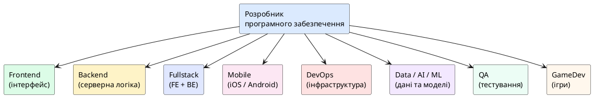

# Професія розробника програмного забезпечення

::card-group

::card{title="🎯 Мета розділу" icon="i-lucide-target"}

- Зрозуміти, хто такий розробник програмного забезпечення та які завдання він виконує.
- Ознайомитися з основними напрямами розробки ПЗ.
- Усвідомити етапи роботи розробника від постановки задачі до підтримки продукту.
- Побачити різноманітність продуктів, які створюють розробники.

::

::card{title="🔑 Ключові терміни" icon="i-lucide-key"}

- **Розробник програмного забезпечення (*Software Developer*):** спеціаліст, що створює, тестує та підтримує програмні системи.
- **Frontend:** клієнтська частина застосунку, відповідальна за інтерфейс та взаємодію з користувачем.
- **Backend:** серверна частина, що обробляє логіку, зберігає дані та забезпечує роботу системи.
- **Fullstack:** спеціаліст, що поєднує навички frontend та backend розробки.

::

::

---

## Хто такий розробник програмного забезпечення

Розробник програмного забезпечення (*software developer*) — це спеціаліст, який проєктує, створює, тестує та підтримує програмні системи. Проте ця коротка формула приховує величезну різноманітність діяльності. Сучасний розробник — це не просто людина, яка «пише код». Це інженер, що **розв'язує проблеми** за допомогою технологій.

Уявіть архітектора, який проєктує будівлю: він не просто малює стіни на кресленні, а враховує навантаження на фундамент, кліматичні умови, потреби мешканців, будівельні норми та бюджет замовника. Так само розробник програмного забезпечення не просто перетворює технічне завдання на код — він аналізує вимоги, обирає оптимальну архітектуру, передбачає можливі проблеми, пише тести та документацію, а потім супроводжує систему протягом її існування.

Важливо зрозуміти: розробник — це **професія з високим рівнем відповідальності**. Код, написаний розробником, може керувати фінансовими транзакціями на мільйони гривень, системами безпеки аеропортів, медичними приладами або освітніми платформами. Якість цього коду безпосередньо впливає на життя людей.

---

## Завдання розробника програмного забезпечення

Повсякденна робота розробника значно різноманітніша, ніж може здатися ззовні. Ось ключові завдання, які виконує розробник:

**Аналіз вимог.** Перш ніж написати першу строчку коду, розробник має зрозуміти, *що* потрібно створити і *навіщо*. Це передбачає спілкування із замовником, продуктовою командою, дизайнерами та іншими учасниками проєкту. Часто замовник формулює свої потреби нечітко: «Хочу, щоб було зручно» — і завдання розробника перетворити це на конкретні технічні вимоги.

**Проєктування рішення.** Після розуміння вимог розробник визначає архітектуру системи: які компоненти потрібні, як вони будуть взаємодіяти, які технології використати, як забезпечити масштабованість та надійність.

**Написання коду.** Це те, що зазвичай асоціюється з професією розробника — створення програмного коду мовами програмування (Python, JavaScript, C#, Java, Go тощо). Але навіть цей етап включає не лише «набирання тексту», а й вибір оптимальних алгоритмів, дотримання стандартів якості та створення читабельного коду, який зможуть підтримувати інші розробники.

**Тестування.** Розробник перевіряє, що написаний код працює правильно, витримує навантаження та коректно обробляє нестандартні ситуації. Автоматичні тести — обов'язкова частина сучасної розробки.

**Підтримка та розвиток.** Після запуску продукту робота не закінчується. Розробник виправляє помилки, оптимізує продуктивність, додає нові функції та адаптує систему до змін у вимогах.

---

## Продукти, створювані розробниками

Спектр продуктів, які створюють розробники, вражає своєю широтою:

::tabs
::tabs-item{label="Вебзастосунки"}
Онлайн-магазини, соціальні мережі, системи управління контентом, CRM-системи. Працюють у браузері та доступні з будь-якого пристрою. Приклади: Facebook, Google Docs, Notion.
::
::tabs-item{label="Мобільні застосунки"}
Нативні та кросплатформні застосунки для iOS та Android. Від простих калькуляторів до складних навігаційних систем. Приклади: Instagram, Uber, monobank.
::
::tabs-item{label="Десктопні програми"}
Застосунки для персональних комп'ютерів: редактори коду, графічні редактори, офісні пакети. Приклади: VS Code, Photoshop, Microsoft Office.
::
::tabs-item{label="Ігри"}
Від мобільних казуальних ігор до AAA-проєктів з мільйонними бюджетами. Окрема галузь розробки зі своїми специфічними технологіями (ігрові рушії Unity, Unreal Engine).
::
::tabs-item{label="Системне ПЗ"}
Операційні системи, драйвери, компілятори, бази даних — «невидимий» фундамент, на якому працюють усі інші продукти.
::
::tabs-item{label="AI-системи"}
Чат-боти, системи рекомендацій, генератори контенту, системи автономного керування — нова категорія продуктів, що стрімко розвивається.
::
::

---

## Напрями розробки програмного забезпечення

Сучасна розробка ПЗ — це не монолітна професія, а ціла екосистема спеціалізацій. Кожен напрям вимагає специфічних знань та навичок:

{.diagram-img}

::plant-uml{alt="Напрями спеціалізації розробника ПЗ"}



::

**Frontend-розробник** створює все, що бачить та з чим взаємодіє користувач: кнопки, форми, анімації, адаптивний дизайн. Основні технології: HTML, CSS, JavaScript, React, Angular, Vue.

**Backend-розробник** відповідає за серверну логіку: обробку запитів, роботу з базами даних, авторизацію, безпеку та інтеграцію із зовнішніми сервісами. Технології: Node.js, Python, Java, C#, Go.

**Fullstack-розробник** поєднує навички обох попередніх спеціалізацій та може створити повноцінний продукт самостійно.

**Mobile-розробник** спеціалізується на створенні застосунків для мобільних пристроїв. Може працювати з нативними технологіями (Swift для iOS, Kotlin для Android) або кросплатформними (React Native, Flutter).

---

## Етапи роботи розробника

Робота над будь-яким проєктом проходить через послідовність етапів, які утворюють **цикл розробки** (*development lifecycle*):

::steps

### Отримання та аналіз вимог
Розробник отримує задачу від замовника або продуктового менеджера. На цьому етапі важливо зрозуміти не лише «що зробити», а й «навіщо» та «для кого». Уточнювальні питання — обов'язкова частина цього процесу.

### Проєктування рішення
На основі вимог розробник визначає архітектуру, обирає технології та планує реалізацію. Це може включати створення схем, прототипів та технічної документації.

### Написання коду та тестів
Власне реалізація рішення мовою програмування. Сучасна практика передбачає одночасне написання коду та тестів, що перевіряють його коректність.

### Перевірка та рев'ю коду
Код перевіряють інші розробники (*code review*), щоб знайти помилки, покращити якість та забезпечити відповідність стандартам команди.

### Розгортання та запуск
Готовий код розгортається на сервері або публікується в магазині застосунків. Автоматизовані системи (*CI/CD*) спрощують цей процес.

### Підтримка та розвиток
Після запуску розробник моніторить роботу системи, виправляє помилки та додає нові функції на основі зворотного зв'язку від користувачів.

::

---

## Практичні завдання

::::accordion

:::accordion-item{label="📋 Завдання: Досліджуємо професію з AI" icon="i-lucide-clipboard-list"}

Використайте AI-асистент та задайте запит, щоб дізнатися більше про один із напрямів розробки, який вас цікавить:

```
Я студент коледжу, що починає вивчати програмування. Розкажи про професію
[frontend / backend / mobile / AI] розробника:
1. Які основні завдання виконує такий розробник щодня?
2. Які технології та мови програмування він використовує?
3. Які навички потрібні для початку кар'єри?
4. Який типовий шлях від початківця до досвідченого спеціаліста?

Відповідай стисло, по 3-4 речення на кожен пункт.
```

Після отримання відповіді задайте AI уточнювальне питання про те, що вас найбільше зацікавило. Зверніть увагу: **AI дає загальну інформацію**, яку варто перевірити, переглянувши реальні вакансії на сайтах (DOU, djinni, work.ua).

:::

:::accordion-item{label="📋 Завдання: Порівняйте напрями розробки" icon="i-lucide-clipboard-list"}

Задайте AI-асистенту запит:

```
Створи порівняльну таблицю трьох напрямів розробки ПЗ: Frontend, Backend, Mobile.
Критерії порівняння:
- Основні технології (3-4 назви)
- Типові завдання (3-4 приклади)
- Рівень входу для початківця (легкий / середній / складний)
- Перспективи ринку праці в Україні

Формат: таблиця з 4 стовпцями і 5 рядками.
```

Проаналізуйте відповідь: чи відповідає вона реальності? Перевірте хоча б один факт із таблиці, знайшовши підтвердження в інтернеті.

:::

::::

---

## Запитання для самоконтролю

::::accordion

:::accordion-item{label="❓ Чому розробник — це не просто «людина, яка пише код»?" icon="i-lucide-help-circle"}

Написання коду — лише одна зі складових роботи розробника. До його обов'язків входять аналіз вимог, проєктування архітектури, тестування, підтримка системи, комунікація з командою та замовником, а також прийняття технічних рішень, що впливають на якість, безпеку та масштабованість продукту. Сучасний розробник — це інженер, який вирішує проблеми за допомогою технологій.

:::

:::accordion-item{label="❓ Чим відрізняються frontend та backend розробники?" icon="i-lucide-help-circle"}

Frontend-розробник створює все, що бачить та з чим взаємодіє користувач у браузері або мобільному застосунку: інтерфейс, анімації, форми, адаптивний дизайн. Backend-розробник відповідає за «невидиму» частину: серверну логіку, бази даних, авторизацію, безпеку, інтеграцію із зовнішніми сервісами. Fullstack-розробник поєднує обидві спеціалізації.

:::

::::
