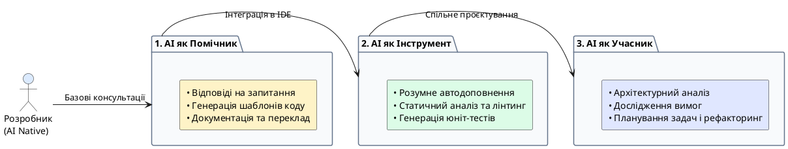

# Професія AI Native Developer

::card-group

::card{title="🎯 Мета розділу" icon="i-lucide-target"}

- Зрозуміти, хто такий AI Native Developer та чим він відрізняється від класичного розробника.
- Усвідомити різницю між використанням AI на рівні користувача та на рівні розробника.
- Побачити три ролі AI у процесі розробки: помічник, інструмент, учасник.
- Сформувати початкове розуміння нового підходу до створення цифрових продуктів.

::

::card{title="🔑 Ключові терміни" icon="i-lucide-key"}

- **AI Native Developer:** розробник, для якого AI є природною частиною робочого процесу на всіх етапах створення продукту.
- **AI-асистент (*AI Assistant*):** програмна система на базі штучного інтелекту, здатна генерувати текст, код, аналізувати дані та відповідати на запитання.
- **Промпт (*Prompt*):** текстовий запит, який користувач надсилає AI-асистенту для отримання результату.
- **AI Native Workflow:** методологія роботи, де AI інтегрований у кожен етап створення цифрового продукту.

::

::

---

## Хто такий AI Native Developer

Термін **AI Native Developer** описує нове покоління розробників, для яких штучний інтелект є не екзотичним доповненням, а **природною частиною повсякденної роботи** — так само, як компілятор, система контролю версій чи інтегроване середовище розробки (IDE).

Щоб зрозуміти суть цього поняття, проведемо аналогію. Люди, які народилися в епоху інтернету, називаються *digital natives* — вони не вчилися користуватися інтернетом, бо він завжди був частиною їхнього життя. Так само AI Native Developer не «додає AI до своєї роботи» як щось окреме — він **мислить категоріями AI** з самого початку. Коли перед ним постає задача, він автоматично розглядає: «Яку частину цієї роботи AI може виконати краще або швидше за мене? Де мій досвід та судження незамінні?»

Це не означає, що AI Native Developer замінює власне мислення машинним. Навпаки — він **критично оцінює** результати AI, перевіряє факти, приймає остаточні рішення та несе повну відповідальність за продукт. AI Native Developer — це не той, хто сліпо копіює відповіді ChatGPT, а той, хто вміє грамотно ставити задачі, аналізувати результати та інтегрувати AI у системний процес розробки.

::warning
Поширена помилка: вважати, що AI Native Developer — це просто «розробник, який використовує ChatGPT». Це значно глибше: це інший спосіб мислення, інший підхід до вирішення проблем, інший робочий процес. AI змінює не лише інструменти, а й саму парадигму роботи.
::

---

## Цілі та завдання AI Native Developer

AI Native Developer ставить перед собою ті самі цілі, що й класичний розробник — **створити якісний цифровий продукт**, що вирішує проблему користувача. Різниця полягає у **способі досягнення** цих цілей.

Ключові завдання AI Native Developer можна згрупувати так:

**Постановка задач для AI.** Замість того, щоб виконувати всю роботу самостійно, AI Native Developer вчиться формулювати завдання так, щоб AI міг ефективно допомогти. Це вимагає розуміння можливостей та обмежень AI-систем, уміння створювати точні промпти та визначати, яка частина роботи підходить для делегування AI.

**Критична оцінка результатів.** AI може генерувати правдоподібні, але помилкові відповіді. AI Native Developer знає про це і завжди перевіряє результати: чи відповідають вони вимогам? Чи немає фактичних помилок? Чи працює згенерований код коректно?

**Ітеративне покращення.** Перша відповідь AI рідко буває ідеальною. AI Native Developer вміє аналізувати недоліки отриманого результату та покращувати його через уточнення запитів, декомпозицію задачі або зміну підходу.

**Відповідальне використання AI.** AI Native Developer розуміє етичні аспекти: захист персональних даних, авторські права, академічну доброчесність та відповідальність за кінцевий результат.

---

## Відмінність AI Native Developer від звичайного користувача AI

Мільйони людей щодня використовують AI-асистентів: просять ChatGPT написати лист, Gemini — знайти рецепт, Claude — пояснити складну тему. Це **використання AI на рівні користувача** — корисне, але обмежене.

AI Native Developer працює з AI на принципово іншому рівні. Різницю можна проілюструвати таблицею:

| Аспект | Звичайний користувач AI | AI Native Developer |
|---|---|---|
| **Запити** | Прості, побутові, часто однослівні | Структуровані, з контекстом, обмеженнями та форматом |
| **Очікування** | Приймає першу відповідь | Аналізує, перевіряє, покращує |
| **Розуміння AI** | «Магічна коробка, що знає все» | Розуміє принципи роботи, можливості та обмеження |
| **Помилки AI** | Не помічає або ігнорує | Виявляє, аналізує причину, виправляє |
| **Відповідальність** | «AI так сказав» | Бере на себе відповідальність за результат |
| **Безпека** | Не замислюється про дані | Перевіряє, що передає, знеособлює дані |
| **Ітерації** | 1 запит → 1 відповідь | Серія уточнень до досягнення якісного результату |

::note
Аналогія: звичайний користувач AI — це як пасажир таксі, який каже «відвезіть мене кудись цікаве». AI Native Developer — це як штурман, який прокладає маршрут, перевіряє дорожні умови, коригує шлях за потреби та несе відповідальність за прибуття в потрібну точку вчасно.
::

---

## AI як помічник розробника

Перша і найпростіша роль AI у роботі розробника — **помічник** (*assistant*). У цій ролі AI виконує рутинні та допоміжні завдання, звільняючи час розробника для більш творчої та стратегічної роботи.

Приклади AI як помічника:

- **Пояснення складних концепцій.** Замість годинного пошуку в документації розробник може попросити AI пояснити новий патерн проєктування, принцип роботи алгоритму або різницю між двома технологіями.
- **Генерація шаблонного коду.** Створення базових структур (CRUD-операції, конфігураційні файли, шаблони тестів), які розробник потім адаптує під конкретні потреби.
- **Переклад та документація.** AI може перекладати технічну документацію, створювати коментарі до коду або генерувати README-файли.
- **Пошук помилок.** Розробник може надіслати AI фрагмент коду з помилкою та попросити знайти проблему.

::tip
Навіть на рівні помічника AI може суттєво підвищити продуктивність. Але пам'ятайте: помічник не замінює розуміння. Якщо ви не розумієте пояснення AI або не можете оцінити якість згенерованого коду — це сигнал, що вам потрібно спочатку вивчити тему самостійно.
::

---

## AI як інструмент створення цифрових продуктів

На наступному рівні AI стає **інструментом** (*tool*) — потужним засобом, що входить до арсеналу розробника нарівні з IDE, системою контролю версій та фреймворками.

У цій ролі AI інтегрується безпосередньо в робочий процес:

- **Прототипування.** AI може швидко створити прототип інтерфейсу або бекенду, дозволяючи розробнику оцінити ідею до повноцінної реалізації.
- **Аналіз коду.** AI-інструменти (GitHub Copilot, Cursor, Cody) аналізують код у реальному часі, пропонують автодоповнення та виявляють потенційні проблеми.
- **Генерація тестів.** AI може створити набір тестових сценаріїв на основі аналізу коду, покриваючи граничні випадки, про які розробник міг не подумати.
- **Рефакторинг.** AI допомагає покращити структуру існуючого коду, зберігаючи його функціональність.

---

## AI як учасник процесу розробки

Найвищий рівень інтеграції — AI як **учасник** (*participant*) процесу розробки. На цьому рівні AI не просто виконує окремі завдання, а бере участь у прийнятті рішень та плануванні.

- **Дослідження проблеми.** AI допомагає аналізувати ринок, вивчати конкурентів та формулювати гіпотези щодо потреб користувачів.
- **Архітектурні рішення.** Розробник обговорює з AI різні варіанти архітектури, отримуючи аналіз переваг та недоліків кожного підходу.
- **Планування спринтів.** AI допомагає декомпозувати великі задачі на менші, оцінювати складність та визначати пріоритети.
- **Зворотний зв'язок.** AI аналізує відгуки користувачів, виявляє патерни та пропонує покращення.

{.diagram-img}

::plant-uml{alt="Рівні інтеграції AI в роботу розробника"}



::

::caution
Навіть коли AI виступає як «учасник», остаточне рішення завжди залишається за людиною. AI може запропонувати варіанти та аргументи, але відповідальність за вибір та його наслідки несе розробник.
::

---

## Практичні завдання

::::accordion

:::accordion-item{label="📋 Завдання: Відчуйте різницю між користувачем та розробником" icon="i-lucide-clipboard-list"}

Виконайте два запити до AI-асистента на одну й ту саму тему та порівняйте результати.

**Запит як звичайний користувач:**
```
Розкажи про мобільні додатки
```

**Запит як AI Native Developer:**
```
Я студент, що вивчає розробку ПЗ. Мені потрібно зрозуміти ключові відмінності
між нативною та кросплатформною мобільною розробкою.

Контекст: я обираю напрям спеціалізації і хочу зрозуміти переваги та
недоліки кожного підходу.

Створи порівняння за такими критеріями:
1. Продуктивність (performance)
2. Швидкість розробки
3. Доступ до нативних API
4. Розмір команди
5. Приклади технологій

Формат: таблиця, після якої — висновок (3-4 речення) з рекомендацією
для початківця.
```

Порівняйте: яка відповідь корисніша? Чому? Що зробило другий запит ефективнішим?

:::

:::accordion-item{label="📋 Завдання: AI в трьох ролях" icon="i-lucide-clipboard-list"}

Протестуйте AI-асистент у кожній з трьох ролей:

**Роль 1 — Помічник:** Попросіть AI пояснити будь-яке поняття з вашого поточного курсу (наприклад, «що таке змінна в програмуванні»).

**Роль 2 — Інструмент:** Попросіть AI створити просту програму (наприклад, калькулятор) мовою, яку ви зараз вивчаєте.

**Роль 3 — Учасник:** Попросіть AI допомогти вам спланувати навчальний проєкт: «Допоможи мені спланувати свій перший навчальний проєкт — простий вебзастосунок. Запитай мене 5 уточнювальних питань, перш ніж пропонувати план.»

Зафіксуйте, як змінюється характер взаємодії на кожному рівні.

:::

::::

---

## Запитання для самоконтролю

::::accordion

:::accordion-item{label="❓ Чим AI Native Developer відрізняється від того, хто просто використовує ChatGPT?" icon="i-lucide-help-circle"}

AI Native Developer вбудовує AI у системний робочий процес на всіх етапах створення продукту — від дослідження до перевірки. Він розуміє принципи роботи AI, формулює структуровані запити, критично оцінює результати, виявляє помилки та несе повну відповідальність за кінцевий продукт. Звичайний користувач ChatGPT задає прості запити та приймає першу відповідь без аналізу.

:::

:::accordion-item{label="❓ Чому AI не може замінити розробника?" icon="i-lucide-help-circle"}

AI не розуміє контекст бізнесу, не знає специфічних потреб конкретного користувача, не може нести юридичну відповідальність за рішення і не здатний самостійно визначити, що є правильним у конкретній ситуації. AI генерує варіанти на основі статистичних закономірностей у даних, але не має людського розуміння, досвіду та відповідальності. Розробник — це людина, яка приймає рішення, а AI — інструмент, що допомагає ці рішення приймати.

:::

::::
