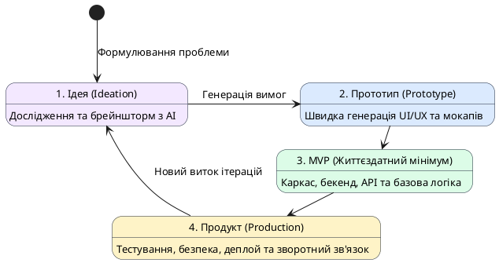

# Вплив AI на розробку програмного забезпечення

::card-group

::card{title="🎯 Мета розділу" icon="i-lucide-target"}

- Зрозуміти, як AI змінює роль та повсякденну роботу розробника.
- Побачити, які операції розробки AI здатний автоматизувати.
- Усвідомити концепцію взаємодії з кодом через природну мову.
- Зрозуміти, чому перевірка результатів AI стає ключовою навичкою.

::

::card{title="🔑 Ключові терміни" icon="i-lucide-key"}

- **Автоматизація розробки (*Development Automation*):** використання AI для прискорення рутинних операцій написання, тестування та розгортання коду.
- **Natural Language Programming:** взаємодія з програмним кодом за допомогою запитів природною мовою.
- **AI Code Review:** перевірка коду за допомогою AI-інструментів для виявлення помилок та покращення якості.
- **Vibe Coding:** підхід до розробки, де розробник описує бажаний результат природною мовою, а AI генерує відповідний код.

::

::

---

## Зміна ролі розробника

Протягом останніх десятиліть роль розробника вже зазнавала суттєвих трансформацій. Перші програмісти писали код у машинних кодах та асемблері, вручну керуючи кожним бітом пам'яті. Мови високого рівня (C, Java, Python) підняли абстракцію на новий рівень, дозволивши зосередитися на логіці замість деталей апаратного забезпечення. Фреймворки та бібліотеки ще більше спростили процес: замість написання HTTP-сервера з нуля розробник може використати готове рішення.

Поява AI-інструментів — це **наступний стрибок абстракції**. Якщо раніше розробник думав категоріями «яку функцію написати», то тепер він все частіше думає категоріями «яке завдання поставити AI». Це не означає, що технічні знання стають непотрібними — навпаки, вони стають ще важливішими, бо розробник повинен вміти **оцінити якість** того, що створив AI.

Сучасний розробник дедалі більше стає **інженером-архітектором**, який:
- формулює вимоги та ставить задачі (у тому числі для AI);
- обирає архітектурні рішення та технологічний стек;
- перевіряє та інтегрує результати роботи AI;
- несе відповідальність за якість кінцевого продукту.

::note
Аналогія: перехід від ручного написання коду до використання AI можна порівняти з переходом від ручного креслення до CAD-систем в архітектурі. Архітектори не зникли — їхня роль трансформувалася. Вони стали більш продуктивними та сфокусувалися на творчих та стратегічних аспектах роботи.
::

---

## Автоматизація операцій розробки

AI здатний автоматизувати значну частину рутинних операцій, які раніше забирали у розробника години та дні роботи:

::tabs
::tabs-item{label="Генерація коду"}
AI-інструменти (GitHub Copilot, Cursor, Cline) можуть генерувати код на основі коментарів, описів задач або навіть контексту файлу, в якому працює розробник. Наприклад, достатньо написати коментар «створити функцію сортування масиву за зростанням», і AI запропонує готову реалізацію.
::
::tabs-item{label="Тестування"}
AI може автоматично генерувати unit-тести, integration-тести та e2e-тести на основі аналізу коду. Це значно підвищує покриття тестами та допомагає виявити граничні випадки, про які розробник міг не подумати.
::
::tabs-item{label="Документація"}
Створення технічної документації, README-файлів, коментарів до коду, API-документації — все це AI може виконати значно швидше за людину, хоча результат потребує перевірки та редагування.
::
::tabs-item{label="Code Review"}
AI-інструменти можуть аналізувати pull-запити, виявляти потенційні проблеми безпеки, порушення стилю коду та антипатерни. Це не замінює рев'ю від колег, але доповнює його.
::
::tabs-item{label="Рефакторинг"}
AI допомагає покращувати структуру коду: перейменовувати змінні, витягувати методи, оптимізувати запити до бази даних та усувати дублювання коду.
::
::tabs-item{label="Дебагінг"}
Розробник може надіслати AI фрагмент коду з помилкою та стек-трейс, і отримати пояснення причини помилки та пропозицію виправлення.
::
::

---

## Скорочення часу створення цифрових продуктів

Одна з найбільш відчутних змін, які приніс AI у розробку — **драматичне скорочення часу** від ідеї до робочого прототипу.

Раніше створення MVP (*Minimum Viable Product* — мінімально життєздатний продукт) типового вебзастосунку могло зайняти тижні або місяці. Розробник мав вручну написати бекенд, фронтенд, налаштувати базу даних, створити систему авторизації, написати тести та документацію.

Із AI-інструментами цей процес може скоротитися до **днів або навіть годин** для простих продуктів. AI генерує базову структуру проєкту, шаблонний код, конфігурації, а розробник зосереджується на унікальній бізнес-логіці та користувацькому досвіді.

{.diagram-img}

::plant-uml{alt="Прискорення циклу розробки за допомогою AI"}



::

::warning
Швидкість створення не дорівнює якості. AI дозволяє швидше будувати, але без належної перевірки результатів можна так само швидко створити неякісний або небезпечний продукт. Відповідальність за якість залишається на розробнику.
::

---

## Взаємодія з програмним кодом за допомогою природної мови

Один із найбільш революційних аспектів сучасного AI — можливість **спілкуватися з кодом природною мовою**. Це явище іноді називають *vibe coding* — розробка, де ви описуєте бажаний результат словами, а AI перетворює ваш опис на код.

Як це виглядає на практиці? Замість того, щоб вручну писати SQL-запит, розробник може сказати AI: «Знайди всіх користувачів, які зареєструвалися за останній місяць, мають більше 10 замовлень, і відсортуй їх за датою реєстрації від найновіших до найстаріших». AI згенерує відповідний SQL-запит, який розробник перевірить та виконає.

Але тут криється важлива деталь: **щоб ефективно спілкуватися з AI мовою програмування, потрібно розуміти саму мову програмування**. Якщо ви не знаєте, що таке SQL, ви не зможете перевірити згенерований запит, виявити в ньому помилку чи оптимізувати його. Природна мова стає *інтерфейсом* до коду, але не замінює розуміння цього коду.

::tip
Думайте про природномовне програмування як про навігатор в автомобілі: він прокладає маршрут, але водієм залишаєтесь ви. Ви маєте розуміти дорожні знаки, оцінювати дорожню ситуацію та приймати рішення, коли навігатор помиляється.
::

---

## Перевірка результатів, створених AI

Оскільки AI стає невід'ємною частиною розробки, **навичка перевірки результатів** стає критично важливою. AI може генерувати код, що виглядає ідеально, але містить тонкі помилки — від логічних неточностей до вразливостей безпеки.

Що перевіряє AI Native Developer:

1. **Функціональність:** чи робить код те, що вимагалося? Чи обробляє граничні випадки?
2. **Безпека:** чи немає вразливостей (SQL-ін'єкції, витоки даних, небезпечна серіалізація)?
3. **Продуктивність:** чи не містить код неефективних алгоритмів або зайвих операцій?
4. **Читабельність:** чи зрозумілий код іншим розробникам? Чи дотримується стандартів команди?
5. **Фактичність:** якщо AI генерує пояснення або документацію — чи правдиві вони?

Ми детально розглянемо методи перевірки результатів AI у Модулі 4 цього курсу.

---

## Практичні завдання

::::accordion

:::accordion-item{label="📋 Завдання: Досліджуємо автоматизацію з AI" icon="i-lucide-clipboard-list"}

Задайте AI-асистенту запит:

```
Я вивчаю вплив AI на розробку ПЗ. Наведи 5 конкретних прикладів того, як AI
може автоматизувати рутинні завдання розробника. Для кожного прикладу вкажи:

1. Назву завдання
2. Як це робилося до AI (1-2 речення)
3. Як AI це автоматизує (1-2 речення)
4. Яка роль розробника залишається (1 речення)

Формат: нумерований список із підпунктами.
```

Проаналізуйте відповідь: чи всі приклади реалістичні? Чи є серед них перебільшення можливостей AI? Обговоріть з одногрупниками.

:::

:::accordion-item{label="📋 Завдання: Спробуйте «vibe coding»" icon="i-lucide-clipboard-list"}

Попросіть AI-асистент створити для вас просту програму, описавши її природною мовою. Наприклад:

```
Створи програму на Python, яка:
1. Запитує у користувача його ім'я та вік
2. Обчислює, в якому році користувач народився
3. Виводить привітання з цією інформацією
4. Якщо вік менше 0 або більше 150, виводить помилку

Додай коментарі до кожного рядка коду.
```

Спробуйте запустити цей код (можна використати онлайн-компілятор, наприклад replit.com або programiz.com). Чи працює він? Чи є помилки?

:::

::::

---

## Запитання для самоконтролю

::::accordion

:::accordion-item{label="❓ Чому технічні знання стають ще важливішими з появою AI?" icon="i-lucide-help-circle"}

AI генерує код та рішення, які потрібно оцінити, перевірити та інтегрувати. Без глибокого розуміння технологій розробник не зможе відрізнити правильний код від помилкового, виявити вразливості безпеки чи оптимізувати продуктивність. AI підвищує продуктивність того, хто розуміє предмет, але не може замінити розуміння.

:::

:::accordion-item{label="❓ Чи може AI повністю автоматизувати розробку ПЗ?" icon="i-lucide-help-circle"}

На сьогодні — ні. AI може автоматизувати окремі операції (генерація шаблонного коду, тестування, документація), але не може самостійно зрозуміти бізнес-контекст, визначити потреби користувача, прийняти архітектурне рішення з урахуванням всіх обмежень або нести відповідальність за наслідки. Розробник залишається ключовою ланкою, яка перетворює бізнес-потреби на технічні рішення.

:::

::::
