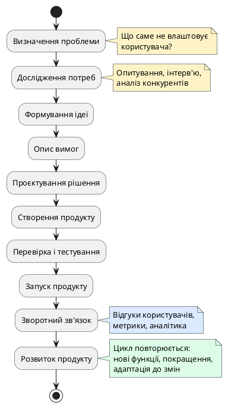

# Життєвий цикл цифрового продукту

::card-group

::card{title="🎯 Мета розділу" icon="i-lucide-target"}

- Зрозуміти повний шлях цифрового продукту від ідеї до безперервного розвитку.
- Усвідомити, що розробка — це не одноразова подія, а циклічний процес.
- Навчитися визначати, на якому етапі знаходиться продукт і що відбувається далі.
- Підготуватися до розуміння ролі AI на кожному з етапів.

::

::card{title="🔑 Ключові терміни" icon="i-lucide-key"}

- **Життєвий цикл продукту (*Product Lifecycle*):** послідовність етапів від виникнення ідеї до розвитку та еволюції продукту.
- **MVP (*Minimum Viable Product*):** мінімальна версія продукту з базовою функціональністю для перевірки гіпотези.
- **Ітерація (*Iteration*):** один цикл покращення продукту на основі зворотного зв'язку.
- **Зворотний зв'язок (*Feedback*):** інформація від користувачів про їхній досвід взаємодії з продуктом.

::

::

---

## Продукт як безперервний процес

Одна з найпоширеніших помилок початківців — уявлення про створення продукту як лінійний процес з чітким початком і кінцем: «Написав код → запустив → готово». Насправді успішний цифровий продукт — це **живий організм**, що постійно еволюціонує, адаптується до потреб користувачів та змін на ринку.

Подумайте про будь-який застосунок, яким ви користуєтесь. Чи виглядає він сьогодні так само, як у момент запуску? Безумовно ні. Instagram починався як простий додаток для фільтрів до фотографій, а перетворився на повноцінну соціальну мережу з Stories, Reels, магазином та месенджером. Google Maps починався як статичні карти, а став інтерактивною навігаційною системою з інформацією про трафік у реальному часі, оглядами Street View та інтеграцією з громадським транспортом.

Ця безперервна еволюція і є сутністю **життєвого циклу** цифрового продукту — послідовності етапів, які повторюються знову і знову, кожного разу покращуючи продукт.

---

## Етапи життєвого циклу

{.diagram-img}

::plant-uml{alt="Життєвий цикл цифрового продукту"}



::

---

## Визначення проблеми

Кожен успішний продукт починається з **чіткого формулювання проблеми**. Не з ідеї технічного рішення, не з бажання використати модну технологію, а з розуміння того, що саме турбує конкретну людину.

Формулювання проблеми має бути конкретним та перевірюваним. Порівняйте:
- ❌ «Людям незручно» — занадто абстрактно, неможливо виміряти.
- ✅ «Студенти коледжу витрачають у середньому 30 хвилин на пошук розкладу занять, бо він публікується у різних джерелах у різних форматах» — конкретна група людей, конкретна проблема, вимірюваний показник.

Хороше формулювання проблеми відповідає на три питання: **Хто** стикається з проблемою? **Що** їм заважає? **Чому** це важливо?

---

## Дослідження потреб користувача

Після визначення проблеми необхідно переконатися, що вона **дійсно існує** і є достатньо значущою, щоб виправдати створення продукту. Це етап дослідження, який включає:

- **Опитування та інтерв'ю** — пряме спілкування з потенційними користувачами для розуміння їхніх потреб, звичок та больових точок.
- **Аналіз конкурентів** — вивчення існуючих рішень: чому вони не задовольняють користувачів? Що можна зробити краще?
- **Аналіз даних** — якщо є доступ до статистики (наприклад, скільки звернень до техпідтримки стосуються конкретної проблеми).
- **Спостереження** — вивчення поведінки користувачів у їхньому природному середовищі.

::tip
Навіть для навчального проєкту варто провести міні-дослідження: опитайте 5-10 одногрупників, чи стикаються вони з проблемою, яку ви хочете вирішити. Це допоможе уникнути створення продукту, який нікому не потрібен.
::

---

## Формування ідеї та опис вимог

На основі дослідження формується **ідея рішення** — концепція продукту, що вирішить виявлену проблему. Далі ідея перетворюється на **список вимог** — конкретний опис того, що продукт має робити.

Вимоги поділяються на:
- **Функціональні** — що продукт має робити (наприклад, «користувач може створити обліковий запис за допомогою email»).
- **Нефункціональні** — як продукт має працювати (наприклад, «сторінка має завантажуватися менше ніж за 2 секунди»).

::note
На цьому етапі AI може бути корисним для генерації ідей, формулювання вимог та аналізу конкурентів. Але остаточне рішення щодо того, який продукт створювати, завжди приймає людина — бо вона знає контекст, бюджет, можливості та обмеження краще за будь-який AI.
::

---

## Проєктування, створення та тестування

**Проєктування** — це визначення архітектури системи, вибір технологій, створення прототипів інтерфейсу та планування роботи. На цьому етапі розробник визначає «як» буде реалізовано рішення.

**Створення** — безпосереднє написання коду, верстка інтерфейсу, налаштування баз даних та інфраструктури. Це те, що зазвичай асоціюється з «розробкою», хоча це лише один із багатьох етапів.

**Перевірка і тестування** — систематична перевірка того, що створений продукт працює коректно, відповідає вимогам та витримує навантаження. Цей етап включає не лише технічне тестування, а й перевірку з реальними користувачами (*user testing*).

---

## Запуск, зворотний зв'язок та розвиток

**Запуск** (*launch*) — момент, коли продукт стає доступним для користувачів. Це може бути публікація вебсайту, розміщення мобільного застосунку в магазині або розгортання внутрішньої системи для компанії.

**Зворотний зв'язок** (*feedback*) — збір інформації про те, як користувачі реально взаємодіють із продуктом. Це відгуки в магазинах застосунків, звернення до підтримки, дані аналітики (які функції використовуються найчастіше, де користувачі «застрягають»).

**Розвиток** (*evolution*) — покращення продукту на основі зворотного зв'язку: виправлення помилок, додавання нових функцій, оптимізація продуктивності. Після цього цикл починається знову: нові проблеми → нові дослідження → нові ідеї → нові версії.

::warning
Поширена помилка початківців — вважати, що після запуску робота завершена. Насправді запуск — це лише початок найважливішого етапу: навчання від реальних користувачів та ітеративного покращення продукту.
::

---

## Практичні завдання

::::accordion

:::accordion-item{label="📋 Завдання: Дослідіть життєвий цикл реального продукту (з AI)" icon="i-lucide-clipboard-list"}

Оберіть один з цих продуктів: **Telegram**, **monobank**, **Duolingo** або будь-який інший, яким ви активно користуєтесь.

Задайте AI-асистенту запит:

```
Розкажи про еволюцію продукту [назва продукту]:
1. Яку проблему він вирішував спочатку?
2. Яким був MVP (перша версія)?
3. Як продукт змінився з часом? (Назви 3-4 ключові зміни)
4. Яку роль відіграв зворотний зв'язок користувачів у розвитку?

Відповідай стисло, по 2-3 речення на кожен пункт.
```

Після отримання відповіді перевірте хоча б один факт через пошук в інтернеті. Чи все, що сказав AI, відповідає дійсності?

:::

:::accordion-item{label="📋 Завдання: Опишіть свій мікро-продукт" icon="i-lucide-clipboard-list"}

Придумайте простий цифровий продукт для студентів вашого коледжу та опишіть його життєвий цикл. Заповніть таблицю:

| Етап | Ваш опис |
|---|---|
| Проблема | |
| Хто стикається | |
| Ідея рішення | |
| 3 ключові функції MVP | |
| Як отримати зворотний зв'язок | |
| Яке перше покращення після запуску | |

Потім попросіть AI оцінити вашу ідею:

```
Оціни цю ідею цифрового продукту для студентів:
[вставте вашу таблицю]

Вкажи:
1. Сильні сторони ідеї (2-3 пункти)
2. Потенційні проблеми (2-3 пункти)
3. Що б ти порадив додати або змінити? (2-3 пункти)
```

:::

::::

---

## Запитання для самоконтролю

::::accordion

:::accordion-item{label="❓ Чому «запуск» — це не кінець, а початок?" icon="i-lucide-help-circle"}

До запуску продукт існує в контрольованому середовищі розробників. Після запуску він потрапляє у руки реальних користувачів, які взаємодіють з ним у непередбачуваних умовах. Саме в цей момент стають видимими справжні проблеми та можливості. Зворотний зв'язок від реальних користувачів — найцінніше джерело інформації для подальшого розвитку продукту.

:::

:::accordion-item{label="❓ Чому не можна пропустити етап дослідження потреб?" icon="i-lucide-help-circle"}

Без дослідження ви ризикуєте створити продукт, який вирішує неіснуючу проблему або вирішує її не так, як потрібно користувачам. Навіть технічно бездоганний продукт буде невдалим, якщо він не відповідає реальним потребам. Дослідження — це страховка від марного витрачення часу, зусиль та ресурсів.

:::

::::
