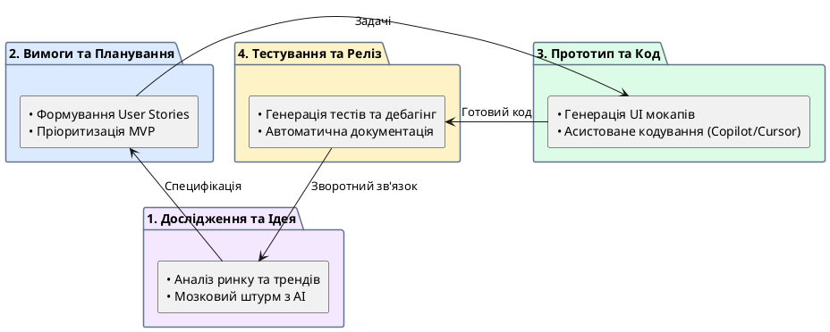

# Застосування AI на етапах створення цифрового продукту

::card-group

::card{title="🎯 Мета розділу" icon="i-lucide-target"}

- Побачити, як AI може допомогти на кожному етапі створення продукту.
- Зрозуміти, де AI найбільш ефективний і де його використання обмежене.
- Навчитися формулювати запити до AI для конкретних продуктових задач.
- Усвідомити, що AI — це інструмент для підсилення людських рішень, а не їх заміна.

::

::card{title="🔑 Ключові терміни" icon="i-lucide-key"}

- **Дослідження проблеми (*Problem Discovery*):** процес виявлення та формалізації проблем користувачів.
- **Генерація ідей (*Ideation*):** етап масового створення можливих рішень без фільтрації.
- **Прототипування (*Prototyping*):** швидке створення спрощеної версії продукту для перевірки концепції.
- **Код-рев'ю (*Code Review*):** процес перевірки коду на якість, безпеку та відповідність стандартам.

::

::

---

## AI на етапі дослідження проблеми

На самому початку — коли ми ще не знаємо, який продукт будувати — AI може стати потужним **дослідницьким інструментом**. Замість годин пошуку в інтернеті розробник може попросити AI структурувати наявну інформацію, виявити тренди та проаналізувати конкурентне середовище.

Наприклад, якщо ви хочете створити продукт для студентів, AI може допомогти:
- Згенерувати список типових проблем цільової аудиторії.
- Проаналізувати існуючі рішення та їхні слабкі сторони.
- Запропонувати питання для інтерв'ю з потенційними користувачами.
- Узагальнити результати дослідження у структурований звіт.

::warning
AI не може замінити реальне дослідження. Він оперує загальними знаннями, а не специфічними даними вашого ринку чи аудиторії. Використовуйте AI як відправну точку, але обов'язково перевіряйте його припущення через спілкування з реальними людьми.
::

---

## Генерація продуктових ідей

Після виявлення проблеми настає етап **генерації ідей** (*ideation*) — мозковий штурм, де кількість важливіша за якість. На цьому етапі AI виступає як невтомний «партнер для мозкового штурму», здатний запропонувати десятки варіантів за лічені хвилини.

AI особливо корисний для:
- **Розширення простору рішень.** Людина часто зациклюється на першій ідеї, що спала на думку. AI може запропонувати альтернативні підходи, про які ви не думали.
- **Комбінування концепцій.** AI може поєднати елементи різних продуктів у нову концепцію: «А що, якщо поєднати функціональність Trello з геймифікацією Duolingo для управління навчальними завданнями?»
- **Перевірки здійсненності.** AI може швидко оцінити технічну складність реалізації ідеї.

::tip
Під час генерації ідей з AI корисно використовувати техніку «Так, і...»: не відкидайте відразу запропоновані варіанти, а просіть AI розвинути їх далі. Наприклад: «Цікава ідея. А що, якщо додати до цього функцію X? Як це змінить концепцію?»
::

---

## Формування вимог та планування

Коли ідея обрана, потрібно перетворити її на **список конкретних вимог**. AI допомагає:

- Структурувати вимоги за категоріями (функціональні, нефункціональні, безпекові).
- Виявити потенційні прогалини: «Що станеться, якщо користувач введе некоректні дані?», «Як система поводитиметься при відсутності інтернет-з'єднання?»
- Пріоритизувати функції для MVP: що обов'язково потрібно в першій версії, а що можна додати пізніше.
- Декомпозувати великі задачі на менші, керовані етапи.

::steps

### Крок 1: Опис ідеї для AI
Сформулюйте короткий опис продукту: для кого, яку проблему вирішує, як саме.

### Крок 2: Запит на генерацію вимог
Попросіть AI створити список функцій, згрупованих за пріоритетом: «must have» (обов'язково), «should have» (бажано), «nice to have» (за можливості).

### Крок 3: Перевірка та доповнення
Перегляньте список і додайте те, що AI пропустив (зазвичай це специфічні потреби вашої аудиторії, яких немає в загальних знаннях AI).

### Крок 4: Планування реалізації
Попросіть AI розбити кожну функцію на технічні задачі з оцінкою складності.

::

---

## Створення прототипу та генерація коду

На етапі створення продукту AI стає **безпосереднім інструментом розробки**:

**Прототипування.** AI може швидко згенерувати HTML/CSS-прототип інтерфейсу на основі текстового опису. Це дозволяє побачити та оцінити ідею до повноцінної реалізації.

**Генерація коду.** AI-інструменти (GitHub Copilot, Cursor, Claude) генерують код на основі коментарів або опису задачі. Розробник описує, що потрібно зробити, а AI пропонує реалізацію.

**Аналіз коду.** AI може переглянути написаний код та запропонувати покращення: оптимізацію, рефакторинг, виправлення потенційних помилок.

---

## Пошук помилок та підготовка документації

**Пошук помилок (*debugging*).** AI може допомогти знайти причину помилки, якщо надати йому повідомлення про помилку, фрагмент коду та опис очікуваної поведінки. AI аналізує контекст і пропонує можливі причини та рішення.

**Документація.** Створення якісної документації — одне з найсильніших застосувань AI. Він може:
- Згенерувати README-файл для проєкту.
- Створити коментарі до коду та docstrings.
- Написати інструкції з розгортання для нових членів команди.
- Підготувати опис API для зовнішніх розробників.

{.diagram-img}

::plant-uml{alt="Роль AI на етапах створення цифрового продукту"}



::

---

## Практичні завдання

::::accordion

:::accordion-item{label="📋 Завдання: Повний цикл з AI" icon="i-lucide-clipboard-list"}

Пройдіть міні-версію повного циклу створення продукту з допомогою AI. Кожен крок — окремий запит до AI-асистента:

**Крок 1 — Дослідження:** Задайте AI запит:
```
Які 5 найпоширеніших проблем студентів коледжу у повсякденному навчанні?
Для кожної проблеми вкажи: опис проблеми, наскільки вона поширена (оцінка 1-5),
чи існують цифрові рішення.
```

**Крок 2 — Ідея:** Оберіть одну проблему та попросіть AI:
```
Запропонуй 3 різні концепції цифрового продукту для вирішення проблеми:
"[вставте обрану проблему]". Для кожної концепції вкажи: назву, ключову ідею,
3 основні функції, цільову аудиторію.
```

**Крок 3 — Вимоги:** Оберіть одну концепцію та попросіть AI:
```
Створи список вимог для MVP продукту "[назва]". Згрупуй за пріоритетами:
Must Have (5 функцій), Should Have (3 функції), Nice to Have (2 функції).
Для кожної функції — одне речення опису.
```

Зверніть увагу: на кожному кроці ви приймаєте рішення — що обрати, що відкинути. AI пропонує — ви вирішуєте.

:::

:::accordion-item{label="📋 Завдання: AI для документації" icon="i-lucide-clipboard-list"}

Попросіть AI створити README-файл для вигаданого навчального проєкту:

```
Створи README.md файл для навчального проєкту "StudentHelper" — вебзастосунок
для відстеження дедлайнів студентських завдань.

Структура README:
1. Назва проєкту та короткий опис (2-3 речення)
2. Функціональність (список із 5 пунктів)
3. Технології (перелічи типові технології для вебзастосунку)
4. Як запустити (3-4 кроки)
5. Автори

Мова: українська. Стиль: лаконічний, технічний.
```

Оцініть результат: чи зрозумілий текст для іншого розробника? Чи немає помилок?

:::

::::

---

## Запитання для самоконтролю

::::accordion

:::accordion-item{label="❓ На якому етапі AI найбільш корисний і чому?" icon="i-lucide-help-circle"}

AI найбільш ефективний на етапах, де потрібна обробка великих обсягів інформації та генерація варіантів: дослідження ринку, генерація ідей, створення шаблонного коду та документації. На цих етапах AI значно перевершує людину у швидкості. Водночас на етапах, що вимагають глибокого розуміння контексту (визначення проблеми, прийняття архітектурних рішень), AI виступає лише як помічник, а не замінник людського судження.

:::

:::accordion-item{label="❓ Чому не можна повністю делегувати дослідження проблеми AI?" icon="i-lucide-help-circle"}

AI оперує загальними знаннями та не має доступу до специфічного контексту вашого ринку, аудиторії та ситуації. Він може перерахувати типові проблеми студентів, але не знає, що конкретно турбує студентів вашого коледжу, вашої групи, у вашому місті. Реальне дослідження (інтерв'ю, спостереження, опитування) незамінне для валідації гіпотез, сформованих за допомогою AI.

:::

::::
