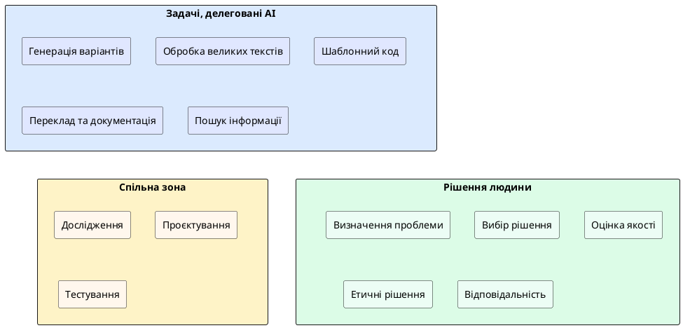

# Розподіл завдань між людиною та AI

::card-group

::card{title="🎯 Мета розділу" icon="i-lucide-target"}

- Навчитися визначати, які задачі можна делегувати AI, а які вимагають людського судження.
- Зрозуміти принцип «AI пропонує — людина вирішує».
- Усвідомити, що відповідальність за результат завжди залишається за людиною.
- Виробити критерії для прийняття рішення: «AI чи людина?»

::

::card{title="🔑 Ключові терміни" icon="i-lucide-key"}

- **Делегування AI (*AI Delegation*):** передача частини завдань AI-системі для підвищення ефективності.
- **Human-in-the-Loop:** модель роботи, де AI виконує операцію, а людина перевіряє та затверджує результат.
- **Критичне рішення (*Critical Decision*):** рішення з високими наслідками помилки, яке має приймати людина.
- **Автоматизована задача (*Automated Task*):** повторювана операція, яку AI може виконувати без постійного контролю.

::

::

---

## Принцип розподілу: де AI сильний, де людина незамінна

Ключ до ефективної роботи з AI — розуміння **зон компетенції** кожної сторони. AI та людина мають принципово різні сильні та слабкі сторони, і мистецтво AI Native Developer полягає у правильному розподілі задач між ними.

**AI перевершує людину** в задачах, що вимагають:
- обробки великих обсягів тексту за короткий час;
- генерації великої кількості варіантів (ідей, формулювань, структур);
- виконання повторюваних, шаблонних операцій;
- аналізу структурованих даних та виявлення патернів;
- швидкого переключення між різними доменами знань.

**Людина незамінна** в задачах, що вимагають:
- розуміння контексту (бізнесу, культури, конкретної ситуації);
- емпатії та розуміння емоцій інших людей;
- прийняття рішень з урахуванням етичних та моральних аспектів;
- творчого мислення на стику дисциплін;
- відповідальності за наслідки рішень.

{.diagram-img}

::plant-uml{alt="Розподіл задач між людиною та AI"}



::

---

## Задачі, що передаються AI

Існує цілий клас задач, де AI працює ефективніше за людину. Делегування цих задач звільняє час розробника для більш стратегічної роботи.

**Генерація чернеток та першого драфту.** AI може швидко створити першу версію тексту (опис продукту, документацію, email), яку людина потім редагує та адаптує. Це набагато ефективніше, ніж починати з «чистого аркуша».

**Пошук та узагальнення інформації.** Замість годинного пошуку в інтернеті AI може швидко зібрати та структурувати інформацію з певної теми, надавши стислий огляд.

**Рутинні операції з кодом.** Написання бойлерплейт-коду (шаблонних структур), конвертація між форматами даних, генерація тестових даних — усе це AI робить швидше і без втоми.

**Переклад та локалізація.** AI може перекласти інтерфейс або документацію на інші мови, хоча результат потребує перевірки носієм мови.

---

## Завдання, що потребують участі людини

Є задачі, де AI або неспроможний, або його використання було б небезпечним:

**Розуміння бізнес-контексту.** AI не знає специфіки вашої компанії, вашого ринку, ваших обмежень (бюджет, терміни, технічний борг). Тільки людина може врахувати все це при прийнятті рішення.

**Емпатія та UX-дизайн.** Створення по-справжньому зручного інтерфейсу вимагає розуміння того, як почувається користувач. AI може запропонувати шаблон, але не відчуває фрустрацію від незрозумілої навігації.

**Етичні рішення.** Чи етично збирати ці дані? Чи не дискримінує алгоритм певні групи людей? Чи відповідає продукт правовим нормам? Ці питання вимагають людського судження.

**Комунікація з людьми.** Переговори з замовником, мотивація команди, вирішення конфліктів — усе це зони, де людська емоційна інтелігентність незамінна.

---

## Рішення, які приймає людина

Фундаментальний принцип AI Native Developer: **AI генерує варіанти, людина приймає рішення**. Це стосується всіх рівнів:

- **Стратегічні рішення:** який продукт будувати, для якої аудиторії, на якому ринку конкурувати.
- **Архітектурні рішення:** яку технологію використати, як структурувати систему, які компроміси прийняти.
- **Тактичні рішення:** який із запропонованих AI варіантів коду обрати, який баг виправити першим, яку функцію реалізувати наступною.
- **Етичні рішення:** як поводитися з даними користувачів, чи прийнятний певний алгоритм, чи потрібно обмежити функціональність.

::caution
Ніколи не перекладайте на AI прийняття рішень, наслідки яких ви не готові контролювати. «AI так порадив» — це не виправдання помилки. Відповідальність за продукт несе людина, яка його створила.
::

---

## Перевірка результатів роботи AI

Кожен результат, отриманий від AI, потребує перевірки. Ступінь перевірки залежить від критичності задачі:

| Рівень критичності | Приклад задачі | Глибина перевірки |
|---|---|---|
| **Низький** | Генерація варіантів назви продукту | Швидкий огляд, вибір кращого |
| **Середній** | Створення структури документації | Перевірка повноти, логіки, коректності |
| **Високий** | Генерація коду для обробки платежів | Рядок за рядком, тестування, рев'ю колег |
| **Критичний** | Рекомендації щодо безпеки даних | Перехресна перевірка з офіційними джерелами |

::note
Правило: чим серйозніші наслідки помилки, тим ретельнішою має бути перевірка результатів AI. Генерація ідей для мозкового штурму вимагає мінімальної перевірки. Код, що обробляє фінансові дані, — максимальної.
::

---

## Відповідальність людини за кінцевий результат

Це, мабуть, **найважливіший принцип** усього курсу: незалежно від того, наскільки активно ви використовуєте AI, **відповідальність за результат завжди несе людина**.

Якщо AI згенерував код із вразливістю безпеки, і ви його використали без перевірки — відповідальність на вас. Якщо AI написав текст із фактичними помилками, і ви його опублікували — відповідальність на вас. Якщо AI запропонував рішення, яке порушує авторські права, і ви його реалізували — відповідальність на вас.

Це не означає, що не варто використовувати AI. Це означає, що AI Native Developer повинен:
1. **Розуміти**, що робить AI та які ризики це несе.
2. **Перевіряти** результати відповідно до їхньої критичності.
3. **Брати на себе відповідальність** за кінцевий продукт.

---

## Практичні завдання

::::accordion

:::accordion-item{label="📋 Завдання: Класифікація задач" icon="i-lucide-clipboard-list"}

Нижче наведено список задач. Для кожної визначте: **AI**, **Людина** або **Спільно** (AI генерує, людина перевіряє). Обґрунтуйте свій вибір одним реченням.

1. Написати вітальне повідомлення для нового користувача
2. Вирішити, чи додавати функцію збору геолокації
3. Знайти та виправити синтаксичну помилку в коді
4. Визначити цільову аудиторію продукту
5. Згенерувати 20 варіантів назви застосунку
6. Перевірити, чи відповідає продукт вимогам GDPR
7. Створити README.md для репозиторію
8. Провести інтерв'ю з потенційним користувачем

Після самостійної роботи перевірте свої відповіді, запитавши AI:

```
Для кожної задачі визнач, хто має її виконувати: AI, Людина, або Спільно.
Обґрунтуй кожен вибір. Ось задачі:
[вставте список]
```

Порівняйте свої відповіді з відповідями AI. Де ви погоджуєтесь? Де ні? Чому?

:::

:::accordion-item{label="📋 Завдання: Визначте зону відповідальності" icon="i-lucide-clipboard-list"}

Уявіть ситуацію: ви використали AI для генерації коду реєстрації користувачів. AI створив форму, яка зберігає паролі у відкритому вигляді (без шифрування). Ви не перевірили код і опублікували продукт.

Запитайте AI:

```
Я використав AI для генерації коду реєстрації користувачів. AI створив код,
який зберігає паролі без шифрування. Я не помітив цього і опублікував продукт.

Поясни:
1. Які наслідки може мати ця помилка?
2. Хто несе відповідальність?
3. Як я мав перевірити цей код перед публікацією?
4. Який чек-лист перевірки безпеки ти рекомендуєш?
```

Зафіксуйте, що відповідальність — на вас, а не на AI. Це ключовий урок.

:::

::::

---

## Запитання для самоконтролю

::::accordion

:::accordion-item{label="❓ Чому правильний розподіл задач між AI та людиною — це навичка, а не знання?" icon="i-lucide-help-circle"}

Тому що правильний розподіл залежить від конкретного контексту: типу задачі, рівня критичності, доступних ресурсів, дедлайнів та компетенцій розробника. Не існує універсального списку «це для AI, це для людини». Досвідчений AI Native Developer інтуїтивно відчуває, де AI буде корисним, а де ризикованим, і ця інтуїція розвивається через практику, помилки та рефлексію.

:::

:::accordion-item{label="❓ Чи існує задача, яку можна повністю довірити AI без перевірки?" icon="i-lucide-help-circle"}

Практично ні. Навіть для найпростіших задач (переклад одного слова, конвертація одиниць вимірювання) AI може допустити помилку. Ступінь перевірки може бути мінімальним (швидкий погляд на результат), але повна відсутність контролю — це завжди ризик. Чим менші наслідки помилки, тим менша перевірка потрібна, але нульова перевірка — небезпечна.

:::

::::
