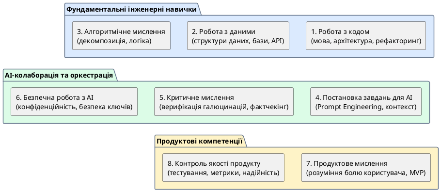

# Компетенції AI Native Developer

::card-group

::card{title="🎯 Мета розділу" icon="i-lucide-target"}

- Визначити набір ключових компетенцій AI Native Developer.
- Зрозуміти, чому технічних навичок недостатньо для сучасного розробника.
- Побачити зв'язок між компетенціями та етапами створення продукту.
- Скласти початковий план особистого розвитку.

::

::card{title="🔑 Ключові терміни" icon="i-lucide-key"}

- **Продуктове мислення (*Product Thinking*):** здатність дивитися на технічне рішення з позиції користувача та бізнесу.
- **Алгоритмічне мислення (*Algorithmic Thinking*):** вміння розбивати складну задачу на послідовність простих кроків.
- **Критичне мислення (*Critical Thinking*):** здатність аналізувати інформацію, виявляти помилки та приймати обґрунтовані рішення.
- **Prompt Engineering:** мистецтво формулювання запитів до AI для отримання якісних результатів.

::

::

---

## Вісім стовпів компетентності

AI Native Developer — це не просто програміст з ChatGPT. Це професіонал з унікальним набором компетенцій, який поєднує технічні навички з критичним мисленням, продуктовою інтуїцією та відповідальним ставленням до використання AI.

{.diagram-img}

::plant-uml{alt="Модель компетенцій AI Native Developer"}



::

---

## Продуктове мислення

**Продуктове мислення** — це здатність дивитися на будь-яке технічне рішення через призму користувача та бізнесу. Це відповідь на питання «навіщо?» перед питанням «як?».

Розробник із продуктовим мисленням не просто виконує задачі зі списку — він розуміє *контекст*. Він запитує: «Для кого ця функція? Яку проблему вона вирішує? Як ми дізнаємося, що вона працює?» Без продуктового мислення розробник ризикує створити технічно бездоганне, але абсолютно непотрібне рішення.

---

## Алгоритмічне мислення

**Алгоритмічне мислення** — це вміння перетворити складну проблему на послідовність простих, керованих кроків. Це фундаментальна навичка, яка потрібна не лише для написання коду, а й для будь-якої структурованої діяльності.

Коли AI Native Developer отримує складну задачу, він не намагається вирішити її цілком за один крок. Він **декомпозує** її: розбиває на підзадачі, визначає залежності між ними, обирає порядок виконання. Ця ж навичка критична для роботи з AI: замість одного величезного промпта ефективніше розбити задачу на серію менших, послідовних запитів.

---

## Робота з кодом та даними

Навіть у епоху AI, коли значну частину коду генерують машини, **глибоке розуміння програмування** залишається критично важливим. AI Native Developer повинен:

- **Читати та розуміти код**, згенерований AI, щоб оцінити його якість.
- **Знати мови програмування** достатньо глибоко, щоб виявити тонкі помилки.
- **Розуміти структури даних та алгоритми**, щоб оцінити ефективність рішення.
- **Працювати з базами даних**, API та інфраструктурними інструментами.

::warning
Спокуса «не вивчати програмування, бо AI все напише» — це пастка. Без розуміння коду ви не зможете оцінити, чи правильний він, чи безпечний, чи ефективний. Це як намагатися перевірити медичний рецепт, не знаючи медицини.
::

---

## Постановка завдань для AI (Prompt Engineering)

Ця компетенція є **унікальною для AI Native Developer** і не мала аналогу у попередніх поколіннях розробників. Prompt Engineering — це мистецтво формулювання запитів до AI таким чином, щоб отримати максимально корисний та точний результат.

Ми детально розглянемо цю тему в Модулі 3, але загальний принцип: якість відповіді AI прямо залежить від якості запиту. Два запити на одну й ту саму тему, але з різним формулюванням, можуть дати кардинально різні результати.

---

## Критичне мислення та контроль якості

**Критичне мислення** — це, мабуть, найважливіша навичка в арсеналі AI Native Developer. Це здатність не приймати інформацію «на віру», а аналізувати її, ставити під сумнів та перевіряти.

У контексті роботи з AI критичне мислення означає:
- Розрізняти факти та припущення у відповідях AI.
- Виявляти логічні помилки та протиріччя.
- Перевіряти фактичну інформацію через незалежні джерела.
- Оцінювати повноту та релевантність відповіді.

**Контроль якості** — практичне втілення критичного мислення: тестування коду, створення чек-листів перевірки, систематичне рев'ю результатів.

---

## Безпечна та відповідальна робота з AI

Остання, але не менш важлива компетенція — **відповідальне використання AI**. Це включає:

- **Захист даних:** не передавати AI персональні дані, паролі, конфіденційну інформацію.
- **Авторське право:** розуміти, кому належать результати роботи AI та які обмеження існують.
- **Академічна доброчесність:** розрізняти допомогу AI та плагіат, коректно зазначати використання AI.
- **Етика:** усвідомлювати можливу упередженість AI та її наслідки.

Ці теми ми детально розглянемо в Модулі 4.

---

## Практичні завдання

::::accordion

:::accordion-item{label="📋 Завдання: Оцініть свої компетенції" icon="i-lucide-clipboard-list"}

Для кожної з восьми компетенцій AI Native Developer оцініть свій поточний рівень за шкалою від 1 до 5:

| Компетенція | Рівень (1-5) | Що я вже вмію | Що хочу покращити |
|---|---|---|---|
| Продуктове мислення | | | |
| Алгоритмічне мислення | | | |
| Робота з кодом | | | |
| Робота з даними | | | |
| Prompt Engineering | | | |
| Критичне мислення | | | |
| Контроль якості | | | |
| Безпечна робота з AI | | | |

Потім задайте AI запит:

```
Я студент коледжу, що починає шлях AI Native Developer.
Мої найслабші сторони: [вкажіть 2-3 компетенції з найнижчим рівнем].
Запропонуй конкретний план покращення кожної з них на наступні 3 місяці.
Для кожної компетенції: 2-3 конкретні дії та 1 ресурс для вивчення.
```

:::

::::

---

## Запитання для самоконтролю

::::accordion

:::accordion-item{label="❓ Яка компетенція є найважливішою для AI Native Developer?" icon="i-lucide-help-circle"}

Однозначної відповіді немає — це залежить від контексту. Проте **критичне мислення** часто називають найважливішою, бо без нього всі інші компетенції втрачають ефективність. Можна чудово формулювати промпти, але якщо ви не перевіряєте результати — це небезпечно. Можна знати програмування, але якщо ви сліпо довіряєте згенерованому коду — це ризиковано. Критичне мислення — це фундамент, на якому тримаються всі інші навички.

:::

::::
