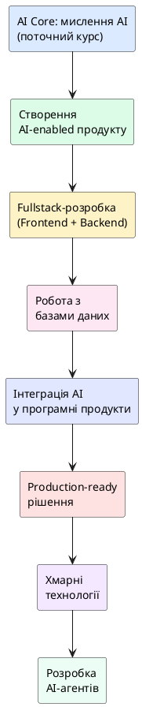

# Карта професійного розвитку AI Native Developer

::card-group

::card{title="🎯 Мета розділу" icon="i-lucide-target"}

- Побачити довгостроковий шлях розвитку в професії AI Native Developer.
- Зрозуміти, які навички потрібні на кожному етапі кар'єри.
- Усвідомити, що поточний курс — лише початок великого шляху.
- Скласти власне бачення кар'єрного напрямку.

::

::card{title="🔑 Ключові терміни" icon="i-lucide-key"}

- **AI-enabled продукт:** цифровий продукт, що використовує AI як одну зі своїх ключових функцій.
- **Fullstack-розробка:** створення повноцінних продуктів, що включає frontend, backend та базу даних.
- **Production-ready рішення:** продукт, готовий до використання реальними користувачами в реальних умовах.
- **AI-агент (*AI Agent*):** автономна програмна система на базі AI, здатна самостійно виконувати послідовність дій для досягнення мети.

::

::

---

## Загальна карта розвитку

Професія AI Native Developer — це не статичний набір навичок, а **динамічний шлях** безперервного розвитку. Технології змінюються, з'являються нові інструменти та підходи, і розробник має постійно адаптуватися.

Нижче наведена карта розвитку, яка показує типову послідовність етапів від початківця до досвідченого спеціаліста:

{.diagram-img}

::plant-uml{alt="Карта професійного розвитку AI Native Developer"}



::

---

## Створення AI-enabled продукту

Наступний крок після цього курсу — навчитися **створювати продукти, що використовують AI як ключову функцію**. Це не означає створення власної мовної моделі (це завдання для ML-інженерів). Це означає вміння інтегрувати існуючі AI-сервіси у свій продукт.

Наприклад:
- Чат-бот для підтримки клієнтів, побудований на API ChatGPT.
- Система автоматичного узагальнення документів.
- Генератор персоналізованих рекомендацій.
- Асистент для навчання з адаптивним рівнем складності.

---

## Fullstack-розробка та бази даних

Для створення повноцінних продуктів AI Native Developer повинен опанувати **fullstack-розробку** — здатність створити всі компоненти продукту:

- **Frontend:** інтерфейс, з яким взаємодіє користувач (HTML, CSS, JavaScript, React/Vue/Angular).
- **Backend:** серверна логіка, API, авторизація (Node.js, Python, Go, C#).
- **Бази даних:** зберігання та управління даними (PostgreSQL, MongoDB, Redis).

Ці навички дають повну автономію: ви можете самостійно створити продукт від ідеї до робочого прототипу.

---

## Інтеграція AI та production-ready рішення

На наступних етапах розвитку AI Native Developer навчається:

**Інтегрувати AI у програмні продукти** — підключати API мовних моделей (OpenAI API, Google AI API, Anthropic API), використовувати техніки RAG (*Retrieval-Augmented Generation*), створювати промптові ланцюжки (*prompt chains*) та будувати повноцінні AI-функції у продукті.

**Створювати production-ready рішення** — продукти, готові до використання реальними користувачами. Це включає обробку помилок, моніторинг, логування, масштабування, безпеку та автоматизоване розгортання.

---

## Хмарні технології та AI-агенти

Найпросунутіші рівні розвитку:

**Хмарні технології** — розгортання та масштабування продуктів у хмарі (AWS, Google Cloud, Azure). Контейнеризація (Docker, Kubernetes), serverless-архітектура, керовані сервіси AI.

**Розробка AI-агентів** — створення автономних AI-систем, здатних самостійно виконувати складні послідовності дій: планувати, шукати інформацію, приймати рішення, взаємодіяти з зовнішніми сервісами. Це передній край індустрії, де зараз відбувається найбільше інновацій.

::tip
Не намагайтеся охопити все одразу. Фокусуйтесь на поточному етапі — засвоєнні AI-мислення. Кожна наступна сходинка стоїть на фундаменті попередньої. Без розуміння принципів постановки задач для AI та перевірки результатів усі технічні навички будуть неповними.
::

---

## Практичні завдання

::::accordion

:::accordion-item{label="📋 Завдання: Дослідіть ринок вакансій з AI" icon="i-lucide-clipboard-list"}

Задайте AI-асистенту запит:

```
Які навички зараз найбільш затребувані для розробників, що працюють з AI?
Проаналізуй ринок вакансій та назви:
1. Топ-5 технічних навичок (з прикладами технологій)
2. Топ-3 soft skills
3. Типові посади та діапазон зарплат для початківців
4. Які нові ролі з'явились завдяки AI за останні 2 роки?

Фокус: ринок України та Європи.
```

Після отримання відповіді перевірте інформацію, переглянувши 5-10 реальних вакансій на DOU, djinni або LinkedIn. Чи збігається відповідь AI з реальністю?

:::

:::accordion-item{label="📋 Завдання: Складіть особистий план розвитку" icon="i-lucide-clipboard-list"}

На основі карти розвитку та самооцінки компетенцій (з попереднього розділу) попросіть AI допомогти скласти план:

```
Я студент коледжу, спеціальність "Інженерія програмного забезпечення".
Мій рівень: початківець у програмуванні, базові знання [вкажіть мову].
Мета: стати AI Native Developer протягом 2 років.

Створи поетапний план розвитку:
- 4 етапи (по 6 місяців кожен)
- Для кожного етапу: 3 ключові навички + 2 конкретні ресурси
- В кінці кожного етапу: 1 проєкт-портфоліо для демонстрації навичок

Формат: таблиця з 5 стовпцями (етап, період, навички, ресурси, проєкт).
```

Пам'ятайте: AI дає загальні рекомендації. Адаптуйте план під свої реальні обставини, інтереси та можливості.

:::

::::

---

## Запитання для самоконтролю

::::accordion

:::accordion-item{label="❓ Чому AI Native Developer починає з мислення, а не з технологій?" icon="i-lucide-help-circle"}

Технології змінюються кожні кілька років: фреймворки застарівають, мови програмування еволюціонують, AI-моделі стають потужнішими. Але принципи мислення — критичний аналіз, продуктовий підхід, вміння ставити задачі, перевіряти результати та нести відповідальність — залишаються актуальними незалежно від технологічного стеку. Навчившись правильно мислити, ви зможете швидко опанувати будь-яку нову технологію.

:::

:::accordion-item{label="❓ Чи потрібно вивчати програмування, якщо AI може писати код?" icon="i-lucide-help-circle"}

Однозначно так. AI генерує код на основі статистичних закономірностей, але не розуміє його семантику, не гарантує безпеку та не може нести відповідальність за помилки. Розробник, який не розуміє код, не може перевірити роботу AI, виявити вразливості або оптимізувати рішення. Знання програмування — це основа, яка дозволяє ефективно використовувати AI як інструмент, а не сліпо довіряти його результатам.

:::

::::
