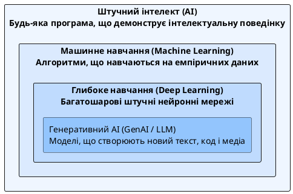

# Штучний інтелект

::card-group

::card{title="🎯 Мета розділу" icon="i-lucide-target"}

- Сформувати точне розуміння терміну «штучний інтелект».
- Простежити еволюцію AI від перших досліджень до сучасності.
- Побачити приклади застосування AI у повсякденному житті.
- Зрозуміти різницю між наукою про AI та медійними стереотипами.

::

::card{title="🔑 Ключові терміни" icon="i-lucide-key"}

- **Штучний інтелект (*Artificial Intelligence, AI*):** галузь інформатики, що створює системи, здатні виконувати завдання, які зазвичай вимагають людського інтелекту.
- **Вузький AI (*Narrow AI / ANI*):** AI-система, спеціалізована на одній конкретній задачі.
- **Загальний AI (*General AI / AGI*):** гіпотетична AI-система, здатна виконувати будь-яке інтелектуальне завдання на рівні людини.
- **Тест Тюрінга (*Turing Test*):** критерій оцінки «розумності» машини, запропонований Аланом Тюрінгом у 1950 році.

::

::

---

## Що таке штучний інтелект

Термін **штучний інтелект** (*Artificial Intelligence, AI*) часто оточений містифікацією та перебільшеннями. У фільмах AI зображується як свідомий робот, що бунтує проти людства. У маркетингових матеріалах — як магічна технологія, що вирішує будь-яку проблему. Реальність — значно цікавіша та тонша.

**Штучний інтелект** — це галузь інформатики (*computer science*), що займається створенням програмних систем, здатних виконувати завдання, які традиційно вимагають людського інтелекту: розпізнавання мовлення, аналіз зображень, прийняття рішень, переклад мов, генерація тексту.

Ключове слово тут — **«виконувати завдання»**, а не «думати» чи «розуміти». Сучасний AI не має свідомості, не розуміє зміст інформації, яку обробляє, і не має власних бажань чи мотивації. Він вражаюче ефективно **імітує** певні аспекти інтелектуальної діяльності, використовуючи математичні моделі та статистичні закономірності.

::warning
Важливо: AI — це не одна технологія, а ціла сфера з десятками підходів, методів та технологій. Коли хтось каже «AI», потрібно уточнювати: який саме AI? Для якої задачі? На якій технології побудований? Це допоможе уникнути типових помилок у розумінні та очікуваннях.
::

---

## Цілі та завдання штучного інтелекту

Основна мета AI як наукової дисципліни — **створити системи, що автоматизують інтелектуальну діяльність людини**. Це включає:

- **Сприйняття:** здатність системи «бачити» (комп'ютерний зір), «чути» (розпізнавання мовлення) та «читати» (обробка тексту).
- **Міркування:** здатність аналізувати інформацію, робити висновки та приймати рішення.
- **Навчання:** здатність покращувати свою роботу на основі досвіду (даних), без явного програмування кожної дії.
- **Взаємодія:** здатність спілкуватися з людиною природною мовою.
- **Генерація:** здатність створювати нові артефакти — текст, зображення, музику, код.

{.diagram-img}

::plant-uml{alt="Ієрархія технологій штучного інтелекту"}



::

---

## Еволюція штучного інтелекту

Історія AI — це не лінійний прогрес, а серія зльотів та падінь, періодів ентузіазму та розчарувань:

::steps

### Народження AI (1950-ті)
Алан Тюрінг публікує статтю «Computing Machinery and Intelligence» (1950), де ставить питання: «Чи можуть машини мислити?» У 1956 році на конференції в Дартмуті вперше використано термін «Artificial Intelligence». Перші програми вирішують логічні задачі та грають у шахи.

### Перша хвиля ентузіазму (1960–1970-ті)
Дослідники вірять, що створення загального AI — питання кількох років. Створюються перші експертні системи, чат-боти (ELIZA, 1966), програми для доведення теорем.

### «AI-зима» (1970–1980-ті)
Оптимізм зіштовхнувся з реальністю: обчислювальна потужність недостатня, даних замало, методи не масштабуються. Фінансування різко скорочується.

### Друга хвиля: Експертні системи (1980-ті)
Системи, побудовані на правилах «якщо — то», успішно застосовуються в медичній діагностиці та бізнесі. Але вони вимагають ручного введення знань і погано адаптуються.

### Machine Learning та Big Data (2000–2010-ті)
Зростання обчислювальних потужностей та обсягів даних дозволяє застосувати статистичні методи навчання. Глибинне навчання (*deep learning*) демонструє проривні результати в розпізнаванні зображень та мовлення.

### Ера генеративного AI (2020-ті)
ChatGPT (2022) демонструє масовій аудиторії можливості великих мовних моделей. AI стає доступним для кожного через простий текстовий інтерфейс. Починається ера AI Native Development.

::

---

## Застосування AI у повсякденному житті

Багато хто вважає AI чимось футуристичним, не помічаючи, що вже щодня взаємодіє з AI-системами:

- **Рекомендації:** Netflix рекомендує фільми, Spotify — музику, YouTube — відео. За кожною рекомендацією стоїть AI-модель, що аналізує ваші вподобання.
- **Навігація:** Google Maps прогнозує час у дорозі, враховуючи поточний трафік, погоду та історичні дані.
- **Фотографія:** Камера вашого смартфона використовує AI для покращення якості фото, розпізнавання облич та автоматичного налаштування.
- **Голосові асистенти:** Siri, Google Assistant, Alexa розпізнають мовлення та виконують команди.
- **Фільтри спаму:** Поштові сервіси використовують AI для розпізнавання небажаних листів.
- **Автозаповнення:** Клавіатура вашого смартфона передбачає наступне слово за допомогою мовної моделі.

::note
Задумайтесь: скільки разів за сьогоднішній день ви взаємодіяли з AI, навіть не усвідомлюючи цього? Розблокування телефону обличчям, отримання рекомендацій у соціальних мережах, автоматичний переклад коментаря іноземною мовою — все це AI у дії.
::

---

## Практичні завдання

::::accordion

:::accordion-item{label="📋 Завдання: Знайдіть AI навколо себе" icon="i-lucide-clipboard-list"}

Протягом одного дня фіксуйте всі випадки, коли ви взаємодієте з AI-системами. Запишіть кожен випадок у таблицю:

| Час | Ситуація | AI-система | Що вона робить |
|---|---|---|---|
| 8:00 | Розблокував телефон | Face ID | Розпізнавання обличчя |
| ... | ... | ... | ... |

Після заповнення задайте AI:

```
Ось список AI-систем, з якими я взаємодіяв за день:
[вставте свою таблицю]

Для кожної з них поясни:
1. Який тип AI використовується (класифікація, рекомендація, генерація тощо)?
2. На яких даних ця система навчалася?
3. Що станеться, якщо ця AI-система помилиться?
```

:::

:::accordion-item{label="📋 Завдання: Розвінчайте міф про AI" icon="i-lucide-clipboard-list"}

Задайте AI запит:

```
Назви 5 найпоширеніших міфів про штучний інтелект серед звичайних людей.
Для кожного:
1. Сформулюй міф (1 речення)
2. Поясни реальність (2-3 речення)
3. Чому цей міф виник (1 речення)
```

Оберіть один міф, який вас здивував, та обговоріть його з одногрупниками. Чи вірили вони в цей міф до сьогодні?

:::

::::

---

## Запитання для самоконтролю

::::accordion

:::accordion-item{label="❓ Чи «думає» сучасний AI?" icon="i-lucide-help-circle"}

Ні. Сучасний AI не має свідомості, розуміння чи суб'єктивного досвіду. Він обробляє дані за допомогою математичних моделей і генерує результати на основі статистичних закономірностей, знайдених під час навчання. Коли ChatGPT «відповідає» на ваше питання, він не розуміє його зміст — він передбачає найбільш імовірну послідовність слів-відповіді на основі патернів, виявлених у мільярдах текстів.

:::

:::accordion-item{label="❓ Чим вузький AI (Narrow AI) відрізняється від загального AI (AGI)?" icon="i-lucide-help-circle"}

Вузький AI (*Narrow AI*) спеціалізується на одній конкретній задачі: розпізнавання облич, переклад тексту, рекомендація фільмів. Він може перевершити людину у своїй вузькій області, але абсолютно безпорадний за її межами. Загальний AI (*AGI*) — це гіпотетична система, здатна виконувати будь-яке інтелектуальне завдання на рівні людини. AGI поки не існує і є предметом активних наукових досліджень та дискусій.

:::

::::
