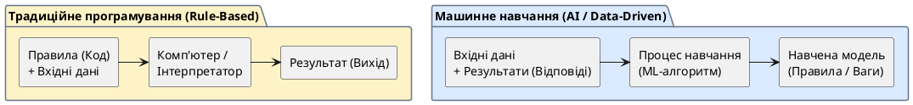

# Відмінність AI від інших програмних систем

::card-group

::card{title="🎯 Мета розділу" icon="i-lucide-target"}

- Чітко розрізняти три типи програмних систем: на правилах, автоматизовані та AI-системи.
- Зрозуміти фундаментальну відмінність: правила задає людина, а AI знаходить їх у даних.
- Навчитися визначати, коли потрібна автоматизація, а коли — AI.

::

::card{title="🔑 Ключові терміни" icon="i-lucide-key"}

- **Правила (*Rules*):** явно задані інструкції виду «якщо X, то Y», визначені програмістом.
- **Автоматизація (*Automation*):** виконання повторюваних задач за заздалегідь визначеним алгоритмом без участі людини.
- **Навчання (*Learning*):** здатність системи знаходити закономірності у даних та покращувати свою роботу без явного програмування правил.

::

::

---

## Програма на основі заздалегідь визначених правил

Найтрадиційніший тип програмного забезпечення — **системи на правилах** (*rule-based systems*). Програміст явно описує кожне можливе рішення у вигляді правил «якщо — то» (*if-then*).

Наприклад, банківська система для схвалення кредиту на правилах може виглядати так: «Якщо вік ≥ 18 І дохід ≥ 15000 І кредитна історія — "позитивна", то схвалити кредит. Інакше — відхилити.»

Такі системи мають очевидні переваги: вони **передбачувані** (однакові вхідні дані завжди дають однаковий результат) та **прозорі** (завжди можна пояснити, чому прийнято саме це рішення). Але у них є принципове обмеження: програміст повинен **заздалегідь передбачити всі можливі ситуації** та описати правила для кожної з них. Для простих задач це працює, але для складних — стає неможливим.

---

## Автоматизація

**Автоматизація** — це наступний рівень: система виконує повторювані задачі за визначеним алгоритмом без постійної участі людини. Прикладами є:

- Автоматична відправка email при реєстрації нового користувача.
- Щоденне резервне копіювання бази даних о 3:00 ночі.
- Конвеєрна система на виробництві, що виконує однакові дії з кожним виробом.

Автоматизація підвищує ефективність і зменшує ризик людських помилок у рутинних операціях. Але вона не здатна **адаптуватися до нових ситуацій**: якщо з'являється нетипова ситуація, не передбачена алгоритмом, система зупиняється або працює некоректно.

---

## Система на базі штучного інтелекту

AI-система принципово відрізняється від двох попередніх підходів: **замість явних правил вона навчається на даних**. Програміст не пише правила «якщо — то», а надає системі великий обсяг прикладів, на основі яких вона сама знаходить закономірності.

Повернемося до прикладу з кредитом. AI-система для оцінки кредитоспроможності не працює за жорсткими правилами «вік ≥ 18». Натомість їй надають тисячі записів про попередніх позичальників (вік, дохід, сімейний стан, історія платежів, результат — повернув/не повернув кредит), і вона сама знаходить складні залежності, які людина може навіть не помітити.

{.diagram-img}

::plant-uml{alt="Традиційне програмування проти машинного навчання"}



::

---

## Правила, дані та навчання

Фундаментальна різниця між підходами зводиться до **співвідношення правил та даних**:

| Аспект | Система на правилах | Автоматизація | AI-система |
|---|---|---|---|
| **Хто визначає поведінку?** | Програміст (явні правила) | Програміст (алгоритм) | Дані (через навчання) |
| **Адаптивність** | Відсутня | Мінімальна | Висока |
| **Прозорість** | Повна | Повна | Часто обмежена |
| **Нові ситуації** | Не обробляє | Не обробляє | Може узагальнювати |
| **Вхідні дані** | Правила + вхідний запит | Тригер + параметри | Великий обсяг навчальних даних |
| **Приклад** | Фільтр спаму за ключовими словами | Автовідповідь на email | Розпізнавання спаму за змістом |

::note
Зверніть увагу на приклад спам-фільтру. Система на правилах фільтрує листи за ключовими словами («казино», «виграш», «безкоштовно»). Спамери швидко адаптуються, змінюючи слова. AI-фільтр аналізує тисячі характеристик листа (стиль тексту, структуру посилань, поведінку відправника) і адаптується до нових видів спаму — навіть тих, яких не було у навчальних даних.
::

---

## Практичні завдання

::::accordion

:::accordion-item{label="📋 Завдання: Класифікуйте системи" icon="i-lucide-clipboard-list"}

Визначте тип кожної системи: **На правилах**, **Автоматизація** чи **AI**:

1. Калькулятор, що обчислює площу кола за формулою πr²
2. Google Translate, що перекладає текст між мовами
3. Система, яка автоматично вимикає світло о 23:00
4. Фільтр Instagram, що додає вуса та вуха
5. Термостат, що вмикає опалення при температурі нижче 20°C
6. Рекомендації YouTube «Що подивитися далі»
7. Макрос у Excel, що форматує таблицю за шаблоном
8. Автопілот Tesla

Після самостійної класифікації перевірте з AI:

```
Для кожної системи визнач її тип (На правилах / Автоматизація / AI) і поясни чому:
[вставте список]
```

Де ваші відповіді збігаються, а де розходяться? Обговоріть спірні випадки.

:::

::::

---

## Запитання для самоконтролю

::::accordion

:::accordion-item{label="❓ Чому AI-система може бути менш прозорою, ніж система на правилах?" icon="i-lucide-help-circle"}

У системі на правилах кожне рішення можна пояснити: «Кредит відхилено, бо вік < 18». В AI-системі рішення базується на складних математичних моделях із мільйонами параметрів. Модель може прийняти рішення на основі комбінації сотень факторів, і пояснити «чому саме так» буває надзвичайно складно. Це створює проблему «чорної скриньки» (*black box*), яка є активною областю досліджень (explainable AI).

:::

:::accordion-item{label="❓ Коли система на правилах краща за AI?" icon="i-lucide-help-circle"}

Коли задача чітко формалізована, правила прості та стабільні, а прозорість рішень критично важлива. Наприклад, правила нарахування зарплати, податкові розрахунки, правила дорожнього руху. У таких випадках система на правилах буде надійнішою, передбачуванішою та дешевшою в розробці та підтримці, ніж AI.

:::

::::
