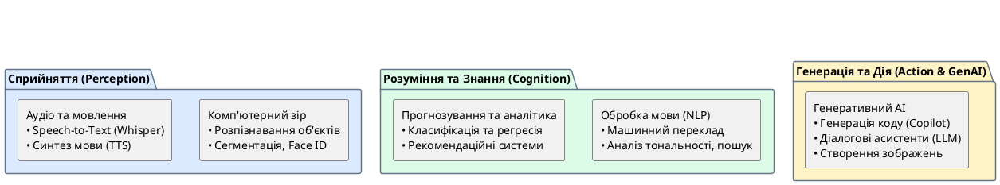

# Завдання штучного інтелекту

::card-group

::card{title="🎯 Мета розділу" icon="i-lucide-target"}

- Ознайомитися з основними типами задач, які вирішує штучний інтелект.
- Побачити конкретні приклади застосування кожного типу задач.
- Зрозуміти, що за кожним «магічним» AI-продуктом стоїть конкретна технічна задача.

::

::card{title="🔑 Ключові терміни" icon="i-lucide-key"}

- **Комп'ютерний зір (*Computer Vision*):** здатність AI аналізувати та розуміти зображення та відео.
- **Обробка природної мови (*Natural Language Processing, NLP*):** здатність AI розуміти та генерувати людську мову.
- **Рекомендаційна система (*Recommender System*):** AI-система, що прогнозує уподобання користувача.
- **Генеративний AI (*Generative AI*):** AI, здатний створювати нові артефакти (текст, зображення, код).

::

::

{.diagram-img}

::plant-uml{alt="Класифікація завдань штучного інтелекту"}

::

---

## Розпізнавання зображень

**Комп'ютерний зір** (*computer vision*) — одна з найуспішніших областей AI. Системи комп'ютерного зору навчилися «бачити» — розпізнавати об'єкти, обличчя, текст та сцени на зображеннях та відео.

Приклади застосування:
- **Face ID** розблоковує смартфон за обличчям власника.
- **Google Lens** розпізнає рослини, тварин, текст та продукти за фотографією.
- **Медична діагностика:** AI виявляє пухлини на рентгенівських знімках з точністю, порівнянною з досвідченим лікарем.
- **Автопілот:** автомобілі Tesla розпізнають дорожні знаки, пішоходів та інші транспортні засоби.
- **Контроль якості на виробництві:** AI-камери виявляють дефекти продукції на конвеєрі.

---

## Розпізнавання та генерація мовлення

AI навчився не лише «бачити», а й «чути» — розпізнавати людське мовлення (*speech recognition*) та генерувати його (*speech synthesis*).

**Розпізнавання мовлення** перетворює аудіо на текст. Це технологія, яка стоїть за голосовими асистентами (Siri, Google Assistant), автоматичними субтитрами на YouTube та диктовкою тексту.

**Генерація мовлення** (синтез мови) працює у зворотному напрямку — перетворює текст на природне звучання. Сучасні системи (*text-to-speech*) здатні генерувати мовлення, практично нерозрізниме від людського, з урахуванням інтонації, пауз та емоцій.

---

## Переклад тексту

**Машинний переклад** (*machine translation*) — задача, де AI досяг вражаючих результатів. Сучасні системи (Google Translate, DeepL) перекладають тексти між десятками мов з якістю, яка ще 10 років тому здавалася неможливою.

Еволюція підходів до перекладу ілюструє загальну еволюцію AI: від правил → до статистики → до нейронних мереж.

::note
DeepL, побудований на нейронних мережах, часто дає кращі результати, ніж Google Translate, особливо для європейських мов. Спробуйте перекласти один і той самий текст обома сервісами та порівняти якість — це цікавий практичний експеримент.
::

---

## Побудова рекомендацій

**Рекомендаційні системи** аналізують поведінку користувача (що він переглядав, купував, лайкав) та прогнозують, що може його зацікавити.

- **Netflix:** рекомендує фільми та серіали на основі вашої історії перегляду та вподобань схожих користувачів.
- **Spotify:** створює персоналізовані плейлисти (Discover Weekly, Release Radar).
- **Amazon:** «Користувачі, які купили цей товар, також купили...»
- **TikTok:** алгоритм рекомендацій вважається одним з найефективніших у індустрії.

---

## Прогнозування та пошук закономірностей

**Прогнозування** (*prediction*) — AI аналізує історичні дані та робить прогнози щодо майбутніх подій:
- Прогноз погоди на основі метеорологічних даних.
- Прогноз попиту на товари для оптимізації складських запасів.
- Прогноз ціни акцій на фінансових ринках.
- Прогноз захворюваності для системи охорони здоров'я.

**Пошук закономірностей** (*pattern recognition*) — AI знаходить приховані зв'язки та тенденції у великих масивах даних, які людина не може виявити через їх обсяг та складність.

---

## Створення контенту

Найновіша та найбільш вражаюча категорія — **генерація контенту** (*content generation*). Сучасний AI здатний створювати:

- **Текст:** статті, листи, код, сценарії, вірші (ChatGPT, Claude, Gemini).
- **Зображення:** фотореалістичні зображення, ілюстрації, дизайн (DALL·E, Midjourney, Stable Diffusion).
- **Аудіо:** музику, голосовий озвучування, звукові ефекти (Suno, ElevenLabs).
- **Відео:** короткі відеоролики, анімації (Sora, Runway).
- **Код:** програмний код на будь-якій мові (GitHub Copilot, Cursor).

Ми детально розглянемо генеративний AI у наступних розділах.

---

## Практичні завдання

::::accordion

:::accordion-item{label="📋 Завдання: Протестуйте різні типи AI-задач" icon="i-lucide-clipboard-list"}

Спробуйте виконати кожен тип AI-задачі на практиці:

1. **Комп'ютерний зір:** Завантажте фото будь-якої рослини в Google Lens і подивіться, чи правильно AI її визначить.
2. **Переклад:** Перекладіть один абзац тексту в Google Translate та DeepL. Порівняйте якість.
3. **Рекомендації:** Зверніть увагу на рекомендації YouTube/TikTok після перегляду нового типу контенту. Як швидко алгоритм адаптувався?
4. **Генерація тексту:** Попросіть AI написати короткий вірш про ваш улюблений предмет у коледжі.

Зафіксуйте результати: де AI спрацював ідеально, де — посередньо, де — помилився?

:::

::::

---

## Запитання для самоконтролю

::::accordion

:::accordion-item{label="❓ Чому AI краще розпізнає зображення, ніж розуміє текст?" icon="i-lucide-help-circle"}

Розпізнавання зображень базується на виявленні візуальних патернів (краї, текстури, форми), і ці патерни є об'єктивними та стабільними. Розуміння тексту вимагає семантичної інтерпретації, знання контексту, розуміння іронії, метафор та культурних особливостей — все це значно складніше для формалізації. Тому AI в комп'ютерному зорі досяг вищої точності раніше, ніж у обробці природної мови.

:::

::::
