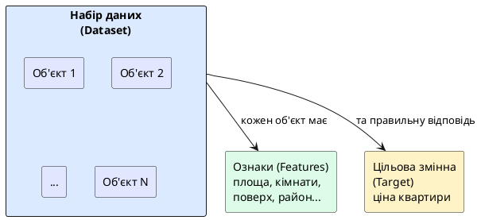

# Machine Learning

::card-group

::card{title="🎯 Мета розділу" icon="i-lucide-target"}

- Зрозуміти, що таке машинне навчання та навіщо воно потрібне.
- Освоїти ключові поняття: дані, ознаки, цільова змінна, модель.
- Побачити, як модель навчається на прикладах та генерує передбачення.
- Відрізняти машинне навчання від програмування на правилах.

::

::card{title="🔑 Ключові терміни" icon="i-lucide-key"}

- **Machine Learning (ML):** підгалузь AI, де системи навчаються на даних, а не на явних правилах.
- **Дані (*Data*):** інформація, на якій навчається модель — зазвичай великий набір прикладів.
- **Ознаки (*Features*):** характеристики об'єкта, які модель аналізує для прийняття рішення.
- **Цільова змінна (*Target / Label*):** правильна відповідь, яку модель має навчитися передбачати.
- **Модель (*Model*):** математична функція, що перетворює ознаки на передбачення.

::

::

---

## Що таке Machine Learning і навіщо він потрібен

**Машинне навчання** (*Machine Learning, ML*) — це підгалузь штучного інтелекту, де програми навчаються з досвіду (даних), замість того щоб слідувати явно запрограмованим правилам. Класичне визначення Тома Мітчелла (1997): «Програма навчається з досвіду E стосовно задачі T з мірою якості P, якщо її продуктивність P на задачі T покращується з досвідом E».

Навіщо це потрібно? Тому що існує величезний клас задач, для яких **неможливо або непрактично написати правила вручну**:

- Як описати правилами, що робить фотографію «красивою»?
- Як формалізувати, що робить email «спамом» (спамери постійно змінюють тактику)?
- Як вручну написати правила для перекладу з однієї мови на іншу, враховуючи всі граматичні конструкції, ідіоми та контекст?

У всіх цих випадках ефективніше **показати системі тисячі прикладів** та дозволити їй самій знайти закономірності.

---

## Дані, ознаки та цільова змінна

Щоб зрозуміти ML, потрібно засвоїти три базових поняття:

**Дані (*data*)** — це сировина, на якій навчається модель. Це може бути таблиця з числами, колекція зображень, набір текстів або записи аудіо. Якість та обсяг даних прямо впливають на якість моделі. Це як навчальні підручники для студента: чим якісніші та різноманітніші підручники, тим краще студент засвоїть матеріал.

**Ознаки (*features*)** — це характеристики об'єкта, які модель використовує для прийняття рішення. Наприклад, для передбачення ціни квартири ознаками можуть бути: площа (м²), кількість кімнат, поверх, район, рік будівництва, наявність ремонту. Вибір правильних ознак — одне з найважливіших рішень в ML.

**Цільова змінна (*target / label*)** — це «правильна відповідь», яку модель має навчитися передбачувати. Для передбачення ціни квартири цільова змінна — це фактична ціна. Для класифікації email — це мітка «спам» або «не спам».

{.diagram-img}

::plant-uml{alt="Дані, ознаки та цільова змінна"}



::

---

## Модель і її навчання

**Модель** (*model*) — це математична функція, яка приймає ознаки на вхід і генерує передбачення на виході. До навчання модель — це «порожній мозок», який нічого не знає. Під час навчання модель аналізує тисячі прикладів (пари «ознаки → правильна відповідь») та налаштовує свої внутрішні параметри так, щоб максимально точно передбачувати правильну відповідь.

Процес нагадує навчання людини: ви показуєте дитині сотні фотографій котів і собак, кожного разу кажучи «це кіт» або «це собака». Після достатньої кількості прикладів дитина навчиться розрізняти їх, навіть побачивши фото, якого ніколи раніше не бачила. Так само працює ML-модель.

::note
Важливо: модель не «запам'ятовує» навчальні приклади. Вона знаходить **закономірності** (патерни) — наприклад, що коти зазвичай мають загострені вуха та вертикальні зіниці, а собаки — довгу морду та висячі вуха. Ці закономірності дозволяють моделі **узагальнювати** — правильно працювати з новими даними, яких не було в навчальному наборі.
::

---

## Отримання передбачення

Після навчання модель готова до використання. Ви надаєте їй нові ознаки (наприклад, характеристики квартири), і вона повертає **передбачення** (*prediction*) — свою оцінку цільової змінної (наприклад, очікувану ціну).

Важливо розуміти: передбачення — це **ймовірнісна оцінка**, а не точна відповідь. Модель може помилятися, і ступінь точності залежить від якості даних, правильності вибору ознак та складності задачі.

::mermaid


::

---

## Практичні завдання

::::accordion

:::accordion-item{label="📋 Завдання: Навчіть AI «визначати жанр фільму»" icon="i-lucide-clipboard-list"}

Уявіть, що ви створюєте ML-модель для визначення жанру фільму. Задайте AI запит:

```
Я хочу зрозуміти Machine Learning на прикладі. Уяви, що ми створюємо модель,
яка визначає жанр фільму (комедія, драма, бойовик) на основі його характеристик.

1. Які ознаки (features) можна використати? Запропонуй 7-8 ознак.
2. Що буде цільовою змінною (target)?
3. Як виглядатиме один рядок навчальних даних?
4. Покажи приклад таблиці з 5 рядками навчальних даних.
5. Як модель використає ці дані для передбачення жанру нового фільму?

Поясни простою мовою, без математичних формул.
```

:::

::::

---

## Запитання для самоконтролю

::::accordion

:::accordion-item{label="❓ Чому якість даних важливіша за складність моделі?" icon="i-lucide-help-circle"}

Навіть найскладніша модель не зможе навчитися правильним закономірностям, якщо навчальні дані містять помилки, упередження або недостатньо прикладів. Це як навчання за підручником з помилками: незалежно від здібностей студента, він засвоїть неправильну інформацію. У ML існує принцип «garbage in — garbage out»: якщо на вхід подати сміття, на виході буде сміття, незалежно від складності моделі.

:::

::::
