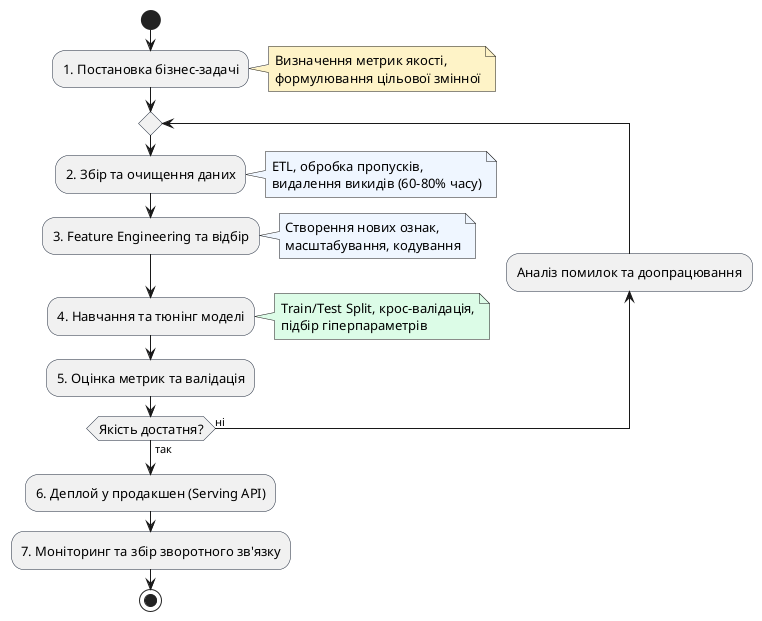

# Machine Learning Workflow

::card-group

::card{title="🎯 Мета розділу" icon="i-lucide-target"}

- Зрозуміти послідовність етапів створення ML-системи.
- Усвідомити, що написання коду моделі — лише мала частина процесу.
- Побачити, де в цьому процесі потрібна участь людини, а де допомагає AI.

::

::card{title="🔑 Ключові терміни" icon="i-lucide-key"}

- **ML Workflow:** послідовність етапів від постановки задачі до розгортання моделі.
- **Підготовка даних (*Data Preprocessing*):** очищення, трансформація та нормалізація даних для навчання.
- **Метрика якості (*Quality Metric*):** числовий показник, що вимірює точність передбачень моделі.

::

::

{.diagram-img}

::plant-uml{alt="Життєвий цикл розробки ML-моделі"}



::

---

## Етапи ML Workflow

::steps

### Постановка задачі
Визначити, яку проблему має вирішити модель: що передбачати, для кого, з якою точністю. Без чіткої постановки решта етапів безглуздіі. Наприклад: «Передбачити, чи поверне клієнт кредит протягом 12 місяців, з точністю не менше 85%».

### Збір, підготовка та дослідження даних
Зібрати релевантні дані, очистити їх від помилок та пропусків, дослідити розподіли та кореляції. Цей етап зазвичай займає **60-80% усього часу** ML-проєкту. Дані можуть надходити з баз даних, API, файлів, вебскрапінгу.

### Вибір ознак і алгоритму
Визначити, які характеристики (ознаки) використовувати для навчання, та обрати алгоритм ML. Вибір залежить від типу задачі, обсягу даних та вимог до інтерпретованості.

### Навчання моделі та оцінка якості
Навчити модель на частині даних (*training set*) та оцінити її якість на іншій частині (*test set*). Якщо якість недостатня — повернутися до попередніх кроків: додати ознаки, зібрати більше даних або змінити алгоритм.

### Використання моделі та покращення на нових даних
Розгорнути модель у продакшені. Моніторити її якість на реальних даних. Коли якість падає (через зміни у даних) — перенавчити модель на свіжих прикладах.

::

::note
Зверніть увагу: ML Workflow — це **циклічний**, а не лінійний процес. Після оцінки якості часто потрібно повернутися на крок назад — зібрати більше даних, обрати інші ознаки або спробувати інший алгоритм. Ітерації — норма, а не виняток.
::

---

## Практичні завдання

::::accordion

:::accordion-item{label="📋 Завдання: Опишіть ML Workflow для реальної задачі" icon="i-lucide-clipboard-list"}

Задайте AI запит:

```
Опиши ML Workflow для задачі: рекомендаційна система для музичного сервісу
(типу Spotify). Для кожного етапу workflow вкажи:
1. Назву етапу
2. Що конкретно робиться (2-3 речення)
3. Який результат цього етапу
4. Що може піти не так (1 речення)

Поясни простою мовою, без формул.
```

Після отримання відповіді подумайте: яке рішення ви б прийняли як людина на кожному етапі? Де AI може допомогти, а де потрібне ваше судження?

:::

::::

---

## Запитання для самоконтролю

::::accordion

:::accordion-item{label="❓ Чому підготовка даних займає більшу частину часу ML-проєкту?" icon="i-lucide-help-circle"}

У реальному світі дані рідко бувають ідеальними: вони містять пропуски, помилки, дублікати, застарілу інформацію. Дані можуть бути в різних форматах, з різних джерел, з різним рівнем деталізації. Підготовка включає очищення, об'єднання, нормалізацію та трансформацію. Якість підготовки прямо визначає якість моделі, тому цей етап не можна скорочувати.

:::

::::
