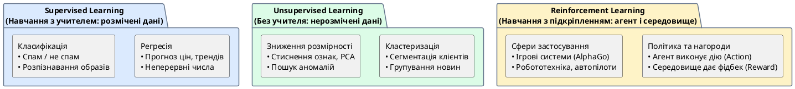

# Типи машинного навчання

::card-group

::card{title="🎯 Мета розділу" icon="i-lucide-target"}

- Розрізняти три основні типи машинного навчання.
- Зрозуміти призначення регресії, класифікації та кластеризації.
- Побачити практичні приклади кожного типу навчання.

::

::card{title="🔑 Ключові терміни" icon="i-lucide-key"}

- **Supervised Learning (навчання з учителем):** модель навчається на прикладах з правильними відповідями.
- **Unsupervised Learning (навчання без учителя):** модель шукає патерни в даних без правильних відповідей.
- **Reinforcement Learning (навчання з підкріпленням):** модель навчається через взаємодію із середовищем, отримуючи нагороди та штрафи.
- **Регресія (*Regression*):** передбачення числового значення.
- **Класифікація (*Classification*):** присвоєння категорії.
- **Кластеризація (*Clustering*):** групування схожих об'єктів.

::

::

---

## Supervised Learning — навчання з учителем

**Навчання з учителем** — найпоширеніший тип ML. Суть: модель отримує набір прикладів, де кожен приклад містить ознаки (вхідні дані) та правильну відповідь (мітку). Модель навчається знаходити зв'язок між ознаками та відповіддю.

Аналогія: студент розв'язує задачі з підручника, де наприкінці є відповіді. Він перевіряє свої рішення, аналізує помилки та покращує свій підхід.

### Регресія

**Регресія** — це задача передбачення **числового** значення. Прикладами є:
- Передбачення ціни квартири за її характеристиками.
- Прогноз температури на завтра.
- Оцінка часу доставки замовлення.

### Класифікація

**Класифікація** — це задача присвоєння об'єкту **категорії** (класу). Прикладами є:
- Визначення, чи є email спамом (дві категорії: спам / не спам).
- Розпізнавання цифри на зображенні (10 категорій: 0-9).
- Діагностика захворювання за симптомами.

{.diagram-img}

::plant-uml{alt="Парадигми машинного навчання"}



::

---

## Unsupervised Learning — навчання без учителя

**Навчання без учителя** — модель отримує дані **без правильних відповідей** і самостійно шукає в них патерни, групи та аномалії.

Аналогія: вам дали коробку з сотнями різнокольорових кульок різного розміру, не пояснивши, як їх сортувати. Ви самостійно помічаєте, що деякі кульки схожі за кольором, інші — за розміром, і починаєте групувати їх за виявленими ознаками.

### Кластеризація

**Кластеризація** — найпоширеніша задача unsupervised learning. Модель групує об'єкти за схожістю, не знаючи заздалегідь, які групи існують. Прикладами є:
- Сегментація клієнтів за поведінкою покупок.
- Групування новин за тематикою.
- Виявлення аномальних транзакцій (які не схожі на жодну групу).

---

## Reinforcement Learning — навчання з підкріпленням

**Навчання з підкріпленням** — принципово інший підхід. Тут немає готових даних із відповідями. Натомість **агент** (*agent*) взаємодіє із **середовищем** (*environment*), виконує дії та отримує **нагороди** (*rewards*) або **штрафи** (*penalties*). Мета — навчитися стратегії, що максимізує сумарну нагороду.

Аналогія: дитина вчиться ходити. Ніхто не показує їй «правильні рухи» — вона пробує, падає, отримує «штраф» (біль), пробує інакше, тримає рівновагу, отримує «нагороду» (успіх) і поступово освоює навичку.

Приклади:
- **AlphaGo** (DeepMind) — навчилася грати в Го, перемігши чемпіона світу.
- **Автопілот** — навчається керувати автомобілем у симуляторі.
- **Робототехніка** — роботи навчаються маніпулювати об'єктами.

---

## Порівняння типів навчання

| Аспект | Supervised | Unsupervised | Reinforcement |
|---|---|---|---|
| **Дані** | З мітками (відповідями) | Без міток | Немає даних, є середовище |
| **Мета** | Передбачити відповідь | Знайти структуру | Максимізувати нагороду |
| **Задачі** | Регресія, класифікація | Кластеризація, зниження розмірності | Ігри, робототехніка, оптимізація |
| **Аналогія** | Задачі з відповідями | Сортування без інструкцій | Навчання методом спроб |

---

## Практичні завдання

::::accordion

:::accordion-item{label="📋 Завдання: Визначте тип навчання" icon="i-lucide-clipboard-list"}

Для кожної задачі визначте тип ML (Supervised / Unsupervised / Reinforcement) та підтип (Регресія / Класифікація / Кластеризація / RL):

1. Передбачити, чи клікне користувач на рекламу
2. Розбити клієнтів інтернет-магазину на групи за поведінкою
3. Навчити дрон уникати перешкод
4. Визначити мову, якою написаний текст
5. Передбачити курс валюти на завтра
6. Знайти групи схожих статей у новинному потоці

Перевірте з AI:

```
Для кожної задачі визнач тип машинного навчання та поясни чому:
[вставте список]
```

:::

::::

---

## Запитання для самоконтролю

::::accordion

:::accordion-item{label="❓ Чим класифікація відрізняється від кластеризації?" icon="i-lucide-help-circle"}

Класифікація (supervised) — модель знає заздалегідь, які категорії існують, і навчається на прикладах з мітками. Кластеризація (unsupervised) — модель не знає ні кількості груп, ні їх природи, і самостійно знаходить групи за схожістю ознак. Класифікація відповідає на питання «до якої відомої категорії належить об'єкт?», а кластеризація — «які природні групи існують у цих даних?».

:::

::::
