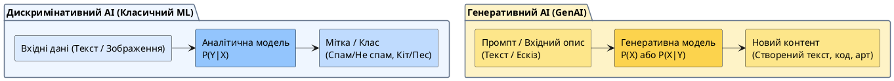

# Generative AI

::card-group

::card{title="🎯 Мета розділу" icon="i-lucide-target"}

- Зрозуміти, що таке генеративний AI та чим він відрізняється від класичного ML.
- Побачити, як AI створює нові артефакти (текст, зображення, код) на основі навчальних даних.
- Усвідомити революційність генеративного AI для професії розробника.

::

::card{title="🔑 Ключові терміни" icon="i-lucide-key"}

- **Generative AI:** AI-системи, здатні створювати нові артефакти (текст, зображення, аудіо, відео, код).
- **Генеративна модель:** математична модель, що навчилася розподілу даних і може генерувати нові зразки з цього розподілу.
- **Latent Space (латентний простір):** внутрішнє математичне представлення, в якому модель «розуміє» структуру даних.

::

::

---

## Що таке Generative AI

До появи генеративного AI більшість ML-систем були **аналітичними**: вони класифікували, передбачували, розпізнавали — але не створювали нічого нового. Спам-фільтр визначає «спам чи не спам». Рекомендаційна система обирає зі списку існуючих фільмів. Система розпізнавання облич порівнює фото з базою.

**Generative AI** (*генеративний штучний інтелект*) працює принципово інакше: він **створює нові артефакти**, яких не існувало раніше. Коли ChatGPT пише відповідь на ваше питання — він не шукає готову відповідь у базі даних. Він **генерує** нову послідовність слів, яка (у разі успіху) є корисною, зрозумілою та релевантною.

Це фундаментальний прорив: вперше в історії машина здатна створювати контент, нерозрізнимий від створеного людиною.

{.diagram-img}

::plant-uml{alt="Дискримінативний проти генеративного AI"}

::

---

## Відмінність від класичного ML

| Аспект | Класичний ML | Generative AI |
|---|---|---|
| **Задача** | Аналіз та передбачення | Створення нового контенту |
| **Вхід → Вихід** | Дані → Категорія / Число | Запит → Текст / Зображення / Код |
| **Приклад** | «Цей email — спам» | «Напиши відповідь на цей email» |
| **Результат** | Вибір із існуючих варіантів | Генерація нового артефакту |

---

## Створення контенту на основі закономірностей

Як генеративний AI створює контент? Спрощено: під час навчання модель аналізує мільярди прикладів (текстів, зображень, коду) та знаходить **закономірності** — патерни, структури, зв'язки. Потім, отримавши запит, вона використовує ці закономірності для генерації нового контенту, який **статистично схожий** на навчальні дані, але не є їхньою копією.

Важливо: генеративний AI не «розуміє» зміст того, що створює. Він не знає, що 2+2=4 — він знає, що у текстах, де зустрічається «2+2», найчастіше далі йде «4». Це **статистичне моделювання**, а не розуміння.

::warning
Саме тому генеративний AI може впевнено «вигадувати» неіснуючі факти — він генерує статистично правдоподібні, але не обов'язково правдиві відповіді. Це явище називається **галюцинацією** (*hallucination*), і ми детально розглянемо його в Модулі 4.
::

---

## Сфери застосування Generative AI

::tabs
::tabs-item{label="Текст"}
Написання статей, листів, звітів, сценаріїв, перекладів, узагальнень, відповідей на питання. Інструменти: ChatGPT, Claude, Gemini.
::
::tabs-item{label="Зображення"}
Створення ілюстрацій, дизайну, фотореалістичних зображень, редагування фото. Інструменти: Midjourney, DALL·E, Stable Diffusion.
::
::tabs-item{label="Код"}
Генерація програмного коду, рефакторинг, пояснення коду, створення тестів. Інструменти: GitHub Copilot, Cursor, Claude.
::
::tabs-item{label="Аудіо"}
Генерація музики, голосове озвучування, клонування голосу. Інструменти: Suno, ElevenLabs.
::
::tabs-item{label="Відео"}
Створення коротких відеороликів, анімацій, спецефектів. Інструменти: Sora, Runway, Kling.
::
::

---

## Практичні завдання

::::accordion

:::accordion-item{label="📋 Завдання: Протестуйте генеративний AI для різних типів контенту" icon="i-lucide-clipboard-list"}

Протестуйте генеративний AI для створення різних типів контенту:

1. **Текст:** Попросіть AI написати короткий опис вашого коледжу для сайту (3-4 речення).
2. **Структура:** Попросіть AI створити план презентації на тему «Чому я обрав IT» (5-7 слайдів).
3. **Код:** Попросіть AI написати простий HTML-файл з привітанням.
4. **Аналіз:** Попросіть AI порівняти два смартфони у форматі таблиці.

Для кожного результату оцініть: чи готовий він до використання «як є», чи потребує доопрацювання?

:::

::::

---

## Запитання для самоконтролю

::::accordion

:::accordion-item{label="❓ Чому генеративний AI може «вигадувати» факти?" icon="i-lucide-help-circle"}

Генеративний AI не зберігає та не перевіряє факти — він генерує статистично правдоподібні послідовності слів. Якщо в навчальних даних деяка комбінація слів була поширеною, модель може її відтворити, навіть якщо в конкретному контексті вона є помилковою. Модель не відрізняє «правдиве» від «правдоподібного» — для неї це математично однакові операції.

:::

::::
