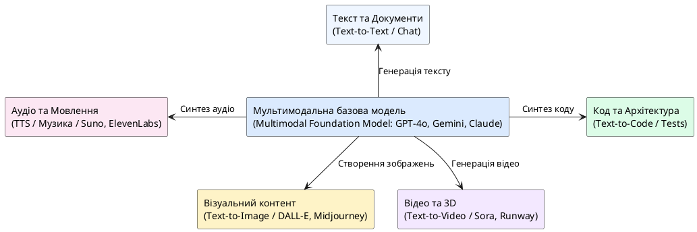

# Типи контенту, створюваного AI

::card-group

::card{title="🎯 Мета розділу" icon="i-lucide-target"}

- Побачити різноманітність контенту, який генерує AI.
- Ознайомитися з основними інструментами для кожного типу контенту.
- Зрозуміти обмеження та ризики генерації контенту AI.

::

::card{title="🔑 Ключові терміни" icon="i-lucide-key"}

- **Text-to-Text:** генерація тексту на основі текстового запиту (ChatGPT, Claude).
- **Text-to-Image:** генерація зображень на основі текстового опису (DALL·E, Midjourney).
- **Text-to-Speech (TTS):** перетворення тексту на голосове мовлення.
- **Text-to-Code:** генерація програмного коду на основі опису завдання.

::

::

{.diagram-img}

::plant-uml{alt="Мультимодальна екосистема контенту AI"}

::

---

## Текст

Генерація тексту — найрозвиненіша категорія генеративного AI. Сучасні мовні моделі здатні створювати практично будь-який тип тексту: від ділового листа до поетичного твору, від технічної документації до навчальних матеріалів.

Можливості: написання, редагування, переклад, узагальнення, зміна стилю, адаптація під аудиторію, генерація ідей.

Обмеження: можливі фактичні помилки, відсутність оригінальних думок, ризик генерації упередженого або маніпулятивного контенту.

---

## Зображення

AI-генерація зображень за текстовим описом (*text-to-image*) стала одним із найяскравіших проривів останніх років. Користувач описує бажане зображення словами, а AI створює його з нуля.

Можливості: ілюстрації, концепт-арт, дизайн логотипів, фотореалістичні зображення, стилізація.

Обмеження: складнощі з генерацією тексту на зображеннях, рук та пальців; питання авторських прав на стиль навчальних зображень.

---

## Аудіо

AI здатний генерувати як мовлення, так і музику. Системи text-to-speech створюють реалістичне голосове озвучування, а музичні AI генерують мелодії та повноцінні композиції.

Можливості: озвучування тексту, створення подкастів, генерація фонової музики, клонування голосу.

Обмеження: етичні ризики дипфейків, проблеми з правами на голос, обмежена емоційна виразність.

---

## Відео

Генерація відео — наймолодша і найскладніша категорія. AI-системи (Sora, Runway) вже здатні створювати короткі відеоролики за текстовим описом.

Можливості: створення демо-відео, анімацій, рекламних роликів, візуальних ефектів.

Обмеження: обмежена тривалість, артефакти руху, високі вимоги до обчислювальних ресурсів.

---

## Програмний код

Генерація коду — одне з найпрактичніших застосувань генеративного AI для розробників. AI здатний створювати код на десятках мов програмування, генерувати тести, документацію та конфігураційні файли.

Можливості: автодоповнення коду, генерація функцій за описом, рефакторинг, пояснення чужого коду, переклад коду між мовами.

Обмеження: згенерований код може містити помилки, вразливості безпеки або неоптимальні рішення. Потребує обов'язкової перевірки.

---

## Практичні завдання

::::accordion

:::accordion-item{label="📋 Завдання: Створіть різні типи контенту" icon="i-lucide-clipboard-list"}

Попросіть AI створити контент на одну тему «Мій коледж» у різних форматах:

1. **Текст:** Короткий опис для вебсайту (50-70 слів)
2. **Структура презентації:** 5 слайдів із заголовками та тезами
3. **Код:** HTML-сторінка з інформацією про коледж
4. **Пост для соцмереж:** Короткий привабливий пост для Instagram

Порівняйте: як AI адаптує один і той самий зміст під різні формати? Яка адаптація найкраща?

:::

::::

---

## Запитання для самоконтролю

::::accordion

:::accordion-item{label="❓ Який тип контенту AI генерує найякісніше і чому?" icon="i-lucide-help-circle"}

На сьогодні текст — найякісніший тип контенту, що генерується AI. Це пояснюється тим, що мовні моделі навчені на найбільших обсягах даних (трильйони слів), текст — це структурований послідовний формат, і для оцінки якості тексту існують чіткі критерії (граматика, логіка, зв'язність). Зображення, аудіо та відео вимагають значно більших обчислювальних ресурсів та складнішої архітектури моделей.

:::

::::
