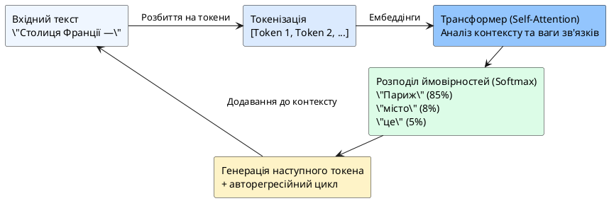

# Великі мовні моделі

::card-group

::card{title="🎯 Мета розділу" icon="i-lucide-target"}

- Зрозуміти, що таке велика мовна модель (LLM) та як вона працює.
- Побачити, що відповіді AI базуються на ймовірностях, а не на «розумінні».
- Зрозуміти, чому один і той самий запит може давати різні відповіді.

::

::card{title="🔑 Ключові терміни" icon="i-lucide-key"}

- **Large Language Model (LLM):** нейромережева модель із мільярдами параметрів, навчена на величезних обсягах тексту.
- **Токен (*Token*):** мінімальна одиниця тексту, яку обробляє модель (слово, частина слова або символ).
- **Температура (*Temperature*):** параметр, що контролює ступінь «креативності» (випадковості) відповідей моделі.
- **Контекстне вікно (*Context Window*):** максимальний обсяг тексту, який модель може обробити за один раз.

::

::

---

## Що таке Large Language Model

**Велика мовна модель** (*Large Language Model, LLM*) — це нейромережева модель, навчена на величезних обсягах текстових даних для розуміння та генерації людської мови. «Велика» означає мільярди (а іноді трильйони) внутрішніх параметрів — числових значень, які модель налаштовує під час навчання.

Прикладами LLM є GPT-4 (OpenAI), Gemini (Google), Claude (Anthropic), LLaMA (Meta). Саме LLM стоять за популярними AI-асистентами, з якими ви працюєте в цьому курсі.

---

## Навчання мовної моделі на текстових даних

Процес навчання LLM спрощено виглядає так:

1. **Збір даних.** Модель навчається на мільярдах текстів з інтернету: книг, статей, вебсайтів, форумів, документації, коду. Це як прочитати всі книги у найбільшій бібліотеці світу.

2. **Навчання передбаченню наступного слова.** Основне завдання під час навчання: прочитавши послідовність слів, передбачити наступне. Наприклад, для тексту «Столиця України —» модель має передбачити «Київ». Мільярди таких прикладів формують «розуміння» структури мови.

3. **Тонке налаштування (*fine-tuning*).** Після базового навчання модель додатково навчають відповідати на питання, дотримуватися інструкцій та бути корисною. Цей етап включає навчання з людським зворотним зв'язком (*RLHF — Reinforcement Learning from Human Feedback*).

::note
Важливо: LLM не зберігає тексти, на яких навчалася. Вона зберігає **статистичні закономірності** — зв'язки між словами, фразами та концепціями. Це як різниця між запам'ятовуванням підручника напам'ять і розумінням принципів, які в ньому викладені.
::

---

## Формування відповіді на основі ймовірностей

Коли ви задаєте питання LLM, вона не «думає» над відповіддю. Вона виконує **послідовне передбачення токенів**: генерує перше слово відповіді (найбільш імовірне з урахуванням запиту), потім друге (з урахуванням запиту + першого слова), потім третє (з урахуванням запиту + перших двох слів) і так далі, доки не сформує повну відповідь.

{.diagram-img}

::plant-uml{alt="Авторегресійне передбачення токенів у LLM"}



::

Кожен токен обирається з розподілу ймовірностей. Для запиту «Столиця Франції —» токен «Париж» матиме найвищу ймовірність, але токени «місто», «це» теж матимуть ненульову ймовірність.

---

## Варіативність відповідей мовної моделі

Ви могли помітити, що один і той самий запит до AI може давати **різні відповіді** при кожному зверненні. Це не помилка — це наслідок **стохастичної** (випадкової) природи генерації.

Параметр **температура** (*temperature*) контролює ступінь випадковості:
- **Низька температура (0.0-0.3):** модель обирає найбільш імовірні токени, відповіді стабільні та передбачувані.
- **Висока температура (0.7-1.0):** модель частіше обирає менш імовірні токени, відповіді більш креативні та різноманітні, але й менш надійні.

::tip
Це пояснює, чому при повторному запиті ви можете отримати іншу відповідь. Для фактичних запитань краще використовувати низьку температуру, для креативних задач — вищу. Деякі AI-асистенти дозволяють налаштовувати цей параметр.
::

---

## Практичні завдання

::::accordion

:::accordion-item{label="📋 Завдання: Перевірте варіативність відповідей" icon="i-lucide-clipboard-list"}

Відкрийте AI-асистент та задайте **один і той самий запит тричі** (кожного разу починаючи новий діалог):

```
Назви 3 переваги мови програмування Python. Одне речення на кожну перевагу.
```

Запишіть три відповіді та порівняйте:
1. Чи повторюються переваги?
2. Чи різниться формулювання?
3. Чи є суперечності між відповідями?

Це наочна демонстрація ймовірнісної природи LLM.

:::

:::accordion-item{label="📋 Завдання: Дослідіть вплив формулювання" icon="i-lucide-clipboard-list"}

Задайте одне питання **трьома різними способами** та порівняйте відповіді:

**Варіант 1 (мінімальний):** `Що таке Python?`

**Варіант 2 (з контекстом):** `Я студент коледжу, що починає вивчати програмування. Що таке Python і чому його рекомендують для початківців? Відповідай стисло, 4-5 речень.`

**Варіант 3 (структурований):** `Поясни, що таке мова програмування Python. Відповідь має містити: 1) визначення (1 речення), 2) для чого використовується (3 сфери), 3) чому підходить початківцям (2 причини). Загальний обсяг — не більше 100 слів.`

Яка відповідь найкорисніша? Чому?

:::

::::

---

## Запитання для самоконтролю

::::accordion

:::accordion-item{label="❓ Чому LLM може впевнено давати неправильну відповідь?" icon="i-lucide-help-circle"}

LLM не відрізняє «правильне» від «правдоподібного». Вона генерує послідовність токенів з найвищою ймовірністю, а неправильна, але поширена інформація в навчальних даних може мати вищу ймовірність, ніж правильна, але рідкісна. Крім того, модель формулює відповіді з однаковою впевненістю незалежно від того, чи «знає» вона відповідь, чи «вигадує» її. Саме тому перевірка фактів — обов'язкова.

:::

::::
