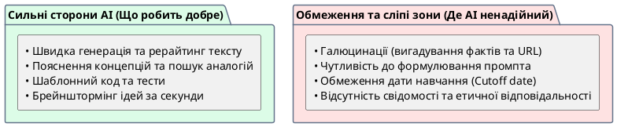

# Можливості та обмеження Generative AI

::card-group

::card{title="🎯 Мета розділу" icon="i-lucide-target"}

- Сформувати реалістичне уявлення про те, що AI може і чого не може.
- Зрозуміти, чому залежність результату від запиту — це фундаментальна особливість.
- Навчитися розпізнавати обмеження AI для ефективної та безпечної роботи.

::

::card{title="🔑 Ключові терміни" icon="i-lucide-key"}

- **Галюцинація (*Hallucination*):** генерація правдоподібної, але фактично невірної інформації.
- **Залежність від контексту:** якість відповіді прямо залежить від того, як сформульований запит.
- **Знання моделі (*Knowledge Cutoff*):** інформація, на якій модель навчалася, має часове обмеження.

::

::

{.diagram-img}

::plant-uml{alt="Можливості проти обмежень AI"}

::

---

## Можливості: що AI робить добре

**Створення та переробка тексту.** AI чудово справляється з написанням, редагуванням, перефразуванням, скороченням та розширенням текстів. Він може адаптувати стиль (формальний, розмовний, академічний) та формат (список, таблиця, есе).

**Пояснення інформації.** AI може пояснити складну тему простою мовою, провести аналогію, розкласти абстрактне поняття на конкретні приклади. Це особливо корисно для навчання.

**Генерація ідей.** AI — невтомний партнер для мозкового штурму. Він здатний запропонувати десятки варіантів за секунди, комбінувати ідеї з різних доменів та розширювати простір рішень.

**Створення програмного коду.** AI генерує код на десятках мов, пропонує оптимізації, створює тести та документацію. Для досвідченого розробника це потужний інструмент прискорення.

---

## Обмеження: де AI ненадійний

**Залежність результату від формулювання запиту.** Одне й те саме питання, поставлене по-різному, може дати кардинально різні відповіді. Невизначений запит → невизначена відповідь.

**Неповні та помилкові відповіді.** AI може пропустити важливу інформацію, не врахувати контекст або дати поверхневу відповідь на складне питання.

**Галюцинації.** AI може впевнено генерувати неіснуючі факти, вигадані цитати, фальшиві посилання. Це не баг, а фундаментальна особливість ймовірнісної генерації.

**Відсутність людського розуміння та відповідальності.** AI не розуміє зміст того, що генерує. Він не має досвіду, емоцій, моральних суджень. Він не може нести відповідальність за свої «рішення».

**Застаріла інформація.** Знання моделі обмежені датою останнього навчання (*knowledge cutoff*). Модель може не знати про нещодавні події, нові версії технологій або актуальні зміни в законодавстві.

::caution
Найнебезпечніше обмеження AI — він **не знає, чого не знає**. Модель не скаже «я не впевнена» або «краще перевірте це». Вона генерує відповідь з однаковою впевненістю, незалежно від ступеня достовірності.
::

---

## Практичні завдання

::::accordion

:::accordion-item{label="📋 Завдання: Знайдіть межі AI" icon="i-lucide-clipboard-list"}

Протестуйте обмеження AI, задавши запити з різних категорій:

1. **Запит про актуальні події:** «Хто переміг на Євробаченні цього року?» (перевірте відповідь)
2. **Запит із навмисною помилкою:** «Столиця Австралії — Сідней. Правильно?» (чи виправить AI помилку?)
3. **Запит на вигадану інформацію:** «Розкажи про книгу "Квантовий парадокс" автора Петра Коваленка» (чи визнає AI, що не знає?)
4. **Суперечливий запит:** «Що краще: Python чи JavaScript?» (чи дасть об'єктивну відповідь?)

Для кожного запиту оцініть: де AI спрацював коректно, де помилився, де ухилився від відповіді?

:::

::::

---

## Запитання для самоконтролю

::::accordion

:::accordion-item{label="❓ Чому важливо знати обмеження AI перед його використанням?" icon="i-lucide-help-circle"}

Без розуміння обмежень ви ризикуєте прийняти помилкову інформацію за правду, використати небезпечний код, порушити авторські права або поширити дезінформацію. Знання обмежень дозволяє правильно калібрувати довіру: де AI можна використовувати сміливо (генерація ідей), а де потрібна ретельна перевірка (факти, безпека, юридичні питання).

:::

::::
