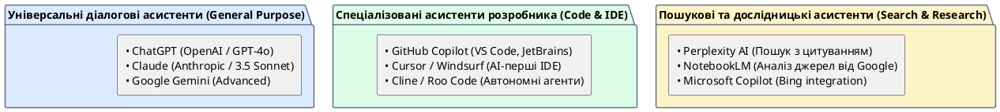

# Сучасні AI-асистенти

::card-group

::card{title="🎯 Мета розділу" icon="i-lucide-target"}

- Ознайомитися з основними AI-асистентами, доступними сьогодні.
- Зрозуміти ключові відмінності між ними.
- Навчитися обирати асистент під конкретну задачу.

::

::card{title="🔑 Ключові терміни" icon="i-lucide-key"}

- **ChatGPT:** AI-асистент від OpenAI, побудований на моделях GPT.
- **Google Gemini:** AI-асистент від Google, інтегрований з екосистемою Google.
- **Claude:** AI-асистент від Anthropic, відомий увагою до безпеки та якості тексту.
- **Microsoft Copilot:** AI-асистент від Microsoft, інтегрований з Office та Bing.

::

::

{.diagram-img}

::plant-uml{alt="Екосистема сучасних AI-асистентів"}



::

---

## ChatGPT (OpenAI)

**ChatGPT** — найпопулярніший AI-асистент, який фактично започаткував ера масового використання генеративного AI (листопад 2022). Побудований на моделях GPT (Generative Pre-trained Transformer).

**Сильні сторони:** найбільша екосистема плагінів, здатність аналізувати зображення та файли, генерація зображень (DALL·E), широкий діапазон задач.

**Доступ:** [chat.openai.com](https://chat.openai.com) — безкоштовна версія + платна підписка.

---

## Google Gemini

**Google Gemini** — AI-асистент від Google, інтегрований з екосистемою Google (Gmail, Docs, Search, YouTube).

**Сильні сторони:** доступ до актуальної інформації через пошук Google, інтеграція з Google Workspace, мультимодальність (текст + зображення + відео).

**Доступ:** [gemini.google.com](https://gemini.google.com) — безкоштовна версія + платна.

---

## Claude (Anthropic)

**Claude** — AI-асистент від Anthropic, створений з особливою увагою до безпеки та відповідального використання AI.

**Сильні сторони:** якість довгих текстів, велике контекстне вікно, точне дотримання інструкцій, чесність щодо обмежень.

**Доступ:** [claude.ai](https://claude.ai) — безкоштовна версія + платна.

---

## Microsoft Copilot

**Microsoft Copilot** — AI-асистент від Microsoft, інтегрований з Windows, Office 365 та Bing.

**Сильні сторони:** інтеграція з Microsoft Office (Word, Excel, PowerPoint), доступ до пошуку Bing, генерація зображень.

**Доступ:** [copilot.microsoft.com](https://copilot.microsoft.com) — безкоштовна версія.

---

## Інші AI-асистенти

Ринок AI-асистентів швидко зростає. Серед інших помітних інструментів:

- **Perplexity AI** — AI-пошуковик із посиланнями на джерела.
- **DeepSeek** — AI-асистент із відкритими моделями.
- **GitHub Copilot** — AI-асистент для програмування, інтегрований в IDE.
- **Cursor** — IDE із вбудованим AI для розробки.

---

## Порівняння AI-асистентів

| Критерій | ChatGPT | Gemini | Claude | Copilot |
|---|---|---|---|---|
| Якість тексту | ⭐⭐⭐⭐⭐ | ⭐⭐⭐⭐ | ⭐⭐⭐⭐⭐ | ⭐⭐⭐⭐ |
| Актуальність інформації | ⭐⭐⭐ | ⭐⭐⭐⭐⭐ | ⭐⭐⭐ | ⭐⭐⭐⭐ |
| Генерація коду | ⭐⭐⭐⭐⭐ | ⭐⭐⭐⭐ | ⭐⭐⭐⭐⭐ | ⭐⭐⭐⭐ |
| Безкоштовний доступ | ✅ | ✅ | ✅ | ✅ |
| Робота з файлами | ✅ | ✅ | ✅ | Обмежена |
| Генерація зображень | ✅ (DALL·E) | ✅ | ❌ | ✅ |

::tip
Не обирайте «один найкращий» AI-асистент. AI Native Developer використовує різні інструменти для різних задач: ChatGPT для генерації ідей, Claude для довгих текстів та коду, Gemini для пошуку актуальної інформації, Perplexity для дослідження з джерелами.
::

---

## Практичні завдання

::::accordion

:::accordion-item{label="📋 Завдання: Порівняйте AI-асистентів на практиці" icon="i-lucide-clipboard-list"}

Задайте **один і той самий запит** у двох різних AI-асистентах і порівняйте результати:

```
Поясни студенту коледжу, що таке API (Application Programming Interface).
Вимоги:
- Почни з простої аналогії з повсякденного життя
- Потім дай технічне визначення (2 речення)
- Наведи 3 приклади API, з якими студент може стикатися щодня
- Обсяг: не більше 150 слів
```

Порівняйте:
1. Яку аналогію обрав кожен AI?
2. Чия відповідь зрозуміліша?
3. Хто краще дотримався обмеження обсягу?
4. Де є фактичні неточності?

:::

::::

---

## Запитання для самоконтролю

::::accordion

:::accordion-item{label="❓ Чому варто використовувати кілька AI-асистентів?" icon="i-lucide-help-circle"}

Кожен AI-асистент має свої сильні та слабкі сторони, оскільки вони побудовані на різних моделях, навчені на різних даних та оптимізовані для різних задач. Використання кількох AI дозволяє: порівнювати відповіді для виявлення помилок, обирати найкращий результат для конкретної задачі, та компенсувати обмеження одного інструменту можливостями іншого.

:::

::::
