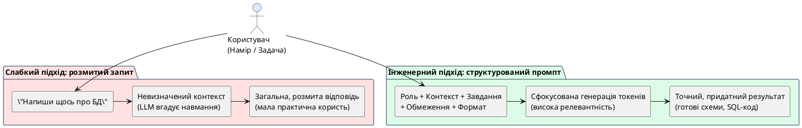

# Промпт як інструмент

::card-group

::card{title="🎯 Мета розділу" icon="i-lucide-target"}

- Зрозуміти, що таке промпт та чому він є ключовим інструментом роботи з AI.
- Усвідомити, що AI працює виключно з тим, що передано в запиті.
- Побачити різницю між загальним запитом та структурованим завданням.
- Зрозуміти, чому формулювання визначає результат.

::

::card{title="🔑 Ключові терміни" icon="i-lucide-key"}

- **Промпт (*Prompt*):** текстовий запит, який користувач надсилає AI-асистенту.
- **Контекст промпта:** додаткова інформація, яка допомагає AI зрозуміти ситуацію та очікування.
- **Намір (*Intent*):** мета, яку користувач хоче досягти за допомогою запиту.
- **Варіативність відповіді:** властивість AI давати різні відповіді на один запит.

::

::

{.diagram-img}

::plant-uml{alt="Промпт як міст між наміром людини та генерацією AI"}



::

---

## Що таке промпт

**Промпт** (*prompt*) — це текстовий запит, інструкція або завдання, яке ви надсилаєте AI-асистенту. Це **єдиний канал комунікації** між вами та AI: все, що AI знає про вашу задачу, він дізнається виключно з промпта.

Промпт може бути простим питанням («Що таке HTML?»), детальною інструкцією з контекстом та обмеженнями, або навіть цілим документом із вхідними даними та шаблоном бажаного результату. Від якості промпта прямо залежить якість відповіді — це фундаментальний принцип, який ми будемо поглиблювати впродовж усього модуля.

---

## Чому AI не вгадує намір користувача

Поширена помилка: очікувати, що AI «зрозуміє, що я мав на увазі». AI не читає думки. Він не знає вашого контексту, вашого рівня знань, вашої ситуації, ваших обмежень. Він працює **виключно** з тим текстом, який ви надіслали.

Уявіть, що ви пишете SMS незнайомій людині з проханням допомогти. Якщо ви напишете «Допоможи з проєктом», людина не зрозуміє: який проєкт? Якого масштабу? Якого типу допомога потрібна? Коли дедлайн? Те саме з AI — чим менше інформації ви надасте, тим менш корисною буде відповідь.

::warning
AI **не має пам'яті** про ваші попередні сесії (у більшості випадків), не знає вашу спеціальність, не бачить ваш екран і не розуміє ваші неявні очікування. Все, що ви хочете врахувати — має бути явно записано в промпті.
::

---

## Відмінність загального запиту від структурованого завдання

Різниця між «запитом» та «завданням для AI» подібна до різниці між «скажи щось розумне» та «напиши доповідь на тему X для аудиторії Y обсягом Z сторінок».

**Загальний запит:**
```
Розкажи про бази даних
```
Результат: довга, загальна стаття, яка може бути як занадто простою, так і занадто складною, без чіткої структури та невідомо для кого написана.

**Структуроване завдання:**
```
Поясни студенту першого курсу коледжу, що таке реляційна база даних.
Включи: визначення (2 речення), аналогію з Excel-таблицею, 3 приклади
реляційних СУБД, та поясни, чому дані зберігають у таблицях, а не у файлах.
Обсяг: до 200 слів. Мова: українська.
```
Результат: цілеспрямована, зрозуміла відповідь з чіткою структурою.

---

## Чому формулювання визначає результат

Один і той самий запит, сформульований по-різному, може дати **кардинально різні** результати. Це не недолік AI — це його природа. AI генерує відповідь на основі того, що написано в промпті. Змінюється промпт — змінюється відповідь.

Це можна порівняти з фотографією: один і той самий пейзаж, знятий з різних ракурсів, при різному освітленні та з різними налаштуваннями камери, дасть абсолютно різні фотографії. Промпт — це ваш «ракурс» на задачу.

---

## Варіативність відповіді та її причини

Як ми вже знаємо з розділу про LLM, AI генерує відповіді на основі ймовірностей. Це означає, що навіть ідентичний промпт може дати різні відповіді при кожному зверненні. Причини:

1. **Стохастичний семплінг:** модель обирає токени з розподілу ймовірностей, і випадковий елемент призводить до варіацій.
2. **Чутливість до формулювання:** незначна зміна в промпті (навіть додавання крапки) може змінити відповідь.
3. **Вплив попереднього контексту:** у рамках одного діалогу попередні повідомлення впливають на наступні відповіді.

::note
Варіативність — це не завжди погано. Для креативних задач (генерація ідей, написання тексту) вона корисна. Для точних задач (отримання фактів, виконання інструкцій) її потрібно мінімізувати через більш точні промпти.
::

---

## Практичні завдання

::::accordion

:::accordion-item{label="📋 Завдання: Від загального до структурованого" icon="i-lucide-clipboard-list"}

Виконайте трансформацію промпта у три кроки:

**Крок 1:** Задайте AI загальний запит:
```
Розкажи про професію програміста
```

**Крок 2:** Задайте структурований запит:
```
Поясни студенту коледжу, що робить програміст у типовий робочий день.
Опиши 5 основних активностей, по 1-2 речення на кожну.
Стиль: дружній, без канцеляризмів. Обсяг: до 150 слів.
```

**Крок 3:** Порівняйте:
- Яка відповідь корисніша?
- Що саме зробило другий промпт ефективнішим?
- Які елементи ви додали (контекст, формат, обмеження)?

:::

:::accordion-item{label="📋 Завдання: Відчуйте варіативність" icon="i-lucide-clipboard-list"}

Задайте AI один і той самий промпт **5 разів** (кожного разу в новому діалозі):

```
Назви один цікавий факт про штучний інтелект. Одне речення.
```

Запишіть усі 5 відповідей. Проаналізуйте:
- Скільки унікальних фактів отримали?
- Чи є повтори?
- Чи всі факти правдиві? (Перевірте хоча б 2)

:::

::::

---

## Запитання для самоконтролю

::::accordion

:::accordion-item{label="❓ Чому промпт — це найважливіший інструмент AI Native Developer?" icon="i-lucide-help-circle"}

Тому що промпт — це єдиний спосіб передати AI ваші наміри, контекст та вимоги. Незалежно від того, наскільки потужна модель, без якісного промпта вона не зможе дати якісний результат. Це як мати найпотужніший комп'ютер, але не вміти формулювати запити до пошукової системи — потужність без навички комунікації марна.

:::

::::
