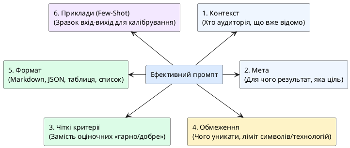

# Принципи створення промптів

::card-group

::card{title="🎯 Мета розділу" icon="i-lucide-target"}

- Засвоїти 9 принципів створення ефективних промптів.
- Зрозуміти, як кожен принцип впливає на якість відповіді AI.
- Навчитися застосовувати принципи в комбінації для різних задач.

::

::card{title="🔑 Ключові терміни" icon="i-lucide-key"}

- **Контекст:** інформація про ситуацію, яку AI не може знати без вас.
- **Перевірюваний критерій:** чіткі умови, за якими можна оцінити якість результату.
- **Ітерація:** покрокове покращення промпта замість повного переписування.
- **Зворотна діагностика:** визначення причини слабкої відповіді через аналіз промпта.

::

::

{.diagram-img}

::plant-uml{alt="Принципи створення ефективних промптів"}



::

---

## Принцип контексту

**Визначити, чого AI не може знати без вас.**

AI не знає вашу ситуацію, аудиторію, обмеження, рівень підготовки. Все це потрібно явно вказати в промпті.

❌ `Напиши вступ до курсової` → AI не знає тему, предмет, рівень, вимоги.

✅ `Напиши вступ до курсової роботи на тему "Вплив соціальних мереж на підлітків" для студента 2 курсу коледжу. Предмет: соціологія. Обсяг: 300-400 слів. Стиль: академічний.`

---

## Принцип мети

**Вказати, навіщо потрібен результат і як він буде використаний.**

Знання мети дозволяє AI адаптувати формат, глибину та стиль відповіді.

❌ `Порівняй React та Angular`

✅ `Порівняй React та Angular для мого навчального проєкту. Мета: обрати фреймворк для першого вебзастосунку. Мій рівень: початківець, знаю базовий JavaScript.`

---

## Принцип перевірюваного критерію

**Умови замість оціночних слів.**

❌ `Напиши хороший текст` — що таке «хороший»?

✅ `Напиши текст, який: містить не більше 100 слів, включає 3 конкретні приклади, написаний простими реченнями (максимум 15 слів у реченні).`

---

## Принцип прикладу

**Показати зразок — щільніше, ніж описати вимогу.**

Замість довгого пояснення формату — покажіть приклад бажаного результату. AI зрозуміє патерн та відтворить його.

---

## Принцип обмеження

**Звузити простір відповіді обсягом, рамками та заборонами.**

Без обмежень AI може генерувати занадто довгі, занадто загальні або нерелевантні відповіді. Обмеження фокусують результат.

Типи обмежень: обсяг (кількість слів), формат (таблиця, список), мова, заборони («не використовуй жаргон», «не згадуй X»).

---

## Принцип однієї задачі

**Один промпт — одна ціль.**

Промпт з кількома різними завданнями часто дає посередній результат для кожного. Краще розбити на окремі промпти.

---

## Принцип адресата

**Рівень підготовки аудиторії задає рівень відповіді.**

Вказівка «поясни для п'ятирічної дитини» та «поясни для досвідченого інженера» дасть принципово різні відповіді на одне питання.

---

## Принцип ітерації

**Уточнюється частина промпта, а не промпт цілком.**

Якщо перша відповідь AI недостатньо якісна — не переписуйте весь промпт. Визначте, який елемент слабкий, і уточніть саме його.

---

## Принцип зворотної діагностики

**Слабка відповідь показує, чого бракувало в промпті.**

Якщо відповідь занадто загальна → бракувало контексту. Занадто довга → бракувало обмежень. Не той стиль → бракувало вказівки на аудиторію. Аналізуйте відповідь, щоб покращити промпт.

---

## Практичні завдання

::::accordion

:::accordion-item{label="📋 Завдання: Застосуйте кожен принцип" icon="i-lucide-clipboard-list"}

Візьміть загальний промпт і покроково покращуйте його, додаючи один принцип за раз:

**Базовий промпт:** `Розкажи про Python`

1. Додайте **контекст:** хто ви, для чого вам ця інформація
2. Додайте **мету:** як ви використаєте відповідь
3. Додайте **обмеження:** обсяг, формат
4. Додайте **адресата:** рівень підготовки
5. Додайте **перевірюваний критерій:** конкретні вимоги до змісту

Задайте AI кожну версію промпта та порівняйте відповіді. Як змінюється якість з кожним доданим принципом?

:::

:::accordion-item{label="📋 Завдання: Зворотна діагностика" icon="i-lucide-clipboard-list"}

Задайте AI свідомо «слабкий» промпт:

```
Напиши щось про технології
```

Отримайте відповідь та проаналізуйте: яких принципів бракує? Створіть таблицю:

| Принцип | Присутній? | Як додати |
|---|---|---|
| Контекст | ❌ | Вказати, хто я та навіщо |
| Мета | ❌ | ... |
| Обмеження | ❌ | ... |
| ... | ... | ... |

Потім створіть покращений промпт із усіма принципами та порівняйте результати.

:::

::::

---

## Запитання для самоконтролю

::::accordion

:::accordion-item{label="❓ Який принцип найважливіший?" icon="i-lucide-help-circle"}

Усі принципи важливі, але **контекст** та **мета** — фундаментальні. Без контексту AI не знає ситуацію, без мети — не знає, що від нього хочуть. Решта принципів (обмеження, приклади, критерії) працюють як тонке налаштування. Проте навіть бездоганний промпт не замінить перевірку результату — принцип зворотної діагностики нагадує про це.

:::

::::
