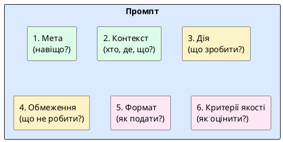

# Структура промпта

::card-group

::card{title="🎯 Мета розділу" icon="i-lucide-target"}

- Засвоїти шість структурних елементів промпта.
- Зрозуміти, які елементи обов'язкові, а які — додаткові.
- Навчитися складати промпт за шаблоном.

::

::card{title="🔑 Ключові терміни" icon="i-lucide-key"}

- **Мета (*Goal*):** що ви хочете отримати від AI.
- **Контекст (*Context*):** фонова інформація для AI.
- **Дія (*Action*):** конкретне завдання для AI.
- **Обмеження (*Constraints*):** рамки та заборони.
- **Формат результату (*Output Format*):** бажана структура відповіді.
- **Критерії якості (*Quality Criteria*):** як оцінити результат.

::

::

---

## Шість елементів промпта

Ефективний промпт — це не випадковий набір слів, а **структуроване завдання** з чіткими елементами. Не кожен промпт потребує всіх шести елементів, але знання повної структури дозволяє усвідомлено обирати, що включити.

{.diagram-img}

::plant-uml{alt="Структура промпта"}



::

**Мета** — навіщо вам цей результат. «Мені потрібен текст для вебсайту коледжу» або «Я хочу зрозуміти різницю між двома технологіями, щоб обрати одну».

**Контекст** — інформація, яку AI не знає без вас: хто ви, для якої аудиторії, в якій ситуації, які обмеження існують.

**Дія** — конкретне завдання: «напиши», «порівняй», «поясни», «знайди помилки», «створи план».

**Обмеження** — рамки: обсяг, заборони, стиль, мова, те, чого не повинно бути у відповіді.

**Формат результату** — бажана структура: таблиця, нумерований список, код, Markdown, JSON.

**Критерії якості** — конкретні вимірювані умови: «кожен пункт — повне речення», «без жаргону», «включає 3 приклади».

---

## Обов'язкові та необов'язкові елементи

| Елемент | Обов'язковість | Коли потрібен |
|---|---|---|
| **Дія** | Завжди | Без дії AI не знає, що робити |
| **Контекст** | Майже завжди | Коли задача потребує розуміння ситуації |
| **Мета** | Часто | Коли результат має бути адаптований під використання |
| **Обмеження** | Часто | Коли потрібна конкретна форма або обсяг |
| **Формат** | За потреби | Коли потрібна структурована відповідь |
| **Критерії якості** | За потреби | Для складних або відповідальних задач |

---

## Розбір готового промпта за елементами

Розберемо реальний промпт на складові:

```
[КОНТЕКСТ] Я студент 2 курсу коледжу, спеціальність "ІПЗ".
[МЕТА] Мені потрібно підготувати коротку презентацію для одногрупників.
[ДІЯ] Створи план презентації на тему "Що таке API".
[ОБМЕЖЕННЯ] 5-7 слайдів, без складних технічних термінів.
[ФОРМАТ] Для кожного слайду: заголовок + 3-4 тези (по 1 реченню).
[КРИТЕРІЇ] Презентація має бути зрозумілою для студентів без досвіду програмування.
```

---

## Практичні завдання

::::accordion

:::accordion-item{label="📋 Завдання: Складіть промпт за шаблоном" icon="i-lucide-clipboard-list"}

Створіть промпт для однієї з цих задач, явно вказавши всі 6 елементів:

1. Пояснення будь-якого поняття з вашого поточного курсу
2. Створення плану навчання на тиждень
3. Порівняння двох мов програмування

Для кожного елемента пишіть його назву в дужках, як у прикладі вище. Задайте промпт AI та оцініть результат.

:::

:::accordion-item{label="📋 Завдання: Визначте елементи в чужому промпті" icon="i-lucide-clipboard-list"}

Прочитайте цей промпт та визначте, які елементи присутні, а яких бракує:

```
Напиши email клієнту про затримку доставки замовлення на 3 дні. Тон: ввічливий,
вибачливий. Запропонуй компенсацію — знижку 10% на наступне замовлення.
```

Заповніть таблицю:

| Елемент | Присутній? | Зміст / Що додати |
|---|---|---|
| Мета | | |
| Контекст | | |
| Дія | | |
| Обмеження | | |
| Формат | | |
| Критерії якості | | |

:::

::::

---

## Запитання для самоконтролю

::::accordion

:::accordion-item{label="❓ Чи потрібно завжди використовувати всі 6 елементів?" icon="i-lucide-help-circle"}

Ні. Для простих запитів достатньо дії та мінімального контексту. Для складних задач з високими вимогами до якості варто використати всі шість. Головне — усвідомлений вибір: ви знаєте, які елементи існують, і свідомо вирішуєте, які включити, а які — ні. Пропустити елемент через незнання та через усвідомлений вибір — це різні речі.

:::

::::
