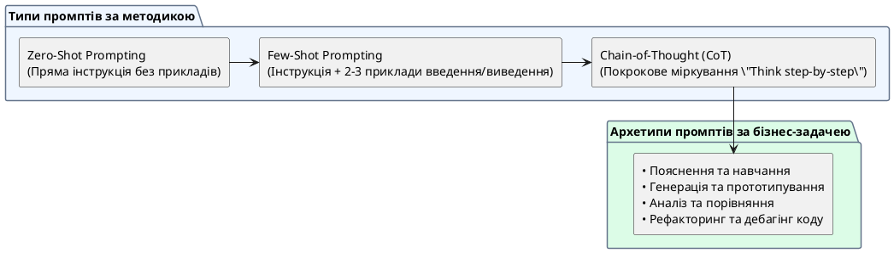

# Види промптів за типом задачі

::card-group

::card{title="🎯 Мета розділу" icon="i-lucide-target"}

- Навчитися обирати тип промпта залежно від задачі.
- Зрозуміти, як тип задачі впливає на структуру промпта.
- Набути практики складання промптів різних типів.

::

::card{title="🔑 Ключові терміни" icon="i-lucide-key"}

- **Промпт для пояснення:** запит на тлумачення поняття або концепції.
- **Промпт для генерації:** запит на створення нового контенту.
- **Промпт для аналізу:** запит на порівняння, оцінку або дослідження.

::

::

{.diagram-img}

::plant-uml{alt="Типологія промптів за завданням"}

::

---

## Типи промптів

Різні задачі вимагають різних промптів. Не існує «універсального промпта» — так само, як не існує «універсального інструмента» в реальному житті.

**Промпт для пояснення:** «Поясни, що таке X» — акцент на контексті адресата та глибині.

**Промпт для генерації:** «Створи / Напиши / Згенеруй X» — акцент на форматі, обмеженнях та критеріях.

**Промпт для опрацювання матеріалу:** «Узагальни / Скороти / Переклади цей текст» — акцент на вхідних даних та бажаному результаті.

**Промпт для аналізу та порівняння:** «Порівняй X та Y / Оціни переваги та недоліки» — акцент на критеріях порівняння.

**Промпт для пошуку помилок:** «Знайди помилки в цьому тексті / коді» — акцент на типі помилок та вхідному матеріалі.

**Промпт для планування:** «Створи план / Розроби стратегію / Визнач кроки» — акцент на меті, обмеженнях та часових рамках.

---

## Як тип задачі змінює склад промпта

| Тип задачі | Ключовий елемент промпта | Приклад |
|---|---|---|
| Пояснення | Адресат + глибина | «Поясни для початківця простою мовою» |
| Генерація | Формат + обмеження | «Напиши 5 варіантів, кожен до 50 слів» |
| Опрацювання | Вхідні дані + дія | «Скороти цей текст до 100 слів, зберігаючи ключові тези» |
| Аналіз | Критерії порівняння | «Порівняй за 5 критеріями у формі таблиці» |
| Пошук помилок | Матеріал + тип помилок | «Знайди граматичні помилки та помилки логіки» |
| Планування | Мета + обмеження | «Створи план на 2 тижні з щоденними задачами» |

---

## Практичні завдання

::::accordion

:::accordion-item{label="📋 Завдання: Створіть промпти кожного типу" icon="i-lucide-clipboard-list"}

На тему «Мова програмування JavaScript» створіть 6 промптів — по одному кожного типу:

1. **Пояснення:** Попросіть пояснити, що таке JavaScript
2. **Генерація:** Попросіть створити приклад коду
3. **Опрацювання:** Надайте текст та попросіть його скоротити
4. **Аналіз:** Попросіть порівняти JavaScript з Python
5. **Пошук помилок:** Надайте код та попросіть знайти помилки
6. **Планування:** Попросіть створити план вивчення JavaScript

Задайте кожен промпт AI та оцініть, який тип дав найкращий результат. Чому?

:::

::::

---

## Запитання для самоконтролю

::::accordion

:::accordion-item{label="❓ Чому один «універсальний» промпт не працює для всіх задач?" icon="i-lucide-help-circle"}

Різні задачі мають різні вимоги до вхідних даних, формату результату та глибини обробки. Промпт для пояснення потребує знання аудиторії, промпт для аналізу — критеріїв порівняння, промпт для генерації — обмежень та формату. Спроба охопити все одним промптом призводить до розмитих, поверхневих результатів.

:::

::::
