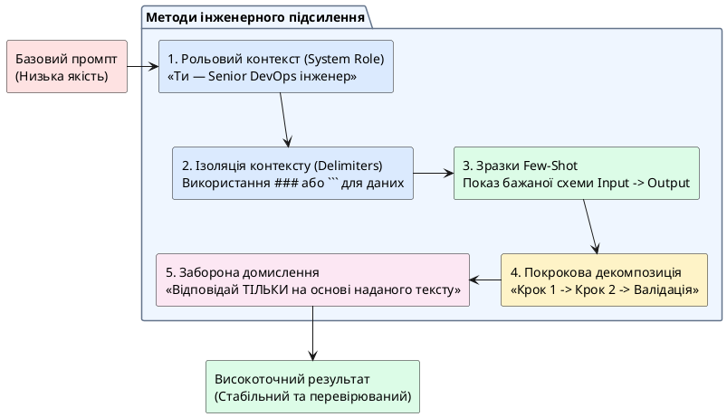

# Прийоми посилення промпта

::card-group

::card{title="🎯 Мета розділу" icon="i-lucide-target"}

- Освоїти техніки, що підвищують якість відповідей AI.
- Навчитися передавати AI вхідні матеріали для обробки.
- Зрозуміти, коли ефективно використовувати приклади, ролі та покрокові інструкції.

::

::card{title="🔑 Ключові терміни" icon="i-lucide-key"}

- **Few-shot prompting:** передача AI кількох прикладів бажаного результату.
- **Role prompting:** вказання ролі для AI (наприклад, «ти — досвідчений редактор»).
- **Chain-of-thought:** прохання до AI «думати покроково».

::

::

{.diagram-img}

::plant-uml{alt="Техніки підсилення якості промпта"}



::

---

## Передача вхідних матеріалів

AI може обробляти не лише ваші запитання, а й **вхідні матеріали**: текст, таблиці, фрагменти коду, дані з файлів. Це значно розширює можливості: замість генерації «з голови» AI працює з конкретним матеріалом.

Формат передачі: вставте матеріал у промпт та чітко вкажіть, що з ним зробити.

---

## Використання прикладів (Few-shot)

Один із найефективніших прийомів — **показати AI приклад** бажаного результату. Модель розпізнає патерн та відтворить його.

---

## Вказання ролі

Прийом «ти — [роль]» може впливати на стиль та глибину відповіді. Наприклад, «ти — досвідчений викладач програмування» дасть інший результат, ніж «ти — маркетолог».

::note
Роль впливає не завжди. Для фактичних запитань вона може не мати ефекту. Для стилістичних та творчих задач — може бути дуже корисною. Експериментуйте.
::

---

## Покрокове завдання

Замість одного великого завдання — розбийте на кроки: «Спочатку зроби X, потім Y, на основі цього — Z». Це допомагає AI структурувати думку та дає якісніший результат для складних задач.

---

## Заборона на домислення

Явна інструкція «не вигадуй дані, яких у тебе немає» або «якщо не знаєш — скажи прямо» допомагає зменшити ризик галюцинацій.

---

## Запит уточнень від AI

Потужний прийом: попросити AI задати вам уточнювальні питання перед виконанням задачі.

```
Я хочу створити вебзастосунок. Перш ніж пропонувати рішення, задай мені 5
уточнювальних питань, щоб краще зрозуміти мої потреби.
```

---

## Практичні завдання

::::accordion

:::accordion-item{label="📋 Завдання: Протестуйте кожен прийом" icon="i-lucide-clipboard-list"}

Оберіть одну тему (наприклад, «бази даних») та протестуйте кожен прийом:

1. **Вхідні матеріали:** Вставте фрагмент тексту з Вікіпедії та попросіть AI створити конспект.
2. **Приклад (few-shot):** Покажіть AI приклад карточки-визначення та попросіть створити ще 5.
3. **Роль:** Попросіть «досвідченого DBA» vs «початківця» пояснити нормалізацію.
4. **Покрокове завдання:** «Спочатку поясни концепцію, потім наведи приклад, потім назви 3 помилки новачків».
5. **Заборона домислень:** «Не вигадуй назви СУБД, яких не існує».
6. **Запит уточнень:** «Перед відповіддю задай мені 3 питання».

Який прийом дав найпомітніше покращення?

:::

::::

---

## Запитання для самоконтролю

::::accordion

:::accordion-item{label="❓ Який прийом найефективніший для зменшення галюцинацій?" icon="i-lucide-help-circle"}

Комбінація двох прийомів: **передача вхідних матеріалів** (AI працює з конкретними даними, а не генерує «з голови») та **заборона на домислення** (явна інструкція визнавати невпевненість). Жоден прийом не усуває галюцинації повністю, але їх комбінація значно знижує ризик.

:::

::::
