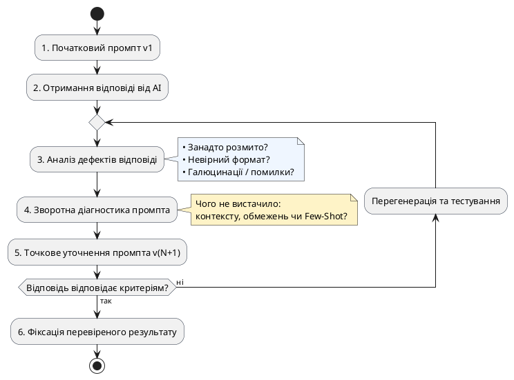

# Розбір і покращення промпта

::card-group

::card{title="🎯 Мета розділу" icon="i-lucide-target"}

- Навчитися аналізувати відповідь AI для покращення промпта.
- Зрозуміти, коли продовжувати діалог, а коли починати новий.
- Опанувати ітеративний підхід до покращення результатів.

::

::card{title="🔑 Ключові терміни" icon="i-lucide-key"}

- **Ітерація промпта:** послідовне покращення запиту на основі аналізу відповіді.
- **Зворотна діагностика:** визначення причини слабкої відповіді через аналіз промпта.

::

::

{.diagram-img}

::plant-uml{alt="Цикл аналізу та оптимізації промпта"}

::

---

## Цикл покращення

Робота з AI рідко буває «один запит — ідеальний результат». Зазвичай це **ітеративний процес**: запит → аналіз відповіді → уточнення → покращена відповідь.

::steps

### Аналіз отриманого результату
Перш ніж покращувати промпт, визначте: що саме не так з відповіддю? Вона занадто загальна? Занадто довга? Не той формат? Є фактичні помилки?

### Визначення слабкого елемента промпта
За принципом зворотної діагностики визначте, якого елемента бракувало: контексту, обмежень, прикладу, формату?

### Уточнення, а не переписування
Не переписуйте весь промпт. Уточніть конкретний аспект: «Скороти відповідь до 100 слів» або «Додай конкретні приклади замість загальних тез».

### Порівняння версій
Порівняйте першу та фінальну версію відповіді. Що покращилось? Що ще можна доробити?

::

---

## Коли продовжувати діалог, а коли починати новий

**Продовжувати діалог:** коли потрібно уточнити деталі, змінити формат, додати інформацію до вже отриманого результату.

**Починати новий:** коли перший підхід був принципово невірним, коли накопичився надто великий контекст, або коли ви хочете отримати «свіжий погляд» без впливу попередніх повідомлень.

---

## Практичні завдання

::::accordion

:::accordion-item{label="📋 Завдання: Ітеративне покращення за 5 кроків" icon="i-lucide-clipboard-list"}

Починаючи з мінімального промпта, покращуйте його за 5 ітерацій:

**Ітерація 1:** `Напиши про Git`
**Ітерація 2:** Додайте контекст та аудиторію
**Ітерація 3:** Додайте формат та обмеження
**Ітерація 4:** Уточніть на основі отриманої відповіді
**Ітерація 5:** Фінальне полірування

Для кожної ітерації: запишіть промпт, отримайте відповідь, проаналізуйте, що покращити. Збережіть всі 5 версій промпта та відповідей для порівняння.

:::

::::

---

## Запитання для самоконтролю

::::accordion

:::accordion-item{label="❓ Чому уточнення ефективніше за повне переписування промпта?" icon="i-lucide-help-circle"}

Повне переписування скидає весь прогрес — ви починаєте з нуля. Уточнення фокусується на конкретному недоліку, зберігаючи все, що вже працювало. Крім того, уточнення розвиває навичку діагностики: ви вчитесь визначати конкретну причину проблеми, а не просто «щось не так».

:::

::::
