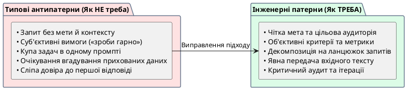

# Типові помилки під час створення промптів

::card-group

::card{title="🎯 Мета розділу" icon="i-lucide-target"}

- Навчитися розпізнавати типові помилки у промптах.
- Зрозуміти, чому кожна помилка призводить до слабкого результату.
- Виробити навичку самоперевірки промптів перед відправкою.

::

::card{title="🔑 Ключові терміни" icon="i-lucide-key"}

- **Оціночна вимога:** нечітке формулювання типу «зроби добре», «напиши цікаво».
- **Мультизадачність промпта:** кілька різних завдань в одному запиті.
- **Прийняття першої відповіді:** використання результату AI без аналізу.

::

::

{.diagram-img}

::plant-uml{alt="Антипатерни складання промптів"}

::

---

## Сім типових помилок

**1. Промпт без мети.** AI не знає, навіщо вам результат. Наслідок: загальна, нецілеспрямована відповідь.

**2. Промпт без контексту.** AI не знає ситуацію. Наслідок: відповідь, не адаптована під ваші потреби.

**3. Оціночні вимоги замість перевірюваних.** «Напиши цікаво» — що таке «цікаво»? Для кого? Замість цього: «включи 3 несподіваних факти та використай короткі речення (до 15 слів)».

**4. Кілька задач в одному промпті.** «Напиши статтю, зроби переклад, створи ілюстрації та підготуй план презентації» — AI розпорошить увагу і зробить все посередньо.

**5. Відсутність формату результату.** Без вказівки формату AI обере його сам — і він може не відповідати вашим очікуванням.

**6. Очікування, що AI знає відсутні дані.** «Напиши відгук про наш продукт» — AI не знає вашого продукту, якщо ви не надали опис.

**7. Прийняття першої відповіді без аналізу.** Перша відповідь рідко ідеальна. Без аналізу ви ризикуєте використати неточну або неповну інформацію.

---

## Практичні завдання

::::accordion

:::accordion-item{label="📋 Завдання: Знайдіть і виправте помилки" icon="i-lucide-clipboard-list"}

Нижче — 5 промптів з помилками. Для кожного: визначте помилку та запропонуйте виправлений варіант.

1. `Напиши щось корисне для студентів`
2. `Поясни квантову фізику, створи презентацію, напиши тест і підготуй план курсу`
3. `Зроби цей текст кращим` (без тексту)
4. `Напиши красивий код`
5. `Розкажи про наш проєкт для інвесторів`

Після виправлення задайте обидві версії (з помилкою та виправлену) AI та порівняйте результати.

:::

::::

---

## Запитання для самоконтролю

::::accordion

:::accordion-item{label="❓ Яка помилка найнебезпечніша і чому?" icon="i-lucide-help-circle"}

**Прийняття першої відповіді без аналізу** — найнебезпечніша, бо навіть ідеальний промпт не гарантує безпомилкову відповідь. AI може впевнено генерувати помилкову інформацію. Без критичного аналізу ви поширюєте помилки далі: у навчальну роботу, код, документацію. Усі інші помилки впливають на якість відповіді, але ця — на якість вашого рішення.

:::

::::
