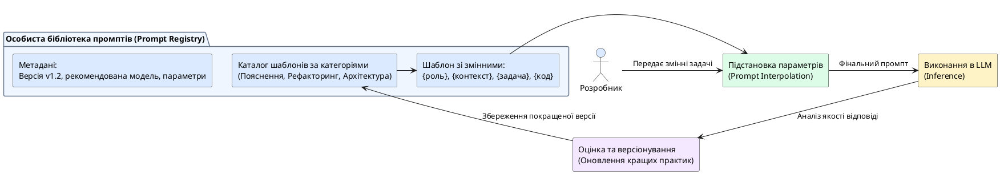

# Практикум: особиста бібліотека промптів

::card-group

::card{title="🎯 Мета розділу" icon="i-lucide-target"}

- Створити власний промпт для реальної задачі, застосувавши всі вивчені принципи.
- Пройти процес взаємної перевірки та покращення промптів.
- Почати формування особистої бібліотеки промптів-шаблонів.

::

::card{title="🔑 Ключові терміни" icon="i-lucide-key"}

- **Бібліотека промптів (*Prompt Library*):** колекція перевірених шаблонів промптів для повторного використання.
- **Шаблон промпта (*Prompt Template*):** заготовка промпта зі змінними полями для адаптації під конкретну задачу.
- **Peer Review:** взаємна перевірка промптів у парах для виявлення помилок та покращення якості.

::

::

{.diagram-img}

::plant-uml{alt="Життєвий цикл шаблонів бібліотеки промптів"}



::

---

## Чому потрібна бібліотека промптів

Створення якісного промпта вимагає часу та роздумів. Щоразу писати промпт з нуля — неефективно. **Бібліотека промптів** — це ваша особиста колекція перевірених шаблонів, які ви використовуєте повторно, адаптуючи під конкретну задачу.

Це як бібліотека функцій у програмуванні: замість того щоб щоразу писати код з нуля, ви використовуєте готові, протестовані рішення.

---

## Структура шаблону промпта

Кожен шаблон у вашій бібліотеці має містити:

| Поле | Опис |
|---|---|
| **Назва** | Коротка назва шаблону (наприклад, «Пояснення концепції») |
| **Задача** | Для якого типу задач цей шаблон |
| **Шаблон** | Текст промпта зі змінними у фігурних дужках: {тема}, {аудиторія} |
| **Умови застосування** | Коли використовувати та коли НЕ використовувати |
| **Приклад** | Конкретний приклад заповненого шаблону |

---

## Приклади шаблонів

**Шаблон: Пояснення концепції**
```
Поясни {концепція} для {аудиторія}.
Контекст: {навіщо потрібно це знати}.
Вимоги:
- Почни з аналогії з повсякденного життя
- Дай технічне визначення (2 речення)
- Наведи {кількість} практичних прикладів
- Обсяг: до {кількість} слів
- Мова: українська
```

**Шаблон: Порівняння технологій**
```
Порівняй {технологія_1} та {технологія_2} для {контекст_використання}.
Мій рівень: {рівень_досвіду}.
Критерії порівняння: {критерій_1}, {критерій_2}, {критерій_3}.
Формат: таблиця + висновок (3-4 речення з рекомендацією).
```

---

## Практичні завдання

::::accordion

:::accordion-item{label="📋 Завдання: Створіть 5 шаблонів для бібліотеки" icon="i-lucide-clipboard-list"}

Створіть 5 шаблонів промптів для задач, які ви виконуєте регулярно:

1. **Навчання:** пояснення нової теми
2. **Робота з кодом:** генерація або пояснення коду
3. **Письмо:** створення тексту (email, звіт, конспект)
4. **Аналіз:** порівняння варіантів для прийняття рішення
5. **Планування:** створення плану роботи

Для кожного шаблону: заповніть таблицю (назва, задача, шаблон, умови, приклад), потім протестуйте шаблон з AI та за потреби покращіть.

:::

:::accordion-item{label="📋 Завдання: Peer Review промптів" icon="i-lucide-clipboard-list"}

Обміняйтесь шаблонами промптів з одногрупником. Для кожного шаблону колеги:

1. Задайте промпт AI та оцініть результат
2. Визначте, які принципи дотримані, а які — ні
3. Запропонуйте 2-3 покращення
4. Поверніть зворотний зв'язок автору

Після отримання зворотного зв'язку — покращіть свої шаблони та збережіть фінальні версії.

:::

::::

---

## Запитання для самоконтролю

::::accordion

:::accordion-item{label="❓ Навіщо зберігати промпти, якщо можна створити новий?" icon="i-lucide-help-circle"}

Тому що якісний промпт — це результат кількох ітерацій, аналізу та покращення. Щоразу починати з нуля — це втрата часу та знань. Бібліотека промптів зберігає ваш досвід, дозволяє швидко адаптувати перевірені шаблони під нові задачі та систематично покращувати якість взаємодії з AI.

:::

::::
