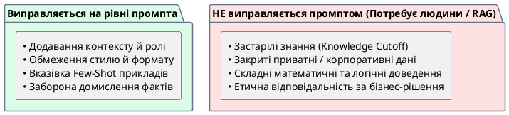

# Межі можливостей AI

::card-group

::card{title="🎯 Мета розділу" icon="i-lucide-target"}

- Чітко розрізняти проблеми, які вирішуються покращенням промпта, від фундаментальних обмежень AI.
- Зрозуміти природу неповних та помилкових відповідей.
- Усвідомити, що AI не має доступу до закритих та внутрішніх даних.

::

::card{title="🔑 Ключові терміни" icon="i-lucide-key"}

- **Knowledge Cutoff:** дата, після якої модель не має інформації.
- **Обмеження моделі:** фундаментальні властивості AI, які не залежать від промпта.
- **Виправна промптом (*Prompt-fixable*):** проблема, яку можна вирішити зміною формулювання запиту.

::

::

{.diagram-img}

::plant-uml{alt="Діагностика меж можливостей AI"}

::

---

## Що виправляється промптом, а що ні

| Проблема | Виправляється промптом? | Рішення |
|---|---|---|
| Занадто загальна відповідь | ✅ Так | Додати контекст та обмеження |
| Не той формат | ✅ Так | Явно вказати формат |
| Занадто довго / коротко | ✅ Так | Вказати обсяг |
| Вигадані факти (галюцинація) | ❌ Частково | Зменшити ризик, але не усунути |
| Застаріла інформація | ❌ Ні | Перевірити з актуальних джерел |
| Закриті / внутрішні дані | ❌ Ні | Надати дані в промпті або не використовувати AI |
| Розуміння контексту бізнесу | ❌ Ні | Людське судження |

---

## Неповні, застарілі та закриті дані

AI не всезнаючий. Його знання обмежені навчальними даними, які мають **часове обмеження** (*knowledge cutoff*), не включають приватну інформацію та можуть бути неповними в спеціалізованих областях.

::warning
AI не має доступу до: вашої корпоративної документації, внутрішніх баз даних, конфіденційних даних клієнтів, новин після дати навчання. Не очікуйте від нього знань, яких він не може мати.
::

---

## Практичні завдання

::::accordion

:::accordion-item{label="📋 Завдання: Знайдіть межі AI" icon="i-lucide-clipboard-list"}

Задайте AI серію запитів, спрямованих на виявлення меж:

1. Запитайте про подію, що відбулася минулого тижня
2. Запитайте про внутрішню інформацію вашого коледжу (наприклад, розклад конкретної групи)
3. Задайте вузькоспеціалізоване запитання з рідкісної теми
4. Попросіть вирішити задачу, що вимагає «здорового глузду»

Для кожної відповіді визначте: це обмеження, яке можна подолати кращим промптом, чи фундаментальна межа?

:::

::::

---

## Запитання для самоконтролю

::::accordion

:::accordion-item{label="❓ Чому важливо розрізняти «виправляється промптом» та «не виправляється»?" icon="i-lucide-help-circle"}

Якщо проблема виправляється промптом — покращуйте промпт. Якщо ні — шукайте інший інструмент або джерело інформації. Спроба «виправити» фундаментальне обмеження кращим промптом — марна трата часу і, що гірше, може створити хибне відчуття впевненості у неправильній відповіді.

:::

::::
