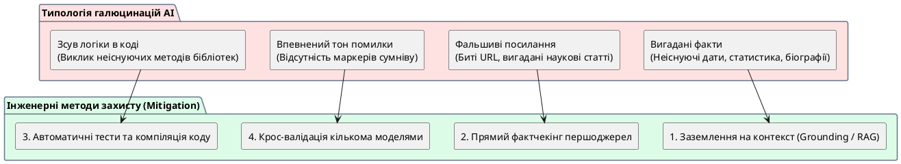

# Галюцинації AI

::card-group

::card{title="🎯 Мета розділу" icon="i-lucide-target"}

- Зрозуміти, що таке галюцинація AI та чому вона виникає.
- Навчитися розпізнавати типові прояви галюцинацій.
- Усвідомити, що жоден промпт не усуває ризик галюцинацій повністю.

::

::card{title="🔑 Ключові терміни" icon="i-lucide-key"}

- **Галюцинація (*Hallucination*):** впевнене генерування AI фактично невірної інформації.
- **Конфабуляція:** «заповнення прогалин» вигаданими, але правдоподібними деталями.

::

::

{.diagram-img}

::plant-uml{alt="Типи галюцинацій та методи захисту"}



::

---

## Що таке галюцинація AI

**Галюцинація AI** — це ситуація, коли AI генерує інформацію, яка виглядає правдоподібно та впевнено, але є **фактично невірною**. Модель не «бреше» — вона не має поняття «правда» чи «неправда». Вона генерує статистично правдоподібні послідовності слів.

---

## Типи галюцинацій

**Вигадані факти.** AI може назвати дату, статистику або подію, яких не існує. Наприклад: «Згідно з дослідженням Оксфордського університету 2023 року...» — дослідження може не існувати.

**Вигадані джерела.** AI може «процитувати» наукову статтю з правдоподібними автором, назвою та журналом — але жодного з них не існує.

**Неіснуючі посилання.** URL-адреси, згенеровані AI, часто ведуть на неіснуючі сторінки.

**Впевнено сформульовані помилки.** AI формулює неправильну інформацію з тією ж впевненістю, що й правильну. Немає «маркерів невпевненості».

::caution
Найнебезпечніше в галюцинаціях — їх **правдоподібність**. Вигаданий факт може бути оточений правильною інформацією, що робить його виявлення складним. Особливо небезпечно для людей, які не мають глибоких знань у предметній області.
::

---

## Чому промпт не захищає від галюцинацій

Навіть ідеальний промпт із заборонами «не вигадуй» та «будь чесним щодо невпевненості» **не усуває галюцинації повністю**. Модель не «вирішує» вигадувати — вона генерує токени з розподілу ймовірностей. Якщо правдоподібна, але неправильна відповідь має вищу ймовірність, модель її згенерує.

Промпт може **знизити ризик** (наприклад, «посилайся тільки на джерела, в яких впевнений» або «скажи, якщо не знаєш»), але не усунути його повністю.

---

## Практичні завдання

::::accordion

:::accordion-item{label="📋 Завдання: Спровокуйте та виявіть галюцинацію" icon="i-lucide-clipboard-list"}

1. Задайте AI запит про вигаданий предмет:
```
Розкажи про книгу "Кристалічні мережі свідомості" автора Олександра Сковороди.
Включи: рік видання, основні тези, рецензії критиків.
```

2. Проаналізуйте відповідь: чи визнав AI, що такої книги не існує, чи «вигадав» деталі?

3. Потім задайте коректний запит про реальну книгу та порівняйте рівень впевненості у відповідях.

4. Задайте AI запит на посилання:
```
Назви 3 наукові статті про вплив AI на освіту. Для кожної: автори, рік, журнал.
```

Перевірте: чи існують ці статті? Пошукайте їх у Google Scholar.

:::

::::

---

## Запитання для самоконтролю

::::accordion

:::accordion-item{label="❓ Якщо AI може галюцинувати, чи варто його взагалі використовувати?" icon="i-lucide-help-circle"}

Безумовно так, але з перевіркою. Галюцинації — це ризик, а не привід для відмови від інструменту. Автомобіль може потрапити в ДТП, але це не означає, що не варто їздити — потрібно дотримуватися правил безпеки. Так само з AI: використовуйте його для генерації ідей, чернеток та структур, але завжди перевіряйте фактичну інформацію через незалежні джерела.

:::

::::
